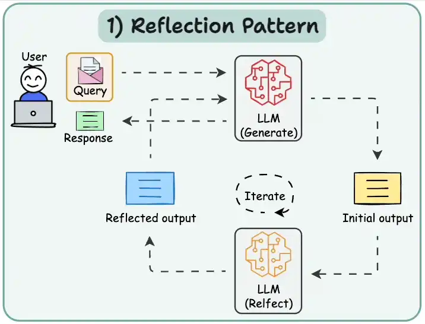
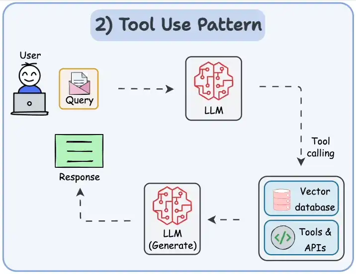
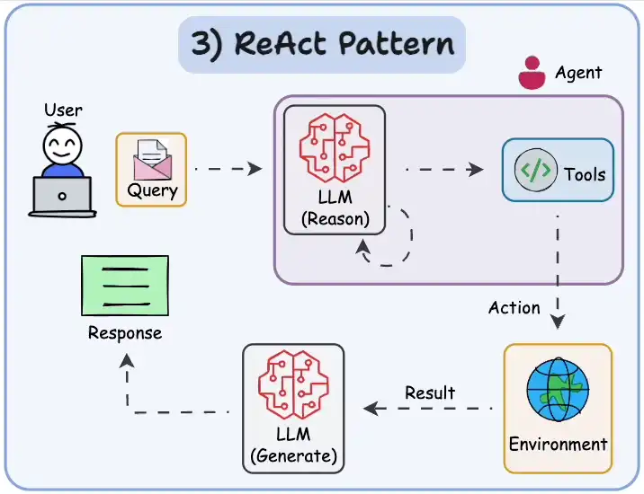
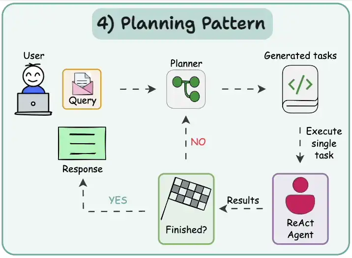
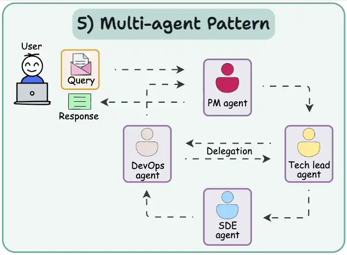
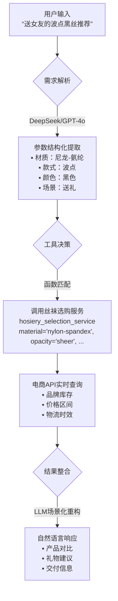
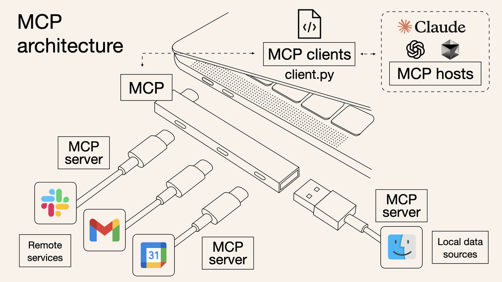
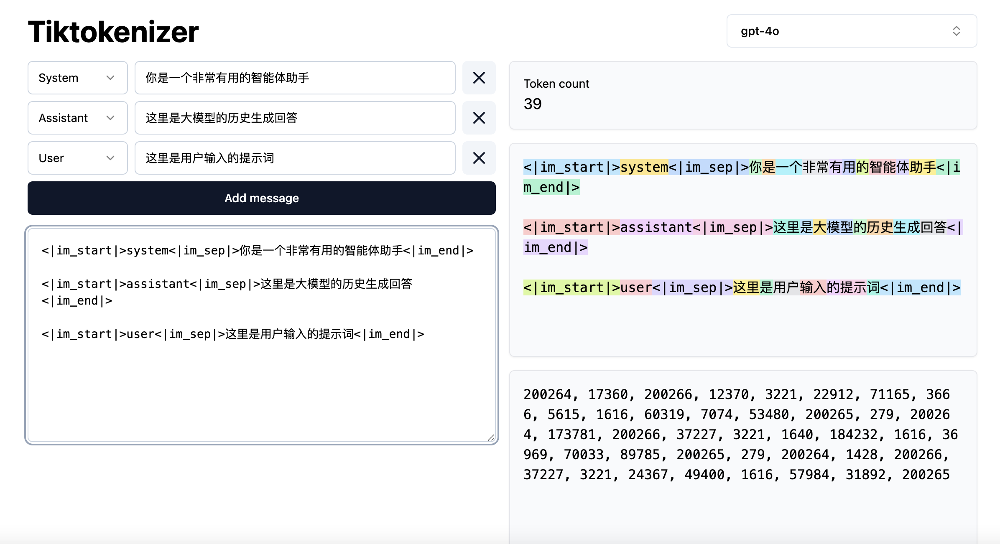
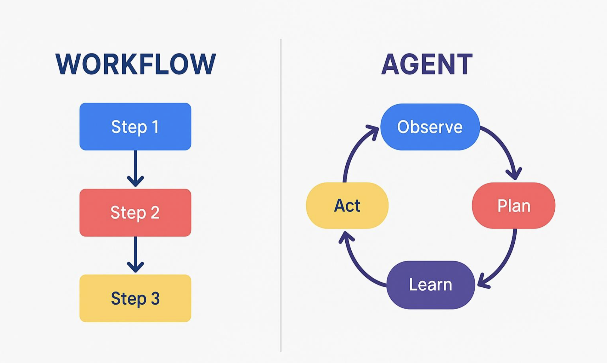

# 目录

- [1.什么是AI Agent（智能体）？](#1.什么是AI-Agent（智能体）？)
- [2.AI Agent的主流设计模式有哪些？](#2.AI-Agent的主流设计模式有哪些？)
- [3.什么是AI Agent中的function call？](#3.什么是AI-Agent中的function-call？)
- [4.什么是AI Agent中的MCP（Model Context Protocol）？](#4.什么是AI-Agent中的MCP（Model Context Protocol）？)
- [5.AI Agent中function call和MCP的区别是什么？](#5.AI-Agent中function-call和MCP的区别是什么？)
- [6.AI Agent中的Agent2Agent(A2A)？](#6.AI-Agent中的Agent2Agent(A2A)？)
- [7.AI Agent中的A2A和MCP的区别是什么？](#7.AI-Agent中的A2A和MCP的区别是什么？)
- [8.当前AI Agent中的主流核心大模型有哪些？](#8.当前AI-Agent中的主流核心大模型有哪些？)
- [9.AI Agent中的系统提示词有哪些作用？](#9.AI-Agent中的系统提示词有哪些作用？)
- [10.在AI Agent中如何构建强大的系统提示词？](#10.在AI-Agent中如何构建强大的系统提示词？)
- [11.System Prompt在AI Agent内部是如何生效的？](#11.System-Prompt在AI-Agent内部是如何生效的？)
- [12.AI-Search和普通Search有什么区别？](#12.AI-Search和普通Search有什么区别)
- [13.什么是DeepSearch？](#13.什么是DeepSearch？)
- [14.AI Agent和AI Workflow的区别在哪里？](#14.AI-Agent和AI-Workflow的区别在哪里？)
- [15.在AI Agent中，function call如何把外部工具变成大模型可以理解的方式？](#15.在AI-Agent中，function-call如何把外部工具变成大模型可以理解的方式？)
- [16.在AI Agent中，大模型如何学习到Function Calling能力？](#16.在AI-Agent中，大模型如何学习到Function-Calling能力？)
- [17.当前AI Agent有哪些局限性？](#17.当前AI-Agent有哪些局限性？)
- [18.当前AI Agent有哪些主流的评价指标？](#18.当前AI-Agent有哪些主流的评价指标？)
- [19.AI Agent如何具备长期记忆能力？](#19.AI-Agent如何具备长期记忆能力？)
- [20.介绍一下AI Agent中的记忆机制的原理与作用](#20.介绍一下AI-Agent中的记忆机制的原理与作用)
- [21.介绍一下AI Agent的上下文工程的原理](#21.介绍一下AI-Agent的上下文工程的原理)
- [22.目前主流的AI Agent框架有哪些？](#22.目前主流的AI-Agent框架有哪些？)
- [23.目前主流的AI Agent中包含哪些核心模块？](#23.目前主流的AI-Agent中包含哪些核心模块？)
- [24.AI Agent中Memory和RAG有哪些区别？](#24.AI-Agent中Memory和RAG有哪些区别？)
- [25.AI Agent中Agents、Teams、Worflows三者有哪些区别？](#25.AI-Agent中Agents、Teams、Worflows三者有哪些区别？)
- [26.介绍一下AI Agent中AgentOS的核心概念](#26.介绍一下AI-Agent中AgentOS的核心概念)
- [27.什么是AI Agent系统中子Agent动态加载？](#27.什么是AI-Agent系统中子Agent动态加载？)
- [28.用于存储AI Agent长期记忆的主流数据库有哪些？](#28.用于存储AI-Agent长期记忆的主流数据库有哪些？)
- [29.AI Agent中记忆机制包含哪些核心组件？](#29.AI-Agent中记忆机制包含哪些核心组件？)
- [30.AI Agent中记忆机制运行的核心流程是什么样的？](#30.AI-Agent中记忆机制运行的核心流程是什么样的？)
- [31.介绍一下AI Agent中Pre-hook（前置钩子）的作用](#31.介绍一下AI-Agent中Pre-hook（前置钩子）的作用)
- [32.当前主流的AI Agent中Memory机制有哪些细分记忆概念？](#32.当前主流的AI-Agent中Memory机制有哪些细分记忆概念？)
- [33.MCP服务支持的传输协议有哪些？各传输协议的性能如何？](#33.MCP服务支持的传输协议有哪些？各传输协议的性能如何？)
- [34.Memory机制设计的核心目标是什么？解决了AI Agent内存管理的哪些痛点？](#34.Memory机制设计的核心目标是什么？解决了AI-Agent内存管理的哪些痛点？)
- [35.Memory机制如何实现跨Agent的记忆复用？](#35.Memory机制如何实现跨Agent的记忆复用？)
- [36.如果要将Memory机制构建到商业级AI Agent系统中，需要考虑哪些工程化问题？](#36.如果要将Memory机制构建到商业级AI-Agent系统中，需要考虑哪些工程化问题？)
- [37.AI Agent系统中主流的Memory机制的工作流程是什么样的？](#37.AI-Agent系统中主流的Memory机制的工作流程是什么样的？)
- [38.AI Agent系统中出现上下文窗口溢出时的主流解决方案有哪些？](#38.AI-Agent系统中出现上下文窗口溢出时的主流解决方案有哪些？)
- [39.介绍一下AI Agent系统中Skills的原理和作用](#39.介绍一下AI-Agent系统中Skills的原理和作用)
- [40.AI Agent系统中Memory机制万变不离其宗的核心功能有哪些？](#40.AI-Agent系统中Memory机制万变不离其宗的核心功能有哪些？)


<h2 id="1.什么是AI-Agent（智能体）？">1.什么是AI Agent（智能体）？</h2>

**在AIGC时代，Rocky认为AI Agent是一个非常重要的方向，也是AIGC技术发展的大势所趋。**

那么，AI Agent到底是什么呢？

Rocky首先给大家讲解一下非AI Agent（Non-Agent），即常规AIGC大模型的运行逻辑，然后我们就能从两者的对比中恍然大悟。

我们以经典的文本内容创作为例子🌰，**非智能体、智能体以及人类创作者的工作流呈现显著差异：**

| **主体类型**   | **执行特征**                                                                 | **流程剖析**                                                                 |
|----------------|-----------------------------------------------------------------------------|-----------------------------------------------------------------------------|
| **Non-Agent（非智能体）**   | 线性单次输出                                                                | 用户输入提示词→大模型直接生成终稿（无迭代过程）                                |
| **AI Agent（智能体）**     | 多阶段认知闭环                                                              | 规划大纲→检索资料→生成初稿→自检修订→循环优化→输出终稿（模拟人类创作思维）         |
| **人类创作者** | 认知驱动型工作流                                                            | 构思框架→信息搜集→内容填充→交叉审核→反复润色（与智能体流程高度同构）              |


**我们可以发现：AI Agent的核心是通过任务解构-执行-反思的认知闭环，实现对人类工作范式的数字孪生。**


**AI行业大牛吴恩达认为，AI Agent的终极演进方向是构建具备完整认知能力的数字主体**，其技术架构可解构为四大核心能力：

1. **反思（Reflection）**：AI Agent模拟人类自我修正行为，如同学生完成作业后的自主检查过程。突破单次推理局限，建立错误检测-反馈-修正的增强回路。在代码生成、法律文书等高精度需求场景实现质量跃升。
2. **工具调用（Tool use）**：AI Agent判定自身能力边界，选择合适的AI工具（AI服务/搜索引擎/专业数据库等）来提升大模型的能力边界。
3. **规划（Planning）**：AI Agent在解决复杂问题时，为到达目标制定合理的行动计划的能力，从而对任务进行拆解。
4. **多智能体协作（Multi-agent collaboration）**：多个AI Agent的组合应用，我们可以畅想当每个用户可配置专属AI团队（产品经理Agent+工程师Agent+测试Agent+商务市场Agent等），传统生产模式将被重构。


我们都知道自动驾驶领域对技术级别有L1-L5之分，级别越高代表越向无人驾驶靠近。**在AIGC时代，我们可以对AIGC技术的能力演进路径进行级别划分，同样可构建五个级别：**

| **层级** | **能力定位**       | **人机协作范式**                                                                 | **演进状态**          |  
|----------|--------------------|---------------------------------------------------------------------------------|---------------------|  
| **L1**   | 基础工具（Tool）        | 用户独立完成全流程，系统无显性AI能力                                            | 技术替代进程中      |  
| **L2**   | 对话辅助（Chatbot）         | 用户主导执行，AI提供信息参考（如知识检索、建议生成）                                | 基础应用形态        |  
| **L3**   | 协同创作（Copilot）        | 人机任务共担：用户设定目标→AI生成初稿→用户修正确认                                | 当前核心价值区      |  
| **L4**   | 智能体（AI Agent）      | 用户定义目标与资源，AI自主实现任务拆解、工具调度、过程管控的全闭环                  | 近通用AGI临界点     |  
| **L5**   | 通用智能（Intelligence）         | 系统自驱完成目标定义、资源获取、工具调用及结果交付                                | 理论发展阶段        |  

当前AI Agent的核心还是基于LLM大模型+深度的Prompts工程，**Rocky认为未来AI Agent会有更多内涵，比如：**
1. AI Agent中的核心大模型可能是基于AIGC多模态大模型构建的。
2. AI Agent中会包含更多的模态能力，比如图像、视频、音频、数字人等。
3. 会有基于AI Agent为核心的爆款AIGC产品问世。
4. 基于AI Agent的AI算法解决方案会在各行各业落地，重构各行各业的业务形态。


<h2 id="2.AI-Agent的主流设计模式有哪些？">2.AI Agent的主流设计模式有哪些？</h2>

**当前主流的AI Agent（Manus、Deep Research等）都是基于LLM大模型 + 一整套AIGC算法解决方案(Prompts工程、Function Call、MCP、AI工程策略、AI功能服务等)构建而成**，同时未来还会持续扩展延伸其内涵。

基于上面的框架，接着再形成了5种主流的AI Agent设计模式：

1. **反射模式（Reflection pattern）**：这个模式的**核心运作机制是构建自检-纠错迭代环**，AI Agent会审查其工作以发现错误并迭代，直到生成最终输出结果。



2. **工具使用模式（Tool use pattern）**：AI Agent允许LLM大模型通过使用外部工具获得更多信息，包括调用API、使用AI服务、查询矢量数据库、执行Python脚本等。**这使得LLM大模型不仅仅依赖于其内部知识，还可以获得互联网世界的庞大实时数据流来扩展知识边界**。



3. **ReAct模式（Reason and Act）**：**ReAct模式结合了反射模式和工具使用模式**，这使其成为当前AI Agent使用的最强大的模式之一。AI Agent既可以自我思考，自我纠错，还可以使用工具与世界交互。



4. **规划模式（Planning pattern）**：在这种模式下，**AI Agent根据任务的复杂程度，设计任务计划流程，对任务进行细分，再对细分子任务动用ReAct 模式进行处理**。可以说这种模式是一种战略思维，可以更有效地解决战略级复杂任务。



5. **多智能体模式（Multi-agent pattern）**：在这个模式中，**AI Agent系统中包含多个子Agent，每个子Agent都分配有一个专用的角色和任务，同时每个子Agent还可以访问外部工具进行综合工作**。最后，所有子Agent协同工作以提供最终结果，同时根据需要将细分任务委派给其他子Agent，形成一个复杂的“AI Agent协同社区”。




<h2 id="3.什么是AI-Agent中的function-call？">3.什么是AI Agent中的function call？</h2>

在AI Agent架构中，**Function Call（函数调用）本质上是智能体通过LLM大模型调用外部能力（API、AI服务、AI工具、数据库、搜索引擎等）并进行整合处理的闭环过程**。

接下来，Rocky举一个生动形象的例子，让我们通俗易懂的领会Function Call的整个流程。

假设我们已经有一个AI Agent系统，里面的核心LLM大模型是DeepSeek和GPT-4o，我们想要设计一个快速帮女朋友购买丝袜的AI服务-《丝袜选购服务》，实现AI Agent能够灵活帮女朋友选购丝袜的功能。

这时，Function Call的整体流程如下所示：
1. 需求解析阶段（Demand Analysis）：我们输入丝袜选购问题，LLM大模型（DeepSeek/GPT-4o）先解析用户自然语言请求（如“帮女友买波点黑丝”），识别核心参数：
```python  
{"品类": "丝袜", "风格": "波点", "颜色": "黑色", "用户身份": "送礼"}  
``` 
2. 工具决策阶段（Tool Orchestration）：如果问到了丝袜选购问题，LLM大模型则分析生成出需要调用丝袜选购服务function以及调用丝袜选购服务function要传入的参数，生成结构化调用JSON指令：
```json  
     {  
       "function": "hosiery_selection_service",  
       "parameters": {  
         "material": "nylon-spandex",  
         "opacity": "sheer",   
         "color": "black",  
         "purpose": "gift"  
       }  
     }  
```  
3. 服务执行阶段（Service Execution）：接着开始调用丝袜选购服务function，返回结构化结果：
```json  
     {  
       "recommendations": [  
         {"brand": "Wolford", "price": 189, "features": ["防勾丝", "微透明"]},  
         {"brand": "Calzedonia", "price": 89, "features": ["简约塑形", "透气"]}  
       ],  
       "delivery_time": "当日达"  
     }  
 ```  
5. 响应生成阶段（Response Synthesis）：最后将function返回的内容追加到输入提示词中，一起给到大模型，让它总结完善回答，并将答案整理好生成回复给我们：
 
> “推荐两款高品质黑丝：  
> 1. **Wolford透肉款**（189元）：顶级防勾丝工艺，微透明设计提升舒适度  
> 2. **Calzedonia塑形款**（89元）：简约显瘦同时透气性强  
> ⚡️均可今日送达，礼物建议选Wolford+礼盒包装”  

### **全流程可视化图表**


到这里，相信大家已经对AI Agent的Function Call有一个清晰的了解，接下来我们再总结一下Function Call与传统API调用的本质区别：

   | **维度**         | 传统API调用               | Agent Function Call          |  
   |------------------|--------------------------|------------------------------|  
   | **输入格式**      | 结构化参数（JSON/XML）   | 自然语言指令                 |  
   | **调用方**        | 开发者硬编码触发          | Agent自主决策触发            |  
   | **错误处理**      | 显式异常捕获              | 反射机制自动重试/替换工具    |  
   | **协议依赖**      | 固定通信协议（REST/gRPC） | 支持MCP等自适应协议          |  


### 关键阶段解析：
1. **意图识别**  
   - 大模型解析“查询天气”语义，定位到工具类别  
2. **参数抽取**  
   - 从自然语言提取结构化参数（`材质`：`尼龙-氨纶`, `款式`：`波点`, `颜色`：`黑色`, `场景`：`送礼`）  
3. **协议转换**  
   - 生成工具要求的调用格式（如OpenAI Function Calling规范）  
4. **结果整合**  
   - 将工具返回的数据转化为自然语言响应  

> **技术哲学启示**：当Function Call从技术组件进化为**AI Agent与现实的通用接口**，人类正将“行动权”赋予人工智能。这不仅是效率革命，更是认知范式的迁移——我们不再需要理解螺丝刀的结构，只需说：“请把画挂在墙上。”


<h2 id="4.什么是AI-Agent中的MCP（Model Context Protocol）？">4.什么是AI Agent中的MCP（Model Context Protocol）？</h2>

2024年11月25日，Anthropic发布技术白皮书《Model Context Protocol: A Standardized Interface for AI Integration》，首次提出MCP（Model Context Protocol协议框架的概念。

MCP（Model Context Protocol）构建了AI大模型与外部应用程序间的上下文交换规范，这使得AI开发者能够以一致的规范将各种实时数据源、AI工具和外接功能连接到AIGC大模型中，就像Type-C让不同设备能够通过相同的接口连接到主机一样。MCP的目标是创建一个通用标准，使 AI 应用程序的开发和集成变得更加简单和统一。

在没有MCP之前，AIGC大模型和外部功能交互时的Function Calling是可以五花八门的，这样就导致了虽然有海量的应用程序和多样的AIGC大模型，但是他们之间却不一定能够兼容组合。而MCP就是以更标准的方式让AIGC大模型使用不同的外部工具，只要这些外部工具根据MCP协议定义输入输出规范。

MCP由三个核心组件构成：Host、Client 和 Server。让我们通过一个实际案例来理解这些组件如何协同工作：

假设我们正在使用AI Agent询问："帮我女朋友购买丝袜？"

Host：AI Agent作为 Host，负责接收我们的提问并与其中的AIGC大模型交互。
Client：当AIGC大模型需要确定丝袜购买方案时，Host 中内置的 MCP Client 会被激活。这个 Client 负责与适当的 MCP Server 建立连接。
Server：在这个例子中，丝袜购买方案 MCP Server 会被调用。它负责执行实际的丝袜购买方案确定操作，访问对应的电商API，并返回找到的丝袜购买方案。

整个流程是这样的：我们的问题 → AI Agent(Host) → AIGC大模型 → 需要丝袜购买信息 → MCP Client 连接 → 丝袜购买 MCP Server → 执行操作 → 返回结果 → AIGC大模型生成回答 → 显示在AI Agent上。

这种架构设计使得AI Agent中的AIGC大模型可以在不同场景下灵活调用各种应用工具和数据源，而AIGC开发者只需专注于开发对应的 MCP Server，无需关心 Host 和 Client 的实现细节。




<h2 id="5.AI-Agent中function-call和MCP的区别是什么？">5.AI Agent中function call和MCP的区别是什么？</h2>

在AI Agent领域视角来看，**MCP可以说是function call的更进一步延伸和封装**。

function call解决了AIGC大模型与外部应用工具之间交互的问题；而MCP则在此基础上对交互的整个流程进行规范化，从而解决海量数据、AIGC大模型、AI应用工具之间的“孤岛”问题。


<h2 id="6.AI-Agent中的Agent2Agent(A2A)？">6.AI Agent中的Agent2Agent(A2A)？</h2>

**Agent2Agent (A2A) 协议** 是驱动多智能体生态系统的核心通信框架，其本质是 **AI Agent之间的标准化协议，也是Agent之间的“社会契约”**。

在没有A2A协议之前，不同的Agent A（DeepSeek）与Agent B（GPT-4o）输出格式各异，无法进行协同合作，形成了很多的AI Agent孤岛。

因此通过A2A协议，为异构 AI Agent之间的互通与交互提供通用的语言：

   ```mermaid
   graph LR
       A[Agent A] -->|原生JSON| B[A2A协议层]
       C[Agent B] -->|原生XML| B
       B --> D[统一通信格式]
       D --> E[共识决策引擎]
   ```

### 核心工作机制
#### 1. **分布式共识流程**
   **案例：多Agent协同撰写报告**
   ```mermaid
   graph TB
       A[研究员Agent] -->|提交初稿| B[共识池]
       C[数据分析Agent] -->|添加图表| B
       D[合规Agent] -->|法律审核| B
       B --> E{共识达成？}
       E -->|是| F[发布终稿]
       E -->|否| G[启动修改协议]
   ```
   - **实用拜占庭容错（PBFT）**：1/3节点故障仍可达成共识

#### 2. **跨平台身份认证**
   - **Agent护照系统**：
     ```json
     {
       "id": "agent://medical/diag-009",
       "issuer": "Huawei_A2A_Cert",
       "public_key": "0x23a7...",
       "scope": ["diagnosis", "report_gen"],
       "expiry": 1735689600
     }
     ```
   - **验证流程**：  
     `JWT签名校验 → 权限范围检查 → 时效验证`

### 产业级应用场景
#### 1. **智能制造：柔性产线调度**
   ```mermaid
   graph LR
       O[订单Agent] -->|需求指令| P[计划Agent]
       P --> M1[机床Agent]
       P --> M2[机械臂Agent]
       M1 -->|完工通知| Q[质检Agent]
       M2 --> Q
       Q -->|质量报告| S[仓储Agent]
   ```
   - **效果**：东莞某工厂部署后，换线时间缩短76%

#### 2. **智慧城市：应急响应联盟**
   | **Agent类型** | **灾难响应动作**        | **协同规则**              |
   |---------------|------------------------|--------------------------|
   | 交通Agent     | 封锁受损路段            | 优先保障救援通道          |
   | 医疗Agent     | 调度救护车              | 根据伤情分级响应          |
   | 电网Agent     | 切断危险区域供电        | 同步消防Agent行动         |
   - **真实事件**：杭州亚运会期间暴雨协同响应提速3倍

#### 3. **金融交易：跨境支付网络**
   - **SWIFT替代方案**：
     ```python
     def cross_border_payment(sender, receiver, amount):
         # 多Agent协同验证
         AML_Agent.check_suspicion(sender)          # 反洗钱审核
         FX_Agent.convert_currency(amount)          # 实时汇兑
         Settlement_Agent.execute(receiver)         # 链上清算
     ```
   - **优势**：传统3天流程压缩至8分钟，费用降低60%

### 技术哲学启示  
当医疗Agent通过A2A协议向药物研发Agent发送`{"action": "compound_design", "target": "EGFR_L858R"}`时，人类目睹了**机器文明的第一次贸易**。A2A协议不仅是技术标准，更是智能体社会的“汉谟拉比法典”——它用代码定义权利边界，用算法建立信任机制，最终将催生**硅基文明的生产关系革命**。


<h2 id="7.AI-Agent中的A2A和MCP的区别是什么？">7.AI Agent中的A2A和MCP的区别是什么？</h2>

MCP协议解决的是AI Agent和各种外部工具/资源之间的交互问题，可以看做是一个AI应用商店协议，主要关注单个AI Agent如何更好的使用外部工具。

而A2A协议解决的是AI Agent和AI Agent之间的交互问题，主要关注不同的AI Agent之间怎么协作的问题。

总的来说，它们是互补的，共同构建AI Agent的生态。


<h2 id="8.当前AI-Agent中的主流核心大模型有哪些？">8.当前AI Agent中的主流核心大模型有哪些？</h2>

Rockyu总结了当前AI Agent中的主流核心大模型，随着AI Agent领域的不断发展，相信未来会有更多核心大模型出现，Rocky也会持续更新本问答：
1. claude-3.7/4-sonnet
2. DeepSeek-R1/V3
3. gemini-2.5系列
4. qwen2.5系列
5. 未来会有更多的LLM大模型和AIGC多模态大模型可以作为AI Agent的核心大模型


<h2 id="9.AI-Agent中的系统提示词有哪些作用？">9.AI Agent中的系统提示词有哪些作用？</h2>

在AI Agent架构中，**系统提示词（System Prompt）** 是AI Agent的核心控制中枢，其设计质量直接决定Agent的可靠性、安全性与执行效能。

### 系统提示词的四大核心作用
#### 1. **角色定义与人格建模**
   ```python
   # 法律顾问Agent示例
   """
   身份：环球律所高级合伙人（执业15年）
   专长领域：跨境并购、知识产权诉讼
   语言风格：严谨专业，引用法条需标注出处
   """
   ```
   - **效果**：  
     - 约束模型自由发挥倾向，幻觉率降低40%  
     - 建立用户对Agent的专业信任感

#### 2. **能力边界锁定**
   ```python
   # 工具调用白名单
   """
   可用工具：
     - contract_review：合同审查（输入PDF→输出风险报告）
     - clause_search：条款库检索（关键词→相似判例）
   禁用行为：
     - 生成法律效力承诺
     - 解释未生效草案
   """
   ```
   - **安全价值**：  
     - 避免越权操作（如医疗Agent禁止诊断）  
     - 符合GDPR/网信办监管要求

#### 3. **认知框架植入**
   | **任务类型** | **预设思维链**                  |
   |--------------|--------------------------------|
   | 合同审查     | 主体校验→权责分析→违约条款评估  |
   | 法律咨询     | 事实提取→法条匹配→解决方案生成  |
   - **效能提升**：  
     - 复杂任务处理速度提升3倍  
     - 结果可预测性达92%

#### 4. **动态上下文管理**
   ```python
   """
   记忆规则：
     - 保留核心实体（公司名/金额/时间节点）
     - 丢弃情绪化表述（用户抱怨等）
     - 持久化关键日期（合同截止日）
   """
   ```
   - **技术创新**：  
     - 在4K上下文窗口中实现10倍信息密度


<h2 id="10.在AI-Agent中如何构建强大的系统提示词？">10.在AI Agent中如何构建强大的系统提示词？</h2>

目前主流的AI Agent系统提示词需要遵循8个设计构建要点：

1. 明确的目标、角色和范围：明确界定AI Agent的身份定位、核心功能及运作领域，能有效锚定其行为模式，设定用户预期，并防止功能范围的无序扩张或产生无意义的反馈。这相当于为AI Agent确立了身份标识与职责边界。
2. 结构化的指令与任务分解：结构化的使用标题、列表、代码块或自定义标签，能帮助AI Agent的维护者清晰理解，也能协助AI Agent更精确地解析、区分不同规则或信息集的优先级，减少歧义。
3. 明确工具集成与使用指南：对于AI Agent的行为，需要向AI Agent描述清楚：它们是什么，它们做什么，如何调用它们（语法、参数），所需的格式（例如XML、JSON），以及至关重要的是，何时不使用它们。这需要详细的描述、清晰的模式和明确的规则。
4. 逐步推理、规划：复杂任务需要需要进行拆解。需要引导AI Agent有条理地思考、规划行动、迭代执行，并在进行下一个任务前，等待用户的反馈或结果，从而减少错误并提升连贯性。
5. 环境和上下文：AI Agent会在各种特定环境（如操作系统、集成开发环境、浏览器沙箱、特定库）中运行。提供这些上下文信息能让AI Agent生成兼容的代码、使用合适的命令，以及理解环境的限制。
6. 特定领域的专业知识和限制：需要告诉AI Agent需要处理的特定领域（如网页开发、数据分析等）。需要在提示词中加入领域专业知识、最佳实践、风格指南以及约束条件，以确保输出内容既高质量又符合上下文的需求。
7. 安全、对齐、拒绝协议：负责任的AI Agent需要明确的界限。提示词需要界定负面的请求，并规定AI Agent应如何拒绝此类请求。也要确保如何正确安全地做事。
8. 设定语气和互动风格：设定一致的角色定位（例如友善的专家、风趣的助手、直率的工程师）能打造更具可预测性和吸引力的用户体验。具体实施时，可从宽泛的指导原则延伸至非常细致的风格化指令。


<h2 id="11.System-Prompt在AI-Agent内部是如何生效的？">11.System Prompt在AI Agent内部是如何生效的？</h2>

在AI Agent主流框架设计中，定义了三种核心消息类型：System Prompt（System Message）、Assistant Prompt（Assistant Message）和User Prompt（User Message），三者功能明确区分：

1. **User Prompt**：代表用户的直接输入的问题。
2. **Assistant Prompt**：代表大模型生成的回复内容。
3. **System Prompt**：用于设定大模型的角色、基础指令（如身份界定、安全约束）等核心配置。

那么，**System Prompt是如何在AI Agent中生效的呢？**

在AI Agent中，System Prompt主要起到静默提示的作用，通常被置于用户输入之前，与Assistant Prompt和User Prompt组合输入到大模型中。

System Prompt与User Prompt的关键区别在于其位置与优先级：System Prompt固定设置在输入文本序列的开端。由于注意力机制的特性（序列首尾信息通常更受关注），该位置的内容更容易被模型识别和遵循。因此，一个完整的多轮对话提示词（Prompts）通常按以下模式拼接：

```python
System Prompt -> User Prompt -> Assistant Prompt -> User Prompt ... -> Assistant Prompt
```

在此结构中，Assistant Prompt的主要作用是向大模型展示历史对话记录，并明确标注其中哪些内容源于用户的输入。经过这种结构模式数据预训练和微调的大模型能够理解：这些并非即时用户输入，而是对话历史。这有助于大模型更好地把握上下文信息，从而更准确地回应后续问题。

那么，有读者可能会问，为何不将System Prompt与User Prompt合并呢？一个重要考量在于安全性和可控性。通过在微调阶段区分消息类型，有助于防御提示词注入（Prompt Injection）等攻击手段。具体来说：

1. 将核心角色定义和规则置于System Prompt中。
2. 用户交互内容则放在User Prompt里。

上述这种分离机制能有效防范某些简单的提示词攻击或信息泄露风险。特别是在实际应用中，System Prompt对用户通常是不可见的。其定义的规则和角色经过充分训练，因而在模型中享有最高优先级。这显著提高了大模型遵循开发者意图的可能性，降低了因用户输入变化导致输出偏离预期的风险。

当然，仅依赖System Prompt并不能完全抵御攻击（例如，GPT-4 曾出现过System Prompt被诱导泄露的案例）。因此，对用户输入或模型输出进行二次校验，是更为稳妥的安全增强方案。

接下来，Rocky举一个详细的例子，让大家更加通俗易懂的理解三种Prompt是如何拼接用户问题，并作为上下文输入给大模型的：




<h2 id="12.AI-Search和普通Search有什么区别？">12.AI-Search和普通Search有什么区别？</h2>

AI-Search（智能搜索）与传统搜索（如关键词搜索）的核心区别在于**是否具备语义理解、动态决策和主动推理能力**。以下是深度对比分析：

---

### **一、本质区别**
| **维度**         | **传统搜索 (Traditional Search)**       | **AI-Search (智能搜索)**                |
|------------------|----------------------------------------|----------------------------------------|
| **技术基础**     | 关键词匹配 + 倒排索引                  | 大语言模型（LLM）+ 知识图谱 + 强化学习   |
| **交互方式**     | 用户输入明确关键词 → 返回匹配结果        | 自然语言提问 → 理解意图 → 动态推理答案   |
| **输出形式**     | 链接列表（需用户二次筛选）              | 结构化答案 + 多模态结果 + 溯源依据       |
| **目标**         | 快速检索已有信息                        | **解决问题**（甚至执行动作）             |

---

### **二、核心能力差异**
#### 1. **语义理解 vs 字符匹配**
- **传统搜索**  
  - 依赖TF-IDF/BM25算法，匹配关键词出现频率。  
  - 示例：搜索 *“苹果手机发热”* → 返回含“苹果”“手机”“发热”的网页。  
- **AI-Search**  
  - 理解上下文和隐含需求（如“苹果”指品牌而非水果）。  
  - 示例：提问 *“手机玩游戏发烫怎么办？”* → 分析可能原因（CPU过载/散热不足）并给出解决方案。

#### 2. **静态检索 vs 动态推理**
- **传统搜索**  
  - 仅聚合现有内容，无法组合信息。  
  - 局限：无法回答 *“2025年诺贝尔文学奖得主的代表作与莫言风格对比”*（需实时数据+文学分析）。  
- **AI-Search**  
  - **推理链（CoT）技术**：拆解问题 → 检索证据 → 逻辑合成答案。  
  - 动态调用工具：联网查诺奖结果 → 提取作品特征 → 调用风格分析模型。

#### 3. **单向响应 vs 任务执行**
- **传统搜索**  
  - 终点是提供信息（如展示机票价格）。  
- **AI-Search**  
  - **智能体（Agent）模式**：  
    - 理解 *“订下周一北京到上海最便宜机票”* → 自动比价 → 填写订单 → 支付（需授权）。  
  - 实现“搜索即服务”。

---

### **三、技术栈对比**
| **层级**         | 传统搜索                          | AI-Search                          |
|------------------|----------------------------------|------------------------------------|
| **索引层**       | 倒排索引 + PageRank              | 向量数据库（相似语义嵌入）          |
| **理解层**       | 词干提取 + 同义词扩展            | LLM微调（LoRA/P-Tuning）+ 知识图谱 |
| **执行层**       | 无                               | Tool Calling（Python/API/插件）    |
| **优化机制**     | 点击率（CTR）排序                | RAG + 强化学习（PPO/DAPO）反馈优化  |

> 💡 **关键创新**：AI-Search 通过 **RAG（检索增强生成）** 将外部知识注入LLM，解决幻觉问题。

---

### **四、性能与局限**
| **指标**         | 传统搜索                          | AI-Search                          |
|------------------|----------------------------------|------------------------------------|
| **响应速度**     | ⭐⭐⭐⭐⭐（毫秒级）                  | ⭐⭐（秒级，需推理）                |
| **复杂问题解决** | ⭐（仅基础检索）                  | ⭐⭐⭐⭐⭐（跨域推理）                |
| **数据实时性**   | ⭐⭐⭐（依赖爬虫频率）              | ⭐⭐⭐⭐（可联网检索）               |
| **结果可解释性** | ⭐⭐⭐（来源明确）                  | ⭐⭐（黑盒推理需溯源）              |

**AI-Search 当前挑战**：  
- 实时性瓶颈（推理延迟高）  
- 复杂任务错误传播（如自动编码出错）  
- 多跳推理稳定性不足（需人工校验）

<h2 id="13.什么是DeepSearch？">13.什么是DeepSearch？</h2>

DeepSearch 的核心理念是通过在搜索、阅读和推理三个环节中不断循环往复，直到找到最优答案。 搜索环节利用搜索引擎探索互联网，而阅读环节则专注于对特定网页进行详尽的分析（例如使用 Jina Reader）。推理环节则负责评估当前的状态，并决定是应该将原始问题拆解为更小的子问题，还是尝试其他的搜索策略。

与 2024 年的 RAG 系统不同，RAG 一般只运行一次搜索-生成过程，DeepSearch 执行多次迭代，需要明确的停止条件。这些条件可以是基于 token 使用限制，或者失败尝试的次数。


## 原理：从静态检索到动态推理
**与传统搜索/RAG的本质区别**
| **维度**         | 传统搜索/RAG               | DeepSearch                     | 优势解析                     |
|------------------|---------------------------|--------------------------------|------------------------------|
| **触发机制**     | 用户输入关键词后单次检索   | AI主动识别知识缺口，动态发起多轮检索 | 解决复杂问题的信息碎片化问题 |
| **推理深度**     | 无上下文推理能力           | 每轮检索后结合新信息迭代推理     | 实现多跳推理（Multi-hop） |
| **内容整合**     | 直接返回原始文档片段       | 阶段性精炼信息（Reason-in-Documents） | 避免上下文超长导致的模型失效 |
| **响应目标**     | 快速返回链接列表           | 生成精准结论或结构化报告         | 减少用户二次加工成本 |

换个角度来看，DeepSearch 可以被视作一个配备了各类网络工具（比如搜索引擎和网页阅读器）的 LLM Agent。这个 Agent 通过分析当前的观察结果以及过往的操作记录，来决定下一步的行动方向：是直接给出答案，还是继续在网络上探索。这就构建了一种状态机架构，其中 LLM 负责控制状态间的转换。在每一个决策点，你都有两种可选方案：你可以精心设计提示词，让标准的生成模型产生特定的操作指令；或者，也可以利用像 Deepseek-r1 这样专门的推理模型，来自然而然地推导出下一步应该采取的行动。然而，即使使用了 r1，你也需要定期中断它的生成过程，将工具的输出结果（比如搜索结果、网页内容）注入到上下文之中，并提示它继续完成推理过程。

归根结底，这些都只是实现细节而已。无论你是精心设计提示词，还是直接使用推理模型，它们都遵循 DeepSearch 的核心设计原则：搜索、阅读和推理的持续循环。


<h2 id="14.AI-Agent和AI-Workflow的区别在哪里？">14.AI Agent和AI Workflow的区别在哪里？</h2>

Rocky认为，AI Agent是AI Workflow的进化版，AI Agent和AI Workflow在广义上都可以称为Agent。

只是AI Workflow的运行过程都是已经预定义设计好的，而AI Agent则能在运行时进行自主决策。



在AIGC时代，AI Agent概念非常火爆，我们在判断一个系统到底是哪一类时，主要看它能不能在运行过程中进行动态决策，而不是看System Prompt等提示词写得多长。

| **维度**         | AI Agent             | AI Workflow                     | 
|------------------|---------------------------|--------------------------------|
| **本质**     | 具有自主决策能力的智能实体   | 预设步骤的任务自动化流程 | 
| **类比**     | 有思考能力的"员工"          | 工厂的"流水线"     | 
| **决策时间**     | 设计阶段       | 运行阶段 | 
| **决策权**     | 自主决策          | 按预设规则执行         | 
| **可复现性**     | 稳定可复现         | 需要实时记录行动log        | 
| **运行成本**     | 可精确估算       | 存在波动性        | 

但是并不是说AI Agent一定会比AI Workflow效果好，我们还需要根据实际应用场景选择合适的AIGC算法解决方案。

总的来说，很多ToB场景大多是带有明确需求且要求稳定可控的，这时自主决策的AI Agent在可控性上不一定比AI Workflow好。

但AI Workflow只能在预设的明确固定任务上执行，而AI Agent则可以在更开放和不确定的任务上进行创造性执行。

随着AIGC时代的持续发展，AI Agent系统更有可能采用Agent+Workflow的混合架构，AI Agent 是"思考者"，解决做什么(What)的问题；AI Workflow则是"执行者"，解决怎么做(How)的问题。  

所以两者并不存在高低之分，黑猫白猫，只要在适当的场景中抓到耗子，那就是好猫。


<h2 id="15.在AI-Agent中，function-call如何把外部工具变成大模型可以理解的方式？">15.在AI Agent中，function call如何把外部工具变成大模型可以理解的方式？</h2>

**将外部工具转化为大模型可理解方式的核心机制：接口描述标准化与执行逻辑衔接**

实现LLM/AIGC大模型理解并调用外部工具、插件或API的核心，在于**建立一套标准化的接口描述机制**，并构建一个可靠的执行桥梁。该过程包含两个关键环节：

1.  **接口描述标准化 (Standardized Interface Description):**
    *   **定义结构化描述 (Schema):** 为每个工具设计一个符合特定调用格式（常用如 JSON/XML Schema）的结构化接口定义。该 Schema 必须清晰包含以下要素：
        *   **唯一标识符 (Unique Name):** 用于模型精确识别所需调用的外部工具。
        *   **功能说明书 (Functional Description):** 以自然、准确、无歧义的语言详细阐述工具的核心作用、所需输入参数、预期输出结果以及适用场景。**这是大模型理解外部工具功能并匹配用户意图的关键依据。** 避免使用过于技术化或模糊的术语。
        *   **参数规格 (Parameter Specification):** 明确列出工具运行所需的每一个参数项，包括参数名称、数据类型、是否强制要求（必需性）以及具体的参数含义说明。

2.  **执行逻辑衔接 (Execution Bridging):**
    *   **向大模型提供工具目录 (Providing Tool Directory to LLM Model):** 在每次模型交互时，将当前所有可用工具的标准化描述作为上下文信息，整合到提示词信息（Prompt）的特定部分传递给大模型。
    *   **解析模型调用指令 (Parsing Model Output):** 应用程序持续监听模型的输出响应。一旦检测到符合预定义格式（如特定 JSON/XML 结构）的函数调用指令（Function Call），立即进行解析。
    *   **定位并执行目标工具 (Invoking the Actual Tool):** 根据解析出的工具标识符（Name），定位到对应的外部工具/插件/API实现。
    *   **参数映射与校验 (Parameter Mapping & Validation):** 从调用指令的参数列表（Arguments）中提取参数值，执行必要的类型转换和有效性校验，**最终调用实际工具的接口**。
    *   **获取与处理执行结果 (Result Handling):** 捕获工具执行后返回的结果（无论是成功响应还是错误信息）。
    *   **结果反馈闭环 (Feeding Back Results to Model):** 将工具执行的结果格式化为文本信息，再次输入给大模型。这使得大模型能够基于该结果信息继续生成后续回复或决定下一步操作（如调用其他工具）。

**本质概括：** 该机制的核心是为每个外部工具创建一份清晰易懂的“自然语言说明书”（即 Schema/描述），使模型能够理解其功能。同时，建立一个“翻译与执行层”，负责将大模型依据说明书生成的“操作指令”（JSON/XML Call）翻译并转化为对实际工具的具体调用动作，并将工具的“操作结果报告”翻译回大模型能够处理的信息。

**注：** MCP（Model Control Plane）的核心功能即在于实现上述的**接口标准化**描述与执行逻辑衔接。


<h2 id="16.在AI-Agent中，大模型如何学习到Function-Calling能力？">16.在AI Agent中，大模型如何学习到Function Calling能力？</h2>

Function Calling能力不是LLM/AIGC大模型原生具备的，我们该如何让LLM/AIGC大模型学习到Function Calling能力呢？

当前AI业界主流的方法是通过监督微调（Supervised Fine-tuning, SFT）来实现LLM/AIGC大模型对Function Calling能力的学习，而不是在预训练阶段从零开始专门训练。当前AI业界具备Function Calling能力的大模型包括DeepSeek、GPT-4o、Claude、Qwen、Gemini等。

同时在微调训练前，LLM/AIGC基础大模型需要先具备良好的指令遵循和代码/结构化数据生成能力。

Function Calling能力微调训练的核心思想：
1. 获取识别意图（Intent Recognition）能力：理解用户的请求是否需要借助外部工具/函数来完成，而不是直接生成文本回答。
2. 获取参数提取与格式化（Argument Extraction & Formatting）能力：如果需要调用函数，正确地从用户请求中抽取出所需的参数，并按照预先定义的格式（JSON、XML等）生成函数调用的指令。

接下来，我们再梳理一下Function Calling的微调过程：

1.数据集制作：可以说数据集整理是整个微调过程最重要的一步，因为我们需要构建一个包含Function Calling场景的指令微调数据集，让基础大模型能够充分的学习参数与格式化内容。每个数据样本通常包含以下内容：

**用户输入（Input/Query）**：一个用户请求，可以是包含调用函数的内容，也可以是不包含调用函数的内容。比如：“查询今天腾讯股票的涨跌幅？”或者“给我写一首大气磅薄的诗词”。
**可用函数/工具描述（Available Functions/Tools Description）**：一个结构化的描述，告知大模型当前有哪些函数可用，每个函数的用途、所需参数及其类型和描述。这个描述本身通常就是文本，需要设计一种清晰的格式（JSON、XML等）。
**期望的输出（Desired Output）**：（1）如果需要调用函数：一个特定格式的字符串，通常是包含函数名和提取出的参数的JSON、XML对象。（2）如果不需要调用函数：大模型直接生成文本回答。例如：“好的，我写了一首大气磅薄的诗词：...”
**数据集整体质量要求**：（1）数据多样性：需要足够多、覆盖各种场景（需要/不需要调用Function、调用不同Function、Function参数变化、模糊表达等）的高质量数据。（2）函数描述的清晰度：函数描述的质量直接影响模型能否正确理解和使用函数。（3）负样本：需要包含足够多明确不需要调用Function的样本，防止模型“过度触发”Function调用。

下面是Function参数结构化格式的样例：
```python
{
  "name": "get_stock_change",
  "arguments": {
    "stock_name": "腾讯股票",
  }
}
```

下面是数据集格式的样例：

```python
{
    "conversations": [
        {
            "from": "human",
            "value": "帮我查询一下今天股票的涨跌幅情况?"
        },
        {
            "from": "gpt",
            "value": "当然，我可以帮忙，请问你对哪只股票感情兴趣?"
        },
        {
            "from": "human",
            "value": "腾讯股票"
        },
        {
            "from": "gpt",
            "value": "{\n\"function\": \"get_stock_change\",\n\"arguments\": {\n\"stock_name\": \"腾讯股票\"\n}\n}"
        }
    ]
}
```

2.选择基础模型：选择一个具备强大指令遵循能力的预训练LLM/AIGC大模型(例如DeepSeek等)。

3.格式化训练数据：将每条数据样本组合成大模型可以理解的格式。通常是将数据集中的“用户输入”和“可用函数/工具描述”拼接起来作为模型的输入(Prompt)，将“期望的输出”（无论是JSON、XML函数调用还是文本回答）作为目标输出(Completion/Target/Label)。需要使用特定的分隔符或模板来区分不同部分。

4.进行微调训练：使用标准的SFT方法（全参数微调或训练LoRA）在特定数据集上进行微调训练。大模型的优化目标是最小化预测输出和期望输出之间的差异（例如使用交叉熵损失）。大模型通过学习这些样本，学会根据用户输入和可用函数描述，决定是直接回答还是生成特定格式的函数调用JSON、XML。

经过上述的微调训练流程，我们就能获得具备Function Calling能力的LLM/AIGC大模型了。


<h2 id="17.当前AI-Agent有哪些局限性？">17.当前AI Agent有哪些局限性？</h2>

1. AI Agent的幻觉问题（Hallucination）：AI Agent中的核心LLM/AIGC大模型可能会生成不准确的信息。
2. 上下文长度与规划缺陷：LLM/AIGC大模型的上下文窗口有限，导致AI Agent难以处理长期任务规划和自我反思。
3. 多模态处理能力不成熟：不管是B端还是C端场景，很多需求都要处理图像、文本、视频、音频等异构数据，但多数AI Agent仍以文本这个单一模态为主。
4. 行业适配困难：企业级场景要求“零失误”，但通用AI Agent容错率高，难以满足医疗、金融等高风险领域需求。垂直行业业务逻辑复杂，需深度绑定数据与流程。
5. 计算成本仍然较高：AI Agent的运行推理过程仍然会消耗大量计算资源。


<h2 id="18.当前AI-Agent有哪些主流的评价指标？">18.当前AI Agent有哪些主流的评价指标？</h2>

1. 任务成攻率（Task Completion Rate）：层级化任务完成率，过程轨迹精确度，长周期策略稳定性等。
2. 工具调用准确率（Tool Usage Accuracy）
3. 推理质量（Reasoning Quality）
4. 用户满意度（User Satisfaction）


<h2 id="19.AI-Agent如何具备长期记忆能力？">19.AI Agent如何具备长期记忆能力？</h2>

要让AI Agent具备长期记忆能力，需要解决LLM/AIGC大模型固有的“上下文窗口限制”和“无状态缺陷”。

具备长期记忆的AI Agent需采用“分层存储+智能检索”架构，核心是通过 **向量化、摘要压缩、混合数据库** 打破上下文窗口限制。

###  🔧 一、长期记忆的架构设计
1. **分层记忆系统**  
   AI Agent 的记忆需模拟人脑结构，分为三层协同工作：  
   - **短期记忆（STM）**：通过上下文窗口（如 Transformer 的 Token 限制）维持当前对话连贯性，但容量有限（通常 4K-128K Token）。  
   - **中期记忆（MTM）**：将对话关键信息压缩为摘要或嵌入向量，存储于向量数据库（如 FAISS、Pinecone），支持语义检索。  
   - **长期记忆（LTM）**：持久化存储用户画像、行为习惯等结构化数据，使用 SQL/NoSQL 数据库或知识图谱实现跨会话记忆。

2. **混合存储引擎**  
   - **向量数据库**：处理非结构化文本的相似性搜索（如用户偏好“喜欢科幻电影”）。  
   - **时序数据库**：记录事件链（如“用户上周询问过机票价格”）。  
   - **图数据库**：构建知识关联网络（如“用户A是程序员→可能关注算法更新”）。

###  ⚙️ 二、关键实现技术
1. **记忆生成与压缩**  
   - **摘要提炼（Summarization）**：  
     每次对话结束后，用专用 LLM 生成摘要（例：双 LLM 架构中分离对话与总结模型）。  
   - **嵌入向量化（Embedding）**：  
     通过 BERT 或 OpenAI Embeddings 将文本转为向量，便于高效检索。

2. **记忆检索与更新**  
   - **多模态检索**：结合语义搜索（向量相似度）+ 时间过滤（最近事件优先）+ 规则筛选（如重要度评分）。  
   - **冲突消解**：当新旧记忆矛盾时（如用户口味变化），由 LLM 裁决或设置衰减权重。

3. **记忆集成至 Agent**  
   将检索结果动态注入 Prompt：  
   ```python
   # Mem0 API 示例：添加和搜索记忆
   m.add(user_query, user_id="Alice")  # 存储记忆
   related_memories = m.search("推荐电影", user_id="Alice")  # 检索相关记忆
   prompt = f"User's historical preferences: {related_memories}. Current query: {new_query}"
   response = llm.generate(prompt)
   ```


<h2 id="20.介绍一下AI-Agent中的记忆机制的原理与作用">20.介绍一下AI Agent中的记忆机制的原理与作用</h2>

### 一、为什么需要记忆？—— 从“金鱼脑”说起

想象一下，你有一个基于大语言模型的聊天助手（比如普通的 ChatGPT）。你跟他对话：

*   **你**：我叫小明，我喜欢打篮球。
*   **AI**：你好小明！打篮球是一项很棒的运动。
*   **你**：我最好的朋友叫小王。
*   **AI**：小王听起来是个不错的朋友。
*   **你**：**那我和小王周末经常一起做什么？**

这时，AI 大概率会卡住，或者给你一个笼统的、猜出来的答案（比如“可能一起出去玩”）。因为它就像一条只有7秒记忆的金鱼，它不记得**你之前说过你喜欢打篮球**，更不记得**小王是你的好朋友**。

**核心问题**：标准的 LLM 是“无状态”的。每次对话，它都只基于你**当前输入的提示词**来生成回答，一旦对话结束，这些上下文信息就“蒸发”了。

而一个真正的 **AI Agent（智能体）**，是需要执行复杂、多步骤任务的（比如帮你规划整个旅行行程、作为客服处理一个完整的客诉、作为游戏角色与你长期互动）。如果它没有记忆，每一步都像是在从头开始，这无疑是低效且愚蠢的。

所以，**记忆机制就是为了让 AI Agent 拥有持续学习、积累经验、并基于完整上下文进行决策的能力。**

### 二、记忆机制的“原理”：它如何工作？

AI Agent 的记忆系统，很像我们人类的大脑，可以分为几个关键部分：

#### 1. 记忆的类型（像大脑的不同功能区）

*   **短期记忆**
    *   **是什么**：相当于 Agent 的“工作台”或“大脑当前活跃区域”。它保存着当前任务直接相关的、最近的信息。
    *   **技术实现**：通常就是**对话上下文**。当你与 Agent 聊天时，你之前说的 N 句话（比如最近的 10 轮对话）会作为提示词的一部分，一起送给模型，让它知道“刚才我们聊了什么”。
    *   **例子**：在规划旅行时，你刚说“我要去东京”，接下来问“有什么推荐的景点？”，短期记忆会让 AI 知道“东京”是目的地。

*   **长期记忆**
    *   **是什么**：相当于 Agent 的“个人日记”或“知识库”。它存储着需要被长期保留的重要信息，比如你的个人偏好、从过往任务中学到的经验、关于世界的事实等。
    *   **技术实现**：一个**外部向量数据库**。这是记忆系统的核心。
        *   **步骤1：编码**：当 AI 认为某段信息很重要（比如“用户小明喜欢打篮球”），它会通过一个模型将这段文字转换成一串数字（称为“向量”或“嵌入”）。
        *   **步骤2：存储**：将这串数字和对应的原始文本一起存入数据库。
        *   **步骤3：检索**：当需要用到记忆时（比如用户提到了“朋友”），AI 会将当前问题也转换成向量，然后在数据库里搜索**语义上最相关**的向量片段。
    *   **例子**：即使过了很久，你再次上线对 Agent 说“帮我选一个适合我的生日礼物”，它可以通过检索长期记忆，找到“喜欢打篮球”这条信息，从而推荐篮球鞋或NBA门票。

#### 2. 记忆的流动：一个完整的闭环

一个配备了记忆机制的 AI Agent，其工作流程是这样的：

**感知 -> 思考 -> 行动 -> 记忆** 的循环。

1.  **感知**：Agent 接收到新的信息（比如用户输入“我和小王周末经常一起做什么？”）。
2.  **检索**：Agent 自动从**长期记忆库**中搜索相关的记忆（搜索“小王”、“我”、“一起”等关键词，找出了“小王是好朋友”和“我喜欢打篮球”这两条记录）。
3.  **思考**：Agent 将**新的输入** + **检索到的长期记忆** + **当前的短期记忆** 组合成一个丰富的提示词，送给大语言模型进行推理。
4.  **行动**：大语言模型基于完整的上下文，生成回答：“你和你的好朋友小王周末经常一起打篮球。”
5.  **记忆**：Agent 决定是否将这次交互中有价值的信息（例如“小明和小王经常在周末打篮球”）存储到**长期记忆**中，以备将来使用。同时，这次对话本身进入了**短期记忆**的上下文窗口。

### 三、记忆机制的“作用”：它带来了什么？

记忆机制从根本上提升了 AI Agent 的能力天花板，使其从“工具”向“伙伴”演进。

1.  **实现连续性与个性化**
    *   **作用**：让 Agent 能够记住用户的身份、偏好、习惯和历史互动。你不需要在每次对话中重复介绍自己。
    *   **例子**：一个健身教练 Agent 会记得你上次说膝盖有伤，从而避免推荐深蹲类的动作。

2.  **积累与学习能力**
    *   **作用**：Agent 可以从过去的成功和失败中学习。它可以把解决过的问题和方法存入记忆，下次遇到类似情况时直接调用，提高效率。
    *   **例子**：一个编程 Agent 在帮你解决了一个特定的 Bug 后，可以将解决方案存入记忆。当另一个用户遇到类似 Bug 时，它可以快速给出答案。

3.  **维持状态与上下文**
    *   **作用**：在复杂的多步骤任务中（如游戏、软件开发），记忆机制帮助 Agent 维持任务的状态，知道“我已经完成了哪几步”、“下一步该做什么”。
    *   **例子**：一个游戏中的 NPC Agent 会记得你是否帮助过它，从而决定对你的态度是友好还是敌对。

4.  **支持复杂推理与规划**
    *   **作用**：只有拥有丰富的背景知识（记忆），才能进行深度的、基于上下文的推理和长远规划。
    *   **例子**：一个研究助手 Agent 在帮你写论文时，能记住你之前阅读过的所有文献的核心观点，并在撰写新章节时有机地整合起来。

### 四、一个生动的比喻：图书馆管理员

你可以把 AI Agent 的记忆机制想象成一个**超级图书馆管理员**：

*   **大语言模型**：是这位管理员**本身的知识和口才**。他很聪明，能即兴演讲。
*   **短期记忆**：是他**手边正在翻阅的那几本书**。内容有限，但随时可用。
*   **长期记忆**：是整个**庞大的图书馆藏书**。内容浩瀚，但需要时间去查找。
*   **检索功能**：是管理员掌握的**高效图书检索系统**。当他需要回答一个复杂问题时，他会先用自己的口才（LLM），结合手边的书（短期记忆），同时用检索系统（检索）从图书馆（长期记忆）里找到最相关的书籍来佐证，最后给出一个完美答案。

### 总结

**记忆机制是 AI Agent 的“灵魂档案室”，它将大语言模型一次性的、孤立的智能，转变成了持续的、进化的、具备上下文意识的智能。** 没有记忆，AI 只是一个有问必答的“百科全书”；有了记忆，AI 才能成为真正理解你、陪伴你、为你处理复杂事务的“智能助手”。

当前，像 GPT-4 with Memory, LangChain/LlamaIndex 等框架，都在积极地发展和完善这套记忆系统，它是构建下一代真正实用化 AI 应用的核心基石。


<h2 id="21.介绍一下AI-Agent的上下文工程的原理">21.介绍一下AI Agent的上下文工程的原理</h2>

### 一、什么是上下文工程？

简单来说，**上下文工程** 是指为AI Agent精心设计、组织和管理其所能接触到的信息（即“上下文”或“背景”），使其能够更准确、更连贯、更高效地完成任务的一整套方法、策略和技术。

我们可以把它想象成给一个非常聪明但患有“短期失忆症”的助手准备一个完美的“工作备忘录”。这个备忘录里包含了：
*   **它要做什么**（任务指令）
*   **它之前做了什么**（历史对话和行动）
*   **它知道什么**（相关知识库）
*   **它能用什么**（可调用的工具列表）
*   **它应该注意什么**（行为准则和约束）

上下文工程就是关于如何编写、更新和维护这个“备忘录”的科学与艺术。

### 二、为什么上下文如此重要？—— 原理的核心

要理解其原理，首先要明白大型语言模型的工作机制：**它是一种基于上下文的自回归预测模型**。

1.  **无状态性**：LLM本身是“无状态”的。它就像一个极其博学的“瞬时反应器”，每次调用之间互不相干。你给它一段输入文本，它根据这个文本预测下一个最可能的词/令牌，如此循环。它**没有**内置的记忆来记住上一次你和它说了什么。
2.  **上下文窗口是唯一的“工作记忆区”**：模型能够“看到”和处理的全部信息，就是当前这次请求所携带的**上下文**。这个上下文就是它的整个世界、全部的工作记忆。**模型的所有推理、决策和回答，都完全基于你提供的这个上下文**。

因此，上下文工程的**根本原理**就是：**通过精心控制模型的“输入信息”，来引导和约束模型的“输出行为”，从而模拟出智能、连贯、有状态的代理行为。**

### 三、上下文的关键组成部分

一个为AI Agent设计的高质量上下文，通常包含以下几个核心部分，这也是上下文工程需要精心构筑的模块：

1.  **系统提示/角色设定**
    *   **内容**：定义Agent的“人设”、核心职责、目标和行为规范。
    *   **作用**：在任务开始时为Agent设定一个稳定的“心智模型”，告诉它“你是谁”、“你该做什么”以及“你该如何表现”。
    *   **示例**：`“你是一个专业的客户支持助手，专注于解决软件安装问题。你的回答应该友好、专业且易于理解。请不要对用户做出无法兑现的承诺。”`

2.  **任务指令与目标**
    *   **内容**：清晰、具体地描述当前需要完成的任务。
    *   **作用**：为本次交互提供明确的方向。
    *   **示例**：`“请帮用户张三重置他的账户密码。他的用户名是‘zhangsan@email.com’。”`

3.  **对话与行动历史**
    *   **内容**：记录用户与Agent之间多轮对话的完整记录，以及Agent之前调用工具/执行行动的内容和结果。
    *   **作用**：提供**连贯性**。让Agent能够引用之前说过的话，理解用户的指代（如“上面的那个方法”），并避免重复操作。
    *   **原理**：这是模拟“记忆”和“状态”的关键。没有历史，每个问题对Agent来说都是全新的。

4.  **外部知识与文档**
    *   **内容**：通过检索增强生成等技术，从向量数据库、知识库或网络中获取的、与当前任务相关的信息。
    *   **作用**：弥补LLM知识的**时效性**和**专有性**不足，为其决策提供事实依据。
    *   **示例**：在回答关于公司最新政策的问题时，将具体的政策文档片段放入上下文。

5.  **工具与函数定义**
    *   **内容**：描述Agent可以调用的外部工具（如API、函数）的列表，包括它们的名称、描述、参数格式等。
    *   **作用**：扩展Agent的**行动能力**，使其不再局限于文本生成，而是可以执行具体操作（如查询数据库、发送邮件、执行计算）。
    *   **原理**：通过提供工具描述，引导模型在遇到特定情况时（如需要实时数据时）选择并结构化地调用正确的工具。

6.  **结构化输出要求**
    *   **内容**：要求模型以特定的格式（如JSON、XML）输出其思考过程或最终答案。
    *   **作用**：便于后端的程序**解析**模型的输出，实现自动化流程。这对于Agent的“思考-行动”循环至关重要。
    *   **示例**：`“请用以下JSON格式输出你的思考步骤和最终答案：{‘steps’: [...], ‘final_answer’: ‘...’}”`

### 四、上下文工程的核心原理与策略

#### 原理1：分层与优先级

上下文窗口是有限的宝贵资源（如128K tokens）。必须高效利用。

*   **策略**：
    *   **系统提示优先且稳定**：系统提示通常放在最前面，并且在整个会话中尽量保持稳定，它是Agent的“基石”。
    *   **相关性筛选**：不是所有的历史记录和外部知识都同样重要。使用**检索器** 根据当前问题，动态地从海量信息中找出最相关的片段放入上下文。这是RAG的核心。
    *   **历史摘要/压缩**：当对话很长时，将遥远的对话历史压缩成一个简洁的摘要，而不是完整地保留所有原始文本，以节省空间。例如：“用户之前遇到了登录问题，已引导他清除了浏览器缓存。”

#### 原理2：思维过程链与推理框架

要让Agent完成复杂任务，需要引导它进行逐步推理。

*   **策略**：
    *   **在上下文中提供“思考模板”**：通过在系统提示中明确要求Agent按照“思考-行动-观察”的步骤来工作。
        *   **思考**：分析现状，决定下一步做什么。
        *   **行动**：调用工具或生成回答。
        *   **观察**：记录行动的结果。
    *   **示例**（ReAct模式）：
        ```
        思考：用户需要知道北京的天气来决定是否带伞。我知道当前日期，但不知道实时天气。我需要调用天气查询工具。
        行动：调用工具[get_weather(城市="北京")]
        观察：工具返回结果：北京，晴，气温25°C。
        思考：根据天气信息，北京是晴天，不需要带伞。我可以把这个信息告诉用户。
        回答：北京今天是晴天，气温25°C，出门不需要带伞哦！
        ```
    *   通过将这种结构化的思考过程也放入上下文（通常是模型的输出中），我们迫使模型进行更深入、更逻辑化的推理，而不仅仅是给出最终答案。

#### 原理3：动态管理与状态维持

由于上下文窗口的限制和任务的长期性，上下文必须是动态变化的。

*   **策略**：
    *   **滑动窗口**：只保留最近N轮对话，丢弃最老的对话。简单但可能丢失关键长期信息。
    *   **智能摘要**：如上所述，由Agent或一个单独的流程定期对过去的交互进行总结，将摘要而非全文放入上下文。
    *   **向量化长期记忆**：将重要的用户信息、任务状态等存储到外部数据库（向量数据库或传统数据库）。当需要时，再通过检索的方式将其拉回上下文。这实现了“长期记忆”与“工作记忆”的分离。

### 五、一个完整的技术流程示例

假设一个**电商客服Agent**处理用户投诉：

1.  **初始上下文构建**：
    *   **系统提示**：“你是XX电商的客服Agent，负责处理订单和投诉。态度需耐心、专业。你有权查询订单、发起退款和联系物流。”
    *   **工具定义**：列出 `query_order(order_id)`, `initiate_refund(...)`, `contact_logistics(...)` 等函数的描述。

2.  **用户输入**：“我订单#12345的快递好几天没动了，怎么回事？”
3.  **上下文检索与增强**：
    *   后端程序识别出订单号 `#12345`。
    *   调用 `query_order(12345)`，获取订单详情和物流号。
    *   调用 `contact_logistics(物流号)`，获取最新的物流状态：“包裹因天气原因滞留中转站”。
    *   将这些**工具执行结果**作为新的上下文信息添加进去。

4.  **组织完整上下文**（发送给LLM前）：
    ```
    [系统提示]：...(固定的角色和规则)...
    [对话历史]：
    用户：我订单#12345的快递好几天没动了，怎么回事？
    [工具调用结果]：
    - 订单12345详情：...，物流号：LD789。
    - 物流查询结果：包裹在XX中转站，因暴雪天气滞留，预计延误2-3天。
    ```
5.  **LLM生成回答**：
    *   模型基于以上**完整的上下文**，理解了整个情况。
    *   它生成回答：“非常理解您的心情。我们查询到您的包裹因为暴雪天气在XX中转站滞留了，预计还需要2-3天才能恢复运输。我们已经为您记录了情况，并会持续跟进。给您带来的不便深表歉意！”

6.  **更新上下文**：
    *   将用户的提问和Agent的最终回答，作为新的**对话历史**，追加到下一次交互的上下文中，以保证连贯性。

### 总结

AI Agent的上下文工程，其原理本质上是 **“信息环境塑造智能行为”**。通过系统性地设计、筛选、组织和更新输入给模型的信息（上下文），我们可以在无状态的LLM之上，构建出一个能够进行**有状态的、知识丰富的、具备工具使用能力的、可进行复杂推理的**智能代理。

它不是一个单一的技巧，而是一个涉及**提示工程、信息检索、记忆管理和工作流设计**的综合性工程技术领域，是开发现实世界中强大AI应用的关键。


<h2 id="22.目前主流的AI-Agent框架有哪些？">22.目前主流的AI Agent框架有哪些？</h2>

当前主流的 AI Agent 框架生态丰富，各有侧重。Rocky在下面这个表格中汇总了几个备受关注框架的核心特点。

| **框架名称** | **核心特点** | **典型应用场景** |
| :--- | :--- | :--- |
| **LangChain** | 模块化组件，生态丰富，链式编排工作流 | 快速原型验证，高度定制化的单Agent应用，如文档问答、客服自动化 |
| **LangGraph** | 基于图的工作流，强大的状态管理和循环控制 | 复杂决策系统，多Agent协调，长周期任务 |
| **CrewAI** | 角色驱动，强调智能体间的结构化分工与协作 | 内容创作、数据分析、商业策划等有明确分工的协作任务 |
| **AutoGen** | 对话驱动，通过多轮自然语言对话实现智能体协作 | 研究探索、代码生成、需要创造性思维的场景 |
| **Semantic Kernel** | 企业级集成，强大的安全合规性，插件架构 | 现有系统（如.NET、Java应用）的智能化改造 |
| **Dify** | 低代码/零代码，可视化界面，快速构建和部署 | 中小企业快速构建知识库问答、快速原型 |
| **OpenAI Agents SDK** | 轻量级，支持多模型，内置调试工具 | 构建优雅的多代理系统 |

总的来说，没有“万能”的框架，最好的选择是最贴合你当前场景和资源的那一个。建议在小规模验证想法后，再决定最终的技术路线。


<h2 id="23.目前主流的AI-Agent中包含哪些核心模块？">23.目前主流的AI Agent中包含哪些核心模块？</h2>

以下是Rocky总结的AI Agent的**五大核心模块**。

### 五大核心模块

#### 1. 规划模块
这是AI Agent的“大脑”，负责思考和决策。它又包含几个子能力：
- **任务分解**：将复杂的用户指令拆解成一系列可执行的子任务。
  - *例如：用户说“做一个关于市场分析的PPT”，Agent会将其分解为“1. 搜集最新市场数据 2. 生成分析大纲 3. 撰写各部分内容 4. 设计幻灯片布局”。*
- **战略制定**：规划完成任务的最佳路径和顺序，处理子任务之间的依赖关系。
- **反思与校准**：在行动过程中或结束后，评估当前结果是否满足要求，并进行自我纠正。这是实现复杂任务的关键。

#### 2. 工具使用模块
这是Agent的“手和脚”，使其能够与世界互动。
- **工具库**：一个Agent可以调用的外部工具、API或函数的集合。
  - *例如：搜索引擎、计算器、代码解释器、数据库查询API、图像生成模型、文件系统操作等。*
- **调用与执行**：Agent根据规划模块的决策，选择正确的工具，生成正确的参数（如API调用时的JSON），并执行调用。
- **结果处理**：接收工具返回的结果，并将其标准化，传递给其他模块。

#### 3. 记忆模块
这是Agent的“经验库”，用于存储和检索信息，分为：
- **短期记忆**：保留当前对话或任务链的上下文，确保对话的连贯性。
- **长期记忆**：通过向量数据库等技术，存储跨对话的长期知识、用户偏好、历史决策和结果，供未来任务参考。这使Agent能够“学习”和“成长”。

#### 4. 行动输出模块
这是Agent的“最终表达”，将内部决策转化为用户可感知的输出。
- **生成最终答案**：在不需要调用工具或所有步骤完成后，生成自然语言回复。
- **生成结构化指令**：当需要与环境交互时，生成工具调用的指令。
- **交付最终成果**：*例如：返回一篇写完的文章、一段生成的代码、一个创建好的文件等。*

#### 5. 串联模块的“灵魂”：感知与推理循环

单独拥有这些模块还不够，最关键的是让它们运转起来的**核心控制流**，即“感知-思考-行动”循环，这通常由大模型的推理能力驱动。

1.  **感知**：接收用户输入和环境的反馈。
2.  **思考**：
    - **规划模块** 结合 **记忆模块**（历史上下文和知识），决定下一步该做什么。
    - 如果需要外部工具，**工具使用模块** 被激活。
3.  **行动**：
    - **工具使用模块** 执行调用，并将结果写回 **记忆模块**。
    - **规划模块** 根据结果进行**反思**，判断任务是否完成。如果未完成，回到第2步继续思考；如果完成，则通过 **行动输出模块** 给出最终结果。

### 一个完整的例子：AI Agent订机票

**用户输入**：“帮我下周六从北京飞往上海的最便宜的早班机票，并告诉我需要带伞吗。”

1.  **规划**：任务分解为：①查询航班信息；②查询上海天气；③综合回复。
2.  **工具使用 & 行动**：
    - 调用 **航班查询API**，参数`{departure: "北京", arrival: "上海", date: "下周六", sort: "price_asc"}`。
    - 将结果（如“东航MU123， 7:00, ￥550”）存入 **记忆**。
    - 调用 **天气查询API**，参数`{city: "上海", date: "下周六"}`。
    - 将结果（如“晴，25°C”）存入 **记忆**。
3.  **规划 & 反思**：检查所需信息是否已齐全，任务是否完成。
4.  **行动输出**：从 **记忆** 中提取信息，生成最终回复：“最便宜的早班机是东航MU123，7:00起飞，价格550元。上海当天晴天，不需要带伞。”

### 总结

| 模块 | 功能 | 类比 |
| :--- | :--- | :--- |
| **规划** | 思考、分解、反思 | **大脑** |
| **工具使用** | 调用外部能力 | **手和脚** |
| **记忆** | 存储上下文与知识 | **笔记本与经验** |
| **行动输出** | 生成最终结果 | **嘴巴和笔** |
| **感知与推理循环** | 驱动模块协作 | **神经系统** |

目前，无论是AutoGPT、ChatGPT的Advanced Data Analysis，还是Meta的CICERO等前沿Agent项目，其本质都是对这些核心模块的不同实现和强化。一个AI Agent的智能程度，不仅取决于其核心大模型的能力，更取决于这些模块设计的精巧程度与协作效率。


<h2 id="24.AI-Agent中Memory和RAG有哪些区别？">24.AI Agent中Memory和RAG有哪些区别？</h2>

## **AI Agent中Memory与RAG的本质区别**

| 维度 | **Memory** | **RAG** |
|------|----------------|---------------|
| **核心目的** | 维持AI Agent的连续性、个性化和状态感知 | 提供外部知识检索以增强生成能力 |
| **存储内容** | 会话历史、用户偏好、行动轨迹、内部状态 | 结构化/非结构化文档、知识库、事实数据 |
| **时间维度** | 短期+长期记忆，具有时间序列特性 | 静态知识，通常不随时间频繁变化 |
| **更新频率** | 实时、高频（每次交互都可能更新） | 低频、批量更新 |
| **数据结构** | 图结构、序列数据、键值对、向量 | 文档、向量、索引结构 |

## **技术架构对比**

### **1. Memory机制**
```python
# 典型Memory系统架构
class AgentMemory:
    def __init__(self):
        # 短期记忆（对话上下文）
        self.short_term = []  
        
        # 长期记忆（向量存储）
        self.long_term = VectorStore()  
        
        # 经验记忆（强化学习）
        self.experience = ExperienceReplay()  
        
        # 工作记忆（当前任务状态）
        self.working = TaskState()  

# 关键组件：
# - 对话历史管理
# - 状态跟踪器
# - 经验回放缓冲池
# - 记忆压缩/遗忘机制
# - 记忆检索和关联
```

### **2. RAG系统**
```python
# 典型RAG架构
class RAGSystem:
    def __init__(self):
        # 文档处理流水线
        self.doc_processor = DocumentProcessor()
        
        # 向量化模型
        self.embedder = EmbeddingModel()
        
        # 向量数据库
        self.vector_db = VectorDatabase()
        
        # 检索器
        self.retriever = Retriever()
        
        # 重排器
        self.reranker = Reranker()

# 关键组件：
# - 文档分割和清洗
# - 向量索引构建
# - 相似性搜索算法
# - 上下文压缩和重组
# - 多跳检索能力
```

## **功能差异详细分析**

### **Memory的核心功能**
1. **会话连续性**
   ```python
   # 保持多轮对话上下文
   memory = [
       {"role": "user", "content": "我喜欢科幻电影"},
       {"role": "assistant", "content": "推荐《星际穿越》"},
       {"role": "user", "content": "还有类似的吗？"}  # 这里依赖记忆
   ]
   ```

2. **个性化适配**
   - 学习用户偏好（不喜欢恐怖片、偏好中文内容等）
   - 适应交互风格（正式/随意）
   - 记住用户特定信息（生日、职业等）

3. **状态保持**
   ```python
   # 任务状态记忆
   task_state = {
       "current_step": 3,
       "completed_steps": ["收集需求", "分析数据", "生成大纲"],
       "next_action": "编写执行计划",
       "constraints": ["预算限制: $1000", "时间限制: 7天"]
   }
   ```

4. **经验学习**
   - 从成功/失败中学习
   - 优化决策策略
   - 形成"肌肉记忆"

### **RAG的核心功能**
1. **知识检索**
   ```python
   # 从知识库检索相关信息
   query = "如何修复PostgreSQL连接错误？"
   retrieved_docs = vector_db.similarity_search(
       query=query, 
       k=5,  # 返回5个最相关文档
       filter={"source": "官方文档"}
   )
   ```

2. **事实增强**
   - 提供最新信息（避免LLM知识过时）
   - 提供详细数据（统计数字、技术细节等）
   - 提供权威来源引用

3. **领域专业化**
   ```python
   # 专业领域知识检索
   medical_rag = RAGSystem(
       documents=medical_textbooks,
       embedding_model="med-bert",
       retrieval_strategy="hybrid_search"
   )
   ```

4. **幻觉抑制**
   - 基于真实文档生成回答
   - 提供可验证的参考来源
   - 减少编造信息的风险

## **存储和检索方式对比**

### **Memory存储方式**
```python
# 1. 向量记忆（语义检索）
memory_vectors = embedder.encode([
    "用户偏好素食",
    "用户是软件工程师",
    "用户上次询问Python问题"
])

# 2. 图记忆（关系存储）
memory_graph = {
    "user": {"likes": ["scifi", "coding"], "dislikes": ["horror"]},
    "projects": {"current": "AI Agent", "completed": ["Web App"]},
    "conversations": {"today": 5, "total": 342}
}

# 3. 序列记忆（时间线）
memory_timeline = [
    {"timestamp": "10:00", "action": "started_task", "details": "..."},
    {"timestamp": "10:15", "action": "requested_data", "details": "..."},
    {"timestamp": "10:30", "action": "completed_step", "details": "..."}
]
```

### **RAG存储方式**
```python
# 文档分块和向量化
documents = [
    "PostgreSQL安装指南...",
    "数据库优化技巧...",
    "常见错误解决方案..."
]

# 创建向量索引
vector_index = VectorIndex(
    documents=documents,
    chunk_size=500,  # 500字符一个块
    overlap=50,      # 块间重叠50字符
    embedding_model="text-embedding-ada-002"
)

# 支持多种检索模式
retrieval_methods = {
    "dense": vector_index.dense_retrieval,
    "sparse": vector_index.bm25_retrieval,
    "hybrid": vector_index.hybrid_retrieval,
    "multi_vector": vector_index.multi_vector_retrieval
}
```

## **更新机制对比**

### **Memory更新特性**
```python
class MemoryUpdate:
    # 1. 增量更新
    def add_experience(self, experience):
        self.experience_buffer.append(experience)
        if len(self.experience_buffer) > capacity:
            self.compress_memory()  # 记忆压缩
    
    # 2. 重要性加权
    def weight_by_importance(self, memory_item):
        # 基于使用频率、情感强度、任务相关性加权
        importance_score = (
            frequency * 0.3 +
            recency * 0.2 +
            emotional_intensity * 0.2 +
            task_relevance * 0.3
        )
        return importance_score
    
    # 3. 选择性遗忘
    def forget_less_important(self, threshold=0.5):
        for item in self.memories:
            if item.importance < threshold:
                self.archive(item)  # 归档而非删除
```

### **RAG更新特性**
```python
class RAGUpdate:
    # 1. 批量更新
    def update_knowledge_base(self, new_documents):
        # 重新处理整个文档集或增量更新
        if self.incremental_update_supported:
            self.vector_db.add_documents(new_documents)
        else:
            # 需要重建整个索引
            self.rebuild_index(existing_docs + new_documents)
    
    # 2. 版本控制
    def create_snapshot(self, version):
        self.snapshots[version] = {
            "documents": deepcopy(self.documents),
            "index": deepcopy(self.vector_index),
            "timestamp": datetime.now()
        }
    
    # 3. 质量过滤
    def filter_by_quality(self, documents, min_quality_score=0.7):
        return [doc for doc in documents 
                if self.quality_scorer(doc) >= min_quality_score]
```

## **检索策略差异**

### **Memory检索策略**
```python
# 基于上下文的关联检索
def retrieve_relevant_memories(self, current_context, top_k=3):
    # 1. 时间相关性
    recent_memories = self.get_recent_memories(hours=24)
    
    # 2. 语义相关性
    context_embedding = self.embedder.encode(current_context)
    similar_memories = self.vector_memory.search(
        query_vector=context_embedding,
        k=top_k
    )
    
    # 3. 任务相关性
    task_related = self.get_task_memories(
        task_type=current_context.task_type
    )
    
    # 综合评分
    scored_memories = self.rank_memories(
        recent_memories + similar_memories + task_related,
        weights={"recent": 0.4, "semantic": 0.4, "task": 0.2}
    )
    
    return scored_memories[:top_k]
```

### **RAG检索策略**
```python
# 基于查询的知识检索
def retrieve_relevant_documents(self, query, top_k=5):
    # 1. 密集向量检索
    dense_results = self.vector_db.similarity_search(
        query=query, 
        k=top_k*2  # 获取更多候选
    )
    
    # 2. 稀疏检索（关键词）
    sparse_results = self.bm25_retriever.search(
        query=query,
        k=top_k*2
    )
    
    # 3. 混合检索
    hybrid_results = self.hybrid_search(
        dense_results, sparse_results,
        dense_weight=0.7, sparse_weight=0.3
    )
    
    # 4. 重排序
    reranked_results = self.reranker.rerank(
        query=query,
        documents=hybrid_results
    )
    
    return reranked_results[:top_k]
```

## **实际应用场景对比**

### **适合使用Memory的场景**
1. **对话系统**
   ```python
   # 需要记住对话历史
   chatbot_with_memory = ChatAgent(
       memory=ConversationMemory(max_turns=10),
       personality=PersonalityTrait(
           tone="friendly", 
           expertise_level="intermediate"
       )
   )
   ```

2. **持续学习Agent**
   ```python
   # 从经验中学习的Agent
   learning_agent = RLAgent(
       memory=ExperienceReplayBuffer(size=10000),
       policy_network=PolicyNet(),
       update_frequency=100  # 每100步更新一次
   )
   ```

3. **个性化助手**
   ```python
   # 记住用户偏好的助手
   personal_assistant = Assistant(
       memory=UserProfileMemory(
           preferences=["素食", "早起", "技术新闻"],
           habits=["每天锻炼", "周末阅读"],
           constraints=["对坚果过敏", "预算有限"]
       )
   )
   ```

### **适合使用RAG的场景**
1. **企业知识库问答**
   ```python
   # 基于企业文档的问答
   company_qa = RAGSystem(
       documents=[
           "员工手册.pdf", 
           "技术文档", 
           "项目报告",
           "会议记录"
       ],
       retrieval_config={
           "chunk_size": 1000,
           "search_strategy": "hybrid",
           "reranker": "cross-encoder"
       }
   )
   ```

2. **事实核查系统**
   ```python
   # 验证信息的准确性
   fact_checker = FactCheckingSystem(
       knowledge_sources=[
           WikipediaDump(),
           NewsArticles(),
           AcademicPapers(),
           GovernmentReports()
       ],
       citation_required=True,
       confidence_threshold=0.8
   )
   ```

3. **技术文档助手**
   ```python
   # 提供技术支持和文档查询
   tech_support = TechDocAssistant(
       docs=["API文档", "教程", "FAQ", "错误代码手册"],
       search_features={
           "code_search": True,
           "error_code_lookup": True,
           "version_specific": True
       }
   )
   ```

## **性能和扩展性考虑**

| 特性 | Memory | RAG |
|------|---------|-----|
| **延迟要求** | 极低（ms级） | 中等（100ms-1s） |
| **存储成本** | 相对较低（用户级） | 可能很高（企业级） |
| **扩展性** | 水平扩展（按用户） | 垂直/水平扩展（按数据量） |
| **隐私性** | 高度敏感（用户数据） | 中等（企业知识） |
| **备份需求** | 重要（个性化数据） | 非常重要（知识资产） |

**Rocky认为两者不是相互替代的关系，而是互补的技术**。现代AI Agent通常同时具备这两种能力，形成更智能、更可靠的系统。


<h2 id="25.AI-Agent中Agents、Teams、Worflows三者有哪些区别？">25.AI Agent中Agents、Teams、Worflows三者有哪些区别？</h2>

在AI Agent框架中，**Agents、Teams、Workflows** 三者是主流的核心模式，我们需要了解他们之间的区别，来更好的构建AI Agent系统。

## 1. Agents（代理）

**定义**：AI程序，由大语言模型（LLM）控制执行流程。

**核心组件**：
- **Model**：控制执行流程，决定是推理、使用工具还是响应
- **Instructions**：指导模型如何使用工具和响应
- **Tools**：使模型能够执行操作并与外部系统交互

**扩展能力**：
- **Memory**：存储和回忆之前交互的信息
- **Storage**：在数据库中保存会话历史和状态
- **Knowledge**：运行时搜索的知识库（Agentic RAG）
- **Reasoning**：在响应前"思考"和"分析"结果

**适用场景**：单一任务执行，如问答、搜索、内容生成等。

## 2. Teams（团队）

**定义**：多个子AI Agent的集合，协同工作完成复杂任务。

**核心特性**：
- 每个成员可以有不同的专长、工具和指令
- 由Team Leader协调任务分配
- 支持多种协作模式

**协作模式**：
| 参数 | 说明 |
|------|------|
| `respond_directly=True` | 成员直接响应用户（路由模式） |
| `delegate_to_all_members=True` | 同时委派任务给所有成员（协作模式） |
| `determine_input_for_members=False` | 直接传递输入给成员 |

**适用场景**：
- 需要**推理和协作**的任务
- 研究和规划
- 多工具决策
- 开放性问题解决

## 3. Workflows（工作流）

**定义**：通过定义的步骤编排Agents、Teams和函数，提供结构化自动化。

**核心构建块**：
| 组件 | 用途 |
|------|------|
| **Step** | 基本执行单元 |
| **Parallel** | 并行执行多个步骤 |
| **Condition** | 条件执行 |
| **Loop** | 迭代执行直到满足条件 |
| **Router** | 动态路由选择执行路径 |

**执行模式**：
- **顺序执行**：步骤按顺序依次执行
- **并行执行**：独立任务同时运行
- **条件执行**：基于条件分支
- **循环执行**：迭代直到满足质量条件
- **动态路由**：根据内容选择最佳路径

**适用场景**：
- 需要**确定性、可预测**的多步骤执行
- 数据处理管道
- 内容创建流程
- 需要可重复、可靠的自动化流程

## 核心区别总结

| 特性 | Agent | Team | Workflow |
|------|-------|------|----------|
| **执行控制** | 模型自主决定 | 协作推理 | 预定义流程 |
| **可预测性** | 低 | 中 | 高 |
| **适用任务** | 单一任务 | 协作任务 | 多步骤流程 |
| **灵活性** | 高 | 高 | 结构化 |

> 💡 **简单理解**：
> - **Agent** = 单个专家
> - **Team** = 协作小组解决开放性问题
> - **Workflow** = 流水线处理已知任务


<h2 id="26.介绍一下AI-Agent中AgentOS的核心概念">26.介绍一下AI Agent中AgentOS的核心概念</h2>

## 一、什么是AgentOS？

**AgentOS**是AI Agent的"操作系统"，为Agent提供运行环境、资源管理和服务抽象层。类比传统操作系统：

| 传统OS | AgentOS | 作用 |
|--------|---------|------|
| 进程管理 | Agent管理 | 创建、调度、监控Agent |
| 文件系统 | 知识/记忆存储 | 数据持久化和管理 |
| 设备驱动 | 工具/API抽象 | 统一接口调用外部资源 |
| 网络栈 | 通信协议 | Agent间通信和协作 |
| 安全机制 | 权限控制 | 访问控制和数据隔离 |

## 二、AgentOS的核心架构

```
┌─────────────────────────────────────────┐
│           应用层 (Application Layer)     │
│  ┌─────────┐  ┌─────────┐  ┌─────────┐ │
│  │ Agent A │  │ Team B  │  │ Agent C │ │
│  └─────────┘  └─────────┘  └─────────┘ │
├─────────────────────────────────────────┤
│         AgentOS核心层 (Core Layer)      │
│  ┌─────────┬─────────┬──────────┐      │
│  │ 运行环境 │ 资源管理 │ 服务发现 │      │
│  └─────────┴─────────┴──────────┘      │
├─────────────────────────────────────────┤
│          基础设施层 (Infrastructure)    │
│  ┌─────┬──────┬──────┬──────┬─────┐    │
│  │ 数据库 │ 向量库 │ 缓存  │ API服务│    │
│  └─────┴──────┴──────┴──────┴─────┘    │
└─────────────────────────────────────────┘
```

## AgentOS的核心功能

| 功能 | 说明 |
|------|------|
| **运行 Agents/Teams/Workflows** | 创建新的运行实例，支持新会话或现有会话 |
| **会话管理 (Sessions)** | 检索、更新、删除会话 |
| **记忆管理 (Memory)** | 存储和检索持久化记忆 |
| **知识库管理 (Knowledge)** | 上传、管理和查询知识库 |
| **评估管理 (Evals)** | 运行评估和跟踪性能指标 |
| **指标监控 (Metrics)** | 获取分析数据和使用统计 |


AgentOS作为AI Agent的基础设施，其核心价值在于**降低Agent开发复杂度**、**提高系统可靠性**、**促进Agent生态发展**。随着AI Agent应用的普及，AgentOS将像Android/iOS对于移动应用一样，成为AI Agent生态的基础平台。


<h2 id="27.什么是AI-Agent系统中子Agent动态加载？">27.什么是AI Agent系统中子Agent动态加载？</h2>

**动态加载（Dynamic Loading）** 是指在**运行时**根据需要加载和初始化组件的能力，而不是在编译或启动时固定加载所有组件。在AI Agent系统中，这意味着：

1. **按需加载**：只在需要时加载特定Agent
2. **热插拔**：运行时添加/移除Agent而不重启系统
3. **隔离性**：每个Agent独立运行环境
4. **版本管理**：支持不同版本的Agent共存

动态加载是构建大型、复杂AI Agent系统的关键技术，它提供了**灵活性**、**可扩展性**和**资源效率**。通过合理的架构设计和优化，可以构建出既能快速响应需求变化，又能保持系统稳定和高性能的AI Agent系统。


<h2 id="28.用于存储AI-Agent长期记忆的主流数据库有哪些？">28.用于存储AI Agent长期记忆的主流数据库有哪些？</h2>

目前AI Agent系统中需要使用数据库来存储AI Agent的会话、记忆、知识等数据。

### 关系型数据库
| 数据库 | 说明 |
|--------|------|
| **PostgreSQL** | 生产环境推荐，支持 JSONB、异步操作 |
| **MySQL** | 企业级关系型数据库 |
| **SQLite** | 轻量级嵌入式数据库，适合开发测试 |
| **Neon** | 无服务器 PostgreSQL 平台 |
| **Supabase** | 开源 Firebase 替代方案 |
| **SingleStore** | 实时分析数据库 |

### NoSQL 数据库
| 数据库 | 说明 |
|--------|------|
| **MongoDB** | 流行的文档数据库 |
| **DynamoDB** | AWS NoSQL 服务 |
| **Firestore** | Google 文档数据库 |
| **Redis** | 内存数据存储 |
| **SurrealDB** | 多模态数据库 |

### 其他存储
| 存储类型 | 说明 |
|----------|------|
| **JSON** | 基于文件的简单存储 |
| **GCS JSON** | Google Cloud Storage 上的 JSON 存储 |
| **InMemoryDb** | 内存存储（仅用于测试） |


## 存储的数据类型

配置数据库后，AI Agent系统可以自动存储：
- **Sessions** - 会话历史和状态
- **User Memories** - 用户长期记忆
- **Knowledge** - 知识库内容
- **Evals** - 评估数据
- **Metrics** - 使用指标


<h2 id="29.AI-Agent中记忆机制包含哪些核心组件？">29.AI Agent中记忆机制包含哪些核心组件？</h2>

当前主流的AI Agent系统中，记忆机制的主要组件包括：

1. 记忆存储：存储用户的个性化信息（姓名、偏好、习惯等）

2. 记忆检索：支持多种检索方式（最近N条、最早N条、智能搜索）

3. 记忆优化：通过总结等方式压缩记忆

4. 记忆管理：增删改查记忆

5. 用户隔离：通过user_id隔离不同用户的记忆

6. 异步支持：同时支持同步和异步操作

7. AI驱动：使用LLM分析对话内容，智能提取记忆

8. 主题分类：支持为记忆添加topics，便于分类检索


<h2 id="30.AI-Agent中记忆机制运行的核心流程是什么样的？">30.AI Agent中记忆机制运行的核心流程是什么样的？</h2>

1. 用户输入问题，AI Agent进行内容回答。
2. 触发AI Agent的记忆机制判断逻辑，获取记忆机制的系统提示词、配套Tool工具、以及历史记忆信息。
3. 调用LLM大模型作为判别模型，进行决策；或者使用规则进行决策。来确定是否将当前的问答信息进行处理与记忆信息的更新。
4. 如果确定进行记忆信息的更新，则包括增加记忆信息、删除记忆信息、更改记忆信息以及保持不变等操作。


<h2 id="31.介绍一下AI-Agent中Pre-hook（前置钩子）的作用">31.介绍一下AI Agent中Pre-hook（前置钩子）的作用</h2>

### 一、核心概念：什么是 Hook（钩子）？

在软件工程中，“钩子”是一种**事件驱动**的编程模式。它允许你在程序执行的特定关键点（事件发生前后）插入自定义的代码，从而在不修改核心流程的情况下，改变或增强程序的行为。

想象一下流水线：核心流程是“原料进入 -> 加工 -> 成品送出”。**Hook** 就是在“原料进入”前或“成品送出”后，额外增加的检查站或处理站。

在 AI Agent 的上下文中，一个典型的 Agent 执行循环可以简化为：
```
接收用户输入 -> **思考/规划** -> **调用工具（或模型）** -> **处理结果** -> 输出响应
```
**Pre-hook** 和 **Post-hook** 就分别作用于“调用工具/模型”这个动作的**之前**和**之后**。

### 二、Pre-hook（前置钩子）的详细定义与作用

**定义**：Pre-hook 是在 Agent 的核心操作（通常是调用大语言模型 LLM 或执行某个工具/动作）**之前** 自动触发执行的一段自定义代码或函数。

**核心作用**：**对即将发生的操作进行审查、修改、增强或决策**，从而实现对 Agent 行为的精细化控制和安全管理。

#### 四大核心作用详解：

##### 1. **输入预处理与增强**
在请求发送给 LLM 或工具之前，对输入数据进行加工。
*   **示例**：
    *   **添加上下文**：自动将用户当前查询与历史对话、知识库片段、当前时间等上下文信息进行拼接，形成更丰富的提示词（Prompt）。
    *   **格式化**：将用户的非结构化输入（如“帮我订后天的机票”）转换为结构化、工具可理解的参数（`{action: “book_flight”， date: “2023-10-28”}`）。
    *   **信息补全**：自动查询用户ID对应的偏好，并将其注入到提示词中（如“用户偏好靠窗座位”）。

##### 2. **安全与合规审查**
这是 Pre-hook 最关键的安全防线作用。
*   **示例**：
    *   **内容过滤**：检查用户输入或Agent即将生成的提示词中是否包含敏感词、暴力、违法或不合规内容。如果发现，可以中断调用，并返回一个预设的安全响应。
    *   **权限校验**：检查当前用户是否有权限执行某个工具操作（如“发送邮件”、“删除文件”）。例如，在Agent准备调用 `send_email` 工具前，Pre-hook 会验证用户是否在“允许发信名单”中。
    *   **数据脱敏**：在将输入发送给外部API（如LLM）前，自动将身份证号、手机号等隐私信息替换为占位符，保护用户隐私。

##### 3. **流程控制与决策**
Pre-hook 可以决定核心操作是否执行，或者如何执行。
*   **示例**：
    *   **短路操作**：对于“今天天气怎么样？”这类简单查询，Pre-hook 可以判断无需调用复杂的规划LLM，直接触发 `get_weather` 工具，大幅提升响应速度和降低开销。
    *   **路由决策**：根据输入内容，决定将请求发送给哪个专门的模型或工具链（例如，编程问题路由给 Code LLM，绘图请求路由给文生图模型）。
    *   **预算/速率控制**：检查本次调用是否超过用户的月度预算或API速率限制。如果超出，则中止调用并提示用户。

##### 4. **可观测性与调试**
在执行前记录关键信息，便于监控、审计和问题排查。
*   **示例**：
    *   **日志记录**：将每次请求的原始输入、处理后的提示词、调用的工具名、用户ID和时间戳详细记录下来。
    *   **性能监控**：在调用开始前打一个时间戳，用于后续计算本次调用的耗时。
    *   **调试信息收集**：在开发阶段，将Pre-hook处理前后的数据快照保存下来，帮助开发者理解Agent的决策过程。

### 三、Pre-hook 与 Post-hook 的对比

为了更全面理解，这里简要对比两者的区别：

| 特性 | **Pre-hook（前置钩子）** | **Post-hook（后置钩子）** |
| :--- | :--- | :--- |
| **执行时机** | **在** 核心操作（调用LLM/工具）**之前** | **在** 核心操作（调用LLM/工具）**之后**，但在最终结果返回给用户之前 |
| **主要操作对象** | **输入**（用户查询、工具参数） | **输出**（LLM响应、工具执行结果） |
| **核心目的** | **控制、准备、防护** | **处理、解释、通知** |
| **典型应用** | 输入预处理、安全审查、权限校验、流程短路 | 输出格式化、结果验证、错误处理、发送通知、结果存储 |
| **能否阻止操作** | **可以**（通过返回 `should_proceed: False`） | 通常不能阻止操作已完成，但可以修改最终返回给用户的结果。 |

### 总结

**Pre-hook（前置钩子）是 AI Agent 架构中的“守门人”和“预处理引擎”**。它通过将**横切关注点**（如安全、日志、预处理）从核心业务逻辑中解耦，使得Agent的架构更加清晰、健壮和可维护。开发者可以利用Pre-hook构建出更安全、更智能、更可控的AI应用系统，是实现企业级AI Agent不可或缺的组件。


<h2 id="32.当前主流的AI-Agent中Memory机制有哪些细分记忆概念？">32.当前主流的AI Agent中Memory机制有哪些细分记忆概念？</h2>

当前AI Agent系统中的Memory机制可以分为以下四种子记忆概念，共同构成了一个多层次、智能化的记忆系统，旨在让 AI 智能体（Agent）更懂用户、更会做事、更高效协作。

| 记忆类型 | 核心功能 | 类比 |
| :--- | :--- | :--- |
| **👤 个人记忆 (Personal Memory)** | **理解并适应特定用户**：存储用户的习惯、偏好，让交互更个性化。 | 像一位**贴身的私人管家**，记得你的口味和作息。 |
| **📚 任务记忆 (Task Memory)** | **从经验中学习并优化**：存储任务的成功模式和失败教训，提升未来执行能力。 | 像一个**不断更新的项目知识库或 SOP（标准作业程序）**。 |
| **🔧 工具记忆 (Tool Memory)** | **数据驱动的工具优化**：基于历史使用数据，智能选择并配置最佳工具。 | 像一个**精通所有工具的高级技师**，知道什么活用什么工具最顺手。 |
| **🧠 工作记忆 (Working Memory)** | **管理短期上下文，避免溢出**：处理长对话中的大量信息，保证核心思考不中断。 | 像电脑的**内存 (RAM)**，临时存放和处理当前任务所需的信息。 |

### 👤 个人记忆 (Personal Memory)
专为理解并适应**特定用户**而设计。

*   **核心思想**：不是“一视同仁”，而是“因人而异”。通过记录与单个用户的长期互动，构建其独特的画像。
*   **关键特性**：
    1.  **个体偏好**：记忆用户的习惯（如“早上工作喜欢喝咖啡”）、兴趣和交互风格。
    2.  **上下文适应**：智能地根据**时间、场景**调用相关记忆。例如，早上问候时提及咖啡习惯。
    3.  **渐进式学习**：通过长期互动，逐步加深对用户的理解，形成深度认知。
    4.  **时间感知**：在记忆存储和检索时都考虑时间因素，能区分“最近常提”和“很久以前”的偏好。
*   **应用价值**：让AI助手、客服机器人等提供真正个性化的服务，提升用户体验和粘性。

### 📚 任务记忆 (Task Memory)
专注于从**任务执行经验**中学习，实现自我改进。

*   **核心思想**：将任务执行中的“过程性知识”沉淀下来，供所有智能体复用，避免重复试错。
*   **关键特性**：
    1.  **成功模式识别**：总结哪些策略有效，并理解其背后的原理。
    2.  **失败分析学习**：分析错误原因，避免重蹈覆辙。
    3.  **对比模式**：通过比较不同任务轨迹（如不同解决方案），提炼出更深刻的见解。
    4.  **验证模式**：通过专门的验证模块，确认所提取记忆的有效性。
*   **应用价值**：大幅提升多步骤复杂任务（如数据分析、报告撰写、代码调试）的自动化水平和成功率。

### 🔧 工具记忆 (Tool Memory)
基于**历史性能数据**，优化工具的选择和使用。

*   **核心思想**：用数据说话，取代静态、死板的工具调用说明。
*   **关键特性**：
    1.  **历史性能追踪**：记录工具真实使用的成功率、耗时、Token消耗等量化指标。
    2.  **LLM-as-Judge 评估**：让大模型定性分析工具成功或失败的原因，补充量化数据。
    3.  **参数优化**：从成功的调用中学习最优的参数配置。
    4.  **动态指南**：将静态的工具文档，转化为基于实际学习结果的、不断更新的“活手册”。
*   **应用价值**：在需要调用多个API、函数或外部工具的场景中，智能选择最高效、最可靠、最经济的工具组合，降低成本，提高效能。

### 🧠 工作记忆 (Working Memory)
为**长周期运行**的智能体管理短期上下文，解决上下文长度限制的瓶颈。

*   **核心思想**：像电脑内存一样，将当前不需要但未来可能用到的信息“卸载”到外部存储，需要时再“重载”回来。
*   **关键机制**：
    1.  **消息卸载 (Message Offload)**：将冗长的工具输出、中间结果压缩成摘要或保存到外部文件。
    2.  **消息重载 (Message Reload)**：通过搜索（如 `grep_working_memory`）和读取（`read_working_memory`）操作，按需找回被卸载的内容。
*   **应用价值**：支持智能体进行超长对话、处理复杂文档或执行多轮复杂任务，而不会因为上下文窗口被占满而“失忆”或性能下降。


<h2 id="33.MCP服务支持的传输协议有哪些？各传输协议的性能如何？">33.MCP服务支持的传输协议有哪些？各传输协议的性能如何？</h2>

**当前AI Agent系统中MCP服务支持的传输协议有stdio、Streamable HTTP以及SEE三种**，下面Rocky为大家详细介绍这些传输协议的特点与性能。

### 🥇 1. **stdio 传输（最快）**

**性能特点：**
- ⚡ **延迟最低**：直接进程间通信，无网络开销
- 🚀 **吞吐量最高**：直接内存/管道传输，无协议封装
- 💾 **资源消耗最小**：无需网络栈、HTTP 解析等

**技术原理：**
```python
# stdio 传输直接使用标准输入输出流
self._context = stdio_client(self.server_params)
read, write = session_params[0:2]  # 直接获取读写流
```

**性能优势：**
1. **零网络延迟**：本地进程间直接通信
2. **最小协议开销**：JSON-RPC 2.0 直接通过管道传输
3. **无序列化开销**：数据直接以二进制/文本流传输
4. **连接复用**：进程生命周期内保持连接

**适用场景：**
- ✅ 本地部署的 MCP 服务器
- ✅ 对延迟敏感的应用
- ✅ 高频调用的场景
- ✅ 单机环境

**性能指标（估算）：**
- 延迟：< 1ms（本地）
- 吞吐量：> 100MB/s（取决于管道容量）
- CPU 开销：最低

### 🥈 2. **Streamable HTTP 传输（中等速度）**

**性能特点：**
- 🌐 **网络传输**：需要 HTTP 协议栈
- 📦 **协议开销**：HTTP 请求/响应头
- 🔄 **连接管理**：需要处理连接建立和复用

**技术原理：**
```python
# Streamable HTTP 通过 HTTP 请求/响应传输
self._context = streamablehttp_client(**streamable_http_params)
# 使用 HTTP 协议进行 JSON-RPC 2.0 消息交换
```

**性能优势：**
1. **标准化**：基于 HTTP，兼容性好
2. **可扩展**：支持负载均衡、反向代理
3. **现代协议**：支持流式传输，减少延迟

**性能劣势：**
1. **网络延迟**：即使是本地，也有 TCP/IP 栈开销
2. **HTTP 开销**：请求头、响应头增加传输量
3. **序列化开销**：JSON 序列化/反序列化

**适用场景：**
- ✅ Web 部署环境
- ✅ 跨网络调用
- ✅ 需要负载均衡的场景
- ✅ 容器化部署

**性能指标（估算）：**
- 延迟：5-50ms（取决于网络）
- 吞吐量：10-100MB/s（取决于网络带宽）
- CPU 开销：中等（HTTP 解析）

### 🥉 3. **SSE 传输（相对较慢，已废弃）**

**性能特点：**
- 📡 **长连接**：保持 HTTP 连接打开
- 📝 **文本流**：Server-Sent Events 格式
- ⚠️ **已废弃**：推荐使用 Streamable HTTP

**技术原理：**
```python
# SSE 使用 Server-Sent Events 长连接
self._context = sse_client(**sse_params)
# 通过 SSE 流传输 JSON-RPC 2.0 消息
```

**性能劣势：**
1. **SSE 协议开销**：需要维护长连接状态
2. **文本格式限制**：只能传输文本，需要 base64 编码二进制数据
3. **单向流限制**：虽然可以双向，但设计上偏向服务器推送
4. **浏览器兼容性**：主要设计用于浏览器环境

**性能指标（估算）：**
- 延迟：10-100ms
- 吞吐量：5-50MB/s
- CPU 开销：较高（SSE 解析和连接管理）

### 详细性能对比表

| 传输协议 | 延迟 | 吞吐量 | CPU 开销 | 网络开销 | 适用场景 |
|---------|------|--------|----------|----------|----------|
| **stdio** | ⭐⭐⭐⭐⭐ < 1ms | ⭐⭐⭐⭐⭐ > 100MB/s | ⭐⭐⭐⭐⭐ 最低 | ⭐⭐⭐⭐⭐ 无 | 本地部署 |
| **Streamable HTTP** | ⭐⭐⭐⭐ 5-50ms | ⭐⭐⭐⭐ 10-100MB/s | ⭐⭐⭐ 中等 | ⭐⭐⭐ 有 | Web/网络部署 |
| **SSE** | ⭐⭐⭐ 10-100ms | ⭐⭐⭐ 5-50MB/s | ⭐⭐ 较高 | ⭐⭐ 有 | 已废弃 |

### 速度排名

1. **stdio** - 🥇 最快（本地场景）
2. **Streamable HTTP** - 🥈 中等（网络场景）
3. **SSE** - 🥉 最慢（已废弃）

### 选择建议

- **本地部署** → 使用 **stdio**（最快）
- **网络部署** → 使用 **Streamable HTTP**（现代、标准）
- **避免使用** → **SSE**（已废弃）


<h2 id="34.Memory机制设计的核心目标是什么？解决了AI-Agent内存管理的哪些痛点？">34.Memory机制设计的核心目标是什么？解决了AI Agent内存管理的哪些痛点？</h2>

Memory机制的核心目标是为AI Agent系统提供统一的内存框架，实现跨用户、任务、Agent的记忆提取、复用与共享。

解决的核心痛点：
1. **上下文长度限制**：通过工作内存的消息卸载 / 压缩，降低长文本 Token 消耗；
2. **记忆复用性差**：任务内存提取跨 Agent 的成功 / 失败模式，避免重复试错；
3. **个性化不足**：个人内存基于用户偏好 / 上下文动态适配交互策略；
4. **工具使用低效**：工具内存基于历史性能优化工具选择和参数配置；
5. **多场景适配难**：分层内存架构适配不同任务（长程交互 / 多 Agent 协作 / 工具调用）。


<h2 id="35.Memory机制如何实现跨Agent的记忆复用？">35.Memory机制如何实现跨Agent的记忆复用？</h2>

在AI Agent系统中，构建跨Agent的记忆复用的实现方式有：
1. 构建统一的任务内存库，通过向量存储实现记忆检索。
2. 提供标准化的内存检索 / 更新 API，支持多 Agent 访问同一内存空间。
3. 基于LLM大模型总结任务执行轨迹，生成结构化的可复用记忆。


<h2 id="36.如果要将Memory机制构建到商业级AI-Agent系统中，需要考虑哪些工程化问题？">36.如果要将Memory机制构建到商业级AI Agent系统中，需要考虑哪些工程化问题？</h2>

1. 部署适配：
内存库的分布式存储（如向量数据库集群），支撑多 Agent 并发访问；
环境变量配置（如 FLOW_EMBEDDING_API_KEY/FLOW_LLM_BASE_URL）的安全管理；

2. 性能优化：
上下文压缩的性能损耗（如 LLM 压缩的耗时），需做缓存 / 异步处理；
内存检索的延迟优化（如向量索引调优）；

3. 兼容性：
与现有 Agent 框架（如 LangChain/Agentscope）的集成适配；
解耦第三方依赖（如 flowllm库），降低版本冲突风险；

4. 可观测性：
内存使用 / 压缩比 / 检索命中率的监控；
工具内存的性能数据（成功率 / 耗时）可视化。


<h2 id="37.AI-Agent系统中主流的Memory机制的工作流程是什么样的？">37.AI Agent系统中主流的Memory机制的工作流程是什么样的？</h2>

1. 信息内容过滤：过滤出包含重要用户信息的消息
2. LLM 评分：使用 LLM 对每条消息进行信息价值评分（0-3分），0 分表示无信息；1 分表示假设性或虚构内容；2 分表示一般信息或时效性信息；3 分表示明确重要信息或用户明确要求记录的内容
3. LLM 提取内容总结：使用精心设计的提示词让 LLM 提取：用户的基本信息、用户画像信息、兴趣偏好、个性价值观、人际关系、重大生活事件等内容
4. 加载原有记忆，与新记忆进行对比去重
5. 更新向量库：将新生成的记忆保存到向量数据库


<h2 id="38.AI-Agent系统中出现上下文窗口溢出时的主流解决方案有哪些？">38.AI Agent系统中出现上下文窗口溢出时的主流解决方案有哪些？</h2>

在 AI Agent 系统中，上下文窗口溢出是一个**普遍且关键**的问题：

```
典型场景：
- 长时间对话（多轮交互）
- 复杂任务执行（多步骤 ReAct）
- 大量工具调用（返回结果累积）
- 浏览器自动化（DOM/AXTree 巨大）
- 代码生成（大量代码上下文）
```

## 🎯 主流解决方案分类

### 1️⃣ **历史压缩类方案**

#### 方案 1.1: 滑动窗口（Sliding Window）

**核心思路**：只保留最近的 N 轮对话

**优点**：
- ✅ 实现简单，计算开销小
- ✅ 可预测，容易调试
- ✅ 适合大多数场景

**缺点**：
- ❌ 丢失中间重要信息
- ❌ 固定窗口大小不灵活
- ❌ 无法保留关键上下文

**适用场景**：短期任务、客服对话、简单问答

#### 方案 1.2: 智能摘要（Summarization）

**核心思路**：使用 LLM 将旧对话压缩为摘要

**优点**：
- ✅ 保留关键信息
- ✅ 灵活性高
- ✅ 压缩比高（10:1 甚至更高）

**缺点**：
- ❌ 额外的 LLM 调用成本
- ❌ 可能丢失细节
- ❌ 摘要质量依赖模型能力

**适用场景**：长期对话、咨询服务、知识问答

#### 方案 1.3: 语义压缩（Semantic Compression）

**优点**：
- ✅ 智能保留重要信息
- ✅ 避免冗余内容
- ✅ 压缩效果好

**缺点**：
- ❌ 计算开销大（需要生成 embeddings）
- ❌ 实现复杂
- ❌ 可能破坏时序关系

**适用场景**：知识密集型任务、文档分析

### 2️⃣ **内容优化类方案**

#### 方案 2.1: 选择性保留（Selective Retention）

**核心思路**：根据消息重要性选择保留

**优点**：
- ✅ 保留最重要的信息
- ✅ 灵活的优先级策略
- ✅ 适应不同场景

**缺点**：
- ❌ 需要定义优先级规则
- ❌ 可能打乱时序
- ❌ 实现复杂

**适用场景**：复杂 Agent 系统、多工具调用

#### 方案 2.2: 内容裁剪（Content Trimming）

**核心思路**：删除消息中的冗余内容

**优点**：
- ✅ 保留完整对话结构
- ✅ 针对性强
- ✅ 实现相对简单

**缺点**：
- ❌ 需要识别冗余模式
- ❌ 可能影响功能
- ❌ 维护成本高

**适用场景**：浏览器自动化、代码生成、数据处理

### 3️⃣ **架构优化类方案**

#### 方案 3.1: 分层记忆（Hierarchical Memory）

**核心思路**：将记忆分为多个层次

**优点**：
- ✅ 平衡了完整性和效率
- ✅ 符合人类记忆模型
- ✅ 可扩展到超长对话

**缺点**：
- ❌ 实现复杂
- ❌ 需要精心设计分层策略
- ❌ 维护成本高

**适用场景**：长期运行的 Agent、个人助手、知识管理

#### 方案 3.2: 外部记忆（External Memory）

**核心思路**：将历史存储在外部数据库，按需检索

**优点**：
- ✅ 理论上无限容量
- ✅ 智能检索相关信息
- ✅ 适合知识密集型任务

**缺点**：
- ❌ 需要外部数据库
- ❌ 检索可能不准确
- ❌ 增加系统复杂度

**适用场景**：知识问答、文档分析、客户服务


#### 方案 3.3: 多 Agent 协作（Multi-Agent）

**核心思路**：将大任务分解给多个专用 Agent

**优点**：
- ✅ 每个 Agent 上下文独立
- ✅ 并行执行，提高效率
- ✅ 模块化，易于维护

**缺点**：
- ❌ 系统架构复杂
- ❌ Agent 间通信开销
- ❌ 需要精心设计任务分解

**适用场景**：复杂任务、工作流自动化


### 4️⃣ **模型选择类方案**

#### 方案 4.1: 长上下文模型

**核心思路**：使用支持更长上下文的模型

**优点**：
- ✅ 简单直接，无需额外实现
- ✅ 避免信息丢失
- ✅ 保持完整上下文

**缺点**：
- ❌ 成本更高
- ❌ 响应速度可能更慢
- ❌ 不是永久解决方案

**使用建议**：
- 短期任务：用较小窗口模型 + 压缩
- 中长期任务：用中等窗口模型（128K-200K）
- 极长任务：用超长窗口模型（1M+）

#### 方案 4.2: 混合模型策略

**核心思路**：不同阶段使用不同模型

**优点**：
- ✅ 平衡性能和成本
- ✅ 各阶段最优化
- ✅ 灵活性高

**缺点**：
- ❌ 管理复杂度高
- ❌ 需要精心设计策略


<h2 id="39.介绍一下AI-Agent系统中Skills的原理和作用">39.介绍一下AI Agent系统中Skills的原理和作用</h2>

## Skills 概述

Skills 是基于 Anthropic 的 [Agent Skills 规范](https://docs.claude.com/en/docs/agents-and-tools/agent-skills/overview) 实现的功能，用于扩展AI Agent的能力，让AI Agent 能够**逐步发现、获取和使用**专业知识和能力。

## 核心原理

### 1. 什么是 Skill？

Skill 是一个**自包含的知识包**，包含：

| 组件 | 说明 |
|------|------|
| **Instructions** | 详细指导（在 `SKILL.md` 中） |
| **Scripts** | 可选的可执行脚本 |
| **References** | 可选的参考文档 |

### 2. 目录结构

```
my-skill/
├── SKILL.md           # 必需：带 YAML 前置元数据的指令
├── scripts/           # 可选：可执行脚本
│   └── helper.py
└── references/        # 可选：参考文档
    └── guide.md
```

### 3. SKILL.md 文件示例

```yaml
---
name: code-review
description: 代码审查助手，提供风格检查和最佳实践
license: Apache-2.0
metadata:
  version: "1.0.0"
  author: your-name
---

# 代码审查技能

当审查代码质量、风格和最佳实践时使用此技能。

## 何时使用
- 用户请求代码审查
- 用户想改进代码质量

## 流程
1. 分析结构
2. 检查风格
3. 识别问题
4. 提供建议
```

## 核心作用

### 1. 按需加载领域专业知识
不需要在系统消息中填满所有指令，Skills让需要让我们前置的将知识组织成**聚焦的包**，AI Agent只加载需要的内容，**节省tokens和成本**。

### 2. 可复用的知识包
创建一次，多个AI Agent可以共享使用。

### 3. 渐进式发现（懒加载）

```
1. 浏览 → AI Agentci在系统提示中看到技能摘要
2. 加载 → 任务匹配时，AI Agent加载完整指令
3. 引用 → AI Agent按需访问详细文档
4. 执行 → AI Agent可运行技能中的脚本
```


<h2 id="40.AI-Agent系统中Memory机制万变不离其宗的核心功能有哪些？">40.AI Agent系统中Memory机制万变不离其宗的核心功能有哪些？</h2>

AI Agent系统中Memory的增删改查（CRUD）是万变不离其宗的核心功能：

1. 通过同步和异步的方式添加记忆
2. 通过同步和异步的方式获取记忆
3. 通过同步和异步的方式删除记忆
4. 通过同步和异步的方式更新记忆

这四个核心功能最重要的决策来自于 LLM大模型 自动分析对话内容，最后做出行动决定。

同时，在记忆的获取方式上，通常有如下的策略：

1. last_n（最新 N 条）：按 updated_at 时间戳倒序排序，返回最近更新的记忆，适合获取最新信息。
2. first_n（最早 N 条）：按 updated_at 时间戳正序排序，返回最早的记忆，适合获取基础信息。
3. agentic（智能语义搜索）：获取所有用户记忆，构建搜索提示（包含所有记忆的 ID、内容和主题），LLM 根据查询语义分析相关记忆，从原始记忆列表中提取匹配的记忆。
