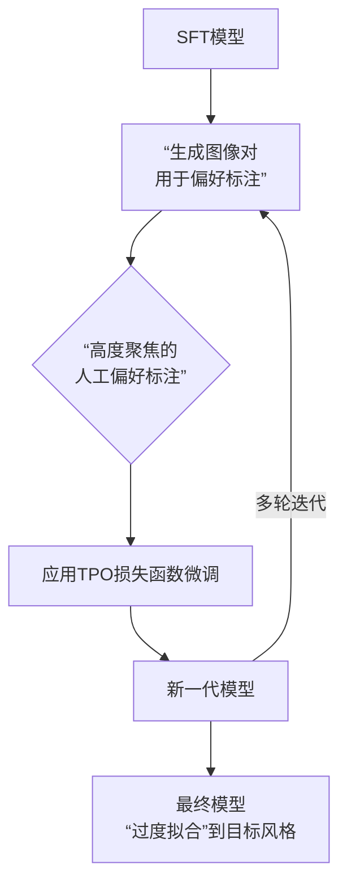

# 目录

## 第一章 FLUX.1系列核心高频考点

- [1.介绍一下FLUX.1的整体架构。与Stable Diffusion 3相比，FLUX.1的核心架构优化有哪些？详细分析改进的意图（VAE、Backbone、Text Encoder）](#1.介绍一下FLUX.1的整体架构。与Stable-Diffusion-3相比，FLUX.1的核心架构优化有哪些？详细分析改进的意图（VAE、Backbone、Text-Encoder）)
- [2.训练FLUX.1过程中官方使用了哪些训练技巧？](#2.训练FLUX.1过程中官方使用了哪些训练技巧？)
- [3.FLUX.1模型的微调训练流程一般包含哪几部分核心内容？](#3.FLUX.1模型的微调训练流程一般包含哪几部分核心内容？)
- [4.FLUX.1模型的微调训练流程中有哪些关键参数？](#4.FLUX.1模型的微调训练流程中有哪些关键参数？)
- [5.介绍一下FLUX.1 Lite与FLUX.1的异同](#5.介绍一下FLUX.1-Lite与FLUX.1的异同)
- [6.介绍一下FLUX.1 Kontext的原理，FLUX.1 Kontext能够执行哪些AIGC任务？](#6.介绍一下FLUX.1-Kontext的原理，FLUX.1-Kontext能够执行哪些AIGC任务？)
- [7.FLUX.1 Kontext和FLUX.1相比，有哪些核心优化？详细分析改进的意图](#7.FLUX.1-Kontext和FLUX.1相比，有哪些核心优化？详细分析改进的意图)
- [8.介绍一下FLUX.1 Krea的训练策略](#8.介绍一下FLUX.1-Krea的训练策略)
- [9.介绍一下FLUX.1 Krea中监督微调（SFT）的流程](#9.介绍一下FLUX.1-Krea中监督微调（SFT）的流程)
- [10.FLUX.1 Krea的后训练过程中有哪些关键要点？](#10.FLUX.1-Krea的后训练过程中有哪些关键要点？)
- [11.介绍一下FLUX.1 Krea的后训练过程中使用的Tuned Preference Optimization技术](#11.介绍一下FLUX.1-Krea的后训练过程中使用的Tuned-Preference-Optimization技术)


## 第二章 FLUX.2系列核心高频考点

- [1.与FLUX.1相比，FLUX.2有哪些新特性与优化亮点？详细分析改进的意图（VAE、Backbone、Text Encoder）](#1.与FLUX.1相比，FLUX.2有哪些新特性与优化亮点？详细分析改进的意图（VAE、Backbone、Text-Encoder）)


---

# 第一章 FLUX.1系列核心高频考点

<h2 id="1.介绍一下FLUX.1的整体架构。与Stable-Diffusion-3相比，FLUX.1的核心架构优化有哪些？详细分析改进的意图（VAE、Backbone、Text-Encoder）">1.介绍一下FLUX.1的整体架构。与Stable Diffusion 3相比，FLUX.1的核心架构优化有哪些？详细分析改进的意图（VAE、Backbone、Text Encoder）</h2>

FLUX.1系列模型是基于Stable Diffuson 3进行了升级优化，是目前性能最强的开源AI绘画大模型，其主要的创新点如下所示：

1. FLUX.1系列模型将VAE的通道数扩展至64，比SD3的VAE通道数足足增加了4倍（16）。
2. 目前公布的两个FLUX.1系列模型都是经过指引蒸馏的产物，这样我们就无需使用Classifier-Free Guidance技术，只需要把指引强度当成一个约束条件输入进模型，就能在推理过程中得到带指定指引强度的输出。
3. FLUX.1系列模型继承了Stable Diffusion 3 的噪声调度机制，对于分辨率越高的图像，把越多的去噪迭代放在了高噪声的时刻上。但和Stable Diffusion 3不同的是，FLUX.1不仅在训练时有这种设计，采样时也使用了这种技巧。
4. FLUX.1系列模型中在DiT架构中设计了双流DiT结构和单流DiT结构，同时加入了二维旋转式位置编码 (RoPE) 策略。
5. FLUX.1系列模型在单流的DiT中引入了并行注意力层的设计，注意力层和MLP并联执行，执行速度有所提升。

### VAE部分的改进

**FLUX.1系列中，FLUX.1 VAE架构依然继承了SD 3 VAE的8倍下采样和输入通道数（16）。在FLUX.1 VAE输出Latent特征，并在Latent特征输入扩散模型前，还进行了Pack_Latents操作，一下子将Latent特征通道数提高到64（16 -> 64），换句话说，FLUX.1系列的扩散模型部分输入通道数为64，是SD 3的四倍**。这也代表FLUX.1要学习拟合的内容比起SD 3也增加了4倍，所以官方大幅增加FLUX.1模型的参数量级来提升模型容量（model capacity）。下面是Pack_Latents操作的详细代码，让大家能够更好的了解其中的含义：

```
@staticmethod
def _pack_latents(latents, batch_size, num_channels_latents, height, width):
    latents = latents.view(batch_size, num_channels_latents, height // 2, 2, width // 2, 2)
    latents = latents.permute(0, 2, 4, 1, 3, 5)
    latents = latents.reshape(batch_size, (height // 2) * (width // 2), num_channels_latents * 4)

    return latents
```

**可以看到FLUX.1模型的Latent特征Patch化方法是将 $2\times2$ 像素块直接在通道维度上堆叠。这种做法保留了每个像素块的原始分辨率，只是将它们从空间维度移动到了通道维度。与之相对应的，SD 3使用下采样卷积来实现Latent特征Patch化，但这种方式会通过卷积减少空间分辨率从而损失一定的特征信息。**

Rocky再举一个形象的例子来解释SD 3和FLUX.1的Patch化方法的不同：
1. SD 3（下采样卷积）：想象我们有一个大蛋糕，SD 3的方法就像用一个方形模具，从蛋糕上切出一个 $2\times2$ 的小方块。在这个过程中，我们提取了蛋糕的部分信息，但是由于进行了压缩，Patch块的大小变小了，信息会有所丢失。
2. FLUX.1（通道堆叠）：FLUX.1 的方法更像是直接把蛋糕的 $2\times2$ 块堆叠起来，不进行任何压缩或者切割。我们仍然保留了蛋糕的所有部分，但是它们不再分布在平面上，而是被一层层堆叠起来，像是三明治的层次。这样一来，蛋糕块的大小没有改变，只是它们的空间位置被重新组织了。

总的来说，**相比SD 3，FLUX.1将 $2\times2$ 特征Patch化操作应用于扩散模型之前**。这也表明FLUX.1系列模型认可了SD 3做出的贡献，并进行了继承与优化。

目前发布的FLUX.1-dev和FLUX.1-schnell两个版本的VAE结构是完全一致的。**同时与SD 3相比，FLUX.1 VAE并不是直接沿用SD 3的VAE，而是基于相同结构进行了重新训练，两者的参数权重是不一样的**。并且SD 3和FLUX.1的VAE会对编码后的Latent特征做平移和缩放，而之前的SD系列中VAE仅做缩放：

```
def encode(self, x: Tensor) -> Tensor:
    z = self.reg(self.encoder(x))
    z = self.scale_factor * (z - self.shift_factor)
    return z
```

平移和缩放操作能将Latent特征分布的均值和方差归一化到0和1，和扩散过程加的高斯噪声在同一范围内，更加严谨和合理。

下面是**Rocky梳理的FLUX.1-dev/schnell系列模型的VAE完整结构图**，希望能让大家对这个从SD系列到FLUX.1系列都持续繁荣的模型有一个更直观的认识，在学习时也更加的得心应手：


**Rocky认为Stable Diffusion系列和FLUX.1系列中VAE模型的改进历程，为工业界、学术界、竞赛界以及应用界都带来了很多灵感，有很好的借鉴价值。Rocky也相信AI绘画中针对VAE的优化是学术界一个非常重要的论文录用点！**


<h2 id="2.训练FLUX.1过程中官方使用了哪些训练技巧？">2.训练FLUX.1过程中官方使用了哪些训练技巧？</h2>


<h2 id="3.FLUX.1模型的微调训练流程一般包含哪几部分核心内容？">3.FLUX.1模型的微调训练流程一般包含哪几部分核心内容？</h2>


<h2 id="4.FLUX.1模型的微调训练流程中有哪些关键参数？">4.FLUX.1模型的微调训练流程中有哪些关键参数？</h2>


<h2 id="5.介绍一下FLUX.1-Lite与FLUX.1的异同">5.介绍一下FLUX.1-Lite与FLUX.1的异同</h2>


<h2 id="6.介绍一下FLUX.1-Kontext的原理，FLUX.1-Kontext能够执行哪些AIGC任务？">6.介绍一下FLUX.1 Kontext的原理，FLUX.1 Kontext能够执行哪些AIGC任务？</h2>


<h2 id="7.FLUX.1-Kontext和FLUX.1相比，有哪些核心优化？详细分析改进的意图">7.FLUX.1 Kontext和FLUX.1相比，有哪些核心优化？详细分析改进的意图</h2>


<h2 id="8.介绍一下FLUX.1-Krea的训练策略">8.介绍一下FLUX.1 Krea的训练策略</h2>


<h2 id="9.介绍一下FLUX.1-Krea中监督微调（SFT）的流程">9.介绍一下FLUX.1-Krea中监督微调（SFT）的流程</h2>

FLUX.1 Krea模型中的监督微调（SFT）是其摆脱“AI感”，生成具有照片级真实感和独特美学图像的关键步骤。

### SFT的流程

FLUX.1 Krea 的SFT流程核心是使用精选数据，将通用的基础模型“调教”成一个具有特定审美品味的模型。

1.  **起点：优质的“原始”基础模型**
    SFT并非从零开始，它需要一个知识渊博的“胚子”。FLUX.1 Krea 使用的是Black Forest Labs提供的 **`flux-dev-raw`基础模型**。同时进行了大规模的预训练，其特点是已经具备了大量的“世界知识”（能理解各种物体、风格和概念），但尚未经过过度微调调优，保留了原始生成分布的多样性，可塑性非常强。

2.  **核心：精心策划的训练数据**
    数据是SFT的灵魂，FLUX.1 Krea 严格遵循 **“质量重于数量”** 的原则。其训练数据主要包括：
    - **高质量图像-文本对**：团队手工挑选了符合其审美标准的高质量图像数据集。
    - **合成样本**：在SFT阶段还加入了来自 **Krea自身模型的高质量合成样本**，这有助于稳定模型在迭代过程中的性能。

    整个SFT阶段使用的数据量可能远少于预训练，但凭借极高的数据质量，足以让模型领会到期望的美学风格。

3.  **关键技术：自定义损失函数与CFG分布微调**
    这是一个技术上的重要细节。由于 `flux-dev-raw` 是一个经过指导蒸馏的模型，FLUX.1 Krea 的团队设计了一个**自定义的损失函数，直接在无分类器引导（CFG）的分布上对模型进行微调**。我们可以这样理解：CFG是生成过程中用于控制图像与提示词相关性的一个技术，直接在此分布上优化，能更有效地引导模型朝着既遵守提示词又具备高美学质量的方向生成图像。

### SFT的原理与作用

从原理上看，SFT的本质是让大模型通过“模仿”来重塑行为。

- **原理**：SFT通过**最小化模型预测与目标答案（高质量图像）之间的交叉熵损失**来进行训练。简单来说，就是通过调整模型参数，让它生成的图像在视觉特征上越来越接近那些精心准备的高质量训练图片，同时忽略训练数据中的缺陷部分。

- **作用**：经过SFT阶段后，FLUX.1 Krea大模型发生了根本性的转变：
    - **确立美学基础**：从能“画出”东西，转变为能画出“好看”的东西，初步建立起对自然光影、真实质感和协调构图的偏好。
    - **提升图像质量**：生成的图像在清晰度、结构准确性和细节丰富度上显著提升。
    - **保留多样性**：由于基础模型的“原始”性和数据的质量，模型在确立风格的同时，并未丧失生成的多样性。

### SFT微调与前后环节的协作

SFT微调并非孤立的环节，它为后续的RLHF阶段打下了坚实的基础。

- **SFT与预训练**：预训练让大模型“见多识广”，学会了世界的各种可能性（包括优质和劣质图像），为SFT阶段的负面提示词等技术提供了基础。SFT则是在此基础上做“减法”和“精修”，引导模型专注于高质量和高美学的部分。

- **SFT与RLHF**：SFT解决了“好看”的问题，而RLHF则进一步解决“更符合人类偏好”的问题。SFT可以被看作是**RLHF的必要准备**，它先让模型具备稳定的高质量输出能力，然后RLHF再通过人类偏好数据对这个能力进行精细校准和微调，使作品的风格更鲜明、更符合特定的艺术标准。

为了让你更清晰地理解SFT在整个过程中的承上启下作用，下表对比了这三个核心阶段：

| **阶段** | **核心目标** | **数据特点** | **对模型的影响** |
| :--- | :--- | :--- | :--- |
| **预训练** | **模式覆盖**与**世界理解** | 海量、多样化的图像-文本对，包含各种质量的图像 | 建立通用视觉知识，最大化生成多样性 |
| **监督微调 (SFT)** | **确立美学基础**与**提升质量** | 少量但极致精选的高质量/合成图像 | 学会生成高清、结构准确、符合特定审美的图像 |
| **RLHF** | **对齐人类偏好**与**风格强化** | 小规模、带有明确艺术导向的人类偏好数据 | 进一步校准输出，使风格更鲜明，更稳健地符合人类审美 |


<h2 id="10.FLUX.1-Krea的后训练过程中有哪些关键要点？">10.FLUX.1 Krea的后训练过程中有哪些关键要点？</h2>

在监督微调阶段，FLUX.1 Krea精心筛选构建了一个符合官方审美标准的、最高质量的图像数据集。同时在训练FLUX.1 Krea大模型的过程中，还加入了来自Krea-1模型的高质量合成图像数据，这些图像被用于增强 SFT 阶段的模型训练效果。

由于flux-dev-raw是一个经过指导式蒸馏（guidance distilled）的模型，官方设计了一种自定义损失函数，直接在无分类器引导（CFG）的分布上对模型进行微调训练。在SFT阶段之后，FLUX.1 Krea模型的图像生成质量得到了显著提升。但是要使FLUX.1 Krea模型更加稳健并达到官方所追求的美学效果，还需要进一步的工作：这就是RLHF的用武之地。

在RLHF阶段，官方应用了一种偏好优化技术的变体，称为TPO（Tuned Preference Optimization），以进一步提升FLUX.1 Krea模型的美学质量和风格化水平。官方使用了高质量的内部偏好数据，这些数据经过严格筛选以确保质量。同时在微调过程中还会进行多轮偏好优化，进一步优化FLUX.1 Krea模型生成图像的风格与质量。

在探索各种后训练技术的过程中，Krea官方发现了一些关键要点：

1. **质量比数量重要的多**：我们只需要非常少量的数据（不到100万）就能进行有效的后训练。虽然更大的数据集规模有助于模型的稳定性和减少偏差，但数据的质量才是最为重要的，使用小规模、精心挑选的数据集进行训练，依然可以达到极佳的模型整体效果。使用的偏好标签是由标注人员精心收集的，这些标注人员非常清楚当前模型的局限性、需要改进的领域、优点和缺点。同时确保图像数据集内容足够多样，以获得聚焦且有代表性的标注结果。
2. **采取主观明确的训练方法**：目前有许多开源的偏好数据集，被用于评估测试偏好微调技术。这些数据集对于测试各种技术确实非常有用。然而，如果直接在现有数据集上进行训练，往往会导致一些意想不到的负面影响，例如模型生成的图像会偏向对称、简单的构图；会有模糊和过度柔和的纹理；会出现色彩风格趋于单一的情况；会回归到”AI感”等。

Krea官方认为，在”全局”用户偏好上微调训练的模型在审美质量上并非最优。对于像文本渲染、解剖结构、物体结构和提示词遵循度这样有客观事实依据的目标，数据的多样性和规模确实是很有帮助的。然而，对于像美学质量这样主观的目标，将不同的审美品味混合在一起几乎是相互抵触的。


<h2 id="11.介绍一下FLUX.1-Krea的后训练过程中使用的Tuned-Preference-Optimization技术">11.介绍一下FLUX.1 Krea的后训练过程中使用的Tuned Preference Optimization技术</h2>

在SFT阶段之后，FLUX.1 Krea模型的**图像质量**已经很高了，但**美学风格和鲁棒性**还未达到理想状态。团队发现，使用现有的开源偏好数据集进行优化会导致模型出现“审美中庸”、风格倒退（回归“AI感”）等问题。

TPO正是为了解决这些问题而设计的、一种**高度主观化**的偏好优化技术。

### 一、TPO是什么？

TPO是一种**基于偏好优化的强化学习技术变体**。它的核心思想不是去学习一个“普适的”、“大众的”人类审美，而是**将模型强烈地、有倾向性地对齐到一个非常具体和明确的美学标准上**。

你可以把它理解为模型的“美学特训营”。在这个特训营里，教练（TPO算法）不是教学生“什么样的话大家都爱听”，而是教他“如何成为一名具有独特风格的艺术家”。

### 二、TPO的核心原理

TPO的技术根源来自于像DPO、KTO这样的直接偏好优化算法。这些算法的共同点是**绕过传统RLHF中难以训练的奖励模型，直接利用偏好数据来微调策略模型（即我们要优化的图像生成模型）**。

我们来简单理解一下这个基本原理：

1.  **传统RLHF的痛点**：
    *   需要先训练一个奖励模型来判断人类更喜欢哪张图片。
    *   然后通过强化学习（如PPO）来优化生成模型，以最大化从奖励模型获得的分数。
    *   这个过程非常不稳定、计算成本高，且奖励模型的偏差会直接影响最终效果。

2.  **直接偏好优化的创新**：
    *   它发现，我们可以不训练独立的奖励模型。
    *   而是将问题转化为一个**分类问题**：直接调整生成模型本身的参数，使得它生成“获胜”图片的概率远大于生成“失败”图片的概率。
    *   其损失函数的核心是：**对于一对图片（获胜图片 `X_win` 和失败图片 `X_lose`），优化后模型对 `X_win` 的偏好概率应该大于对 `X_lose` 的偏好概率。**

### 三、TPO的“Tuned”体现在哪里？—— 其关键创新

“Tuned”这个词精准地描述了TPO的精髓——**精心调谐**。它不仅仅是在做偏好优化，而是对整个过程进行了定制化的改进，主要体现在以下几点：

1.  **高度主观与明确的美学导向**
    *   **问题**：开源偏好数据集混合了各种用户的审美，导致模型学习到的是一个“平均审美”，失去了风格棱角。
    *   **TPO的解决方案**：不使用公开数据集，而是**内部收集具有高度一致性的偏好数据**。标注人员完全理解团队想要的艺术方向（如特定的构图、光影、质感）。这使得优化目标非常纯粹和尖锐。

2.  **多轮迭代优化**
    *   官方提到“*在许多情况下，我们应用了多轮的偏好优化*”。这不是一个一次性的过程。
    *   **流程可能是**：`SFT -> TPO Round 1 -> 生成新样本 -> 收集对新样本的偏好 -> TPO Round 2 -> ...`
    *   这种方式允许团队**逐步校准模型**，使其美学风格越来越精确和稳定，不断强化优点、修正缺点。

3.  **对“过度拟合”的重新定义**
    *   在机器学习中，“过度拟合”通常是个贬义词，意味着模型失去了泛化能力。
    *   但在TPO的哲学里，**对于美学这种主观目标，“过度拟合”到一个特定风格上是可取的，甚至是目标**。团队明确指出：“*让模型过度拟合某种特定风格通常是更好且更简单的做法*”。这确保了FLUX.1 Krea输出风格的**鲜明性和一致性**。

4.  **专注于解决SFT后的遗留问题**
    *   SFT解决了“质量”问题，TPO则专注于“风格”和“鲁棒性”。
    *   TPO的偏好数据很可能**特意针对SFT模型表现薄弱或风格不明确的场景**进行收集，例如复杂的构图、特定的色彩搭配、难以渲染的材质等，从而实现精准打击。

### 四、TPO的工作流程

结合以上原理，TPO的一个典型工作流程可以概括为以下步骤：



### 总结：TPO带来的效果

通过TPO技术，FLUX.1 Krea实现了：

*   **鲜明的艺术风格**：模型输出的图像具有高度可识别的、一致的“Krea风格”，而不是模糊的“大众脸”。
*   **卓越的美学质量**：在团队定义的审美标准下，图像的光影、构图、色彩和质感都达到了极高水平。
*   **强大的鲁棒性**：即使面对具有挑战性的提示词，模型也能稳定地输出符合其美学标准的图像，而不是崩溃或产生“AI感”十足的图片。
*   **用户友好性**：用户无需编写冗长复杂的提示词来“对抗”模型的中庸审美，简单的提示也能得到具有高级美学感的默认输出。

**总而言之，TPO是FLUX.1 Krea成功的关键技术之一。它代表了一种新一代模型优化的理念：从追求“什么都会一点”的通用模型，转向在特定领域或风格上做到极致的“专家型”模型。这种“主观明确”的优化路径，很可能成为未来顶级AI模型竞争的核心。**

---


# 第二章 FLUX.2系列核心高频考点


<h2 id="1.与FLUX.1相比，FLUX.2有哪些新特性与优化亮点？与FLUX.1相比，FLUX.2有哪些新特性与优化亮点？详细分析改进的意图（VAE、Backbone、Text-Encoder）">1.与FLUX.1相比，FLUX.2有哪些新特性与优化亮点？与FLUX.1相比，FLUX.2有哪些新特性与优化亮点？详细分析改进的意图（VAE、Backbone、Text Encoder）</h2>

FLUX.2系列更新的新特性与核心优化亮点，具体如下：
1. **支持参考图生成**：最多可输入 10 张参考图像，在角色、产品及风格一致性上达到当前最佳水平。支持显式图像索引，用户可在提示词中通过编号引用特定图像，例如“将图 2 中的衣服穿在图 1 的角色身上”。
2. **图像细节与照片级真实感**：生成图像具备更丰富的细节、更清晰的纹理与更自然的光照表现，适用于产品摄影、可视化及类似专业摄影场景。
3. **文本渲染能力提升**：可稳定生成复杂排版、信息图表、表情包及含细小文字的 UI 界面模型，支持中文输入与中文文字渲染，已具备生产环境可用性。
4. **增强的提示词遵循**：能够更准确地理解并执行复杂的结构化指令（支持 JSON 格式），包括多部分提示词及构图约束。
5. **丰富的世界知识**：模型在现实世界知识、光照逻辑与空间关系方面表现更加合理，可生成场景更连贯、行为更符合预期的图像。
6. **更高分辨率与灵活的宽高比**：支持最高 4MP（例如 1920×1920）的图像编辑分辨率，并允许灵活的输入与输出比例。
7. **支持十六进制颜色描述**：可通过如 #DDC57A 的十六进制代码精准描述对象颜色，在色彩控制方面表现优异。


### FLUX.2的Text Encoder部分的优化

在Text Encoder部分，FLUX.2的文本编码器不再使用T5和CLIP，而是改用了**Mistral-3-24B视觉语言大模型**（VLM大模型，Mistral-Small-3.2-24B-Instruct-2506），视觉语言大模型提供真实世界知识和上下文理解，增强了对世界、材质、空间关系和构图的建模能力。同时使用单个文本编码器极大地简化了Prompt Embeddings的计算过程。


### FLUX.2的DiT Backbone部分的优化

在DiT Backbone部分，**FLUX.2沿用了与FLUX.1相同的MM-DiT + 并行DiT相结合的整体架构**。简言之，MM-DiT模块首先在独立处理图像潜变量和条件文本，仅在注意力计算环节将二者融合，因此被称为“双流”块。随后的并行DiT模块则对拼接后的图像与文本流进行操作，可视为“单流”块。

从FLUX.1到FLUX.2，DiT架构的核心改进如下：

1. 对DiT部分进行了Scaling，参数量从FLUX.1的12B增加32B。
2. 时间与引导信息（Timestep and Guidance Scale，以 AdaLayerNorm-Zero 调制参数的形式）分别在所有双流块和所有单流块间共享，而非如FLUX.1中为每个块单独设置调制参数，从而降低整体参数量。
3. 模型中所有层均不再使用偏置参数。具体而言，两种变换器块中的注意力子块与前馈子块在其任何层中均未使用偏置参数。
4. 在FLUX.1中，单流变换器块将注意力输出投影与前馈网络输出投影进行了融合。FLUX.2的单流块进一步将注意力QKV投影与前馈网络的输入投影相融合，从而实现了完全并行的Transformer块结构：


需要注意的是，与上图中的 ViT-22B 块相比，FLUX.2 采用了SwiGLU作为多层感知机的激活函数，而非使用GELU激活函数（同时也不使用偏置参数）。

FLUX.2 中单流模块的比例显著提高（双流块与单流块的数量比为 8:48，而 FLUX.1 为 19:38）。这意味着单流模块在 DiT 参数中所占比例更大：FLUX.1-12B 约有 54% 的参数位于双流块中，而 FLUX.2-32B 仅有约 24% 的参数在双流模块内（约 73% 的参数集中在单流模块中）。

最后，FLUX.2 在位置编码设计上也进行了调整。FLUX.1 采用 3D RoPE，其中前两维分别编码图像的宽（w）和高（h），第三维为时间维度 t，在生成时固定为 0；而在 FLUX.1 Kontext 版本中，该 t 值对于输入条件图像设为 1，以区分目标图像与条件图像。

FLUX.2 则升级为 4D RoPE 编码：第一维为 t，用于区分目标图像与条件图像——目标图像（对应噪声潜变量 token）的 t 设为 0，而条件图像的 t 则以 10 为间隔依次递增（如 10、20……）；第二维和第三维仍分别对应图像宽高（w 和 h）；第四维为 l，专门用于编码文本 token 的序列位置，对于图像潜变量则固定为 0。因此，新增的第四维主要作用是为文本 token 赋予位置信息，而此前 FLUX.1 中所有文本 token 的位置编码均固定为 0，并未区分其顺序。


### FLUX.2的VAE部分的优化

在VAE部分，FLUX.2也进行了重要升级。**新版VAE在可学习性、重建质量与压缩率三者间实现了更优的平衡**。

这里的“可学习性”指生成模型（即DiT）在VAE的潜在特征空间（Latent特征空间）中学习生成新样本的难易程度。若潜在特征具备良好的语义化表征，生成任务将更易建模，因为模型仅需捕捉高层语义关系，而无需重构低层感知细节。然而，这种方法可能牺牲图像重建质量，并降低压缩效率。

“质量”在此特指VAE的重建能力，即Decoder解码器能否从压缩后的潜在表示中高保真地还原原始图像。过度压缩通常会引入感知失真与细节丢失。尽管引入感知损失与对抗训练可提升重建效果，但高压缩比往往导致保真度下降。此外，若VAE训练仅追求重建精度，而未对潜在空间施加语义约束，则可能产生含高频噪声或结构混乱的潜在表示，增加生成模型的学习难度。

“压缩率”对应潜在特征的维度，更高的压缩率有助于提升计算效率，但也可能削弱重建质量与生成模型对真实数据分布的拟合能力。

**这三项目标本质上相互制约**：提高压缩率通常会损害重建质量与可学习性；追求完美重建则需降低压缩程度；而为提升语义层面的可学习性，又可能不得不放弃部分底层感知细节。因此，理想的权衡策略是剔除人眼不可感知的信息，同时保留富含语义、利于生成模型高效学习的结构特征——这也正是FLUX.2 VAE的核心设计目标。

相较于FLUX.1 VAE，FLUX.2 VAE在保持重建质量的同时，显著提升了可学习性。具体改进包括：**在保持空间压缩率为8倍的前提下，进一步增加潜在特征的维度（SD-VAE为4维，FLUX.1 VAE为16维，FLUX.2 VAE提升至32维）。潜在维度的增加并未改变DiT处理的token数量，因此不会带来额外计算负担**。此外，在训练过程中引入了语义正则化机制，进一步优化了潜在空间的语义组织结构与可学习性。


---
