# 目录

- [1.介绍一下AIGC图像生成领域的LoRA技术原理](#1.介绍一下AIGC图像生成领域的LoRA技术原理)
- [2.在AIGC图像生成领域中，LoRA模型有哪些优势和特性？](#2.在AIGC图像生成领域中，LoRA模型有哪些优势和特性？)
- [3.在AIGC图像生成领域中，Stable Diffusion直接微调训练和LoRA微调训练有哪些区别？](#3.在AIGC图像生成领域中，Stable-Diffusion直接微调训练和LoRA微调训练有哪些区别？)
- [4.在AIGC图像生成领域中，LoRA模型有哪些高阶用法？](#4.在AIGC图像生成领域中，LoRA模型有哪些高阶用法？)
- [5.在AIGC图像生成领域中，在多LoRA组合推理时，有哪些融合策略？这些策略各自的优缺点是什么？](#5.在AIGC图像生成领域中，在多LoRA组合推理时，有哪些融合策略？这些策略各自的优缺点是什么？)
- [6.在AIGC图像生成领域中，LoRA模型的离线融合和提取方式有哪些？](#6.在AIGC图像生成领域中，LoRA模型的离线融合和提取方式有哪些？)
- [7.在AIGC图像生成领域中，LoRA模型的微调训练流程一般包含哪几部分核心内容？](#7.在AIGC图像生成领域中，LoRA模型的微调训练流程一般包含哪几部分核心内容？)
- [8.在AIGC图像生成领域中，LoRA模型的微调训练流程中有哪些关键参数？](#8.在AIGC图像生成领域中，LoRA模型的微调训练流程中有哪些关键参数？)
- [9.在AIGC图像生成领域中，LoRA有哪些主流的变体模型？介绍一下这些变体模型（LoCon、LoHa、B-LoRA、LCM_LoRA等）的特点](#9.在AIGC图像生成领域中，LoRA有哪些主流的变体模型？介绍一下这些变体模型（LoCon、LoHa、B-LoRA、LCM_LoRA等）的特点)
- [10.如何训练得到差异化LoRA？差异化LoRA的作用是什么？](#10.如何训练得到差异化LoRA？差异化LoRA的作用是什么？)
- [11.在AIGC图像生成领域中，介绍一下MoE-LoRA的核心原理](#11.在AIGC图像生成领域中，介绍一下MoE-LoRA的核心原理)
- [12.介绍一下Parameter-Efficient Fine-Tuning(PEFT)技术的概念，其在AIGC图像生成领域的应用场景有哪些？](#12.介绍一下Parameter-Efficient-Fine-Tuning(PEFT)技术的概念，其在AIGC图像生成领域的应用场景有哪些？)
- [13.介绍一下Textual Inversion技术的原理](#13.介绍一下Textual-Inversion技术的原理)
- [14.什么是DreamBooth技术？LoRA和DreamBooth对比有什么区别？DreamBooth LoRA的原理是什么样的？](#14.什么是DreamBooth技术？LoRA和DreamBooth对比有什么区别？DreamBooth-LoRA的原理是什么样的？)
- [15.LoRA和Dreambooth/Textual Inversion之间的差异有哪些？](#15.LoRA和Dreambooth/Textual-Inversion之间的差异有哪些？)


<h2 id="1.介绍一下AIGC图像生成领域的LoRA技术原理">1.介绍一下AIGC图像生成领域的LoRA技术原理</h2>

LoRA（Low-Rank Adaptation）本质上是对特征矩阵进行低秩分解的一种近似数值分解技术，可以大幅降低特征矩阵的参数量，但是会伴随着一定的有损压缩。从传统深度学习时代走来的读者，可以发现其实LoRA本质上是基于Stable Diffusion/FLUX的一种轻量化技术。

在AIGC图像生成/AI绘画领域，我们可以使用SD/FLUX模型+LoRA模型的组合微调训练方式，只训练参数量很小的LoRA模型，就能在一些AIGC细分领域任务中取得不错的效果。

LoRA模型的训练逻辑是首先冻结SD/FLUX模型的权重，然后在SD模型的U-Net架构或FLUX系列的Transformer架构中注入LoRA权重，主要作用于CrossAttention部分，并只对这部分的参数进行微调训练。

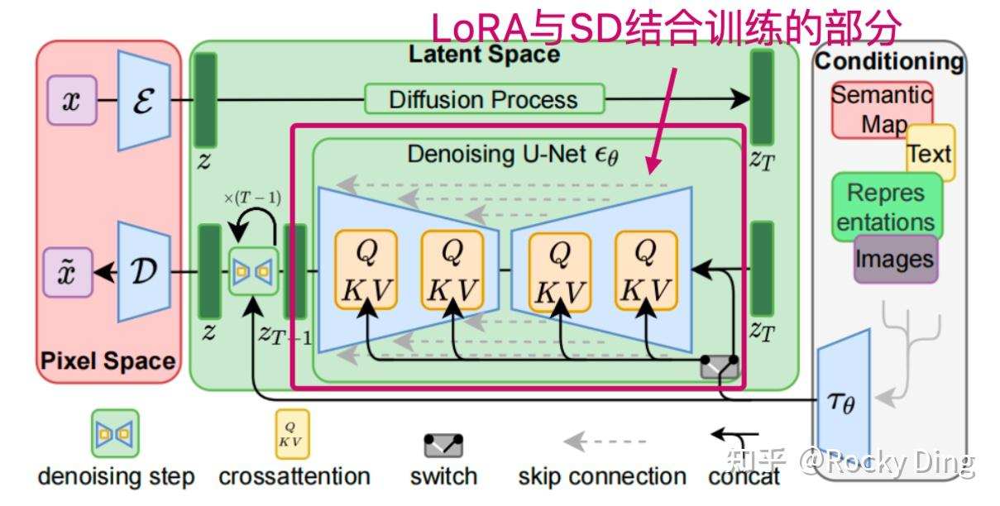

也就是说，对于SD/FLUX模型权重 $W_o \in \mathbb{R}^{n \times m}$，我们不再对其进行全参微调训练，我们对权重加入残差的形式，通过训练 $\Delta W$ 来完成优化过程：

$$W' = W_o + \Delta W$$

其中 $\Delta W = AB, A \in \mathbb{R}^{n \times d}, B \in \mathbb{R}^{d \times m}, d \ll n$，$d$ 就是 $\Delta W$ 这个参数矩阵的秩（Rank，lora_dim），$\Delta W$ 通过低秩分解由两个低秩矩阵的乘积组成。一般来说，尽管SD/FLUX模型的参数数量很大，但每个细分任务对应的本征维度（Intrinsic Dimension）并不大，所以我们设置较小的 $d$ 值就能获得一个参数数量远小于SD/FLUX模型的LoRA模型，并在一些细分任务中获得较好的效果。同时如果我们将 $d$ 设置得越小，LoRA模型的参数数量就越小，但是 $|W' - AB|$ 的近似度就越差。

Rocky再为大家举个直观的例子，方便大家深刻地理解。我们假设原来的 $\Delta W$ 是$100*1024$的参数矩阵，那么参数数量为102400，LoRA模型将 $\Delta W$ 矩阵拆成了两个矩阵相乘，如果我们设置Rank=8，那么就是$100*8$的A矩阵与$8*1024$的B矩阵做矩阵乘法，参数数量为 $800 + 8192 = 8992$，整体参数数量下降了约11.39倍。What amazing! 非常简洁、高效的思想！


上图是LoRA模型训练的示意图。通常来说，对于矩阵 $A$，我们使用随机高斯分布初始化，并对矩阵 $B$ 使用全0初始化，使得在训练初始状态下这两个矩阵相乘的结果为0。这样能够保证在训练初始阶段时，SD/FLUX模型的权重完全生效。

虽然矩阵 $B$ 使用全0初始化能够让SD模型的权重完全生效，但同时也带来了不对称问题（矩阵 $B$ 全零，矩阵 $A$ 非全零）。我们可以通过“补权重”法（训练前先在SD/FLUX模型权重中减去矩阵 $AB$ 的权重）来使矩阵 $AB$ 都使用随机高斯分布初始化，在效果不变的情况下，增加了对称性：

$$W' = W_o - \Delta W + \Delta W$$

其中 $\Delta W = AB, A \in \mathbb{R}^{n \times d}, B \in \mathbb{R}^{d \times m}, d \ll n$。

训练代码参考链接：[全世界 LoRA 训练脚本，联合起来! (huggingface.co)](https://huggingface.co/blog/zh/sdxl_lora_advanced_script)


<h2 id="2.在AIGC图像生成领域中，LoRA模型有哪些优势和特性？">2.在AIGC图像生成领域中，LoRA模型有哪些优势和特性？</h2>

我们在**在加载LoRA模型权重后，会给SD/FLUX模型的微调训练和前向推理带来哪些优势呢？**

**LoRA模型又有哪些独特的技术特性呢？**

**【1】微调训练阶段**

1. **参数量**：矩阵乘积AB与SD/FLUX模型的参数有相同的维度，同时分解出来的两个低秩矩阵可以确保参数更新是在低秩情况下的，这样就显著减少训练的参数数量了。同时**LoRA模型本身的参数量非常小，最小可至3M左右，这使得LoRA模型在开源社区非常方便传播，也进一步促进了AI绘画领域的爆发式繁荣**。

2. **显存占用**：训练LoRA模型所需的算力要求很低，我们可以在2080Ti级别的算力设备上进行LoRA模型的训练。因为使用LoRA技术**大幅降低了SD/FLUX系列模型训练时的显存占用**，整个训练过程中不需要更新SD/FLUX模型的权重，所以SD/FLUX模型对应的优化器参数不需要存储。

3. **计算量：训练过程中的整体计算量没有明显变化**，因为LoRA模型是在SD/FLUX模型的全参梯度基础上增加了“残差”梯度，整体上计算量会比SD/FLUX模型的全参微调略大。

4. **训练数据量**：LoRA模型能在小数据集上进行训练（1张以上即可，理论上1张图片也能训练）。

5. **训练时长**：在其他超参数一致的情况下，与SD/FLUX系列模型全参训练相比，**LoRA模型训练速度更快**。因为训练过程中只更新LoRA模型对应的参数，无需对SD/FLUX模型权重进行更新；同时由于更新的参数量大幅减少，所以数据传输的通信时间也减少了。

6. **站在“巨人”的肩膀上**：LoRA模型能以SD/FLUX模型原有的能力为基础，继续优化学习特定分布特征。

**【2】前向推理阶段**

1. **参数量**：在推理过程中，由于LoRA模型权重与SD/FLUX模型权重进行了合并，同时SD/FLUX模型的结构是不改变的，所以**推理时的参数量是不变的**。

2. **显存占用**：在推理过程中，由于LoRA模型权重与SD/FLUX模型权重进行了合并，同时SD/FLUX模型的结构是不改变的，所以**推理时的显存占用和SD模型的显存占用一致**。

3. **推理耗时**：在推理过程中，由于LoRA模型权重与SD/FLUX模型权重进行了合并，同时SD/FLUX模型的结构是不改变的，所以**推理耗时没有增加**。

4. **生成效果**：针对特定的人物和风格特征，使用LoRA模型+SD/FLUX模型的生成效果会比只用SD/FLUX模型微调训练后的生成效果要好。

5. **高效切换**：SD/FLUX模型之间切换需要将所有模型参数加载到内存，从而造成严重的I/O瓶颈。通过对权重更新的有效参数化，**不同LoRA模型之间的切换加载既高效又容易**。

从上面Rocky对LoRA模型的归纳总结可以看到，SD/FLUX模型与LoRA模型的权重合并后，SD/FLUX模型的结构并没有改变，同时参数量、显存占用、推理耗时也不会改变，**整个推理成本是没有增加的，这无疑让LoRA模型有了更多的实用价值**。

同时，每个LoRA模型都具有三种核心特性：

- **易用性**：在我们加载LoRA模型的权重后，我们需要用多少提示词（Prompt）来使其完全生效。易用性越高，所需的提示词就越少，我们训练的LoRA模型才能在社区更受欢迎，使用量才能快速提升。
- **泛化性**：LoRA模型准确还原其训练素材中主要特征的同时，能否与其他LoRA模型和SD/FLUX模型兼容生效。高泛化性意味着LoRA模型在多种不同的应用场景下都能保持良好的效果。
- **还原度**：在LoRA模型完全生效后，生成的图片与训练素材之间的相似度。高还原性保证了生成图片忠于训练素材，细节和质量上的表现准确无误。

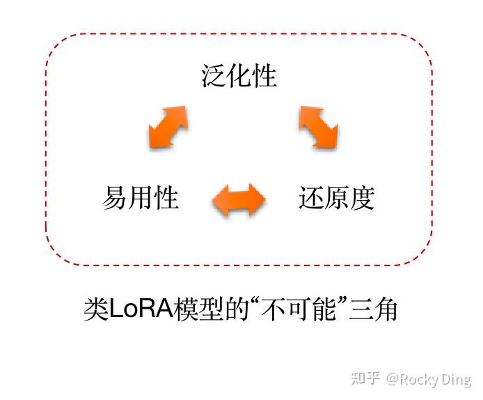


<h2 id="3.在AIGC图像生成领域中，Stable-Diffusion直接微调训练和LoRA微调训练有哪些区别？">3.在AIGC图像生成领域中，Stable Diffusion直接微调训练和LoRA微调训练有哪些区别？</h2>

**LoRA模型在训练过程中只对很少的参数更新了权重，为什么能够表现出良好的性能呢？难道不应该更新更多参数的权重来学习更多知识吗？比如说SD/FLUX模型直接微调训练？**

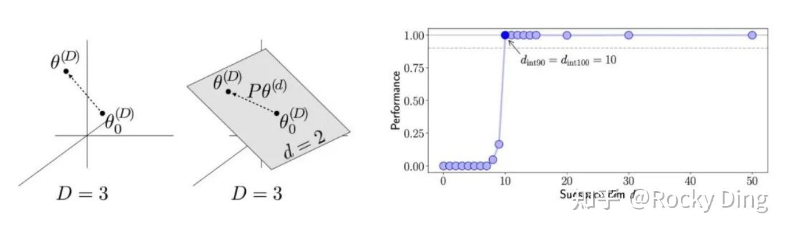

上图直观展示了LoRA的核心思想：

- **高维原始空间**：左边的 `D=3` 代表预训练大模型的参数空间维度极高（实际中可能是百万/十亿级），$\theta^{(D)}$ 是预训练模型的参数，$\theta_0^{(D)}$ 是微调的起点。
- **低秩子空间约束**：右边的灰色平面 `d=2` 表示LoRA并没有在整个高维空间中更新所有参数，而是将参数更新限制在一个低秩的子空间里。$P\theta^{(d)}$ 是原始参数在低秩子空间上的投影，意味着任务所需的参数更新可以被这个低维子空间很好地捕捉。
- 当训练步数达到 `d_int90 = d_int100 = 10` 左右时，性能突然飙升至接近1.0并保持稳定。
- 这说明**低秩子空间的少量参数更新，已经足以让模型快速收敛到接近最优的性能**，不需要在整个高维空间中全量更新参数。

同时，经过预训练的AIGC大模型已经具备“通用知识”，已经学到了语言、图像等领域的通用底层规律（比如语义理解、视觉特征提取）。很多AIGC细分领域的目标需求本质上并不是“重新学习所有知识”，而是**在通用知识的基础上，注入任务特定的信息**（比如让SD/FLUX生成特定风格的图像）。**这些“任务特定信息”往往只需要对原始参数做很小的调整，且这种调整可以被低秩矩阵近似表示（即图中 `d=2` 的低维子空间足以覆盖任务所需的更新）**。

同时通过LoRA技术的低秩更新避免了全量微调的缺陷，全量微调（如SD/FLUX的直接微调）虽然更新所有参数，但存在明显问题：

- **计算/存储成本极高**：大模型全量微调需要巨大的算力和显存，且每个任务需要单独保存一个完整模型，存储成本爆炸。
- **容易过拟合与遗忘**：在小数据集上全量微调容易过拟合，还可能破坏预训练模型的通用能力（灾难性遗忘）。
- **效率低下**：全量更新中大部分参数的调整对任务收益很小，属于“无效计算”。

而LoRA的低秩更新完美规避了这些问题：

- **参数效率高**：仅更新低秩矩阵（通常是原始参数的1%甚至更少），计算和存储成本大幅降低。

- **保留预训练能力**：原始参数被冻结，预训练的通用知识得以完整保留，仅通过低秩矩阵注入任务信息，避免了灾难性遗忘。

- **收敛速度快**：从右侧性能曲线可以看到，LoRA仅需少量训练步数就达到饱和性能，远快于全量微调。

总的来说，LoRA的核心逻辑是“**精准更新关键参数来高效注入特定任务信息**”。预训练AIGC大模型已经积累了足够的通用知识，LoRA只需要在低秩子空间中做微小调整，就能让AIGC大模型在特定任务上表现优异，同时还能避免全量微调的各种缺陷。**换个更通俗地表达：“不是大模型全参微调训练不起，而是LoRA模型更有性价比！”**


<h2 id="4.在AIGC图像生成领域中，LoRA模型有哪些高阶用法？">4.在AIGC图像生成领域中，LoRA模型有哪些高阶用法？</h2>

LoRA模型还有三种高阶用法：

1.  我们可以调整LoRA模型使用时的权重。
2. 使用多个LoRA模型同时作用于一个SD/FLUX模型。
3. 使用LoRA技术微调训练SD/FLUX系列模型的Text Encoder。

### 【一】调整LoRA模型使用时的权重

首先，我们可以调整LoRA模型的权重：

$$W' = W + \alpha \Delta W$$

其中 $\alpha$ 代表了LoRA模型的权重。下图展示了将 $\alpha$ 从0缩放到1的过程中，不同权重LoRA模型对图像生成所产生的影响。


当我们将 $\alpha$ 设置为0时，与只使用SD模型的效果完全相同；将 $\alpha$ 设置为1时，与使用 $W' = W + \Delta W$ 的效果相同。如果出现LoRA模型的效果过于强的情况，我们可以将 $\alpha$ 设置为较低的值（比如0.2-0.3）。如果使用LoRA的效果不太明显，那我们可以将 $\alpha$ 设置为略高于1的值（比如1.2-1.5）。
### 【二】多个LoRA模型同时作用

除了调整单个LoRA的权重，我们还可以使用多个LoRA模型同时作用于一个SD/FLUX模型，并配置他们的各自权重，我们拿两个LoRA模型举例：

$$\Delta W = (\alpha_1 A_1 + \alpha_2 A_2)(\alpha_1 B_1 + \alpha_2 B_2)$$

其中 $\alpha_1$ 代表第一个LoRA模型的权重，$\alpha_2$代表第二个LoRA模型的权重。如果我们设置 $\alpha_1 = \alpha_2 = 0.5$，我们就得到两个LoRA模型的权重平均值。如果我们设置 $\alpha_1 = 0.8$，$\alpha_2 = 0.3#，那么第一个LoRA模型的效果会占据主导；如果我们设置 $\alpha_1 = 0.1$，$\alpha_2 = 0.8$，那么第二个LoRA模型的效果会占据主导。

### 【三】LoRA技术微调训练SD/FLUX系列模型的Text Encoder

我们知道SD/FLUX系列模型中的Text Encoder部分也包含了大量的Attention结构，所以我们也可以使用LoRA技术微调训练SD/FLUX系列模型的Text Encoder，获得Text Encoder LoR模型。

整个训练流程和SD U-Net LoRA模型一致，在前向推理阶段，将Text Encoder LoR模型权重合并到SD/FLUX系列模型的Text Encoder中。

在使用时，我们可以更加灵活地在SD/FLUX模型中加载LoRA模型权重：

1. SD/FLUX模型+ U-Net LoRA/Transformer LoRA模型 + Text Encoder LoRA模型
2. SD/FLUX模型+ U-Net LoRA/Transformer LoRA模型
3. SD/FLUX模型+ Text Encoder LoRA模型

三种不同的使用方式，生成图片的效果也会不同，下图是不同LoRA模型的不同权重组合在生成人像的效果：


<h2 id="5.在AIGC图像生成领域中，在多LoRA组合推理时，有哪些融合策略？这些策略各自的优缺点是什么？">5.在AIGC图像生成领域中，在多LoRA组合推理时，有哪些融合策略？这些策略各自的优缺点是什么？</h2>

我们在使用多个LoRA模型进行组合（如不同的角色、服装、风格、背景等）推理时，**除了使用经典的Merge策略外，还可以使用Switch和Composite两种高阶组合策略**。


**在大量不同功能的LoRA模型组合推理时，通过Merge策略会损失一些LoRA的原本特征细节，甚至完全丢失某个LoRA的特征，使其完全失效**。而Switch和Composite策略都会比Merge策略保留更多LoRA的原本特征，同时通过Switch和Composite策略生成的图像中的人物角色特征会比Merge策略要更自然。

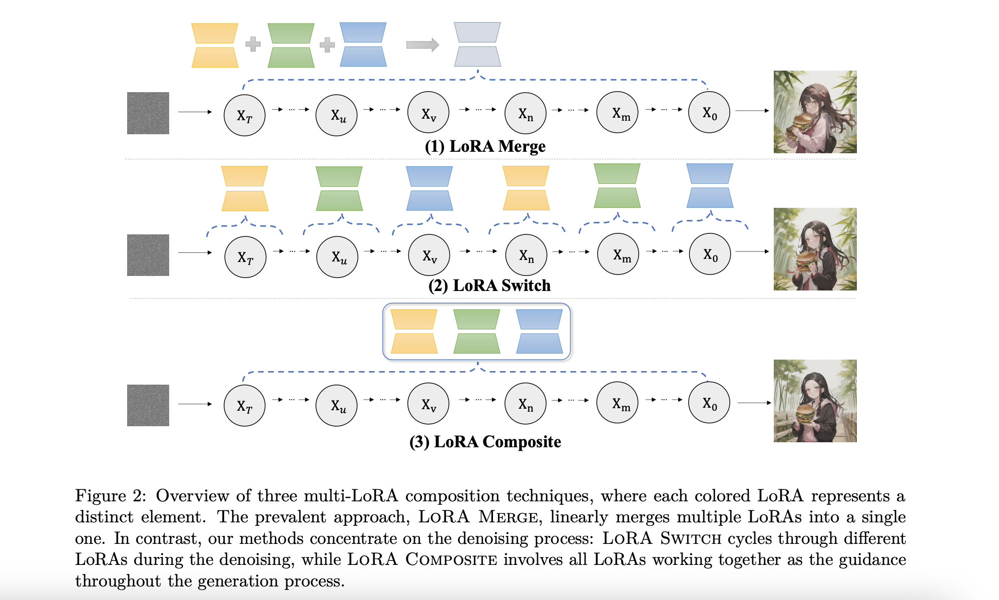

### 方法一：Merge（传统融合方法）

#### 核心原理

Merge 方法是最直接的融合方式，它将多个 LoRA 的权重**同时激活并加权平均**，在整个去噪过程中持续生效。

#### 代码实现

```python
# 在 example.py 中
if args.method == "merge":
    pipeline.set_adapters(cur_loras)  # 同时激活所有 LoRA
    switch_callback = None
```

#### 工作流程
1. **初始化阶段**：加载所有需要的 LoRA 模型
2. **激活阶段**：通过 `pipeline.set_adapters(["character", "clothing"])` 同时激活所有 LoRA
3. **生成阶段**：在每个去噪步骤中，UNet 同时应用所有 LoRA 的权重修正

#### 数学表示
在每个去噪步骤 t，噪声预测为：

```
noise_pred = UNet(latent_t, prompt_embeds, LoRA₁ + LoRA₂ + ... + LoRAₙ)
```

其中每个 LoRA 通过 `cross_attention_kwargs={"scale": 0.8}` 控制权重。

#### 优点
- ✅ 实现简单，计算开销小
- ✅ 生成速度快，只需一次前向传播

#### 缺点
- ❌ 多个 LoRA 权重叠加容易产生冲突
- ❌ 难以精确控制每个元素的表现
- ❌ 容易出现某些特征被"淹没"的问题

### 方法二：Switch（轮流切换方法）

#### 核心原理
Switch 方法通过**在去噪过程中定期切换激活的 LoRA**，让每个 LoRA 轮流发挥作用，避免权重冲突。

#### 代码实现

```python
# callbacks.py - 核心切换逻辑
def make_callback(switch_step, loras):
    def switch_callback(pipeline, step_index, timestep, callback_kwargs):
        callback_outputs = {}
        # 每隔 switch_step 步切换一次 LoRA
        if step_index > 0 and step_index % switch_step == 0:
            for cur_lora_index, lora in enumerate(loras):
                if lora in pipeline.get_active_adapters():
                    # 切换到下一个 LoRA
                    next_lora_index = (cur_lora_index + 1) % len(loras)
                    pipeline.set_adapters(loras[next_lora_index])
                    break
        return callback_outputs
    return switch_callback
```

```python
# example.py - 使用方式
if args.method == "switch":
    pipeline.set_adapters([cur_loras[0]])  # 先激活第一个 LoRA
    switch_callback = make_callback(switch_step=5, loras=cur_loras)

# 在生成时传入回调
image = pipeline(
    prompt=prompt,
    callback_on_step_end=switch_callback,  # 每步结束时检查是否需要切换
    ...
)
```

#### 工作流程
假设有 100 个去噪步骤，2 个 LoRA（character 和 clothing），switch_step=5：

```
步骤 0-4:    使用 LoRA_character
步骤 5-9:    切换到 LoRA_clothing
步骤 10-14:  切换到 LoRA_character
步骤 15-19:  切换到 LoRA_clothing
...循环往复
```

#### 关键参数
- `switch_step`：控制切换频率，默认为 5
  - 值越小：切换越频繁，融合越均匀
  - 值越大：每个 LoRA 作用时间越长，特征越明显

#### 数学表示
在步骤 t，激活的 LoRA 由当前步数决定：

```
active_lora = loras[(t // switch_step) % num_loras]
noise_pred = UNet(latent_t, prompt_embeds, active_lora)
```

#### 优点
- ✅ 避免了权重叠加冲突
- ✅ 每个 LoRA 都有独立发挥作用的时间
- ✅ 通过调整 switch_step 可以控制融合程度

#### 缺点
- ❌ 仍然是一次只用一个 LoRA，可能无法充分体现多个特征的协同效果
- ❌ 切换频率不好设置，可能导致特征不连贯

### 方法三：Composite（组合预测方法）

#### 核心原理
Composite 方法是本项目的**核心创新**。它在每个去噪步骤中：
1. 分别用每个 LoRA 独立预测噪声
2. 将所有预测结果取**平均值**
3. 用平均后的噪声进行去噪

这样既避免了权重冲突，又能充分利用所有 LoRA 的信息。

#### 代码实现

在 `pipeline.py` 的第 1023-1081 行：

```python
# 在去噪循环中
if lora_composite:
    adapters = self.get_active_adapters()  # 获取所有激活的 LoRA

# 在每个去噪步骤中
if lora_composite:
    noise_preds = []
    self.enable_lora()
    # 分别用每个 LoRA 预测噪声
    for adapter in adapters:
        self.set_adapters(adapter)  # 切换到当前 LoRA
        noise_pred = self.unet(
            latent_model_input,
            t,
            encoder_hidden_states=prompt_embeds,
            timestep_cond=timestep_cond,
            cross_attention_kwargs=self.cross_attention_kwargs,
            added_cond_kwargs=added_cond_kwargs,
            return_dict=False,
        )[0]
        noise_preds.append(noise_pred)
else:
    # 普通方法：只预测一次
    noise_pred = self.unet(...)

# 进行 CFG（Classifier-Free Guidance）
if self.do_classifier_free_guidance:
    if lora_composite:
        noise_preds = torch.stack(noise_preds, dim=0)
        # 分离条件和非条件预测
        noise_pred_uncond, noise_pred_text = noise_preds.chunk(2, dim=1)
        # 关键：对所有 LoRA 的预测取平均
        noise_pred_uncond = noise_pred_uncond.mean(dim=0)
        noise_pred_text = noise_pred_text.mean(dim=0)
        # 应用 CFG
        noise_pred = noise_pred_uncond + self.guidance_scale * (noise_pred_text - noise_pred_uncond)
```

#### 工作流程
在每个去噪步骤 t：

```
1. 当前潜在变量 latent_t
2. 用 LoRA_character 预测 → noise_pred_1
3. 用 LoRA_clothing 预测 → noise_pred_2
4. 用 LoRA_style 预测 → noise_pred_3
5. 平均噪声 = mean(noise_pred_1, noise_pred_2, noise_pred_3)
6. 用平均噪声更新 latent_t → latent_{t-1}
```

#### 使用方式

```python
# example.py
if args.method == "composite":
    pipeline.set_adapters(cur_loras)  # 激活所有 LoRA
    switch_callback = None

image = pipeline(
    prompt=prompt,
    lora_composite=True,  # 开启 composite 模式
    ...
)
```

#### 优点
- ✅ **避免权重冲突**：各 LoRA 独立预测，不会互相干扰
- ✅ **充分融合信息**：通过平均综合所有 LoRA 的特征
- ✅ **稳定性好**：平均操作具有降噪效果

#### 缺点
- ❌ **计算开销大**：需要进行 n 次 UNet 前向传播（n 是 LoRA 数量）
- ❌ **生成速度慢**：耗时是 Merge 方法的 n 倍
- ❌ **显存占用高**：需要存储多个预测结果


### 三种方法对比总结

| 特性 | Merge | Switch | Composite |
|------|-------|--------|-----------|
| **激活方式** | 同时激活所有 LoRA | 轮流激活单个 LoRA | 分别激活每个 LoRA |
| **前向传播次数** | 1次/步 | 1次/步 | n次/步 |
| **计算开销** | 低 | 低 | 高（n倍） |
| **生成速度** | 最快 | 快 | 最慢 |
| **融合质量** | 一般 | 较好 | 最好 |
| **特征冲突** | 严重 | 较少 | 无 |


<h2 id="6.在AIGC图像生成领域中，LoRA模型的离线融合和提取方式有哪些？">6.在AIGC图像生成领域中，LoRA模型的离线融合和提取方式有哪些？</h2>

Rocky向大家通俗易懂的讲解LoRA模型的融合和提取方式，**这主要是为了获得全新的特定效果的LoRA模型**。

**在2022年AIGC时代元年，Stable Diffusion + LoRA的模型融合方法在开源社区一度火爆非凡**。很多开源社区的AI绘画爱好者和AI绘画设计师对Stable Diffusion每一层的权重融合方式都进行了详细的实验与测试，**总结了很多广为流传的实验经验，比如SD的哪几层控制主体、哪几层控制颜色、哪几层控制风格、哪几层控制手型等**。

一晃多年过去了，SD系列也连续发布了SD 2.x、SDXL、SD 3等大模型，同时FLUX.1、FLUX.1 Kontext、FLUX.2也相继发布，**虽然我们不能将SD 1.x 的分层融合经验生搬硬套到最新的模型上，开源社区也没有更多精力对每一款AI绘画大模型进行如此详细的消融实验与测试**，但是SD 1.x 的分层融合经验还是给我们提供了很多灵感与认识AIGC大模型的不同视角，**以及会让我们想起AIGC元年大家的热情与兴奋，不知不觉也让我们哑然失笑**。

到目前为止，LoRA模型的主流融合方式一共有以下两种：

1. LoRA+LoRA全融合/分层融合来获得新LoRA模型。
2. SD/SDXL/SD 3/FLUX模型与LoRA全融合/分层融合来获得新LoRA模型。

除了LoRA模型的融合，**我们还能通过提取的方式**，在SD和FLUX.1系列模型中提取LoRA模型：

1. 两个SD/SDXL/SD 3/FLUX模型差分提取新LoRA模型。
2. 两个LoRA差分提取新LoRA模型。


<h2 id="7.在AIGC图像生成领域中，LoRA模型的微调训练流程一般包含哪几部分核心内容？">7.在AIGC图像生成领域中，LoRA模型的微调训练流程一般包含哪几部分核心内容？</h2>


<h2 id="8.在AIGC图像生成领域中，LoRA模型的微调训练流程中有哪些关键参数？">8.在AIGC图像生成领域中，LoRA模型的微调训练流程中有哪些关键参数？</h2>

### 【1】train_batch_size对LoRA模型训练的影响

和传统深度学习时代一样，train_batch_size即为训练时的batch size，表示一次性送入LoRA模型进行训练的图片数量。

从AI绘画的角度来解释Batch Size概念，可以把它比喻为一个画家在创作一系列作品时，每次着手处理的画作数量。

想象一下，一位画家接到了一批绘画任务，这些任务代表了机器学习中的整个数据集。如果画家一次只画一幅画，那么这就类似于机器学习中的“Batch Size”为1，这意味着每次只处理一个数据点（即一幅画）。这种方式可以让画家集中精力仔细处理每一幅画，但进度可能会比较慢，而且每幅画之间无法相互借鉴。

另一方面，如果画家选择同时着手处理多幅画作，比如说一次画六幅，这就相当于“Batch Size”为6。这样的话，画家可以在一定程度上提高效率，同时对比和学习不同画作之间的共同点和差异。在机器学习中，较大的“Batch Size”可以加快训练进度，并有助于模型更好地理解数据集的总体特征。

但是，如果“Batch Size”太大，比如一次处理60幅画，虽然看起来效率很高，但画家可能就难以专注于每一幅画的细节，可能会错过一些重要的元素。同样，在机器学习中，过大的“Batch Size”可能导致模型无法充分学习每个数据点的特性，影响最终的学习效果。

因此，选择合适的“Batch Size”就像画家需要找到同时处理多幅画作的最佳数量一样，既要保证质量，又要考虑效率。

**考虑到我们训练LoRA模型时一般数据量级不会太大（1-300张为主），所以我们可以设置Batch Size为2-6即可。**

### 【2】学习率对LoRA模型训练的影响

从AI绘画的角度来解释学习率概念，可以将其比喻为一位艺术家在绘画学习过程中调整绘画技巧的速度和程度。

我们想象一位画家正在学习如何绘制风景画。如果学习率很高，这就像是画家在每次尝试后都大幅度地改变他的绘画风格或技术。这样做的好处是，如果画家的当前风格距离理想的风格很远，他可以快速做出调整。但是，风险在于，如果调整过于激烈，可能会导致画作的风格不稳定，或者画家可能会在找到最佳风格之前就越过它错失了。

相反，如果学习率很低，那就像是画家在每次练习后只是微小地调整他的技术。这种方式较为稳妥，可以细致地探索不同的绘画风格，但进步的速度可能会很慢。如果画家的当前方法离理想风格相差甚远，他可能需要很长时间才能达到理想状态。

在机器学习中，学习率决定了模型权重调整的幅度。过高的学习率可能导致模型在最优解周围震荡，甚至发散，而过低的学习率会使训练过程缓慢，并且可能陷入局部最优解。因此，选择合适的学习率就像画家找到调整绘画技巧的合适速度一样重要。

**通常来说，在我们训练SD/SDXL LoRA时，将学习率设置为1e-4就够了。**

在LoRA的训练中，一共有三种学习率参数，分别是：

1. learning_rate：学习率，在没有指定U-Net 学习率和text_encoder学习率时生效。
2. unet_lr：设置U-Net的学习率，默认值是1e-5。
3. text_encoder_lr：设置Text_Encoder的学习率，一般取定值5e-6，也可以设置成成unet_lr的8-15分之一，调低该学习率参数有助于让Text_Encoder对训练集中的标签更敏感。

同时我们还可以根据LoRA模型的架构，**针对A矩阵和B矩阵使用不同学习率**。

$$A矩阵的学习率  = B矩阵的学习率 \times ratio$$ 

这样可以达到加速收敛，训练速度提升 1.5-2倍；并且Loss下降更快，提升整体训练效果。

### 【3】底模型（SD/SDXL/SD 3/FLUX系列模型）对LoRA模型训练的影响

从AI绘画的角度来解释使用预训练模型SD系列模型进行微调的过程，可以将其比喻为一位艺术家在学习绘画时先学习和模仿大师的作品，然后再根据自己的风格和需求进行调整和创新。

想象一位初学者画家想要成为一名肖像画家。他开始时可能没有足够的技能和知识从零开始画出精美的肖像。这时，他可能会先研究并模仿历史上著名的肖像画大师的作品，比如达芬奇或梵高的画作。通过这个过程，他学习了基础的构图、颜色使用、光影处理等技能。这就类似于在机器学习中使用一个预训练的模型，该模型已经被训练能够生成非常多的内容。

然而，这位画家可能会发现，虽然他现在能够模仿这些大师的风格，但这些风格可能并不完全符合他自己的个人表达或他想要描绘的特定主题。因此，他开始对这些技巧进行微调，调整色彩组合以更好地表达他自己的感觉，或改变构图来适应他的主题。这就类似于在机器学习中对预训练模型进行微调，即在特定的数据集或特定任务上进行额外的训练，以使模型更好地适应特定的应用场景。

通过这个过程，画家不仅节省了学习基础技能的时间，还能在大师的基础上发展出自己独特的风格。同样，在机器学习中，使用预训练模型进行微调可以显著减少所需的训练时间和数据，同时提高模型在特定任务上的表现。

**当我们在训练LoRA模型时，也需要根据任务场景选择合适的预训练底模型，比如二次元、卡通、真人、风格、概念、国风、科幻、设计、游戏、摄影、风景、建筑、服装、动物、3D、2.5D等。**

那我们该如何更好的选择合适的底模型呢？

Rocky总结了以下几点经验：

1. 要选择和训练集的分布/风格接近的底模型，如果一时无法找到合适的底模型，可以使用官方的Stable Diffusion 1.5、Stable Diffusion 2.1、Stable Diffusion XL、Stable Diffusion 3、FLUX系列做为底模型，其泛化性能较好。
2. 目前开源社区有微调训练得到的SD/FLUX系列模型和权重融合得到的合成SD/FLUX系列模型，我们优先使用微调训练得到的SD/FLUX系列模型作为底模型，其泛化性能比合成SD/FLUX系列模型要好，与此同时，合成SD/FLUX系列模型在细节相似度上可能会表现的更好。
3. LoRA模型在与底模型相似分布的其他底模型上生成图片的效果较好，比如使用2.5D的底模型训练了一个LoRA，在其他2.5D的SD模型上也会有较好的效果，但是在写实风格的SD/FLUX模型上效果可能一般。

### 【4】训练轮数（Epoch）对LoRA模型训练的影响

从AI绘画的角度来解释epoch概念，可以把它比喻为一位艺术家在创作过程中对作品的一次完整的审视和修正周期。

想象一位画家正在画一幅风景画。在这个过程中，他不是只画一遍就完成了。相反，他可能会多次回顾和修改画作，每一次都在整个画布上增加细节、调整颜色平衡或改善光影效果。每完成一次这样的过程，就相当于完成了一次epoch。

在机器学习中，一个epoch指的是训练算法在整个训练数据集上的一次完整训练迭代。就像画家在每一次审视中都会观察和修改画布上的每一部分，机器学习模型在一个epoch中会评估并调整其参数以更好地学习数据集中的特征和模式。

多个epochs对于机器学习模型至关重要，因为它们允许模型多次从错误中学习，逐渐提高其对数据的理解。这就像画家通过多次修正作品，不断提高作品的质量一样。然而，就像绘画一样，过多的epochs并不总是好事，可能会导致“过度训练”，就像画家过度修饰画作可能会损害其原始美感一样。因此，选择适当数量的epochs是优化机器学习模型性能的关键。

**通常来说，我们在训练LoRA模型时，epoch的设置能够保证数据集中的每张图片训练100步即可。**

### 【5】clip_skip参数对LoRA训练的影响

我们都知道，在SD模型和LoRA模型的训练和推理中，CLIP模型的输出作为SD系列中U-Net模型的输入，设置clip_skip=2表示使用CLIP的倒数第二层特征输出作为后续的输入，设置clip_skip=1表示使用CLIP的最后一层输出作为后续的输入。

NovelAI的实验证明，**使用CLIP的倒数第二层特征能让LoRA模型更好的学习输入标签的文本信息，LoRA模型能够更快地学习一些概念特征**。当使用最后一层的特征时，LoRA模型在训练过程中有可能还是无法理解不同概念和颜色方面的区分，因为CLIP的参数权重值在最后一层突然变化，很多细节特征都丢失了。

**所以当我们训练LoRA模型时，可以设置clip_skip=2。**

注意：当我们训练SD V2.0/V2.1模型时，默认使用CLIP倒数第二层的输入，这时我们需要省略clip_skip参数。

### 【6】network_dimension参数对LoRA训练的影响

**network_dimension是LoRA模型的特征维度参数，也就是上文讲到的LoRA进行低秩分解中的秩。**

那么我们该怎么设置network_dimension这个参数呢？

在这里Rocky也向大家分享一些经验：

1. 当我们使用的训练集内容比较复杂抽象时，我们可以适当设置高network_dimension，提升LoRA模型的学习能力。
2. network_dimension参数并不是设置的越高越好。设置高network_dimension有助于LoRA模型学习到更多细节特征，但整体上模型的收敛速度变慢，需要的训练时间更长，同时也更容易过拟合。
3. 当我们训练高分辨率（1024x1024）的训练集时，可以设置高network_dimension，比如说128。
4. 训练人物时，可以设置network_dimension = 32-64；训练风格时，可以设置network_dimension = 64-128；训练抽象概念时，可以设置network_dimension = 128-192或者更高。
5. 通常来说，我们设置network_dimension = 128能够兼顾到各个情况，算是一个比较平均的值，有效减少过拟合与欠拟合发生的概率。当network_dimension = 128时，SD LoRA保存下来的文件大小为144MB。

### 【7】alpha参数

alpha参数将LoRA模型权重进行放缩从而防止下溢并稳定学习， 我们可以将其设置为network_dimension参数的一半。

使用alpha参数后，LoRA模型的参数$W = W_{in} \times alpha/dim$。alpha参数设置的越大，LoRA模型越倾向于拟合更多的细节，学习速率也越快。在原生LoRA模型中可以取值[1,dim]，在LoCon或者LoHa模型中，推荐取值 $[\frac{dim}{2},dim]$。

```python
self.scale = alpha / self.lora_dim
def forward(self, x):
        if self.region is None:
            return self.org_forward(x) + self.lora_up(self.lora_down(x)) * self.multiplier * self.scale
```

### 【8】scheduler、cycle、lr_warmup_steps以及optimizer_type参数

1. scheduler（学习率调度器）：学习率调度器用于调整优化器的学习率。在训练过程中，**学习率调度器能够动态地改变学习率**。常见的调度策略包括分段常数衰减、指数衰减、余弦退火（"cosine_with_restarts", "cosine", "polynomial", "constant", "constant_with_warmup", "linear"）等，**推荐使用 cosine_with_restarts**，它会使学习率从高到低下降，变化速度先慢后快再慢。
2. cycle（周期）：在一些周期性调度器（如余弦退火）中，**cycle参数能够指定学习率变化的周期性，一般可以设置为4-8**。例如在余弦退火调度器中，学习率会按照一个余弦函数的周期性变化，这种变化可以**帮助模型在训练过程中找到更好的局部最优解，避免过早收敛到次优解**。
3. lr_warmup_steps（学习率预热步骤）：**学习率预热是一种在训练初期设置一个小学习率并逐渐增大的策略**。这样做的好处是可以在训练初期防止模型过早发散，同时让优化过程更平稳地进入主要的学习率调度阶段。
4. optimizer_type（优化器类型）：**优化器是用于更新模型权重以拟合损失函数的算法**。常见的优化器包括SGD（随机梯度下降）、Adam（自适应矩估计）、RMSprop等。不同的优化器有不同的优化策略和适用场景，例如SGD通常适用于大型数据集和深层网络，它有助于防止模型过早收敛到局部最小值。而Adam优化器则结合了动量和自适应学习率的特点，通常在小数据集上表现更好。如果我们的显卡显存不够，可以使用AdamW8bit，能一定程度上降低模型训练时的显存占用。
5. -**-optimizer_args 选项用于指定优化器选项参数**。可以以key=value的格式指定多个值，用逗号分隔，比如说optimizer_args = [ "scale_parameter=False", "relative_step=False", "warmup_init=False",]。
### 【9】gradient_checkpointing

**开启gradient_checkpointing能够减少显存占用**，从而能够设置更大的Batch Size，但是会减慢训练速度。开启gradient_checkpointing后，逐步更新模型权重而不是在训练期间一次更新所有模型权重。

### 【10】--xformers / --mem_eff_attn

开启--xformers参数后，训练时的显存占用大幅下降，非常好用！

### 【11】prior_loss_weight

当我们使用正则数据集来约束LoRA模型的训练时，**设置prior_loss_weight来控制先验知识的正则化强度**，默认为1。当使用100张以上正则数据集时，可以设置为0.05-0.1。正则化权重过高比如1时，LoRA模型的收敛难度会增大很多。**一般在训练画风时推荐使用正则化**。

### 【12】训练分辨率（training resolution）对LoRA训练的影响

总的来说，如果显卡的显存允许，尽量选择大分辨率进行训练。**在较低的分辨率（比如512）下，训练数据中的很多细节特征将会被压缩丢失，甚至人物脸部特征的崩坏**。

当我们**使用大分辨率（比如768、1024等）训练时，LoRA模型能够学习到数据集中的精细特征和细节信息，图片的生成质感、美感以及精细度都会大大增强**。

但是当数据集中人物脸部和手部等特征在图片中的占比本身就非常小时（比如一些人物远景图像），即使使用大分辨率训练，对图像生成的效果提升也不大。这种情况下最好的办法是删除这些不合格的低质量远景图片，能从根源上解决这个问题。

### 【13】长宽比分桶训练策略（Aspect Ratio Bucketing）详解

目前AI绘画开源社区中很多的LoRA模型和Stable Diffusion模型都是基于**单一图像分辨率**（比如1:1）进行训练的，这就导致当我们想要**生成不同尺寸分辨率的图像**（比如1:2、3:4、4:3、9:16、16:9等）时，非常容易生成结构崩坏的图像内容。

如下图所示，**为了让所有的数据满足特定的训练分辨率，会进行中心裁剪和随机裁剪等操作，这就导致图像中人物的重要特征缺失：**

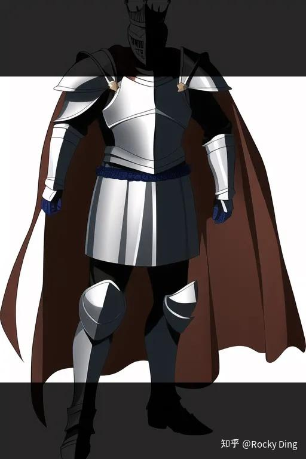

这上面这种情况下，我们训练的LoRA模型和Stable Diffusion模型在生成骑士图像的时候，就会出现缺失的骑士特征。

与此同时，**裁剪后的图像还会导致图像内容与标签内容的不匹配**，比如原本描述图像的标签中含有“皇冠”，但是显然裁剪后的图像中已经不包含皇冠的内容了。

长宽比分桶训练策略（Aspect Ratio Bucketing）就是为了解决上面的问题孕育而生。**长宽比分桶训练策略的本质是多分辨率训练**，就是在LoRA模型的训练过程中采用多分辨率而不是单一分辨率，多分辨率训练技术在传统深度学习时代的目标检测、图像分割、图像分类等领域非常有效，在AIGC时代终于有了新的内涵，在AI绘画领域重新繁荣。

那么在AI绘画领域中是如何使用长宽比分桶训练策略这个技术的呢？**主要通过数据分桶+多分辨率训练两者结合来实现。我们设计多个存储桶（Bucket），每个存储桶代表不同的分辨率（比如512x512、768x768、1024x1024等），并将数据存入对应的桶中。在LoRA训练时，随机选择一个桶，从中采样Batch大小的数据用于多分辨率训练。下面Rocky详细介绍一下完整的流程。**

我们先介绍如何对训练数据进行分桶，**这里包含存储桶设计和数据存储两个部分**。

首先我们需要设置存储桶（Bucket）的数量和每个存储桶代表的分辨率。我们定义最大的整体图像像素为1024x1024，最大的单边分辨率为1024。

这时我们以64像素为标准，设置长度为1024不变，宽度以1024为起点，根据数据集中的最小宽度设计存储桶（假设为512），具体流程如下所示：

```python
设置长度为 1024，设置宽度为 1024
设置桶数量为 0
当宽度大于数据集最小宽度 512 时:
    宽度 = 宽度 - 64 （ 960 ）
    那么 （ 960 ， 1024 ）作为一个存储桶的分辨率
    以此类推设计出长度不变，宽度持续自适应的存储桶
```

按照上面的流程，我们可以获得如下的存储桶：

```python
bucket 0 (512, 1024)
bucket 1 (576, 1024)
bucket 2 (640, 1024)
bucket 3 (704, 1024)
bucket 4 (768, 1024)
bucket 5 (832, 1024)
bucket 6 (896, 1024)
bucket 7 (960, 1024)
```

接着我们再以64像素为标准，设置宽度为1024不变，长度以1024为起点，根据数据集中的最小长度设计存储桶（假设为512），按照上面相同的规则，设计对应的存储桶：

```python
bucket 8 (1024, 512)
bucket 9 (1024, 576)
bucket 10 (1024, 640)
bucket 11 (1024, 704)
bucket 12 (1024, 768)
bucket 13 (1024, 832)
bucket 14 (1024, 896)
bucket 15 (1024, 960)
```

最后我们再将1024x1024分辨率作为一个存储桶添加到分桶列表中，从而获得完整的分桶列表：

```python
bucket 0 (512, 1024)
bucket 1 (576, 1024)
bucket 2 (640, 1024)
bucket 3 (704, 1024)
bucket 4 (768, 1024)
bucket 5 (832, 1024)
bucket 6 (896, 1024)
bucket 7 (960, 1024)
bucket 8 (1024, 512)
bucket 9 (1024, 576)
bucket 10 (1024, 640)
bucket 11 (1024, 704)
bucket 12 (1024, 768)
bucket 13 (1024, 832)
bucket 14 (1024, 896)
bucket 15 (1024, 960)
bucket 16 (1024, 1024)
```

完成了分桶的数量与分辨率设计，**我们接下来要做的是将数据集中的图片存储到对应的存储桶中。**

那么，具体是如何将不同分辨率的图片放入对应的桶中呢？

我们首先计算存储桶分辨率的长宽比，对于数据集中的每个图像，我们也计算其长宽比。这时我们将长宽比最接近的数据与存储桶进行匹配，并将图像存入对应的存储桶中，下面的计算过程代表寻找与数据长宽比最接近的存储桶：

$$imagebucket = = argmin(abs(bucket_aspects-image_aspect))$$

**如果图像的长宽比与最匹配的存储桶的长宽比差异依然非常大，则从数据集中删除该图像。所以我们最好在数据分桶前将数据进行精细化筛选，增加数据的利用率。**

当image_aspect与bucket_aspects完全一致时，可以直接将图片放入对应的存储桶中；当image_aspect与bucket_aspects不一致时，需要对图片进行中心裁剪，获得与存储桶一致的长宽比，再放入存储桶中。中心裁剪的过程如下图所示：

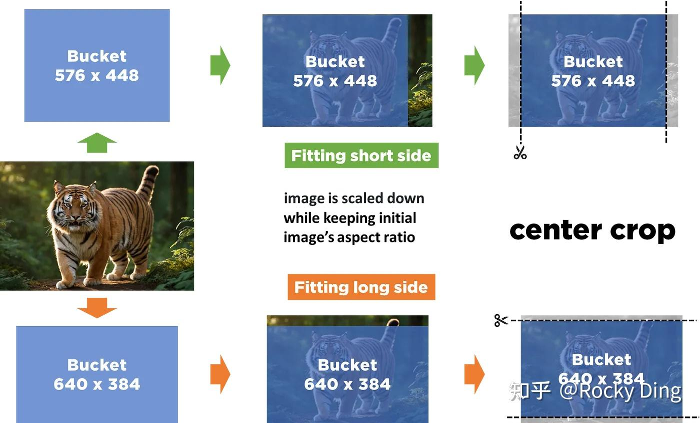

由于我们以经做了精细化的存储桶设计，所以出现**长宽比不匹配时的图像裁剪比例一般小于0.033，只去除了小于32像素的实际图像内容，所以对训练影响不大**。

在完成数据的分桶存储后，接下来Rocky再讲解一下在训练过程中如何基于存储桶实现多分辨率训练过程。

在LoRA模型的训练过程中，我们需要从刚才设计的16个存储桶中**随机采样一个存储桶**，并且**确保每次能够提供一个完整的Batch数据**。当遇到选择的存储桶中数据数量不够Batch大小的情况，需要进行**特定的数据补充策略**。

为了解决上述的问题，**我们需要维护一个公共桶（remaining bucket）**，其他存储桶中的数据量不足Batch大小时，将剩余的数据全部放到这个公共桶中。在每次迭代的时候，如果是从常规存储桶中取出数据，则训练分辨率调整成存储桶对应的分辨率。如果是从公共桶中取出，则训练分辨率调整成设计分桶时的基础分辨率，也就是1024x1024。

同时**我们将所有的存储桶根据桶中数据量进行权重设置，具体的权重计算方式为这个存储桶的数据量除以所有剩余存储桶的数据量总和**。如果不通过权重来选择存储存储桶，数据量小的存储桶会在训练过程的早期就被用完，而数据量最大的存储桶会在训练结束时仍然存在，**这就会导致存储桶在整个训练周期中采样不均衡问题**。通过按数据量加权选择桶可以避免这种情况。

### 【14】扩展Stable Diffusion Token为原来的3倍

官方的SD系列模型的能够接收的最大提示词长度为75个CLIP Tokens，再加上一个开始和结束Token总共77个。

由于我们训练LoRA模型的时候可能会使用信息密集的长文本标签，因此很容易超过77个Tokens的限制。**所以我们需要将模型的最大提示长度进行扩展，更长的提示词将更多信息注入到单次图像的生成中，能够更好的对生成图像进行内容的细粒度控制**。

那么我们该如何扩展SD模型和LoRA模型能够接受的输入Tokens最长长度呢？

其实很简单，我们将输入的提示词Tokens沿序列维度拆分城多个75个Tokens的单独子提示词序列，接着将每个子提示词序列都通过CLIP的文本编码器，获得对应的Text Embeddings，最后将生成的Text Embeddings进行连接（concatenate），如下所示：

```python
+---+---+       +---+---+
| 1 | 2 |       | 5 | 6 |
+---+---+  ==>  +---+---+
| 3 | 4 |       | 7 | 8 |
+---+---+       +---+---+

+---+---+---+---+
| 1 | 2 | 5 | 6 |
+---+---+---+---+
| 3 | 4 | 7 | 8 |
+---+---+---+---+
```

但是直接的拆分与拼接可能会导致输入文本语义被破坏的情况，比如说在对输入提示词进行拆分时，在拆分的边界处有 beautiful girl ，则有可能将beautiful代表的Token拆分到前一组中，girl代表的Token将拆分到后一组中。这种不合理的拆分会导致文本语义信息的bias，从而影响模型的生成效果。

为了解决这个问题，我们可以增加一些约束规则，**比如说通过查找输入提示词的逗号来区分文本语义**，而不是单独的单词。完整流程如下所示：

```python
输入文本提示词为 `...,WeThinkIn,beautiful girl,AIGCmagic,...`

第 75 个词为 `beautiful`

根据Token数量直接拆分：

集合 1:{..., [74]=WeThinkIn, [75]=beautiful}，集合 2:{[76]=girl, [77]=AIGCmagic, ...}

使用约束规则进行拆分：

集合 1:{..., [74]=WeThinkIn，[75]=“通过padding补全”}，集合 2:{[76]=beautiful，[77]=girl, ...}
```

### 【15】优化器选择对LoRA模型训练的影响

1. AdamWScheduleFree是无调度器的AdamW变体优化器，其优势在于能够自动调整学习率，无需手动配置lr_scheduler。推荐设置参数：weight_decay=0.08, weight_lr_power=0。
2. SGDScheduleFree是无调度器的SGD变体优化器，其优势是能够更稳定的收敛，减少超参数调优工作。
3. StableAdamW比标准AdamW更稳定，能够减少训练波动，适合不稳定的数据集中采用。
4. Ranger (RAdam + LookAhead)结合了RAdam和LookAhead优势，有更平滑的优化路径，适合复杂场景训练。

| 特性           | Merge                | Switch                | Composite              |
| :------------- | :------------------- | :-------------------- | :--------------------- |
| 激活方式       | 同时激活所有 LoRA    | 轮流激活单个 LoRA     | 分别激活每个 LoRA      |
| 前向传播次数   | 1次/步               | 1次/步                | n次/步                 |
| 计算开销       | 低                   | 低                    | 高（n倍）              |
| 生成速度       | 最快                 | 速度和Merge相当       | 最慢                   |
| 融合质量       | 一般                 | 较好                  | 最好                   |
| 特征冲突       | 严重                 | 较少                  | 无                     |

### 【16】训练精度对LoRA模型训练的影响

如果大家的算力资源非常有限，我们在训练LoRA模型时可以尝试开启FP8精度训练。FP8比FP16能够再节省约30%显存，适用于在消费级24GB显卡上跑更大的batch size，同时精度损失极小。


<h2 id="9.在AIGC图像生成领域中，LoRA有哪些主流的变体模型？介绍一下这些变体模型（LoCon、LoHa、B-LoRA、LCM_LoRA等）的特点">9.在AIGC图像生成领域中，LoRA有哪些主流的变体模型？介绍一下这些变体模型（LoCon、LoHa、B-LoRA、LCM_LoRA等）的特点</h2>

### LoCon核心基础知识深入浅出完整讲解

LoCon（LoRA for Convolution Network）模型是LoRA 技术在卷积神经网络（CNN）中的扩展与适配，核心是将低秩分解思想从Transformer的线性层（如 Attention 的 QKV 变换、全连接层）迁移到卷积层，实现卷积模型的参数高效微调（PEFT）。理论上能够实现更细粒度的生成内容的控制。

下图中红色框部分代表LoCon模型在LoRA模型基础上额外增加的训练部分：

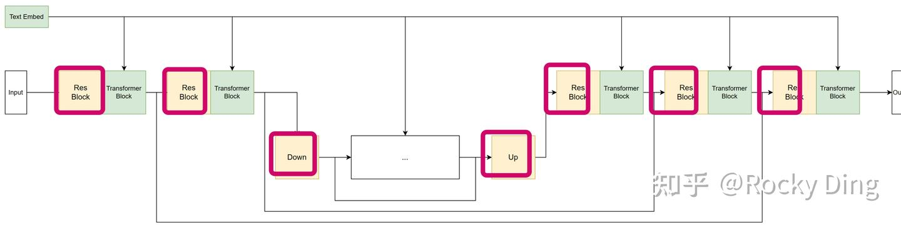
LoRA模型对卷积层是使用1x1卷积进行降维，而LoCon模型将1x1卷积切换成正常尺寸的卷积进行降维，降维到预设的Rank（lora_dim）。

我们先来回顾一下传统深度学习领域中卷积的计算过程：
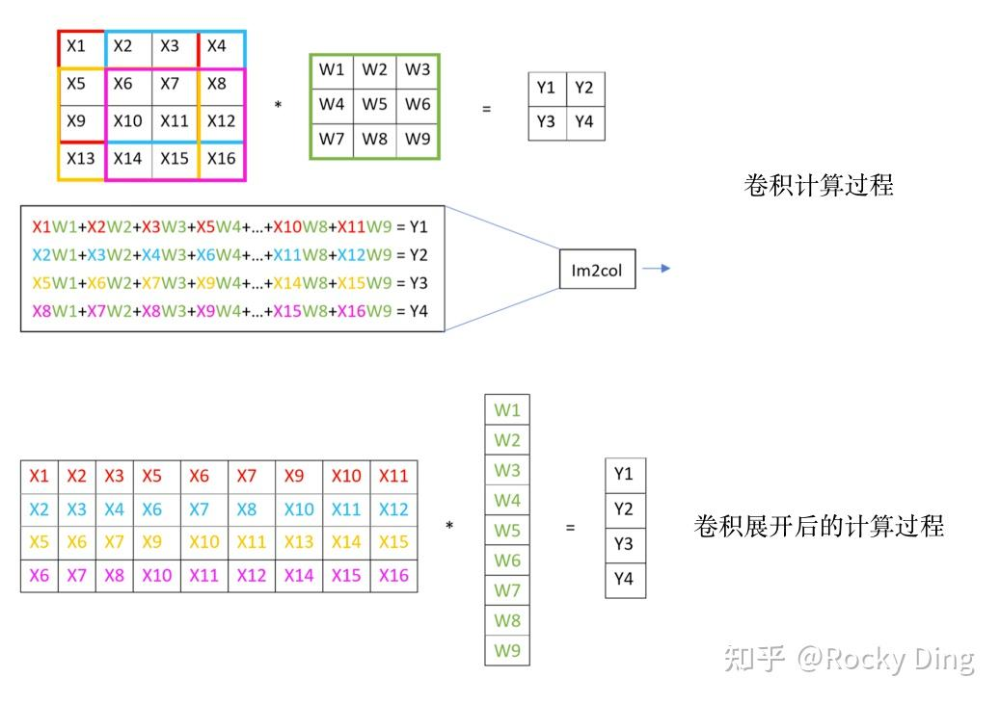
接下来我们看看使用LoCon技术后，SD系列模型的卷积层权重的变化：

$$
\begin{aligned}
& Conv(in, out, ksize, padding, stride) \\
\rightarrow & \ Conv(rank, out, 1) \circ Conv(in, rank, ksize, padding, stride)
\end{aligned}
$$

使用了LoCon技术后，SD系列模型+LoCon模型的FLOPS变化如下所示：

$$
before = out_ch \times in_ch \times size^2 \times out_h \times out_w
$$

$$
after = (out_ch \times \text{LoRA\_rank} + \text{LoRA\_rank} \times in_ch \times size^2) \times out_h \times out_w
$$

同时训练时的参数数量也发生了变化：

$$
before = out_ch \times in_ch \times size^2
$$

$$
after = \text{LoRA\_rank} \times in_ch \times size^2 + \text{LoRA\_rank} \times out_ch
$$

LoCon在实验中得出可以比LoRA模型在训练中更快地拟合（例如，**LoCon模型在训练600步可以达到LoRA模型训练800步的生成性能**）。这表明LoCon模型可能在训练角色或特定特征上更为高效。另外，将LoCon模型应用于人物角色的风格化上也表现不错。
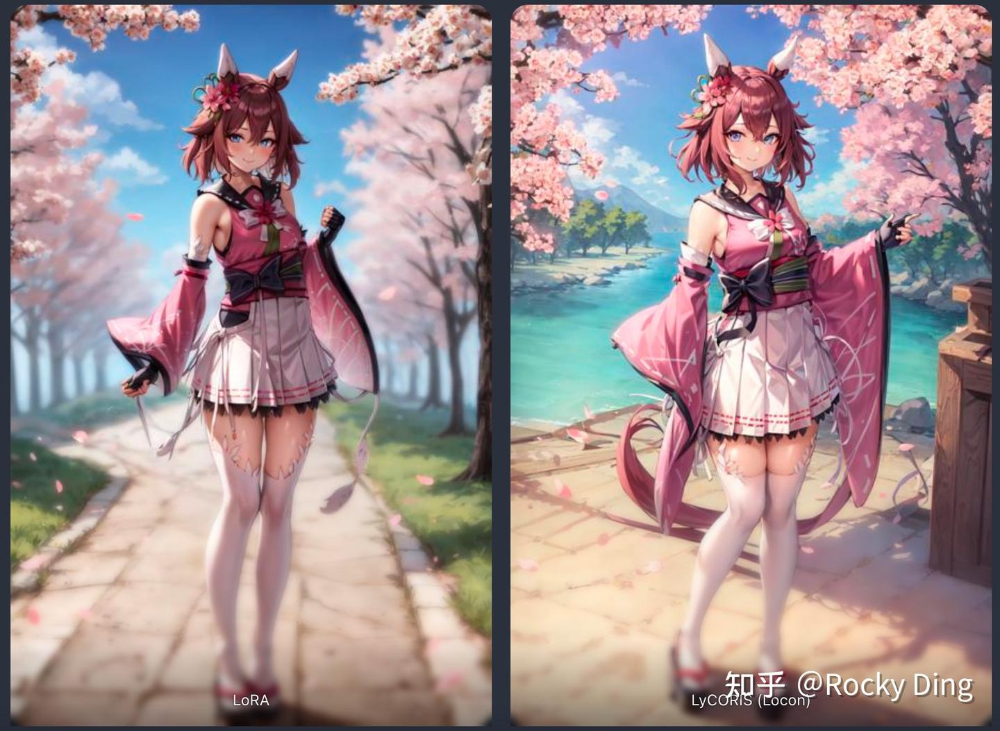
**LoCon推荐训练参数设置：dim <= 64，alpha = 1 (或者更小，比如说0.3)**

下面我们看看LoCon模型和LoRA模型在处理卷积层的具体区别：

LoRA模型处理卷积层的代码：

```python
if org_module.__class__.__name__ == 'Conv2d':
      in_dim = org_module.in_channels
      out_dim = org_module.out_channels
      self.lora_down = torch.nn.Conv2d(in_dim, lora_dim, (1, 1), bias=False)
      self.lora_up = torch.nn.Conv2d(lora_dim, out_dim, (1, 1), bias=False)
else:
      in_dim = org_module.in_features
      out_dim = org_module.out_features
      self.lora_down = torch.nn.Linear(in_dim, lora_dim, bias=False)
      self.lora_up = torch.nn.Linear(lora_dim, out_dim, bias=False)
```

LoCon模型处理卷积层的代码：

```python
if org_module.__class__.__name__ == 'Conv2d':
            # For general LoCon
            in_dim = org_module.in_channels
            k_size = org_module.kernel_size
            stride = org_module.stride
            padding = org_module.padding
            out_dim = org_module.out_channels
            self.lora_down = nn.Conv2d(in_dim, lora_dim, k_size, stride, padding, bias=False)
            self.lora_up = nn.Conv2d(lora_dim, out_dim, (1, 1), bias=False)
else:
            in_dim = org_module.in_features
            out_dim = org_module.out_features
            self.lora_down = nn.Linear(in_dim, lora_dim, bias=False)
            self.lora_up = nn.Linear(lora_dim, out_dim, bias=False)
```

### LoHa核心基础知识深入浅出完整讲解

上面讲到的LoCon主要是对LoRA进行工程应用层面的改造优化（将LoRA的应用扩展到SD/FLUX系列模型的卷积层），接下来我们要讲的**LoHa模型主要是针对LoRA的低秩矩阵分解理论层面进行优化**。

LoHa (LoRA with Hadamard Product)是在LoRA的基础上，使用了哈达玛积（Hadamard Product）代替原生LoRA中的矩阵点乘，将秩的维度从2R扩展到 $R^{2}$，让LoHa理论上在相同的参数配置下能学习到更多的数据分布信息。
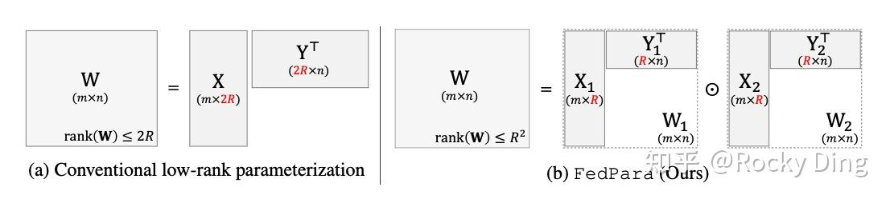
读者朋友可能对哈达玛积不太熟悉，Don't Worry。我们先来了解一下什么是哈达玛积：**哈达玛积（Hadamard Product），又称逐元素乘积（element-wise product），是线性代数中的一种矩阵运算。它与标准矩阵乘法不同，哈达玛积是对两个相同大小的矩阵的对应元素进行乘积运算。**

给定两个相同大小的矩阵 $A$ 和 $B$ ，它们的哈达玛积 $C$ 定义如下：

$$C = A \circ B$$

其中 $C$ 的每个元素 $c_{ij}$ 计算为：

$$c_{ij} = a_{ij} \times b_{ij}$$

例如，假设有以下两个矩阵 $A$ 和 $B$：

$$A = \begin{bmatrix}
1 & 2 \\
3 & 4
\end{bmatrix}, \quad
B = \begin{bmatrix}
5 & 6 \\
7 & 8
\end{bmatrix}$$

它们的哈达玛积 $C$ 为：


$$C = A \circ B = \begin{bmatrix}
1 \times 5 & 2 \times 6 \\
3 \times 7 & 4 \times 8
\end{bmatrix}
= \begin{bmatrix}
5 & 12 \\
21 & 32
\end{bmatrix}$$

秩的维度小于2R从上面的公式中可以看到，**哈达玛积通过对两个矩阵的逐元素乘积，能够有效地对矩阵进行特征组合、权重计算和信息传播，增强AI模型的表达能力和计算效率**。

在LoHa模型中，应用了哈达玛积后，低秩分解后的形式就转变成如下所示的公式：

$$
\Delta W = (X_1 Y_1^T) \odot (X_2 Y_2^T)
$$

其中需要满足条件：

$$
rank(\Delta W) \leq R^2
$$

可以看到比起原生LoRA的秩的维度小于 $2R$，LoHa将秩的维度扩展到 $R^2$，**解决了原生LoRA受到低秩的限制**。这个思路不仅仅能够用在AIGC图像生成/AI绘画领域，在AIGC其他领域中都可以借鉴与迁移。

**LoHa训练经验分享：**

1. **LoHa推荐训练参数设置：dim <= 32，alpha = 1 (or lower)**
2. LoHa不适合训练特征不太明确的画风，同时也比较难收敛，**LoHa通常需要比LoRA和LoCon更多的训练步数才能达到较好的效果**。

### LCM_LORA模型深入浅出完整解析

在讲LCM_LoRA之前，Rocky先简单介绍一下LCM模型。

**LCM模型的全称是Latent Consistency Models（潜在一致性模型）**，由清华大学交叉信息研究院发布。在这个模型发布之前，以Stable Diffusion/FLUX等为主的潜在扩散模型（LDM）由于迭代采样过程计算量大，生成速度较慢。而LCM模型通过将原始LDM模型进行一致性蒸馏技术训练，最后得到一个只用少数的几步推理就能生成高分辨率图像的AIGC图像生成大模型。一般来说，**LCM模型能将主流文生图模型的效率提高5-10倍，所以能呈现出实时生成的效果**。

关于LCM等扩散模型的核心理论知识，大家可以研读Rocky一直在撰写完善的文章：
[深入浅出完整解析扩散模型DDPM、DDIM、SDE、Classifier/Classifier-Free Guidance、Rectified Flow核心基础知识](https://zhuanlan.zhihu.com/p/1964029619658261252)

**在AIGC图像生成/AI绘画领域中，如果使用原始LCM进行蒸馏训练，那么每个SD/FLUX模型都需要单独蒸馏，这无疑增加了AI绘画开源社区SD/FLUX模型迭代更新的成本。**

这时候，就该LCM_LoRA模型登场了，**LCM_LoRA 是LCM与LoRA技术的创新性结合，LCM_LoRA模型的核心思想是将LCM的蒸馏目标浓缩到LoRA模型的少量参数上，而不用对完整SD/FLUX模型进行完整的微调训练**，解决了传统LCM 蒸馏成本高、通用性差的核心痛点。在前向推理时，可将训练好的LCM_LoRA模型用于任何一个微调后的SD/FLUX模型，无需再对SD/FLUX模型重新进行蒸馏训练。

**通过将LCM_LoRA模型加载到SD/FLUX模型中，可以将SD/FLUX模型的推理步数减少到仅2至8步，而不是常规的25至50步**。在使用LCM_LoRA模型的情况下，SDXL模型在3090显卡上运行只需要大约1秒钟。除了文生图任务外，LCM_LoRA模型还支持图生图任务、图像重绘（inpainting）以及其他SD模型与LoRA模型结合使用的任务场景。


<h2 id="10.如何训练得到差异化LoRA？差异化LoRA的作用是什么？">10.如何训练得到差异化LoRA？差异化LoRA的作用是什么？</h2>

**残差/差异化LoRA模型可以说是一种巧妙优雅的LoRA训练思想。**

残差/差异化LoRA模型最早在AIGC开源社区被提出，展现了开源社区的集体智慧。这种LoRA模型的特殊性源自于其训练思想，**旨在让LoRA模型学习两类图像之间的差异**。因此，在LoRA、LoCon、LoHa等架构以及SD、FLUX等不同的AIGC大模型上都能运用这个训练思想，训练对应配套的残差/差异化LoRA模型。

**训练得到的残差/差异化LoRA模型一般用于优化生成图像的整体质量（Low-Level功能），比如美颜美白、美肤、祛痘、磨皮、精修、细节增强、质感加强、光影增强等。**

那么，残差/差异化LoRA模型是如何训练的呢？首先我们需要构建两张内容相似的图像：图 A 和图 B。例如下图所示，左图AI感更强，右图质感更强，整体更自然。

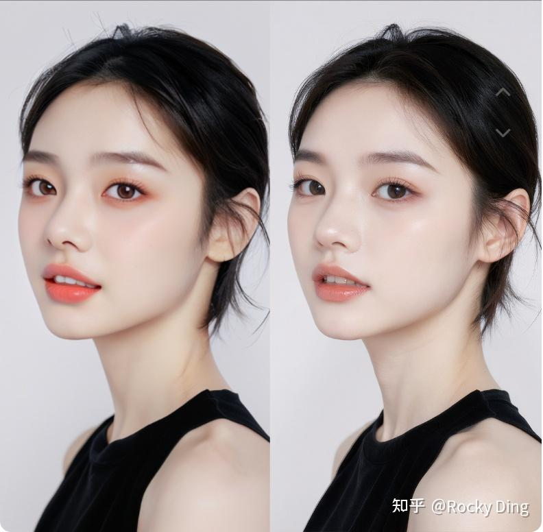

在残差/差异化LoRA的训练中，我们分两步进行训练：

1. 以图 A 为训练数据，由于训练数据仅有一张图，过拟合训练得到LoRA A。
2. 以图 B 为训练数据，由于训练数据同样仅有一张图，再次过拟合训练得到LoRA B。

接着我们将两个训练好的LoRA B和LoRA A做差：LoRA B - LoRA A，就最终得到了残差/差异化LoRA C模型。

一张训练数据可以保证LoRA模型能够过拟合到训练数据上，但稳定性不足。为了提高稳定性，我们可以用多个图像对（image pairs）进行训练，从而得到效果更稳定的残差/差异化LoRA模型。

到此为止，我们已经了解了残差/差异化LoRA模型的训练过程。我们可以举一反三，比如使用丑陋的和漂亮的图像对，训练提升图像美感的 LoRA；或者使用细节少的和细节丰富的图像对，训练增加图像细节的LoRA。

**一般来说，使用残差/差异化LoRA模型时不需要提示词，对生成图像的构图几乎没有影响，可以说是一种“万金油”的LoRA模型系列。**


<h2 id="11.在AIGC图像生成领域中，介绍一下MoE-LoRA的核心原理">11.在AIGC图像生成领域中，介绍一下MoE-LoRA的核心原理</h2>

和LoRA技术本身一样，MoE框架也首发于LLM大模型领域，并逐步引入到AIGC图像生成/AI绘画领域中来。相比主流的经典LoRA系列，**LoRA + MoE的思想确实能够在参数量日渐庞大的AIGC图像生成大模型上明显提升微调效率**。
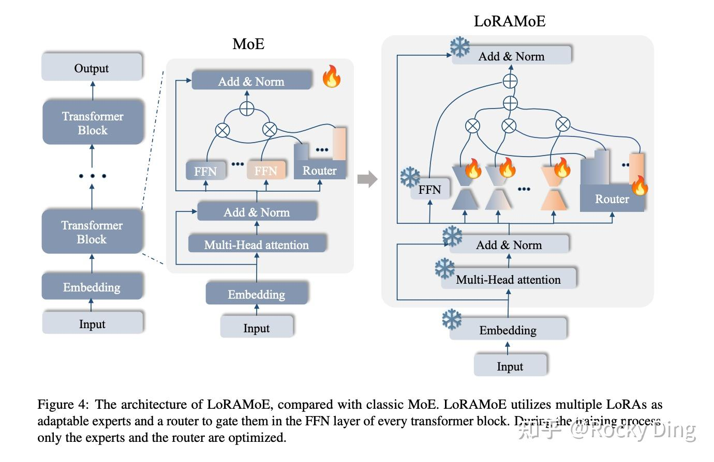
为了保持负载平衡和训练效率，除了引入辅助损失外，我们还可以设置以下的策略:

- **设置随机路由**：在专家网络Top-2规则设置中，除了排名最高的专家网络被选择，第二个专家网络根据其权重比例随机选择。
- **计算专家容量**：我们可以设定一个阈值，来定义一个专家网络能处理多少Tokens。如果两个专家网络的容量都达到上限，Tokens就会溢出，可以通过残差连接传递到下一层，或者被完全丢弃。

**专家网络容量的具体概念如下所示：**

$$
\text{Expert Capacity} = \left( \frac{\text{tokens per batch}}{\text{number of experts}} \right) \times \text{capacity factor}
$$

其中capacity factor代表容量因子。合适的专家网络容量能够将输入的Tokens均匀分配到各个专家网络中去。如果我们使用大于 1 的容量因子，我们可以为Tokens分配不完全平衡时提供了一个缓冲。不过增加容量因子会导致更高的设备间通信成本，**因此这是一个需要权衡的参数**。一般来说，**容量因子设置为1 至 1.25时能够展现出色的性能**。

同时，**稠密模型和稀疏模型在过拟合的表现上存在显著差异**。MoE稀疏模型更易于出现过拟合现象，因此在构建MoE-LoRA模型时，我们可以尝试使用更强的内部正则化策略，比如使用更高比例的dropout。具体来说，**我们可以为大模型中的稠密层设定一个较低的dropout率，而为稀疏层设置一个更高的dropout率，以此来优化模型整体性能**。并且像MoE-LoRA这样的稀疏模型往往更适合使用较小的Batch-Size和较高的学习率，这样可以获得更好的训练效果。


<h2 id="12.介绍一下Parameter-Efficient-Fine-Tuning(PEFT)技术的概念，其在AIGC图像生成领域的应用场景有哪些？">12.介绍一下Parameter-Efficient Fine-Tuning(PEFT)技术的概念，其在AIGC图像生成领域的应用场景有哪些？</h2>

Parameter-Efficient Fine-Tuning（PEFT，参数高效微调）是一种通过在微调时**冻结预训练模型的绝大部分参数，仅训练少量新增或指定的参数**，来高效适配下游任务的技术。它让大模型应用的门槛和成本显著降低。

下面的表格对比了PEFT与传统的全参数微调：

| 特性 | **参数高效微调** | **全参数微调** |
| :--- | :--- | :--- |
| **调整参数比例** | 通常<1%-10% | 100% |
| **计算与存储成本** | **极低**，常可在单张消费级GPU上完成 | **极高**，需要大量GPU内存和算力 |
| **灾难性遗忘** | 不易发生，因主干知识被冻结 | 容易发生 |
| **多任务适配** | **灵活**，同一基础模型可搭配多个轻量适配器 | **笨重**，每个任务都需保存完整模型副本 |
| **核心思想** | 为不同任务训练不同的 **“技能插件”** | 为不同任务训练不同的 **“完整大脑”** |

### 🧠 PEFT的核心方法
PEFT主要通过三类策略实现高效微调：

*   **添加式**：在模型内部插入新的小型可训练模块（如适配器Adapter），模型原始参数冻结。
*   **指定式**：仅解冻并微调原模型中的一部分特定参数（如注意力层、偏置项）。
*   **重参数化**：用低秩矩阵分解等数学变换，将参数更新约束在一个低维空间。

### 🎨 在AIGC图像生成中的应用
在文生图等AIGC领域，PEFT已成为个性化定制的主流技术。其核心应用场景是**在仅需少量图像（通常3-5张）的情况下，让预训练的扩散模型（如Stable Diffusion）学会一个新概念（如特定物体、人物或画风）**，同时保持模型原有的多样生成能力。

最新的技术进展正围绕如何更高效、更可控地实现这一点展开：

| 方法/技术 | 核心思路 | 主要特点/优势 |
| :--- | :--- | :--- |
| **LoRA** | 向模型权重注入**低秩矩阵**进行更新。 | 实现简单、通用性强，社区生态丰富，有大量风格、人物LoRA模型可供下载使用。 |
| **DiffuseKronA** | 使用**克罗内克积**构建更高效的适配模块。 | 比LoRA参数更少，且对超参数设置不敏感，训练更稳定。 |
| **PaRa** | 通过**显式降低参数矩阵的秩**来约束生成空间。 | 相比LoRA，用更少的可训练参数实现了更好的生成目标对齐。 |
| **SODA** | **频谱感知**的适配，同时调整权重矩阵奇异值的大小和方向。 | 能更充分地利用预训练权重中的先验知识，可能获得更高的表征能力。 |

这些技术主要在两个核心场景中发挥作用：
*   **主体驱动生成**：学习一个特定主体（如你的宠物、一个独特玩偶），之后可用文字指令让其出现在各种场景中。
*   **风格驱动生成**：学习一种特定的艺术风格（如某位画家的技法、一种设计风格），后续生成均保持该风格。

### 💎 总结
总的来说，PEFT通过“技能插件”的模式，让大模型轻量化定制成为可能。在AIGC图像生成领域，它正推动个性化创作向高效、普惠方向发展。未来，**如何将多个概念或风格适配器进行可控的组合与叠加**，实现更复杂的创意表达，是值得关注的方向。


<h2 id="13.介绍一下Textual-Inversion技术的原理">13.介绍一下Textual Inversion技术的原理</h2>

### 理解 Textual Inversion 的核心思想

Textual Inversion（文本反演）是一种新颖且高效的方法，用于让文本到图像生成模型（例如 Stable Diffusion）快速学习和生成全新的视觉概念，而无需重新训练整个模型。具体来说，这种方法通过优化特殊的文本嵌入来代表新概念，使得模型能够生成包含用户个性化元素的图像。

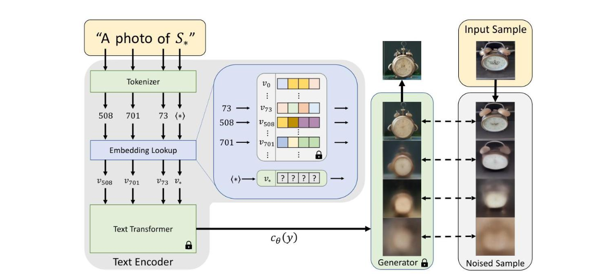

### Textual Inversion 的实现流程

具体过程包括以下几个步骤：

1. **收集输入图像** 用户提供3-5张代表某个新概念的图片，例如特定的雕塑、玩具或独特的艺术风格。这些图像作为模型的学习基础。

2. **创建伪词** 为了表示这个新概念，方法会引入一个全新的伪词（在论文中通常标记为S*）。例如，如果你想要教会模型一个特定的雕塑，你可能引入一个词如“雕塑X”。

3. **优化词嵌入** 与重新训练整个模型不同，文本反演只优化这个新伪词在文本嵌入空间中的位置。具体优化过程包括最小化两个方面的差异：

   - 模型使用包含伪词的文本提示生成的图像
   - 用户提供的实际参考图像

   通过优化，这个伪词的嵌入向量最终能准确表示新的视觉概念。

4. **集成应用** 一旦伪词优化完成，就可以和已有的自然语言提示结合使用，让模型生成包含这个个性化元素的新图像。例如，你可以输入“一个戴着‘雕塑X’风格帽子的女孩”，模型就能生成符合你定制需求的图片。

### 为什么 Textual Inversion 如此高效？

Textual Inversion 的最大创新点在于它无需修改文本到图像模型的架构或全面重新训练，而是巧妙地利用了模型已有的嵌入空间。具体来说，模型本身包括两个关键组件：

- **文本编码器**：将自然语言提示转化为嵌入向量。
- **扩散模型**：根据嵌入向量生成或逐步优化图像。

Textual Inversion 通过优化特定概念对应的嵌入向量，精准地将新概念融入模型已有的知识体系中。

### 数学原理解析

- 从数学上讲，该方法可以描述为：

  1. 对于由占位符 S* 表示的新概念，目标是找到一个最佳嵌入向量 v*，它在文本嵌入空间中表示该概念。
  2. 这被形式化为一个优化问题：

  ```
  v* = argmin_v L(v, {I_1, I_2, ..., I_n})
  ```

  其中 L 是损失函数，用于衡量使用嵌入 v 生成的图像与参考图像 {I_1, I_2, ..., I_n} 的匹配程度。

使用扩散损失作为优化指标，可以确保学习到的嵌入既准确捕捉新概念的视觉特征，又保持与原模型良好的兼容性。


<h2 id="14.什么是DreamBooth技术？LoRA和DreamBooth对比有什么区别？DreamBooth-LoRA的原理是什么样的？">14.什么是DreamBooth技术？LoRA和DreamBooth对比有什么区别？DreamBooth LoRA的原理是什么样的？ </h2>

### 1. DreamBooth技术基本原理

DreamBooth是由Google于2022年发布的一种通过将自定义主题注入扩散模型的微调训练技术，它通过少量数据集微调Stable Diffusion系列模型，让其学习到稀有或个性化的图像特征。DreamBooth技术使得SD系列模型能够在生成图像时，更加精确地反映特定的主题、对象或风格。

DreamBooth首先为特定的概念寻找一个特定的描述词[V]，这个特定的描述词一般需要是稀有的，DreamBooth需要对SD系列模型的U-Net部分进行微调训练，同时DreamBooth技术也可以和LoRA模型结合，用于训练DreamBooth_LoRA模型。

在微调训练完成后，Stable Diffusion系列模型或者LoRA模型能够在生成图片时更好地响应特定的描述词（prompts），这些描述词与自定义主题相关联。这种方法可以被视为在视觉大模型的知识库中添加或强化特定的“记忆”。

同时为了防止过拟合，DreamBooth技术在训练时增加了一个class-specific prior preservation loss（基于SD模型生成相同class的图像加入batch里面一起训练）来进行正则化。


### 2. DreamBooth技术的微调训练过程

DreamBooth技术在微调训练过程中，主要涉及以下几个关键步骤：

1. **选择目标实体**：在开始训练之前，首先需要明确要生成的目标实体或主题。这通常是一组代表性强、特征明显的图像，可以是人物、宠物、艺术品等。例如，如果目标是生成特定人物的图像，那么这些参考图像应该从不同角度捕捉该人物。

2. **训练数据准备**：收集与目标实体相关的图像。这些图像不需要非常多，但应该从多个角度展示目标实体，以便模型能够学习到尽可能多的细节。此外，还需要收集一些通用图像作为负样本，帮助模型理解哪些特征是独特的，哪些是普遍存在的。

3. **数据标注**：为了帮助模型更好地识别和学习特定的目标实体，DreamBooth技术使用特定的描述词[V]来标注当前训练任务的数据。这些标注将与目标实体的图像一起输入模型，以此强调这些图像中包含的特定特征。

4. **模型微调**：使用这些特定的训练样本，对Stable Diffusion模型或者LoRA模型进行微调训练，并在微调训练过程中增加class-specific prior preservation loss来进行正则化。

5. **验证测试**：微调完成后，使用不同于训练时的文本提示词（但是包含特定的描述词[V]），验证模型是否能够根据新的文本提示词生成带有目标实体特征的图像。这一步骤是检验微调效果的重要环节。

6. **调整和迭代**：基于生成的图像进行评估，如果生成结果未达到预期，可能需要调整微调策略，如调整学习率、增加训练图像数量或进一步优化特殊标签的使用。

DreamBooth技术的关键在于通过微调Stable Diffusion模型，令其能够在不失去原有生成能力的同时，添加一定程度的个性化特征。

### 3. DreamBooth技术应用

DreamBooth技术的应用非常广泛，包括但不限于：

- **个性化内容创作**：为特定个体或品牌创建独特的视觉内容。
- **艺术创作**：艺术家可以使用这种技术来探索新的视觉风格或加深特定主题的表达。

总体来说，DreamBooth 是一项令人兴奋的技术，它扩展了生成模型的应用范围，使得个性化和定制化的图像生成成为可能。这种技术的发展有望在多个领域带来创新的应用。

### LoRA和DreamBooth的详细对比分析

#### 1. 学习能力对比

**DreamBooth的优势**：

- 能够学习复杂的新概念
- 对细节的捕捉更精确
- 适合需要大幅改变模型行为的场景

**LoRA的优势**：

- 快速适配新风格
- 可以组合多个LoRA实现复合效果
- 保持原模型能力的同时添加新特性


<h2 id="15.LoRA和Dreambooth/Textual-Inversion之间的差异有哪些？">15.LoRA和Dreambooth/Textual Inversion之间的差异有哪些？</h2>


