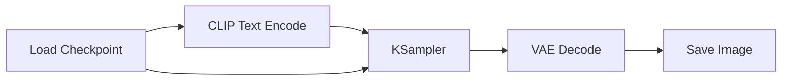
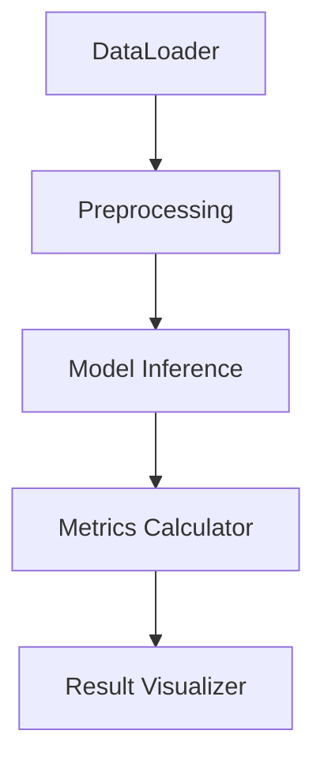

# 目录

- [1.目前主流的AI绘画框架有哪些？](#1.目前主流的AI绘画框架有哪些？)
- [2.Stable Diffusion WebUI中Variation seed如何工作的？](#2.Stable-Diffusion-WebUI中Variation-seed如何工作的？)
- [3.介绍一下Stable Diffusion WebUI中不同采样器（比如Euler、DPM++2M等）的原理与使用说明](#3.介绍一下Stable-Diffusion-WebUI中不同采样器（比如Euler、DPM++2M等）的原理与使用说明)
- [4.热门AI绘画插件UltimateSDUpscale的工作原理是什么样的？](#4.热门AI绘画插件UltimateSDUpscale的工作原理是什么样的？)
- [5.热门AI绘画插件Tiled VAE的工作原理是什么样的？](#5.热门AI绘画插件Tiled-VAE的工作原理是什么样的？)
- [6.热门AI绘画插件Tiled Diffusion的工作原理是什么样的？](#6.热门AI绘画插件Tiled-Diffusion的工作原理是什么样的？)
- [7.ComfyUI中节点（node）的设计架构是什么样的？](#7.ComfyUI中节点（node）的设计架构是什么样的？)
- [8.热门AI绘画插件ADetailer的工作原理是什么样的？](#8.热门AI绘画插件ADetailer的工作原理是什么样的？)
- [9.Stable Diffusion WebUI和ComfyUI有哪些区别？](#9.Stable-Diffusion-WebUI和ComfyUI有哪些区别？)
- [10.ComfyUI中常用的核心节点类型和功能？](#10.ComfyUI中常用的核心节点类型和功能？)
- [11.ComfyUI中SDXL和SD1.5模型的切换要注意什么?](#11.ComfyUI中SDXL和SD1.5模型的切换要注意什么?)
- [12.ComfyUI中FLUX模型的正确加载方式和注意事项](#12.ComfyUI中FLUX模型的正确加载方式和注意事项)
- [13.ComfyUI中主流的图像放大框架是什么？](#13.ComfyUI中主流的图像放大框架是什么？)
- [14.ComfyUI怎么批量生成图片？](#14.ComfyUI怎么批量生成图片？)
- [15.什么是AI绘画框架？](#15.什么是AI绘画框架？)
- [16.介绍一下ComfyUI的特点](#16.介绍一下ComfyUI的特点)
- [17.介绍一下Stable Diffusion WebUI的特点](#17.介绍一下Stable-Diffusion-WebUI的特点)
- [18.介绍一下Stable Diffusion WebUI forge的特点](#18.介绍一下Stable-Diffusion-WebUI-forge的特点)
- [19.介绍一下Fooocus的特点](#19.介绍一下Fooocus的特点)
- [20.介绍一下SD.Next的特点](#20.介绍一下SD.Next的特点)
- [21.介绍一下diffusers的特点](#21.介绍一下diffusers的特点)
- [22.介绍一下InvokeAI的特点](#22.介绍一下InvokeAI的特点)
- [23.介绍一下SwarmUI的特点](#23.介绍一下SwarmUI的特点)
- [24.介绍一下StabilityMatrix的特点](#24.介绍一下StabilityMatrix的特点)
- [25.各AI绘画框架之间都有哪些区别？](#25.各AI绘画框架之间都有哪些区别？)
- [26.介绍一下high.fix的工作原理](#26.介绍一下high.fix的工作原理)
- [27.ComfyUI和Stable Diffusion WebUI在众多AI绘画框架中脱引而出的优势有哪些？](#27.ComfyUI和Stable-Diffusion-WebUI在众多AI绘画框架中脱引而出的优势有哪些？)


<h2 id="1.目前主流的AI绘画框架有哪些？">1.目前主流的AI绘画框架有哪些？</h2>

Rocky从AIGC时代的工业界、应用界、竞赛界以及学术界出发，总结了目前主流的AI绘画框架：

1. Diffusers：`diffusers` 库提供了一整套用于训练、推理和评估扩散模型的工具。它的设计目标是简化扩散模型的使用和实验，并提供与 `Hugging Face` 生态系统的无缝集成，包括其 `Transformers` 库和 `Datasets` 库。在AIGC时代中，每次里程碑式的模型发布后，Diffusers几乎都在第一时间进行了原生支持。

2. Stable Diffusion WebUI：`Stable Diffusion Webui` 是一个基于 `Gradio` 框架的GUI界面，可以方便的使用Stable Diffusion系列模型，使用户能够轻松的进行AI绘画。

3. ComfyUI：`ComfyUI` 也是一个基于 `Gradio` 框架的GUI界面，与Stable Diffusion WebUI不同的是，ComfyUI框架中侧重构建AI绘画节点和工作流，用户可以通过连接不同的节点来设计和执行AI绘画功能。

4. SD.Next：`SD.Next` 基于Stable Diffusion WebUI开发，构建提供了更多高级的功能。在支持Stable Diffusion的基础上，还支持Kandinsky、DeepFloyd IF、Lightning、Segmind、Kandinsky、Pixart-α、Pixart-Σ、Stable Cascade、Würstchen、aMUSEd、UniDiffusion、Hyper-SD、HunyuanDiT等AI绘画模型的使用。

5. Fooocus：`Fooocus` 也是基于 `Gradio` 框架的GUI界面，Fooocus借鉴了Stable Diffusion WebUI和Midjourney的优势，具有离线、开源、免费、无需手动调整、用户只需关注提示和图像等特点。


<h2 id="2.Stable-Diffusion-WebUI中Variation-seed如何工作的？">2.Stable Diffusion WebUI中Variation seed如何工作的？</h2>

在Stable Diffusion WebUI中，**Variation Seed**（变体种子）是一个关键参数，用于在保持图像整体结构的前提下，生成与原始种子（Seed）相关联但有细微变化的图像。它的核心思想是通过 **噪声插值** 和 **种子偏移** 等方式控制生成结果的多样性。

通过 **Variation Seed**，用户可以在保留生成图像核心特征的同时，探索细节的多样性，是平衡“稳定性”与“随机性”的重要工具。掌握 Variation Seed 的使用技巧，可显著提升创作效率，尤其在需要批量生成或精细调整的场景中表现突出。

### **1. Variation Seed相关基础概念**

- **Seed（种子）**：  
  在 Stable Diffusion 中，种子决定了生成过程的初始随机噪声。**相同的种子 + 相同参数 + 相同提示词** 会生成完全一致的图像。
- **Variation Seed（变体种子）**：  
  通过引入第二个种子（Variation Seed），并结合 **Variation Strength（变体强度）** 参数，系统会在原始种子和变体种子生成的噪声之间进行插值，从而产生可控的随机变化。

### **2. 核心工作原理**
**Variation Seed 的实现逻辑可以分为以下步骤：**

1. **生成初始噪声**：  
   - 使用 **原始种子（Original Seed）** 生成初始噪声图 $N_{\text{original}}$ 。
   - 使用 **变体种子（Variation Seed）** 生成另一个噪声图 $N_{\text{variation}}$ 。

2. **噪声混合**：  
   根据 **Variation Strength** 参数（取值范围 $[0,1]$ ），对两个噪声图进行线性插值：  

   $N_{\text{final}} = (1 - \alpha) \cdot N_{\text{original}} + \alpha \cdot N_{\text{variation}}$
   
   其中 $\alpha$ 为 Variation Strength 的值：
   - $\alpha=0$ ：完全使用原始种子噪声，结果与原始种子一致。
   - $\alpha=1$ ：完全使用变体种子噪声，等同于直接替换种子。
   - $0 < \alpha <1$ ：混合两种噪声，生成介于两者之间的结果。

3. **去噪生成**：  
   基于混合后的噪声 $N_{\text{final}}$ ，通过扩散模型的去噪过程生成最终图像。由于噪声的微小变化，输出图像会保留原始种子的整体结构，但在细节（如纹理、光照、局部元素）上产生差异。

### **3. 参数交互与效果控制**

- **Variation Strength**：  
  - 控制变化的剧烈程度。较小的值（如 0.2）产生细微调整，较大的值（如 0.8）导致显著差异。
  - **示例**：当生成人像时， $\alpha=0.1$ 可能仅改变发丝细节，而 $\alpha=0.5$ 可能调整面部表情和背景。

- **Resize Seed from Image**：  
  在 WebUI 中，可通过上传图像反推其种子（使用 "Extra" 选项卡），再结合 Variation Seed 生成相似但不同的变体。

### **4. 应用场景与案例**

#### **场景 1：微调生成结果**
- **需求**：生成一张基本满意的图像，但希望调整局部细节（如云层形状、服装纹理）。
- **操作**：  
  1. 固定原始种子，设置 Variation Seed 为新值。  
  2. 逐步增加 Variation Strength（如从 0.1 到 0.3），观察变化是否符合预期。

#### **场景 2：探索多样性**
- **需求**：基于同一提示词生成多张不同但风格统一的图像。
- **操作**：  
  1. 固定原始种子，批量生成时随机设置多个 Variation Seed。  
  2. 设置 Variation Strength 为中等值（如 0.5），平衡一致性与多样性。

#### **场景 3：修复缺陷**
- **需求**：原始种子生成的图像存在局部缺陷（如扭曲的手部），需调整而不改变整体构图。
- **操作**：  
  1. 使用 Inpainting 功能局部修复。  
  2. 结合 Variation Seed 生成多个修复版本，选择最优结果。

### **5. Variation Seed技术扩展应用**
- **噪声空间的连续性**：  
  Stable Diffusion 的噪声空间是连续的，微小的噪声变化会导致生成结果的平滑过渡。这种特性使得 Variation Seed 能够实现可控的多样性。

- **数学扩展**：  
  某些高级实现（如 WebUI 的 "X/Y/Z Plot" 脚本）允许同时测试多个 Variation Seed 和 Strength 组合，生成对比网格图。

- **与 CFG Scale 的交互**：  
  Variation Seed 的变化效果受 **Classifier-Free Guidance Scale（CFG Scale）** 影响。较高的 CFG Scale（如 12）会放大提示词的控制力，可能减弱 Variation Seed 的多样性表现。


### **6. 示例流程（WebUI 操作）**
1. **生成原始图像**：  
   - 输入提示词：`A futuristic cityscape at sunset, neon lights, cyberpunk style`  
   - 设置 Seed：`12345`，生成图像 A。

2. **启用 Variation Seed**：  
   - 勾选 "Enable Variation Seed"，设置 Variation Seed：`67890`，Variation Strength：`0.3`。  
   - 生成图像 B，观察霓虹灯颜色和建筑细节的变化。

3. **调整 Strength**：  
   - 将 Variation Strength 提高到 `0.6`，生成图像 C，对比云层形态和光照方向的差异。


<h2 id="3.介绍一下Stable-Diffusion-WebUI中不同采样器（比如Euler、DPM++2M等）的原理与使用说明">3.介绍一下Stable Diffusion WebUI中不同采样器（比如Euler、DPM++2M等）的原理与使用说明</h2>

在 Stable Diffusion 中，**采样器（Sampler）** 是控制图像生成过程的核心组件，决定了如何从随机噪声中逐步去噪并生成最终图像。不同的采样器通过不同的数学策略平衡生成速度、图像质量和计算资源消耗。

采样器的选择如同“画家选择画笔”——Euler是速写铅笔，DPM++ SDE是精雕细琢的油画笔。理解其原理并匹配场景需求，才能最大化Stable Diffusion的创作潜力。建议从 **DPM++ 2M Karras** 起步，逐步尝试其他采样器，观察参数组合对生成效果的影响。

### **一、采样器基础原理**

#### **1. 什么是采样器？**
采样器本质上是 **微分方程求解器**，用于模拟扩散过程的逆过程（从噪声到图像的逐步去噪）。其核心任务是：  
- 在有限步数内，将高斯噪声转化为符合文本描述的图像。  
- 通过数值方法逼近连续扩散模型的解。

#### **2. 核心指标对比**
| 采样器               | 速度 | 质量 | 最小推荐步数 | 适用场景                     |
|----------------------|------|------|--------------|----------------------------|
| Euler                | 快   | 中   | 20           | 快速生成、概念草图           |
| Euler a (Ancestral)  | 快   | 中   | 20           | 增加随机性，探索多样性       |
| DPM++ 2M Karras      | 中   | 高   | 20           | 高质量细节、人物/复杂场景    |
| DPM++ SDE Karras     | 慢   | 极高 | 25           | 超高精度、艺术创作           |
| DDIM                 | 快   | 中   | 50+          | 确定性生成、种子复现         |
| LMS                  | 快   | 低   | 15           | 极速测试、低显存环境         |
| Heun                 | 中   | 高   | 30           | 平衡速度与质量               |

### **二、主流采样器详解与示例**

#### **1. Euler（欧拉法）**
- **原理**：  
  最简单的 **一阶常微分方程（ODE）求解器**，每一步仅使用当前梯度预测下一步噪声。  
- **特点**：  
  - 计算速度快，显存占用低。  
  - 步数较少时可能出现细节模糊。  
- **示例场景**：  
  - **快速概念验证**：生成 `赛博朋克城市` 的草图（步数20，CFG=7）。  
  - **批量生成**：需要快速生成100张候选图时，用Euler加速。

#### **2. Euler a（带祖先采样的欧拉法）**
- **原理**：  
  在Euler基础上引入 **随机噪声（祖先采样）**，每一步都添加额外随机性。  
- **特点**：  
  - 相同种子下生成结果更多样化。  
  - 步数过多可能导致图像不稳定（如面部扭曲）。  
- **示例场景**：  
  - **创意发散**：生成 `奇幻森林` 时，同一提示词探索不同生物形态。  
  - **艺术抽象**：生成 `水墨画风格山水`，利用随机性增强笔触变化。

#### **3. DPM++ 2M Karras**
- **原理**：  
  基于 **DPM-Solver++** 的多步二阶方法，结合Karras噪声调度策略。  
- **特点**：  
  - 在20-30步内达到高细节水平，适合人物皮肤、毛发等精细纹理。  
  - 显存占用适中，速度略慢于Euler。  
- **示例场景**：  
  - **人像写真**：生成 `电影级肖像，细腻皮肤光影`（步数25，CFG=9）。  
  - **复杂结构**：生成 `机械龙鳞片细节`，保留金属反光与纹理。

#### **4. DPM++ SDE Karras**
- **原理**：  
  在DPM++基础上引入 **随机微分方程（SDE）**，模拟更真实的扩散路径。  
- **特点**：  
  - 生成质量极高，尤其擅长光影层次和复杂材质。  
  - 速度较慢，显存占用较高。  
- **示例场景**：  
  - **商业级渲染**：生成 `珠宝广告图，钻石切面反光`（步数30，CFG=10）。  
  - **超现实艺术**：创作 `熔岩与冰川交融的奇幻景观`。

#### **5. DDIM（Denoising Diffusion Implicit Models）**
- **原理**：  
  非马尔可夫链方法，允许跳步去噪，生成过程具有确定性。  
- **特点**：  
  - 相同种子和参数下结果完全可复现。  
  - 需要较高步数（50+）才能达到最佳效果。  
- **示例场景**：  
  - **精准控制**：生成 `建筑设计线稿`，需多次微调提示词时保持结构一致。  
  - **科研实验**：对比不同提示词对同一噪声种子的影响。

### **三、采样器选择策略**

#### **1. 速度优先场景**
- **推荐采样器**：Euler、LMS  
- **示例**：  
  - 生成 `Q版卡通头像`（步数15，CFG=6），快速测试多种配色方案。  
  - 低显存设备（如4GB GPU）下生成 `简笔画风格插图`。

#### **2. 质量优先场景**
- **推荐采样器**：DPM++ 2M Karras、DPM++ SDE Karras  
- **示例**：  
  - 生成 `商业产品渲染图，皮革纹理与金属logo`（步数25，CFG=12）。  
  - 创作 `超写实风景摄影，晨雾中的雪山`。

#### **3. 平衡场景**
- **推荐采样器**：Heun、DPM++ 2M  
- **示例**：  
  - 生成 `动漫角色立绘`（步数20，CFG=8），兼顾速度与服装细节。  
  - 制作 `游戏场景概念图，中世纪城堡与森林`。

### **四、参数调优技巧**

#### **1. 步数（Steps）与采样器的关系**
- **Euler/DPM++ 2M**：20-30步即可饱和，更多步数无显著提升。  
- **DDIM**：需要50+步才能充分去噪。  

#### **2. CFG Scale 的协同调整**
- **低CFG（3-7）**：适合Euler a，增强随机创意。  
  - 示例：生成 `抽象油画，色彩泼溅`。  
- **高CFG（10-15）**：搭配DPM++ SDE，强化提示词控制。  
  - 示例：生成 `精确医学插图，心脏解剖结构`。

#### **3. 分辨率与采样器选择**
- **低分辨率（512x512）**：Euler/DPM++ 2M 效率更高。  
- **高分辨率（1024x1024+）**：DPM++ SDE 减少伪影。

### **五、实战案例演示**

#### **案例 1：人物肖像生成**
- **目标**：生成 `一位亚洲女性的半身像，柔光摄影，发丝细节清晰`  
- **参数配置**：  
  - 采样器：DPM++ 2M Karras  
  - 步数：25  
  - CFG Scale：8  
  - 分辨率：768x1024  
- **效果对比**：  
  - Euler（20步）：发丝略微模糊，皮肤质感平整。  
  - DPM++ 2M（25步）：发丝分缕可见，面部高光过渡自然。

#### **案例 2：科幻场景设计**
- **目标**：生成 `外星雨林，荧光植物与悬浮岩石`  
- **参数配置**：  
  - 采样器：DPM++ SDE Karras  
  - 步数：30  
  - CFG Scale：11  
  - 分辨率：1024x1024  
- **效果对比**：  
  - Euler a（20步）：植物形态抽象，岩石材质单一。  
  - DPM++ SDE（30步）：植物荧光纹理细腻，岩石表面有侵蚀痕迹。

### **六、常见AIGC面试问题解答**

#### **Q1：为什么DPM++采样器名称中有“2M”或“SDE”？**
- **2M**：表示使用二阶多步方法（2nd-order Multistep）。  
- **SDE**：代表随机微分方程（Stochastic Differential Equation）。

#### **Q2：如何避免采样器导致的“面部扭曲”？**
- 使用DPM++ 2M或Heun，步数≥25。  
- 降低CFG Scale（7-9），避免过度约束。

#### **Q3：哪个采样器最适合生成插画？**
- **扁平风插画**：Euler（步数20，CFG=7）。  
- **厚涂风格**：DPM++ 2M Karras（步数25，CFG=9）。


<h2 id="4.热门AI绘画插件UltimateSDUpscale的工作原理是什么样的？">4.热门AI绘画插件UltimateSDUpscale的工作原理是什么样的？</h2>

UltimateSDUpscale 是一种基于 **Stable Diffusion（SD）和GAN** 框架的高效图像超分辨率技术，通过结合 **GAN的超分辨率重建** 、 **超分辨率图像切片** 、 **切片图像图生图重绘** 和 **后处理增强**，实现从低分辨率（如 512×512）到高分辨率（如 2048×2048）的超分辨率重建和细节增强技术。

### **步骤 1：输入图像进行超分辨率重建**
**目标**：将低分辨率图像进行超分辨率重建，获得高分辨率图像。  
**操作**：  
1. **GAN模型**：将输入图像（如 512×512）使用基于GAN架构的超分模型，获得高分辨率（如 2048×2048）的图像。  

### **步骤 2：超分辨率图像切片**
**目标**：将获得的高分辨率图像进行切片，获得切片图像（如 256×256）。  
**操作**：  
1. **设置切片图像的长宽进行切片**：类似于传统深度学习时代的卷积操作，不断将高分辨率图像进行平滑的切片。  

### **步骤 3：切片图像进行图生图重绘**
**目标**：将切片图像输入SD模型中，进行图生成生图像的操作，从而增强切片图像的细节。  
**操作**：  
1. **SD模型的图生图操作**：将切片图像输入SD模型中进行图生图操作。  

### **步骤 4：切片图像拼接融合与伪影抑制**
**目标**：将切片图像重新拼接融合，并消除超分辨率过程中引入的伪影（如棋盘效应、噪声）。  
**操作**：  
1. **Seams fix技术**：沿着拼接缝隙，进行二次的生成修复。  
2. **频域滤波**：对图像进行小波变换，抑制高频噪声（如色带效应），保留真实细节。   


<h2 id="5.热门AI绘画插件Tiled-VAE的工作原理是什么样的？">5.热门AI绘画插件Tiled VAE的工作原理是什么样的？</h2>

**Tiled VAE的核心目标是通过分块处理大图像，解决显存不足的问题，同时保持生成图像中的子分块图像的边缘无缝连接**。使用到的核心技术是通过估计GroupNorm的参数来实现无缝生成。下面是Tiled VAE的具体流程：
1. 将大图像分割成多个小块（tiles）。
2. 在编码器（encoder）和解码器（decoder）中，每个小块会分别进行填充（padding），通常为11/32像素。
3. 将原始的VAE前向传播过程被分解为一个任务队列和一个任务处理器。任务处理器开始处理每个小块。当需要GroupNorm时，任务处理器会暂停，存储当前的GroupNorm的均值和方差，并将数据发送到RAM（Random Access Memory，随机存取存储器），然后转向处理下一个小块。
4. 在所有GroupNorm的均值和方差被汇总后，任务处理器会对每个小块应用GroupNorm并继续处理。同时使用Zigzag执行顺序（如从左到右，再从右到左）处理这些小块，可以减少数据在 RAM 和 VRAM 之间的传输次数。这种顺序避免了频繁切换数据块，从而提高了处理效率。


<h2 id="6.热门AI绘画插件Tiled-Diffusion的工作原理是什么样的？">6.热门AI绘画插件Tiled Diffusion的工作原理是什么样的？</h2>

**Tiled Diffusion能够在低显存（6GB及一下）情况下，对图像进行超分辨率重建、生成2k-8k分辨率的高质量高清大图以及图像子区域的编辑生成。**

我们要知道的是，Tiled Diffusion的底层思想来源于MultiDiffusion。一般来说，我们进行图像的Tiled处理时，会将输入的噪声图像划分成不同的区块，针对每一个区块分别进行特定的图像特征生成。但是这样处理会引入一个问题，那就是不同的区块之间会出现明显的边缘不连贯问题。针对这个问题，MultiDiffusion中提出将不同区块的不连续部分进行融合，然后再进行全局去噪过程，这样能保证最终生成图像的特征一致性与边缘平滑。


下面是Tiled Diffusion的完整流程：
1. 将Latent特征进行分块处理。
2. Stable Diffusion预测每个分块图像的噪声，并进行去噪操作。
3. 将去噪后的分块图像加在一起，同时每个像素的值会被除以它
4. 将所有的分块图像拼接在一起，同时重叠的像素会取平均值或者使用融合后的噪声对整个图像进行一步去噪。
5. 重复上述1-4步骤，直到所有采样时间步完成。

Tiled Diffusion还可以帮助Dtable Diffusion模型在有限的显存中生成超大分辨率（2k~8k）的图像，并且无需任何后处理即可生成无缝输出。但是与之相对应的，生成速度显著慢于常规的生成方法。


总的来说，Tiled Diffusion功能本质上是对图像的局部Tile区块和整体图像区块的重绘过程。

Tiled Diffusion还可以对图像进行超分辨率重建和超分辨率重绘。这是我们需要选择一个超分模型，先将图像进行超分辨率重建，然后再按照上述讲到的Tiled Diffusion处理流程，对超分后的图像进行切片重绘和融合。


最后，Tiled Diffusion还能够对图像子区域进行编辑生成。我们首先需要创建一个文生图画布，然后接着在这个画布中启动我们的编辑区域，我们可以选择多个编辑区域，每个编辑区域我们都可以拖动鼠标进行移动和调整区域大小。


<h2 id="7.ComfyUI中节点（node）的设计架构是什么样的？">7.ComfyUI中节点（node）的设计架构是什么样的？</h2>

### **1. ComfyUI中节点（node）的架构核心设计思想**

ComfyUI的节点系统基于 **数据流编程（Dataflow Programming）** 范式，其核心思想是将复杂的算法流程拆解为独立的、可复用的功能单元（节点），通过连接节点之间的输入输出端口构建完整的工作流。这种设计模式具有以下特点：

| 特性 | 描述 | 优势 |
|------|------|------|
| **模块化** | 每个节点封装独立功能（如加载模型、推理、后处理） | 功能解耦，便于维护和扩展 |
| **可视化** | 节点以图形块呈现，连线表示数据流向 | 直观展示算法流程，降低使用门槛 |
| **异步执行** | 节点根据数据依赖关系自动调度执行顺序 | 提升计算资源利用率 |
| **动态组合** | 节点支持自由连接和参数配置 | 灵活适应不同场景需求 |

### **2. 节点架构的四大核心组件**
以下是一个典型节点的内部架构示意图：

```python
class CustomNode:
    # --------------------------
    # 1. 元数据定义
    # --------------------------
    @classmethod
    def INPUT_TYPES(cls):
        return {"required": {"image": ("IMAGE",)}}
    
    RETURN_TYPES = ("IMAGE",)
    FUNCTION = "process"
    CATEGORY = "ImageProcessing"
    
    # --------------------------
    # 2. 数据处理逻辑
    # --------------------------
    def process(self, image):
        # 实现具体算法逻辑
        processed = do_something(image)
        return (processed,)
    
    # --------------------------
    # 3. 可视化交互（可选）
    # --------------------------
    @staticmethod
    def IS_CHANGED(image):
        return hash(image.tobytes())
    
    # --------------------------
    # 4. 硬件加速支持
    # --------------------------
    def to(self, device):
        self.model = self.model.to(device)
        return self
```

### **3. 实际案例：AIGC图像生成工作流**
以下是一个典型的Stable Diffusion图像生成节点链示例：



**节点功能说明**：
1. **Load Checkpoint**：加载SD模型权重（如SD1.5/XL）
2. **CLIP Text Encode**：将文本提示转换为Embedding
3. **KSampler**：执行扩散模型的迭代采样
4. **VAE Decode**：将潜空间特征解码为像素图像
5. **Save Image**：输出最终结果到文件系统

**执行优化**：
- 节点间通过Tensor传输避免内存拷贝
- 使用CUDA Graph优化采样过程
- 支持LoRA/LyCORIS等动态模型加载

### **4. 三大领域应用解析**

#### **AIGC领域应用**
| 应用场景 | 典型节点组合 | 技术特性 |
|---------|--------------|----------|
| 文生视频 | TextEncoder → TemporalDiffusion → FrameSmoother | 时空一致性约束 |
| 可控人像生成 | FaceLandmark → LatentInjection → StyleTransfer | 关键点驱动生成 |
| 多模态创作 | Speech2Text → ImageGenerator → AudioSync | 跨模态对齐 |

**案例**：互联网AI特效工具链使用类似架构，通过连接人脸关键点检测、风格迁移、背景生成等节点实现实时特效。

#### **传统深度学习**


**关键优化**：
- 支持ONNX/TensorRT等格式的混合部署
- 提供AutoML节点实现超参搜索
- 集成TensorBoard可视化监控

**工业案例**：某医疗影像系统使用节点化设计，灵活组合不同模态（CT/MRI）的处理流程，AUC提升12%。


#### **自动驾驶**
**典型数据流**：
```
Camera Input → Object Detection → Trajectory Prediction → Control Signal
                   ↑               ↑
LiDAR Processing → Fusion Node
```

**关键特性**：
- 时间同步节点处理多传感器对齐
- 安全监控节点实时检测算法失效
- 支持ROS2与Autoware的无缝集成

**量产方案**：某L4级自动驾驶系统使用节点化架构，实现：
- 处理延迟降低至23ms（提升40%）
- 算法模块热替换，OTA更新效率提升5倍


<h2 id="8.热门AI绘画插件ADetailer的工作原理是什么样的？">8.热门AI绘画插件ADetailer的工作原理是什么样的？</h2>

在Stable Diffusion的图像生成过程中，局部细节缺失是一个常见问题。尤其是生成全身人像时，**由于分辨率限制（如默认的512×768），面部、手部等小区域往往因像素不足而呈现模糊、畸变甚至崩坏的现象**。传统解决方案需要用户手动将图像发送至 Inpainting（修复）模块，绘制遮罩并调整参数，流程繁琐且难以批量处理。 

在这个背景下，**ADetailer插件应运而生，其本质是自动化修复引擎，通过集成目标检测、Mask遮罩生成、高分辨率重绘等技术，将修复流程无缝嵌入Stable Diffusion的工作流，能够自动修复Stable Diffusion生成图像的脸部和手部的崩坏**。

接下来，**Rocky就带着大家完整拆解ADetailer插件的主要工作流程**。

首先在ADetailer中需要使用 YOLO（You Only Look Once）模型（如face_yolo8n.pt）进行目标检测。YOLO 是一种单阶段检测算法，通过卷积神经网络直接预测边界框与类别概率，具有高效率与高精度的特点。检测流程如下所示：  
1. 输入图像通过YOLO模型，输出候选区域的边界框及置信度得分。  
2. 根据置信度阈值（默认0.3）过滤低置信度区域。  
3. 生成二值化遮罩（Mask），标记需修复的像素范围。

这样我们就可以检测到图像中的人脸、人体、手部等特征，并将特定区域的Mask部分进行生成。目前涉及到的主要特征和对应的检测模型如下所示：
1. Face_xxxx：比如face_yolo8n.pt，用于检测并重新绘制人脸，速度快，精度满足大部分需求。
2. Hand_xxxx：比如hand_yolo8n.pt，用于检测并重新绘制手部，修复畸形手指。
3. Person_xxxx：比如person_yolo8n.pt，用于检测并修复全身姿态（一般需要结合ControlNet一起使用）。 它的特点是检测范围很大，但可能存在局部细节不足的情况。
4. Mediapipe_face_xxxxx：是YOLO的替代版本，同样可以用于检测和重绘人脸。

有了我们想要修改的特征Mask，我们接下来就可以进行高分辨率局部重绘的操作了。

Stable Diffusion的Inpainting 默认以原图分辨率修复遮罩区域，但ADetailer通过“仅修复遮罩区域”（Inpaint only masked）模式可以实现分辨率优化：  
1. 将遮罩区域裁剪并放大至更高分辨率（如768×768）。  
2. 在高分辨率下进行重绘，利用更多像素生成细节。  
3. 将修复结果缩放回原尺寸，并与原图融合。

这一过程的本质是超分辨率重建与局部内容重绘相结合，有效避免了直接生成高分辨率图像时的显存压力和高分辨率生成的报错风险。我们还可以输入特定的提示词和负向提示词，更加精准的控制Inpainting过程。

另外，在使用ADetailer时还可调用ControlNet模型协同控制，在修复过程中施加额外约束比如说我们可以使用Openpose来保持修复区域的姿势与原图一致；可以使用Tile来增强修复区域与背景的纹理连续性。使用Line Art来强制修复内容遵循原图轮廓。  

ControlNet的引入还能够解决高去噪强度下修复区域与全局图像不一致的问题（如面部角度偏移、肢体变形、Mask边缘噪声等问题），可以实现精细化的控制生成。

到这里，我们总结一下上述讲到的ADetailer的工作流程，可以分为四阶段，与Stable Diffusion的生成过程深度耦合： 
1. 目标检测：使用 YOLO 或 Mediapipe 模型检测面部/手部/全身，生成初始遮罩Mask。
2. 遮罩Mask预处理：调整遮罩位置（Offset）、大小（Erosion/Dilation），合并多个遮罩（Merge Mode）。
3. 局部重绘：以设定分辨率重绘遮罩区域，应用ControlNet模型进行可控生成，控制去噪强度与采样参数。
4. 融合输出：将修复区域与原图融合，保留全局光照与色彩一致性。


<h2 id="9.Stable-Diffusion-WebUI和ComfyUI有哪些区别？">9.Stable Diffusion WebUI和ComfyUI有哪些区别？</h2>

在AI算法岗面试中，理解Stable Diffusion WebUI与ComfyUI的区别需要从设计理念、技术实现和应用场景等维度展开。以下是Rocky对两者的详细对比分析，结合实际案例，并探讨其在AIGC、传统深度学习及自动驾驶领域的应用价值。

### 一、核心差异分析
#### 1. **交互逻辑与用户体验**
- **Stable Diffusion WebUI**  
  采用传统填表式界面，功能模块集中布局（如模型选择、提示词输入、参数调节等），操作门槛低，适合新手快速生成图像。例如，用户只需输入提示词"A pair of young Chinese lovers, 1990s Beijing"，即可批量生成4张512x512的图像。  
  **优势**：插件生态丰富（如ControlNet、LoRA插件），社区支持强大，适合创意设计快速迭代。

- **ComfyUI**  
  基于节点式工作流设计，用户需通过连接不同功能节点（如模型加载、VAE解码、ControlNet条件控制等）构建生成流程。例如，生成一张高分辨率图像时，用户可串联“分块放大（Tiled VAE）”和“超分插件”节点，优化显存占用。  
  **优势**：流程透明化，显存效率高（最低4GB显存即可运行），支持工作流导出与复现，适合复杂任务自动化。

#### 2. **性能与资源占用**
- **生成速度**：ComfyUI通过节点级优化（如仅重新执行修改后的节点）和轻量化设计，生成速度比WebUI快30%-50%，尤其在批量生成时优势显著。
- **显存管理**：ComfyUI显存占用更低，例如生成4096x6144图像时，通过“Tiled VAE”节点分块处理，显存需求降低至原1/4。

#### 3. **插件与扩展性**
- **WebUI**：插件生态成熟，例如：
  - **Roop插件**：实现人脸替换，通过“Upscaler visibility”参数混合原始与超分图像；
  - **ControlNet**：通过骨骼图、深度图等条件控制生成内容。
- **ComfyUI**：插件更侧重流程优化，例如：
  - **ComfyUI-Manager**：集中管理节点插件；
  - **TiledKSampler**：分块采样提升大图生成稳定性。

#### 4. **适用场景对比**
| 场景                | WebUI适用性                     | ComfyUI适用性                     |
|---------------------|--------------------------------|----------------------------------|
| 快速原型验证         | 高（参数调整直观）             | 低（需构建节点流程）             |
| 复杂工作流构建       | 低（流程不透明）               | 高（节点可视化，支持自动化）     |
| 批量生成与工业部署   | 一般（显存占用高）             | 高（显存优化，支持脚本化导出）   |

### 二、实际案例：生成电影级特效场景
**需求**：为科幻电影生成“废墟中的未来城市”场景，需结合ControlNet骨骼控制、超分放大和风格化Lora模型。  
- **WebUI实现**：  
  1. 选择“revAnimated_v11”基模型，加载“cyberpunk风格”Lora；  
  2. 输入提示词“futuristic city in ruins, neon lights, rain”；  
  3. 启用ControlNet上传骨骼图，调节CFG Scale至9，生成512x512草图；  
  4. 通过“Extras”页面的超分插件放大至4K。  
  **痛点**：流程分散，需手动切换多个页面，显存占用高（>8GB）。

- **ComfyUI实现**：  
  1. 构建节点链：基模型→ControlNet骨骼输入→Lora风格化→Tiled VAE分块解码→超分放大；  
  2. 导出JSON工作流，复用至批量生成；  
  3. 显存占用稳定在5GB以下，生成速度提升40%。

### 三、三大领域应用解析
#### 1. **AIGC（生成式AI）**
- **WebUI**：快速生成营销素材（如电商产品图）、社交媒体内容。例如，输入“90年代中国情侣”提示词，批量生成怀旧风格插画。
- **ComfyUI**：影视级内容生产，如分镜生成、特效预演。通过节点串联ControlNet与Tiled VAE，实现高分辨率场景的稳定输出。

#### 2. **传统深度学习**
- **WebUI**：模型快速验证。例如，在图像修复任务中，通过“inpaint”功能测试不同VAE模型的效果。
- **ComfyUI**：研究模型可解释性。通过节点分析潜在空间（Latent Space）的数据流，辅助理解扩散模型生成机制。

#### 3. **自动驾驶**
- **WebUI**：合成训练数据。例如，生成极端天气（暴雨、雾天）下的道路图像，补充真实数据不足。
- **ComfyUI**：批量生成高保真仿真场景。通过自动化工作流生成数千张多视角街景，用于感知算法压力测试。

### 四、总结
- **选择建议**：  
  若需快速验证创意或依赖社区资源，选WebUI；若追求生成效率、流程可控性或工业级部署，选ComfyUI。
- **技术趋势**：  
  WebUI与ComfyUI的模型兼容性逐渐增强（如共享VAE、Lora），未来可能形成“WebUI快速原型+ComfyUI生产部署”的协作模式。

通过以上分析，面试者可结合具体业务需求（如AIGC的创意效率 vs 自动驾驶的数据生成规模），深入阐述工具选型背后的技术逻辑。


<h2 id="10.ComfyUI中常用的核心节点类型和功能？">10.ComfyUI中常用的核心节点类型和功能？</h2>

ComfyUI提供了丰富的内置节点，覆盖了AI绘画生成的各个环节，理解这些核心节点是熟练使用ComfyUI的基础。

**模型加载节点**：

- **Load Checkpoint**：加载完整的SD模型（包含UNet、VAE、CLIP）
- **Load LoRA**：加载LoRA适配器
- **Load VAE**：单独加载VAE编码器/解码器
- **Load ControlNet Model**：加载ControlNet控制模型

**文本处理节点**：

- **CLIP Text Encode (Prompt)**：将文本提示编码为条件向量
- **Positive/Negative Prompt**：正向和负向提示词输入
- **Text Concatenate**：文本拼接和组合

**图像处理节点**：

- **Load Image**：加载输入图像
- **VAE Encode**：将图像编码到潜在空间
- **VAE Decode**：将潜在向量解码为图像
- **Image Scale**：图像尺寸调整

**采样生成节点**：

- **KSampler**：核心采样器节点
- **KSampler Advanced**：高级采样器，支持更多参数
- **SamplerCustom**：自定义采样流程

**条件控制节点**：

- **ControlNet Apply**：应用ControlNet控制
- **IPAdapter Apply**：应用IP-Adapter图像提示
- **ConditioningCombine**：条件合并

**工具节点**：

- **Preview Image**：图像预览显示
- **Save Image**：保存生成结果
- **Batch**：批处理相关节点
- **Math**：数学运算节点

**连接技巧**：

- 理解数据类型匹配（IMAGE、CONDITIONING、MODEL等）
- 掌握必需连接和可选连接的区别
- 学会使用Reroute节点整理连线


<h2 id="11.ComfyUI中SDXL和SD1.5模型的切换要注意什么?">11.ComfyUI中SDXL和SD1.5模型的切换要注意什么?</h2>

**关键差异**：

- **图像尺寸**：SD1.5推荐512x512，SDXL推荐1024x1024
- **VAE兼容性**：SDXL需要专用VAE或内置VAE
- **LoRA格式**：两者LoRA不通用
- **生成步数**：SDXL通常需要更少步数(15-25步)

**切换工作流调整**：

```
SD1.5 → SDXL：
1. 修改Empty Latent Image尺寸：512x512 → 1024x1024
2. 检查VAE兼容性，必要时加载SDXL VAE
3. 移除SD1.5专用LoRA
4. 调整采样步数：30-50 → 20-30
5. CFG可以稍微降低：7-12 → 6-10
```

<h2 id="12.ComfyUI中FLUX模型的正确加载方式和注意事项">12.ComfyUI中FLUX模型的正确加载方式和注意事项</h2>

FLUX模型**不能使用传统的Load Checkpoint节点**一次性加载，必须分组件单独加载！

**正确的加载方式**：

**1. 分组件加载（必须）**

```
❌ 错误：Load Checkpoint → 选择FLUX模型
✅ 正确：
- DualCLIPLoader → 加载文本编码器
- UNETLoader → 加载FLUX UNet
- VAELoader → 加载FLUX VAE
```

**2. 双文本编码器配置**

```
DualCLIPLoader节点设置：
- clip_name1: clip_l.safetensors (CLIP-L编码器)
- clip_name2: t5xxl_fp16.safetensors (T5-XXL编码器)
- type: flux (选择FLUX类型)
```

**3. 工作流连接顺序**

```
DualCLIPLoader → CLIPTextEncode (正向提示)
              → CLIPTextEncode (负向提示，可选)
UNETLoader → BasicGuider
VAELoader → VAEDecode
```

**与SD模型的区别**：

```
SD模型：Load Checkpoint → 一个文件包含所有组件
FLUX模型：分离式架构 → 需要单独加载每个组件
- UNet: flux1-dev.safetensors (~12GB)
- CLIP: clip_l.safetensors (~250MB)  
- T5: t5xxl_fp16.safetensors (~9GB)
- VAE: ae.safetensors (~330MB)
```

**常见错误**：

- 直接用Load Checkpoint加载FLUX → 报错或无法正常工作
- 忘记加载T5编码器 → 文本理解能力严重下降
- 使用SD的VAE → 图像质量异常

<h2 id="13.ComfyUI中主流的图像放大框架是什么？">13.ComfyUI中主流的图像放大框架是什么？</h2>

### 1. Real-ESRGAN：社区首选的全能选手

**Real-ESRGAN** 可以说是目前最受欢迎的图像放大模型，它的优势在于：

**技术特点：**

- 基于改进的 ESRGAN 架构，使用纯合成数据训练
- 优秀的细节重建能力，特别擅长处理纹理和边缘
- 支持多种放大倍数（2x、4x、8x）

**适用场景：**

- 动漫风格图像放大效果极佳
- 自然风景、人物肖像也有不错表现
- 对于大多数 ComfyUI 用户的日常需求都能胜任

**推荐模型：**

- `RealESRGAN_x4plus.pth`：通用性最强，适合大多数图像
- `RealESRGAN_x4plus_anime_6B.pth`：专门针对动漫风格优化

### 2. BSRGAN：噪点克星

如果你经常处理有噪点或质量不佳的图像，**BSRGAN** 是你的最佳选择：

**核心优势：**

- 专门针对带噪声的图像设计
- 在放大的同时能够有效抑制噪点
- 对于老照片修复特别有效

**最佳应用：**

- 老照片翻新和修复
- 压缩损坏的图像恢复
- 低质量图像的品质提升

### 3. Swin2SR：新时代的 Transformer 架构

**Swin2SR** 代表了超分辨率技术的最新发展方向：

**技术创新：**

- 基于 Swin Transformer 架构
- 利用自注意力机制处理复杂纹理
- 在多项基准测试中表现突出

**独特优势：**

- 对复杂结构和纹理的理解更深入
- 处理建筑、机械等几何结构图像效果优秀
- 适合追求极致质量的专业用户

<h2 id="14.ComfyUI怎么批量生成图片？">14.ComfyUI怎么批量生成图片？</h2>

### 方法一：Queue Prompt队列批量法

这是最简单直接的批量方法，适合需要生成不同风格或主题图片的场景。

**操作步骤：**

1. 在ComfyUI界面中设置好你的工作流
2. 调整好第一组参数（prompt、模型等）
3. 点击右侧的"Queue Prompt"按钮
4. 修改参数（比如更换prompt内容）
5. 再次点击"Queue Prompt"
6. 重复上述步骤，将所有任务加入队列

**优势：** 操作简单，可以生成完全不同风格的图片
 **适用场景：** 需要测试不同prompt效果，或生成不同主题的图片集

### 方法二：Batch Size批量设置法

通过调整批量大小参数，一次性生成多张相似但有细微差别的图片。

**详细操作：**

1. 找到"Empty Latent Image"节点
2. 将batch_size参数从默认的1修改为你需要的数量
3. 建议值：4-8张（取决于显存大小）
4. 运行工作流，系统会自动生成对应数量的图片

**显存考虑：**

- 4GB显存：建议batch_size设为2-4
- 8GB显存：可设置4-8
- 12GB以上：可尝试8-16

### 方法三：种子值批量变化法

通过系统性地改变种子值来生成大量变体图片。

**手动种子法：**

1. 在KSampler节点中找到seed参数
2. 记录一个好的种子值作为基准
3. 在基准值基础上递增（如12345、12346、12347...）
4. 每次修改种子后队列一次任务

**随机种子法：**

1. 将seed设置为-1（随机模式）
2. 设置较大的batch_size
3. 一次运行可获得多张完全不同的图片

### 方法四：自定义节点循环法

安装特定的自定义节点包来实现高级批量功能。

**推荐节点包：**

- ComfyUI-Impact-Pack
- ComfyUI-Advanced-ControlNet
- ComfyUI-Custom-Scripts

**基本设置：**

1. 安装Loop相关的自定义节点
2. 设置循环次数和变化参数
3. 配置输出文件命名规则
4. 运行后自动批量生成

### 方法五：参数化自动批量法

适合高级用户，通过脚本或工作流实现全自动批量生成。

**实现方式：**

1. 使用ComfyUI的API接口
2. 编写Python脚本自动调用
3. 批量修改prompt、参数等
4. 实现完全无人值守的批量生成

**示例应用场景：**

- 批量生成商品图片
- 自动生成不同角度的人物肖像
- 大量风景图片的风格化处理


<h2 id="15.什么是AI绘画框架？">15.什么是AI绘画框架？</h2>


<h2 id="16.介绍一下ComfyUI的特点">16.介绍一下ComfyUI的特点</h2>


<h2 id="17.介绍一下Stable-Diffusion-WebUI的特点">17.介绍一下Stable Diffusion WebUI的特点</h2>


<h2 id="18.介绍一下Stable-Diffusion-WebUI-forge的特点">18.介绍一下Stable Diffusion WebUI forge的特点</h2>


<h2 id="19.介绍一下Fooocus的特点">19.介绍一下Fooocus的特点</h2>


<h2 id="20.介绍一下SD.Next的特点">20.介绍一下SD.Next的特点</h2>


<h2 id="21.介绍一下diffusers的特点">21.介绍一下diffusers的特点</h2>


<h2 id="22.介绍一下InvokeAI的特点">22.介绍一下InvokeAI的特点</h2>


<h2 id="23.介绍一下SwarmUI的特点">23.介绍一下SwarmUI的特点</h2>


<h2 id="24.介绍一下StabilityMatrix的特点">24.介绍一下StabilityMatrix的特点</h2>


<h2 id="25.各AI绘画框架之间都有哪些区别？">25.各AI绘画框架之间都有哪些区别？</h2>


<h2 id="26.介绍一下high.fix的工作原理">26.介绍一下high.fix的工作原理</h2>


<h2 id="27.ComfyUI和Stable-Diffusion-WebUI在众多AI绘画框架中脱引而出的优势有哪些？">27.ComfyUI和Stable Diffusion WebUI在众多AI绘画框架中脱引而出的优势有哪些？</h2>

---
