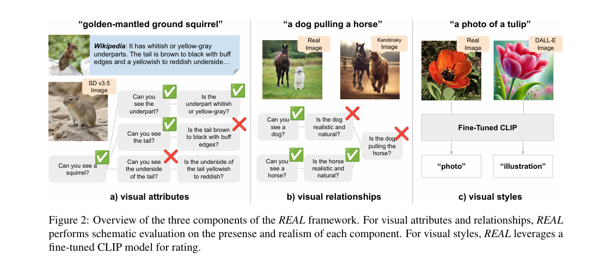

# 目录

## 第一章 图像基础概念高频考点

- [1.图像中低频信息和高频信息的定义](#1.图像中低频信息和高频信息的定义)
- [2.色深的概念](#2.色深的概念)
- [3.RAW图像和RGB图像的区别？](#3.raw图像和rgb图像的区别？)
- [4.常用的色彩空间格式](#4.常用的色彩空间格式)
- [5.什么是图像畸变？](#5.什么是图像畸变？)
- [6.什么是信噪比](#6.什么是信噪比)
- [7.透明图和常规图像的区别是什么？](#7.透明图和常规图像的区别是什么？)
- [8.什么是图像的位数？](#8.什么是图像的位数？)
- [9.什么是图像的DPI？](#9.什么是图像的DPI？)

## 第二章 图像经典处理技术高频考点

- [1.介绍一下图像二值化的原理](#1.介绍一下图像二值化的原理)
- [2.图像膨胀腐蚀的相关概念](#2.图像膨胀腐蚀的相关概念)
- [3.高斯滤波的相关概念](#3.高斯滤波的相关概念)
- [4.边缘检测的相关概念](#4.边缘检测的相关概念)
- [5.图像高/低通滤波的相关概念](#5.图像高低通滤波的相关概念)
- [6.常用空间平滑技术](#6.常用空间平滑技术)
- [7.仿射变换和透视变换的概念？](#7.仿射变换和透视变换的概念？)
- [8.图像噪声的种类？](#8.图像噪声的种类？)
- [9.有哪些常用的图像去噪算法？](#9.有哪些常用的图像去噪算法？)
- [10.有哪些常用的图像频域信息分离方法？](#10.有哪些常用的图像频域信息分离方法？)
- [11.有哪些常用一阶微分梯度算子？](#11.有哪些常用一阶微分梯度算子？)
- [12.拉普拉斯算子的相关概念](#12.拉普拉斯算子的相关概念)
- [13.中值滤波与均值滤波的相关概念](#13.中值滤波与均值滤波的相关概念)
- [14.介绍一下图像形态学扩张的原理](#14.介绍一下图像形态学扩张的原理)
- [15.AIGC时代有哪些主流的图像插值算法？各自的优缺点是什么？](#15.AIGC时代有哪些主流的图像插值算法？各自的优缺点是什么？)

## 第三章 工业界图像处理实际案例高频考点

- [1.模型训练时常用的插值算法？](#1.模型训练时常用的插值算法？)
- [2.常用图像预处理操作？](#2.常用图像预处理操作？)
- [3.有哪些常用的图像质量评价指标？](#3.有哪些常用的图像质量评价指标？)
- [4.RGB图像转为灰度图的方法？](#4.rgb图像转为灰度图的方法？)
- [5.Python中OpenCV和PIL的区别？](#5.python中opencv和pil的区别？)
- [6.OpenCV读取图像的格式？](#6.opencv读取图像的格式？)
- [7.什么是FID图像评估指标？](#7.什么是FID图像评估指标？)
- [8.什么是SSIM图像评估指标？](#8.什么是SSIM图像评估指标？)
- [9.什么是PSNR图像评估指标？](#9.什么是PSNR图像评估指标？)

## 第四章 AIGC图像生成基础概念

- [1.正则化技术在AI绘画模型中的作用？](#1.正则化技术在AI绘画模型中的作用？)
- [2.Scaling Law在AI绘画领域成立吗？](#2.Scaling_Law在AI绘画领域成立吗？)
- [3.Diffusion/VAE/GAN/Flow模型在生成图像过程中有什么异同？](#3.Diffusion/VAE/GAN/Flow模型在生成图像过程中有什么异同？)
- [4.什么是基于分数的生成模型?](#4.什么是基于分数的生成模型?)
- [5.什么是自回归生成模型？](#5.什么是自回归生成模型？)
- [6.图文预训练有哪些常用的做法？](#6.图文预训练有哪些常用的做法？)
- [7.假设用户输入的prompt是中文，有什么办法不用翻译将中文和英文对齐？](#7.假设用户输入的prompt是中文，有什么办法不用翻译将中文和英文对齐？)
- [8.如何训练让图像生成大模型获得精准的文字生成能力？](#8.如何训练让图像生成大模型获得精准的文字生成能力？)
- [9.在Image-to-Image任务中，如何尽可能地保持住原始输入图像的特征？](#9.在Image-to-Image任务中，如何尽可能地保持住原始输入图像的特征？)
- [10.对inpainting了解吗?介绍一下原理](#10.对inpainting了解吗?介绍一下原理)
- [11.对outpainting了解吗？介绍一下原理](#11.对outpainting了解吗？介绍一下原理)
- [12.对Image Variation了解吗？介绍一下原理](#12.对Image-Variation了解吗？介绍一下原理)
- [13.介绍一下Transformer和CNN的区别](#13.介绍一下Transformer和CNN的区别)
- [14.介绍一下Self-attention和Cross-attention的区别](#14.介绍一下Self-attention和Cross-attention的区别)
- [15.AIGC图像生成领域的LowLevel算法包含哪些方向？](#15.AIGC图像生成领域的LowLevel算法包含哪些方向？)
- [16.AIGC图像超分和图像超分增强有哪些区别？](#16.AIGC图像超分和图像超分增强有哪些区别？)

## 第五章 AIGC图像生成领域的评价指标

- [1.AI生成图像的常用评价指标](#1.AI生成图像的常用评价指标)
- [2.什么是REAL评价指标？](#2.什么是REAL评价指标？)
- [3.介绍一下Aesthetic Score Predictor、Aesthetic Predictor V2.5评价指标的原理](#3.介绍一下Aesthetic-Score-Predictor、Aesthetic-Predictor-V2.5评价指标的原理)
- [4.介绍一下FID指标的原理](#4.介绍一下FID指标的原理)
- [5.介绍一下CLIP score指标的原理](#5.介绍一下CLIP-score指标的原理)
- [6.介绍一下PartiPrompts指标的原理](#6.介绍一下PartiPrompts指标的原理)


## 第六章 AIGC图像特征分析技术

- [1.介绍一下Insightface系列技术的原理与功能](#1.介绍一下Insightface系列技术的原理与功能)
- [2.介绍一下人脸属性分析技术的原理](#2.介绍一下人脸属性分析技术的原理)
- [3.介绍一下人脸美颜技术的原理](#3.介绍一下人脸美颜技术的原理)
- [4.有哪些主流的数据自动化标注技术？（joy-caption、Qwen2-VL、Florence、Moondream2、WD14、BLIP、Janus等）](#4.有哪些主流的数据自动化标注技术？（joy-caption、Qwen2-VL、Florence、Moondream2、WD14、BLIP、Janus等）)
- [5.AI领域关于人脸的主流任务有多少种？](#5.AI领域关于人脸的主流任务有多少种？)
- [6.什么是人脸识别？](#6.什么是人脸识别？)
- [7.什么是1：1 人脸验证？](#7.什么是1：1人脸验证？)
- [8.什么是1：N人脸辨识？](#8.什么是1：N人脸辨识？)
- [9.什么是N：N人脸辨识？](#9.什么是N：N人脸辨识？)
- [10.静态识别和动态识别区别是啥？](#10.静态识别和动态识别区别是啥？)
- [11.开发一个人脸识别系统流程有哪些？](#11.开发一个人脸识别系统流程有哪些？)
- [12.影响人脸图像质量的因素有哪些？](#12.影响人脸图像质量的因素有哪些？)
- [13.计算人脸相似度的常用方法有哪些？](#13.计算人脸相似度的常用方法有哪些？)
- [14.什么是人脸解析（Face Parsing）任务？](#14.什么是人脸解析（Face-Parsing）任务？)
- [15.什么是人脸面部属性识别任务？](#15.什么是人脸面部属性识别任务？)
- [16.什么是人脸关键点识别任务？](#16.什么是人脸关键点识别任务？)
- [17.Insightface能实现哪些人脸算法功能？](#17.Insightface能实现哪些人脸算法功能？)


## 第七章 AIGC图像生成/AI绘画提示词工程基础

- [1.Midjourney的提示词格式是什么样的？](#1.Midjourney的提示词格式是什么样的？)

---

## 第一章 图像基础概念高频考点正文

<h2 id="1.图像中低频信息和高频信息的定义">1.图像中低频信息和高频信息的定义</h2>

<font color=DeepSkyBlue>低频信息（低频分量）</font>：表示图像中灰度值变化缓慢的区域，对应着图像中大块平坦的区域。

<font color=DeepSkyBlue>高频信息（高频分量）</font>：表示图像中灰度值变化剧烈的区域，对应着图像的边缘（轮廓）、噪声（之所以说噪声也是高频分量，是因为图像噪声在大部分情况下都是高频的）以及细节部分。

低频分量主要对整幅图像强度的综合度量。高频分量主要对图像边缘和轮廓的度量（人眼对高频分量比较敏感）。

<font color=DeepSkyBlue>傅立叶变换角度理解</font>：从傅立叶变换的角度，我们可以将图像从灰度分布转化为频率分布。图像进行傅立叶变换之后得到的频谱图，就是图像梯度的分布图。具体来说，傅立叶频谱图上我们能看到明暗不一的亮点，实际上就是图像上某一点与领域点差异的强弱，即梯度的大小。如果一幅图像的各个位置的强度大小相等，则图像只存在低频分量。从图像的频谱图上看，只有一个主峰,且位于频率为零的位置。如果一幅图像的各个位置的强度变化剧烈，则图像不仅存在低频分量，同时也存在多种高频分量。从图像的频谱上看，不仅有一个主峰,同时也存在多个旁峰。<font color=DeepSkyBlue>图像中的低频分量就是图像中梯度较小的部分，高频分量则相反</font>。


<h2 id="2.色深的概念">2.色深的概念</h2>

色深（Color Depth）指的是色彩的深度，即精细度。在数字图像中，最小的单元是像素，在RGB三通道图像中，每个像素都由R，G，B三个通道组成，通常是24位的二进制位格式来表示。这表示颜色的2进制位数，就代表了色深。


<h2 id="3.raw图像和rgb图像的区别？">3.RAW图像和RGB图像的区别？</h2>

RAW格式: 从相机传感器端获取的原始数字格式的数据, 又称为Bayer格式. 每个像素信息只有RGB中的某个颜色信息, 且每4个像素中有2个像素为G信息,1个R信息,1个B信息, 即GRBG格式。

RGB格式: RGB格式是由RAW数据插值计算后获取的、每个像素均包含了RGB三种颜色的信息。


<h2 id="4.常用的色彩空间格式">4.常用的色彩空间格式</h2>

深度学习中常用的色彩空间格式：RGB，RGBA，HSV，HLS，Lab，YCbCr，YUV等。


RGB色彩空间以Red(红)、Green(绿)、Blue(蓝)三种基本色为基础，进行不同程度的叠加，产生丰富而广泛的颜色，所以俗称三基色模式。

RGBA是代表Red(红)、Green(绿)、Blue(蓝)和Alpha(透明度)的色彩空间。

HSV色彩空间（Hue-色调、Saturation-饱和度、Value-亮度）将亮度从色彩中分解出来，在图像增强算法中用途很广。

HLS色彩空间，三个分量分别是色相(H)、亮度(L)、饱和度(S)。

Lab色彩空间是由CIE(国际照明委员会)制定的一种色彩模式。自然界中任何一点色都可以在Lab空间中表达出来，它的色彩空间比RGB空间还要大。

YCbCr进行了图像子采样，是视频图像和数字图像中常用的色彩空间。在通用的图像压缩算法中（如JPEG算法），首要的步骤就是将图像的颜色空间转换为YCbCr空间。

YUV色彩空间与RGB编码方式(色域)不同。RGB使用红、绿、蓝三原色来表示颜色。而YUV使用亮度、色度来表示颜色。


<h2 id="5.什么是图像畸变？">5.什么是图像畸变？</h2>

使用摄像头时，可能会出现图像边缘线条弯曲的情况，尤其是边缘部分是直线时，这种现象更为明显。比如摄像头显示画面中的门框、电线杆、墙面棱角、吊顶线等出现在边缘时，可能会有比较明显的弯曲现象，这种现象就叫做畸变。

<font color=DeepSkyBlue>畸变是指光学系统对物体所成的像相对于物体本身而言的失真程度</font>，是光学透镜的固有特性，其直接原因是因为镜头的边缘部分和中心部分的放大倍率不一样导致。畸变并不影响像的清晰程度，只改变物体的成像形状，畸变是一种普遍存在的光学现象。


<h2 id="6.什么是信噪比">6.什么是信噪比</h2>

### 1. 什么是信噪比？

信噪比（SNR）是用来衡量信号强度与噪声强度相对大小的指标。在图像处理中，信号通常指的是有用的图像信息，而噪声则是无用的或干扰图像的成分。信噪比高表示图像中的有用信息远多于噪声，信噪比低则表示图像中噪声较多。

### 2. 信噪比的计算

信噪比的计算通常表示为信号功率与噪声功率之比，常用的计算公式如下：


$$
\mathrm{SNR}=10\log_{10}\left(\frac{P_{\mathrm{signal}}}{P_{\mathrm{noise}}}\right)
$$
其中，P_signal是信号的功率，P_noise 是噪声的功率。信噪比的单位是分贝（dB）。

在图像处理中，信噪比也可以通过像素值的均方差来计算：


$$
\mathrm{SNR}=10\log_{10}\left(\frac{\mu_{\mathrm{signal}}^2}{\sigma_{\mathrm{noise}}^2}\right)
$$
其中，μ_signal是图像信号的平均值，σ_noise 是噪声的标准差。

### 3. 信噪比在图像处理中的应用

1. **图像质量评估**：高信噪比表示图像质量好，因为图像中有用信息占比高，噪声少。
2. **图像去噪**：去噪算法的效果可以通过信噪比来评估，去噪后图像的信噪比越高，说明去噪效果越好。
3. **图像增强**：在图像增强处理中，提高信噪比是一个重要目标，以确保增强后的图像清晰度和细节保留。


<h2 id='7.透明图和常规图像的区别是什么？'>7.透明图和常规图像的区别是什么？</h2>

透明图像与常规图像的主要区别在于它们的颜色信息中是否包含透明度（即 **Alpha 通道**）。这种区别在视觉效果和文件结构上都有明显的体现。

### 1. **Alpha 通道**

- **透明图像**：透明图像包含 **Alpha 通道**，除了红色（Red）、绿色（Green）、蓝色（Blue）这三个基本颜色通道外，Alpha 通道用于存储每个像素的透明度信息。透明度通常以 0（完全透明）到 255（完全不透明）的范围表示。常见的支持透明度的图像格式有 PNG、GIF 和 WebP。
  
  - **例子**：一张 PNG 图像中某些部分是完全透明的，因此在浏览器或图片查看器中查看时，这些部分可能会显示为背景颜色或背景图像，而非实际颜色。

- **常规图像**：普通图像没有 **Alpha 通道**，只包含 RGB（红、绿、蓝）三个颜色通道，每个像素都是完全不透明的。常见的图像格式如 JPEG、BMP 通常不支持透明度。

  - **例子**：一张 JPEG 图像是完全不透明的，每个像素都有其特定的颜色。如果你将这种图像放在网页上，它会遮挡住所有在其下方的内容。

### 2. **视觉效果**

- **透明图像**：
  - 可以显示部分透明或完全透明的区域，这样图像就可以与背景或其他元素自然地融合。
  - 适用于图标、标志或需要与不同背景组合的图像。

- **常规图像**：
  - 所有像素都是不透明的，不管在什么背景下显示，图像的内容都会完全覆盖其下方的背景。
  - 适合用于照片或不需要透明效果的图像。

### 3. **文件格式**

- **支持透明度的格式**：如 PNG、GIF、WebP。
  - PNG 是最常见的支持透明度的格式，适用于需要无损压缩的高质量图像。
  - GIF 也支持透明度，但通常只支持单一透明度级别（即完全透明或完全不透明）。
  - WebP 是一种现代图像格式，支持透明度并且通常比 PNG 更高效。

- **不支持透明度的格式**：如 JPEG、BMP。
  - JPEG 是一种常见的图像格式，适用于照片等需要有损压缩的小文件。
  - BMP 是一种老式的无压缩图像格式，不支持透明度。

### 4. **文件大小**

- **透明图像**：
  - 由于包含额外的 Alpha 通道，通常文件大小会比同样分辨率的普通图像更大，特别是在 PNG 格式下。
  - 文件大小可能会根据透明区域的复杂程度而变化。

- **常规图像**：
  - 通常文件大小较小，尤其是在使用 JPEG 格式进行有损压缩时。

### 5. **使用场景**

- **透明图像**：
  - 常用于需要与背景结合的图像，如网站图标、LOGO、UI元素等。
  - 适合需要部分透明效果或不规则边缘的图像，比如水印、剪贴画等。

- **常规图像**：
  - 更适合用于照片、壁纸、封面等不需要透明度的场景。

### 6. 例子对比

1. **透明图像 (PNG)**：
   - 如果你将一张透明的 PNG 图像放在一个有颜色的背景上，你会看到背景透过图像的透明区域显示出来。

2. **普通图像 (JPEG)**：
   - 如果你将一张 JPEG 图像放在同样的背景上，整个图像区域都是不透明的，背景会被完全覆盖。


<h2 id='8.什么是图像的位数？'>8.什么是图像的位数？</h2>

**图像的位数（bit depth）** 是一个非常重要的概念，它指的是图像中每个像素所使用的二进制位数（bit）来表示颜色或灰度值。位数越高，每个像素可以表达的颜色或灰度级别就越多，图像的色彩表现力也越丰富。

### 1. 不同位数图像的类型

根据图像的位数，图像可以分为以下几种常见类型：

#### a. **1位图像（1-bit image）**
- **每个像素1位**：1位图像每个像素只能用1个二进制位来表示，因此它只能表示2种状态：0或1。
- **颜色表示**：通常是黑白图像。0表示黑色，1表示白色。
- **应用场景**：这种图像常用于简单的图形设计或文本图像（如条形码、QR码）。

#### b. **8位图像（8-bit image）**
- **每个像素8位**：8位图像每个像素有8个二进制位，因此可以表示 \(2^8 = 256\) 种颜色或灰度级别。
- **灰度图像**：在灰度图像中，8位图像表示从0（黑色）到255（白色）之间的256个灰度级别。
- **应用场景**：常用于单通道灰度图像，或具有256种颜色的彩色图像（通常为调色板图像，使用特定的颜色表）。

#### c. **24位图像（24-bit image）**
- **每个像素24位**：24位图像每个像素有24个二进制位，通常分为三个8位的部分，每个部分表示一个颜色通道：红色（Red）、绿色（Green）和蓝色（Blue）。
- **颜色表示**：每个通道的8位可以表示256种颜色，因此总共可以表示 \(256 \times 256 \times 256 = 16,777,216\) 种颜色，即通常所说的“真彩色”。
- **应用场景**：这种图像被广泛用于显示器、摄影、网页设计等需要丰富颜色表现的场景。

#### d. **32位图像（32-bit image）**
- **每个像素32位**：32位图像在24位图像的基础上，增加了8位的透明度通道（Alpha通道），即RGBA模式。
- **透明度表示**：Alpha通道用来表示像素的透明度，0表示完全透明，255表示完全不透明。
- **应用场景**：用于需要处理透明图像的场景，比如图像合成、视频编辑、图形设计等。

#### e. **更高位数的图像（例如48位、64位图像）**
- **更高位数**：48位图像通常意味着每个通道有16位（即总共有3个通道×16位=48位），而64位图像则通常用于高动态范围（HDR）图像，每个通道有16位或32位。
- **高色深**：这种图像可以表示更丰富的颜色梯度，非常适合需要高度精确颜色表现的专业图形设计、医学成像或科学数据可视化等领域。

### 2. 位数对图像质量的影响

- **颜色范围（Color Range）**：随着图像位数的增加，图像可以表现的颜色或灰度范围变得更广。例如，8位图像的每个通道只能表示256种颜色，而16位图像的每个通道可以表示65536种颜色。
- **色带效应（Banding Effect）**：低位数图像在颜色渐变区域可能出现色带效应（即明显的颜色分界线），这是因为颜色过渡不够平滑。高位数图像可以减少这种效应，提供更平滑的色彩渐变。
- **文件大小**：图像的位数越高，每个像素所需的存储空间也就越大，因此图像文件的大小也会随之增加。例如，同样大小的图像，32位图像比24位图像的文件大小要大得多。
- **计算和处理复杂度**：高位数图像在处理和计算时需要更多的资源，特别是在图像编辑、渲染等涉及大量像素操作的场景中。


<h2 id='9.什么是图像的DPI？'>9.什么是图像的DPI？</h2>

**DPI** 是英文 **Dots Per Inch** 的缩写，中文称为**每英寸点数**或**每英寸像素数**。它是用于衡量图像分辨率和打印质量的一个指标，表示在一英寸长度内包含的点（像素）数量。

- **物理意义**：DPI 描述了图像在物理尺寸下的清晰度和细节程度。高 DPI 表示图像在单位长度内有更多的像素，细节更丰富。
- **与 PPI 的区别**：**PPI（Pixels Per Inch）** 通常用于显示设备，表示屏幕每英寸的像素数。尽管在某些情况下，DPI 和 PPI 可以互换使用，但严格来说，DPI 更侧重于打印分辨率，而 PPI 侧重于屏幕分辨率。

### 一、DPI 的作用

#### 1. 打印质量

- **高 DPI**：在打印过程中，较高的 DPI（如 300 DPI 或更高）意味着打印出的图像更清晰、细节更丰富，适用于高质量的照片和专业印刷品。
- **低 DPI**：较低的 DPI（如 72 DPI 或 96 DPI）适用于屏幕显示或大幅面印刷品，因为观看距离较远，对细节的要求较低。

#### 2. 图像尺寸与物理尺寸的关系

- **物理尺寸计算**：图像的物理尺寸（以英寸为单位）可以通过图像的像素尺寸除以 DPI 计算。

  $$\text{物理尺寸（英寸）} = \frac{\text{像素尺寸（像素）}}{\text{DPI}}$$
  
- **示例**：如果一幅图像的宽度为 3000 像素，DPI 为 300，那么打印出来的物理宽度为：
  
  $$\frac{3000 \text{ 像素}}{300 \text{ DPI}} = 10 \text{ 英寸}$$

### 二、DPI 的应用场景

#### 1. 数字印刷和出版

- **高质量印刷品**：杂志、画册、摄影作品等通常要求图像达到 300 DPI 以上，以确保打印质量。
- **普通文档打印**：一般办公文档、草稿等可使用 150 DPI 至 200 DPI。
- **大型广告牌**：由于观看距离远，可以使用较低的 DPI（如 30 DPI 至 72 DPI），但仍能获得良好的视觉效果。

#### 2. 扫描和数字化

- **扫描仪设置**：扫描仪的 DPI 设置决定了数字化图像的分辨率。扫描照片或高细节文档时，可能需要 600 DPI 或更高。
- **数字存档**：对于需要长期保存的文件，较高的 DPI 可以确保细节完整，便于日后查看和打印。

#### 3. 数码摄影和图像处理

- **相机输出**：数码相机拍摄的照片通常以像素为单位，但在导出或打印时，需要指定 DPI。
- **图像编辑软件**：在处理和导出图像时，设置正确的 DPI 有助于在不同媒介上获得期望的显示效果。

### 三、常见误解

#### 1. DPI 与图像文件大小

- **误解**：提高图像的 DPI 会增加文件大小。
- **事实**：DPI 是图像的元数据，不影响图像的像素总数和文件大小。文件大小主要由像素尺寸和压缩率决定。

#### 2. 调整 DPI 改善屏幕显示效果

- **误解**：增加图像的 DPI 可以让其在屏幕上显示得更清晰。
- **事实**：屏幕显示主要取决于图像的像素尺寸和屏幕的 PPI。调整 DPI 不会改变屏幕上的显示效果。

#### 3. 改变 DPI 会改变图像质量

- **误解**：改变图像的 DPI 会提升或降低图像质量。
- **事实**：如果不重新采样图像，仅改变 DPI 不会影响图像质量。图像质量取决于像素数量和内容细节。

---

## 第二章 图像经典处理技术高频考点正文

<h2 id="1.介绍一下图像二值化的原理">1.介绍一下图像二值化的原理</h2>

图像的**二值化**是将灰度图像转换为只有两种像素值（通常是 0 和 255）的二值图像的过程。二值化的目的是简化图像数据，使后续处理（如边缘检测、形状分析）更加高效。二值化过程通常基于一个**阈值**（threshold）来决定每个像素的类别。

### 1. **原理概述**

1. **输入图像：**
   - 通常是灰度图像，每个像素的值在 0 到 255 之间（8 位图像）。
   - 例如，一个像素值为 0 表示纯黑，255 表示纯白，中间值表示灰度级别。

2. **输出图像：**
   - 每个像素的值只有两种可能：**0（黑色）** 或 **255（白色）**。

3. **阈值操作：**
   - 对每个像素值 $I(x, y)$ 进行判断：

$$
B(x, y) =
\begin{cases}
255 & \text{如果 } I(x, y) \geq T \\
0   & \text{如果 } I(x, y) < T
\end{cases}
$$

其中 $T$ 是设定的阈值。

### 2. **二值化的常用方法**

#### 1. **全局阈值法**
- 选用一个固定阈值 $T$ 。
- 优点：简单易用，计算量低。
- 缺点：对光照变化敏感，适用于背景均匀的图像。

```python
import cv2
import numpy as np

# 读取灰度图像
img = cv2.imread('image.jpg', cv2.IMREAD_GRAYSCALE)

# 固定阈值法
_, binary = cv2.threshold(img, 127, 255, cv2.THRESH_BINARY)

cv2.imshow('Binary Image', binary)
cv2.waitKey(0)
cv2.destroyAllWindows()
```

#### 2. **自适应阈值法**
- 根据图像局部的像素值动态确定阈值。
- 优点：适用于背景光照不均匀的情况。
- 两种常用方法：
  - **均值法**：阈值是邻域像素的平均值。
  - **高斯加权法**：阈值是邻域像素的加权平均值（权重由高斯分布决定）。

```python
# 自适应阈值法
adaptive_binary = cv2.adaptiveThreshold(img, 255, cv2.ADAPTIVE_THRESH_MEAN_C, cv2.THRESH_BINARY, 11, 2)
```

#### 3. **Otsu 阈值法**
- 自动计算全局阈值 $T$ ，最大化前景和背景之间的类间方差。
- 优点：无需手动设置阈值，适用于双峰直方图。
- 缺点：对多峰图像表现较差。

```python
# Otsu 阈值法
_, otsu_binary = cv2.threshold(img, 0, 255, cv2.THRESH_BINARY + cv2.THRESH_OTSU)
```

#### 4. **局部二值化（Adaptive Otsu）**
- 结合局部和全局特性，动态调整阈值。
- 用于复杂场景和不均匀光照。

### 3. **阈值的选择**

选择适当的阈值 $T$ 是二值化的核心问题，不同方法的阈值选择策略不同：
1. **固定阈值：**
   - 手动设定，如 $T = 127$ 。
   - 适用于背景亮度均匀的图像。
2. **直方图分析：**
   - 通过观察图像灰度直方图，选择双峰之间的分割点。
3. **Otsu 方法：**
   - 自动计算阈值，使前景和背景的类间方差最大。
4. **局部方法：**
   - 动态根据图像局部特性确定阈值。

### 4. **二值化的结果评价**

- **对比度：** 前景与背景的区分是否明显。
- **噪声处理：** 是否存在孤立噪声点。
- **目标完整性：** 前景目标是否被正确分割。

### 5. **应用场景**

整体上，图像二值化在AIGC、传统深度学习以及自动驾驶领域都广泛应用。

1. **OCR（光学字符识别）：**
   - 通过二值化提取文字区域。
2. **边缘检测：**
   - 提前简化图像数据。
3. **物体检测：**
   - 二值化后的图像便于轮廓提取。
4. **医学影像处理：**
   - 用于分割特定区域。

### 6. **实例分析**

#### 1. **原始图像：**
假设灰度图像如下：

$$
\begin{matrix}
100 & 120 & 140 & 160 \\
200 & 220 & 240 & 255 \\
50  & 80  & 100 & 120 \\
30  & 40  & 60  & 70
\end{matrix}
$$

#### 2. **固定阈值 $T = 100$ ：**

$$
\begin{matrix}
0 & 0   & 255 & 255 \\
255 & 255 & 255 & 255 \\
0   & 0   & 0   & 255 \\
0   & 0   & 0   & 0
\end{matrix}
$$

#### 3. **Otsu 阈值法（自动计算阈值 $T$ ）：**
- 假设 $T = 120$ ，结果为：

$$
\begin{matrix}
0 & 0   & 255 & 255 \\
255 & 255 & 255 & 255 \\
0   & 0   & 0   & 255 \\
0   & 0   & 0   & 0
\end{matrix}
$$

### 4. **二值化的优缺点**

#### 优点：
- **简化图像数据：** 降低计算复杂度。
- **突出目标区域：** 明确前景与背景的界限。
- **易于后续处理：** 便于形态学、轮廓检测等操作。

#### 5. 缺点：
- 对光照和噪声敏感，尤其是全局阈值法。
- 无法处理多目标或多峰分布图像。


<h2 id="2.图像膨胀腐蚀的相关概念">2.图像膨胀腐蚀的相关概念</h2>

图像的膨胀(dilation)和腐蚀(erosion)是两种基本的形态学运算，主要用来<font color=DeepSkyBlue>寻找图像中的极大区域和极小区域</font>。

膨胀类似于“领域扩张”，将图像的高亮区域或白色部分进行扩张，其运行结果图比原图的高亮区域更大。

腐蚀类似于“领域被蚕食”，将图像中的高亮区域或白色部分进行缩减细化，其运行结果图比原图的高亮区域更小。


<h2 id="3.高斯滤波的相关概念">3.高斯滤波的相关概念</h2>

<font color=DeepSkyBlue>图像为什么要滤波呢？</font>一是为了消除图像在数字化过程中产生或者混入的噪声。二是为了提取图片对象的特征作为图像识别的特征模式。

<font color=DeepSkyBlue>什么是高斯噪声？</font>首先，噪声在图像当中常表现为引起较强视觉效果的孤立像素点或像素块。简单来说，噪声的出现会给图像带来干扰，让图像变得不清楚。 高斯噪声就是它的概率密度函数服从高斯分布（即正态分布）的一类噪声。如果一个噪声，它的幅度分布服从高斯分布，而它的功率谱密度又是均匀分布的，则称它为高斯白噪声。

高斯滤波是一种线性平滑滤波，可以用来消除高斯噪声。其公式如下所示


高斯滤波过程：
假设高斯核：


那么高斯滤波计算过程就如下所示：


将这9个值加起来，就是中心点的高斯滤波的值。对所有点重复这个过程，就得到了高斯模糊后的图像。

<font color=DeepSkyBlue>二维高斯滤波能否分解为一维操作？</font>可以进行分解，二维高斯滤波分解为两次一维高斯滤波，高斯二维公式可以推导为X轴与Y轴上的一维高斯公式。即使用一维高斯核先对图像逐行滤波，再对中间结果逐列滤波。


<h2 id="4.边缘检测的相关概念">4.边缘检测的相关概念</h2>

图像边缘是图像最基本的特征，指图像局部特征的不连续性。图像特征信息的突变处称之为边缘，例如灰度级的突变，颜色的突变，纹理结构的突变等。边缘是一个区域的结束，也是另一个区域的开始，利用该特征可以分割图像。


当我们看到一个有边缘的物体时，首先感受到的就是边缘。

上图（a）是一个理想的边缘所具备的特性。每个灰度级跃变到一个垂直的台阶上。而实际上，在图像采集系统的性能、采样率和获取图像的照明条件等因素的影响，得到的边缘往往是模糊的，边缘被模拟成具有“斜坡面”的剖面，如上图（b）所示，在这个模型中，模糊的边缘变得“宽”了，而清晰的边缘变得“窄”了。

图像的边缘有方向和幅度两种属性。边缘通常可以通过一阶导数或二阶导数检测得到。一阶导数是以最大值作为对应的边缘的位置，而二阶导数则以过零点作为对应边缘的位置。

<font color=DeepSkyBlue>常用的一阶导数边缘算子</font>：Roberts算子、Sobel算子和Prewitt算子。

<font color=DeepSkyBlue>常用的二阶导数边缘算子</font>：Laplacian 算子，此类算子对噪声敏感。

<font color=DeepSkyBlue>其他边缘算子</font>：前面两类均是通过微分算子来检测图像边缘，还有一种就是Canny算子，其是在满足一定约束条件下推导出来的边缘检测最优化算子。


<h2 id="5.图像高低通滤波的相关概念">5.图像高/低通滤波的相关概念</h2>

滤波操作是一种非常实用的图像数据预处理方法。滤波是一个信号处理领域的概念，而图像本身也可以看成是一个二维的信号，其中像素点数值的高低代表信号的强弱。

其中图像信息可以分为高频和低频两个维度：

<font color=DeepSkyBlue>高频</font>：图像中灰度变化剧烈的点，一般是图像轮廓或者是噪声。

<font color=DeepSkyBlue>低频</font>：图像中平坦的、变化不大的点，也就是图像中的大部分区域。

根据图像的高频与低频的特征，我们可以设计相应的高通与低通滤波器，高通滤波器可以检测保留图像中尖锐的、变化明显的地方。而低通滤波器可以让图像变得更光滑，去除图像中的噪声。

常见的<font color=DeepSkyBlue>低通滤波器</font>有：线性的均值滤波器、高斯滤波器、非线性的双边滤波器、中值滤波器。

常见的<font color=DeepSkyBlue>高通滤波器</font>有：Canny算子、Sobel算子、拉普拉斯算子等边缘滤波算子。


<h2 id="6.常用空间平滑技术">6.常用空间平滑技术</h2>

空间平滑（模糊）技术是广泛应用于图像处理以降低图像噪声的技术。
空间平滑技术可以分为两大类：局部平滑（Local Smoothing）和非局部平滑（Non-local Smoothing）
局部平滑方法利用附近的像素来平滑每个像素。通过设计不同的加权机制，产生了很多经典的局部平滑方法，例如高斯Smoothing，中值Smoothing，均值Smooyhing等。

而非局部平滑方法不限于附近的像素，而是使用图像全局中普遍存在的冗余信息进行去噪。具体来说，以较大的图像块为单位在图像中寻找相似区域，再对这些区域求平均，并对中心图像块进行替换，能够较好地去掉图像中的噪声。在平均操作中，可以使用高斯，中位数以及均值等对相似图像块进行加权。


<h2 id="7.仿射变换和透视变换的概念？">7.仿射变换和透视变换的概念？</h2>

仿射变换是对图片进行平移，缩放，倾斜和旋转等操作，是一种二维坐标到二维坐标之间的线性变换。它保持了二维图形的“平直性”（直线经过变换之后依然是直线）和“平行性”（二维图形之间的相对位置关系保持不变，平行线依然是平行线，且直线上点的位置顺序不变）。

透视变换是将图片投影到一个新的视平面，也称作投影映射。它是将二维图片投影到三维空间，再投回另一个二维空间的映射操作。

<font color=DeepSkyBlue>仿射变换和透视变换的最大区别：一个平行四边形，经过仿射变换后依然是平行四边形；而经过透视变换后只是一个四边形（不再平行了）。</font>


<h2 id="8.图像噪声的种类？">8.图像噪声的种类？</h2>

<h3 id="常规噪声">常规噪声</h3>

1. 高斯噪声
2. 脉冲噪声
3. 泊松噪声
4. 乘性噪声
5. 瑞利噪声
6. 伽马噪声
7. 指数噪声
8. 均匀噪声
9. 椒盐噪声
10. 散粒噪声
11. 泊松噪声

<h3 id="对抗噪声">对抗噪声</h3>

1. 白盒对抗噪声
2. 黑盒查询对抗噪声
3. 黑盒迁移噪声
4. 物理对抗噪声


<h2 id="9.有哪些常用的图像去噪算法？">9.有哪些常用的图像去噪算法？</h2>

- 空间域去噪：均值滤波器，中值滤波器，低通滤波器，高斯滤波，双边滤波，引导滤波，NLM（Non-Local means）算法等。
- 频域去噪：小波变换，傅里叶变换，离散余弦变换，形态学滤波等。


<h2 id="10.有哪些常用的图像频域信息分离方法？">10.有哪些常用的图像频域信息分离方法？</h2>

可以使用频域滤波器如小波变换，傅里叶变换，余弦变换，形态学滤波等方法将图像高低频信息分离。


<h2 id="11.有哪些常用一阶微分梯度算子？">11.有哪些常用一阶微分梯度算子？</h2>

<h3 id="梯度算子">梯度算子</h3>

想要得到一张图像的梯度，要在图像的每个像素点处计算偏导数。因此一张图像$f$在$(x,y)$位置处的$x$和$y$方向上的梯度大小$g_{x}$和$g_{y}$分别计算为：


上述两个公式对所有的$x$和$y$的计算值可用下面的一维模版对$f(x,y)$的滤波得到。


用于计算梯度偏导数的滤波器模版，通常称之为梯度算子、边缘算子和边缘检测子等。

<h3 id="经典一阶梯度算子">经典一阶梯度算子</h3>

**Roberts算子**

Roberts算子又称为交叉微分算法，它是基于交叉差分的梯度算法，通过局部差分计算检测边缘线条。<font color=DeepSkyBlue>常用来处理具有陡峭的低噪声图像，当图像边缘接近于正45度或负45度时，该算法处理效果更理想</font>。其缺点是对边缘的定位不太准确，提取的边缘线条较粗。

Roberts算子的模板分为水平方向和垂直方向，如下式所示，从其模板可以看出，Roberts算子能较好的增强正负45度的图像边缘。


例如，下面给出Roberts算子的模板，在像素点$P5$处$x$和$y$方向上的梯度大小$g_{x}$和$g_{y}$分别计算为：


下图是Roberts算子的运行结果：


**Prewitt算子**

Prewitt算子是一种图像边缘检测的微分算子，<font color=DeepSkyBlue>其原理是利用特定区域内像素灰度值产生的差分实现边缘检测</font>。由于Prewitt算子采用$3\times3$卷积模板对区域内的像素值进行计算，而Robert算子的模板为$2\times2$，故Prewitt算子的边缘检测结果在水平方向和垂直方向均比Robert算子更加明显。Prewitt算子适合用来识别噪声较多、灰度渐变的图像，其计算公式如下所示：


例如，下面给出Prewitt算子的模板，在像素点$P5$处$x$和$y$方向上的梯度大小$g_{x}$和$g_{y}$分别计算为：


Prewitt算子运行结果如下：


**Sobel算子**

Sobel算子是一种用于边缘检测的离散微分算子，它结合了高斯平滑和微分求导。<font color=DeepSkyBlue>该算子用于计算图像明暗程度近似值，根据图像边缘旁边明暗程度把该区域内超过某个数的特定点记为边缘</font>。Sobel算子在Prewitt算子的基础上增加了权重的概念，认为相邻点的距离远近对当前像素点的影响是不同的，距离越近的像素点对应当前像素的影响越大，从而实现图像锐化并突出边缘轮廓。

Sobel算子根据像素点上下、左右邻点灰度加权差，在边缘处达到极值这一现象检测边缘。对噪声具有平滑作用，提供较为精确的边缘方向信息。因为Sobel算子结合了高斯平滑和微分求导（分化），因此结果会具有更多的抗噪性，当对精度要求不是很高时，Sobel算子是一种较为常用的边缘检测方法。

Sobel算子的边缘定位更准确，常用于噪声较多、灰度渐变的图像。其算法模板如下面的公式所示，其中$d_{x}$表示水平方向，$d_{y}$表示垂直方向。


例如，下面给出Sobel算子的模板，在像素点$P5$处$x$和$y$方向上的梯度大小$g_{x}$和 $g_{y}$分别计算为：


sobel算子的效果如下：


<h3 id="各类算子的优缺点">各类算子的优缺点</h3>

**Roberts算子**

Roberts算子利用局部差分算子寻找边缘，边缘定位精度较高，但容易丢失一部分边缘，不具备抑制噪声的能力。该算子对具有陡峭边缘且含噪声少的图像效果较好，尤其是边缘正负45度较多的图像，但定位准确率较差。

**Sobel算子**

Sobel算子考虑了综合因素，对噪声较多的图像处理效果更好，Sobel 算子边缘定位效果不错，但检测出的边缘容易出现多像素宽度。

**Prewitt算子**

Prewitt算子对灰度渐变的图像边缘提取效果较好，而没有考虑相邻点的距离远近对当前像素点的影响，与Sobel 算子类似，不同的是在平滑部分的权重大小有些差异。


<h2 id="12.拉普拉斯算子的相关概念">12.拉普拉斯算子的相关概念</h2>

拉普拉斯算子是一个二阶算子，<font color=DeepSkyBlue>比起一阶微分算子，二阶微分算子的边缘定位能力更强，锐化效果更好</font>。

使用二阶微分算子的基本方法是定义一种二阶微分的离散形式，然后根据这个形式生成一个滤波模版，与图像进行卷积。

滤波器分各向同性滤波器和各向异性滤波器。各向同性滤波器与图像进行卷积时，图像旋转后响应不变，说明滤波器模版自身是对称的。如果是各向异性滤波器，当原图旋转90度时，原图某一点能检测出细节（突变）的，但是现在却检测不出来了，这说明滤波器不是对称的。<font color=DeepSkyBlue>由于拉普拉斯算子是最简单的各向同性微分算子，它具有旋转不变形</font>。

对于二维图像$f(x,y)$，二阶微分最简单的定义（拉普拉斯算子定义）：


对于任意阶微分算子都是线性算子，所以二阶微分算子和后面的一阶微分算子都可以用生成模版然后卷积的方式得出结果。

根据前面对二阶微分的定义有：


根据上面的定义，与拉普拉斯算子的定义相结合，我们可以得到：


也就是一个点的拉普拉斯的算子计算结果是上下左右的灰度和减去本身灰度的四倍。同样，可以根据二阶微分的不同定义，所有符号相反，也就是上式所有灰度值全加上负号，就是-1，-1，-1，-1，4。但是我们要注意，符号改变，锐化的时候与原图的加或减应当相对变化。上面是四临接的拉普拉斯算子，将这个算子旋转45度后与原算子相架，就变成了八邻域的算子了，也就是一个像素周围一圈8个像素的和与中间像素8倍的差，作为拉普拉斯计算结果。

因为要强调图像中突变（细节），所以平滑灰度的区域，无响应，即模版系数的和为0，也是二阶微分的必备条件。

最后的锐化公式：


其中，$g$是输出，$f$为原始图像，$c$是系数，用来对细节添加的多少进行调节。

我们接下来用更加形象的图像来解释拉普拉斯算子的有效性。

在边缘部分，像素值出现”跳跃“或者较大的变化。下图(a)中灰度值的”跃升”表示边缘的存在。如果使用一阶微分求导我们可以更加清晰的看到边缘”跃升”的存在(这里显示为高峰值)图(b)。

如果在边缘部分求二阶导数会出现什么情况呢，图(c)所示。


我们会发现在一阶导数的极值位置，二阶导数为0。所以我们也可以用这个特点来作为检测图像边缘的方法。但是，二阶导数的0值不仅仅出现在边缘(它们也可能出现在无意义的位置),但是我们可以过滤掉这些点。

为了更适合于数字图像处理，我们如上面的式子所示，将其表示成了离散形式。为了更好的进行变成，我们也可以将其表示成模版的形式：


上图（a）表示离散拉普阿拉斯算子的模版，（b）表示其扩展模版，（c）则分别表示其他两种拉普拉斯的实现模版。

从模版形式中容易看出，<font color=DeepSkyBlue>如果在图像中一个较暗的区域中出现了一个亮点，那么用拉普拉斯运算就会使这个亮点变得更亮</font>。因为图像中的边缘就是那些灰度发生跳变的区域，所以拉普拉斯锐化模板在边缘检测中很有用。

一般增强技术对于陡峭的边缘和缓慢变化的边缘很难确定其边缘线的位置。但此算子却可用二次微分正峰和负峰之间的过零点来确定，对孤立点或端点更为敏感，<font color=DeepSkyBlue>因此特别适用于以突出图像中的孤立点、孤立线或线端点为目的的场合</font>。同梯度算子一样，拉普拉斯算子也会增强图像中的噪声，有时用拉普拉斯算子进行边缘检测时，可将图像先进行平滑处理。

<font color=DeepSkyBlue>图像锐化处理的作用是使灰度反差增强，从而使模糊图像变得更加清晰</font>。图像模糊的实质就是图像受到平均运算或积分运算，因此可以对图像进行逆运算，如微分运算能够突出图像细节，使图像变得更为清晰。由于拉普拉斯是一种微分算子，它的应用可增强图像中灰度突变的区域，减弱灰度的缓慢变化区域。<font color=DeepSkyBlue>因此，锐化处理可选择拉普拉斯算子对原图像进行处理，产生描述灰度突变的图像，再将拉普拉斯图像与原始图像叠加而产生锐化图像</font>。

这种简单的锐化方法既可以产生拉普拉斯锐化处理的效果，同时又能保留背景信息，将原始图像叠加到拉普拉斯变换的处理结果中去，可以使图像中的各灰度值得到保留，使灰度突变处的对比度得到增强，<font color=DeepSkyBlue>最终结果是在保留图像背景的前提下，突现出图像中小的细节信息</font>。但其缺点是对图像中的某些边缘产生双重响应。

最后我们来看看拉普拉斯算子的效果：


<h2 id="13.中值滤波与均值滤波的相关概念">13.中值滤波与均值滤波的相关概念</h2>

<font color=DeepSkyBlue>均值滤波</font>也称为线性滤波，其采用的主要方法为邻域平均法。<font color=OrangeRed>线性滤波的基本原理是用均值代替原图像中的各个像素值</font>，即对待处理的当前像素点$(x,y)$，选择一个模板，该模板由其近邻的若干像素组成，求模板中所有像素的均值，再把该均值赋予当前像素点$(x,y)$，作为处理后图像在该点上的灰度值$g(x,y)$，即$g(x,y)=\frac{1}{m} \Sigma f(x,y)$， $m$为该模板中包含当前像素在内的像素总个数。这样的方法可以平滑图像，速度快，算法简单。但是无法去掉噪声，但能微弱的减弱它。

<font color=DeepSkyBlue>中值滤波</font>是一种非线性平滑技术，<font color=OrangeRed>它将每一像素点的灰度值设置为该点某邻域窗口内的所有像素点灰度值的中值</font>。具体实现过程如下：

1. 通过从图像中的某个采样窗口取出奇数个数据进行排序。
2. 用排序后的中值作为当前像素点的灰度值。
3. 在图像处理中，中值滤波常用来保护边缘信息，是经典的平滑噪声的方法，该方法法<font color=OrangeRed>对消除椒盐噪音非常有效，在光学测量条纹图象的相位分析处理方法中有特殊作用，但在条纹中心分析方法中作用不大</font>。


<h2 id='14.介绍一下图像形态学扩张的原理'>14.介绍一下图像形态学扩张的原理</h2>

扩张（Dilation）是**图像形态学处理**中的一种基本操作，用于扩大图像中的前景。它主要作用是填补图像中的小空洞、连接相邻的目标区域、增强目标边界，常用于二值图像的预处理步骤，如降噪、边缘增强等。

### 1. **基本概念**

扩张操作的本质是**以结构元素为模板，将原图像的目标区域（前景）进行膨胀**。结构元素（Kernel）是一个小的矩形、椭圆或任意形状的模板，用于决定扩张的具体方式。

#### 1.1 **步骤描述**
1. **滑动窗口：**
   - 结构元素从图像的左上角开始滑动，每次覆盖一个局部区域。
2. **检查覆盖区域：**
   - 如果局部区域与结构元素对应的任意像素有前景像素（值为 1 或非零），那么扩张结果中的对应像素就设置为前景像素。
3. **填充结果：**
   - 重复上述过程直到处理完整幅图像。

#### 1.2 **数学定义**
设：
- 输入图像 $A$ 是二值图像（值为 0 表示背景，1 表示前景）。
- 结构元素 $B$ 是定义了形态学操作的模板。

扩张的公式为：

$$
A \oplus B = \{ z \mid (B_z \cap A) \neq \emptyset \}
$$

其中：
- $B_z$ 是结构元素 $B$ 平移到 $z$ 位置后的区域。
- $A \oplus B$ 表示扩张的结果。

简单来说，扩张的结果是在 $B$ 的覆盖范围内，只要有任何一个像素是前景像素，中心点就设置为前景像素。

### 2. **扩张的效果**

#### 2.1 **填补小洞：**
   - 扩张会将前景像素膨胀，填补目标内部的小空隙。
#### 2.2 **连接分离区域：**
   - 如果相邻区域的距离小于结构元素的尺寸，扩张可以将它们连接起来。
#### 2.3 **增强边界：**
   - 扩张会增加目标区域的边界，使得目标更加突出。

### 3. **结构元素 (Kernel)**

#### 3.1 **形状：**
   常见的结构元素形状有：
   - **矩形**（常用）：例如 $3 \times 3$ 、 $5 \times 5$ 。
   - **椭圆：** 用于处理非规则形状的目标。
   - **十字形：** 仅操作十字交叉点的像素。

#### 3.2 **大小：**
   - 结构元素越大，扩张效果越明显（更大范围的膨胀）。
   - 结构元素的大小和形状决定了扩张操作的具体效果。

#### 3.3 **中心点：**
   - 结构元素的参考点通常是中心点，但也可以是任意位置。

### 4. **视觉示例**

#### 4.1 输入图像：

$$
\begin{matrix}
0 & 0 & 0 & 0 & 0 \\
0 & 1 & 0 & 0 & 0 \\
0 & 0 & 1 & 0 & 0 \\
0 & 0 & 0 & 0 & 0 \\
\end{matrix}
$$

#### 4.2 结构元素（3×3 矩形）：

$$
\begin{matrix}
1 & 1 & 1 \\
1 & 1 & 1 \\
1 & 1 & 1 \\
\end{matrix}
$$

#### 4.3 结果图像：

$$
\begin{matrix}
1 & 1 & 1 & 0 & 0 \\
1 & 1 & 1 & 1 & 0 \\
1 & 1 & 1 & 1 & 0 \\
0 & 1 & 1 & 1 & 0 \\
\end{matrix}
$$

扩张结果中，原来孤立的前景像素被“扩张”到邻近区域，目标区域的边界变厚。

### 5. **代码实现 (使用 OpenCV)**

以下代码演示了如何在 Python 中使用 OpenCV 实现扩张操作：

```python
import cv2
import numpy as np

# 创建一个简单的二值图像
img = np.array([[0, 0, 0, 0, 0],
                [0, 1, 0, 0, 0],
                [0, 0, 1, 0, 0],
                [0, 0, 0, 0, 0]], dtype=np.uint8)

# 定义结构元素（3x3 矩形）
kernel = np.ones((3, 3), np.uint8)

# 扩张操作
dilated = cv2.dilate(img, kernel, iterations=1)

print("原图：\n", img)
print("扩张结果：\n", dilated)
```

### 6. **扩张与腐蚀的对比**

扩张是图像形态学的一种操作，通常与**腐蚀 (Erosion)** 配合使用：
- **扩张 (Dilation)：** 扩大前景，填补空洞，增强目标。
- **腐蚀 (Erosion)：** 减少前景，去除噪声，减小目标。

扩张和腐蚀的组合形成其他形态学操作：
- 开运算（Opening）：腐蚀 + 扩张（去噪）。
- 闭运算（Closing）：扩张 + 腐蚀（填补）。

### 7. **应用场景**

1. **降噪：**
   - 配合腐蚀操作，扩张可以消除小的孤立噪声点。
2. **目标增强：**
   - 扩张操作增强前景目标，使目标更容易检测。
3. **形状分析：**
   - 在连通域检测或边界提取之前使用扩张。
4. **分割后处理：**
   - 在分割后的二值图像中修复目标区域。


<h2 id='15.AIGC时代有哪些主流的图像插值算法？各自的优缺点是什么？'>15.AIGC时代有哪些主流的图像插值算法？各自的优缺点是什么？</h2>

图像插值算法是AI领域的基础技术，用于在图像缩放、旋转、超分辨率重建等任务中填补缺失像素值。以下是Rocky总结的几种主流算法的原理、优缺点及其在AIGC、传统深度学习和自动驾驶领域的应用分析：

### **1. 最近邻插值（Nearest Neighbor Interpolation）**
- **原理**：  
  直接取距离目标像素最近的已知像素值作为插值结果。例如，目标坐标为(2.3, 3.7)，则取最近的(2,4)或(2,3)的像素值。
- **优点**：  
  - **计算量极小**，适合实时性要求高的场景（如嵌入式设备）；  
  - 算法简单，实现容易。
- **缺点**：  
  - **锯齿和马赛克现象严重**，图像质量低（如图像放大后边缘不连续）；  
  - 忽略相邻像素的关联性，高频信息丢失明显。
- **实际案例**：  
  在低功耗设备（如无人机图传）中，实时显示视频流时采用最近邻插值，牺牲画质换取速度。

### **2. 双线性插值（Bilinear Interpolation）**
- **原理**：  
  在水平和垂直方向分别进行线性插值，利用周围4个邻近像素的加权平均值计算目标像素值。
- **优点**：  
  - 计算复杂度适中，图像边缘比最近邻平滑，无明显锯齿；  
  - 适用于多数常规图像处理任务（如普通图像放大）。
- **缺点**：  
  - **高频细节模糊**（低通滤波效应），导致边缘不锐利；  
  - 无法捕捉像素间的梯度变化（如纹理细节）。
- **实际案例**：  
  传统图像编辑软件（如Photoshop）默认采用双线性插值进行缩放，平衡速度与质量。

### **3. 双三次插值（Bicubic Interpolation）**
- **原理**：  
  基于16个邻近像素的灰度值及梯度变化率，使用三次多项式计算插值，同时考虑像素值和一阶导数信息。
- **优点**：  
  - 输出图像边缘更平滑，细节保留优于双线性插值；  
  - 适合高精度图像处理（如医学影像重建）。
- **缺点**：  
  - **计算复杂度高**，耗时约为双线性的4倍；  
  - 仍可能损失部分高频信息。
- **实际案例**：  
  超分辨率算法ESRGAN中，双三次插值用于预处理低分辨率图像，生成初始高分辨率输入。

### **4. 基于边缘的插值（Edge-Directed Interpolation）**
- **原理**：  
  通过检测图像边缘方向（如梯度变化），沿边缘方向进行插值，避免跨边缘模糊。例如中兴微电子的新专利，结合方向可靠性和像素关联性优化插值结果。
- **优点**：  
  - **显著减少边缘模糊**，保留高频细节；  
  - 在复杂纹理区域表现优异（如文字、建筑边缘）。
- **缺点**：  
  - 计算复杂，需额外边缘检测步骤；  
  - 对噪声敏感，可能引入伪影。
- **实际案例**：  
  智能监控系统中，基于边缘插值增强车牌识别清晰度，提升OCR准确率。

### **在三大领域中的应用**

#### **1. AIGC（生成式AI）**
- **图像生成与编辑**：  
  - 扩散模型（如Stable Diffusion）在生成高分辨率图像时，双三次插值用于中间特征图的上采样，平衡生成速度与质量；  
  - 基于边缘的插值用于修复生成图像中的模糊边缘（如发丝、纹理细节）。
- **数据增强**：  
  合成数据生成时（如启数光轮的AIGS技术），插值算法用于模拟不同光照、视角下的图像变体，提升模型泛化性。

#### **2. 传统深度学习**
- **超分辨率重建**：  
  - ESRGAN等模型依赖双三次插值预处理，结合深度学习恢复高频细节；  
  - 基于学习的插值方法（如Sub-pixel CNN）直接端到端优化插值过程，减少人工设计偏差。
- **医学影像处理**：  
  双三次插值用于MRI图像重建，保留病灶边缘信息，辅助诊断。

#### **3. 自动驾驶**
- **多传感器融合**：  
  - 激光雷达点云与摄像头图像的配准时，双线性插值用于对齐不同分辨率的空间数据；  
  - 基于边缘的插值优化BEV（鸟瞰图）中的道路标线重建，提升感知精度。
- **仿真数据生成**：  
  启数光轮等公司通过插值算法合成极端场景数据（如暴雨、夜间驾驶），解决长尾问题。

---

## 第三章 工业界图像处理实际案例高频考点正文

<h2 id="1.模型训练时常用的插值算法？">1.模型训练时常用的插值算法？</h2>

模型训练时Resize图像常用的插值算法有：最近邻插值，双线性插值以及双三次插值等。

<font color=DeepSkyBlue>最近邻插值</font>：没考虑其他相邻像素点的影响，因而重新采样后灰度值有明显的不连续性，图像质量损失较大，存在马赛克和锯齿现象。

<font color=DeepSkyBlue>双线性插值</font>：也叫一阶插值，它是利用了待求像素点在源图像中4个最近邻像素之间的相关性，通过两次线性插值得到待求像素点的值。

<font color=DeepSkyBlue>双三次插值</font>：也叫立方卷积插值，它是利用了待求像素点在源图像中相邻的16个像素点的值，即这16个像素点的加权平均。


<h2 id="2.常用图像预处理操作？">2.常用图像预处理操作？</h2>

一般先对数据进行归一化（Normalization）处理【0，1】，再进行标准化（Standardization）操作，用大数定理将数据转化为一个标准正态分布，最后再进行一些数据增强处理。

归一化后，可以提升模型精度。不同维度之间的特征在数值上有一定比较性，可以大大提高分类器的准确性。
标准化后，可以加速模型收敛。最优解的寻优过程明显会变得平缓，更容易正确的收敛到最优解。


<h2 id="3.有哪些常用的图像质量评价指标？">3.有哪些常用的图像质量评价指标？</h2>

1. 峰值信噪比（Peak-Signal to Noise Ratio,PSNR）
2. 均方误差（Mean Square Error,MSE）
3. MAE（Mean Absolute Error,MSE）
4. 信噪比SNR（Signal to Noise Ratio,SNR）
5. 信息保真度准则（Information Fidelity Criterion,IFC）
6. 视觉信息保真度（Visual Information Fidelity,VIF）
7. 结构相似度（Structure Similaruty,SSIM）


<h2 id="4.rgb图像转为灰度图的方法？">4.RGB图像转为灰度图的方法？</h2>

1. RGB任选一通道作为灰度图
2. RGB中最大值最为灰度图
3. RGB的均值作为灰度图
4. RGB的加权均值作为灰度图


<h2 id="5.python中opencv和pil的区别？">5.Python中OpenCV和PIL的区别？</h2>

1. 在读取图片时，OpenCV按照BGR的色彩模式渲染通道，而PIL按照RGB的色彩模式渲染通道。
2. OpenCV性能较优，可以作为算法与工程的必备模块。


<h2 id="6.opencv读取图像的格式？">6.OpenCV读取图像的格式？</h2>

通常其他图像读取函数读取图片的时候是按RGB格式读取，但在OpenCV在读取图片时，是按<font color=DeepSkyBlue>BGR</font>读取的。


<h2 id='7.什么是FID图像评估指标？'>7.什么是FID图像评估指标？</h2>

- **定义**

FID通过计算真实图像与生成图像的特征向量之间的距离的距离来评价图像的相似度。

**特征向量**：由预训练的图像特征提取网络获得。

- **公式**

$$ FID(x,y) = ||u_x - u_y||^2+Trace(\sigma_x+\sigma_y-2\sqrt{{\sigma_x}{\sigma_y}})$$

其中，$||.||$ 表示矩阵的二范数； $u$ 表示真实图像和生成图像特征向量的均值， $\sigma$ 表示二者的方差； $Trace$ 表示矩阵的迹。

- **计算步骤和python代码**


<h2 id='8.什么是SSIM图像评估指标？'>8.什么是SSIM图像评估指标？</h2>

- **定义**

SSIM全称为Structural Similarity，用于评估真实图像和生成图像的相似度指标。该指标基于滑动窗口，计算窗口子指标（亮度 $I$ ，对比度 $C$ ，结构 $S$ ）；再通过遍历整张图像计算出所有窗口的平均值（亮度 $I'$ ，对比度 $C'$ ，结构 $S'$ ），并通过累乘计算最后的SSIM指标。

**与FID的差异**：FID更偏向于对高度抽象的特征向量进行评价，而SSIM是对图像本身进行评价。如果生成图像与真实图像仅有**失真**（雾气，雨水，镜头模糊等）的影响，则两个评价指标双高；但如果生成图像是真实图像的同类图（同为大理石花纹的桌子，但两个花纹大相径庭），那么FID一般还是很高，SSIM则很低。

- **公式**

$$ I(x, y) = \frac {2u_xu_y+(k_1L)^2}{u_x^2+u_y^2+(k_1L)^2} $$

$$C(x,y)=\frac{2\sigma_x\sigma_y+(k_2L)^2}{\sigma_1^2+\sigma_2^2+(k_2L)^2}$$

$$S(x,y)=\frac{\sigma_{xy}+ (k_2L)^2/2}{\sigma_x\sigma_y+ (k_2L)^2/2}$$

$$SSIM(x,y)= [I'(x,y)^\alpha C'(x,y)^\beta S'(x,y)^\gamma]$$

其中， $u$ 表示均值； $\sigma$ 表示方差； $k_1,k_2$ 为超参数，一般为0.01和0.03； $L$ 表示图像像素值的范围，一般为255； $\alpha, \beta, \gamma$ 为超参数，一般为1。

- **计算步骤和python代码**


<h2 id='9.什么是PSNR图像评估指标？'>9.什么是PSNR图像评估指标？</h2>

- **定义**

PSNR全称为Peak Signal-to-Noise，峰值信噪比。它通过比较处理后的图像与原始图像之间的差异，即最大像素值和平均噪音的比值，来评价图像的相似性，其单位是分贝（dB）。

**与SSIM的关系**：PSNR的评价结果一般与SSIM的结果成正向关系。

**与FID的关系**：PSNR低，FID高可以说明生成的图像在满足特征的情况下具有一定的多样性。

- **公式**

$$MSE= \frac {1}{XY} \sum [I_1(x,y) - I_2(x,y)]$$

$$ PSNR = 20 \log_{10}(\frac{MAX_{pixel}}{\sqrt{MSE}}) $$

其中， $MSE$ 表示两张图对应像素的均方误差； $X，Y$ 表示图像的X轴和Y轴范围； $MAX_{pixel}$ 表示最大像素值，一般为255。

- **计算步骤和python代码**


---

## 第四章 AIGC图像生成基础概念

<h2 id="1.正则化技术在AI绘画模型中的作用？">1.正则化技术在AI绘画模型中的作用？ </h2>

在生成式模型的训练中，正则化技术是一种常用的方法，用于增强模型的泛化能力，防止过拟合，以及在一些情况下，帮助模型更稳定和可靠地训练。正则化对生成式模型的主要作用包括：

### 1. 防止过拟合
生成式模型，特别是参数众多的模型（如Stable Diffusion、GAN和VAE），容易在训练数据上过度拟合，从而导致模型在未见过的数据上性能下降。通过使用正则化技术，如L1或L2正则化（权重衰减），可以惩罚模型权重的大值，从而限制模型复杂度，帮助模型在保留训练数据重要特性的同时，防止过分依赖特定训练样本的噪声或非代表性特征。

### 2. 提高模型的稳定性
在生成对抗网络（GAN）等生成式模型中，训练过程中的稳定性是一个重要问题。正则化技术，如梯度惩罚（gradient penalty）和梯度裁剪（gradient clipping），可以防止梯度爆炸或消失，从而帮助模型更稳定地训练。这些技术通过控制权重更新的幅度，确保训练过程中的数值稳定性。

### 3. 改善收敛性
正则化技术有助于改善生成式模型的收敛性，特别是在对抗性的训练环境中。例如，在GANs中，使用梯度惩罚或Batch Normalization可以帮助生成器和判别器更均衡地训练，避免一方过早地主导训练过程，从而促进整个模型的稳健收敛。

### 4. 增加输出的多样性
尤其在GAN中，模式坍塌（mode collapse）是一个常见的问题，其中生成器倾向于生成非常相似的输出样本，忽视输入的多样性。这意味着生成器无法覆盖到数据分布的多样性，仅在潜在空间中的某个点或几个点上“坍塌”。通过应用正则化技术，如Mini-batch discrimination或使用dropout，可以鼓励生成器探索更多的数据分布，从而提高生成样本的多样性。

### 5. 防止梯度消失或爆炸
在视觉大模型中，梯度消失或爆炸（Gradient Vanishing/Exploding）是常见问题，特别是在训练复杂的生成式模型时。正则化技术，如Batch Normalization和Layer Normalization，通过规范化中间层的输出，帮助控制梯度的规模，从而避免这两种问题，使训练过程更加稳定。

### 6. 减少训练过程中的噪声敏感性
生成式模型可能对训练数据中的噪声过于敏感，导致生成的图像或数据质量低下。通过应用正则化，如Dropout或添加一定量的噪声，模型可以对不重要的输入变化更鲁棒，从而提高生成数据的质量和稳健性。

正则化技术在生成式模型中的运用有助于优化模型性能，提高模型的泛化能力和输出质量，同时确保训练过程的稳定性和效率。这些技术是设计和训练高效、可靠生成式模型的重要组成部分。


<h2 id="2.Scaling_Law在AI绘画领域成立吗？">2.Scaling Law在AI绘画领域成立吗？</h2>

**在SD 3发布后，AI绘画领域也正式进入了Transformer时代。**

基于Transformer架构与基于U-Net（CNN）架构相比，一个较大的优势是具备很强的Scaling能力，通过增加模型参数量、训练数据量以及计算资源可以稳定的提升AI绘画大模型的生成能力和泛化性能。SD 3论文中也选择了不同参数规模（设置网络深度为15、18、21、30、38，当网络深度为38时，也就是SD 3的8B参数量模型）的MM-DiT架构进行实验。

经过实验后，整体上的结论是MM-DiT架构表现出了比较好的Scaling能力，当模型参数量持续增加时，模型性能稳步提升。

总的来说，SD 3论文中的整个实验过程也完全证明了Scaling Law在AI绘画领域依旧成立，特别是在基于DiT架构的AI绘画大模型上。**Rocky判断未来在工业界、学术界、应用界以及竞赛界，AI绘画领域的Scaling Law的价值会持续凸显与放大**。


<h2 id="3.Diffusion/VAE/GAN/Flow模型在生成图像过程中有什么异同？">3.Diffusion/VAE/GAN/Flow模型在生成图像过程中有什么异同？</h2>


<h2 id="4.什么是基于分数的生成模型?">4.什么是基于分数的生成模型?</h2>


<h2 id="5.什么是自回归生成模型？">5.什么是自回归生成模型？</h2>


<h2 id="6.图文预训练有哪些常用的做法？">6.图文预训练有哪些常用的做法？</h2>


<h2 id="7.假设用户输入的prompt是中文，有什么办法不用翻译将中文和英文对齐？">7.假设用户输入的prompt是中文，有什么办法不用翻译将中文和英文对齐？</h2>


<h2 id="8.如何训练让图像生成大模型获得精准的文字生成能力？">8.如何训练让图像生成大模型获得精准的文字生成能力？</h2>


<h2 id="9.在Image-to-Image任务中，如何尽可能地保持住原始输入图像的特征？">9.在Image-to-Image任务中，如何尽可能地保持住原始输入图像的特征？</h2>


<h2 id="10.对inpainting了解吗?介绍一下原理">10.对inpainting了解吗?介绍一下原理</h2>


<h2 id="11.对outpainting了解吗？介绍一下原理">11.对outpainting了解吗？介绍一下原理</h2>


<h2 id="12.对Image Variation了解吗？介绍一下原理">12.对Image Variation了解吗？介绍一下原理</h2>


<h2 id="13.介绍一下Transformer和CNN的区别">13.介绍一下Transformer和CNN的区别</h2>


<h2 id="14.介绍一下Self-attention和Cross-attention的区别">14.介绍一下Self-attention和Cross-attention的区别</h2>


<h2 id="15.AIGC图像生成领域的LowLevel算法包含哪些方向？">15.AIGC图像生成领域的LowLevel算法包含哪些方向？</h2>

Low-Level算法主要指的是**像素级别**的处理，关注的是图像的底层属性，如颜色、亮度、纹理、边缘、噪声等，而不是高级的语义内容（如物体识别、场景理解）。

在图像生成领域，Low-Level算法主要关注于**从一种图像形态到另一种图像形态的转换**，其核心目标是**提升图像的视觉质量**或**恢复图像的潜在信息**。这些任务通常有一个相对明确的“目标图像”，例如一个清晰的、高分辨率的、无噪声的版本。

### 核心方向

Low-Level视觉任务可以大致分为以下几类：

#### 1. 图像超分辨率
*   **目标**： 将一张低分辨率图像恢复或生成成一张高分辨率图像，增加像素数量，同时增强细节。
*   **挑战**： 这是一个“一对多”的 ill-posed 问题，因为一个低分辨率块可能对应多个高分辨率块。关键在于生成符合自然图像统计规律的、视觉上可信的细节。
*   **经典方法**：
    *   **插值法**： 最近邻、双线性、双三次插值。速度快，但效果模糊，无法生成新细节。
    *   **重建法**： 如基于稀疏编码的方法。
    *   **深度学习方法**：
        *   **SRCNN**： 开创性地使用卷积神经网络进行超分。
        *   **ESPCN**： 提出亚像素卷积层，高效地在最后一步放大图像。
        *   **SRGAN/ESRGAN**： 引入生成对抗网络和感知损失，生成细节更丰富、视觉上更锐利的图像，尽管可能与真实细节不完全一致。
        *   **RCAN**： 使用通道注意力机制，让网络更关注重要的特征通道。
        *   **扩散模型**： 当前最先进的方法，通过迭代去噪过程生成质量极高的超分图像。

#### 2. 图像去噪
*   **目标**： 从被噪声污染的图像中恢复出干净的原始图像。
*   **挑战**： 在去除噪声的同时，尽可能地保留图像的原始细节和纹理。
*   **噪声类型**： 高斯噪声、椒盐噪声、泊松噪声等。
*   **经典方法**：
    *   **传统滤波**： 高斯滤波、中值滤波、双边滤波。在去除噪声时会导致边缘模糊。
    *   **非局部均值**： 利用图像中非局部区域的相似性进行去噪，效果较好。
    *   **BM3D**： 基于块匹配和3D变换的经典算法，在深度学习普及前是标杆方法。
    *   **深度学习方法**：
        *   **DnCNN**： 一个简单的深度卷积网络，将去噪任务视为一个回归问题。
        *   **Noise2Noise**： 证明了即使没有干净的标签图像，仅使用噪声图像对也可以训练出去噪模型，具有重要意义。
        *   **GAN-based方法**： 用于处理复杂的真实噪声（非合成噪声）。

#### 3. 图像去模糊/去雾
*   **目标**：
    *   **去模糊**： 纠正因相机抖动、物体运动或失焦造成的图像模糊。
    *   **去雾**： 去除雾、霾等大气散射效应对图像的影响，恢复清晰场景。
*   **挑战**： 需要估计模糊核或大气散射模型，这是一个逆问题。
*   **经典方法**：
    *   **去模糊**： 维纳滤波、Lucy-Richardson算法等。盲去模糊则需同时估计模糊核和清晰图像。
    *   **去雾**： 基于暗通道先验的方法是经典的非深度学习方法。
    *   **深度学习方法**：
        *   **DeblurGAN**： 使用GAN来端到端地学习从模糊图像到清晰图像的映射。
        *   **各种端到端CNN**： 直接学习模糊/雾化过程的逆过程，无需显式估计物理模型。

#### 4. 图像修复
*   **目标**： 填充图像中缺失或损坏的区域，使填充内容在结构和纹理上与周围区域连贯一致。
*   **挑战**： 需要理解图像的全局结构和局部纹理，以生成语义上合理且视觉上无缝的内容。
*   **经典方法**：
    *   **基于扩散的方法**： 将周边信息传播到缺失区域，适合小区域修复。
    *   **基于Patch的方法**： 从图像的其他部分搜索并复制相似的图像块来填充缺失区域。
    *   **深度学习方法**：
        *   **Context Encoder**： 早期使用CNN和对抗损失进行图像修复的工作。
        *   **Partial Convolution**： 提出部分卷积，根据有效像素动态更新卷积掩码，专门处理不规则缺失区域。
        *   **Gated Convolution**： 进一步改进了对任意形状掩码的处理能力。
        *   **CoModGAN**： 等现代方法利用GAN的强大生成能力，可以修复大面积的缺失并生成高度逼真的内容。

#### 5. 图像色彩化
*   **目标**： 为灰度图像自动添加合理的颜色。
*   **挑战**： 这也是一个“一对多”问题（一个灰度值可以对应多种颜色）。目标是在语义正确的区域生成合理的颜色（如天空是蓝色，草地是绿色）。
*   **经典方法**：
    *   **用户交互**： 用户提供一些色彩笔触，算法将其传播到整个图像。
    *   **深度学习方法**：
        *   **将问题视为回归或分类问题**： 在CIE Lab色彩空间中，预测ab通道的值。
        *   **GAN-based方法**： 如Pix2Pix，使用条件GAN，输入灰度图，输出彩色图，能产生更生动、多样的色彩。

#### 6. 图像风格迁移
*   **目标**： 将一幅图像（风格图）的艺术风格施加到另一幅图像（内容图）上，同时保留内容图的结构。
*   **挑战**： 分离并重新融合图像的内容和风格表示。
*   **经典方法**：
    *   **Gatys et al. 的开创性工作**： 使用预训练的VGG网络分别提取内容和风格的Gram矩阵，通过迭代优化输入图像来实现迁移。
    *   **快速风格迁移**： 训练一个前馈网络，可以实时将任意图像转换为特定风格。
    *   **任意风格迁移**： 如AdaIN，可以实时将内容图的特征统计（均值和方差）与风格图对齐，实现灵活的风格迁移。

图像生成领域的**Low-Level算法**核心是 **“修复与增强”** ，它不创造全新的语义内容，而是致力于**优化和重建已有的像素信息**。这些方向是计算机视觉的基础，其发展直接推动了手机摄影、医疗影像、卫星遥感、安防监控等众多实际应用领域的进步。随着Diffusion Model等强大生成模型的兴起，Low-Level任务的性能上限正在被不断刷新。


<h2 id="16.AIGC图像超分和图像超分增强有哪些区别？">16.AIGC图像超分和图像超分增强有哪些区别？</h2>

AIGC图像超分和图像增强是两个紧密相关但目标不同的核心任务。简单来说：

*   **图像超分辨率** 主要解决 **“尺寸小”** 的问题，目标是**增大图像的像素尺寸**。
*   **图像增强** 主要解决 **“质量差”** 的问题，目标是**提升图像的视觉质量或信息价值**。

而 **“图像超分增强”** 通常是两者的结合或一个更高级的目标。

### 1. 图像超分辨率

**核心目标：从低分辨率图像生成高分辨率图像。** 这里的“高分辨率”直接指代**更多的像素数量**（例如，从 256x256 放大到 1024x1024）。

*   **关键任务**：**猜出缺失的像素**。由于低分辨率图像丢失了高频细节，超分模型需要基于学习到的先验知识（如物体边缘、纹理模式），智能地“填充”或“合成”出新像素，使得放大后的图像在像素级别上更清晰，减少锯齿和模糊。
*   **主要挑战**：这是一个“一对多”的 ill-posed 问题。一张低清图可能对应无数张合理的高清图。模型的目标是生成其中视觉上最合理、最逼真的一张。
*   **衡量标准**：常使用 **PSNR（峰值信噪比）** 和 **SSIM（结构相似性）** 等客观指标，与“真实”的高分辨率原图进行像素级的对比。
*   **典型方法**：
    *   **传统方法**：双线性/双三次插值。简单快速，但结果模糊，无法生成新细节。
    *   **深度学习**：SRCNN、ESPCN、EDSR、RCAN 等。通过深度网络学习从低清到高清的复杂映射。
*   **比喻**：就像你用一张小邮票，目标是把它变成一张大海报。**超分关注的是把海报的“画布”变大，并把小图上的信息尽可能清晰、合理地“画”满这个大画布。**

### 2. 图像增强

**核心目标：改善图像的视觉外观或为后续分析任务优化图像。** 它不必然改变图像尺寸，而是针对图像存在的**各种退化问题**进行处理。

*   **关键任务**：**解决特定的质量缺陷**。根据缺陷不同，增强的目标也不同：
    *   **去噪**：去除图像中的随机噪声。
    *   **去模糊**：恢复因相机抖动或对焦不准导致的模糊。
    *   **去雾/去雨**：消除天气因素造成的对比度下降和干扰。
    *   **对比度/亮度增强**：改善整体观感。
    *   **色彩校正**：修复颜色偏差。
    *   **锐化**：增强边缘清晰度。
*   **主要挑战**：需要精确建模特定类型的退化过程，并对其进行逆操作。
*   **衡量标准**：因任务而异，可能有客观指标（如去噪后的PSNR），但更依赖**主观视觉评判**。
*   **典型方法**：针对不同问题有专门算法，如 BM3D（去噪）、DeblurGAN（去模糊）等。
*   **比喻**：就像你有一张尺寸合适但蒙尘、模糊或颜色发旧的老照片。**增强的目的是把灰尘擦掉、让画面变清晰、把颜色调鲜艳，但照片的尺寸（相框）不变。**

### 3. 图像超分增强

“超分增强”不是一个严格定义的学术术语，但在实际应用和产品（如ControlNet的Tile模型）中，它通常指向以下两种含义：

#### 含义一：**顺序执行的两阶段流程**
先进行 **“增强”**，再进行 **“超分”**。
1.  **增强阶段**：对低质量、低分辨率的输入图像进行去噪、去模糊等操作，得到一个“干净”的低分辨率图像。
2.  **超分阶段**：将增强后的干净低分辨率图像放大到目标高分辨率。
> **例如**：修复一张**又小又模糊**的老照片。先“增强”去除模糊和噪点，再“超分”放大尺寸。

#### 含义二：**统一的、更高级的联合任务**
直接从一个**质量差且尺寸小**的输入，生成一个**质量高且尺寸大**的输出。基于AIGC大模型（包括ControlNet Tile）正在向这个方向演进。

*   **它超越了传统超分**：传统超分假设输入是“干净”的（只是像素少）。但现实中的低清图往往同时伴有噪声、压缩伪影、模糊等。**“超分增强”模型必须同时处理多重退化**。
*   **它集成了增强的目标**：其输出不仅像素多，而且**视觉细节更丰富、纹理更真实、边缘更锐利**。它的目标更像是“生成”或“幻想”出合理的高质量细节，而不仅仅是像素插值。
*   **ControlNet Tile模型就是一个典型**：它的设计初衷就是进行“细节重绘”。在放大图像时，它会**有选择地忽略输入图像的部分宏观结构**，而是利用Stable Diffusion的世界知识，在**局部纹理层面进行“增强”和“再创造”**，从而生成比传统超分更生动、细节更丰富的放大结果。

### 核心区别总结表

| 特性 | 图像超分辨率 | 图像增强 | 图像超分增强（联合任务） |
| :--- | :--- | :--- | :--- |
| **首要目标** | **增加像素数量**（放大尺寸） | **提升视觉/信息质量**（去噪、去模糊等） | **同时达成：大尺寸 + 高质量** |
| **处理对象** | 主要是干净的LR图像 | 有特定质量问题的图像（尺寸可能不变） | 质量差且尺寸小的图像 |
| **输出焦点** | 全局结构保真，生成合理的新像素 | 修复现有像素的质量问题 | **生成全新的、高质量的细节**，局部“重绘” |
| **核心挑战** | 解决从低维到高维映射的不适定性 | 逆向特定的退化过程 | **联合建模多重退化与细节生成** |
| **典型衡量** | PSNR, SSIM（与GT对比） | 任务相关指标 / 主观视觉 | **主观视觉 / FID等感知指标**（看起来是否真实、锐利） |
| **类比** | 把小邮票内容画到大画布上 | 把旧照片清洁、修复 | **根据一张小破草图，重新绘制一幅精美的大画** |

### 结论

在传统深度学习时代，**超分**和**增强**是界限相对清晰的两个子方向。但在以 **Diffusion模型（如Stable Diffusion、FLUX.1、ControlNet等）** 为代表的AIGC时代，两者的界限正在模糊。AIGC时代的“超分增强”更像是一个**感知驱动、内容生成**的任务——它不只是“恢复”丢失的信息，更是利用强大的生成先验，去“创造”出令人信服的高质量细节，最终输出一张**既大又美**的图像。

因此，当我们使用ControlNet Tile功能时，就是在进行主流的 **“超分增强”**：它不仅仅是把图放大，更是在放大过程中，对细节进行了智能的**增强与再生成**。

---

## 第五章 AIGC图像生成领域的评价指标

<h2 id="1.AI生成图像的常用评价指标">1.AI生成图像的常用评价指标 </h2>

随着图像生成AI的发展，如Stable Diffusion和Midjourney，能够根据自然语言生成“高品质”的图像。然而，“高品质”图像的定义和评价并不简单，目前有多种评价指标来衡量图像的质量和相关性。

#### 1. FID（Frechet Inception Distance）

FID是用于评估生成图像与真实图像相似度的量化指标。它使用Inception网络将生成图像和真实图像转换为特征向量，假设这些特征向量的分布为高斯分布，并计算其均值和协方差矩阵。通过测量这两个高斯分布之间的“距离”来评估相似性，值越小，图像质量越高。

#### 2. CLIP Score

CLIP Score通过学习自然语言和图像对之间的语义关系来评估图像和文本的匹配度。它将自然语言和图像分别转换为特征向量，然后计算它们之间的余弦相似度。CLIP Score越高，图像和文本对之间的相关性越高。

#### 3. Inception Score（IS）

Inception Score评估生成图像的质量和多样性。它使用Inception网络对生成图像进行分类，正确分类结果越集中，质量越高。同时，当生成图像被分类为不同标签时，多样性越大。IS综合考虑了图像的质量和多样性，得分越高表示质量和多样性越好。


<h2 id="2.什么是REAL评价指标？">2.什么是REAL评价指标？</h2>

论文链接：[2502.10663v1](https://arxiv.org/pdf/2502.10663v1)

文本到图像 (T2I) 生成模型在根据文本描述创建多样化、高质量图像的能力方面发展迅速。这些模型在机器学习应用中具有数据增强的巨大潜力，特别是在收集真实世界数据成本高昂或不切实际的情况下。然而，合成数据用于训练的有效性关键取决于其真实性。REAL 框架

REAL 框架通过三个互补维度评估 T2I 生成图像中的真实性：

### 1. 视觉属性评估

此维度侧重于对象细粒度视觉属性（例如颜色、纹理和形状）的正确性。该框架通过以下方式验证这些属性是否符合现实世界的预期：

- 从知识来源（例如，维基百科）提取对象属性
- 提出关于这些属性的具体问题（例如，“尾巴是棕色到黑色，边缘是淡黄色吗？”）
- 使用视觉问题回答 (VQA) 模型来检查属性是否被正确描绘

例如，在评估“金背地松鼠”的图像时，该框架会检查描绘的松鼠是否具有正确的颜色模式、身体比例以及权威来源中描述的独特特征。

### 2. 视觉关系评估

此维度评估图像中对象之间关系的自然主义质量。该框架：

- 从文本提示中识别主体、关系和对象
- 形成问题以验证关系的呈现和真实性
- 使用 VQA 模型来回答这些问题

例如，在评估“狗拉马”时，该框架首先会检查狗和马是否都存在，然后验证它们的关系是否被真实地描绘出来。

### 3. 视觉风格评估

此维度确定生成的图像是否符合所请求的视觉风格，特别是区分照片写实风格和插图风格。该方法包括：

- 在照片和插图的数据集上微调 CLIP 模型
- 使用此模型对生成的图像的视觉风格进行分类
- 将分类的风格与提示中要求的风格进行比较



REAL 框架代表了 T2I 生成模型评估方面的一项重大进步，它将焦点从单纯的文本-图像对齐转移到图像现实主义的关键维度。通过提供与人类判断非常吻合的现实主义的多维度评估，REAL 能够实现更有效的数据增强策略，并为模型选择和改进提供有价值的见解。


<h2 id="3.介绍一下Aesthetic-Score-Predictor、Aesthetic-Predictor-V2.5评价指标的原理">3.介绍一下Aesthetic Score Predictor、Aesthetic Predictor V2.5评价指标的原理</h2>


<h2 id="4.介绍一下FID指标的原理">4.介绍一下FID指标的原理</h2>


<h2 id="5.介绍一下CLIP-score指标的原理">5.介绍一下CLIP-score指标的原理</h2>


<h2 id="6.介绍一下PartiPrompts指标的原理">6.介绍一下PartiPrompts指标的原理</h2>

---

## 第六章 AIGC图像特征分析技术

<h2 id="1.介绍一下Insightface系列技术的原理与功能">1.介绍一下Insightface系列技术的原理与功能</h2>


<h2 id="2.介绍一下人脸属性分析技术的原理">2.介绍一下人脸属性分析技术的原理</h2>


<h2 id="3.介绍一下人脸美颜技术的原理">3.介绍一下人脸美颜技术的原理</h2>


<h2 id="4.有哪些主流的数据自动化标注技术？（joy-caption、Qwen2-VL、Florence、Moondream2、WD14、BLIP、Janus等）">4.有哪些主流的数据自动化标注技术？（joy-caption、Qwen2-VL、Florence、Moondream2、WD14、BLIP、Janus等）</h2>


<h2 id="5.AI领域关于人脸的主流任务有多少种？">5.AI领域关于人脸的主流任务有多少种？</h2>

在AI领域中，关于人脸的任务在AIGC、传统深度学习、自动驾驶方向都有非常深入的研究与落地应用。这些任务通常涉及到人脸的检测、识别、分析和生成等多个方面。下面是一些主流的人脸相关任务：

### 1. 人脸检测（Face Detection）
- **任务描述**：在图像或视频中定位人脸的位置。这是许多人脸相关任务的第一步，常用的方法包括基于深度学习的卷积神经网络（CNN）。
- **应用**：安全监控系统、人群统计、交互系统等。

### 2. 人脸识别（Face Recognition）
- **任务描述**：确认图像或视频中的人脸是否与已知个体的人脸相匹配。这包括人脸验证（一对一匹配）和人脸识别（一对多匹配）。
- **应用**：门禁系统、手机解锁、身份验证等。

### 3. 人脸验证（Face Verification）
- **任务描述**：确定两张人脸图像是否属于同一人，通常用于身份验证任务。
- **应用**：在线银行服务、电子商务安全等。

### 4. 人脸特征点检测（Facial Landmark Detection）
- **任务描述**：检测人脸上的关键点，如眼睛、鼻子、嘴巴的位置。
- **应用**：美颜应用、面部表情分析、动画角色驱动等。

### 5. 人脸属性分析（Facial Attribute Analysis）
- **任务描述**：分析人脸图像中的属性，如性别、年龄、表情、种族等。
- **应用**：定制化广告、人群分析、社交平台等。

### 6. 人脸生成和编辑（Face Generation and Editing）
- **任务描述**：使用Stable Diffusion、生成对抗网络（GANs）等技术生成新的人脸图像，或对现有的人脸图像进行编辑和修改。
- **应用**：娱乐行业、虚拟现实、艺术创作等。

### 7. 三维人脸重建（3D Face Reconstruction）
- **任务描述**：从一张或多张二维图像中重建出人脸的三维模型。
- **应用**：增强现实（AR）、医疗影像、视频游戏等。

### 8. 人脸跟踪（Face Tracking）
- **任务描述**：在视频中连续跟踪人脸的位置，通常用于视频监控或交互式应用。
- **应用**：视频监控、实时视频通信、动画制作等。

### 9. 情绪识别（Emotion Recognition）
- **任务描述**：识别和分析人脸表情来判断个体的情绪状态。
- **应用**：客户服务分析、心理健康监测、教育应用等。

### 10. 跨年龄人脸识别（Cross-Age Face Recognition）
- **任务描述**：识别相同人物在不同年龄阶段的面部图像。
- **应用**：对于寻找失踪儿童或长时间未见的亲人等场景很有帮助。

这些任务展示了人脸相关的AI应用是多样化且具有广泛应用前景的。随着AI技术的持续发展，这些任务的准确度和效率都在不断提高，同时新的应用领域也在持续开拓中。

<h2 id="6.什么是人脸识别？">6.什么是人脸识别？</h2>

  人脸识别是一种基于人的面部特征信息进行身份识别的生物特征识别技术。
  
<h2 id="7.什么是1：1人脸验证？">7.什么是人脸识别？</h2>

在1:1人脸验证中，每次会对一对人脸进行比对来判断这两张人脸是否属于同一个人。人脸识别模型会分别输出这两张人脸的特征向量，然后计算这两个人脸的相似度。如果相似度大于某个阈值，那么就认为这两个人属于同一个人，反之，则属于不同的人。
比如火车站进站系统、手机人脸解锁、手机APP验证登录等等都属于1:1人脸验证。

<h2 id="8.什么是1：N人脸辨识？">8.什么是1：N人脸辨识？</h2>

1：N人脸辨识是将图像采集设备采集到的人脸照片与底库里面已经注册后的人脸照片进行一一比对，找到其中最相似的图片进行人脸辨识。
人脸识别的底库注册一般都是存储的所有人脸的特征向量，并非人脸图像。
人脸识别模型会将需要识别的人脸进行特征向量提取然后分别与底库所有人脸的特征向量进行一一比对，计算这两个人脸的相似度，系统会认定得分最高的人脸属于同一个人。
比如上班打卡签到系统，学校门禁闸机系统。

<h2 id="9.什么是N：N人脸辨识？">9.什么是N：N人脸辨识？</h2>

N:N人脸辨识是同时将一张图片里面的多个人脸与底库进行匹配，同时进行多人身份辨识，可以看做是1:N检索的多任务版本。
N:N人脸辨识对平台计算能力要求比较高，同时也对系统的计算效率和实时性要求较高。

<h2 id="10.静态识别和动态识别区别是啥？">10.静态识别和动态识别区别是啥？</h2>

由于大多数人脸1：1验证的场景都对人有了一定的限制（比如正对摄像头，把头放到指定区域内等）这种属于静态识别，这些限制能保证采集到的图像都是正脸图像，因此人脸1：1人脸验证无论是对算法要求以及软硬件要求实现起来难度较低。
动态识别是图像采集设备在人运动过程中进行抓拍采图，此时采集到的图像会存在模糊、人脸角度大、光线条件异常等等问题，导致识别难度较大，容易出现误判和漏判的情况。
动态人脸识别一般应用在无感人脸打卡，驾驶员抓拍等场景。

<h2 id="11.开发一个人脸识别系统流程有哪些？">11.开发一个人脸识别系统流程有哪些？</h2>

一般来说广义的人脸识别包含了以下步骤：图像获取、人脸检测、关键点定位、人脸校正、人脸特征提取、人脸相似度匹配。

<h2 id="12.影响人脸图像质量的因素有哪些？">12.影响人脸图像质量的因素有哪些？</h2>

不同的人脸图像通过图像采集设备得到，根据项目需求不同，对采集到的图像要求也不同，一般我们在做人脸识别之前会有图像质量判断，舍弃掉一些人脸图像质量较差的图像，以助于提高人脸识别的精度。以下是图像采集阶段需要关注的几个点：
（1）图像大小

人脸图像过小会影响识别效果，人脸图像过大会影响识别速度。非专业人脸识别摄像头常见规定的最小识别人脸像素为60*60或100*100以上。在规定的图像大小内，算法更容易提升准确率和召回率。一般得图像太大算法内部都会做resize处理。

（2）图像分辨率

一般来说越低的图像分辨率人脸识别越难实现。综合考虑图像大小和图像分辨率，会直接影响摄像头识别距离。经验发现4K摄像头看清人脸的最远距离是10米，7K摄像头是20米。

（3）图像曝光度

图像采集设备采集到的过曝或过暗的人脸图像都会影响人脸识别效果。这种场景可以从摄像头自带的功能补光或滤光平衡光照影响，也可以利用算法模型优化图像光线来提高人脸识别率。

（4）图像清晰度

在实际应用场景中，特别是动态识别主要着力解决运动模糊，人脸相对于摄像头的移动经常会产生运动模糊。虽然部分摄像头有抗模糊的功能，而在成本有限的情况下，可以考虑通过算法模型优化此问题。夜间图像采集设备为了提高画面亮度增益较高，快门也比较大，导致人脸拖影更加严重。

（5）图像人脸遮挡检测

通常在人脸识别场景中，五官无遮挡、脸部边缘清晰的图像为最佳。而在实际场景中，由于采集角度得关系，很多人脸都会被帽子、眼镜、口罩等遮挡物遮挡，这部分数据需要根据算法要求决定是否留用训练。

（6）人脸角度异常

理想状态下，在人脸识别过程中人脸相对于摄像头角度为正脸最佳。这种情况在静态识别中容易实现，但实际动态识别场景中往往很难抓拍正脸。因此算法模型需训练包含左右侧人脸、上下侧人脸的数据。工业施工上摄像头安置的角度，需满足人脸与摄像头构成的角度在算法识别范围内的要求。
在保证硬件安装正确，训练数据包含左右侧人脸、上下侧人脸的数据的前提下。检测算法如果检测到人脸角度偏大很多，无法通过算法校正回来以后，可以选择剔除当前数据。

<h2 id="13.计算人脸相似度的常用方法有哪些？">13.计算人脸相似度的常用方法有哪些？</h2>

（1）欧几里得距离
（2）余弦相似度（比较常用）
（3）汉明距离


<h2 id="14.什么是人脸解析（Face-Parsing）任务？">14.什么是人脸解析（Face Parsing）任务？</h2>

人脸解析是一种精细化的计算机视觉任务，旨在将人脸区域划分为多个语义部分，如皮肤、眼睛、嘴唇、鼻子、眉毛、头发等。与人脸检测和人脸识别不同，人脸解析的目标是为人脸提供像素级的语义分割。这种任务广泛应用于AIGC时代，在美颜、虚拟化妆、换脸、AR/VR 和表情分析等领域都有重要价值。

#### **1. 人脸解析的输入与输出**
- **输入：**
  - 一张包含人脸的 RGB 图像。
- **输出：**
  - 一张语义分割的图（mask），每个像素值代表对应区域的类别（例如 0 表示背景，1 表示皮肤，2 表示左眼，3 表示右眼等等）。

#### **2. 人脸解析任务的原理**
人脸解析的原理主要基于**语义分割**技术。具体步骤如下：

### **2.1 预处理阶段**

**1. 数据收集和标注**
- 人脸解析需要有大量已标注的人脸语义分割数据集。
- 数据集中每张图像都有对应的语义分割标签，标签以 mask 的形式存储，每个像素的值对应该像素所属的类别。
  - 例如，`0=背景`, `1=皮肤`, `2=眼睛`, `3=嘴巴`, 等。

**2. 数据增强**
- 数据增强可以提高模型的泛化能力，特别是当数据量不足时。
  - 常用方法包括：旋转、缩放、剪切、亮度调整、色调变化、镜像翻转等。

**3. 人脸检测和对齐**
- 为了专注于人脸区域，通常会在训练和推理过程中使用人脸检测器（如 MTCNN 或 RetinaFace）检测并裁剪出人脸区域。
- 人脸对齐确保人脸的关键部分（如眼睛和嘴巴）出现在一致的位置，从而简化模型学习。

### **2.2 模型架构**
人脸解析模型一般基于**语义分割网络**构建，以下是常用的网络架构：

#### **1. 基础网络**
- **Fully Convolutional Network (FCN)**: 最早的语义分割架构，用全卷积层代替全连接层，实现像素级预测。
- **U-Net**: 通过编码器-解码器架构，结合特征提取与逐步上采样，适合小型数据集。

#### **2. 现代深度学习模型**
- **DeepLab系列 (DeepLabv3/DeepLabv3+)**:
  - 基于 Atrous Convolution（空洞卷积），能够捕捉多尺度上下文信息。
  - 使用 ASPP（空洞空间金字塔池化）模块增强上下文感知能力。
- **HRNet（High-Resolution Network）**:
  - 通过多分辨率特征融合保持高分辨率的预测，适合精细分割任务。
- **BiSeNet（Bilateral Segmentation Network）**:
  - 专为实时语义分割设计，通过空间路径和上下文路径结合，实现高效分割。

#### **3. 模型输出**
- 最终输出是一个大小与输入图像相同的张量，每个像素点的值是一个分类概率分布（通过 Softmax 得到）。
- 最高概率的类别即为该像素的预测类别。

### **2.3 损失函数**
为了优化模型性能，需要选择合适的损失函数：
1. **交叉熵损失（Cross-Entropy Loss）：**
   - 计算每个像素预测类别与真实类别之间的交叉熵。
2. **加权交叉熵（Weighted Cross-Entropy Loss）：**
   - 用于处理类别不平衡（例如，背景像素远多于其他类别）。
3. **Dice Loss：**
   - 用于提高小区域的分割性能（例如眼睛、嘴唇等小部分）。
4. **混合损失（Hybrid Loss）：**
   - 结合交叉熵和 Dice 损失，兼顾全局准确性与局部细节。

### **2.4 后处理阶段**

**1. 平滑与细化**
- 使用条件随机场（CRF）或边缘增强滤波器对分割结果进行平滑，消除噪点。

**2. 多尺度融合**
- 在不同分辨率下处理图像并融合结果，提高分割的鲁棒性。

**3. 类别映射**
- 将模型输出的类别值映射为可视化的颜色图，便于人类理解和观察。

#### **3. 常见挑战**

1. **复杂背景干扰：**
   - 如果背景和人脸部分的颜色或纹理相似，可能导致误分类。
   - 解决方法：添加更多包含复杂背景的数据并增强背景信息。

2. **类别不平衡：**
   - 一些区域（如眼睛和嘴唇）占图像面积的比例较小，可能被忽视。
   - 解决方法：使用加权损失或通过数据增强平衡样本。

3. **细节区域的分割：**
   - 对于眉毛、嘴唇等精细区域的分割难度较大。
   - 解决方法：使用更高分辨率的模型（如 HRNet）。

4. **实时性与性能权衡：**
   - 部分模型（如 DeepLab）虽然精度高，但推理速度较慢。
   - 解决方法：选择轻量级模型（如 BiSeNet）。

#### **4. 应用场景**

1. **美颜与虚拟化妆：**
   - 分割出皮肤、眼睛、嘴唇等区域，用于平滑皮肤、调整颜色等。

2. **人脸替换（换脸）：**
   - 精确地分割面部区域，方便合成其他脸部特征。

3. **表情分析：**
   - 分析嘴唇、眼睛等区域的形状变化，用于表情识别或情感分析。

4. **增强现实（AR）：**
   - 在人脸上叠加虚拟元素（如面具、装饰）。


<h2 id="15.什么是人脸面部属性识别任务？">15.什么是人脸面部属性识别任务？</h2>

人脸面部属性识别是计算机视觉领域的一项技术，旨在通过分析人脸图像自动检测和分类与面部相关的多种属性特征，例如：
- **生理属性**：年龄、性别、种族；
- **表情与情绪**：微笑、愤怒、悲伤；
- **装饰与状态**：是否戴眼镜、口罩、帽子，是否有胡子；
- **几何特征**：面部朝向、眼睛开合程度、嘴巴张合程度。

**核心原理**：  
通过深度学习模型（如卷积神经网络）学习人脸图像中的局部与全局特征，将像素数据映射到高维语义空间，最终输出属性标签或数值预测。

通过面部属性识别，AI系统得以更“人性化”地理解用户需求，推动AIGC时代AI行业的持续创新。

### 通俗易懂的例子：**智能美颜相机**

**场景**：  
当用户使用美颜相机拍照时，相机自动分析面部属性：
1. **性别**：调整美颜参数（如女性可能增强柔肤，男性保留轮廓感）；
2. **年龄**：年轻皮肤增强光泽，年长皮肤减少皱纹；
3. **表情**：检测微笑程度，自动触发拍照；
4. **装饰**：识别是否戴眼镜，避免美颜算法误处理镜片区域。

**实现流程**：  
摄像头捕获图像 → 人脸检测 → 属性识别 → 根据属性调整滤镜 → 输出美化后的照片。

### 各领域应用案例

#### **1. AIGC（AI生成内容）**  
**案例：虚拟人像生成**  
- **应用**：生成具有特定属性的虚拟人物，如设定“20岁亚洲女性，微笑，戴眼镜”。  
- **技术细节**：  
  - 使用扩散模型或者生成对抗网络（GAN），结合属性标签控制生成结果。  
  - 属性识别模型提供反馈，确保生成图像符合目标属性（如调整嘴部弧度以实现微笑）。  

#### **2. 传统深度学习**  
**案例：多任务属性分类模型**  
- **应用**：训练单一模型同时预测年龄、性别、表情等属性。  
- **技术细节**：  
  - 使用共享主干网络（如ResNet）提取特征，分支网络输出不同属性。  
  - 损失函数组合：分类损失（性别） + 回归损失（年龄） + 注意力机制（聚焦关键区域）。  
- **代表研究**：DeepFace（Facebook）。

#### **3. 自动驾驶**  
**案例：驾驶员状态监测系统（DMS）**  
- **应用**：实时监测驾驶员疲劳、分心等危险状态。  
- **技术细节**：  
  - **面部属性识别**：眼睛开合度（判断闭眼时长）、嘴巴张合（打哈欠）、头部姿态（是否低头看手机）。  
  - **决策逻辑**：若检测到持续闭眼2秒以上，触发警报声；频繁哈欠则建议休息。  
- **代表方案**：特斯拉Autopilot的驾驶员监控、Mobileye的DMS技术。


<h2 id="16.什么是人脸关键点识别任务？">16.什么是人脸关键点识别任务？</h2>

### **1. 任务定义与核心目标**
**人脸关键点识别**（Facial Landmark Detection）旨在定位人脸上的显著特征点（如眼睛、鼻子、嘴巴、眉毛轮廓等）。通常使用68点或106点模型（如下图所示），核心挑战在于应对光照变化、遮挡、姿态变化等复杂场景。

  

人脸关键点识别是AI领域的基石任务，从美颜相机到自动驾驶安全系统，其价值在于将“人脸数字化”，为高层语义理解提供结构化数据支撑。未来随着AIGC与具身智能的发展，其作用将更加关键。

### **2. 技术方法演进**
- **传统方法**：依赖统计模型（如ASM、AAM），通过形状模板迭代拟合人脸。
- **深度学习方法**：  
  - **回归法**：CNN直接预测关键点坐标（如MobileNetV2 + 全连接层）。  
  - **Heatmap法**：生成每个关键点的概率热图（如Hourglass网络），精度更高但计算量大。  
  - **多任务学习**：结合人脸检测、关键点对齐（如MTCNN），提升效率。

### **3. 实际案例：美颜相机中的“大眼瘦脸”**
- **原理**：通过检测眼睛、下巴等关键点，利用图像变形算法（如TPS变换）调整关键点位置，实现放大眼睛或缩小脸型。  
- **技术细节**：  
  1. 检测到双眼关键点后，计算瞳孔中心坐标；  
  2. 以瞳孔为中心进行径向缩放，实现“大眼”；  
  3. 移动下巴关键点后，通过插值算法平滑皮肤纹理。

### **4. 三大领域应用场景**
#### **AIGC（生成式AI）**  
- **虚拟数字人生成**：通过关键点驱动3D人脸模型表情（如MetaHuman）。  
  - **案例**：虚拟主播直播时，通过摄像头捕捉真实人脸关键点，实时映射到虚拟形象上。  
- **Deepfake换脸**：对齐源人脸与目标人脸关键点，实现无缝融合。

#### **传统深度学习**  
- **人脸识别预处理**：关键点对齐后消除姿态差异，提升识别准确率（如FaceNet）。  
- **微表情分析**：通过眉毛、嘴角的细微关键点位移判断情绪（如抑郁检测）。  

#### **自动驾驶**  
- **驾驶员状态监控**：  
  1. **疲劳检测**：计算眼睛闭合时间（PERCLOS指标）；  
  2. **分心检测**：头部姿态估计（通过鼻尖、下巴关键点）；  
  3. **危险行为识别**：检测手部是否遮挡面部（如打电话）。  
- **案例**：特斯拉DMS系统实时分析驾驶员眼部关键点，触发警报。


<h2 id="17.Insightface能实现哪些人脸算法功能？">17.Insightface能实现哪些人脸算法功能？</h2>

InsightFace是一个基于深度学习的开源人脸分析工具库，集成了**多种先进的人脸处理算法**。其核心价值在于提供**完整的人脸处理流水线**，从基础检测到高级属性分析，支持跨平台部署。下面Rocky从核心功能、实际案例及三大领域应用三个维度进行全面解析。

### 一、核心算法功能详解

#### 1. **人脸检测与定位**
- **多模型支持**：集成RetinaFace、SCRFD、BlazeFace等检测模型，平衡精度与速度。RetinaFace-10GF模型在复杂背景下仍能保持高召回率，而BlazeFace-500MF适合移动端实时检测。
- **关键点定位**：提供2D 106点（面部轮廓）和3D 68点（头部姿态估计）标注能力。例如3D关键点可计算头部偏转角度，用于活体检测。
- **跨尺度检测**：通过特征金字塔网络(FPN)处理不同尺度人脸，解决群体场景中小人脸漏检问题。

#### 2. **人脸对齐与标准化**
- **仿射变换**：基于检测到的关键点将人脸旋转至标准姿态（正面朝前），消除姿态差异。
- **归一化处理**：统一裁剪为112×112像素，并进行光照补偿，减少环境干扰。

#### 3. **人脸识别与验证**
- **特征提取模型**：
  - **主干网络**：ResNet100、MobileNet等结构
  - **损失函数**：ArcFace（角度裕度损失）、CosFace（余弦裕度损失）等
- **向量比对**：计算512维特征向量的余弦相似度，阈值通常设0.6（相似度>0.6判定为同一人）

#### 4. **属性分析**
- **基础属性**：性别（二元分类）、年龄（回归模型）、种族（多分类）
- **情绪识别**：通过微表情分类（高兴、愤怒等7种情绪）

#### 5. **人脸替换与合成**
- **身份保持**：利用InsightFace Swapper分离身份特征与表情/姿态信息
- **光照融合**：泊松融合算法调整肤色光照一致性，避免“面具感”

#### 6. **模型优化与部署**
- **模型压缩**：提供 buffalo_sc 等轻量化模型（仅16MB），适用于嵌入式设备
- **推理框架支持**：ONNX Runtime、RKNN（瑞芯微芯片）、MNN（移动端）

| **模型名称** | **检测模型** | **识别模型** | **适用场景** | **模型大小** |
|--------------|--------------|--------------|--------------|--------------|
| antelopev2   | RetinaFace-10GF | ResNet100@Glint360K | 服务器高性能 | 407MB |
| buffalo_l    | RetinaFace-10GF | ResNet50@WebFace600K | 边缘计算设备 | 326MB |
| buffalo_sc   | RetinaFace-500MF | MBF@WebFace600K | 嵌入式/IoT | 16MB |

### 二、实际应用案例：Midjourney换脸工作流

以“将真人面部融合至动漫角色”为例，展示InsightFace的端到端应用：

1. **人脸注册**  
   在Discord输入`/saveid`命令上传用户照片，ID命名为`user_face`。系统自动完成人脸检测和对齐，提取身份特征向量。

2. **生成基底图像**  
   通过Midjourney提示词生成目标图像：  
   `Anime samurai warrior, dynamic pose, sunset background --style expressive --v 6`

3. **换脸执行**  
   - **方式1（交互式）**：在生成图上右键选择`APP > INSwapper`，自动替换为注册人脸  
   - **方式2（指令式）**：输入`/swapid id:user_face`并上传目标图像

4. **效果优化**  
   调整贪婪参数`--greedy=0.8`控制身份特征保留强度，值越高越接近原脸。

**技术解析**：  
InsightFace Swapper通过以下步骤实现高质量换脸：
1. 分离基底图像的面部表情和姿态参数
2. 将注册人脸的身份特征与基底参数融合
3. 使用生成对抗网络（GAN）细化边缘过渡
4. 色彩校正匹配基底光照环境

*案例效果*：输入灌篮高手主角樱木花道的形象，输出赛博朋克风格真人版，面部细节完全保留用户特征，同时保持动漫光影风格。

### 三、三大领域应用场景

#### 1. **AIGC领域应用**
- **数字人创作**：结合文生图模型生成一致性的角色形象。例如输入“30岁亚洲女性，学者气质”生成系列职场形象，保持同一身份特征。
- **影视特效**：在《灌篮高手》真人化项目中，将演员面部融合至动漫角色身体，保留夸张表情特征。
- **历史人物复活**：对蒙娜丽莎画像进行3D重建，生成动态微笑视频（需配合Stable Diffusion修复背景）。

#### 2. **传统深度学习应用**
- **智能考勤系统**：部署于高校教室，通过多角度摄像头解决遮挡问题。某大学实施后考勤效率提升3倍，代签到率下降至<2%。
- **金融安全认证**：金融APP采用活体检测+人脸比对，错误接受率(FAR)降至10^-7。
- **嵌入式安防**：在Luckfox Pico开发板（RV1106芯片）运行人脸门禁，推理延迟<150ms。
- **零售分析**：商场客流统计系统结合年龄性别识别，优化柜台布局（如化妆品区增加女性向广告）。

#### 3. **自动驾驶领域应用**
- **驾驶员监控系统(DMS)**：
  - **疲劳检测**：通过眼睑闭合频率（PERCLOS）和打哈欠识别
  - **分心预警**：头部姿态估计判断视线偏离道路>2秒触发警报
  - **身份切换**：不同驾驶员自动调整座椅、后视镜位置
- **乘客服务优化**：
  - **儿童检测**：自动开启童锁并限制娱乐内容
  - **情绪响应**：识别乘客焦虑时调亮车内灯光
- **远程人脸解锁**：车载摄像头完成车主验证，替代传统钥匙（蔚来ET7已应用类似方案）

---


## 第七章 AIGC图像生成/AI绘画提示词工程基础

<h2 id="1.Midjourney的提示词格式是什么样的？">1.Midjourney的提示词格式是什么样的？</h2>

Midjourney的整体提示词撰写逻辑可以遵循：**风格（Style）+ 主题（Subject）+ 布景（Setting）+ 构图（Composition）+ 灯光（Lighting）+ 附加信息（Additional Info）这几个维度**，我们可以从这几个维度入手，对提示词进行扩写、优化、完善：

1. 风格：赛博朋克风格的照片（Cyberpunk style photos）
2. 主题：一名穿着白色太空服的宇航员，头盔面罩反射着星星（An astronaut in a white space suit, helmet visor reflecting stars）
3. 背景：站在星空中可见地球的月球上（Standing on a moon with Earth visible in the starry sky）
4. 构图：以宇航员为中心，地球为背景（Astronaut centered, Earth in the background）
5. 照明：明亮的阳光和柔和的月光反射（Bright sunlight with soft moonlight reflections）
6. 附加信息：附近的月球岩石和小陨石坑（Moon rocks and small craters nearby）

下面是用上述提示词在Midjourney V6和NIJI V6生成的图像示例：


---
