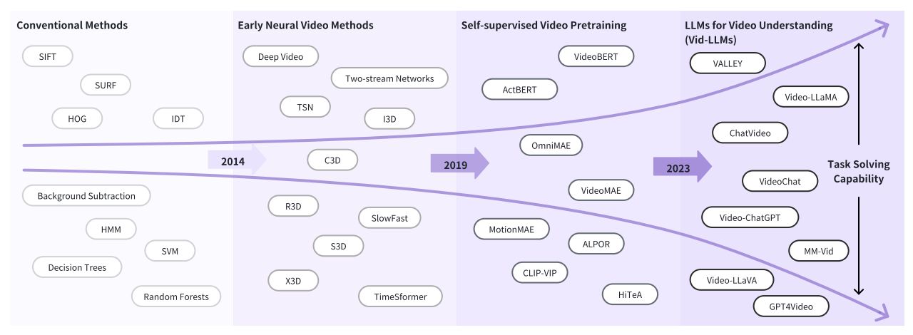
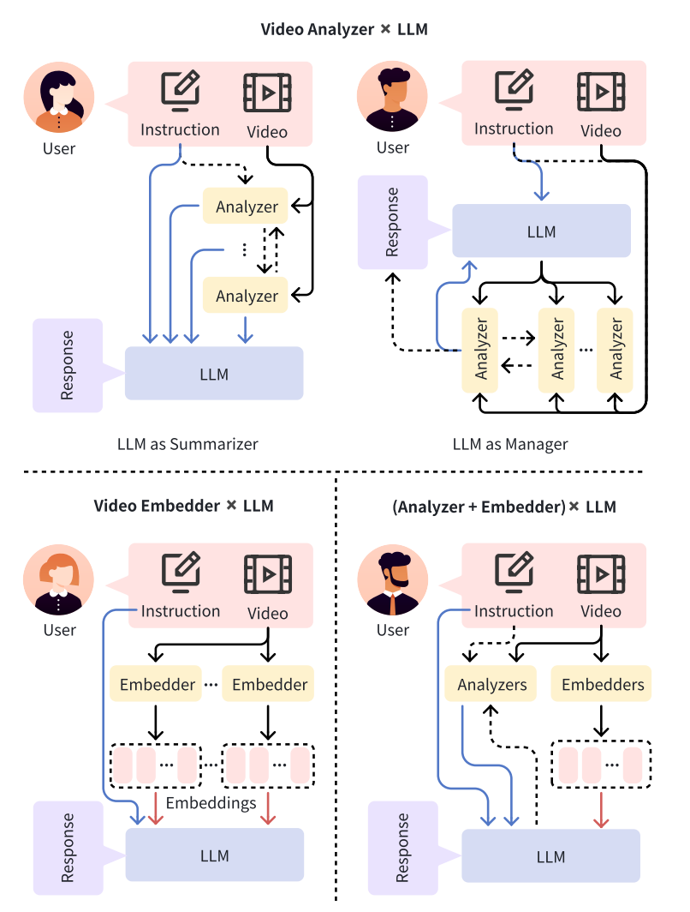
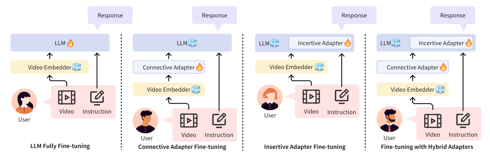

# 目录

- [1.VideoLLaMB的递归记忆桥接层是如何设计的？其主要优势是什么？](#1.VideoLLaMB的递归记忆桥接层是如何设计的？其主要优势是什么？)
- [2.VideoLLaMB的 SceneTilling 算法是如何工作的？它在视频分割和流式字幕生成中有何优势？](#2.VideoLLaMB的SceneTilling算法是如何工作的？它在视频分割和流式字幕生成中有何优势？)
- [3.VideoLLaMB在NIAVH基准上的表现如何？其独特之处体现在哪些方面？](#3.VideoLLaMB在NIAVH基准上的表现如何？其独特之处体现在哪些方面？)
- [4.VideoGPT+是如何利用分段采样策略来捕捉细粒度的时间动态的？](#4.VideoGPT+是如何利用分段采样策略来捕捉细粒度的时间动态的？)
- [5.VideoGPT+中的视觉适配器模块是如何促进图像和视频特征集成的？](#5.VideoGPT+中的视觉适配器模块是如何促进图像和视频特征集成的？)
- [6.与其他方法相比，VideoGPT+在方法架构上有哪些优势？](#6.与其他方法相比，VideoGPT+在方法架构上有哪些优势？)
- [7.Sa2VA模型是如何将SAM-2和LLaVA-like模型结合在一起的？这种结合方式有哪些优势？](#7.Sa2VA模型是如何将SAM-2和LLaVA-like模型结合在一起的？这种结合方式有哪些优势？)
- [8.Sa2VA如何处理多任务表示？](#8.Sa2VA如何处理多任务表示？)
- [9.为什么Sa2VA采用解耦设计?](#9.为什么Sa2VA采用解耦设计?)
- [10.Sa2VA有哪些潜在的应用场景？](#10.Sa2VA有哪些潜在的应用场景？)
- [11.什么是零样本学习？LLaVA-NeXT在视频理解任务中是如何实现零样本学习的？](#11.什么是零样本学习？LLaVA-NeXT在视频理解任务中是如何实现零样本学习的？)
- [12.LLaVA-NeXT模型的核心技术有哪些？](#12.LLaVA-NeXT模型的核心技术有哪些？)
- [13.LLaVA-NeXT是如何实现长度泛化的？为什么这项技术对视频理解很重要？](#13.LLaVA-NeXT是如何实现长度泛化的？为什么这项技术对视频理解很重要？)
- [14.请阐述视频理解模型架构的演进过程，从传统方法到Vid-LLMs的四个发展阶段](#14.请阐述视频理解模型架构的演进过程，从传统方法到Vid-LLMs的四个发展阶段)
- [15.比较分析Video-Analyzer×LLM、Video-Embedder×LLM、(Analyzer+Embedder)×LLM三种核心架构的优缺点和适用场景](#15.比较分析Video-Analyzer×LLM、Video-Embedder×LLM、(Analyzer+Embedder)×LLM三种核心架构的优缺点和适用场景)
- [16.详细分析3D CNN与2D CNN+时序建模的组合架构在视频理解中的技术路线差异](#16.详细分析3DCNN与2DCNN+时序建模的组合架构在视频理解中的技术路线差异)
- [17.对比分析基于CNN的SlowFast网络与基于Transformer的TimeSformer在长视频理解中的架构差异](#17.对比分析基于CNN的SlowFast网络与基于Transformer的TimeSformer在长视频理解中的架构差异)
- [18.Vid-LLMs中常用的视频编码器（Video-Embedder）有哪些类型？比较CLIP系列、BLIP-2、EVA-CLIP的性能差异](#18.Vid-LLMs中常用的视频编码器（Video-Embedder）有哪些类型？比较CLIP系列、BLIP-2、EVA-CLIP的性能差异)
- [19.详细说明Vid-LLMs中的适配器（Adapter）设计模式，包括连接适配器与插入适配器的技术实现](#19.详细说明Vid-LLMs中的适配器（Adapter）设计模式，包括连接适配器与插入适配器的技术实现)
- [20.分析Video-LLaMA、Video-ChatGPT、Vila等主流Vid-LLMs的架构创新点和技术路线差异](#20.分析Video-LLaMA、Video-ChatGPT、Vila等主流Vid-LLMs的架构创新点和技术路线差异)
- [21.针对长视频理解挑战，分析LLaMA-VID、LongVLM、VideoAgent等模型的长序列处理架构设计](#21.针对长视频理解挑战，分析LLaMA-VID、LongVLM、VideoAgent等模型的长序列处理架构设计)
- [22.比较不同模型在时序定位任务（Temporal Grounding）中的架构设计，如SeViLA、TimeChat、VTG-LLM](#22.比较不同模型在时序定位任务（Temporal-Grounding）中的架构设计，如SeViLA、TimeChat、VTG-LLM)

<h2 id="1.VideoLLaMB的递归记忆桥接层是如何设计的？其主要优势是什么？">1.VideoLLaMB的递归记忆桥接层是如何设计的？其主要优势是什么？</h2>

**VideoLLaMB**是一种新颖的长视频理解框架，利用带有递归内存 token 的内存桥接层对 100% 的视频内容进行编码，而不会丢弃关键的视觉提示。

VideoLLaMB的递归记忆桥接层通过在桥接层内集成递归记忆令牌来增强线性层的记忆能力。具体设计如下：

- **记忆token**：在每个视频段前缀固定数量的记忆令牌，表示为[mi;si]，其中mi表示记忆令牌，si表示视频段。

- **自注意力操作**：对包含记忆令牌的视频段应用标准的自注意力操作，生成更新后的记忆令牌和视觉表示，公式如下：

- **递归处理**：这个过程递归进行，遍历语义视频段的同时更新记忆 token，最终生成视频序列的压缩视觉摘要。

**其主要优势包括：**

- **增强记忆能力**：通过递归记忆令牌，桥接层能够增强对视频内容的记忆能力。
- **信息压缩**：记忆令牌能够在保留当前视频场景的同时压缩过去视频的信息，提高计算效率。
- **缓解梯度消失**：通过记忆缓存和检索机制，能够有效缓解梯度消失问题，保留长期依赖信息。

<h2 id="2.VideoLLaMB的 SceneTilling 算法是如何工作的？它在视频分割和流式字幕生成中有何优势？">2.VideoLLaMB的 SceneTilling 算法是如何工作的？它在视频分割和流式字幕生成中有何优势？</h2>

SceneTilling算法通过以下步骤实现视频分割：

- 余弦相似度计算：计算相邻帧对之间的余弦相似度，生成相似度分数序列。
- 深度分数计算：根据相似度分数计算每个点的深度分数，公式为：

- **分割阈值设置**：根据深度分数的分位数设置分割阈值，选择超过阈值的深度分数对应的分割点，将视频分割成多个语义段。

**在流式字幕生成中，SceneTilling算法的优势包括：**

- **自动字幕结束点预测**：无需特殊训练令牌即可自动识别流式视频的字幕结束点。
- **场景变化检测**：能够有效检测视频中的场景变化，并生成相应的事件字幕。
- **无需额外训练**：利用视频的语义分割结果，无需额外的训练数据即可实现流式字幕生成。

<h2 id="3.VideoLLaMB在NIAVH基准上的表现如何？其独特之处体现在哪些方面？">3.VideoLLaMB在NIAVH基准上的表现如何？其独特之处体现在哪些方面？</h2>

**在NIAVH基准上，VideoLLaMB表现出色，主要得益于其独特的设计和多模态查询能力：**

- 多模态查询支持：NIAVH支持文本、图像和视频等多种模态的查询，能够全面评估模型在长视频中识别特定内容的能力。
- 高效的视频理解：VideoLLaMB 通过递归记忆桥接层和SceneTilling算法，能够在各种视频长度下准确检索到正确的图像针。
- 对比其他方法：与现有的自适应池化、位置外推结合采样等方法相比，VideoLLaMB在处理长视频时表现出更高的效率和更低的成本。

**其独特之处体现在：**

- **记忆缓存与检索**：通过记忆缓存和检索机制，VideoLLaMB 能够有效保留先前的状态记忆，缓解梯度消失问题。
- **语义分割**：SceneTilling 算法将视频分割成独立的语义单元，确保语义完整性和场景变化的准确性。
- **综合性能**：在长视频问答、自我中心规划和帧检索等多个任务上，VideoLLaMB 均表现出显著优于现有方法的性能。

<h2 id="4.VideoGPT+是如何利用分段采样策略来捕捉细粒度的时间动态的？">4.VideoGPT+是如何利用分段采样策略来捕捉细粒度的时间动态的？</h2>

- VideoGPT+采用了分段采样策略，将视频分割成多个小段，并对每段的帧进行编码。具体来说，输入视频被分成K个段，每个段包含T/K帧。
每个段被下采样到低分辨率n×h×w×c进行视频编码。
- 相比均匀采样，**分段采样**更好地与双编码器设计对齐，使视频编码器能够在每个段内高效捕捉丰富的temporal cues。
分段采样策略确保了模型能够在不增加计算复杂性的情况下，捕捉到视频中的细粒度时间动态。

<h2 id="5.VideoGPT+中的视觉适配器模块是如何促进图像和视频特征集成的？">5.VideoGPT+中的视觉适配器模块是如何促进图像和视频特征集成的？</h2>

- VideoGPT+引入了一个视觉适配器模块，用于促进图像和视频特征的集成。该模块首先对图像和视频编码器的输出嵌入进行投影，分别通过独立的视觉语言（V-L）投影层Wg和Wh，
将这些多维特征映射到语言空间。
- **投影层是可训练的，而视觉编码器保持冻结状态，** 从而保留了丰富的预训练表示。投影后的嵌入被重塑回网格形式，并经过一个2×2的自适应令牌池化操作，
该操作在局部和全局特征的空间维度上操作，减少了令牌长度，使得更大的视觉上下文能够适应相同的LLM上下文窗口。最终，池化的嵌入被连接起来，
形成一个包含详细空间表示和全面时间上下文的序列，输入到LLM中进行处理。

<h2 id="6.与其他方法相比，VideoGPT+在方法架构上有哪些优势？">6.与其他方法相比，VideoGPT+在方法架构上有哪些优势？</h2>

- **VideoGPT+在VCGBench-Diverse基准上的平均得分为2.47**，超过了所有之前的方法。具体来说，VideoGPT+在详细字幕、空间理解和视觉推理能力方面分别达到了不错的分数。
- 与其他方法相比，**VideoGPT+的优势**在于其双编码器设计，结合了图像编码器的空间细节和视频编码器的时间上下文；轻量级视觉适配器模块有效地将图像和视频特征映射到共同空间；
分段采样策略保留了细粒度的时间动态。这些设计使得VideoGPT+在处理多样化视频内容和复杂推理任务时表现出色。

<h2 id="7.Sa2VA模型是如何将SAM-2和LLaVA-like模型结合在一起的？这种结合方式有哪些优势？">7.Sa2VA模型是如何将SAM-2和LLaVA-like模型结合在一起的？这种结合方式有哪些优势？</h2>

**Sa2VA模型通过将SAM-2和LLaVA-like模型**结合在一起，创建了一个统一的、真实世界视频理解框架。具体来说，**Sa2VA模型包含两个主要部分**：**预训练的MLLMs和SAM-2**。
预训练的MLLMs负责处理**图像、视频和视觉提示，并将其转换为视觉令牌**，然后输入到LLM中进行文本预测。SAM-2则通过特殊的"[SEG]"令牌与MLLM连接，
"[SEG]"令牌的隐藏状态被用作新的空间-时间提示，输入到SAM-2的解码器中，生成分割掩码。

**这种结合方式的优势包括：**

**1. 任务统**：所有图像和视频理解任务（包括指代分割、图像/视频聊天和真实字幕生成）都被统一为一个一次性指令调优过程，简化了模型的设计和训练。

**2. 性能平衡**：通过联合训练，Sa2VA能够在不同任务之间平衡性能，确保强大的指代视觉理解能力而不牺牲MLLMs的语言能力。

**3. 灵活性**：Sa2VA的设计使其成为一个插件式的模块，可以方便地更新最新的MLLMs，利用其最新的知识和改进。

<h2 id="8.Sa2VA如何处理多任务表示？">8.Sa2VA如何处理多任务表示？</h2>

**Sa2VA**通过**统一的任务表示**方法来处理多种任务，包括**图像和视频的参考分割、聊天和基于地面的描述生成**。所有这些任务都被统一为一个单次指令调整过程。
具体来说，**输入的文本、图像和视频被编码为令牌**，并通过LLaVA进行处理，**生成相应的输出文本或掩码。**

<h2 id="9.为什么Sa2VA采用解耦设计?">9.为什么Sa2VA采用解耦设计?</h2>

**Sa2VA采用解耦设计**是为了简化模型结构并减少计算开销。通过不将SAM-2的输出令牌直接输入到LLaVA中，避免了额外的对齐过程。
这种设计使得模型更加模块化，便于更新和扩展。此外，解耦设计还使Sa2VA成为一个即插即用的模块，能够轻松集成最新的LLM模型。

<h2 id="10.Sa2VA有哪些潜在的应用场景？">10.Sa2VA有哪些潜在的应用场景？</h2>

**Sa2VA在多种应用场景中具有潜力**，包括：

- **视频编辑和生成**
- **机器人导航和视觉伺服控制**
- **监控分析和异常检测**
- **增强的虚拟现实和增强现实体验**

通过这些问题和答案，可以**全面了解Sa2VA的技术细节和应用潜力**。

<h2 id="11.什么是零样本学习？LLaVA-NeXT在视频理解任务中是如何实现零样本学习的？">11.什么是零样本学习？LLaVA-NeXT在视频理解任务中是如何实现零样本学习的？</h2>

**零样本学习**是指模型在没有直接接触过目标任务数据的情况下，通过迁移已有的知识来完成对新任务的学习。

**LLaVA-NeXT**通过AnyRes技术实现零样本学习。AnyRes将高分辨率图像分解为多个子图像序列，使其能够被预训练的视觉模型（如ViT）处理。这种技术自然地推广到视频（由多帧组成），
使得仅在图像上训练的LLaVA-NeXT模型能够很好地处理视频任务，无需额外的视频数据训练。

<h2 id="12.LLaVA-NeXT模型的核心技术有哪些？">12.LLaVA-NeXT模型的核心技术有哪些？</h2>

**LLaVA-NeXT的核心技术**包括AnyRes技术、长度泛化（Length Generalization）技术和直接偏好优化（Direct Preference Optimization，DPO）技术。

**AnyRes技术**用于处理高分辨率图像和视频帧；**长度泛化技术**通过线性缩放等方法扩展模型处理长视频的能力；**DPO技术**利用AI反馈对模型进行优化，提升其在视频任务中的表现。

<h2 id="13.LLaVA-NeXT是如何实现长度泛化的？为什么这项技术对视频理解很重要？">13.LLaVA-NeXT是如何实现长度泛化的？为什么这项技术对视频理解很重要？</h2>

LLaVA-NeXT通过引入线性缩放技术实现长度泛化。具体来说，它在旋转位置嵌入（RoPE）中引入一个缩放因子，例如将缩放因子设置为2，模型的“max_token_length”容量就可以翻倍，从而能够处理更长的序列。
这项技术对视频理解非常重要，因为视频通常包含大量的帧，远远超过模型在训练时的“max_token_length”限制。通过长度泛化，LLaVA-NeXT能够有效处理长视频，更好地捕捉视频中的时间动态和上下文信息，
提升视频理解的准确性和完整性。

<h2 id="14.请阐述视频理解模型架构的演进过程，从传统方法到Vid-LLMs的四个发展阶段">14.请阐述视频理解模型架构的演进过程，从传统方法到Vid-LLMs的四个发展阶段</h2>

视频理解架构演进可分为四个关键阶段：
- 传统方法阶段：基于手工特征提取，如SIFT、HOG、IDT等特征描述符，结合SVM、HMM等机器学习算法
- 早期神经模型阶段：DeepVideo首次引入CNN，Two-stream networks融合时空信息，C3D开创3D卷积，I3D通过膨胀2D网络提升性能
- 自监督预训练阶段：VideoBERT首次将BERT思想应用于视频，采用分层k-means token化，开启"预训练-微调"范式
- Vid-LLMs阶段：集成LLM的推理能力，形成三大主流架构范式

<h2 id="15.比较分析Video-Analyzer×LLM、Video-Embedder×LLM、(Analyzer+Embedder)×LLM三种核心架构的优缺点和适用场景">15.比较分析Video-Analyzer×LLM、Video-Embedder×LLM、(Analyzer+Embedder)×LLM三种核心架构的优缺点和适用场景</h2>

Video Analyzer × LLM架构：
- 优点：无需训练LLM参数，利用现有分析器，计算效率高
- 缺点：依赖分析器质量，信息在分析阶段可能丢失
- 代表模型：ViperGPT、Video ChatCaptioner
  
Video Embedder × LLM架构：
- 优点：端到端学习，保持原始视频信息，适应性强
- 缺点：需要大量训练数据，模态对齐挑战大
- 代表模型：Video-LLaMA、Video-ChatGPT

混合架构：
- 优点：结合前两者优势，提供多粒度信息
- 缺点：系统复杂，计算资源需求高
- 代表模型：Vid2Seq、VideoChat

<h2 id="16.详细分析3D CNN与2D CNN+时序建模的组合架构在视频理解中的技术路线差异">16.详细分析3D CNN与2D CNN+时序建模的组合架构在视频理解中的技术路线差异</h2>

3D CNN路线：
- C3D：直接3D卷积，参数量大但时空特征统一提取
- I3D：膨胀3D卷积，利用ImageNet预训练权重
- 演进：P3D分解3D卷积，SlowFast多速率处理，X3D维度平衡

2D CNN+时序建模路线：
- Two-stream：空间流（单帧）+时间流（光流）后期融合
- LSTM/TSN：2D CNN特征+时序建模，TSN通过分段共识处理长视频
- TimeSformer：纯Transformer架构，分解时空注意力机制

<h2 id="17.对比分析基于CNN的SlowFast网络与基于Transformer的TimeSformer在长视频理解中的架构差异">17.对比分析基于CNN的SlowFast网络与基于Transformer的TimeSformer在长视频理解中的架构差异</h2>

SlowFast架构特点：
- 双路径：Slow路径（低帧率，高通道数）捕获空间语义
- Fast路径（高帧率，低通道数）捕捉运动信息
- 侧向连接实现多尺度特征融合

TimeSformer架构创新：
- 空间注意力+时间注意力的分解设计
- 降低计算复杂度从O(n²)到O(n)
- 支持长序列处理，无需预训练

<h2 id="18.Vid-LLMs中常用的视频编码器（Video-Embedder）有哪些类型？比较CLIP系列、BLIP-2、EVA-CLIP的性能差异">18.Vid-LLMs中常用的视频编码器（Video-Embedder）有哪些类型？比较CLIP系列、BLIP-2、EVA-CLIP的性能差异</h2>

CLIP系列编码器：
- ViT-L/14：均衡型，广泛用于Video-LLaMA、MovieChat等
- ViT-G/14：高性能，参数量大，适合计算资源充足场景
- EVA-CLIP：增强版，在InternVideo2、Vid2Seq中表现优异

BLIP-2架构：
- 集成Q-Former，实现视觉-语言高效对齐
- 在SeViLA、TimeChat中用于时序定位任务

专用视频编码器：
- TimeSformer：纯Transformer时序建模
- VideoSwiner：基于Swin Transformer的视频适配版本

<h2 id="19.详细说明Vid-LLMs中的适配器（Adapter）设计模式，包括连接适配器与插入适配器的技术实现">19.详细说明Vid-LLMs中的适配器（Adapter）设计模式，包括连接适配器与插入适配器的技术实现</h2>

连接适配器（Connective Adapters）：
- 线性投影层：简单MLP，将视频嵌入映射到文本空间
- Q-Former：跨模态注意力机制，学习query向量桥接视觉语言
- Perceiver：处理可变长度输入，降低计算复杂度

插入适配器（Insertive Adapters）：
- LoRA：低秩适应，仅训练小量参数，保持PLM能力
- Adapter模块：在Transformer层间插入小型网络
- Prefix-Tuning：在输入前添加可训练前缀向量

<h2 id="20.分析Video-LLaMA、Video-ChatGPT、Vila等主流Vid-LLMs的架构创新点和技术路线差异">20.分析Video-LLaMA、Video-ChatGPT、Vila等主流Vid-LLMs的架构创新点和技术路线差异</h2>

Video-LLaMA架构特色：
- 双编码器：图像编码器（空间）+视频编码器（时序）
- 跨模态注意力融合视觉与音频信息
- 采用LoRA进行高效微调

Video-ChatGPT技术路线：
- 基于BLIP-2架构，使用Q-Former进行模态对齐
- 指令微调优化对话能力
- 支持多轮视频对话上下文理解

Vila架构创新：
- 统一投影层处理多模态输入
- 采用分组查询注意力降低计算量
- 在长视频理解任务中表现优异

<h2 id="21.针对长视频理解挑战，分析LLaMA-VID、LongVLM、VideoAgent等模型的长序列处理架构设计">21.针对长视频理解挑战，分析LLaMA-VID、LongVLM、VideoAgent等模型的长序列处理架构设计</h2>

时序建模策略对比：
- 均匀采样：固定间隔采样，计算效率高但可能丢失关键帧
- 自适应采样：基于内容重要性动态选择关键帧
- 分层处理：粗粒度筛选+细粒度分析的多级架构
- 记忆机制：维护长期记忆存储，解决信息遗忘问题

<h2 id="22.比较不同模型在时序定位任务（Temporal Grounding）中的架构设计，如SeViLA、TimeChat、VTG-LLM">22.比较不同模型在时序定位任务（Temporal Grounding）中的架构设计，如SeViLA、TimeChat、VTG-LLM</h2>

回归式架构（SeViLA）：
- 直接预测起止时间戳
- 采用平滑L1损失函数优化
- 需要精确的时间标注数据

检索式架构（TimeChat）：
- 生成候选时间段再进行排序
- 利用对比学习优化表示
- 对长视频更友好，可扩展性强

混合架构（VTG-LLM）：
- 粗粒度定位+细粒度调整
- 结合检索效率与回归精度优势
