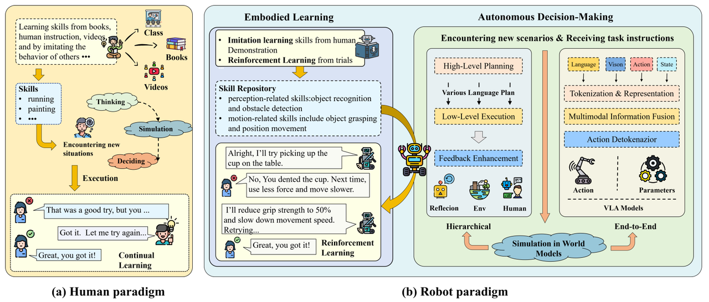
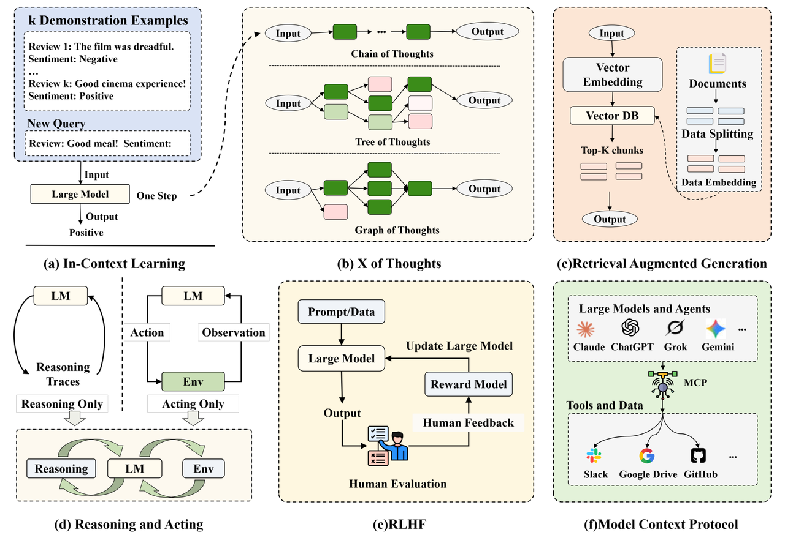
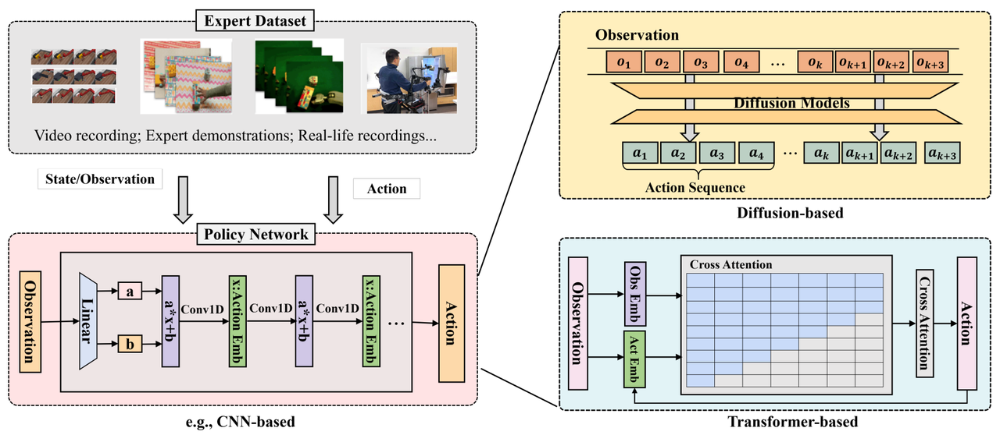
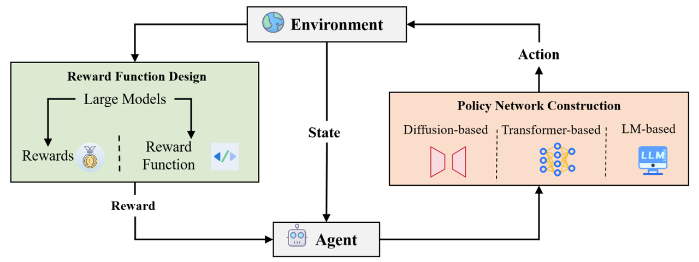

## 目录

- [1.什么是具身AI？其核心目标是什么？](#1.什么是具身AI？其核心目标是什么？)
- [2.大模型如何赋能具身AI？主要从哪些方面增强其能力？](#2.大模型如何赋能具身AI？主要从哪些方面增强其能力？)
- [3.具身智能与传统AI的主要区别是什么？](#3.具身智能与传统AI的主要区别是什么？)
- [4.描述具身智能系统的典型工作流程](#4.描述具身智能系统的典型工作流程)
- [5.具身智能中的感知-行动循环如何实现？](#5.具身智能中的感知-行动循环如何实现？)
- [6.比较符号主义与行为主义在具身智能中的体现](#6.比较符号主义与行为主义在具身智能中的体现)
- [7.大语言模型如何提升具身智能的规划能力？](#7.大语言模型如何提升具身智能的规划能力？)
- [8.大模型如何增强模仿学习？请举例说明](#8.大模型如何增强模仿学习？请举例说明)
- [9.阐述大模型在强化学习中的两种增强方式](#9.阐述大模型在强化学习中的两种增强方式)
- [10.大模型在具身智能系统中的角色定位是什么？](#10.大模型在具身智能系统中的角色定位是什么？)
- [11.大模型如何解决具身智能中的长程规划问题？](#11.大模型如何解决具身智能中的长程规划问题？)
- [12.大模型如何赋能家庭服务机器人的场景适应？](#12.大模型如何赋能家庭服务机器人的场景适应？)
- [13.具身智能的核心组成部分有哪些？各自的作用是什么？](#13.具身智能的核心组成部分有哪些？各自的作用是什么？)
- [14.具身智能从“单模态”到“多模态”的演进逻辑是什么？](#14.具身智能从“单模态”到“多模态”的演进逻辑是什么？)
- [15.LLM/MLLM在具身智能中扮演什么角色？存在哪些局限性？](#15.LLM/MLLM在具身智能中扮演什么角色？存在哪些局限性？)
- [16.世界模型(World-Models)在具身智能中的核心价值是什么？如何分类？](#16.世界模型(World-Models)在具身智能中的核心价值是什么？如何分类？)
- [17.为什么说“MLLM-WM联合架构”是具身智能的核心解决方案？如何协同工作？](#17.为什么说“MLLM-WM联合架构”是具身智能的核心解决方案？如何协同工作？)
- [18.具身智能的硬件优化有哪些关键方向？](18.具身智能的硬件优化有哪些关键方向？)

<h2 id="1.什么是具身AI？其核心目标是什么？">1.什么是具身AI？其核心目标是什么？</h2>

**答：**具身AI旨在**开发具有物理形态的智能系统**，能够在真实环境中**感知、决策、行动和学习**。其核心目标是**实现人工通用智能（AGI）**，让智能体在开放动态环境中执行通用任务，**达到人类水平的智能。**

<h2 id="2.大模型如何赋能具身AI？主要从哪些方面增强其能力？">2.大模型如何赋能具身AI？主要从哪些方面增强其能力？</h2>

**大模型通过以下方面赋能具身AI：**

- **感知增强**：利用**视觉语言模型**（VLM）提升环境感知和理解能力
- **规划优化**：通过**大语言模型**（LLM）进行高层次任务规划和分解
- **行动生成**：采用**视觉-语言-行动**（VLA）模型实现端到端决策
- **学习效率**：增强**模仿学习和强化学习**的样本效率和泛化能力

<h2 id="3.具身智能与传统AI的主要区别是什么？">3.具身智能与传统AI的主要区别是什么？</h2>

**具身智能与传统AI的核心区别体现在：**

**环境交互性：**

- **具身智能**：强调与物理环境的实时交互和反馈循环
- **传统AI**：通常在封闭的虚拟环境中运行

**学习****范式****：**

- **具身智能**：通过身体与环境的互动进行在线学习
- **传统AI**：主要依赖离线数据集训练

**任务特性：**

- **具身智能**：处理动态、开放的实时任务
- **传统AI**：解决相对静态、定义明确的问题

<h2 id="4.描述具身智能系统的典型工作流程">4.描述具身智能系统的典型工作流程</h2>

**具身智能系统的工作流程包含以下关键步骤：**

- **意图理解**：解析人类语言指令，理解任务目标
- **环境感知**：通过传感器获取多模态环境信息
- **状态估计**：构建环境内部表示和自身状态认知
- **任务规划**：将高层目标分解为可执行子任务
- **动作生成**：将计划转化为具体的运动控制命令
- **执行反馈**：通过传感器反馈调整后续行动

<h2 id="5.具身智能中的感知-行动循环如何实现？">5.具身智能中的感知-行动循环如何实现？</h2>

**感知-行动循环的实现包含以下关键技术：**

**感知模块：**

- **多传感器融合**：视觉、触觉、听觉等数据整合
- **状态估计**：基于滤波和优化算法估计系统状态
- **场景理解**：识别物体、关系及语义信息

**决策模块：**

- **实时规划**：考虑动态约束的运动规划
- **控制策略**：PID、MPC等控制算法实现精确执行
- **适应性调整**：根据环境反馈在线调整策略

<h2 id="6.比较符号主义与行为主义在具身智能中的体现">6.比较符号主义与行为主义在具身智能中的体现</h2>

**符号主义方法：** **基于明确的符号表示和逻辑推理**

- **优点**：可解释性强，推理过程透明
- **缺点**：难以处理不确定性和连续变化
- **应用：早期****专家系统****、规划算法**

**行为主义方法：** **强调输入-输出映射，避开心智表示**

- **优点**：适应性强，处理实时控制效果好
- **缺点**：复杂任务分解困难
- **应用：行为树、反应式控制**

**现代融合：**

- **分层架构**：高层符号规划+底层连续控制
- **大模型赋能**：结合符号推理与数据驱动学习

<h2 id="7.大语言模型如何提升具身智能的规划能力？">7.大语言模型如何提升具身智能的规划能力？</h2>

**高层任务分解：**
- 自然语言指令解析为结构化子目标
- 利用常识知识进行合理的任务分解
- 处理模糊指令和隐含约束

**知识增强推理：**
- 引入外部知识库信息
- 物理常识和因果推理
- 多步骤逻辑推理链构建

**适应性调整：**
- 根据执行反馈重新规划
- 处理异常情况和意外事件
- 多方案生成和评估

<h2 id="8.大模型如何增强模仿学习？请举例说明">8.大模型如何增强模仿学习？请举例说明</h2>

**大模型通过以下方式增强模仿学习：**
扩散模型策略网络：
- 使用扩散模型处理多模态行动分布
- 通过迭代去噪生成多样化的行动轨迹
- 示例：Diffusion Policy框架利用U-Net作为去噪网络

**Transformer策略网络：**
- 将专家轨迹视为序列数据建模
- 利用自注意力机制捕捉行动间依赖关系
- 示例：RT-1结合大规模数据集和预训练VLM

<h2 id="9.阐述大模型在强化学习中的两种增强方式">9.阐述大模型在强化学习中的两种增强方式</h2>

奖励函数设计：
- 利用LLM从文本描述生成密集奖励信号
- 减少对人工设计奖励函数的依赖
- 示例：Eureka利用GPT-4自动生成奖励函数

策略网络构建：
- 扩散模型：增强策略表达能力，处理复杂行动分布
- Transformer架构：利用序列建模能力处理长程依赖
- LLM作为策略代理：生成可执行行动序列

<h2 id="10.大模型在具身智能系统中的角色定位是什么？">10.大模型在具身智能系统中的角色定位是什么？</h2>

大模型在具身智能中扮演着认知核心的角色：
高层决策引擎：
- 将自然语言指令转化为可执行的任务规划
- 利用常识知识进行合理的任务分解和排序
- 处理模糊指令和隐含约束条件

世界知识库：
- 提供物体属性、功能、使用方法的先验知识
- 支持物理常识推理和因果关系推断
- 增强对罕见场景和物体的理解能力

交互接口：
- 实现自然的人机对话和指令理解
- 支持多轮交互和上下文维护
- 提供任务执行进展的可解释说明

<h2 id="11.大模型如何解决具身智能中的长程规划问题？">11.大模型如何解决具身智能中的长程规划问题？</h2>

层次化任务分解：
- 大模型将复杂任务分解为子目标序列
- 每个子目标对应可执行的原子动作
- 支持任务执行过程中的动态重规划

常识推理增强：
- 利用物理常识避免不合理行动
- 基于物体功能知识进行工具使用规划
- 考虑任务执行社会规范和安全性

代码生成能力：
- 将自然语言指令转化为控制代码
- 支持复杂逻辑条件和循环结构
- 实现灵活的任务适应性调整

<h2 id="12.大模型如何赋能家庭服务机器人的场景适应？">12.大模型如何赋能家庭服务机器人的场景适应？</h2>

个性化场景理解：
- 学习家庭特定布局和物体摆放习惯
- 适应不同用户的操作偏好和指令风格
- 基于历史交互进行行为个性化调整

开放式任务处理：
- 处理"整理一下房间"等模糊指令
- 根据场景上下文进行合理的任务解释
- 多任务间进行优先级判断和调度

异常情况处理：
- 检测环境变化和意外障碍物
- 生成替代方案应对计划外情况
- 主动向用户确认不确定操作

<h2 id="13.具身智能的核心组成部分有哪些？各自的作用是什么？">13.具身智能的核心组成部分有哪些？各自的作用是什么？</h2>

- 主动感知：通过传感器（摄像头、触觉传感器等）选择性获取环境信息，包括视觉 SLAM、3D 场景理解等，是智能体与世界交互的基础；
- 具身认知：基于历史经验更新内部状态，实现任务分解、因果推理、长周期规划，核心是 “从经验中学习”；
- 动态交互：通过执行器（机械臂、轮子等）执行动作，包括动作控制、行为互动、多智能体协作，是智能体影响环境的关键；
- 补充：硬件载体是支撑，需通过模型压缩、专用加速器等满足实时性和能耗需求。

<h2 id="14.具身智能从“单模态”到“多模态”的演进逻辑是什么？">14.具身智能从“单模态”到“多模态”的演进逻辑是什么？</h2>

早期单模态具身智能仅依赖单一感官（如视觉主导感知、语言主导认知），存在信息范围窄、模块间信息割裂的问题；
多模态演进的核心是整合视觉、听觉、触觉、语言等多类信息，一方面能更全面理解环境（如结合视觉 + 触觉判断物体材质），另一方面能打通感知 - 认知 - 互动的协同（如语言指令指导视觉感知方向），让智能体更适应动态复杂场景。

<h2 id="15.LLM/MLLM在具身智能中扮演什么角色？存在哪些局限性？">15.LLM/MLLM在具身智能中扮演什么角色？存在哪些局限性？</h2>

核心作用：
- 语义推理：解读多模态信息的语义（如识别物体、推断空间关系）；
- 任务分解：将复杂目标拆分为可执行的子任务（如 “打扫客厅” 拆为 “捡垃圾→擦桌子”）；
- 跨模态对齐：打通高层指令与底层动作的映射（如自然语言指令转化为机器人动作序列）。

局限性：
- 忽视物理约束：易生成不符合物理规律的计划（如忽略摩擦力导致物体滑落）；
- 实时适应性差：依赖静态预训练知识，难以快速响应环境变化（如环境突发障碍时无法及时调整动作）；
- 依赖固定动作库：难以自适应新机器人或新环境。

<h2 id="16.世界模型(World-Models)在具身智能中的核心价值是什么？如何分类？">16.世界模型(World-Models)在具身智能中的核心价值是什么？如何分类？</h2>

核心价值：
- 构建内部表征：压缩感官输入，捕捉物理规律、物体动态和空间结构（如重力、物体形状）；
- 未来预测：模拟动作序列的后果，规避风险（如预测 “推杯子” 会导致滑落，提前调整力度）。

分类：
- RSSM-based：基于循环状态空间模型，擅长捕捉时间动态，支撑机器人运动控制（如 Dreamer 系列）；
- JEPA-based：基于联合嵌入预测架构，注重语义特征提取，泛化能力强；
- Transformer-based：基于注意力机制，擅长长时序记忆和复杂场景推理（如 Google Genie）。

<h2 id="17.为什么说“MLLM-WM联合架构”是具身智能的核心解决方案？如何协同工作？">17.为什么说“MLLM-WM联合架构”是具身智能的核心解决方案？如何协同工作？</h2>

核心原因是两者互补短板：MLLM 擅长语义推理和任务规划，但缺乏物理 grounding；WM 擅长物理模拟和预测，但缺乏高层语义理解。

协同逻辑：
- MLLM 赋能 WM：为 WM 注入语义（如通过语言标注优化物体识别）、分解高层任务（如将 “浇水” 拆为 “找水壶→装水→浇水”）；
- WM 赋能 MLLM：为 MLLM 提供物理约束（如过滤 “穿墙” 等不合理动作）、维持时空上下文（如追踪物体轨迹避免歧义）；
- 典型流程：MLLM 分解任务→WM 验证计划可行性→执行中 WM 实时反馈→MLLM 动态调整计划。

<h2 id="18.具身智能的硬件优化有哪些关键方向？">18.具身智能的硬件优化有哪些关键方向？</h2>

核心是平衡性能、 latency 和能耗，关键方向：
- 模型压缩：通过量化（降低比特宽度）、剪枝（去除冗余参数）减少计算量；
- 编译器优化：通过算子融合、循环重排提升代码执行效率（如 TVM 工具链）；
- 专用加速器：FPGA（灵活适配任务）、ASIC（高能耗比）、TPU（加速矩阵运算）；
- 软硬件协同设计：联合优化模型结构与硬件架构（如根据硬件配置调整量化方案）。