<h1 id="目录">目录</h1>

## 一、RAG基础理论与概念

### 1.1 RAG基础定义
- [1.什么是RAG？](#1.什么是RAG？)

### 1.2 RAG评估与挑战
- [1.RAG文档召回率是什么？](#1.RAG文档召回率是什么？)
- [2.RAG技术的难点有哪些？](#2.RAG技术的难点有哪些？)
- [3.RAG存在的一些问题和避免方式有哪些？](#3.RAG存在的一些问题和避免方式有哪些？)
- [4.在大模型工程应用中RAG与LLM微调优化哪个是最优解?](#4.在大模型工程应用中RAG与LLM微调优化哪个是最优解?)
- [5.RAG的评估指标有哪些？](#5.RAG的评估指标有哪些？)

## 二、文档处理与向量化

### 2.1 文档格式与加载
- [1.RAG项目中为什么倾向于选择Markdown格式的文档？](#1.RAG项目中为什么倾向于选择Markdown格式的文档？)
- [2.RAG之PDF文档加载器介绍](#2.RAG之PDF文档加载器介绍)

### 2.2 文本分块策略
- [1.RAG项目中文本分块策略介绍？](#1.RAG项目中文本分块策略介绍？)
- [2.如何保证文档切片不会造成相关内容的丢失？文档切片的大小如何控制？](#2.如何保证文档切片不会造成相关内容的丢失？文档切片的大小如何控制？)
- [3.RAG之chunking方法介绍](#3.RAG之chunking方法介绍)

### 2.3 嵌入与向量化
- [1.RAG之Embedding模型介绍](#1.RAG之Embedding模型介绍)
- [2.RAG之假设文档嵌入(HyDE)](#2.RAG之假设文档嵌入(HyDE))

### 2.4 索引与存储
- [1.怎么通过预处理数据库提高RAG的精度？](#1.怎么通过预处理数据库提高RAG的精度？)
- [2.怎么通过知识图谱提高RAG的精度？](#2.怎么通过知识图谱提高RAG的精度？)
- [3.怎么使用总分层级索引提高RAG的精度？](#3.怎么使用总分层级索引提高RAG的精度？)
- [4.怎么使用父子层级索引提高RAG的精度？](#4.怎么使用父子层级索引提高RAG的精度？)
- [5.llama-index的索引类别有哪些？](#5.llama-index的索引类别有哪些？)
- [6.向量数据库介绍](#6.向量数据库介绍)

## 三、检索优化技术

### 3.1 预检索优化
- [1.怎么使用子查询（预检索）优化RAG？](#1.怎么使用子查询（预检索）优化RAG？)
- [2.怎么使用假设答案（预检索）优化RAG？](#2.怎么使用假设答案（预检索）优化RAG？)
- [3.还有哪些其他预检索技术优化RAG？](#3.还有哪些其他预检索技术优化RAG？)
- [4.RAG之查询重写的策略介绍](#4.RAG之查询重写的策略介绍)
- [5.什么是基于提示词的自适应（主动）检索？](#5.什么是基于提示词的自适应（主动）检索？)

### 3.2 检索过程优化
- [1.怎么使用多种切分方式和并行查询？](#1.怎么使用多种切分方式和并行查询？)
- [2.怎么让检索过程更加准确？](#2.怎么让检索过程更加准确？)
- [3.什么是RAG的迭代检索？](#3.什么是RAG的迭代检索？)
- [4.什么是RAG的递归检索？](#4.什么是RAG的递归检索？)
- [5.怎么使用llama-index实现递归检索？](#5.怎么使用llama-index实现递归检索？)

### 3.3 后检索优化
- [1.RAG之Re-Ranking机制介绍](#1.RAG之Re-Ranking机制介绍)
- [2.怎么使用Remark技术（后检索）优化RAG？](#2.怎么使用Remark技术（后检索）优化RAG？)

## 四、RAG架构与范式

### 4.1 经典RAG范式
- [1.什么是Modular-RAG及其框架？](#1.什么是Modular-RAG及其框架？)
- [2.经典的RAG-Flow范式（Tuning阶段）？](#2.经典的RAG-Flow范式（Tuning阶段）？)
- [3.经典的RAG-Flow范式（推理阶段-顺序模式）？](#3.经典的RAG-Flow范式（推理阶段-顺序模式）？)
- [4.经典的RAG-Flow范式（推理阶段-条件模式）？](#4.经典的RAG-Flow范式（推理阶段-条件模式）？)
- [5.如何通过llamaindex实现条件模式？](#5.如何通过llamaindex实现条件模式？)
- [6.经典的RAG-Flow范式（推理阶段-分支模式）？](#6.经典的RAGFlow范式（推理阶段-分支模式）？)

### 4.2 高级RAG架构
- [1.什么是Agentic-RAG？它与传统RAG有何不同？](#1.什么是Agentic-RAG？它与传统RAG有何不同？)
- [2.Agentic-RAG的核心组件有哪些？](#2.Agentic-RAG的核心组件有哪些？)
- [3.在Agentic-RAG中，代理模块如何决定检索哪些文档？](#3.在Agentic-RAG中，代理模块如何决定检索哪些文档？)
- [4.Agentic-RAG如何处理检索到的信息以生成高质量的回答？](#4.Agentic-RAG如何处理检索到的信息以生成高质量的回答？)
- [5.请解释Agentic-RAG中的自主学习机制是如何工作的？](#5.请解释Agentic-RAG中的自主学习机制是如何工作的？)
- [6.Agentic-RAG在哪些实际应用中具有优势？请举例说明。](#6.Agentic-RAG在哪些实际应用中具有优势？请举例说明。)
- [7.在多轮对话中，Agentic-RAG如何保持上下文一致性和信息连贯性？](#7.在多轮对话中，Agentic-RAG如何保持上下文一致性和信息连贯性？)
- [8.Agentic-RAG面临的主要挑战有哪些？如何应对这些挑战？](#8.Agentic-RAG面临的主要挑战有哪些？如何应对这些挑战？)
- [9.如何评估Agentic-RAG系统的性能？有哪些关键指标？](#9.如何评估Agentic-RAG系统的性能？有哪些关键指标？)
- [10.在设计Agentic-RAG时，如何平衡检索与生成模块的权重？](#10.在设计Agentic-RAG时，如何平衡检索与生成模块的权重？)

### 4.3 特定技术实现
- [1.怎么通过llamaindex实现FLAREdirect？](#1.怎么通过llamaindex实现FLAREdirect？)
- [2.怎么通过langchain实现FLAREdirect？](#2.怎么通过langchain实现FLAREdirect？)

## 五、RAG开发框架与工具

### 5.1 LangChain框架
- [1.怎么用langchain构建简单RAG？](#1.怎么用langchain构建简单RAG？)
- [2.基于langchain的本地文档问答系统实现步骤有哪些?](#2.基于langchain的本地文档问答系统实现步骤有哪些?)
- [3.介绍一下LangChain](#3.介绍一下LangChain)
- [4.LangChain中Chat-Message-History是什么？](#4.LangChain中Chat-Message-History是什么？)
- [5.LangChain中LangChain-Agent是什么？](5.LangChain中LangChain-Agent是什么？)
- [6.LangChain支持哪些功能?](#6.LangChain支持哪些功能?)
- [7.什么是LangChain-model?](#7.什么是LangChain-model?)
- [8.LangChain如何链接多个组件处理一个特定的下游任务？](#8.LangChain如何链接多个组件处理一个特定的下游任务？)

### 5.2 RAGFlow项目
- [1.怎么部署RAGFlow项目？](#1.怎么部署RAGFlow项目？)
- [2.怎么用RAGFlow建立知识库与聊天？](#2.怎么用RAGFlow建立知识库与聊天？)

<h1 id="一、RAG基础理论与概念"> 一、RAG基础理论与概念 </h1>

<h2 id="1.1 RAG基础定义"> 1.1 RAG基础定义 </h2>

<h3 id='1.什么是RAG？'>1.什么是RAG？</h3>

## 一、什么是 RAG？
RAG 全称 Retrieval-Augmented Generation，翻译成中文是检索增强生成。检索指的是检索外部知识库，增强生成指的是将检索到的知识送给大语言模型以此来优化大模型的生成结果，使得大模型在生成更精确、更贴合上下文答案的同时，也能有效减少产生误导性信息的可能。

## 二、为什么需要 RAG？
之所以需要 RAG，是因为大语言模型本身存在一些局限性。

1) 时效性
模型的训练是基于截至某一时间点之前的数据集完成的。这意味着在该时间点之后发生的任何事件、新发现、新趋势或数据更新都不会反映在模型的知识库中。例如，我的训练数据在 2023 年底截止，之后发生的事情我都无法了解。另外，大型模型的训练涉及巨大的计算资源和时间。这导致频繁更新模型以包括最新信息是不现实的，尤其是在资源有限的情况下。

2) 覆盖性
虽然大模型的训练数据集非常庞大，但仍可能无法涵盖所有领域的知识或特定领域的深度信息。例如，某些专业的医学、法律或技术问题可能只在特定的文献中被详细讨论，而这些文献可能未被包括在模型的训练数据中。另外，对于一些私有数据集，也是没有被包含在训练数据中的。当我们问的问题的答案没有包含在大模型的训练数据集中时，这时候大模型在回答问题时便会出现幻觉，答案也就缺乏可信度。

由于以上的一些局限性，大模型可能会生成虚假信息。为了解决这个问题，需要给大模型外挂一个知识库，这样大模型在回答问题时便可以参考外挂知识库中的知识，也就是 RAG 要做的事情。

## 三、RAG 的流程
RAG 的中文名称是检索增强生成，从字面意思来理解，包含三个检索、增强和生成三个过程。

- 检索： 根据用户的查询内容，从外挂知识库获取相关信息。具体来说，就是将用户的查询通过嵌入模型转换成向量，以便与向量数据库中存储的知识相关的向量进行比对。通过相似性搜索，从向量数据库中找出最匹配的前 K 个数据。

- 增强： 将用户的查询内容和检索到的相关知识一起嵌入到一个预设的提示词模板中。

- 生成： 将经过检索增强的提示词内容输入到大语言模型（LLM）中，以此生成所需的输出。 流程图如下所示：
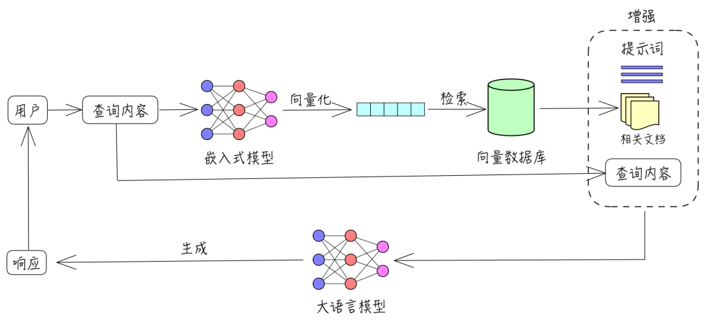

<h2 id="1.2 RAG评估与挑战"> 1.2 RAG评估与挑战 </h2>

<h3 id='1.RAG文档召回率是什么？'>1.RAG文档召回率是什么？</h3>

RAG（Retrieval-Augmented Generation）中的文档召回率（Document Recall）是指在检索阶段，模型能够成功找到与用户查询相关的所有文档的比例。具体来说，它衡量的是在所有相关文档中，有多少被成功检索到了。

文档召回率是评估检索系统性能的重要指标。它可以用以下公式计算：文档召回率=成功检索到的相关文档数量/所有相关文档数量

在RAG中，文档召回率的高低直接影响生成模型的表现。如果召回率低，生成模型可能会缺乏足够的背景信息，从而影响答案的准确性和相关性。

要提高文档召回率，可以采取以下措施：

1. 改进检索模型：使用更先进的检索模型，如Dense Passage Retrieval (DPR) 或改进BM25算法，来提高相关文档的检索效果。

2. 扩展检索范围：增加知识库的规模和多样性，以确保包含更多潜在相关文档。

3. 优化检索策略：调整检索策略，使用多轮检索或结合多个检索模型的结果，来提高召回率。

高召回率可以确保生成模型有更丰富的信息源，从而提高最终生成答案的准确性和可靠性。

<h3 id='2.RAG技术的难点有哪些？'>2.RAG技术的难点有哪些？</h3>

（1）数据处理

目前的数据文档种类多，包括doc、ppt、excel、pdf扫描版和文字版。ppt和pdf中包含大量架构图、流程图、展示图片等都比较难提取。而且抽取出来的文字信息，不完整，碎片化程度比较严重。

而且在很多时候流程图，架构图多以形状元素在PPT中呈现，光提取文字，大量潜藏的信息就完全丢失了。

（2）数据切片方式

不同文档结构影响，需要不同的切片方式，切片太大，查询精准度会降低，切片太小一段话可能被切成好几块，每一段文本包含的语义信息是不完整的。

（3）内部知识专有名词不好查询

目前较多的方式是向量查询，对于专有名词非常不友好；影响了生成向量的精准度，以及大模型输出的效果。

（4）新旧版本文档同时存在

一些技术报告可能是周期更新的，召回的文档如下就会出现前后版本。

（5）复杂逻辑推理

对于无法在某一段落中直接找到答案的，需要深层次推理的问题难度较大。

（6）金融行业公式计算

如果需要计算行业内一些专业的数据，套用公式，对RAG有很大的难度。

（7）向量检索的局限性

向量检索是基于词向量的相似度计算，如果查询语句太短词向量可能无法反映出它们的真实含义，也无法和其他相关的文档进行有效的匹配。这样就会导致向量检索的结果不准确，甚至出现一些完全不相关的内容。

（8）长文本

（9）多轮问答

<h3 id='3.RAG存在的一些问题和避免方式有哪些？'>3.RAG存在的一些问题和避免方式有哪些？</h3>

（1）分块（Chunking）策略以及Top-k算法

一个成熟的RAG应该支持灵活的分块，并且可以添加一点重叠以防止信息丢失。用固定的、不适合的分块策略会造成相关度下降。最好是根据文本情况去适应。

在大多数设计中，top_k是一个固定的数字。因此，如果块大小太小或块中的信息不够密集，我们可能无法从向量数据库中提取所有必要的信息。

（2）世界知识缺失

比如我们正在构建一个《西游记》的问答系统。我们已经把所有的《西游记》的故事导入到一个向量数据库中。现在，我们问它：人有几个头?

最有可能的是，系统会回答3个，因为里面提到了哪吒有“三头六臂”，也有可能会说很多个，因为孙悟空在车迟国的时候砍了很多次头。而问题的关键是小说里面不会正儿八经地去描述人有多少个头，所以RAG的数据有可能会和真实世界知识脱离。

（3）多跳问题（推理能力）

让我们考虑另一个场景：我们建立了一个基于社交媒体的RAG系统。那么我们的问题是：谁知道埃隆·马斯克？然后，系统将遍历向量数据库，提取埃隆·马斯克的联系人列表。由于chunk大小和top_k的限制，我们可以预期列表是不完整的；然而，从功能上讲，它是有效的。

现在，如果我们重新思考这个问题：除了艾梅柏·希尔德，谁能把约翰尼·德普介绍给伊隆·马斯克？单次信息检索无法回答这类问题。这种类型的问题被称为多跳问答。解决这个问题的一个方法是:

    找回埃隆·马斯克的所有联系人
    找回约翰尼·德普的所有联系人
    看看这两个结果之间是否有交集，除了艾梅柏·希尔德
    如果有交集，返回结果，或者将埃隆·马斯克和约翰尼·德普的联系方式扩展到他们朋友的联系方式并再次检查。

有几种架构来适应这种复杂的算法，其中一个使用像ReACT这样复杂的prompt工程，另一个使用外部图形数据库来辅助推理。我们只需要知道这是RAG系统的限制之一。

（4）信息丢失

RAG系统中的流程链:

    将文本分块（chunking）并生成块（chunk）的Embedding
    通过语义相似度搜索检索数据块
    根据top-k块的文本生成响应  


<h3 id='4.在大模型工程应用中RAG与LLM微调优化哪个是最优解?'>4.在大模型工程应用中RAG与LLM微调优化哪个是最优解?</h3>

RAG: 将检索(或搜索)的能力集成到LLM文本生成中，结合了检索系统(从大型语料库中获取相关文档片段)和LLM(使用这些片段中的信息生成答案)。
微调: 对预训练的LLM模型在特定数据集上进一步训练，使其适应特定任务或提高其性能的过程。

一般在工程中考虑使用RAG还是LLM需要从以下几点考虑：

（1）如果需要访问大量的外部数据，并且要实时更新。RAG系统在具有动态数据的环境中具有固有的优势。它们的检索机制不断地查询外部源，确保它们用于生成响应的信息是最新的。随着外部知识库或数据库的更新，RAG系统无缝地集成了这些更改，在不需要频繁的模型再训练的情况下保持其相关性。

（2）如果我们需要改变模型的输出风格，如我们想让模型听起来更像医学专业人士，用诗意的风格写作，或者使用特定行业的行话，那么对特定领域的数据进行微调可以让我们实现这些定制。

RAG虽然在整合外部知识方面很强大，但主要侧重于信息检索。

（3）一般来说RAG与LLM微调可以单独使用也可以组合使用。

（4）通过将模型在特定领域的数据中微调可以一定程度上减少幻觉。然而当面对不熟悉的输入时，模型仍然可能产生幻觉。相反，RAG系统天生就不容易产生幻觉，因为它们的每个反应都是基于检索到的证据。
    

<h3 id='5.RAG的评估指标有哪些？'>5.RAG的评估指标有哪些？</h3>

### Context precision上下文精确度

评估检索质量，衡量上下文中所有相关的真实信息是否被排在较高的位置。理想情况下，所有相关的信息快都应该出现在排名的最前面。这个指标是根据问题和上下文来计算的，数值范围在0~1之间，分数越高表示精确度越好。

### Context Recall上下文召回率

衡量检索的完整性，用来衡量检索到的上下文与被视为事实真相的标注答案的一致性程度。根据事实真相和检索到的上下文来计算，数值范围在0~1之间，数值越高表示性能越好。为了从事实真相的答案中估计上下午的召回率，需要分析答案中的每个句子是否可以归因于检索到的上下文。在理想情况下，事实真相答案中的所有句子都应该能够对应到检索到的上下文中。

### Faithfulness忠实度

衡量生成答案中的幻觉情况，衡量生成答案与给定上下文之间的事实一致性。忠实度得分是基于答案和检索到的上下文计算出来的，答案的评分范围在0~1之间，分数越高越好。

### Answer Relevance答案相关性

衡量答案对问题的直接性（紧扣问题的核心），旨在评估生成答案与给定提示的相关程度。如果答案不完整或包含冗余信息，则会被赋予较低的分数。这个指标使用问题和答案来计算，其值介于0~1之间，得分越高表明答案的相关性越好。


<h1 id="二、文档处理与向量化"> 二、文档处理与向量化 </h1>

<h2 id="2.1 文档格式与加载"> 2.1 文档格式与加载 </h2>

<h3 id='2.RAG项目中为什么倾向于选择Markdown格式的文档？'>2.RAG项目中为什么倾向于选择Markdown格式的文档？</h3>

在RAG（Retrieval-Augmented Generation）系统中，将文档抽取为Markdown格式具有多重优势，主要体现在以下几个方面：
 
1) 结构化与可读性优势
Markdown凭借其简洁的语法和良好的可读性，成为RAG数据处理的理想格式。其一致的格式标准和易于转换的特性为后续的文本处理、分块和向量化提供了便利。相比于复杂的文档格式（如PDF、Word），Markdown能够以最简化的形式保留核心内容结构，同时便于机器解析和人类理解。
 
2) 优化文档分块与检索效果
在RAG系统中，文档分块的质量直接影响检索效果。Markdown格式天然支持通过标题层级（#、##、###等）将文档划分为语义连贯的段落。这种结构化的分块方式能够：
- 保持内容的上下文完整性
- 提高检索结果的相关性
- 为后续的生成阶段提供更精准的上下文信息
 
3) 保留关键文档结构
Markdown能够有效处理表格、代码块、列表等复杂元素，同时保持数据之间的逻辑关系。先进的文档转换工具可以将PDF等复杂格式转换为Markdown，同时保留原始布局、格式和元数据，确保信息在转换过程中不丢失。
 
4) 格式统一与系统兼容性
RAG系统通常需要处理多种来源、多种格式的文档。将所有文档统一转换为Markdown格式，可以：
- 简化预处理流程
- 提高系统的可维护性
- 确保不同文档在向量化和检索时具有一致的处理标准
 
这种偏好与大模型输出为markdown格式有关，主要体现在以下两个层面：
 
1) 输入-输出格式一致性
大型语言模型（LLM）在RAG系统中既需要处理输入的上下文信息，也需要生成最终的输出结果。当输入文档以Markdown格式提供时：
- LLM能够更准确地理解文档结构和语义
- 模型在生成响应时可以自然地采用相同的格式规范
- 保持整个流程（输入→处理→输出）的格式一致性，减少格式转换带来的信息损失
 
2) LLM友好的格式设计
Markdown被广泛认为是"LLM友好型"格式，原因包括：
- 简洁性：没有复杂的样式和布局干扰，让模型专注于内容本身
- 标准化：统一的语法规范降低了模型的理解难度
- 结构化：标题、列表、表格等元素为模型提供了明确的语义标记
- 通用性：几乎所有现代LLM都经过大量Markdown格式数据的训练，对此格式具有天然的适应性


<h3 id='2.RAG之PDF文档加载器介绍'>2.RAG之PDF文档加载器介绍</h3>

### PDF的解析方法：

- 基于规则的方法：根据文档的组织特征确定每个部分的风格和内容。然而，这种方法不是很通用，因为PDF有很多类型和布局，不可能用预定义的规则覆盖所有类型和布局。

- 基于深度学习模型的方法：例如将目标检测和OCR模型相结合的流行解决方案。

- 基于多模态大模型对复杂结构进行Pasing或提取PDF中的关键信息。

### 常见的PDF文档加载器

1) PyPDF

PyPDF 是一个用于处理PDF文件的Python库。它提供了一系列的功能，允许用户读取、写入、分析和修改PDF文档。在LangChain中，PyPDFLoader 使用 pypdf 库加载PDF文档为文档数组，PDF将会按照page逐页读取，每个文档包含页面内容和带有页码的元数据。

```
from langchain_community.document_loaders import PyPDFLoader
loader = PyPDFLoader("example_data/layout-parser-paper.pdf")
pages = loader.load_and_split()
print(pages[0]
```

图片信息提取：pip install rapidocr-onnxruntime

```
from langchain_community.document_loaders import PyPDFLoader
 
loader = PyPDFLoader("https://arxiv.org/pdf/2103.15348.pdf", extract_images=True)
pages = loader.load()
print(pages[4].page_content)
```

2) pyplumber

```
from langchain_community.document_loaders import PDFPlumberLoader
loader = PDFPlumberLoader("example_data/layout-parser-paper.pdf")
pages = loader.load()
```

3) PDFMiner

将整个文档解析成一个完整的文本，文本结构可以自行定义

```
from langchain_community.document_loaders import PDFMinerLoader
loader = PDFMinerLoader("example_data/layout-parser-paper.pdf")
pages = loader.load()
```

以上三种是基于规则解析

4) Unstructured(基于深度学习模型)

非结构化加载器针对不同的文本块创建了不同的元素。默认情况下将其组合在一起，可以通过指定model="elements"保持这种分离，然后根据自己的逻辑进行分离

```
from langchain_community.document_loaders import UnstructuredPDFLoader
loader = UnstructuredPDFLoader("example_data/layout-parser-paper.pdf", model="elements")
pages = loader.load()
```

<h2 id='2.2 文本分块策略'>2.2 文本分块策略</h2>

<h3 id='1.RAG项目中文本分块策略介绍？'>1.RAG项目中文本分块策略介绍？</h3>

## 一、基本概念介绍
1. 什么是RAG中的文本分块（Text Chunking）？
文本分块是将庞大的原始文本（如长篇报告、电子书、API文档等）分割成更小、更易于处理的文本片段（Chunks）的过程。这些Chunks是RAG系统信息处理的基本单元，会被送入Embedding模型向量化后存入向量数据库，最终服务于检索环节。
 
2. 为什么RAG系统离不开文本分块？核心目标是什么？
文本分块是RAG系统的核心前置步骤，核心目标有三点：
- 克服上下文窗口限制：大语言模型（LLM）存在上下文长度限制，分块能确保输入LLM的信息在其“消化能力”范围内；
- 提高检索精度与效率：小而语义集中的块可减少无关信息干扰，提升匹配精度，同时向量数据库检索小块的速度远快于全文搜索；
- 维护上下文完整性：理想分块需尽可能保持语义连贯，避免割裂完整逻辑（如句子、代码块）。
 
3. 文本分块对RAG性能有哪些深远影响？
分块策略直接决定RAG系统的检索质量和生成质量：
- 检索质量：分块的粒度、边界确定方式、块间关联（如是否重叠），决定检索器能否准确找到相关片段。糟糕分块会导致返回不相关、不完整或冗余信息；
- 生成质量：LLM的输出质量依赖检索到的Chunks，若Chunks上下文割裂、信息缺失，即使LLM能力再强，也难以生成准确连贯的答案。
 
4. 文本分块的核心挑战是什么？
核心挑战是“检索精度（Precision）”与“上下文完整性（Context）”的权衡：
- 小块优势：信息聚焦、语义集中，检索精度高；缺点：可能丢失上下文，无法支撑复杂问题解答；
- 大块优势：保留丰富上下文，利于理解复杂概念；缺点：包含较多噪音，稀释相关性信号，降低检索精度，增加LLM处理负担。

## 二、基础分块策略
1. 固定大小分块（Fixed-size Chunking）的核心逻辑、优缺点及适用场景是什么？
- 核心逻辑：按固定字符数/Token数切割，可设置“重叠（Overlap）”部分缓解语义割裂（如chunk_size=500字符，chunk_overlap=50字符）；
- 优点：实现简单、计算开销小、对文本格式无要求；
- 缺点：易破坏语义完整性（如句子/单词中间切割）、忽略文本结构；
- 适用场景：对结构要求低的简单场景、海量数据快速预处理、复杂策略的兜底手段。
 
2. 基于句子的分块（Sentence Splitting）有何特点？适合处理哪种文本？
- 核心逻辑：先通过标点或NLP库（NLTK、SpaCy）分割句子，再将连续句子合并成接近目标大小的Chunks；
- 优点：保持句子级语义完整性，符合自然语言结构；
- 缺点：句子长度差异大导致Chunks大小不均，简单标点分割可能误判（如Mr. Smith中的“.”），对无句子结构文本（如代码、JSON）效果差；
- 适用场景：结构良好的文本（新闻、报告、小说），需保持句子语义完整的场景。
 
3. 递归字符分块（Recursive Character Text Splitting）的优势的是什么？
- 核心逻辑：按预设分隔符优先级递归分割（如优先\n\n（段落）→\n（换行）→空格→字符），确保块大小不超限；
- 优点：兼顾语义结构与大小控制，比固定大小更智能，适应性强；
- 缺点：实现较复杂，效果依赖分隔符优先级设计，无明显分隔符时退化为字符分割；
- 适用场景：多种文本文档，需控制块大小且保留文本结构的场景（常作为RAG框架默认选项）。
 
4. 基于文档结构的分块（Document Structure-aware Chunking）如何工作？有何特点？
- 核心逻辑：利用文档固有结构分割（如HTML标签、Markdown标题/列表、JSON层级），如每个<p>标签或Markdown二级标题下内容作为一个Chunk；
- 优点：尊重原文结构、语义连贯性强，可附加结构元数据（如标题）辅助检索；
- 缺点：依赖清晰文档结构，结构元素文本量差异大导致Chunks大小不均，需针对不同格式编写解析逻辑；
- 适用场景：结构化文档（网页、Markdown、JSON/XML），需利用结构信息检索的场景。
 
5. 混合分块（Hybrid Chunking）的核心思路和优势是什么？
- 核心思路：组合多种策略，先按文档结构（如Markdown标题）粗粒度分割，再对超大小的块用递归字符/句子分块细切，保留结构元数据；
- 优点：兼顾结构完整性与大小控制，元数据丰富，灵活性高；
- 缺点：实现复杂度高，需设计组合逻辑和参数；
- 适用场景：对分块质量要求高的场景（如Markdown、富文本文档），需平衡上下文、结构与大小的需求。

## 三、进阶分块策略
1. 语义分块（Semantic Chunking）与基础策略的本质区别是什么？
- 核心逻辑：不依赖字符/标点，通过计算相邻文本的Embedding向量相似度，在语义断裂点（相似度低于阈值）切割；
- 优点：切分点贴合语义，Chunk内部语义高度相关，符合人类阅读理解习惯；
- 缺点：计算开销大（需生成Embedding），依赖Embedding模型能力，阈值需实验调优；
- 适用场景：分块质量要求高、计算资源充裕的场景，如无结构化标记的长文本（纯文本、对话记录）。
 
2. 分层分块（Hierarchical Chunking）的核心设计是什么？
- 核心逻辑：系统化创建多层级Chunks（如章节→段落→句子），不同层级Chunks可分别索引，适配不同检索需求；
- 优点：提供多粒度上下文，增加检索灵活性；
- 缺点：增加索引复杂度和存储空间，需设计层级关系；
- 适用场景：复杂层级文档（书籍、长篇报告），需灵活选择上下文粒度的检索场景。
 
3. Small-to-Big检索（父文档检索器）如何结合分块提升效果？
- 核心逻辑：依赖分层/父子关系分块，检索流程为：用查询匹配小块（保证精度）→返回小块所属的父块（提供完整上下文）；
- 优点：结合小块的检索精度和大块的上下文完整性，兼顾精准定位与背景支撑；
- 缺点：需维护小块与父块的映射关系，增加索引和检索逻辑复杂度；
- 适用场景：需高精度检索且需丰富上下文生成答案的RAG应用。
 
4. 命题分块（Proposition Chunking）适合哪些场景？
- 核心逻辑：通过LLM或NLP模型提取文本中的原子性事实命题（如“苹果2023年发布Vision Pro”拆分为3个独立命题）；
- 优点：细粒度、高聚焦，适合精确事实检索；
- 缺点：依赖模型抽取能力，计算成本高，可能丢失文本语气和复杂关系；
- 适用场景：知识库构建、事实性问答系统，对信息原子性和精确性要求极高的场景。
 
5. Agentic/LLM-based Chunking的核心思路和现状是什么？
- 核心逻辑：让Agent或LLM通过Prompt决策分块方式，动态选择组合策略；
- 优点：理论上可实现最智能的语义化分块；
- 缺点：实现复杂（需Prompt工程/Agent设计），成本高、速度慢，结果可控性差；
- 适用场景：研究探索项目，对分块质量有极致追求且不计成本的应用。

## 四、块优化策略
1. 如何通过上下文富化（Context Enrichment）优化分块效果？
- 核心思路：分块后为Chunk添加额外上下文（如相邻句子、所属章节标题、摘要等元数据）；
- 优点：不显著增大Chunk大小，帮助LLM理解Chunk在原文中的位置和背景；
- 缺点：需额外处理步骤提取富化信息；
- 适用场景：可与任意分块策略结合，尤其适合小块分块（弥补上下文不足）。
 
2. 选择分块策略时需考虑哪些因素？
需结合数据特性和应用场景综合判断：
- 数据特性：文本类型（结构化/非结构化）、结构复杂度、信息密度、语言类型；
- 应用场景：检索目标（精确事实/复杂概念）、响应速度要求、计算资源、LLM上下文窗口大小。
 
3. 评估分块策略好坏的关键指标有哪些？
除了Chunk长度分布，还包括：
- 检索指标：精度（相关Chunk命中率）、召回率（是否覆盖所有相关信息）；
- 生成指标：LLM回答的准确性、连贯性、完整性；
- 效率指标：分块处理速度、检索响应速度、存储开销。

<h3 id='2.如何保证文档切片不会造成相关内容的丢失？文档切片的大小如何控制？'>2.如何保证文档切片不会造成相关内容的丢失？文档切片的大小如何控制？</h3>

一、一般的文本切分可以按照字符、长度或者语义（经过NLP语义分析的模型）进行拆分。

二、刚好有一段完整的文本，如果切太小，那么则会造成信息丢失，给 LLM 的内容则不完整。太大则不利于向量检索命中。

文本切片不要使用固定长度，可以采用 LangChain 的 MultiVector Retriever ，它的主要是在做向量存储的过程进一步增强文档的检索能力。LangChain 有 Parent Document Retriever 采用的方案是用小分块保证尽可能找到更多的相关内容，用大分块保证内容完整性， 这里的大块文档是指 Parent Document 。MultiVector Retriever 在 Parent Document Retriever 基础之上做了能力扩充。

参考链接：https://python.langchain.com/v0.1/docs/modules/data_connection/retrievers/multi_vector/

<h3 id='3.RAG之chunking方法介绍'>3.RAG之chunking方法介绍</h3>

1) Fixed size chunking：这是最常见、最直接的分块方法。我们只需决定分块中的tokens数量，以及它们之间是否应该有任何重叠。一般来说，我们希望在块之间保持一些重叠，以确保语义上下文不会在块之间丢失。与其他形式的分块相比，固定大小的分块在计算上便宜且使用简单，因为它不需要使用任何NLP库。

2) Recursive Chunking：递归分块使用一组分隔符，以分层和迭代的方式将输入文本划分为更小的块。如果最初分割文本没有产生所需大小或结构的块，则该方法会使用不同的分隔符或标准递归地调用结果块，直至达到所需的块大小或结构。这意味着，虽然块的大小不会完全相同，但它们仍然具有相似的大小，并可以利用固定大小块和重叠的优点。

3) Document Specific Chunking：该方法不像上述两种方法一样，它不会使用一定数量的字符或递归过程，而是基于文档的逻辑部分（如段落或小节）来生成对齐的块。该方法可以保持内容的组织，从而保持了文本的连贯性，比如Markdown、Html等特殊格式。

4) Semantic Chunking：语义分块会考虑文本内容之间的关系。它将文本划分为有意义的、语义完整的块。这种方法确保了信息在检索过程中的完整性，从而获得更准确、更符合上下文的结果。与之前的分块策略相比，速度较慢。

<h2 id='2.3 嵌入与向量化'>2.3 嵌入与向量化</h2>

<h3 id='1.RAG之Embedding模型介绍'>1.RAG之Embedding模型介绍</h3>

1.BGE

BGE，即BAAI General Embedding，是由智源研究院（BAAI）团队开发的一款文本Embedding模型。该模型可以将任何文本映射到低维密集向量，这些向量可用于检索、分类、聚类或语义搜索等任务。此外，它还可以用于LLMs的向量数据库。

BGE模型在2023年有多次更新，包括发布论文和数据集、发布新的reranker模型以及更新Embedding模型。BGE模型已经集成到Langchain中，用户可以方便地使用它。此外，BGE模型在MTEB和C-MTEB基准测试中都取得了第一名的成绩。

BGE模型的主要特点如下：

- 多语言支持：BGE模型支持中英文。

- 多版本：BGE模型有多个版本，包括bge-large-en、bge-base-en、bge-small-en等，以满足不同的需求。

- 高效的reranker：BGE提供了reranker模型，该模型比Embedding模型更准确，但比Embedding模型更耗时。因此，它可以用于重新排名Embedding模型返回的前k个文档。

- 开源和许可：BGE模型是开源的，并在MIT许可下发布。这意味着用户可以免费用于商业目的。

- 丰富集成：用户可以使用FlagEmbedding、Sentence-Transformers、Langchain或Huggingface Transformers等工具来使用BGE模型。

2.GTE

GTE模型，也称为General Text Embeddings，是阿里巴巴达摩院推出的文本Embedding技术。它基于BERT框架构建，并分为三个版本：GTE-large、GTE-base和GTE-small。

该模型在大规模的多领域文本对语料库上进行训练，确保其广泛适用于各种场景。因此，GTE可以应用于信息检索、语义文本相似性、文本重新排序等任务。

尽管GTE模型的参数规模为110M，但其性能卓越。它不仅超越了OpenAI的Embedding API，在大型文本Embedding基准测试中，其表现甚至超过了参数规模是其10倍的其他模型。更值得一提的是，GTE模型可以直接处理代码，无需为每种编程语言单独微调，从而实现优越的代码检索效果。

3.E5 Embedding

E5-embedding是由intfloat团队研发的一款先进的Embedding模型。E5的设计初衷是为各种需要单一向量表示的任务提供高效且即用的文本Embedding，与其他Embedding模型相比，E5在需要高质量、多功能和高效的文本Embedding的场景中表现尤为出色。

E5-embedding的主要特点：

- 新的训练方法：E5采用了“EmbEddings from bidirEctional Encoder rEpresentations”这一创新方法进行训练，这意味着它不仅仅依赖传统的有标记数据，也不依赖低质量的合成文本对。

- 高质量的文本表示：E5能为文本提供高质量的向量表示，这使得它在多种任务上都能表现出色，尤其是在需要句子或段落级别表示的任务中。

- 多场景：无论是在Zero-shot场景还是微调应用中，E5都能提供强大的现成文本Embedding，这使得它在多种NLP任务中都有很好的应用前景。

4.Jina Embedding

jina-embedding-s-en-v1是Jina AI的Finetuner团队精心打造的文本Embedding模型。它基于Jina AI的Linnaeus-Clean数据集进行训练，这是一个包含了3.8亿对句子的大型数据集，涵盖了查询与文档之间的配对。这些句子对涉及多个领域，并已经经过严格的筛选和清洗。值得注意的是，Linnaeus-Clean数据集是从更大的Linnaeus-Full数据集中提炼而来，后者包含了高达16亿的句子对。

Jina Embedding的主要特点：

- 广泛应用：jina-embedding-s-en-v1适合多种场景，如信息检索、语义文本相似性判断和文本重新排序等。

- 卓越性能：虽然该模型参数量仅为35M，但其性能出众，而且能够快速进行推理。

- 多样化版本：除了标准版本，用户还可以根据需求选择其他大小的模型，包括14M、110M、330M

5.Instructor

Instructor是由香港大学自然语言处理实验室团队推出的一种指导微调的文本Embedding模型。该模型可以生成针对任何任务（例如分类、检索、聚类、文本评估等）和领域（例如科学、金融等）的文本Embedding，只需提供任务指导，无需任何微调。Instructor在70个不同的Embedding任务（MTEB排行榜）上都达到了最先进的性能。该模型可以轻松地与定制的sentence-transformer库一起使用。

Instructor的主要特点：

- 多任务适应性：只需提供任务指导，即可生成针对任何任务的文本Embedding。

- 高性能：在MTEB排行榜上的70个不同的Embedding任务上都达到了最先进的性能。

- 易于使用：与定制的sentence-transformer库结合使用，使得模型的使用变得非常简单。

6.XLM-Roberta

XLM-Roberta（简称XLM-R）是Facebook AI推出的一种多语言版本的Roberta模型。它是在大量的多语言数据上进行预训练的，目的是为了提供一个能够处理多种语言的强大的文本表示模型。XLM-Roberta模型在多种跨语言自然语言处理任务上都表现出色，包括机器翻译、文本分类和命名实体识别等。

XLM-Roberta的主要特点：

- 多语言支持：XLM-Roberta支持多种语言，可以处理来自不同语言的文本数据。

- 高性能：在多种跨语言自然语言处理任务上，XLM-Roberta都表现出了最先进的性能。

- 预训练模型：XLM-Roberta是在大量的多语言数据上进行预训练的，这使得它能够捕获跨语言的文本表示。

7.text-embedding-ada-002

text-embedding-ada-002是一个由Xenova团队开发的文本Embedding模型。该模型提供了一个与Hugging Face库兼容的版本的text-embedding-ada-002分词器，该分词器是从openai/tiktoken适应而来的。这意味着它可以与Hugging Face的各种库一起使用，包括Transformers、Tokenizers和Transformers.js。

text-embedding-ada-002的主要特点：

- 兼容性：该模型与Hugging Face的各种库兼容，包括Transformers、Tokenizers和Transformers.js。

- 基于openai/tiktoken：该模型的分词器是从openai/tiktoken适应而来的。


<h3 id='2.RAG之假设文档嵌入(HyDE)'>2.RAG之假设文档嵌入(HyDE)</h3>

### 什么是HyDE
HyDE 使用一个语言学习模型，比如 ChatGPT，在响应查询时创建一个理论文档，而不是使用查询及其计算出的向量直接在向量数据库中搜索。它更进一步，通过对比方法学习无监督编码器。这个编码器将理论文档转换为一个嵌入向量，以便在向量数据库中找到相似的文档。它不是寻求问题或查询的嵌入相似性，而是专注于答案到答案的嵌入相似性。它的性能非常稳健，在各种任务（如网络搜索、问答和事实核查）中的表现与经过良好调整的检索器相匹配。


该流程主要分为四个步骤：

1) 使用LLM基于查询生成k个假设文档。这些生成的文件可能不是事实，也可能包含错误，但它们应该于相关文件相似。此步骤的目的是通过LLM解释用户的查询。

2) 将生成的假设文档输入编码器，将其映射到密集向量$f\left(d_{k}\right)$，编码器具有过滤功能，过滤掉假设文档中的噪声。这里，dk表示第k个生成的文档，f表示编码器操作。

3) 使用给定的公式计算以下k个向量的平均值 $\mathbf{v}=\frac{1}{N} \sum_{k=1}^{N} f\left(d_{k}\right)$ ，可以将原始查询q视为一个可能的假设： $\mathbf{v}=\frac{1}{N+1} \sum_{k=1}^{N}\left[f\left(d_{k}\right)+f(q)\right]$ 

4) 使用向量v从文档库中检索答案。如步骤3中所建立的，该向量保存来自用户的查询和所需答案模式的信息，这可以提高回忆。HyDE的目标是生成假设文档，以便最终查询向量v与向量空间中的实际文档尽可能紧密地对齐。


### HyDE的作用

在检索增强生成（RAG）中，经常遇到用户原始查询的问题，如措辞不准确或缺乏语义信息，比如“The NBA champion of 2020 is the Los Angeles Lakers! Tell me what is langchain framework?”这样的查询，如果直接进行搜索，那么LLM可能会给出不正确或无法回答的回答。因此，将用户查询的语义空间与文档的语义空间对齐是至关重要的。查询重写技术可以有效地解决这一问题，从RAG流程的角度来看，查询重写是一种预检索方法。HyDE通过假设文档来对齐查询和文档的语义空间。


<h2 id='2.4 索引与存储'>2.4 索引与存储</h2>

<h3 id='1.怎么通过预处理数据库提高RAG的精度？'>1.怎么通过预处理数据库提高RAG的精度？</h3>

#### 1.数据提取

- 使用[llamindex reader](https://docs.llamaindex.ai/en/stable/module_guides/loading/simpledirectoryreader/)进行提取数据

- 使用[llamaindex metadata](https://docs.llamaindex.org.cn/en/stable/module_guides/loading/documents_and_nodes/usage_metadata_extractor/)添加元数据

- 例子：https://docs.llamaindex.ai/en/stable/examples/vector_stores/ChromaIndexDemo/

#### 2.数据分割

```bash
from llama_index.core.extractors import (
    TitleExtractor,
    QuestionsAnsweredExtractor,
)
from llama_index.core.node_parser import TokenTextSplitter

# 定义文本分割器
text_splitter = TokenTextSplitter(
    separator=" ", chunk_size=512, chunk_overlap=128
)

# 定义标题提取器
title_extractor = TitleExtractor(nodes=5)

# 定义问题提取器
qa_extractor = QuestionsAnsweredExtractor(questions=3)

from llama_index.core.ingestion import IngestionPipeline

pipeline = IngestionPipeline(
    transformations=[text_splitter, title_extractor, qa_extractor]
)

# 执行分割
nodes = pipeline.run(
    documents=documents,
    in_place=True,
    show_progress=True,
)
```

<h3 id='2.怎么通过知识图谱提高RAG的精度？'>2.怎么通过知识图谱提高RAG的精度？</h3>

- 知识图谱[KGP：Knowledge Graph Prompting for Multi￾Document Question Answering](https://arxiv.org/abs/2308.11730)

```bash
#使用Llama-Index来连接到Neo4j，以构建和查询知识图谱,将文档中的信息转化为知识图谱
from llama_index.graph_stores.neo4j import Neo4jGraphStorefrom llama_index.core import KnowledgeGraphIndex

# Neo4j数据库连接配置
username = "neo4j-xxx"        # 数据库用户名（需替换为实际值）
password = "neo4j-password-xxx" # 数据库密码（需替换为实际值）
url = "neo4j-url-xxxx:7687"    # 数据库连接URL（格式通常为 bolt://host:port）
database = "neo4j"             # 数据库名称（默认是neo4j）


# 初始化Neo4j图存储连接
graph_store = Neo4jGraphStore(
    username=username,        # 传入用户名
    password=password,        # 传入密码
    url=url,                  # 传入连接URL
    database=database,        # 传入数据库名
)

# 创建存储上下文（封装图存储连接）
storage_context = StorageContext.from_defaults(graph_store=graph_store)

# 从文档构建知识图谱索引
index = KnowledgeGraphIndex.from_documents(
    documents,                # 输入的文档列表（需提前定义）
    storage_context=storage_context,  # 关联Neo4j存储
    max_triplets_per_chunk=2, # 限制每个文本块提取的三元组数量
)

# 创建空知识图谱索引（清空之前构建的内容）
index = KnowledgeGraphIndex.from_documents(
    [],                      # 传入空文档列表
    storage_context=storage_context,
)

# 手动添加三元组到索引（假设nodes[0]已存在）
node_0_tups = [
    ("author", "worked on", "writing"),    # 三元组：主体-关系-客体
    ("author", "worked on", "programming"),
]

# 遍历并插入三元组
for tup in node_0_tups:
    # 将三元组关联到特定节点
    index.upsert_triplet_and_node(tup, nodes[0])  # nodes[0]需提前定义
```

<h3 id='3.怎么使用总分层级索引提高RAG的精度？'>3.怎么使用总分层级索引提高RAG的精度？</h3>

- 总->细，提高搜索的效率

```bash
from llama_index.core import SummaryIndex
from llama_index.core.async_utils import run_jobs
from llama_index.llms.openai import OpenAI
from llama_index.core.schema import IndexNode
from llama_index.core.vector_stores import (FilterOperator, MetadataFilter,
MetadataFilters)

async def aprocess_doc(doc, include_summary: bool = True):
"""处理文档并创建索引节点：doc: 要处理的文档对象，include_summary: 是否包含文档摘要（默认为True）"""
    
    # 从文档元数据中提取信息
	metadata = doc.metadata
	
	# 解析创建日期
	date_tokens = metadata["created_at"].split("T")[0].split("-")
    year = int(date_tokens[0])  # 提取年份
    month = int(date_tokens[1]) # 提取月份
    day = int(date_tokens[2])   # 提取日
    
    # 提取分配人信息（如果存在）
    assignee = ("" if "assignee" not in doc.metadata else doc.metadata["assignee"])
    
    # 从标签中提取大小信息（如果有相关标签）
	size = ""
	if len(doc.metadata["labels"]) > 0:
		# 筛选包含"size:"的标签
        size_arr = [label for label in doc.metadata["labels"] if "size:" in l]
        
        # 提取大小值（如标签为"size:large"，则提取"large"）
        size = size_arr[0].split(":")[1] if len(size_arr) > 0 else ""
        
        
  	# 构建新的元数据字典
    new_metadata = {
        "state": metadata["state"],  # 文档状态
        "year": year,                # 创建年份
        "month": month,              # 创建月份
        "day": day,                  # 创建日
        "assignee": assignee,        # 分配人
        "size": size,                # 大小标签
    }

 	# 提取文档摘要（如果启用）
    if include_summary:
        # 创建摘要索引（针对单个文档）
        summary_index = SummaryIndex.from_documents([doc])
        
        # 创建查询引擎（使用OpenAI的GPT-3.5模型）
        query_engine = summary_index.as_query_engine(llm=OpenAI(model="gpt-3.5-turbo"))
        
	 	# 异步查询摘要（要求一句话总结）
        query_str = "Give a one-sentence concise summary of this issue."
        summary_txt = await query_engine.aquery(query_str)
        summary_txt = str(summary_txt)  # 转换为字符串
    else:
        summary_txt = ""  # 如果不包含摘要，使用空字符串
        
 	# 获取文档索引ID
    index_id = doc.metadata["index_id"]
    
    # 创建元数据过滤器（用于后续检索）
    filters = MetadataFilters(
        filters=[
            MetadataFilter(
                key="index_id",          # 过滤字段
                operator=FilterOperator.EQ,  # 等于操作符
                value=int(index_id)      # 目标值（转换为整数）
            ),
        ]
    )
    
    # 创建索引节点（核心数据结构）
    index_node = IndexNode(
        text=summary_txt,         # 摘要文本
        metadata=new_metadata,    # 处理后的元数据
        obj=doc_index.as_retriever(filters=filters),  # 关联的检索器（带过滤）
        index_id=doc.id_,         # 文档唯一ID
    )
    
    return index_node  # 返回创建的索引节点
    
async def aprocess_docs(docs):
    """批量异步处理文档集合，提取元数据并创建索引节点，docs: 文档对象列表，index_nodes: 处理完成后生成的索引节点列表"""
    
    # 初始化存储容器
    index_nodes = []  # 用于存储处理结果
    tasks = []        # 用于存储异步任务
    
    # 为每个文档创建异步处理任务
    for doc in docs:
        # 为当前文档创建处理任务（不立即执行）
        task = aprocess_doc(doc)
        # 将任务添加到任务队列
        tasks.append(task)
    
    # 并行执行所有异步任务
    # show_progress=True 显示进度条
    # workers=3 限制同时运行的任务数（避免资源过载）
    index_nodes = await run_jobs(
        tasks, 
        show_progress=True, 
        workers=3
    )
    
    return index_nodes  # 返回所有文档处理结果
```

<h3 id='4.怎么使用父子层级索引提高RAG的精度？'>4.怎么使用父子层级索引提高RAG的精度？</h3>

- 细->总，提高搜索精确问题的准确性

```bash
'''
目的：对于每个1024大小的基础文本块，生成不同粒度的子文本块，用于构建分层索引结构
处理逻辑：
  1. 为每个1024大小的基础块生成：
     - 8个128大小的子块
     - 4个256大小的子块
     - 2个512大小的子块
  2. 保留原始1024大小的块
  3. 将所有块组织为索引节点
'''

# 定义子块的大小（128, 256, 512）
sub_chunk_sizes = [128, 256, 512]

# 为每种块大小创建对应的节点解析器
sub_node_parsers = [
    SimpleNodeParser.from_defaults(chunk_size=c)  # 创建指定块大小的解析器
    for c in sub_chunk_sizes
]

# 存储所有生成的节点
all_nodes = []

# 遍历每个基础节点（假设base_nodes是大小为1024的文本块）
for base_node in base_nodes:
    # 为当前基础节点生成不同粒度的子块
    for node_parser in sub_node_parsers:
        # 将基础节点分割为更小的子节点
        sub_nodes = node_parser.get_nodes_from_documents([base_node])
        
        # 将子节点转换为索引节点，并关联到原始基础节点
        sub_inodes = [
            IndexNode.from_text_node(
                sn,                   # 子节点
                base_node.node_id      # 关联到基础节点的ID（建立层级关系）
            ) 
            for sn in sub_nodes
        ]
        
        # 将生成的索引节点添加到总列表
        all_nodes.extend(sub_inodes)
    
    # 添加原始基础节点本身（保持完整块）
    original_node = IndexNode.from_text_node(
        base_node,            # 原始基础节点
        base_node.node_id      # 使用自身ID
    )
    all_nodes.append(original_node)

# 创建节点ID到节点的映射字典（便于快速查找）
all_nodes_dict = {n.node_id: n for n in all_nodes}
```

<h3 id='5.llama-index的索引类别有哪些？'>5.llama-index的索引类别有哪些？</h3>

### 索引的概念

Index是一种数据结构，允许我们快速检索用户查询的相关上下文。对于 LlamaIndex 来说，它是检索增强生成 (RAG) 用例的核心基础。在高层次上，Indexes是从Documents构建的。它们用于构建查询引擎和聊天引擎 ，从而可以通过数据进行问答和聊天。在底层，Indexes将数据存储在Node对象中（代表原始文档的块），并公开支持额外配置和自动化的Retriever接口。

- Node：对应于文档中的一段文本。LlamaIndex 接收 Document 对象并在内部将它们解析/分块为 Node 对象。

- Response Synthesis：我们的模块根据检索到的节点合成响应。

llam-index有以下五种索引

1) Summary Index ,将节点存储为顺序链


2) Vector Store Index，将每个节点及其相应的嵌入存储在向量存储中


3) Tree Index，从一组节点（在此树中成为叶节点)构建一个层次结构树


4) Keyword Table Index，从每个节点中提取关键字，并建立从每个关键字到相应节点的映射。


5) Property Graph Index，构建包含标记节点和关系的知识图谱。这个图的构造是非常可定制的，从让 LLM 提取它想要的任何内容，到使用严格的模式提取，甚至实现你自己的提取模块，也可以嵌入节点以供以后检索。

[llama-index文档链接](https://docs.llamaindex.ai/en/stable/module_guides/indexing/index_guide)

<h3 id='6.向量数据库介绍'>6.向量数据库介绍</h3>

### 什么是向量数据库

向量数据库是一种将数据存储为高维向量的数据库，高维向量是特征或属性的数学表示。每个向量都有一定数量的维度，范围从几十到几千不等，具体取决于数据的复杂性和粒度。向量数据库同时具有CRUD操作、元数据过滤和水平扩展等功能。通过复杂的查询语言，利用资源管理、安全控制、可扩展性、容错能力和高效信息检索等数据库功能，可以提高应用程序开发效率.

### 向量数据库的特点

- 支持向量相似性搜索，它会找到与查询向量最近的 k 个向量，这是通过相似性度量来衡量的。 向量相似性搜索对于图像搜索、自然语言处理、推荐系统和异常检测等应用非常有用。

- 使用向量压缩技术来减少存储空间并提高查询性能。向量压缩方法包括标量量化、乘积量化和各向异性向量量化。

- 可以执行精确或近似的最近邻搜索，具体取决于准确性和速度之间的权衡。精确最近邻搜索提供了完美的召回率，但对于大型数据集可能会很慢。近似最近邻搜索使用专门的数据结构和算法来加快搜索速度，但可能会牺牲一些召回率。

- 支持不同类型的相似性度量，例如 L2 距离、内积和余弦距离。不同的相似性度量可能适合不同的用例和数据类型。

可以处理各种类型的数据源，例如文本、图像、音频、视频等。 

- 可以使用机器学习模型将数据源转化为向量嵌入，例如词嵌入、句子嵌入、图像嵌入等。

### 有哪些向量数据库

1、Elasticsearch

ElasticSearch是一个支持各种类型数据的分布式搜索和分析引擎。 Elasticsearch 支持的数据类型之一是向量字段，它存储密集的数值向量。


在 7.10 版本中，Elasticsearch 添加了对将向量索引到专用数据结构的支持，以支持通过 kNN 搜索 API 进行快速 kNN 检索。 在 8.0 版本中，Elasticsearch 添加了对带有向量场的原生自然语言处理 (NLP) 的支持。

2、Faiss

Meta的Faiss是一个用于高效相似性搜索和密集向量聚类的库。 它包含搜索任意大小的向量集的算法，直到可能不适合 RAM 的向量集。 它还包含用于评估和参数调整的支持代码。


3、Milvus  

Milvus是一个开源向量数据库，可以管理万亿向量数据集，支持多种向量搜索索引和内置过滤。


4、Weaviate

Weaviate是一个开源向量数据库，允许你存储数据对象和来自你最喜欢的 ML 模型的向量嵌入，并无缝扩展到数十亿个数据对象。


5、Pinecone

Pinecone专为机器学习应用程序设计的向量数据库。 它速度快、可扩展，并支持多种机器学习算法。


Pinecone 建立在 Faiss 之上，Faiss 是一个用于密集向量高效相似性搜索的库。

6、Qdrant

Qdrant是一个向量相似度搜索引擎和向量数据库。 它提供了一个生产就绪的服务，带有一个方便的 API 来存储、搜索和管理点带有额外有效负载的向量。


Qdrant 专为扩展过滤支持而定制。 它使它可用于各种神经网络或基于语义的匹配、分面搜索和其他应用程序。

7、Vespa

Vespa是一个功能齐全的搜索引擎和向量数据库。 它支持向量搜索 (ANN)、词法搜索和结构化数据搜索，所有这些都在同一个查询中。 集成的机器学习模型推理允许你应用 AI 来实时理解你的数据。


8、Vald

Vald是一个高度可扩展的分布式快速近似最近邻密集向量搜索引擎。 Vald是基于Cloud-Native架构设计和实现的。 它使用最快的 ANN 算法 NGT 来搜索邻居。


Vald 具有自动向量索引和索引备份，以及水平缩放，可从数十亿特征向量数据中进行搜索。

9、ScaNN (Google Research)  

ScaNN（Scalable Nearest Neighbours）是一个用于高效向量相似性搜索的库，它找到 k 个与查询向量最近的向量，通过相似性度量来衡量。向量相似性搜索对于图像搜索、自然语言处理、推荐系统和异常检测等应用非常有用。

10、pgvector

pgvector是PostgreSQL 的开源扩展，允许你在数据库中存储和查询向量嵌入。 它建立在 Faiss 库之上，Faiss 库是一个流行的密集向量高效相似性搜索库。 pgvector 易于使用，只需一条命令即可安装。


<h1 id="三、检索优化技术"> 三、检索优化技术 </h1>
<h2 id="3.1 预检索优化"> 3.1 预检索优化 </h2>
<h3 id='1.怎么使用子查询（预检索）优化RAG？'>1.怎么使用子查询（预检索）优化RAG？</h3>

- 对于复杂的查询，大模型将其拆分为多个子查询。这些子查询会同时进行，检索到的信息被汇总到一起，再有大模型整合为最终输出。Llamaindex（子查询）的例子：https://docs.llamaindex.ai/en/stable/examples/query_engine/multi_doc_auto_retrieval/multi_doc_auto_retrieval/ 。Ollama也叫多查询。


```bash
from llama_index.query_engine import SubQuestionQueryEngine
from llama_index.question_generation import BaseQuestionGenerator
from llama_index.response_synthesizers import ResponseSynthesizer
from llama_index.retrievers import BaseRetriever
from typing import Sequence

# 假设我们已经有了以下核心组件（实际实现见下文）
# 1. 问题生成器：负责将复杂问题分解为子问题
question_gen: BaseQuestionGenerator = ...  # 实际实现见下文

"""
from llama_index.question_generation import LLMQuestionGenerator
from llama_index.llms import OpenAI
question_gen = LLMQuestionGenerator.from_defaults(
    llm=OpenAI(model="gpt-4"),  # 使用GPT-4生成子问题
    prompt_template="""
    将以下复杂问题分解为2-4个更具体的子问题：
    原始问题: {query_str}
    子问题:
    """,
    max_questions=4  # 最多生成4个子问题
)
"""

# 2. 响应合成器：负责将多个子问题的答案组合成最终响应
response_synthesizer: ResponseSynthesizer = ...  # 实际实现见下文

"""
from llama_index.response_synthesizers import get_response_synthesizer

# 创建响应合成器
response_synthesizer = get_response_synthesizer(
    llm=OpenAI(model="gpt-4-turbo"),  # 使用更强的模型合成答案
    response_mode="tree_summarize",  # 树状总结模式
    summary_template="""
    基于以下子问题的答案，综合回答原始问题：
    原始问题: {query_str}
    
    子问题及答案:
    {context_str}
    
    综合回答:
    """
)
"""

# 3. 查询引擎工具集：包含多个专门处理特定类型问题的查询引擎
query_engine_tools: Sequence[BaseRetriever] = ...  # 实际实现见下文
"""
from llama_index.tools import QueryEngineTool
from llama_index import VectorStoreIndex

# 创建多个专业查询引擎
nutrition_index = VectorStoreIndex(...)  # 营养学知识索引
agriculture_index = VectorStoreIndex(...)  # 农业知识索引
economics_index = VectorStoreIndex(...)  # 经济学知识索引
culinary_index = VectorStoreIndex(...)  # 烹饪知识索引

# 封装为工具集
query_engine_tools = [
    QueryEngineTool(
        query_engine=nutrition_index.as_query_engine(),
        metadata=ToolMetadata(
            name="nutrition_qa",
            description="回答关于食物营养成分的问题"
        )
    ),
    QueryEngineTool(
        query_engine=agriculture_index.as_query_engine(),
        metadata=ToolMetadata(
            name="agriculture_qa",
            description="回答关于作物种植和农业的问题"
        )
    ),
    QueryEngineTool(
        query_engine=economics_index.as_query_engine(),
        metadata=ToolMetadata(
            name="economics_qa",
            description="回答关于市场价格和经济分析的问题"
        )
    ),
    QueryEngineTool(
        query_engine=culinary_index.as_query_engine(),
        metadata=ToolMetadata(
            name="culinary_qa",
            description="回答关于食物烹饪和用途的问题"
        )
    )
]
"""

# 创建子问题查询引擎
# 该引擎专门处理需要分解为多个子问题的复杂查询
sub_question_query_engine = SubQuestionQueryEngine(
    question_gen=question_gen,  # 问题分解组件
    response_synthesizer=response_synthesizer,  # 答案合成组件
    query_engine_tools=query_engine_tools  # 子问题处理工具集
)

# 使用子问题查询引擎处理复杂问题
# 示例问题要求比较两种事物（需要多角度分析）
response = sub_question_query_engine.query("比较和对比苹果和橙子。")

# 输出最终的综合回答
print(response)
```
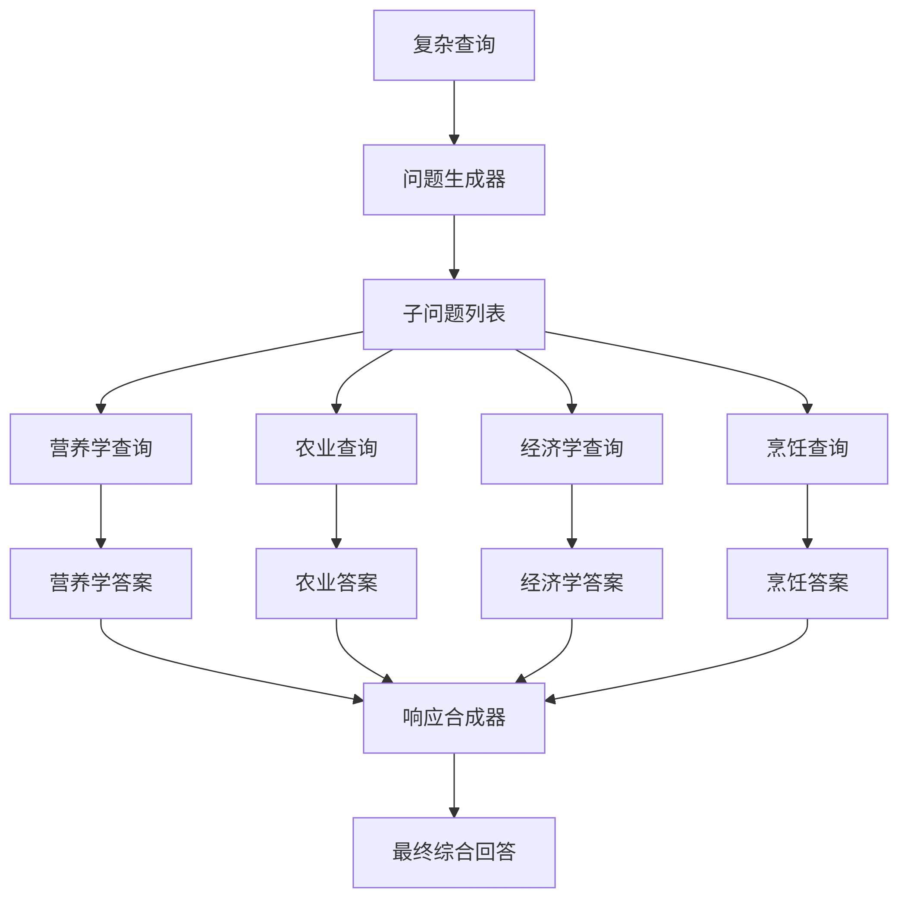

<h3 id='2.怎么使用假设答案（预检索）优化RAG？'>2.怎么使用假设答案（预检索）优化RAG？</h3>

- 在查询时，先生成一个假设答案，而不是直接进行检索。可以解决问题和文档内容不匹配的问题。

```bash 
from llama_index.core.indices.query.query_transform import HyDEQueryTransform
from llama_index.core.query_engine import TransformQueryEngine
from IPython.display import Markdown, display

# 1. 创建基础向量索引
# 从文档集合构建标准向量索引
index = VectorStoreIndex.from_documents(documents)

# 2. 创建基础查询引擎
# 使用标准检索方法
query_engine = index.as_query_engine()

# 3. 创建HyDE查询转换器
# HyDE = Hypothetical Document Embeddings (假设性文档嵌入)
hyde = HyDEQueryTransform(include_original=True)

# 参数说明：
#   include_original=True: 在最终查询中包含原始查询和生成的假设文档

# 4. 创建HyDE增强的查询引擎
# 将基础查询引擎与HyDE转换器结合
hyde_query_engine = TransformQueryEngine(
    query_engine,  # 基础查询引擎
    hyde          # HyDE转换器
)

# 5. 执行HyDE增强查询
query_str = "量子纠缠的实际应用有哪些？"
response = hyde_query_engine.query(query_str)

# 6. 在Jupyter中以Markdown格式显示结果
display(Markdown(f"<b>{response}</b>"))

# 7. 单独分析HyDE转换过程
#  使用LLM根据原始查询生成一个假设性的文档（即一个假设的答案）,将原始查询和生成的假设文档封装成一个QueryBundle对象。
query_bundle = hyde(query_str)

# 8. 提取生成的假设文档
# embedding_strs[0] 包含LLM生成的假设性答案
hyde_doc = query_bundle.embedding_strs[0]
```

- include_original=False


- include_original=True

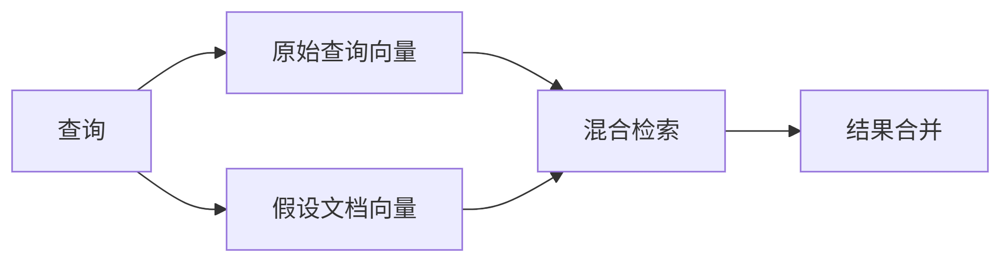

<h3 id='3.还有哪些其他预检索技术优化RAG？'>3.还有哪些其他预检索技术优化RAG？</h3>

#### 1.提示词的优化和改写

- 提示词优化：https://docs.llamaindex.ai/en/stable/examples/prompts/advanced_prompts/

- 提示词改写：https://arxiv.org/pdf/2305.14283

#### 2.假设问题（Inverse HyDE）

- 在查询时，先生成一个假设问题，而不是直接进行检索。可以解决已知答案和文档内容不匹配的问题。

```bash
def inverse_hyde(document):
    # 使用LLM生成可能查询该文档的问题
    hypothetical_query = llm.predict(f"""
        给定以下文档，生成用户可能提出的3个问题：
        文档：{document}
        可能的问题：
        1.
    """)
    
    # 返回生成的查询
    return hypothetical_query
```

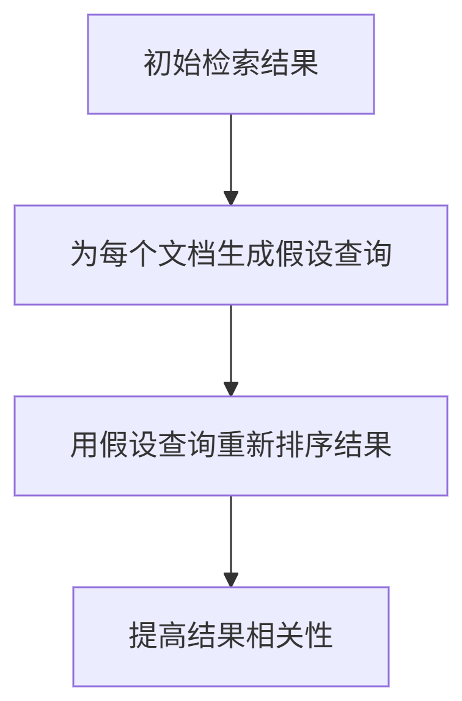


<h3 id='4.RAG之查询重写的策略介绍'>4.RAG之查询重写的策略介绍</h3>

### 查询重写的策略

- 假设文档嵌入 (HyDE) ：通过创建虚拟文档来使查询和文档的语义空间保持一致。

- 重写-检索-阅读：提出了一种全新的框架，它颠覆了传统的检索-阅读顺序，将重点放在查询重写上。

- 回溯提示 (Step-Back Prompting)： 允许大语言模型 (LLM) 基于- 高层概念进行抽象推理和检索。

- Query2Doc： 利用来自大语言模型 (LLM) 的少量提示生成伪文档，并将这些伪文档与原始查询合并，构建新的查询。

- ITER-RETGEN：提出了一种迭代式检索生成方法。它将前一次生成的结果与之前的查询相结合，然后检索相关文档并生成新的结果。这个过程会重复多次，直到最终得到理想的结果。

<h3 id='5.什么是基于提示词的自适应（主动）检索？'>5.什么是基于提示词的自适应（主动）检索？</h3>

随着 RAG（检索增强生成）技术的不断发展，其核心的检索模式正逐渐从被动检索演进为自适应检索（Adaptive Retrieval），也称为主动检索（Active Retrieval）。根据判断标准可分为**基于提示词的方法**和**基于微调的方法**。

基于提示词的方法是指使用提示工程来控制流程以指导大模型。

典型案例：[前瞻式主动检索增强生成，FLARE](https://arxiv.org/abs/2305.06983)

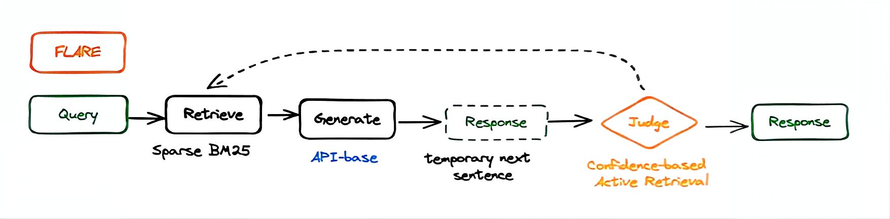

FLARE有两种检索查询方法：直接使用生成句子作为查询的方法(FLARE direct和)基于检索指令的方法(FLAREInstruct)

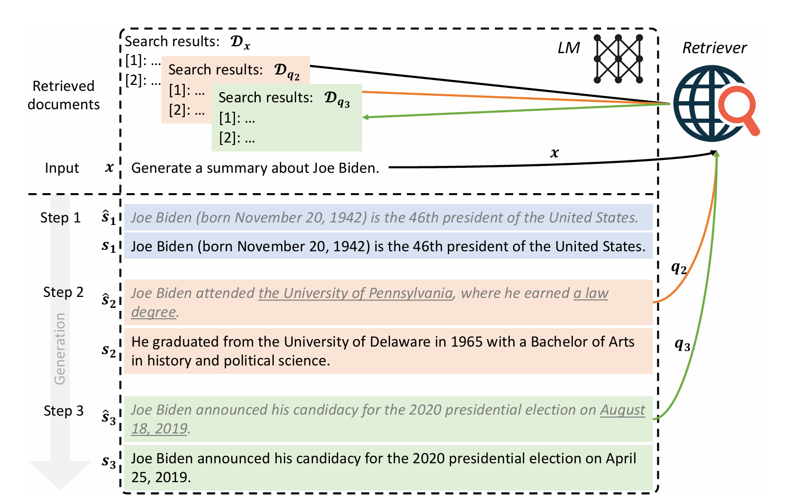

#### 1. FLARE instruct的选代生成过程

FLARE_INSTRUCT 是一种通过指令来引导大型语言模型（LM）在文本生成过程中主动地、动态地发出检索请求的方法。其核心思想是：教导模型在需要外部知识时，自动生成一个特殊的搜索指令（例如 [Search(query)]），系统接收到这个指令后便暂停生成，转而去检索相关信息，然后将检索到的文档提供给模型以继续生成更准确的内容。


- 指令提示（Instruction Prompting）：通过精心设计的少样本提示（few-shot prompt），教导模型在生成答案时，如果遇到知识盲区，就输出一个特定的搜索指令格式（如 [Search(“搜索词”)]）。

- 生成与中断：模型开始生成回答。当它意识到需要更多信息时，它不会“胡编乱造”，而是生成一个搜索指令（例如：“乔·拜登毕业于 [Search(“Joe Biden university”)]”）。
系统一旦检测到 [Search(...)] 标签，便会立即中断模型的生成过程。

- 执行检索：系统提取出括号内的搜索词（如 “Joe Biden university”），并将其发送给检索器（如 BM25 或 Bing 搜索引擎）以获取相关文档。

- 继续生成：检索到的文档被插入到模型的上下文窗口中。然后，模型从中断处继续生成，但此时它已经拥有了更相关、更准确的外部知识，因此能生成事实性更强的文本。

- 循环：这个过程可以重复多次，模型可以在生成的不同阶段多次调用 [Search] 指令，从而实现真正的交互式、主动的检索增强生成。

#### 1. FLARE direct的选代生成过程

先迭代生成临时的下一句，将其用作查询以检索相关文档，如果这些文档包含概率较低的token，就会重新生成下一句，直到达到整体生成的结束。

以第二句话为例子，通过大模型判断出宾夕法尼亚大学和法律学位的概率较低，因此通过掩码进行隐式查询（橙色）和通过问题生成进行明确查询（绿色）来优化生成的结果。

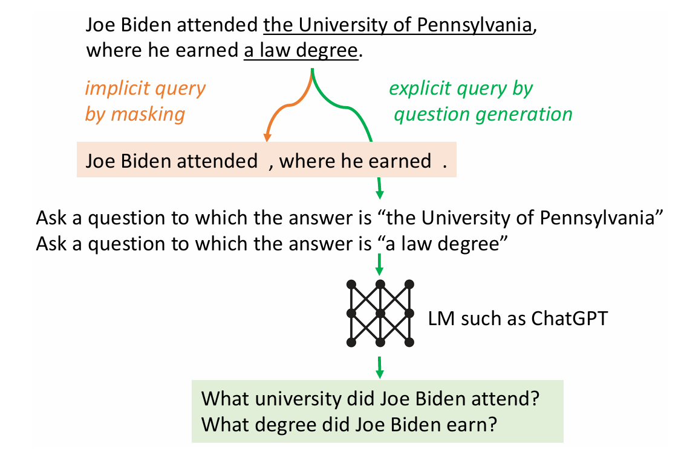

- 隐式查询：屏蔽概率低的词汇，选用剩下部分进行检索查询

- 生成问题查询：让大语言模型生成问题，然后使用这些问题从数据库中提取相关数据。

<h2 id="3.2 检索过程优化"> 3.2 检索过程优化 </h2>

<h3 id='1.怎么使用多种切分方式和并行查询？'>1.怎么使用多种切分方式和并行查询？</h3>

- 向量检索中chunk的大小对相似度结果产生较大影响。当chunk过小时，没有上下文信息，导致匹配不精确；当chunk过大时，chunk信息多，导致检索存在噪音。

#### 1.[多chunk索引和查询](https://docs.llamaindex.ai/en/stable/examples/retrievers/ensemble_retrieval/)

```bash
# 初始化大型语言模型（LLM）
llm = OpenAI(model="gpt-4")

# 定义要尝试的不同分块大小
# 这些值代表每个文本块包含的token数量
chunk_sizes = [128, 256, 512, 1024]

# 准备存储不同分块结果的容器
nodes_list = []      # 存储不同分块大小的节点列表
vector_indices = []  # 存储不同分块大小构建的向量索引

# 遍历所有分块大小进行实验
for chunk_size in chunk_sizes:
    print(f"Chunk Size: {chunk_size}")  # 打印当前处理的分块大小
    
    # 创建句子分割器（SentenceSplitter）
    # 使用当前循环的分块大小作为参数
    splitter = SentenceSplitter(chunk_size=chunk_size)
    
    # 将文档分割成指定大小的文本块节点
    nodes = splitter.get_nodes_from_documents(docs)
    
    # 在节点元数据中添加当前分块大小信息
    # 用于后续分析不同分块大小的效果
    for node in nodes:
        # 添加分块大小到元数据
        node.metadata["chunk_size"] = chunk_size
        
        # 配置元数据排除规则：
        # 在嵌入过程中排除"chunk_size"元数据（不参与向量计算）
        node.excluded_embed_metadata_keys = ["chunk_size"]
        
        # 在LLM处理过程中排除"chunk_size"元数据（不影响生成结果）
        node.excluded_llm_metadata_keys = ["chunk_size"]
    
    # 将当前分块大小的节点列表保存到总列表中
    nodes_list.append(nodes)
    
    # 使用当前分块大小的节点构建向量索引
    vector_index = VectorStoreIndex(nodes)
    
    # 将构建的索引添加到索引列表
    vector_indices.append(vector_index)
```

#### 2.[并行优化](https://docs.llamaindex.ai/en/stable/examples/retrievers/ensemble_retrieval/)

- 并行嵌入

```bash
# 并行embedding
from llama_index.core import Document
from llama_index.embeddings.openai import OpenAIEmbedding
from llama_index.core.node_parser import SentenceSplitter
from llama_index.core.extractors import TitleExtractor
from llama_index.core.ingestion import IngestionPipeline

# 创建文档处理流水线
pipeline = IngestionPipeline(
    transformations=[
        # 1. 文本分割转换：将文档分割成1024字符的块，块间重叠20字符
        SentenceSplitter(chunk_size=1024, chunk_overlap=20),
        
        # 2. 标题提取转换：为每个文本块生成描述性标题
        TitleExtractor(),
        
        # 3. 嵌入生成转换：使用OpenAI模型生成文本嵌入向量
        OpenAIEmbedding(),
    ]
)

# 禁用缓存（用于性能测试场景）
# 原因：缓存会干扰性能测量的准确性
pipeline.disable_cache = True

# 执行流水线处理
# 参数：
#   documents: 待处理的文档集合
#   num_workers=4: 使用4个线程并行处理
nodes = pipeline.run(documents=documents, num_workers=4)
```

- 并行查询

```bash
import asyncio
from llama_index.core.query_engine import BaseQueryEngine

async def parallel_queries(query_engine: BaseQueryEngine, queries: list):
    """执行并行查询"""
    tasks = []
    for query in queries:
        # 创建异步查询任务
        task = query_engine.aquery(query)
        tasks.append(task)
    
    # 并行执行所有查询
    results = await asyncio.gather(*tasks)
    return results

# 使用示例
queries = [
    "量子计算的基本原理是什么？",
    "解释Transformer架构",
    "气候变化对农业的影响"
]

# 获取查询引擎(index是已经构建好的向量索引)
query_engine = index.as_query_engine()

# 执行并行查询
results = asyncio.run(parallel_queries(query_engine, queries))

# 处理结果
for i, response in enumerate(results):
    print(f"查询 {i+1}: {queries[i]}")
    print(f"答案: {response.response}\n")
```

<h3 id='2.怎么让检索过程更加准确？'>2.怎么让检索过程更加准确？</h3>

- 检索阶段的目标是确定最相关的上下文。通常检索基于向量搜索，通过计算查询与索引数据之间的语义相似性。大多数检索优化技术都围绕嵌入模型展开。

- 微调Embedding

某些术语或词语在通用领域可能相关性较低，但在该行业中却可能具有显著相关性，因此可以对 Embedding 模型在特定行业或领域进行微调。Llamaindex微调：https://github.com/run-llama/finetune-embedding/tree/main ；

- 动态Embedding

动态嵌入会根据单词的上下文进行调整，同一个单词可依据周围词语生成不同的嵌入向量；而静态嵌入则为每个单词分配单一向量。例如，OpenAI 的 embeddings:ada-02 就是一款复杂的动态嵌入模型，具备强大的上下文理解能力。

除了向量搜索，还有其他检索技术，比如混合搜索 —— 通常指将向量搜索与关键词搜索相结合的技术。如果你的检索需求中包含精确的关键词匹配，这种混合搜索技术就尤为适用。

<h3 id='3.什么是RAG的迭代检索？'>3.什么是RAG的迭代检索？</h3>

当单一的检索与生成效果不佳时，可采用RAG的迭代检索方法。该方法会借助上一轮生成的结果作为新上下文进行再次检索，以获取更精准的知识。此过程会循环执行直至生成效果达标或者达到迭代上限。

典型案例：[ITER-RETGEN](https://arxiv.org/abs/2305.15294)


迭代循环：对于给定的问题$q$和检索语料库$D$，连续执行$T$次检索生成迭代。在每次迭代$t$中，我们首先使用上一次选代的生成$y_t$，将其与$q$组合，并检索语料库$D$中最匹配的前$k$个段落。接下来，我们提示LLM生成输出$y_{t+1}$。

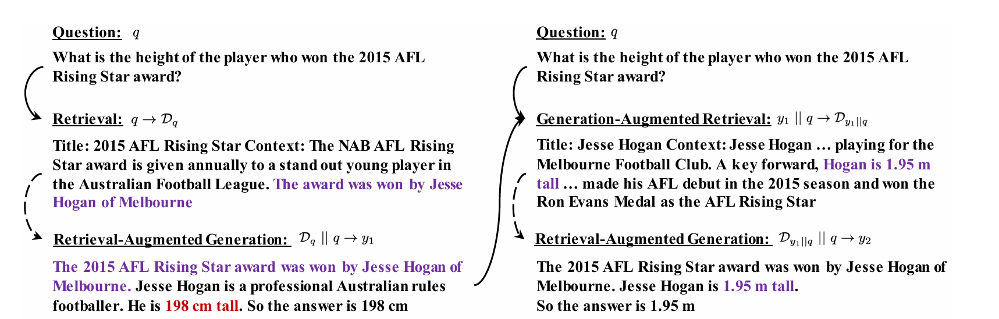

<h3 id='4.什么是RAG的递归检索？'>4.什么是RAG的递归检索？</h3>

递归检索体现为“查询转换”技术，能够将一个模糊的用户查询逐步重写为更明确、更易检索的表述。该技术的终止条件通常设置为最大深度。这种方法对于处理需要多跳推理或多层次解析的复杂问题尤为有效。

递归检索与迭代检索的关键区别在于，它显式地依赖上一步的结果来深化检索过程，其核心操作是迭代地“改写查询”和“扩展查询”。

典型案例：[澄清树，TOC](https://arxiv.org/abs/2310.14696)

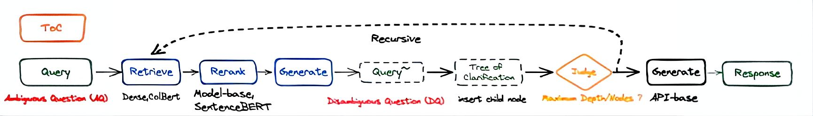

递归循环：TOC（澄清树）方法始于一个初始的模糊问题，通过递归执行RAC来构建一个树形结构。每次递归调用都会在树中插入一个子节点，该节点包含一个“澄清问题-答案”对。每当扩展新的子节点时，系统都会利用新增的上下文信息对当前查询进行文档重排序，以优化检索结果。树结构的探索采用广度优先搜索（BFS）策略，以优先扩展覆盖更广泛的解释，该过程会在达到预设的“最大有效节点数”或“最大深度”时终止。最终，TOC会汇总遍历所有有效节点所获得的信息，生成一个全面、详细的长文本答案来最终解决初始的模糊问题。

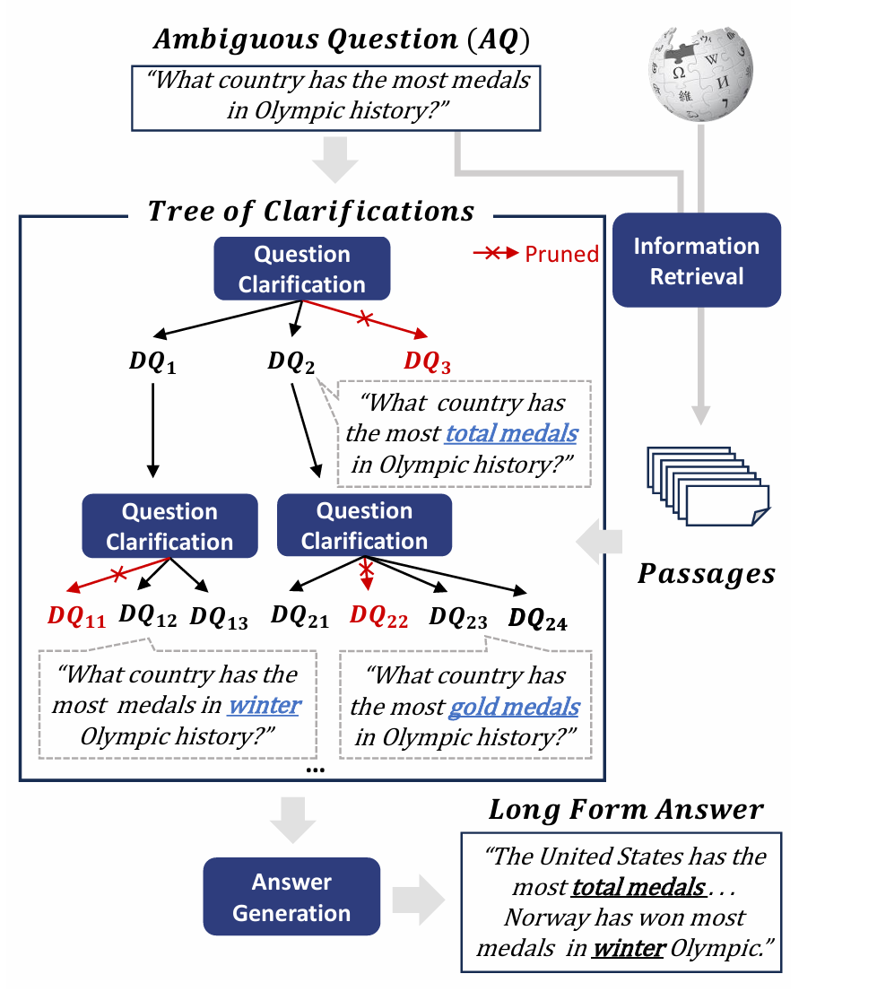


<h3 id='5.怎么使用llama-index实现递归检索？'>5.怎么使用llama-index实现递归检索？</h3>

请注意，LlamaIndex 中的 RecursiveRetriever 其核心机制是基于递归地查找语义相似性来实现查询的深化。这与我们之前讨论的通过“澄清问题-答案对”来构建的澄清树 (Tree of Clarifications, TOC) 方法有本质上的不同。

```bash
# 导入必要的模块
from llama_index.core.retrievers import RecursiveRetriever
from llama_index.core.query_engine import RetrieverQueryEngine
from llama_index.core import get_response_synthesizer

# 创建递归检索器实例
recursive_retriever = RecursiveRetriever(
    "vector",  # 指定基础检索器类型为向量检索
    retriever_dict={"vector": vector_retriever},  # 检索器字典，包含可用的检索器
    query_engine_dict=df_id_query_engine_mapping,  # 查询引擎映射，用于处理特定文档ID的查询
    verbose=True,  # 启用详细输出模式，显示检索过程信息
)

# 创建响应合成器，使用"compact"模式生成紧凑的响应
response_synthesizer = get_response_synthesizer(response_mode="compact")

# 使用递归检索器和响应合成器创建查询引擎
query_engine = RetrieverQueryEngine.from_args(
    recursive_retriever,  # 传入上面创建的递归检索器
    response_synthesizer=response_synthesizer  # 传入响应合成器
)

# 使用查询引擎执行查询
response = query_engine.query(
    "What's the net worth of the second richest billionaire in 2023?") 
```

<h2 id="3.3 后检索优化"> 3.3 后检索优化 </h2>

<h3 id='1.RAG之Re-Ranking机制介绍'>1.RAG之Re-Ranking机制介绍</h3>

### 为什么要用Re-Ranking？

#### 检索阶段的挑战

- 在RAG模型中，检索器负责从大规模的语料库中检索与输入问题相关的文档。然而，由于语料库的广泛性和多样性，检索器可能返回的文档的相关性会有所不同。这种不确定性带来了两个主要挑战：

- 文档相关性差异： 检索器返回的文档可能在相关性上存在差异，有些文档可能与输入问题高度相关，而有些文档可能相关性较低。这种差异性使得直接使用检索器返回的文档进行生成可能会导致结果的不准确或不相关。

- 信息不完整性： 检索器返回的文档通常只是初步筛选，其中可能包含了一些噪音或不相关的信息。这使得生成器在生成结果时面临着信息不完整的挑战，需要进一步处理以提高结果的质量。

因此，为了克服这些挑战，需要引入Re-Ranking机制对检索器返回的文档进行再排序，以确保最终使用的文档具有更高的相关性和质量。

#### 提高生成质量

- Re-Ranking机制不仅可以解决检索阶段的挑战，还可以显著提高生成结果的质量。通过对检索器返回的文档进行再排序，Re-Ranking机制可以使生成器在生成结果时更加准确、相关。

- 具体来说，Re-Ranking机制可以帮助生成器更好地理解和利用检索到的信息，从而生成更加贴近输入问题的文本。它可以过滤掉不相关或噪音信息，强化相关文档的影响，从而提高生成结果的相关性和准确性。这样，Re-Ranking机制不仅可以提高生成结果的质量，还可以增强模型对输入问题的理解能力，使得模型在实际应用中更加可靠和实用。

### 什么是Re-Ranking

Re-Ranking是指在RAG模型中对检索器返回的文档进行再排序的过程。其目的是通过重新排列候选文档，使得生成器更好地利用相关信息，并生成与输入问题更加相关和准确的结果。

在RAG中，Re-Ranking的关键目标是提高生成结果的相关性和质量。通过对检索器返回的文档进行再排序，Re-Ranking可以将与输入问题更加相关的文档排在前面，从而使得生成器在生成结果时能够更加准确地捕捉到输入问题的语境和要求，进而生成更加合适的答案或文本。

### Re-Ranking的步骤

Re-Ranking的过程可以分为以下几个步骤：

- 检索文档： 首先，RAG模型通过检索器从大规模语料库中检索相关文档，这些文档被认为可能包含了与输入问题相关的信息。

- 特征提取： 对检索到的文档进行特征提取，通常会使用各种特征，如语义相关性、词频、TF-IDF值等。这些特征能够帮助模型评估文档与输入问题的相关性。

- 排序文档： 根据提取的特征，对检索到的文档进行排序，将与输入问题最相关的文档排在前面，以便后续生成器使用。

- 重新生成： 排序完成后，生成器将重新使用排在前面的文档进行文本生成，以生成最终的输出结果。

### Re-Ranking的方法

在RAG中，有多种方法可以实现Re-Ranking，包括但不限于：

- 基于特征的Re-Ranking： 根据检索到的文档提取特征，并利用这些特征对文档进行排序，以提高与输入问题相关的文档在排序中的优先级。

- 学习型Re-Ranking： 使用机器学习算法，如支持向量机（SVM）、神经网络等，根据历史数据和标注样本，学习文档与输入问题之间的相关性，并利用学习到的模型对文档进行再排序。

- 混合方法： 将基于特征的方法和学习型方法结合起来，以充分利用特征提取和机器学习的优势，从而更好地实现Re-Ranking的目标。

### Re-Ranking的优化策略

在实际应用中，我们可以采用一些优化策略来进一步提高Re-Ranking的性能和效果：

- 特征优化： 不断优化提取的特征，使其更能反映文档与输入问题的相关性，从而提高Re-Ranking的准确性。

- 模型调优： 如果采用学习型的Re-Ranking方法，可以通过调整模型结构、超参数等来提高模型的性能，使其更好地适应具体的应用场景。

- 多模态融合： 结合文本信息以外的其他模态信息，如图像、视频等，可以提供更多的信息来辅助Re-Ranking，从而提高最终结果的质量。

- 实时调整： 根据实际应用情况，动态调整Re-Ranking策略，以适应不同类型的输入问题和文档。

### 当前Re-Ranking面临的挑战

在实际应用中，Re-Ranking面临一些挑战，限制了其性能和效果，主要包括：

- 计算复杂性： Re-Ranking过程涉及对大规模文档进行排序和评估，计算复杂度较高。尤其是对于大型语料库和实时应用场景，计算资源需求巨大，需要寻找高效的算法和技术来加速处理。

- 可解释性和透明度： Re-Ranking的结果直接影响生成结果的质量，但其内部工作机制通常较为复杂，缺乏可解释性和透明度。这使得难以理解和调试Re-Ranking过程中的问题，也限制了用户对结果的信任度。

-   数据偏差和公平性： Re-Ranking的效果往往受到数据的影响，如果训练数据存在偏差，可能会导致Re-Ranking结果的偏差。此外，Re-Ranking策略可能对不同群体或类别的文档产生不同程度的影响，需要考虑公平性和平衡性的问题。

<h3 id='2.怎么使用Remark技术（后检索）优化RAG？'>2.怎么使用Remark技术（后检索）优化RAG？</h3>

- 在 RAG 系统中，首先通过向量检索或关键词检索快速筛选出一批候选文档。Rerank（重排序） 的作用就是对这批候选文档进行精细化的二次排序，目的是将真正最相关、质量最高、信息量最大的文档提升到排名最前列。

```bash
import torch
from transformers import AutoTokenizer, AutoModelForSequenceClassification

class Reranker:
    def __init__(self, model_name="cross-encoder/ms-marco-MiniLM-L-6-v2"):
        """
        初始化重排序模型
        :param model_name: 预训练模型名称（默认使用MS MARCO微调的MiniLM）
        """
        self.device = torch.device("cuda" if torch.cuda.is_available() else "cpu")
        self.tokenizer = AutoTokenizer.from_pretrained(model_name)
        self.model = AutoModelForSequenceClassification.from_pretrained(model_name).to(self.device)
        self.model.eval()
    
    def rerank(self, query: str, documents: list, top_k: int = 5):
        """
        对文档列表进行重排序
        :param query: 查询文本
        :param documents: 待排序文档列表
        :param top_k: 返回前K个结果
        :return: 排序后的(top_k个文档, 得分)
        """
        # 生成查询-文档对
        pairs = [(query, doc) for doc in documents]
        
        # 批量编码文本
        features = self.tokenizer(
            pairs,
            padding=True,
            truncation=True,
            max_length=512,
            return_tensors="pt"
        ).to(self.device)
        
        # 计算得分
        with torch.no_grad():
            scores = self.model(**features).logits.squeeze(dim=1)
        
        # 转换为概率分数
        scores = torch.sigmoid(scores).cpu().numpy()
        
        # 返回数组元素降序排列时对应的原始索引
        sorted_indices = scores.argsort()[::-1]
        sorted_docs = [documents[i] for i in sorted_indices]
        sorted_scores = [scores[i] for i in sorted_indices]
        
        # 返回top-k结果
        return sorted_docs[:top_k], sorted_scores[:top_k]

# 使用示例
if __name__ == "__main__":
    # 初始化重排序器
    reranker = Reranker()
    
    # 示例数据
    query = "什么是人工智能？"
    documents = [
        "人工智能是计算机科学的一个分支",
        "机器学习是AI的核心技术之一",
        "深度学习推动人工智能发展",
        "自然语言处理是AI的重要应用",
        "AI伦理问题引发广泛讨论",
        "计算机视觉在AI中的应用",
        "人工智能的历史发展概述"
    ]
    
    # 执行重排序
    reranked_docs, scores = reranker.rerank(query, documents, top_k=3)
    
    # 打印结果
    print("原始文档数量:", len(documents))
    print("重排序后Top 3结果:")
    for i, (doc, score) in enumerate(zip(reranked_docs, scores)):
        print(f"\nRank {i+1} (Score: {score:.4f}):")
        print(doc)
```

<h1 id="四、RAG架构与范式"> 四、RAG架构与范式 </h1>

<h2 id="4.1 经典RAG范式"> 4.1 经典RAG范式 </h2>

<h3 id='1.什么是Modular RAG及其框架？'>1.什么是Modular RAG及其框架？</h3>

[Modular RAG](https://arxiv.org/pdf/2407.21059)整合了各种方法来增强功能模块：

1.**增强数掘采集**: RAG已经超越了传统的非结构化数掘，现在可以处理半结构化和结构化数据，以改进检索并减少模型对外部知识源的作赖。

2.**结合技术**:RAG 正在与其他技术相结合，包括使用微调、适配模块和强化学习来加强检索能力，

3.**可适应的检索过程**:检索过程已发展到支持多轮检索增强，使用检索内容来指导生成，反之亦然。

模块化 RAG提供了一种**高可扩展**的范式，将 RAG 系统划分为**Module Type**、**Module **和 **Operator**三层结构，每个** Module Type **代表 RAG 系统中的一个核心流程，包含多个**Module**，而每个功能模块又包含多个具体的 **Operator**，整个RAG 系统就变成了多个模块和对应 Operator 的排列组合，形成了我们所说的 RAGFlow。在Fow 中，每个 Module Type 中可以选择不同的功能模块，而每个功能模块中又可以选择一个或多个 Operator。

在此范式下，当前 RAG体系中的核心技术，涵盖6大ModuleType、14个Module和40+Operator，旨在提供对 RAG 的全面理解Moduar RAG(模块化检秦增现生成)的三层架构是其核心特点之一，提供了一个高度可重构的框架，以适应不同的应用场景和需求，

这三层架构具体包括:

1、**顶层(Module Type)**：顶层关注RAG的关键阶段，每个阶段都被视为一个独立的模块。这一层继承了高级RAG范式的主要流程，并引入了一个编排模块来控制RAG流程的协调，顶层的模块类型包括索引、预检索、检索、后检索、生成和编排，它们代表了RAG系统中的核心流程。

2、**中间层(Modue)**：中间层由每个横块类型内的子模块组成，进一步细化和优化功能，这些子横块负责处理特定的功能或任务，例如索引模块可能包含块优化和结构组织等子模块，而检索模块可能包含检索器选择和检索器微调等子模块。

3、**底层(Operator)**：底层由基本操作单元-操作特构成。操作特指模块内的具体功能实现，是RAG系统中的构建块。例如，索引模块内的操作符可能负责将文档分割成块、优化块的大小和重叠大小、或者为块附加元数据等。


<h3 id='2.经典的RAGFlow范式（Tuning阶段）？'>2.经典的RAGFlow范式（Tuning阶段）？</h3>

主要包括三个模型的微调：Retriever微调，Rerank微调和Generator微调

- **Retriever微调**：在RAG Flow中，对Retriever进行微调，也就是微调embedding模型（代码见后续embedding微调），常用方法：直接微调检索器，构建专门的retriever数据集来微调；LLM监督微调，根据LLM生成的结果对检索器进行微调；LLM Reward RL，利用强化学习将检索器和生成器对齐。
- 
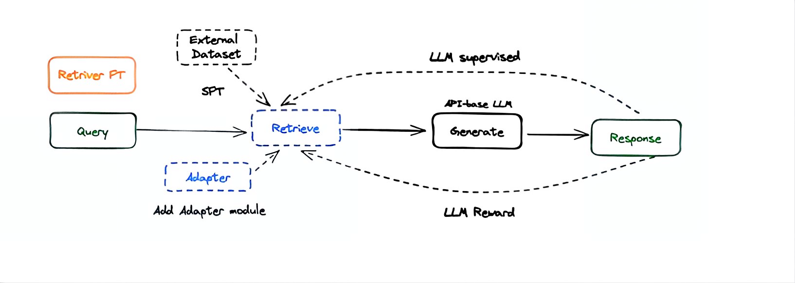

- **Reranker微调**：使用行业数据库来微调Reranker模型，见后续微调代码。

- **Generator微调**：也就是微调LLM，见前述代码。

<h3 id='3.经典的RAGFlow范式（推理阶段-顺序模式）？'>3.经典的RAGFlow范式（推理阶段-顺序模式）？</h3>

RAG Flow的顺序结构将RAG的模块和运算符组织成线性流水线，如果它同时包含Pre-Retrieval和Post-Retrieval模块类型，就是典型的Advanced RAG范式；去掉则为典型的Naive RAG范式

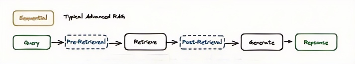

目前使用最广泛的RAG Pipeline是Sequential，常见的包括检索前的Query Rewrite和HyDE以及检索后Rerank。


开源项目： [QAnything](https://github.com/netease-youdao/qanything) ，带自研的embedding模型[bce-embedding-base_v1](https://github.com/netease-youdao/BCEmbedding)和重排序模型[bce-reranker-base_v1](https://github.com/netease-youdao/BCEmbedding)。

性能：随着数据上升，二阶段Rerank性能越突出。


[重写-检索-阅读](https://arxiv.org/pdf/2407.21059)也是典型的顺序结构。查询重写模块是一个较小的可训练语言模型，在强化学习的背景下，重写器的优化被形式化为马尔可夫决策，以LLM的最终输出作为奖励。

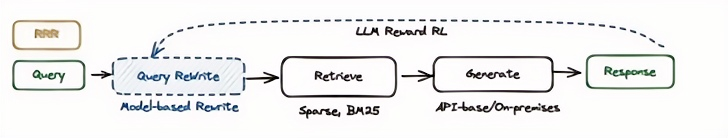

<h3 id='4.经典的RAGFlow范式（推理阶段-条件模式）？'>4.经典的RAGFlow范式（推理阶段-条件模式）？</h3>

采用条件模式的 RAG Flow，通过基于查询关键词或语义确定路线的路由模块，实现根据不同的条件选择不同的 RAG 路径。

- 元数据路由器/过滤器：据块中的关键字和元数据进行筛选，以缩小搜索范围。

- 语义路由器：利用查询的语义信息。

- 也可以采用混合路由方法，将基于语义和元数据的方法相结合，以增查询路由根据问题类型选择不同的路由，针对不同场景引导不同的流程。

例如，当用户查询严肃问题、学习问题或娱乐活题时，对大横型答案的容忍度是不同的。不同的路由分支通常在检索源、检索流程、配置、横型和提示方面有所不同。经典项目：[Semantic-router](https://github.com/aurelio-labs/semantic-router/tree/main)

<h3 id='5.如何通过llamaindex实现条件模式？'>5.如何通过llamaindex实现条件模式？</h3>

```bash
# 定义查询引擎和工具
from llama_index.core.tools import QueryEngineTool

# 创建基于摘要索引的查询引擎，使用树状总结响应模式和异步处理
list_query_engine = summary_index.as_query_engine(
    response_mode="tree_summarize",  # 使用树状结构汇总多个节点的响应
    use_async=True                   # 启用异步处理提高效率
)

# 创建基于向量索引的查询引擎，同样使用树状总结和异步处理
vector_query_engine = vector_index.as_query_engine(
    response_mode="tree_summarize",
    use_async=True
)

# 创建第一个查询引擎工具：列表查询工具
list_tool = QueryEngineTool.from_defaults(
    query_engine=list_query_engine,  # 绑定上面创建的列表查询引擎
    description="Useful for questions asking for a biography of the author.",  # 工具描述：用于获取作者传记类问题
)

# 创建第二个查询引擎工具：向量查询工具
vector_tool = QueryEngineTool.from_defaults(
    query_engine=vector_query_engine,  # 绑定上面创建的向量查询引擎
    description=(
        "Useful for retrieving specific snippets from the author's life, like"
        " his time in college, his time in YC, or more."  # 工具描述：用于检索作者生活片段的具体信息
    ),
)

# 定义路由查询引擎
from llama_index.core import VectorStoreIndex
from llama_index.core.objects import ObjectIndex

# 创建工具对象的向量索引，用于后续的工具检索
obj_index = ObjectIndex.from_objects(
    [list_tool, vector_tool],  # 将两个工具放入索引
    index_cls=VectorStoreIndex,  # 指定使用向量存储索引类型
)

# 创建路由查询引擎，自动选择最合适的工具
from llama_index.core.query_engine import ToolRetrieverRouterQueryEngine
query_engine = ToolRetrieverRouterQueryEngine(
    obj_index.as_retriever()  # 将工具索引转换为检索器，用于根据查询匹配最佳工具
)

# 执行查询示例
response = query_engine.query(
    "What is a biography of the author's life?"  # 询问作者传记的问题
)
print(str(response))  # 打印响应结果
```

<h3 id='6.经典的RAGFlow范式（推理阶段-分支模式）？'>6.经典的RAGFlow范式（推理阶段-分支模式）？</h3>

采用分支模式的 RAG Flow 与条件模式的不同之处在于，它涉及多个并行分支，而不是像条件模式那样从多个选项中选择一个分支。从结构上来说，可分为两类:

- 检索前分支(多查询、并行检索)。将原查询扩展为多个子查询，然后对每个子查询进行单独检索。检索完成后，根据子查询和对应的检索内容立即生成答案；也可以只使用扩展后的检索内容，将其合成统一的文本再生成答案。

- 检索后分支(单个查询，并行生成)。此方法保留原始查询并检索多个文档块。随后，它同时使用原始查询和每个文档块进行生成，最后将生成的结果合并在一起。

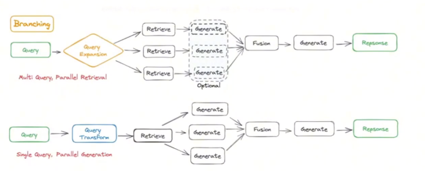


<h2 id="4.2 高级RAG架构"> 4.2 高级RAG架构 </h2>

<h3 id='1.什么是Agentic RAG？它与传统RAG有何不同？'>1.什么是Agentic RAG？它与传统RAG有何不同？</h3>

**Agentic RAG（代理型检索增强生成）** 是一种先进的自然语言处理模型架构，结合了**检索（Retrieval）和生成（Generation）的能力**，并引入了代理机制（Agentic Mechanism），使其具备自主决策、动态适应和多任务处理的能力。Agentic RAG不仅能够根据输入的查询从外部知识库中检索相关信息，还能通过智能代理模块优化检索策略、管理上下文信息，并生成连贯、准确且高度相关的自然语言回答。

与传统RAG相比，Agentic RAG不仅能够检索相关信息并生成回答，还能根据任务需求主动选择和优化检索策略，甚至在多轮交互中调整其行为，以实现更智能和灵活的信息处理。

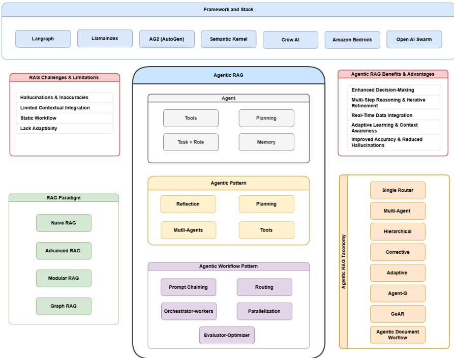

<h3 id='2.Agentic RAG的核心组件有哪些？'>2.Agentic RAG的核心组件有哪些？</h3>

Agentic RAG通常包括以下几个核心组件：

- **检索模块**：负责从外部知识库或文档中检索相关信息。
- **生成模块**：基于检索到的信息生成自然语言回答。
- **代理模块**：具备决策能力，能够根据任务需求动态调整检索策略和生成过程。
- **反馈与学习机制**：通过用户反馈或自动评估不断优化系统性能。

<h3 id='3.在Agentic RAG中，代理模块如何决定检索哪些文档？'>3.在Agentic RAG中，代理模块如何决定检索哪些文档？</h3>

代理模块通常基于以下几个因素决定检索哪些文档：

- **查询理解**：分析用户查询的意图和需求。
- **上下文信息**：考虑之前的交互历史和上下文。
- **检索策略**：应用预定义或动态优化的检索策略，如基于关键词、语义相似度或学习到的模型。
- **资源管理**：评估可用的计算资源和时间限制，选择最优的检索方式。

<h3 id='4.Agentic RAG如何处理检索到的信息以生成高质量的回答？'>4.Agentic RAG如何处理检索到的信息以生成高质量的回答？</h3>

Agentic RAG通过以下步骤处理检索到的信息：

- **信息筛选与排序**：根据相关性和重要性对检索到的文档进行筛选和排序。
- **信息融合**：将多篇文档中的相关信息进行整合，避免冗余和冲突。
- **生成优化**：利用生成模型（如GPT）将整合后的信息转化为连贯、准确的自然语言回答，同时确保信息的完整性和可信度。

<h3 id='5.请解释Agentic RAG中的自主学习机制是如何工作的？'>5.请解释Agentic-RAG中的自主学习机制是如何工作的？</h3>

Agentic RAG的自主学习机制通常包括以下几个步骤：

- **反馈收集**：获取用户对生成回答的反馈，如评分、修正或确认。
- **性能评估**：自动评估系统性能，识别不足之处。
- **模型更新**：利用反馈数据对检索模型、生成模型或代理策略进行微调或优化。
- **策略调整**：根据评估结果动态调整检索和生成策略，以提高未来任务的性能。

<h3 id='6.Agentic RAG在哪些实际应用中具有优势？请举例说明。'>6.Agentic RAG在哪些实际应用中具有优势？请举例说明。</h3>

Agentic RAG在以下应用中具有显著优势：
- **智能客服**：能够理解用户复杂的问题，从多个知识库中检索相关信息，并生成准确、自然的回答。
- **医疗诊断辅助**：检索患者的历史记录和相关医学文献，生成综合诊断建议。
- **法律咨询**：分析法律条文和案例，为用户提供精准的法律意见。
- **教育辅导**：根据学生的学习情况，检索相关学习资料并生成个性化的辅导内容。

<h3 id='7.在多轮对话中，Agentic RAG如何保持上下文一致性和信息连贯性？'>7.在多轮对话中，Agentic-RAG如何保持上下文一致性和信息连贯性？</h3>

Agentic RAG在多轮对话中通过以下方式保持上下文一致性和信息连贯性：

- **上下文跟踪**：维护一个动态的上下文记忆，记录对话历史和关键信息。
- **检索整合**：在每一轮对话中，结合当前查询和历史上下文进行检索，确保信息的连续性。
- **生成优化**：在生成回答时考虑之前的交互内容，确保回答的连贯性和相关性。
- **代理决策**：利用代理模块动态调整检索和生成策略，以适应对话的发展和变化。

<h3 id='8.Agentic-RAG面临的主要挑战有哪些？如何应对这些挑战？'>8.Agentic-RAG面临的主要挑战有哪些？如何应对这些挑战？</h3>

主要挑战包括：
- **检索效率**：在大规模数据中快速准确地检索相关信息。
  - 应对：采用高效的索引结构和检索算法，如近似最近邻搜索（ANN）。
- **信息质量**：确保检索到的信息准确、相关且最新。
  - 应对：引入信息筛选和验证机制，定期更新知识库。
- **生成准确性**：生成内容需高度准确且与检索信息一致。
  - 应对：优化生成模型，结合检索到的信息进行细粒度控制。
- **系统复杂性**：集成多个模块导致系统复杂，难以维护和扩展。
  - 应对：采用模块化设计，使用标准化接口和自动化工具。

<h3 id='9.如何评估Agentic RAG系统的性能？有哪些关键指标？'>9.如何评估Agentic RAG系统的性能？有哪些关键指标？</h3>

评估Agentic RAG系统的性能可以采用以下关键指标：
- **检索准确率**：检索到的文档与用户需求的相关性。
- **生成质量**：生成回答的流畅性、准确性和相关性，常用指标如BLEU、ROUGE、BERTScore。
- **用户满意度**：通过用户反馈评分或满意度调查评估系统表现。
- **响应时间**：系统处理查询和生成回答的速度。
- **鲁棒性**：系统在处理复杂或模糊查询时的表现。
- **自适应能力**：系统在动态环境和多轮对话中的适应性和稳定性。

<h3 id='10.在设计Agentic-RAG时，如何平衡检索与生成模块的权重？'>10.在设计Agentic-RAG时，如何平衡检索与生成模块的权重？</h3>

平衡检索与生成模块的权重可以通过以下方法实现：
- **联合训练**：同时优化检索和生成模块，使两者相互促进，提升整体性能。
- **反馈循环**：利用生成模块的输出作为检索模块的反馈，动态调整检索策略。
- **权重调节**：根据任务需求和应用场景，动态调整检索和生成模块的决策权重。
- **模块化设计**：保持检索和生成模块的独立性，通过中间层（如代理模块）进行协调和优化。
- **实验验证**：通过大量实验和评估，找到最佳的权重组合，以满足不同应用场景的需求。

<h2 id="4.3 特定技术实现"> 4.3 特定技术实现 </h2>
<h3 id='1.怎么通过llamaindex实现FLAREdirect？'>1.怎么通过llamaindex实现FLAREdirect？</h3>

```bash
# 导入必要的模块
from llama_index.llms import OpenAI  # 导入OpenAI LLM封装
from llama_index.query_engine import FLAREInstructQueryEngine  # 导入FLARE增强查询引擎
from llama_index import (
    VectorStoreIndex,  # 向量存储索引
    SimpleDirectoryReader,  # 简单目录文档读取器
    ServiceContext,  # 服务上下文配置
)

# 该查询引擎通过让生成器LLM在检索过程中扮演更主动的角色，提示其生成检索指令来明确需要哪些信息以回答用户查询

# 从指定目录加载文档数据
documents = SimpleDirectoryReader("./data/XXX").load_data()

# 创建向量存储索引
index = VectorStoreIndex.from_documents(documents)

# 创建基础查询引擎，设置相似性搜索返回前2个结果
index_query_engine = index.as_query_engine(similarity_top_k=2)

# 配置服务上下文，指定使用OpenAI的GPT-4模型
service_context = ServiceContext.from_defaults(llm=OpenAI(model="gpt-4"))

# 初始化FLARE增强查询引擎
flare_query_engine = FLAREInstructQueryEngine(
    query_engine=index_query_engine,  # 基础查询引擎
    service_context=service_context,  # 服务上下文（含LLM配置）
    max_iterations=7,  # 设置最大迭代检索次数为7次
    verbose=True,  # 启用详细输出模式
)

# 使用增强的RAG系统进行查询
response = flare_query_engine.query(
    "Can you tell me about the author's trajectory in the startup world?")
```

<h3 id='2.怎么通过langchain实现FLAREdirect？'>2.怎么通过langchain实现FLAREdirect？</h3>

```bash
# 导入必要的库和模块
from langchain import PromptTemplate, LLMChain  # 提示模板和LLM链
from langchain.text_splitter import RecursiveCharacterTextSplitter  # 递归字符文本分割器
from langchain.chains import RetrievalQA  # 检索增强问答链
from langchain.embeddings import HuggingFaceBgeEmbeddings  # HuggingFace BGE嵌入模型
from langchain.document_loaders import PyPDFLoader  # PDF文档加载器
from langchain.vectorstores import LanceDB  # LanceDB向量存储
from langchain.document_loaders import ArxivLoader  # ArXiv学术论文加载器
from langchain.chains import FlareChain  # FLARE链（主动检索增强生成）
from langchain.prompts import PromptTemplate  # 提示模板
from langchain.chains import LLMChain  # LLM链
import os  # 操作系统接口
import gradio as gr  # 用于创建Web UI的Gradio库
import lancedb  # LanceDB向量数据库
from io import BytesIO  # 字节流处理
from langchain.llms import OpenAI  # OpenAI语言模型
import getpass  # 安全输入密码

# 设置OpenAI API密钥）
os.environ["OPENAI_API_KEY"] = "sk-yourapikeyforopenai"
llm = OpenAI()  # 初始化OpenAI LLM

# 配置HuggingFace BGE嵌入模型
model_name = "BAAI/bge-large-en"  # 模型名称
model_kwargs = {'device': 'cpu'}  # 使用CPU进行计算
encode_kwargs = {'normalize_embeddings': False}  # 不标准化嵌入向量
embeddings = HuggingFaceBgeEmbeddings(
    model_name=model_name,
    model_kwargs=model_kwargs,
    encode_kwargs=encode_kwargs
)

# 从ArXiv加载论文（示例使用FLARE论文）
# 注意：需要传递论文ID而非URL，例如2305.06983
docs = ArxivLoader(query="2305.06983", load_max_docs=2).load()

# 实例化递归字符文本分割器
text_splitter = RecursiveCharacterTextSplitter(
    chunk_size=1500,  # 块大小
    chunk_overlap=150  # 块重叠大小
)

# 将文档分割成块
doc_chunks = text_splitter.split_documents(docs)

# 初始化LanceDB向量数据库
db = lancedb.connect('/tmp/lancedb')  # 连接到本地LanceDB

# 创建表并插入初始数据
table = db.create_table("documentsai", data=[
    {"vector": embeddings.embed_query("Hello World"), "text": "Hello World", "id": "1"}
], mode="overwrite")  # 覆盖模式

# 将文档块存入向量数据库
vector_store = LanceDB.from_documents(doc_chunks, embeddings, connection=table)

# 创建检索器
vector_store_retriever = vector_store.as_retriever()

# 初始化FLARE链
flare = FlareChain.from_llm(
    llm=llm,  # 使用的语言模型
    retriever=vector_store_retriever,  # 检索器
    max_generation_len=300,  # 最大生成长度
    min_prob=0.45  # 置信度阈值，低于此概率的标记将被视为不确定并触发检索
)

# 定义生成FLARE输出的函数
def generate_flare_output(input_text):
    output = flare.run(input_text)  # 运行FLARE链处理输入
    return output

# 创建Gradio输入组件
input = gr.Text(
    label="Prompt",
    show_label=False,
    max_lines=1,
    placeholder="Enter your prompt",
    container=False,
)

# 创建Gradio界面
iface = gr.Interface(
    fn=generate_flare_output,  # 处理函数
    inputs=input,  # 输入组件
    outputs="text",  # 输出类型
    title="My AI bot",  # 界面标题
    description="FLARE implementation with lancedb & bge embedding.",  # 描述
    allow_screenshot=False,  # 不允许截图
    allow_flagging=False  # 不显示标记按钮
)

# 启动Gradio应用
iface.launch(debug=True)
```

<h1 id="五、RAG开发框架与工具"> 五、RAG开发框架与工具 </h1>

<h2 id="5.1 LangChain框架"> 5.1 LangChain框架 </h2>

<h3 id='1.怎么用langchain构建简单RAG？'>1.怎么用langchain构建简单RAG？</h3>

本次简要尝试选用[Langchain](https://python.langchain.com/v0.2/docs/introduction/)和[Chroma](https://www.trychroma.com/)构建一个简单的RAG。Langchain负责整体流程编排，chroma提供向量数据库。

#### 1.环境准备

```bash
# 安装chroma，轻量并且原生支持windows，不需要wsl和docker
pip install chromadb # 安装
chroma run # 运行

# 虚拟环境
conda create -n llmrag python=3.10

# 激活虚拟环境
conda activate llmrag

# torch安装
conda install pytorch==2.3.1 torchvision==0.18.1 torchaudio==2.3.1 pytorch-cuda==12.1 -c pytorch -c nvidia

# 安装大模型的依赖
# 使用openai的模型
pip install openai

# 本地ollama
pip install -u langchain_ollama

# 支持 OpenAI 系列模型及兼容 OpenAI API 的第三方模型：通义千问，deepseek之类
pip install -u langchain_openai

# 支持chroma
pip install langchain_chroma
pip install -u langchain-community
```

有关大模型的api获取地址：

- openai：https://platform.openai.com/account/api-keys

- 通义千问：https://help.aliyun.com/zh/model-studio/obtain-api-key-app-id-and-workspace-id

- ollama：直接运行ollama$$ollama run <model_name>$$

#### 2.准备数据

```bash
# 提取数据，以网页数据为例
import request
from langchain.document_loaders import webBaseLoader

loader = webBaseLoader("web url")
document = loader.load()  # Document是一个包含文本和元数据的字典{"page_content": "完整文本内容", "metadata": {"source": "URL", "title": "页面标题"}}

from langchain.text_splitter import RecursiveCharacterTextSplitter

text_splitter = RecursiveCharacterTextSplitter(chunk_size=500, chunk_overlap=50) # chunk_size：每个文本块的最大字符数。 chunk_overlap：相邻文本块之间的重叠字符数。 额外的参数：length_function 长度计算方式，默认为len，可以改为token计数器； separators：分割符列表，["\n\n", "\n", "。", " ", ""]

chunks = text_splitter.split_documents(documents)

print(chunks[0].page_content)  # 打印第一块
```

```bash
# 嵌入并且存储这些文本块
from langchain.embeddings import OpenAIembeddings
from langchain_chroma import chroma
from langchain_community.embeddings import HuggingFaceBgeEmbeddings

# openai
rag_embeddings=OpenAIEmbeddings(model="text-embedding-3-large")

# hugging face上的嵌入模型
rag_embeddings=HuggingFaceBgeEmbeddings("<model_name>")

# 保存到向量数据库
vector_store = chroma.from_documents(documents=chunks, embeddings=rag_embeddings, persist_directory="<db path>")
```

#### 3.检索增强

```bash
# 构建检索器
retriever = vector_store.as_retriever()  # search_type="similarity", search_kwargs={"k": 5}

from langchain.prompts import ChatPromptTemplate

template = "<prompts> question: <question>, context: {context}"

prompt = ChatPromptTemplate.from_template(template)
```

#### 4.输出生成


```bash
from langchain.chat_models import ChatOpenAI
from langgchain.schema.runnable import RunnablePassthrough
from langchain.schema.output_parser import StrOutputParser
from langchain_ollama.llms import ollamaLLM

# 使用ollama服务
llm = OllamaLLM(model="<model_name>")

# 使用api_key
llm = ChatOpenAI(api_key="<api_key>", base_url="<model_url>", model="<model_name>")

# 定义rag链
rag_chain = (
| {"context": retriever, "question": RunnablePassthrough()}
| prompt
| llm
| StrOutputParser())

qury = "<questions>"

resp = rag_chain.invoke(query)
print(resp)
```

<h3 id='2.基于langchain的本地文档问答系统实现步骤有哪些?'>2.基于langchain的本地文档问答系统实现步骤有哪些?</h3>

项目实现过程包括加载文件、读取文本、文本分割、文本向量化、问句向量化、在文本向量中匹配出与问句向量最相似的topk个、匹配出的文本作为上下文和问题一起添加到prompt中、提交给LLM生成回答。

<h3 id='3.介绍一下LangChain'>3.介绍一下LangChain</h3>

💡 [https://python.langchain.com/docs/get_started/introduction](https://python.langchain.com/docs/get_started/introduction)

LangChain 是一个基于语言模型的框架，用于构建聊天机器人、生成式问答（GQA）、摘要等功能。它的核心思想是将不同的组件“链”在一起，以创建更高级的语言模型应用。LangChain 的起源可以追溯到 2022 年 10 月，由创造者 Harrison Chase 在那时提交了第一个版本。与 Bitcoin 不同，Bitcoin 是在 2009 年由一位使用化名 Satoshi Nakamoto 的未知人士创建的，它是一种去中心化的加密货币。而 LangChain 是围绕语言模型构建的框架。

LangChain 包含以下这些核心概念：

StreamlitChatMessageHistory：用于在 Streamlit 应用程序中存储和使用聊天消息历史记录。它使用 Streamlit 会话状态来存储消息，并可以与 ConversationBufferMemory 和链或代理一起使用。

CassandraChatMessageHistory：使用 Apache Cassandra 数据库存储聊天消息历史记录。Cassandra 是一种高度可扩展和高可用的 NoSQL 数据库，适用于存储大量数据。

MongoDBChatMessageHistory：使用 MongoDB 数据库存储聊天消息历史记录。MongoDB 是一种面向文档的 NoSQL 数据库，使用类似 JSON 的文档进行存储。

<h3 id='4.LangChain中Chat-Message-History是什么？'>4.LangChain中Chat-Message-History是什么？</h3>

💡 [https://python.langchain.com/docs/modules/memory/chat_messages/](https://python.langchain.com/docs/modules/memory/chat_messages/)

Chat Message History 是 Langchain 框架中的一个组件，用于存储和管理聊天消息的历史记录。它可以跟踪和保存用户和AI之间的对话，以便在需要时进行检索和分析。

Langchain 提供了不同的 Chat Message History 实现，包括 StreamlitChatMessageHistory、CassandraChatMessageHistory 和 MongoDBChatMessageHistory。

您可以根据自己的需求选择适合的 Chat Message History 实现，并将其集成到 Langchain 框架中，以便记录和管理聊天消息的历史记录。

请注意，Chat Message History 的具体用法和实现细节可以参考 Langchain 的官方文档和示例代码。

<h3 id='5.LangChain中LangChainAgent是什么？'>5.LangChain中LangChainAgent是什么？</h3>

💡 [https://python.langchain.com/docs/modules/agents/](https://python.langchain.com/docs/modules/agents/)

LangChain Agent 是 LangChain 框架中的一个组件，用于创建和管理对话代理。代理是根据当前对话状态确定下一步操作的组件。LangChain 提供了多种创建代理的方法，包括 OpenAI Function Calling、Plan-and-execute Agent、Baby AGI 和 Auto GPT 等。这些方法提供了不同级别的自定义和功能，用于构建代理。

代理可以使用工具包执行特定的任务或操作。工具包是代理使用的一组工具，用于执行特定的功能，如语言处理、数据操作和外部 API 集成。工具可以是自定义构建的，也可以是预定义的，涵盖了广泛的功能。

通过结合代理和工具包，开发人员可以创建强大的对话代理，能够理解用户输入，生成适当的回复，并根据给定的上下文执行各种任务。

以下是使用 LangChain 创建代理的示例代码：

```
from langchain.chat_models import ChatOpenAI
from langchain.agents import tool
# 加载语言模型
llm = ChatOpenAI(temperature=0)
# 定义自定义工具
@tool   def get_word_length(word: str) -> int:
"""返回单词的长度。"""     
return len(word)     
# 创建代理
agent = {       "input": lambda x: x["input"],
"agent_scratchpad": lambda x: format_to_openai_functions(x['intermediate_steps'])   } | prompt | llm_with_tools | OpenAIFunctionsAgentOutputParser()
 # 调用代理
output = agent.invoke({       "input": "单词 educa 中有多少个字母？",       "intermediate_steps": []   })      # 打印结果
print(output.return_values["output"])  
```

这只是一个基本示例，LangChain 中还有更多功能和功能可用于构建和自定义代理和工具包。您可以参考 LangChain 文档以获取更多详细信息和示例。

<h3 id='6.LangChain支持哪些功能？'>6.LangChain支持哪些功能？</h3>

langChain是一个用于开发由大语言模型支持的应用程序的框架。它提供以下功能：

上下文感知能力：LangChain可以将语言模型与上下文源（提示说明、示例场景、响应内容等）连接起来，使应用程序具备上下文感知能力。
推理能力：LangChain依靠语言模型进行推理，例如根据提供的上下文生成回答或执行相应的操作。
LangChain的价值：

组件抽象化：LangChain提供了用于处理语言模型的抽象组件，并提供了一组实现这些组件的现成实现。不论您是否使用LangChain框架的其他部分，这些组件都具有模块化且易于使用的特点。

现成的链式结构：LangChain提供了一系列结构化的组件链，用于完成特定的高级任务。这些现成的链式结构使您能够轻松上手。对于复杂的应用程序，您可以轻松定制现有链或构建新的链。

<h3 id='7.什么是LangChain-model?'>7.什么是LangChain-model?</h3>

LangChain model 是一个基于语言模型的框架，用于构建聊天机器人、生成式问答（GQA）、摘要等功能。LangChain 的核心思想是可以将不同的组件“链”在一起，以创建更高级的语言模型应用。

LangChain model是一种基于大型语言模型（LLM）的模型。它是LangChain框架的核心组件之一，用于构建基于语言模型的应用程序。LangChain模型可以用于聊天机器人、生成式问答、摘要等多种应用。它提供了一种标准的接口，使开发人员能够使用LLM来处理自然语言处理任务。LangChain模型的目标是简化开发过程，使开发人员能够更轻松地构建强大的语言模型应用程序。

<h3 id='8.LangChain如何链接多个组件处理一个特定的下游任务？'>8.LangChain如何链接多个组件处理一个特定的下游任务？</h3>

要链接多个组件处理一个特定的下游任务，您可以使用LangChain框架提供的**Chain类。Chain类允许您将多个组件连接在一起，以便按顺序处理任务。以下是一个示例代码片段，展示了如何使用Chain**类链接多个组件处理下游任务：

```
from langchain.chains import Chain
from langchain.components import Component1, Component2, Component3
# 创建组件实例
 component1 = Component1()
component2 = Component2()
component3 = Component3()
 # 创建Chain实例并添加组件
chain = Chain()
chain.add_component(component1)
chain.add_component(component2)
chain.add_component(component3)
# 处理下游任务
output = chain.process_downstream_task()
print(output)   

```
在上面的代码中，我们首先创建了多个组件的实例，例如**Component1、Component2和Component3。然后，我们创建了一个Chain实例，并使用add_component方法将这些组件添加到链中。最后，我们调用process_downstream_task**方法来处理下游任务，并打印输出结果。

请注意，您可以根据需要添加、删除和修改组件。**Chain**类提供了多种方法来操作链。更多详细信息和示例代码可以在LangChain文档中找到。

<h2 id="5.2 RAGFlow项目"> 5.2 RAGFlow项目 </h2>

<h3 id='1.怎么部署RAGFlow项目？'>1.怎么部署RAGFlow项目？</h3>

#### 1.环境安装

安装WSL文档（windows系统需要）：https://learn.microsoft.com/zh-cn/windows/wsl/install

常见的WSL命令：https://learn.microsoft.com/zh-cn/windows/wsl/basic-commands

（1）以管理权限打开**powershell**

```bash
# Windows10及以上版本
# 启动wsl子系统
dism.exe /online /enable-feature /featurename:Microsoft-Windows-Subsystem-Linux /all /norestart

# 启用虚拟机平台支持
dism.exe /online /enable-feature /featurename:VirtualMachinePlatform /all /norestart

# 设置wsl2wsl 
--set-default-version 2
```

- 手动选择：一般在控制面板->程序->程序和功能->启动或关闭Windows功能->适用于Linux的Windows子系统

（2）安装**docker环境**

- 下载安装路径：https://docs.docker.com/engine/install/

- 设置镜像本地路径：默认会将大模型拉取到本地后会保存在c:盘，我们设置到其它路径（一般在setting->Resources->Advanced->Disk image location）

- 设置镜像源：国外镜像源拉取比较慢，更新成国内镜像源。（一般在setting->Docker engine->registry-mirrors）

- 测试docker是否正常

```bash
# cmd 运行命令
docker run hello-world # 会拉取下来一个测试的hello-world镜像
```

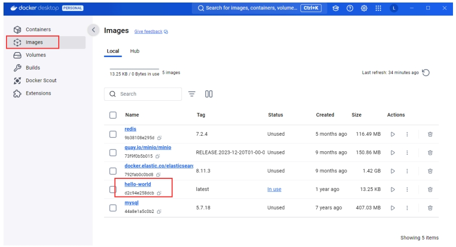

#### 2.部署RAGFlow项目

RAGFlow项目地址：https://github.com/infiniflow/ragflow

（1） 部署命令

```bash
# 拉取项目代码
git clone https://github.com/infiniflow/ragflow.git

# cmd命令行切换到ragflow\docker下
cd ragflow/docker

# 运行下面命令，一键自动下载项目的依赖镜像和环境
docker compose -f docker-compose-CN.yml up -d # 运行该命令会自动下载 RAGFlow 的开发版本 docker 镜像。如果你想下载并运行特定版本的 docker 镜像，请在 docker/.env 文件中找到 RAGFLOW_VERSION 变量，将其改为对应版本。
```

（2） 测试命令

``` bash
# 测试是否部署完成
docker logs -f ragflow-server
```

如果成果会出现以下界面

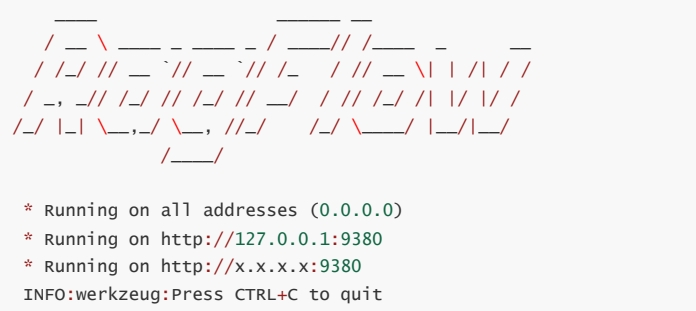

使用以上地址即可登录注册！


<h2 id="2.怎么用RAGFlow建立知识库与聊天？">2.怎么用RAGFlow建立知识库与聊天？</h2>

（1）模型配置

- 启动Ollama模型，选择本地Ollama部署的大语言模型；并得到对应的模型api端口

```bash
ollama run <模型名称>  # 运行模型就可以输入命令
```

```bash
# 默认的模型端口
http://127.0.0.1:11434  # 可以自定义端口，方便api调用

# 如果是docker启动
http://host.docker.internal:11434
```


（2）建立知识库

- 上传**知识库文件**，直至解析成功。

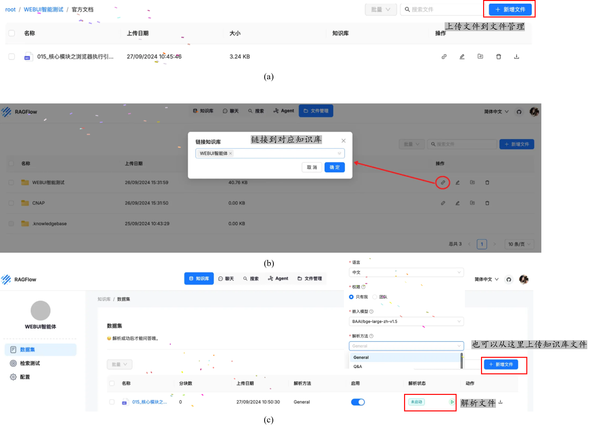

（3）新建聊天助手

- 回到主页面，点击**新建助手**，进行新的聊天配置

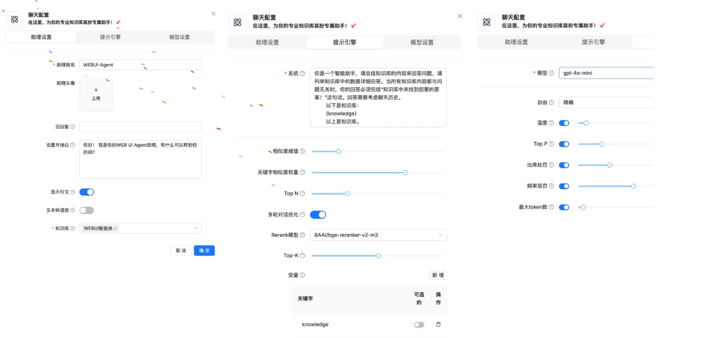

更多的详细讲解请参考[指南](https://www.thoughtailab.com/article/ragflow-project-intro)

<h3 id='2.怎么用RAGFlow建立知识库与聊天？'>2.怎么用RAGFlow建立知识库与聊天？</h3>

（1）模型配置

- 启动Ollama模型，选择本地Ollama部署的大语言模型；并得到对应的模型api端口

```bash
ollama run <模型名称>  # 运行模型就可以输入命令
```

```bash
# 默认的模型端口
http://127.0.0.1:11434  # 可以自定义端口，方便api调用

# 如果是docker启动
http://host.docker.internal:11434
```


（2）建立知识库

- 上传**知识库文件**，直至解析成功。


（3）新建聊天助手

- 回到主页面，点击**新建助手**，进行新的聊天配置


更多的详细讲解请参考[指南](https://www.thoughtailab.com/article/ragflow-project-intro)
