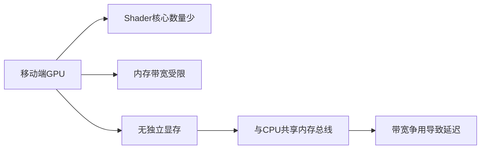
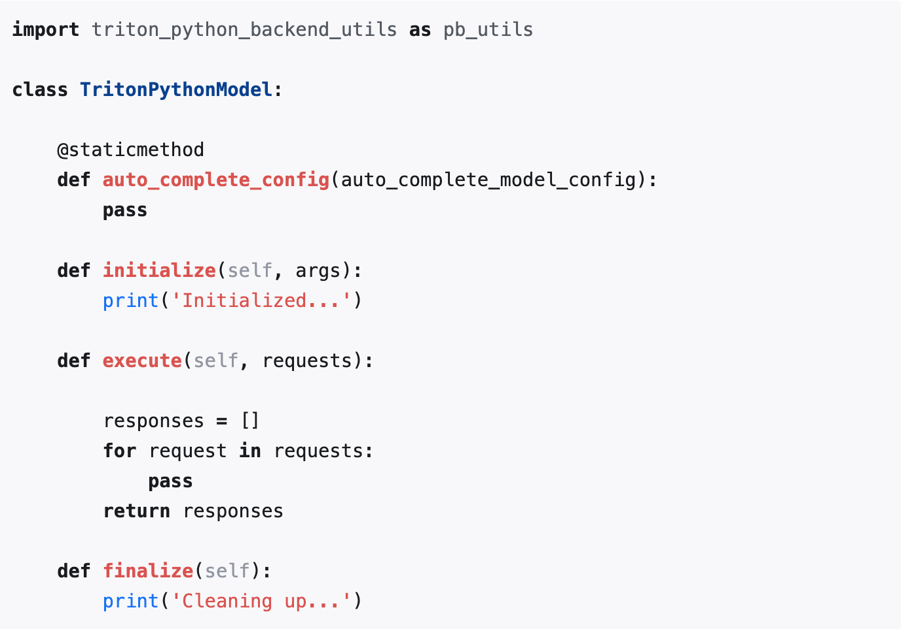

# 目录

## 第一章 推理框架基础知识
- [1.Nvidia相关容器镜像使用](#user-content-1.Nvidia相关容器镜像使用)
- [2.常见推理框架介绍](#user-content-2.常见推理框架介绍)
- [3.PytorchJIT和TorchScript介绍](#user-content-3.PytorchJIT和TorchScript介绍)
- [4.现有的一些移动端开源框架？](#user-content-4.现有的一些移动端开源框架？)
- [5.介绍一下torch、torchvision、CUDA、cuDNN之间的关系](#user-content-5.介绍一下torch、torchvision、CUDA、cuDNN之间的关系)
- [6.有哪些常见的AI模型分布式训练方式？](#user-content-6.有哪些常见的AI模型分布式训练方式？)
- [7.有哪些常见的AI模型分布式推理方式？](#user-content-7.有哪些常见的AI模型分布式推理方式？)
- [8.MACE框架和NCNN框架之间有什么区别？MACE和NCNN各自的加速原理是什么样的？](#user-content-8.MACE框架和NCNN框架之间有什么区别？MACE和NCNN各自的加速原理是什么样的？)
- [9.张量并行、流水线并行、数据并行之间有什么区别？](#user-content-9.张量并行、流水线并行、数据并行之间有什么区别？)
- [10.AI模型使用端侧部署框架进行模型转换后，与原框架结果不一致，这个问题该如何解决？](#user-content-10.AI模型使用端侧部署框架进行模型转换后，与原框架结果不一致，这个问题该如何解决？)
- [11.在AI行业中，一些模型经过端侧部署框架转换格式后，在GPU上为什么比CPU跑得慢？](#user-content-11.在AI行业中，一些模型经过端侧部署框架转换格式后，在GPU上为什么比CPU跑得慢？)

## 第二章 ONNX框架
- [1.ONNX的相关知识](#user-content-1.onnx的相关知识)
- [2.ONNX模型转换及优化](#user-content-2.ONNX模型转换及优化)
- [3.onnxsim的介绍](#user-content-3.onnxsim的介绍)
- [4.如何将ONNX模型从GPU切换到CPU中进行缓存？](#user-content-4.如何将ONNX模型从GPU切换到CPU中进行缓存？)

## 第三章 TensorRT框架
- [1.TensorRT的相关知识](#user-content-1.tensorrt的相关知识)
- [2.TensorRT之trtexec的简单使用介绍](#user-content-2.TensorRT之trtexec的简单使用介绍)
- [3.TensorRT模型转换](#user-content-3.TensorRT模型转换)
- [4.如何构建TensorRT模型的缓存机制？](#user-content-4.如何构建TensorRT模型的缓存机制？)

## 第四章 Triton Inference Server框架
- [1.Triton-Inference-Server推理框架介绍](#user-content-1.Triton-Inference-Server推理框架介绍)
- [2.Triton-Inference-Server自定义推理后端实现python-backend](#user-content-2.Triton-Inference-Server自定义推理后端实现python-backend)

--------------------------------------------------------------------------------------------------------------------

## 第一章 推理框架基础知识

<h2 id="1.Nvidia相关容器镜像使用">1.Nvidia相关容器镜像使用</h2>

通过拉取镜像创建容器，可以免去繁琐的繁琐的环境安装步骤，只需要宿主机上安装Nvidia驱动即可，拉取的镜像中已经配置好cuda，tensorrt，tritonserver等相关需要的环境。以tritonserver为例介绍如何使用镜像，以及介绍triton框架的使用
## 环境搭建
1) 镜像拉取
```sh
docker pull nvcr.io/nvidia/tritonserver:23.01-py3
```
在拉取镜像的时候，需要检查镜像版本和NVIDIA驱动是否匹配，镜像的版本号和驱动版本存在对应关系,参考文档：<https://docs.nvidia.com/deeplearning/triton-inference-server/release-notes/index.html>

2) 启动镜像
```sh
docker run -dt --gpus=all -p 1237:22 --name triton -v /home/xxiao/code:/workspace/code nvcr.io/nvidia/tritonserver:23.01-py3
```
--gpus该参数在下文config中详细讲解
报错解决：

运行docker的时候添加参数：
```sh
--cap-add=SYS_ADMIN --security-opt seccomp=unconfined
```

3) 进去docker镜像后，执行
```sh
tritonserver --model-repository=./model_repository
```
--model-repository：该参数指定模型路径，必须要有
--help：查看其他参数
日志相关：--log-verbose=1 --log-info=true
目录结构如下

triton server会加载该目录下的所有模型，在资源足够的情况下，可以通过一个triton server启动所有的推理服务
config.pbtxt内容如下
```
name: "sam_embedding_onnx"
platform: "onnxruntime_onnx"
max_batch_size : 0
input [
  {
    name: "images"
    data_type: TYPE_FP32
    dims: [ 1, 3, 1024, 1024 ]
  }
]
output [
  {
    name: "image_embeddings"
    data_type: TYPE_FP32
    dims: [ 1, 256, 64, 64 ]
  },
  {
    name: "interm_embeddings"
    data_type: TYPE_FP32
    dims: [ 1, 32, 256, 256 ]
  }
]
instance_group [
    {
      count: 1
      kind: KIND_GPU
      gpus: [1]
    }
  ]
```
各个字段含义
```txt
name：model-repository目录下的模型名称，需要保持一致
platform：推理框架选择，实例选择的是onnx模型，对应的为onnxruntime_onnx
常见平台有以下：
    1、tensorflow_savedmodel: TensorFlow SavedModel 格式。
    2、tensorflow_graphdef: TensorFlow GraphDef 格式。
    3、tensorflow_cc: TensorFlow C++ 库。
    4、pytorch_libtorch: PyTorch 的 LibTorch C++ 库。
    5、onnxruntime_onnx: ONNX 运行时（ONNX Runtime）。
    6、tensorrt_plan: NVIDIA TensorRT 的计划模型（plan file）。
    7、custom: 自定义平台，允许用户自行实现推理后端。
max_batch_size：当定义为0时，动态输入
input：定义模型的输入节点，（目前看来必须满足NCHW和NHWC格式），
    name：输入节点名称
    data_type：根据实际数据精度填写
    dims：输入shape
output：模型输出节点，同输入信息定义
instance_group：设备信息定义
    count：启动实例个数
    kind：设备类型（CPU、GPU，可能NPU）
    gpus：模型运行在那个GPU上。
triton server服务是以多进程的方式运行，--gpus指定了多少块GPU就会启动多少个进程，模型会运行在instance_group/gpus指定的gpu上，若不指定gpu，则在所有的gpu上运行
```
启动triton server服务成功后，会开启三个端口供访问，

8000：HTTPService
8001：GRPCInferenceService
8002：Metrics Service

客户端访问实例：
```python
import numpy as np
import tritonclient.http as httpclient
triton_client = httpclient.InferenceServerClient(url="localhost:8000", verbose=False)
model_name = "sam_embedding_onnx"
inputs = []
inputs.append(httpclient.InferInput('images',[1, 3, 1024, 1024], "FP32"))
inputs[0].set_data_from_numpy(np.random.randn(1, 3, 1024, 1024).astype(np.float32),binary_data=False)

outputs = []
outputs.append(httpclient.InferRequestedOutput('image_embeddings'))
outputs.append(httpclient.InferRequestedOutput('interm_embeddings'))
results = triton_client.infer(model_name,inputs, outputs=outputs)
print(results.as_numpy('interm_embeddings').shape)
print(results.as_numpy('image_embeddings').shape)
```
triton server只负责模型加载和推理，有关具体模型的前后处理，需要在客户端代码中实现
### 参考项目
https://github.com/yuxiaoranyu/stable_diffusion_trt_triton
该项目使用tensorrt和triton部署stable_diffusion 图生图模块


<h2 id="2.常见推理框架介绍">2.常见推理框架介绍</h2>

### onnxruntime
onnxruntime是微软推出的一款推理框架，用户可以非常便利的用其运行一个onnx模型。onnxruntime支持多种运行后端，包括CPU、GPU、TensorRT、DML等。
### TensorRT
TensorRT是一个高性能的深度学习推理优化器，可以为深度学习应用提供低延迟、高吞吐率的模型部署。TensorRT可用于对超大规模数据中心、嵌入式平台或自动驾驶平台进行推理加速。TensorRT现在已经能支持TensorFlow、caffe、mxnet、pytorch等几乎所有的深度学习框架，将TensorRT和Nvidia的GPU结合起来，能在几乎所有的框架中进行快速和高效的部署推理。
### OpenVino
OpenVino是英特尔针对自家硬件平台开发的一套深度学习工具库，包含推理库、模型优化等一些列与深度学习模型部署相关的功能。OpenVino是一个比较成熟且仍在快速发展的推理库，提供的demo和sample都很充足，上手比较容易，可以用来快速部署开发，尤其是Intel的硬件平台上性能超过了大部分的开源库。
### Tengine
Tengine是OPEN AI LAB（开放智能）推理的AI推理框架，致力于解决AIoT应用场景下多厂家多种类的边缘AI芯片与多样的训练框架、算法模型之间的相互兼容适配，同时提升算法在芯片上的运行性能，将从云端完成训练后的算法高效迁移到异构的边缘智能芯片上执行，缩短AI应用开发与部署周期，助力加速AI产业化落地。
### NCNN
NCNN是一个为手机端极致优化的高性能神经网络前向计算框架。NCNN从设计之初深刻考虑手机端的部署和应用。无第三方依赖、跨平台，手机端cpu的速度快于目前所有已知的开源框架。目前已在腾讯多款应用中使用，如QQ、Qzone、微信等。
### MNN
MNN是一个高效、轻量的深度学习框架。它支持深度模型推理与训练，尤其在端侧的推理与训练性能在业界处于领先地位。目前MNN已经在阿里巴巴的手机淘宝、天猫、优酷、钉钉、闲鱼等20多个app中使用，覆盖直播、短视频、搜多推荐、商品图像搜索、互动营销、券已发放、安全风控等70多个场景。
### TFLite
TensorFlowLite是Google在2017年5月推出的轻量级机器学习解决方案，主要针对移动端设备和嵌入式设备。针对移动端设备特点，TensorFlow Lite是用来诸多技术对内核进行了定制优化，预熔激活，量子化内核。

<h2 id="3.PytorchJIT和TorchScript介绍">3.PytorchJIT和TorchScript介绍</h2>

### 简介
PyTorch支持两种模式：eager模式和script模式。eager模式主要用于模型的编写、训练和调试，script模式主要是针对部署的，其包含PytorchJIT和TorchScript  <br>
script模式使用torch.jit.trace和torch.jit.script创建一个PyTorch eager module的中间表示（intermediate representation, IR），IR 经过内部优化，并在运行时使用 PyTorch JIT 编译。PyTorch JIT 编译器使用运行时信息来优化 IR。该 IR 与 Python 运行时是解耦的。
PyTorch JIT（Just-In-Time Compilation）是 PyTorch 中的即时编译器。

它允许你将模型转化为 TorchScript 格式，从而提高模型的性能和部署效率。
JIT 允许你在动态图和静态图之间无缝切换。你可以在 Python 中以动态图的方式构建和调试模型，然后将模型编译为 TorchScript 以进行优化和部署。
JIT 允许你在不同的深度学习框架之间进行模型转换，例如将 PyTorch 模型转换为 ONNX 格式，从而可以在其他框架中运行。
TorchScript 是 PyTorch 提供的一种将模型序列化以便在其他环境中运行的机制。它将 PyTorch 模型编译成一种中间表示形式，可以在没有 Python 解释器的环境中运行。这使得模型可以在 C++ 等其他语言中运行，也可以在嵌入式设备等资源受限的环境中实现高效的推理。


TorchScript 的特性和用途：
1) 静态图表示形式：TorchScript 是一种静态图表示形式，它在模型构建阶段对计算图进行编译和优化，而不是在运行时动态构建。这可以提高模型的执行效率。
2) 模型导出：TorchScript 允许将 PyTorch 模型导出到一个独立的文件中，然后可以在没有 Python 环境的设备上运行。
3) 跨平台部署：TorchScript 允许在不同的深度学习框架之间进行模型转换，例如将 PyTorch 模型转换为 ONNX 格式，从而可以在其他框架中运行。
4) 模型优化和量化：通过 TorchScript，你可以使用各种技术（如量化）对模型进行优化，从而减小模型的内存占用和计算资源消耗。
5) 融合和集成：TorchScript 可以帮助你将多个模型整合到一个整体流程中，从而提高系统的整体性能。
6) 嵌入式设备：对于资源受限的嵌入式设备，TorchScript 可以帮助你优化模型以适应这些环境。

为什么要用script模式呢？

1) 可以脱离python GIL以及python runtime的限制来运行模型，比如通过LibTorch通过C++来运行模型。这样方便了模型部署，例如可以在IoT等平台上运行。例如这个tutorial，使用C++来运行pytorch的model。
2) PyTorch JIT是用于pytorch的优化的JIT编译器，它使用运行时信息来优化 TorchScript modules，可以自动进行层融合、量化、稀疏化等优化。因此，相比pytorch model，TorchScript的性能会更高。
### 使用
```
import torch

# 假设已经存在模型model
# 创建模型输入tensor
input_tensor = torch.rand(1, 3, 640, 640)
jit_model = torch.jit.trace(model, input_tensor)
torch.jit.save(jit_model, "model.pt")
```

<h2 id="4.现有的一些移动端开源框架？">4.现有的一些移动端开源框架？</h2>

1. NCNN，其GitHub地址：https://github.com/Tencent/ncnn
2. Paddle Lite，其GitHub地址：https://github.com/PaddlePaddle/paddle-mobile
3. MACE（ Mobile AI Compute Engine），其GitHub地址：https://github.com/XiaoMi/mace
4. TensorFlow Lite，其官网地址：https://www.tensorflow.org/lite?hl=zh-cn
5. PocketFlow，其GitHub地址：https://github.com/Tencent/PocketFlow
6. 等等。。。


<h2 id="5.介绍一下torch、torchvision、CUDA、cuDNN之间的关系">5.介绍一下torch、torchvision、CUDA、cuDNN之间的关系</h2>

**Torch**、**Torchvision**、**CUDA** 和 **cuDNN** 是在AI领域研发中紧密相关的组件。它们共同作用，尤其是在 **PyTorch** 生态系统中，用于加速神经网络模型的开发与训练。下面是它们之间的详细关系解释：

### 1. **PyTorch（Torch）**
   - **PyTorch** 是一个开源的深度学习框架，简化了神经网络的构建、训练和推理过程。**Torch** 是 PyTorch 的核心模块，它提供了张量操作（类似于 NumPy，但支持 GPU 加速）、自动微分和神经网络模块。
   - PyTorch 支持自动梯度计算，允许在 GPU 上快速进行张量操作和模型训练，这正是通过 CUDA 和 cuDNN 的支持来实现 GPU 加速。

### 2. **Torchvision**
   - **Torchvision** 是 PyTorch 的官方扩展库，专门用于计算机视觉领域。它包含：
     - **数据集加载器**：如 CIFAR-10、ImageNet 等常见的数据集。
     - **预训练模型**：如 ResNet、VGG 等常用的卷积神经网络（CNN），可以直接加载并使用，适合迁移学习。
     - **图像处理工具**：包括图像的增广（如裁剪、翻转、旋转等），便于在训练过程中进行数据增强。
   - **Torchvision** 和 PyTorch 一起使用时，数据加载、图像处理和模型定义的操作可以无缝结合。而 GPU 加速依赖于 PyTorch 内部的 CUDA 调用。

### 3. **CUDA**
   - **CUDA**（Compute Unified Device Architecture）是由 NVIDIA 提供的并行计算平台和 API，它使得开发者可以通过编程，利用 **NVIDIA GPU** 来加速计算密集型任务，特别是在神经网络训练中。
   - 在 **PyTorch** 中，CUDA 提供了 GPU 运算的基础支持。通过 CUDA，PyTorch 可以在 GPU 上进行张量操作、反向传播和其他矩阵运算，从而大大加快神经网络的训练速度。
   - PyTorch 中通过 `tensor.cuda()` 或 `.to('cuda')` 的方式，可以将模型或者张量转移到 GPU 上执行。所有张量运算将利用 CUDA 实现，显著提高性能。

### 4. **cuDNN**
   - **cuDNN**（CUDA Deep Neural Network Library）是 NVIDIA 提供的一个用于加速深度神经网络的 GPU 加速库。它专为神经网络中的常见操作进行了高度优化，特别是卷积运算、池化、归一化和激活函数。
   - **cuDNN 的作用**：在训练深度学习模型时，卷积神经网络的核心操作是卷积，这些操作需要大量的矩阵运算，而 cuDNN 可以大幅优化这些运算的效率。PyTorch 使用 cuDNN 来加速这些关键操作，使得卷积层等计算密集的部分可以快速运行。
   - **cuDNN 与 CUDA 的区别**：CUDA 是一个更通用的 GPU 编程框架，而 cuDNN 是专门为深度学习设计的高效库，依赖 CUDA 进行低级 GPU 操作。CUDA 提供了基本的并行计算支持，cuDNN 则在这个基础上进一步优化了深度学习相关的运算。

### 四者之间的关系：
1. **PyTorch（Torch）**：是深度学习框架，负责张量计算、自动微分和神经网络构建。它是最顶层的框架，使用 CUDA 和 cuDNN 来加速深度学习任务。
2. **Torchvision**：是 PyTorch 的扩展库，专注于计算机视觉，提供了预处理工具、预训练模型和常见数据集。它与 PyTorch 紧密集成，所有操作可以在 PyTorch 的基础上执行，并且同样可以通过 CUDA 和 cuDNN 加速。
3. **CUDA**：用于 GPU 加速，提供了并行计算的能力。PyTorch 通过 CUDA 来实现 GPU 上的张量运算、反向传播等操作。
4. **cuDNN**：专为深度学习设计的高效加速库，针对卷积、池化等操作进行高度优化。PyTorch 使用 cuDNN 来优化卷积网络中的计算。

### 形象理解：
- **PyTorch** 就像是汽车的发动机，负责处理所有的操作（如张量运算、自动微分等），它为深度学习提供了基础的功能。
- **Torchvision** 是给汽车加上的额外组件，如汽车的 GPS、音响系统，它专门用于计算机视觉任务，提供了常用的图像处理工具和模型。
- **CUDA** 是汽车的动力系统（类似汽车的燃油系统），它给 PyTorch 提供了加速的能力，使得计算可以在 GPU 上高效运行。
- **cuDNN** 是汽车的涡轮增压器，特别针对深度学习任务进行优化，进一步提升了计算速度。

### 实际应用中的协同工作：
假设你正在训练一个图像分类的卷积神经网络（CNN）模型，你的典型流程可能如下：
1. 使用 **Torchvision** 从 `CIFAR-10` 数据集中加载训练数据，并对图像进行预处理。
2. 构建一个卷积神经网络模型（例如 ResNet），使用 **PyTorch** 来定义模型结构。
3. 使用 **CUDA** 将模型和训练数据转移到 GPU 上，通过并行计算加速训练。
4. 在训练过程中，模型中的卷积操作由 **cuDNN** 提供优化，使得卷积层的前向传播和反向传播都能快速进行。

### 示例代码

```python
import torch
import torchvision
import torchvision.transforms as transforms
import torch.nn as nn
import torch.optim as optim

# 使用 Torchvision 加载 CIFAR-10 数据集
transform = transforms.Compose([transforms.ToTensor(), transforms.Normalize((0.5,), (0.5,))])
trainset = torchvision.datasets.CIFAR10(root='./data', train=True, download=True, transform=transform)
trainloader = torch.utils.data.DataLoader(trainset, batch_size=64, shuffle=True)

# 构建一个简单的卷积神经网络
class SimpleCNN(nn.Module):
    def __init__(self):
        super(SimpleCNN, self).__init__()
        self.conv1 = nn.Conv2d(3, 16, 3)  # 卷积层
        self.pool = nn.MaxPool2d(2, 2)    # 池化层
        self.fc1 = nn.Linear(16 * 6 * 6, 10)  # 全连接层

    def forward(self, x):
        x = self.pool(torch.relu(self.conv1(x)))
        x = x.view(-1, 16 * 6 * 6)
        x = self.fc1(x)
        return x

# 使用 CUDA 将模型移到 GPU
device = torch.device("cuda" if torch.cuda.is_available() else "cpu")
net = SimpleCNN().to(device)

# 定义损失函数和优化器
criterion = nn.CrossEntropyLoss()
optimizer = optim.SGD(net.parameters(), lr=0.001, momentum=0.9)

# 训练模型
for epoch in range(2):  # 多次循环遍历数据集
    running_loss = 0.0
    for inputs, labels in trainloader:
        inputs, labels = inputs.to(device), labels.to(device)  # 将数据转移到 GPU

        optimizer.zero_grad()
        outputs = net(inputs)
        loss = criterion(outputs, labels)
        loss.backward()  # 反向传播
        optimizer.step()  # 优化

        running_loss += loss.item()
    print(f"Epoch {epoch + 1}, Loss: {running_loss / len(trainloader)}")
```


<h2 id="6.有哪些常见的AI模型分布式训练方式？">6.有哪些常见的AI模型分布式训练方式？</h2>

在AI行业中，不管是AIGC、传统深度学习还是自动驾驶领域，分布式训练都是非常有价值的一种将模型训练任务分配到多个计算节点上，以加速训练过程的方法。分布式训练的主要方式包括 **数据并行（Data Parallelism）**、**模型并行（Model Parallelism）**、**混合并行（Hybrid Parallelism）** 和 **流水线并行（Pipeline Parallelism）** 等。

### 1. 数据并行（Data Parallelism）

**数据并行** 是分布式训练中最常用的方法。数据并行的核心思想是将训练数据分成多个部分，分别交给多个计算设备（如 GPU）进行训练。每个设备独立计算梯度，最后在所有设备之间汇总梯度并更新模型参数。

#### 工作流程
- **数据划分**：训练数据被划分成若干批次，每个设备（如 GPU）负责一个数据子集。
- **并行计算**：每个设备使用相同的模型副本对其分配的数据进行前向和后向传播，独立计算梯度。
- **梯度汇总与更新**：每轮训练后，所有设备上的梯度通过同步或异步方式汇总，并将平均后的梯度应用于全局模型参数的更新。

#### 优点
- **高效**：适合具有大量数据的任务，可以充分利用硬件资源。
- **易实现**：大多数深度学习框架（如 TensorFlow、PyTorch）都提供了数据并行的自动支持。

#### 缺点
- **通信开销**：在每次更新模型参数时，设备间需要交换梯度信息，导致通信开销较大，尤其是在多个设备间传输数据时。
- **GPU显存限制**：模型副本需要在每个设备上加载一份，如果模型非常大，会占用大量显存资源。

### 2. 模型并行（Model Parallelism）

**模型并行** 的核心思想是将模型切分成多个部分，并将这些部分分布在不同设备上训练。模型并行适合处理那些单个 GPU 显存不足以容纳的超大模型。

#### 工作流程
- **模型切分**：将模型分割成不同的模块或层次，比如将前一部分放在一个设备上，后一部分放在另一个设备上。
- **逐层处理**：每个设备只负责计算其所分配的模型部分的前向和后向传播。前向传播的输出会被传递到下一个设备。
- **梯度计算**：在反向传播时，梯度从模型的最后一层往前传播，各设备负责其分配到的模型层梯度计算。

#### 优点
- **适合超大模型**：对于无法在单个设备上加载的模型，可以通过模型分割跨多个设备。
- **减少内存开销**：每个设备仅需存储模型的一个部分，内存占用更少。

#### 缺点
- **同步开销**：设备之间需要频繁交换前向和后向传播的中间结果，这增加了通信成本。
- **较难实现**：需要根据模型结构手动切分，且同步管理复杂。

### 3. 混合并行（Hybrid Parallelism）

**混合并行** 结合了数据并行和模型并行的优点，适合超大规模模型或特别复杂的模型训练。

#### 工作流程
- **模型切分**：先通过模型并行将模型切分成不同的模块，分配到多个设备上。
- **数据并行**：然后在每个模型部分上再应用数据并行，每个设备处理不同的数据批次。
- **同步与更新**：每个模型部分的计算结果进行汇总，汇总后再更新模型参数。

#### 优点
- **适合超大模型和数据集**：可以处理数据量和模型参数量都很大的任务。
- **最大化资源利用率**：同时利用数据并行的效率和模型并行的内存优势。

#### 缺点
- **复杂性**：混合并行的实现难度较高，特别是需要在数据并行和模型并行之间合理协调。
- **通信开销较大**：通信需求复杂，可能导致延迟。

### 4. 流水线并行（Pipeline Parallelism）

**流水线并行** 是一种将模型的不同部分分配到不同设备上并分阶段执行的策略。流水线并行通常结合模型并行，将模型按层或模块切分为不同的“段”，并依次执行不同阶段的前向和后向传播。

#### 工作流程
- **模型分段**：将模型按顺序分成不同的段（如多个层或模块），每个段放在不同的设备上。
- **流水执行**：每个设备按照流水线的方式接收上一个设备的输出并进行前向计算，完成计算后传给下一个设备。
- **梯度回传**：在反向传播时同样分段依次回传梯度，直到最初的设备。

#### 优点
- **适合超大模型**：流水线分段可降低单设备的计算压力。
- **高效利用计算资源**：可减少设备的空闲时间，实现更高效的训练。

#### 缺点
- **复杂性**：模型切分和流水线管理较为复杂。
- **延迟**：由于模型切分和数据依次传递，可能导致训练延迟，尤其是批处理数据较小时效果不佳。

### 5. 参数服务器（Parameter Server）架构

**参数服务器架构** 是一种较为传统的分布式训练架构，通常与数据并行结合使用。参数服务器在分布式系统中充当中央节点，负责存储和更新模型参数，而其他计算节点（工作节点）进行前向和后向传播，并在训练中定期与参数服务器同步参数。

#### 工作流程
- **参数存储**：模型参数存储在参数服务器中，各计算节点从参数服务器获取参数。
- **梯度更新**：每个计算节点计算本地梯度，将结果发送到参数服务器。
- **参数同步**：参数服务器将接收的梯度进行平均或聚合后，更新模型参数并广播给各计算节点。

#### 优点
- **灵活性**：参数服务器架构便于扩展，适合大规模分布式训练。
- **支持异步更新**：可以实现参数异步更新，减少同步时间，提高吞吐量。

#### 缺点
- **服务器压力大**：参数服务器需要承载大量数据同步，容易成为性能瓶颈。
- **参数一致性问题**：异步更新可能导致不同计算节点参数不一致，影响模型的收敛。

### 6. 异步分布式训练（Asynchronous Distributed Training）

在异步分布式训练中，各节点不必等待其他节点完成训练，而是独立进行计算并更新参数。这种方法通常与参数服务器结合使用，减少同步等待时间，提高计算效率。

#### 工作流程
- **独立训练**：各计算节点独立执行前向和后向传播，不等待其他节点完成。
- **异步更新**：各节点在完成训练后，将其梯度发送到参数服务器，服务器根据不同节点传回的梯度异步更新参数。

#### 优点
- **高效**：不需要同步等待，可以提高训练速度。
- **适合异构环境**：适合计算能力不同的设备。

#### 缺点
- **不一致性**：异步更新容易造成参数不一致，可能导致收敛变慢或不稳定。


<h2 id="7.有哪些常见的AI模型分布式推理方式？">7.有哪些常见的AI模型分布式推理方式？</h2>

在AI行业中，不管是AIGC、传统深度学习还是自动驾驶领域，都可以进行**分布式推理**，将模型的推理过程分散到多个计算节点，以满足对处理速度、吞吐量和资源使用效率的需求。

### 1. 数据并行推理（Data Parallel Inference）

**数据并行推理** 是一种将输入数据分批分配到不同的设备上，每个设备独立加载模型并对其分配的数据进行推理的方式。这种方法在批量推理中非常高效，可以显著提高吞吐量。

#### 工作流程
- **数据分批**：将推理数据划分成若干批次，每个设备处理一个数据子集。
- **独立推理**：每个设备都加载完整的模型，并对其分配的数据子集进行推理。
- **结果汇总**：所有设备完成推理后，将结果汇总为完整的输出。

#### 优点
- **高吞吐量**：可以同时处理多个输入数据，适合批量推理。
- **易实现**：每个设备加载相同的模型副本，不需要复杂的模型切分。

#### 缺点
- **资源重复**：每个设备都需要加载整个模型，会占用更多内存资源，尤其对于大型模型。
- **通信开销**：在多机推理时，设备之间的结果汇总会带来一定的通信延迟。

### 2. 模型并行推理（Model Parallel Inference）

**模型并行推理** 适用于单个设备内存不足以加载整个模型的情况。通过将模型切分成多个部分，分布到多个设备上，推理时各设备协同工作完成推理任务。

#### 工作流程
- **模型切分**：将模型按层或模块划分到不同的设备上，每个设备负责模型的一部分。
- **逐层推理**：输入数据通过各设备依次进行前向传播，逐层完成推理。
- **结果收集**：最后一部分的设备得到最终输出结果。

#### 优点
- **适合超大模型**：可以处理单个设备无法容纳的大模型，适合复杂的深度学习模型。
- **减少内存使用**：每个设备只需存储模型的一部分，降低了单个设备的内存负担。

#### 缺点
- **同步延迟**：设备之间需要频繁传递中间结果，导致通信开销。
- **实现复杂**：需要根据模型结构手动划分和同步，管理复杂。

### 3. 混合并行推理（Hybrid Parallel Inference）

**混合并行推理** 是结合数据并行和模型并行的方式，以处理既有大数据量输入、又需要大模型计算的推理任务。通常用于超大规模推理任务。

#### 工作流程
- **模型划分**：使用模型并行将模型分成不同的部分，分布到多个设备上。
- **数据并行**：然后在模型每个部分上应用数据并行，以便不同设备可以处理数据批次。
- **结果同步**：设备之间通过数据并行和模型并行组合计算出结果，并汇总所有设备输出。

#### 优点
- **高扩展性**：适合大规模数据和大模型的场景，结合了数据和模型并行的优点。
- **资源利用率高**：同时利用了数据并行的吞吐量和模型并行的内存节省。

#### 缺点
- **实现难度高**：需要管理数据和模型的多重并行，结构较为复杂。
- **通信开销大**：由于需要设备之间的多次同步和中间结果传递，延迟较高。

### 4. 流水线并行推理（Pipeline Parallel Inference）

**流水线并行推理** 是一种将模型切分为多个阶段，按流水线方式依次处理输入数据的推理方法，适合长时间推理任务或层级非常深的模型（如 Transformer）。

#### 工作流程
- **模型分段**：将模型按层分成多个阶段，每个阶段放在不同的设备上。
- **分段推理**：输入数据从第一阶段开始依次通过每个阶段的推理过程，最终得到输出结果。
- **批量处理**：不同输入数据可以依次进入流水线，使每个设备持续工作，减少等待时间。

#### 优点
- **适合长推理任务**：对于层级较深的模型，流水线并行可以显著减少推理延迟。
- **高效利用资源**：各设备不断处理输入数据，空闲时间少，资源利用率高。

#### 缺点
- **同步延迟**：流水线方式在层与层之间需要同步传递数据，批量较小时效果有限。
- **管理复杂**：需要精细设计流水线结构，确保各设备处理时间接近，避免瓶颈。

### 5. 异构推理（Heterogeneous Inference）

**异构推理** 是利用不同种类的计算资源（如 CPU、GPU、TPU 等）同时执行模型的不同部分或任务。异构推理可最大化利用不同硬件的特点。

#### 工作流程
- **任务划分**：根据计算任务的特点，将模型的不同部分分配给合适的计算资源。例如，将计算密集的部分放在 GPU 上，逻辑控制部分放在 CPU 上。
- **并行执行**：各计算资源并行执行其分配的任务，并通过通信同步数据。
- **结果汇总**：最终汇总各设备的计算结果，得到完整推理输出。

#### 优点
- **硬件高效利用**：充分发挥不同设备的特点，提高整体推理速度。
- **灵活性高**：可以根据任务的不同特点优化资源分配，提高效率。

#### 缺点
- **通信开销**：不同硬件设备之间的通信延迟较高。
- **实现复杂性**：需要考虑不同硬件设备的特性，分配和同步复杂。

### 6. 参数服务器推理（Parameter Server Inference）

**参数服务器推理** 模式适用于需要共享和同步模型参数的场景，尤其在分布式推理系统中较为常用。参数服务器充当中央节点，存储和管理模型参数，多个计算节点同时使用这些参数进行推理。

#### 工作流程
- **参数存储**：模型参数存储在参数服务器上，各计算节点从参数服务器获取参数。
- **分布式推理**：计算节点独立执行推理任务，使用参数服务器提供的共享参数。
- **结果汇总**：各节点计算完成后，将结果返回并汇总，获得完整推理结果。

#### 优点
- **高效共享参数**：对于共享参数的推理任务，参数服务器提供了一个高效的解决方案。
- **适合大规模推理**：支持多个计算节点并行推理，适合大规模推理任务。

#### 缺点
- **通信瓶颈**：参数服务器需要处理多个计算节点的同步请求，可能成为性能瓶颈。
- **实现复杂性**：需要协调各计算节点与参数服务器之间的同步和通信。

<h2 id="8.MACE框架和NCNN框架之间有什么区别？MACE和NCNN各自的加速原理是什么样的？">8.MACE框架和NCNN框架之间有什么区别？MACE和NCNN各自的加速原理是什么样的？</h2>

### **一、核心差异总结**
| **维度**         | **MACE**                                  | **NCNN**                              |
|------------------|---------------------------------------------|-----------------------------------------|
| **设计目标**       | 移动端异构计算（CPU/GPU/DSP协同）               | 移动端CPU高效推理（轻量级+极致优化）           |
| **硬件支持**       | 高通/联发科/松果芯片的CPU/GPU/DSP               | 主攻ARM CPU，支持Vulkan GPU扩展              |
| **模型格式**       | 支持Caffe/TensorFlow/ONNX转换                | 支持Caffe/PyTorch/ONNX转换（需PNNX工具链）    |
| **性能优化**       | Winograd卷积+NEON/OpenCL/HVX指令优化          | 汇编级NEON优化+内存复用+多线程并行             |
| **系统响应**       | 自动拆分OpenCL任务保证UI流畅                   | 无特殊设计，依赖开发者控制任务调度              |
| **模型保护**       | 支持模型转C++代码+常量混淆                     | 无内置加密功能                              |
| **社区生态**       | 小米主导，应用集中在手机端                      | 开源社区活跃，腾讯系App广泛使用                |

### **二、加速原理对比**

#### **1. MACE的加速原理** 
- **异构计算融合**：  
  - **CPU**：ARM NEON指令加速卷积/池化，支持big.LITTLE调度优化能效。  
  - **GPU**：通过OpenCL实现并行计算，针对Adreno/Mali GPU优化内核。  
  - **DSP**：集成高通Hexagon HVX库，加速矩阵运算（如语音识别中的MFCC特征提取）。  
- **算法优化**：  
  - **Winograd卷积**：减少乘法运算量，提升卷积速度30%以上。  
  - **内存依赖分析**：动态复用中间结果内存，降低峰值内存占用50%。  
- **系统级优化**：  
  - **任务分片**：将长时GPU计算拆分为子任务，避免阻塞UI渲染。  

**案例**：在小米手机的人像模式中，MACE同时调用CPU（人脸检测）+ GPU（背景虚化渲染）+ DSP（景深计算），整体延迟降低40%。

#### **2. NCNN的加速原理** 
- **指令级优化**：  
  - **ARM NEON汇编**：手动编写汇编代码优化卷积/全连接层，相比C++实现提速2-3倍。  
  - **内存池技术**：预分配内存并复用，减少动态内存分配开销。  
- **计算图优化**：  
  - **算子融合**：将Conv+BN+ReLU合并为单一算子，减少中间数据传递。  
  - **量化支持**：8-bit整数量化模型，体积缩小4倍，推理速度提升1.5倍。  
- **多线程并行**：  
  - **分块计算**：将大矩阵拆分为子块，利用多核CPU并行处理。  

**案例**：在微信的视频通话背景虚化功能中，NCNN通过NEON优化实时处理1080P视频流，单帧处理时间从15ms降至6ms。

### **三、实际应用场景对比**

#### **1. AIGC领域**
- **MACE应用**：  
  - **移动端Stable Diffusion轻量化**：将图像生成模型部署到手机端，利用DSP加速潜在空间解码，生成512x512图像仅需3秒。  
- **NCNN应用**：  
  - **实时AI滤镜**：在天天P图中，通过量化后的StyleGAN模型实现实时风格迁移，支持10种滤镜并行计算。

#### **2. 传统深度学习**
- **MACE应用**：  
  - **工业质检**：在工厂边缘设备部署ResNet-18，通过Hexagon DSP加速缺陷检测，吞吐量达200帧/秒。  
- **NCNN应用**：  
  - **移动端OCR**：在QQ扫描功能中，使用CRNN+CTC模型识别文字，NEON优化使识别速度提升至30ms/行。

#### **3. 自动驾驶**
- **MACE应用**：  
  - **多传感器融合**：在车载平台中，CPU处理激光雷达点云，GPU渲染BEV地图，延迟控制在50ms内。  
- **NCNN应用**：  
  - **车载障碍物检测**：通过YOLOv9模型+Vulkan加速，在车机端实现60FPS的实时检测。

### **四、选择建议**
- **选MACE**：需跨CPU/GPU/DSP协同、强调功耗控制（如手机端复杂AI任务）。  
- **选NCNN**：追求极致CPU性能、快速部署轻量模型（如移动App嵌入式AI）。    

通过框架特性与场景需求的精准匹配，可最大化AI算法在移动端的落地效率。

<h2 id="9.张量并行、流水线并行、数据并行之间有什么区别？">9.张量并行、流水线并行、数据并行之间有什么区别？</h2>

以下是Rocky对**张量并行（TP）、流水线并行（PP）、数据并行（DP）** 的详细对比解析，结合实际案例与AIGC三大领域应用，帮助大家在面试中清晰阐述：

### **一、核心区别对比**
| **维度**       | **张量并行（TP）**                  | **流水线并行（PP）**                | **数据并行（DP）**                |
|----------------|-----------------------------------|-----------------------------------|----------------------------------|
| **拆分对象**    | **单层模型权重**（如矩阵的行/列）     | **模型层**（按网络深度拆分）        | **训练数据**（分批给不同设备）     |
| **通信开销**    | 高（层内频繁 `all-reduce`）         | 中（层间点对点通信）               | 低（梯度 `all-reduce`）           |
| **显存优化**    | 减少单卡参数存储                    | 减少单卡层数存储                   | 不减少模型显存占用                |
| **适用场景**    | 单层过大（如Attention层）          | 模型层数过多（如百层Transformer）  | 数据量大但模型可单卡容纳           |
| **设备依赖**    | 需同节点（高带宽NVLink）            | 可跨节点（低带宽网络）             | 无限制                           |

### **二、通俗易懂的案例：汽车工厂生产线**
假设训练一个 **12层Transformer模型**（如GPT-2），使用 **4台GPU**：
- **数据并行（DP）**：  
  4个工厂（GPU）**各自复制全套生产线**，分别生产不同车型（数据分片），每天结束同步设计图（梯度聚合）。  
  **问题**：每个工厂需存储12层完整设备（显存不足）。  

- **流水线并行（PP）**：  
  将生产线拆成 **4段**（每GPU负责3层）：  
  `GPU1`（组装车架）→ `GPU2`（安装引擎）→ `GPU3`（装配内饰）→ `GPU4`（喷漆质检）。  
  **问题**：传递半成品时有等待（流水线气泡）。  

- **张量并行（TP）**：  
  单个工序（如安装引擎）由4个工人（GPU）**协作完成**：  
  `工人1` 拧螺丝，`工人2` 装活塞，`工人3` 接线路，`工人4` 测试，最后拼装成完整引擎（`all-reduce`）。  

> **实际组合（PTD-P策略）**：  
> 用 **TP拆解复杂工序**（如引擎安装）+ **PP分段生产线** + **DP复制多条生产线**，最大化效率。

### **三、三大领域应用场景**
#### **1. AIGC领域（大语言模型/文生图）**
- **张量并行（TP）**：  
  - **案例**：训练 **GPT-4 的Attention层**，将 $Q/K/V$ 矩阵拆分到8台GPU，单卡显存需求从 **80GB→10GB**。  
- **流水线并行（PP）**：  
  - **案例**：**Stable Diffusion** 的U-Net包含100+层，按阶段拆到4台GPU（编码器→中间层→解码器）。  
- **数据并行（DP）**：  
  - **案例**：微调 **ChatGPT** 时，复制模型到千卡集群，同时处理百万条对话数据。  

#### **2. 传统深度学习（CV/推荐系统）**
- **张量并行（TP）**：  
  - **案例**：**ViT-Huge** 模型（图像分类）将 $16\times16$ patch 嵌入矩阵拆分到4卡。  
- **流水线并行（PP）**：  
  - **案例**：**ResNet-200** 按残差块拆到2台GPU（Block1-100 → Block101-200）。  
- **数据并行（DP）**：  
  - **案例**：训练 **YouTube推荐模型**，千台GPU并行处理10亿用户行为数据。  

#### **3. 自动驾驶（多模态融合/实时推理）**
- **张量并行（TP）**：  
  - **案例**：**激光雷达点云处理网络** 将3D卷积核拆分到车载多GPU（如NVIDIA Orin芯片组）。  
- **流水线并行（PP）**：  
  - **案例**：**端到端自动驾驶模型**：  
    `GPU1`（摄像头目标检测）→ `GPU2`（多传感器融合）→ `GPU3`（路径规划）。  
- **数据并行（DP）**：  
  - **案例**：仿真测试时，复制模型到100台机器，**并行处理不同交通场景**。  

### **四、面试回答技巧**
#### **1. 核心问题应答模板**  
> “三种并行策略本质是**分布式训练的显存与计算平衡术**：  
> - **TP像‘切蛋糕’**——纵向切割单层计算负载，牺牲通信换显存；  
> - **PP像‘流水线’**——横向拆分模型深度，用气泡换层数扩展；  
> - **DP像‘克隆军团’**——复制模型扩大数据吞吐，适合数据密集型任务。  
> 工业级训练（如GPT-4）需 **组合使用**：TP解决单层显存爆炸，PP扩展层数，DP提升数据量。”  

#### **2. 实战思考题**
> **问题**：若训练 **100层Transformer**（每层10GB显存）需 **100GB显存**，但单卡只有 **40GB**，如何设计并行？  
> **答案**：  
> - **PP拆分层数**：分3段（33+33+34层）→ 单卡显存≈34GB（需3卡）  
> - **TP切割单层**：每层拆到2卡 → 单层显存5GB → 单卡总显存=34层×5GB=170GB（仍超）  
> ⇒ **组合方案**：PP分3段 + 每段TP拆2卡 → 单卡显存=34层×5GB/2=85GB → **仍需激活卸载/梯度检查点**。


<h2 id="10.AI模型使用端侧部署框架进行模型转换后，与原框架结果不一致，这个问题该如何解决？">10.AI模型使用端侧部署框架进行模型转换后，与原框架结果不一致，这个问题该如何解决？</h2>

Rocky认为这是一个在AI部署中非常经典且关键的问题。我们的解决思路需要结合算法、框架、硬件特性进行系统性分析。

**问题核心：** 端侧部署框架进行模型转换后与原框架结果不一致，本质是**计算图执行过程在精度、算子实现或运行时环境上存在差异**。解决的关键在于定位差异源并针对性修复。

### 一、问题本质与影响范围
模型转换后结果不一致（精度下降、NaN值、语义漂移等）是端侧部署的常见挑战，主要由以下因素导致：
1.  **算子支持差异**：端侧框架（如TensorRT Lite、NCNN、MNN、RKNN、MindSpore Lite等）可能未完全实现原框架（PyTorch/TF）的所有算子或参数选项。
2.  **量化引入误差**：为适配端侧算力，模型常需量化（FP32 -> FP16/INT8）。线性量化在表示动态范围大的激活值（如Softmax输出、LayerNorm后）时易产生较大误差。
3.  **硬件计算差异**：
    *   **浮点精度的差异**：不同硬件（CPU/GPU/NPU）对FP16计算规范不一致，累加操作易导致溢出（生成NaN）。
    *   **优化策略的差异**：端侧框架为加速进行的算子融合（如Conv-BN-ReLU）、内存布局转换（NHWC -> NC4HW4）可能改变计算顺序。
4.  **预处理/后处理对齐**：图像Resize、Normalization等操作未与训练时严格一致。
5.  **随机性控制**：Dropout、Sampling操作在转换后若未固定种子，会导致输出波动。

### 二、系统性解决思路：分步定位与修复

1.  **精度对齐验证 (Validation)**：
    *   **固定输入与种子**：使用完全相同且确定的输入数据，固定所有随机源（如Dropout种子、Beam Search种子）。
    *   **逐层输出对比**：
        *   在**原框架**（PyTorch/TF/Caffe）和**端侧框架**分别导出每一层（尤其是激活层、归一化层、输出层）的输出。
        *   计算逐层输出的统计差异（如L1/L2误差、余弦相似度），定位首次出现显著误差的层。

2.  **关键环节排查 (Troubleshooting)**：
    *   **输入/输出对齐**：确保模型输入数据（数值、范围、布局）和输出解码逻辑完全一致。
    *   **量化误差分析**：
        *   对比FP32模型与量化模型（INT8/FP16）的输出。若量化后误差显著，需调整量化策略：
            *   **敏感层保护**：对动态范围大的层（首尾层、注意力层）使用更高精度（FP16）或跳过量化。
            *   **校准数据集优化**：使用更具代表性的校准数据集，避免离群值影响缩放因子。
    *   **算子实现差异**：
        *   检查误差层的算子实现：参数、计算方式、边界条件处理。
        *   查阅端侧框架文档，确认该算子是否有限制或已知精度问题。
    *   **硬件精度问题**：
        *   在出现NaN的设备上，强制关键层使用FP32计算（如设置 `net.opt.use_fp16_storage = false` ）。
        *   检查是否存在累加溢出（常见于大尺寸Feature Map的Reduce操作）。

3.  **工具辅助 (Tooling)**：
    *   **模型可视化工具**（如Netron）：检查转换后的模型结构是否正确，算子参数是否匹配。
    *   **框架Debug工具**（如MindSpore Lite Profiler、TensorRT Inspector）：输出逐层详细结果和性能信息。
    *   **精度分析工具**（如Horizon `QuantAnalysis`）：定位敏感算子。

4.  **工程妥协 (Trade-off)**：
    *   **算子替换/重写**：用一组等价但端侧支持的算子替换原算子。
    *   **自定义插件 (Plugin)**：为端侧框架编写缺失或高精度要求的算子实现。

### 三、实际案例：YOLOv5在RK3588芯片上的重复框问题

*   **现象**：PyTorch训练的YOLOv5模型精度正常。转换为RKNN格式部署到RK3588开发板后，检测结果出现大量重复框或框位置混乱。
*   **分析步骤**：
    1.  **固定输入**：使用同一张测试图片，分别在PyTorch和RKNN模型推理。
    2.  **输出对比**：发现RKNN输出的置信度分数和边界框坐标与PyTorch差异大。
    3.  **逐层排查**：
        *   定位到输出层（`Detect`）前的卷积层输出已出现较大误差。
        *   该层包含Sigmoid激活（用于预测框的tx/ty/conf）。
    4.  **聚焦Sigmoid**：
        *   **问题**：RKNN框架将Sigmoid激活函数在量化时转成了**查表操作 (LUT)**。查表精度不足（尤其在接近0/1的区域）导致输出误差。
        *   **量化误差放大**：Sigmoid输出的小误差被后续计算（如边框解码）放大。
    5.  **硬件限制**：RK3588 NPU对非线性的激活函数支持依赖查表或低精度近似。
*   **解决方案**：
    1.  **敏感层保护**：将包含Sigmoid的层设置为**FP16计算**（避免低精度INT8查表）。
    2.  **自定义LUT调优**：使用更精细的LUT参数表，增加查表点数量提升逼近精度。
    3.  **后处理优化**：在NMS（非极大值抑制）中增加置信度阈值过滤，抑制低质量重复框（临时缓解）。
*   **结果**：FP16保护Sigmoid层后，输出框精度显著提升，重复框消失。

### 四、在三大领域中的应用场景与挑战

| 领域          | 典型场景                          | 不一致性主要挑战                                                                 | 针对性解决方案                                                                                                 |
| :------------ | :-------------------------------- | :------------------------------------------------------------------------------- | :----------------------------------------------------------------------------------------------------------- |
| **AIGC** <br>(文生图/图生图) | Stable Diffusion移动端部署        | 1. **U-Net中大量Attention层**：Softmax输出动态范围极大，量化误差严重。<br>2. **VAE解码器**：输出细节对误差敏感。<br>3. **随机采样**：确定性难保证。 | 1. Attention的Q/K/V矩阵和Softmax使用FP16。<br>2. VAE解码器使用混合精度（首尾FP16，中间INT8）。<br>3. 固定噪声种子+确定性采样算法。 |
| **传统深度学习** <br>(CV/NLP) | 手机端图像分类/OCR识别           | 1. **归一化层**（BatchNorm/GroupNorm）：均值和方差计算差异。<br>2. **轻量化模型本身精度脆弱**（如MobileNet）。 | 1. 使用融合后的BN层（Frozen BN）。<br>2. 采用QAT微调适应量化。<br>3. 关键层（如分类头）保持高精度。             |
| **自动驾驶** <br>(感知/融合) | 车载芯片运行目标检测模型        | 1. **硬件异构**（CPU+GPU+NPU协同），计算一致性难保证。<br>2. **实时性要求极高**，FP32计算受限。<br>3. **安全攸关**，NaN/INF不可接受。 | 1. **端到端全栈优化**（如小鹏端侧VLM）。<br>2. 核心感知模块（如BEVFormer）使用FP16+溢出保护。<br>3. **冗余计算+表决机制**。 |

#### 各领域关键点解析：
1.  **AIGC领域**：
    *   **核心矛盾**：生成质量对高精度（尤其Softmax，Sigmoid）的依赖与端侧算力限制的矛盾。
    *   **解决方案核心**：**分层混合精度** + **确定性控制**。牺牲部分速度换取关键模块精度。
    *   **案例**：移动端Stable Diffusion将Text Encoder和Unet中的Cross-Attention层设为FP16，其他层INT8，在保证图像语义正确性前提下提升速度。

2.  **传统深度学习领域**：
    *   **核心矛盾**：模型轻量化与量化鲁棒性的平衡。
    *   **解决方案核心**：**QAT微调** + **敏感层保护**。利用少量标注数据在目标硬件精度约束下微调，提升鲁棒性。
    *   **案例**：手机银行OCR识别模型，对BiLSTM层和最后的CTC Loss层使用FP16，中间CNN层使用INT8，保证字符识别率。

3.  **自动驾驶领域**：
    *   **核心矛盾**：**安全性、实时性、精度**的“不可能三角”。
    *   **解决方案核心**：
        *   **本地端到端模型**（如小鹏VLM）：避免云端传输延迟和误差，数据不出车保障安全。
        *   **硬件感知的编译优化**：针对特定车载芯片（如Orin， 征程6）深度优化算子库。
        *   **安全监控**：运行时检测NaN/INF，触发降级或冗余计算。
    *   **案例**：BEV感知模型在Orin芯片部署，对BEV空间转换矩阵计算使用FP32，其余CNN部分使用INT8，确保空间坐标精度。

### 五、总结与面试回答建议

*   **核心思路**：强调**系统性排查**（输入->层输出->算子->量化->硬件）和**量化误差的核心地位**。
*   **突出亮点**：
    1.  提到**逐层对比**和**敏感层分析**（如Softmax， LayerNorm）是定位关键。
    2.  强调**QAT**和**混合精度**是解决量化误差的最有效工程手段。
    3.  指出**硬件特性**（如FP16累加溢出）是易忽略点。
    4.  结合**领域特性**（如AIGC关注生成质量， 自动驾驶关注安全）给出针对性方案。

**面试回答示例：**  
解决该问题的关键是**定位差异源**。我会分五步走：
1) 确保输入/输出对齐与固定随机种子；
2) 进行逐层输出对比，定位首次显著误差层；
3) 重点检查该层算子实现、量化配置、硬件计算精度；
4) 针对性修复（如敏感层切FP16、QAT微调、算子替换）；
5) 利用框架工具辅助分析。比如在RK3588部署YOLOv5时，Sigmoid的查表量化误差导致边框混乱，通过切FP16解决。


<h2 id="11.在AI行业中，一些模型经过端侧部署框架转换格式后，在GPU上为什么比CPU跑得慢？">11.在AI行业中，一些模型经过端侧部署框架转换格式后，在GPU上为什么比CPU跑得慢？</h2>

在AI端侧部署中，模型经框架转换后在GPU上运行反而比CPU慢的现象看似反直觉，实则蕴含深刻的硬件-软件协同问题。以下是Rocky针对此问题的系统性解析：

### 五大核心原因及技术机制  
#### 1. **硬件性能瓶颈**  

- **典型案例**：iPhone 7 (PowerVR GT7600) vs iPhone 8 (Apple A11 GPU)  
  - GPU浮点性能：115 GFLOPs → 89 GFLOPs (-22%)  
  - 内存带宽：25.6 GB/s → 19.2 GB/s  
  - 结果：MobileNetV2推理延迟从17ms增至23ms  

#### 2. **算子支持断层**  
```python  
# 典型部署流程中的算子回退  
def run_operator(op, inputs):  
    if op in gpu_supported_ops:  # GPU支持算子  
        return gpu_execute(op, inputs)  
    else:  # 回退CPU执行  
        cpu_inputs = copy_to_host(inputs)  # 显存→内存拷贝  
        outputs = cpu_execute(op, cpu_inputs)  
        return copy_to_device(outputs)  # 内存→显存拷贝  
```  
- **代价模型**：  
  - 单次CPU-GPU拷贝耗时 ≈ 0.5-2ms (1080p图像)  
  - 算子执行时间 < 0.1ms 时，拷贝开销占比超90%  

#### 3. **并行效率陷阱**  
| 模型类型       | 并行度 | GPU加速比 | CPU优势场景        |  
|----------------|--------|-----------|-------------------|  
| ResNet-50      | 高     | 3.8x      | -                 |  
| LSTM序列模型   | 低     | 0.7x      | 短序列推理        |  
| 决策树组合     | 无     | 0.3x      | 分支预测类任务    |  

#### 4. **资源争用问题**  
- **安卓系统GPU调度机制**：  
  ```  
  SurfaceFlinger(UI渲染) ─┬─ 抢占GPU资源  
  CameraPreview          ├─ 共享渲染管线  
  AI推理任务             ─┘  
  ```  
- 后果：推理任务被拆分为多次时间片执行，增加60%尾延迟  

#### 5. **频率墙限制**  
- 移动端GPU动态调频：  
  | 温度阈值 | 频率上限 | 持续时间 |  
  |----------|----------|----------|  
  | <40℃     | 100%     | 30秒     |  
  | 40-45℃   | 80%      | 持续     |  
  | >45℃     | 50%      | 降频保护 |  

### 三大领域应用特例  

#### 1. **AIGC领域：移动端Stable Diffusion**  
- **问题**：  
  - Attention层的Softmax在GPU上产生大量线程同步  
  - 低端GPU线程组规模不足导致并行效率低下  
- **优化方案**：  
  ```c  
  // 优化前：全局Softmax  
  __global__ void softmax(float* input) {  
      __shared__ float sdata[256];  
      // 需要线程块内同步 → 性能瓶颈  

  // 优化后：分块Softmax  
  __device__ void warp_softmax(float* val) {  
      // 基于warp的SIMT同步，减少阻塞  
  ```  
- **效果**：中端手机生成速度从45秒→29秒  

#### 2. **传统深度学习：工厂质检系统**  
- **典型场景**：PCB板缺陷检测  
- **硬件环境**：  
  - 工业边缘设备Jetson Nano  
  - CPU: 4核A57 @1.43GHz  
  - GPU: 128核Maxwell @921MHz  

- **性能悖论**：  
  | 模型            | CPU延迟 | GPU延迟 |  
  |-----------------|---------|---------|  
  | YOLOv5-nano     | 68ms    | 52ms    |  
  | 传统图像处理算法 | 22ms    | 41ms    | ← 因OpenCV算子未GPU优化  

- **破局之道**：  
  - 将传统算法移植到CUDA  
  - 部署混合调度器：  
    ```python  
    class HybridScheduler:  
        def select_backend(self, model):  
            if model.compute_density < 0.5:  # 计算密度阈值  
                return "CPU"  
            return "GPU"  
    ```  

#### 3. **自动驾驶：车载感知系统**  
- **核心挑战**：  
  - 相机/激光雷达多传感器融合  
  - 必须满足100ms端到端延迟  

- **GPU减速案例**：  
  ```  
  传感器数据 → GPU预处理 → 目标检测 → 多模态融合  
          ↑_____________CPU干预___________|  
  ```  
  因激光雷达点云处理含大量条件分支，GPU效率仅CPU的60%  

- **军工级解决方案**：  
  1. **异构计算流水线**：  
     ```mermaid  
     graph LR  
         Camera-->GPU[GPU做图像预处理]  
         Lidar-->CPU[CPU做点云分割]  
         GPU & CPU-->FPGA[融合加速]  
     ```  
  2. **GPU保留模式**：  
     - 锁频至最高性能档位  
     - 独占分配50%显存  

### 面试回答结构化建议  
**回答框架**：  
1. **分层解析原因**：  
   “该问题需从硬件特性、算子支持、资源竞争三个维度分析：  
   - 硬件层面：移动端GPU存在算力带宽双约束  
   - 软件层面：非标准算子触发昂贵内存拷贝  
   - 系统层面：多进程争用导致资源碎片化”  

2. **实例佐证**：  
   “以人脸检测为例，当自定义后处理算子无法在GPU执行时，单次推理增加3ms拷贝开销，这在低端机占比可达40%”  

**终极洞见**：  
“GPU在端侧的性能倒挂本质是**硬件能力与软件栈的错配**。破局关键在于：  
- 算子编译阶段：通过TVM/MNN实现100%算子覆盖  
- 运行时阶段：构建性能预测模型动态选择后端  
- 系统级优化：采用CPU-GPU-NPU协同计算框架”


## 第二章 ONNX框架

<h2 id="1.onnx的相关知识">1.ONNX的相关知识</h2>

ONNX是一种神经网络模型的框架，其最经典的作用是作为不同框架之间的中间件，成为模型表达的一个通用架构，来增加不同框架之间的交互性。
  
<font color=DeepSkyBlue>ONNX的优势</font>：
1. ONNX的模型格式有极佳的细粒度。
2. ONNX是模型表达的一个通用架构，主流框架都可以兼容。
3. ONNX可以实现不同框架之间的互相转化。

<h2 id="2.ONNX模型转换及优化">2.ONNX模型转换及优化</h2>

### 转换
```
import torch

# 假设已经存在模型model
# 创建模型输入tensor
input_tensor = torch.rand(1, 3, 640, 640)
input_names = ["input"]
output_names = ["output"]
# 设置动态shape
dynamic_axes = {'input': {0: 'batch_size'}, 
                'output': {0: 'batch_size'}}
onnx_model = "model.onnx"
torch.onnx.export(model, input_tensor, 'model.onnx', input_names=input_names, output_names=output_names, dynamic_axes=dynamic_axes, opset_version=13)
```
当模型较大时，需要进行一定优化，如stable diffusers中的unet模型
### 优化
```
import onnx
import onnx_graphsurgeon as gs
import torch
from onnx import shape_inference
from polygraphy.backend.onnx.loader import fold_constants
from torch.onnx import export

class Optimizer:
    def __init__(self, onnx_graph, verbose=False):
        self.graph = gs.import_onnx(onnx_graph)
        self.verbose = verbose

    def info(self, prefix):
        if self.verbose:
            print(
                f"{prefix} .. {len(self.graph.nodes)} nodes, {len(self.graph.tensors().keys())} tensors, {len(self.graph.inputs)} inputs, {len(self.graph.outputs)} outputs"
            )

    def cleanup(self, return_onnx=False):
        self.graph.cleanup().toposort()
        if return_onnx:
            return gs.export_onnx(self.graph)

    def select_outputs(self, keep, names=None):
        self.graph.outputs = [self.graph.outputs[o] for o in keep]
        if names:
            for i, name in enumerate(names):
                self.graph.outputs[i].name = name

    def fold_constants(self, return_onnx=False):
        onnx_graph = fold_constants(gs.export_onnx(self.graph), allow_onnxruntime_shape_inference=True)
        self.graph = gs.import_onnx(onnx_graph)
        if return_onnx:
            return onnx_graph

    def infer_shapes(self, return_onnx=False):
        onnx_graph = gs.export_onnx(self.graph)
        if onnx_graph.ByteSize() > 2147483648:
            raise TypeError("ERROR: model size exceeds supported 2GB limit")
        else:
            onnx_graph = shape_inference.infer_shapes(onnx_graph)

        self.graph = gs.import_onnx(onnx_graph)
        if return_onnx:
            return onnx_graph

def optimize(onnx_graph, name, verbose):
    opt = Optimizer(onnx_graph, verbose=verbose)
    opt.info(name + ": original")
    opt.cleanup()
    opt.info(name + ": cleanup")
    opt.fold_constants()
    opt.info(name + ": fold constants")
    opt.infer_shapes()
    opt.info(name + ': shape inference')
    onnx_opt_graph = opt.cleanup(return_onnx=True)
    opt.info(name + ": finished")
    return onnx_opt_graph

model_path = "model.onnx"
shape_inference.infer_shapes_path(model_path, model_path)
model_opt_graph = optimize(onnx.load(model_path), name="model", verbose=True)
```


<h2 id="3.onnxsim的介绍">3.onnxsim的介绍</h2>

### 简介
ONNX-Simplifier（简称onnxsim）是一个开源工具，用于简化ONNX（Open Neural Network Exchange）模型。它通过合并模型中的冗余节点和优化操作来减少模型的大小和复杂性，从而提高模型的执行效率。这个工具是由华为诺亚方舟实验室开发的，并且是作为Python包发布的。

onnxsim的主要功能包括：

1) 节点融合：将多个操作融合为一个操作，减少节点数量，从而减少模型的大小和提高推理速度。
2) 冗余操作消除：移除模型中的冗余操作，如恒等操作或对结果没有影响的操作。
3) 常数折叠：在模型中直接计算可导出为常数的表达式，减少推理时的计算量。
4) 优化形状和类型：优化模型中的张量形状和类型，以减少内存使用和提高效率。
### 使用
```
import onnx
from onnxsim import simplify

# 加载ONNX模型
model_path = 'model.onnx'
onnx_model = onnx.load(model_path)
# 简化模型
model_simplified, check = simplify(onnx_model)
# 检查简化是否成功
assert check, "Simplified ONNX model could not be validated"
# 保存简化后的模型
onnx.save(model_simplified, 'path/to/simplified/model.onnx')
```
命令行使用
```
python -m onnxsim model.onnx model_sim.onnx

```

<h2 id="4.如何将ONNX模型从GPU切换到CPU中进行缓存？">4.如何将ONNX模型从GPU切换到CPU中进行缓存？</h2>

在AI行业中，在算法服务推理运行结束后，将ONNX模型从GPU切换到CPU中进行缓存，是经典的高性能算法服务的一环。 **ONNX Runtime** 中，可以很方便地将模型从 **GPU** 切换到 **CPU** 上。通过 ONNX Runtime 提供的 `providers` 参数或 `set_providers` 方法，可以方便地在 GPU 和 CPU 之间切换模型的运行设备。只需指定 `"CPUExecutionProvider"` 就可以让模型在 CPU 上进行缓存。

### 方法一：在创建 `InferenceSession` 时指定 `CPUExecutionProvider`

ONNX Runtime 的 `InferenceSession` 支持多个计算提供者（Execution Providers），可以通过指定提供者将模型从 GPU 切换到 CPU。只需要在创建 `InferenceSession` 时将 `providers` 参数设置为 `["CPUExecutionProvider"]`，就会强制模型在 CPU 上运行。

```python
import onnxruntime as ort

# 指定使用 CPU 运行
session = ort.InferenceSession("model.onnx", providers=["CPUExecutionProvider"])
```

如果之前在使用 GPU（如 `"CUDAExecutionProvider"`）运行模型，将 `providers` 参数改为 `"CPUExecutionProvider"` 就可以切换到 CPU 上。

### 方法二：通过 `set_providers` 方法动态切换到 CPU

如果已经创建了使用 GPU 的 `InferenceSession`，可以通过 `set_providers` 方法动态切换到 CPU 而不重新加载模型。

```python
# 假设已有一个使用 GPU 的 session
session.set_providers(["CPUExecutionProvider"])
```

这样可以在同一个 `InferenceSession` 上切换到 CPU。

### 方法三：通过 `providers` 属性检查当前的计算提供者

可以使用 `session.get_providers()` 来查看当前可用的计算提供者，并确认是否成功切换到 CPU。

```python
print(session.get_providers())  # 输出当前会话使用的提供者
```

如果输出包含 `"CPUExecutionProvider"`，则表示会话已经在 CPU 上运行。

### 示例：完整流程

```python
import onnxruntime as ort

# 创建一个使用 GPU 的 session
session = ort.InferenceSession("model.onnx", providers=["CUDAExecutionProvider"])

# 进行推理
outputs = session.run(None, {"input_name": input_data})

# 切换到 CPU
session.set_providers(["CPUExecutionProvider"])

# 确认提供者已切换到 CPU
print("Current providers:", session.get_providers())

```


## 第三章 TensorRT框架

<h2 id="1.TensorRT的相关知识">1.TensorRT的相关知识</h2>
  
TensorRT是一个高性能的深度学习前向Inference的优化器和运行的引擎。
  
<font color=DeepSkyBlue>TensorRT的核心</font>：将现有的模型编译成一个engine，类似于C++的编译过程。在编译engine过程中，会为每一层的计算操作找寻最优的算子方法，将模型结构和参数以及相应kernel计算方法都编译成一个二进制engine，因此在部署之后大大加快了推理速度。

我们需要给TensorRT填充模型结构和参数，也就是解析我们自己的模型结构和参数文件，获取数据放到其中。官方给了三种主流框架模型格式的解析器（parser），分别是：ONNX，Caffe以及TensorFlow。
  
<font color=DeepSkyBlue>TensorRT的优势</font>：

1. 把一些网络层进行了合并。具体🌰如下图所示。
2. 取消一些不必要的操作。比如不用专门做concat的操作等。
3. TensorRT会针对不同的硬件都相应的优化，得到优化后的engine。
4. TensorRT支持INT8和FP16的计算，通过在减少计算量和保持精度之间达到一个理想的trade-off。
  


<h2 id="2.TensorRT之trtexec的简单使用介绍">2.TensorRT之trtexec的简单使用介绍</h2>

### 简介
trtexec是一种无需开发自己的应用程序即可快速使用 TensorRT 的工具。trtexec工具有三个主要用途：
1) 它对于在随机或用户提供的输入数据上对网络进行基准测试很有用。
2) 它对于从模型生成序列化引擎很有用。
3) 它对于从构建器生成序列化时序缓存很有用。
### 转换模型（onnx为例）
1) 将ONNX模型转换为静态batchsize的TensorRT模型，启动所有精度以达到最佳性能，工作区大小设置为1024M
```
trtexec --onnx=mnist.onnx --explicitBatch --saveEngine=mnist.trt --workspace=1024 --best
```
2) 将ONNX模型转换为动态batchsize的TensorRT模型，启动所有精度以达到最佳性能，工作区大小设置为1024M
```
trtexec --onnx=mnist.onnx --minShapes=input:<shape_of_min_batch> --optShapes=input:<shape_of_opt_batch> --maxShapes=input:<shape_of_max_batch> --saveEngine=mnist.trt --best --workspace=1024 --best
```
–minShapes，–optShapes ，–maxShapes必须全部设置，设置的形式为：NCHW

### 运行模型
1) 在具有静态输入形状的全维模式下运行 ONNX 模型
```
trtexec --onnx=model.onnx --shapes=input:32x3x224x224
```
2) 使用给定的输入形状在全维模式下运行 ONNX 模型
```
trtexec --onnx=model.onnx --shapes=input:32x3x224x224
```
3) 使用一系列可能的输入形状对 ONNX 模型进行基准测试
```
trtexec --onnx=model.onnx --minShapes=input:1x3x224x224 --optShapes=input:16x3x224x224 --maxShapes=input:32x3x224x224 --shapes=input:5x3x224x224
```
### 网络性能测试
1) 加载转换后的TensorRT模型进行性能测试，指定batch大小
```
trtexec --loadEngine=mnist16.trt --batch=1
```
2) 收集和打印时序跟踪信息
```
trtexec --deploy=data/AlexNet/AlexNet_N2.prototxt --output=prob --exportTimes=trace.json
```
3) 使用多流调整吞吐量<br>调整吞吐量可能需要运行多个并发执行流。例如，当实现的延迟完全在所需阈值内时，我们可以增加吞吐量，即使以一些延迟为代价。例如，为批量大小 1 和 2 保存引擎并假设两者都在 2ms 内执行，延迟阈值：
```
trtexec --deploy=GoogleNet_N2.prototxt --output=prob --batch=1 --saveEngine=g1.trt --int8 --buildOnly
trtexec --deploy=GoogleNet_N2.prototxt --output=prob --batch=2 --saveEngine=g2.trt --int8 --buildOnly
```
保存的引擎可以尝试找到低于 2 ms 的组合批次/流，以最大化吞吐量：
```
trtexec --loadEngine=g1.trt --batch=1 --streams=2
trtexec --loadEngine=g1.trt --batch=1 --streams=3
trtexec --loadEngine=g1.trt --batch=1 --streams=4
trtexec --loadEngine=g2.trt --batch=2 --streams=2
```
### 参考文档
<https://github.com/NVIDIA/TensorRT/tree/main/samples/trtexec>

<h2 id="3.TensorRT模型转换">3.TensorRT模型转换</h2>

假设已经存在onnx模型
```
import sys
import tensorrt as trt

def convert_models(onnx_path: str, output_path: str, fp16: bool = False):

    # 初始化配置
    TRT_LOGGER = trt.Logger(trt.Logger.VERBOSE)
    TRT_BUILDER = trt.Builder(TRT_LOGGER)
    TRT_RUNTIME = trt.Runtime(TRT_LOGGER)
    # 创建一个网络定义，并设置EXPLICIT_BATCH标志以支持批处理大小。
    network = TRT_BUILDER.create_network(
        1 << int(trt.NetworkDefinitionCreationFlag.EXPLICIT_BATCH))
    onnx_parser = trt.OnnxParser(network, TRT_LOGGER)
    print("onnx_path: ", onnx_path)
    parse_success = onnx_parser.parse_from_file(onnx_path)
    for idx in range(onnx_parser.num_errors):
        print(onnx_parser.get_error(idx))
    if not parse_success:
        sys.exit("ONNX model parsing failed")
    print("Load Onnx model done")

    # 获取网络的输入和输出信息
    inputs = [network.get_input(i) for i in range(network.num_inputs)]
    outputs = [network.get_output(i) for i in range(network.num_outputs)]
    for inp in inputs:
        print(f'input "{inp.name}" with shape{inp.shape} {inp.dtype}')
    for out in outputs:
        print(f'output "{out.name}" with shape{out.shape} {out.dtype}')
    # 创建一个优化配置文件profile，并设置输入节点的动态形状范围。
    profile = TRT_BUILDER.create_optimization_profile()

    profile.set_shape("input", (1, 3, 224, 224), (1, 3, 640, 640), (1, 3, 640, 640))
    
    # 创建一个构建器配置config，并将优化配置文件添加到其中。如果需要，还可以设置FP16精度模式。
    config = TRT_BUILDER.create_builder_config()
    config.add_optimization_profile(profile)
    config.set_preview_feature(trt.PreviewFeature.DISABLE_EXTERNAL_TACTIC_SOURCES_FOR_CORE_0805, True)
    if fp16:
        config.set_flag(trt.BuilderFlag.FP16)

    # 构建TensorRT engine，并将其序列化
    plan = TRT_BUILDER.build_serialized_network(network, config)
    if plan is None:
        sys.exit("Failed building engine")
    print("Succeeded building engine")
    # 反序列化engine，并保存
    engine = TRT_RUNTIME.deserialize_cuda_engine(plan)

    # save TRT engine
    with open(output_path, "wb") as f:
        f.write(engine.serialize())

if __name__ == "__main__":
    onnx_path = "model.onnx"
    output_path = "model.plan"
    fp16 = True
    convert_models(onnx_path, output_path, fp16)

```

<h2 id="4.如何构建TensorRT模型的缓存机制？">4.如何构建TensorRT模型的缓存机制？</h2>

在TensorRT架构中，模型运行主要依赖GPU，因此直接支持将整个TensorRT引擎从GPU移动到CPU并非直接内置的功能。但是我们可以通过一些技巧，将TensorRT引擎对象序列化到CPU（或者磁盘），并在需要时反序列化加载到GPU，可以有效管理显存，特别是在多模型推理或资源有限的场景下。这种方法实现了类似“缓存”的机制，能够动态加载模型到GPU，同时释放未使用的GPU资源，从而提高硬件资源的利用效率。

### **1. 基本思路**

TensorRT模型（即引擎）在推理时需要加载到GPU中运行。如果需要将模型“缓存”到CPU，可以通过以下方法：
1. **序列化引擎**：
   - 在推理完成后，将引擎序列化为二进制数据并存储在CPU内存中（甚至可以存储到磁盘）。
2. **反序列化引擎**：
   - 在需要推理时，将二进制数据反序列化为TensorRT引擎，并加载到GPU中执行推理。

这种方法模拟了将模型缓存到CPU的过程，因为TensorRT本身无法直接在CPU上运行。

### **2. 实现步骤**

#### **1. 加载模型并创建TensorRT引擎**
- 首先我们加载ONNX模型或已有的TensorRT引擎，并创建可用于推理的引擎。
  
```python
import tensorrt as trt

# 加载 TensorRT Logger
logger = trt.Logger(trt.Logger.WARNING)

# 创建 TensorRT Builder 和 Network
builder = trt.Builder(logger)
network = builder.create_network(flags=1 << int(trt.NetworkDefinitionCreationFlag.EXPLICIT_BATCH))

# 加载 ONNX 文件
onnx_file = "model.onnx"
with trt.OnnxParser(network, logger) as parser:
    with open(onnx_file, 'rb') as f:
        parser.parse(f.read())

# 构建引擎
config = builder.create_builder_config()
config.max_workspace_size = 1 << 30  # 设置最大工作空间
engine = builder.build_engine(network, config)
```

#### **2. 将引擎序列化到CPU**
- 使用 TensorRT 的序列化功能，将引擎对象保存为二进制数据。

```python
# 序列化引擎
serialized_engine = engine.serialize()

# 将序列化后的引擎保存到 CPU 内存（或者存储到文件）
cached_engine_on_cpu = serialized_engine  # 模拟缓存到 CPU
```

#### **3. 在需要时重新加载引擎到 GPU**
- 使用 TensorRT 的反序列化功能，将缓存的引擎加载回 GPU。

```python
# 反序列化引擎
runtime = trt.Runtime(logger)
engine_from_cpu = runtime.deserialize_cuda_engine(cached_engine_on_cpu)

# 创建执行上下文
context = engine_from_cpu.create_execution_context()
```

#### **4. 推理流程**
- 构造输入和输出张量，并执行推理。

```python
import numpy as np
import pycuda.driver as cuda
import pycuda.autoinit  # 初始化 CUDA 上下文

# 创建输入和输出缓冲区
input_shape = (1, 3, 224, 224)  # 示例输入维度
output_shape = (1, 1000)  # 示例输出维度

# 在 GPU 上分配内存
d_input = cuda.mem_alloc(np.prod(input_shape) * np.float32().nbytes)
d_output = cuda.mem_alloc(np.prod(output_shape) * np.float32().nbytes)

# 创建主机上的输入数据
input_data = np.random.rand(*input_shape).astype(np.float32)
cuda.memcpy_htod(d_input, input_data)

# 执行推理
bindings = [int(d_input), int(d_output)]
context.execute_v2(bindings)

# 从 GPU 拷贝结果到主机
output_data = np.empty(output_shape, dtype=np.float32)
cuda.memcpy_dtoh(output_data, d_output)

print("Inference result:", output_data)
```

### **3. 注意事项**

#### **1. 数据传输开销**
- 序列化和反序列化是额外的开销，因此在高频推理任务中可能导致性能下降。
- 如果模型较大，序列化和反序列化的时间会显著增加。

#### **2. GPU 资源管理**
- 每次加载引擎到 GPU 时，需要确保 GPU 上有足够的显存。
- 在释放 GPU 资源后，可以通过 `cuda.Context.synchronize()` 确保设备状态一致。

#### **3. 磁盘与内存存储选择**
- 如果缓存到 CPU 的模型较大，可以选择将其保存到磁盘（如 `.plan` 文件），并在需要时从磁盘加载。

#### **4. TensorRT 的版本兼容性**
- 序列化的引擎仅在相同的 TensorRT 版本、CUDA 版本和 GPU 硬件架构上兼容。如果环境变化，需要重新生成引擎。


## 第四章 Triton Inference Server框架

<h2 id="1.Triton-Inference-Server推理框架介绍">1.Triton-Inference-Server推理框架介绍</h2>

### 简介
Triton inference Server是 Nvidia 发布的一个高性能推理服务框架，可以帮助开发人员高效轻松地在云端、数据中心或者边缘设备部署高性能推理服务。
Triton inference sever 可以提供 HTTP/GRPC等多种服务协议。同时支持多种推理引擎后端。Server采用 C++ 实现,C++ AP调用推理计算引擎，保障了请求处理的性能表现。
在推理计算方面，Triton 支持多模型并发，动态batdh等功能，能够提高GPU的使用率，改善推理服务的性能。Triton不仅支持单模型部署，也支持多模型集成(ensemble)，可以很好的支持多模型联合推理的场景，构建起视频、图片、语音、文本整个推理服务过程，大人降低多个模型服务的开发和维护成本。

### 特点
- 支持多种框架：Triton 支持几乎所有主流的训练和推理框架，例如： TensorFlow、NVIDIA TensorRT、PyTorch、Python、ONNX、XGBoost、scikit-learn RandomForest、OpenVINO、自定义 C++ 等。
- 高性能模型推理：Triton 支持所有基于 NVIDIA GPU、x86、Arm CPU 和 AWS Inferentia 的推理。 它提供动态batching、并发执行、最佳模型配置、 模型集成（ensemble）和流式音频/视频输入，以最大限度地提高吞吐量和利用率。
- 专为 DevOps 和 MLOps 而设计：Triton 可以与 Kubernetes 集成以进行模型服务编排和扩展，支持导出用于监控的 Prometheus 指标，支持实时模型更新， 并可用于所有主流的公有云 AI 和 Kubernetes 平台。 它还被集成到了许多 MLOps 软件解决方案中。
- 具备企业级的安全性及 API 稳定性：用于生产环境推理的 NVIDIA Triton，通过企业级的安全性和 API 稳定性加速企业走向 AI 的前沿，同时降低开源软件的潜在风险。
- 支持模型集成：由于大多数模型推理需要为单个查询执行具有预处理和后处理的多个模型；因此， Triton 支持模型集成和流水线。 Triton 可以在 CPU 或 GPU 上执行集成（ensemble）的各个部分，并可以在集成（ensemble）中使用多个框架。
- 支持动态批处理（Dynamic batching）：支持将一个或多个推理请求合并成一个批次，以最大化吞吐量
- 支持模型并发推理：支持多个模型或者同一模型的多个实例在同一系统上并行执行
- 支持模型热加载：可以通过API查看所有运行中模型的状态，还可以通过API不影响其他模型的情况下卸载和装载模型。
- 支持模型版本管理：支持模型版本控制，可以随时回滚到之前的版本。

<h2 id="2.Triton-Inference-Server自定义推理后端实现python-backend">2.Triton-Inference-Server自定义推理后端实现python-backend</h2>

Python的custom backend需要实现TritonPythonModel这个类

主要通过实现auto_complete_config、initialize、execute、finalize四个函数来实现主要功能。

**auto_complete_config**
 	这个函数是可以不实现，不执行auto_complete_config将不会调用这个函数。可用来设置模型的max_batch_size， dynamic_batching, input和output属性。该函数在缺失配置文件时使用

**initialize**

加载模型后调用initialize函数，主要作用实在接收到推理请求之前，做一些必要的初始化，根据需求来决定是否需要实现initialize函数。

**execute**

每当发出推理请求时都会调用该函数，每个 Python 模型都必须实现execute函数。在该execute函数中，您将获得一个对象列表InferenceRequest。该功能有两种实现方式。您选择的模式应取决于您的用例。这就是您是否想要从该模型返回解耦的响应。
默认模式是实现模型的最通用方法，并且要求该execute函数为每个请求返回一个响应。这意味着在此模式下，您的函数必须返回与长度相同的对象execute列表 。该模式下的工作流程为：
- execute函数接收一批 pb_utils.InferenceRequest 作为长度 N 的数组。
- 对 pb_utils.InferenceRequest 执行推理并将相应的 pb_utils.InferenceResponse 附加到响应列表中。
- 返回响应列表。
    返回的响应列表的长度必须为N。
    列表中的每个元素应该是请求数组中相应元素的响应。
    每个元素必须包含一个响应（响应可以是输出张量或错误）；
    元素不能为 None。

**finalize**

finalize是可选的。Triton 服务卸载模型之前做必要的清理。
