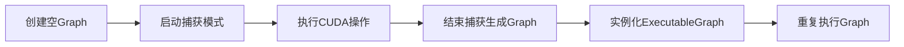
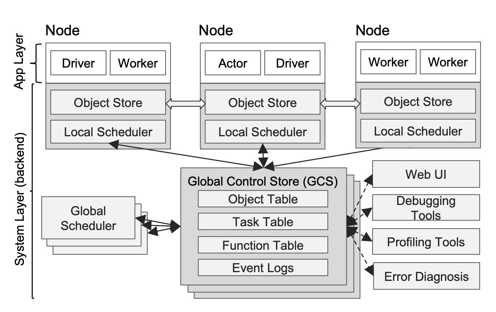
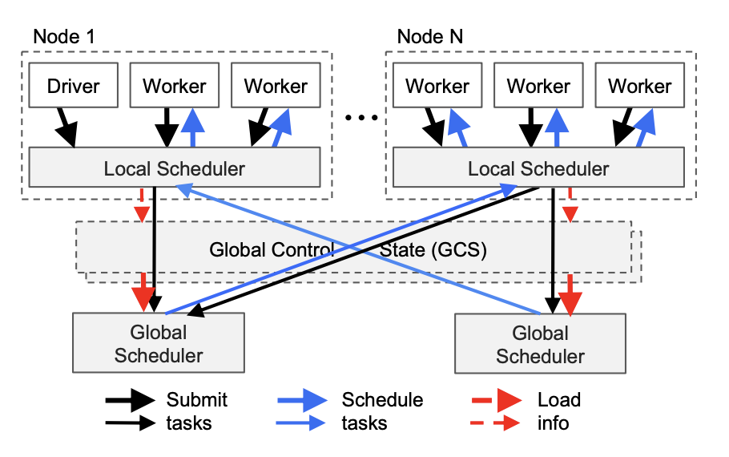

<h1 id="目录">目录</h1>

## 一、基础架构与概念
1. [X86和ARM架构在深度学习侧的区别？](#user-content-1.x86和arm架构在深度学习侧的区别？)
2. [介绍一下XPU、MLU、MUSA各自的特点](#user-content-2.介绍一下XPU、MLU、MUSA各自的特点)
3. [介绍一下Hopper架构GPU的概念](#user-content-3.介绍一下Hopper架构GPU的概念)
4. [介绍一下NVLink的概念](#user-content-4.介绍一下NVLink的概念)
5. [NVIDIA显卡架构演变](#user-content-5.NVIDIA显卡架构演变)
6. [NVIDIA边端设备介绍](#user-content-6.NVIDIA边端设备介绍)

## 二、端侧部署与优化
1. [为何在AI端侧设备一般不使用传统图像算法？](#user-content-1.为何在ai端侧设备一般不使用传统图像算法？)
2. [端侧部署时整个解决方案的核心指标？](#user-content-2.端侧部署时整个解决方案的核心指标？)
3. [主流AI端侧硬件平台有哪些？](#user-content-3.主流ai端侧硬件平台有哪些？)
4. [主流AI端侧硬件平台一般包含哪些模块？](#user-content-4.主流ai端侧硬件平台一般包含哪些模块？)
5. [优化模型端侧性能的一些方法](#user-content-5.优化模型端侧性能的一些方法)
6. [目前主流的端侧算力芯片有哪些种类？](#user-content-6.目前主流的端侧算力芯片有哪些种类？)

## 三、并行计算与通信技术
1. [MPI并行计算技术介绍](#user-content-1.MPI并行计算技术介绍)
2. [NVIDIA的NCCL技术介绍](#user-content-2.NVIDIA的NCCL技术介绍)
3. [什么是All-gather操作？](#user-content-3.什么是All-gather操作？)
4. [pytorch是如何实现All-gather操作的？](#user-content-4.pytorch是如何实现All-gather操作的？)
5. [什么是Reduce-Scatter操作？](#user-content-5.什么是Reduce-Scatter操作？)
6. [pytorch是如何实现Reduce-Scatter操作的？](#user-content-6.pytorch是如何实现Reduce-Scatter操作的？)
7. [什么是FSDP？](#user-content-7.什么是FSDP？)
8. [什么是ZeRO？](#user-content-8.什么是ZeRO？)
9. [什么是cuda-graph？](#user-content-9.什么是cuda-graph？)
10. [什么是nccl-test？](#user-content-10.什么是nccl-test？)
11. [什么是RoCE高网？](#user-content-11.什么是RoCE高网？)
12. [什么是InfiniBand网卡？](#user-content-12.什么是InfiniBand网卡？)
13. [简单介绍一下gloo](#user-content-13.简单介绍一下gloo)
14. [简单介绍一下RDMA技术](#user-content-14.简单介绍一下RDMA技术)

## 四、工具与命令
1. [mpirun命令详解](#user-content-1.mpirun命令详解)
2. [nvidia-smi命令详解](#user-content-2.nvidia-smi命令详解)

## 五、算法工程师与硬件知识
1. [算法工程师该如何看待硬件侧知识？](#user-content-1.算法工程师该如何看待硬件侧知识？)

## 六、其他重要概念
1. [什么是diffusers?](#user-content-1.什么是diffusers?)
2. [什么是ray？](#user-content-2.什么是ray？)


<h1 id="一、基础架构与概念"> 一、基础架构与概念 </h1>

<h2 id='1.x86和arm架构在深度学习侧的区别？'>1.x86和arm架构在深度学习侧的区别？</h3>
  
AI服务器与PC端一般都是使用X86架构，因为其<font color=DeepSkyBlue>高性能</font>；AI端侧设备（手机/端侧盒子等）一般使用ARM架构，因为需要<font color=DeepSkyBlue>低功耗</font>。

X86指令集中的指令是复杂的，一条很长指令就可以很多功能；而ARM指令集的指令是很精简的，需要几条精简的短指令完成很多功能。

X86的方向是高性能方向，因为它追求一条指令完成很多功能；而ARM的方向是面向低功耗，要求指令尽可能精简。


<h2 id="2.介绍一下XPU、MLU、MUSA各自的特点">2.介绍一下XPU、MLU、MUSA各自的特点</h2>

**XPU**、**MLU** 和 **MUSA** 都是不同的硬件加速器架构，各自由不同的公司开发并用于加速 AI 和高性能计算任务。它们的主要功能是通过专门设计的硬件来加速大规模计算任务，特别是在AIGC、传统深度学习、自动驾驶等领域。以下是对每个加速器架构的详细介绍和它们的特点：

### 1. **XPU（Cross Processing Unit）**
   - **背景**：**XPU** 通常用作 Intel 的新一代可扩展异构计算平台的统称，涵盖了不同的硬件架构，用于处理 AI、数据分析和高性能计算任务。Intel 的 XPU 通过整合 CPU、GPU、FPGA 和专用 AI 加速器（如 Nervana 或 Habana）等硬件，实现广泛的计算场景支持。
   - **特点**：
     - **异构计算**：XPU 的主要特点是它能够支持异构计算，即在同一计算框架中结合 CPU、GPU、FPGA 和其他 AI 加速硬件来提高计算性能。
     - **通用性强**：XPU 设计的核心是通用计算，能够支持从数据中心到边缘设备的各种计算需求。
     - **软件兼容性**：借助 **oneAPI**，Intel 提供了一个统一的编程平台，使开发者能够使用单一代码库来开发支持不同硬件加速的应用程序，这大大简化了异构计算的开发复杂度。

   - **应用领域**：
     - 高性能计算（HPC）
     - AI 加速（如训练和推理任务）
     - 数据分析和处理

### 2. **MLU（Machine Learning Unit）**
   - **背景**：**MLU** 是由中国公司 **寒武纪科技**（Cambricon）开发的专用机器学习处理器，专门用于加速深度学习和 AI 相关的任务。MLU 处理器通常部署在数据中心、云计算平台和边缘计算设备中。
   - **特点**：
     - **AI 加速优化**：MLU 是为 AI 任务优化的芯片，特别擅长深度学习模型的训练和推理任务。与传统的 GPU 不同，它是专门为处理神经网络计算所设计的。
     - **自定义架构**：寒武纪在设计 MLU 架构时，采用了针对神经网络计算的定制硬件，使其在神经网络计算时比传统的通用处理器更高效。
     - **高吞吐量与能效比**：MLU 的设计目标是提供高吞吐量，并在大规模并行计算中保持较高的能效比。这使得 MLU 特别适合在数据中心进行大规模深度学习任务的处理。

   - **应用领域**：
     - 数据中心 AI 加速
     - 边缘计算设备
     - 云端 AI 服务

### 3. **MUSA（Machine Unified Smart Accelerator）**
   - **背景**：**MUSA** 是由 **摩尔线程**（Moore Threads）开发的一种 AI 加速架构。摩尔线程是一家中国的半导体公司，致力于开发用于高性能图形渲染和 AI 计算的图形处理器和加速器。
   - **特点**：
     - **多功能性**：MUSA 是一种智能加速器，能够同时支持图形渲染和 AI 计算任务。与单纯的 AI 加速器不同，MUSA 兼具 AI 和图形处理能力，适合图形计算与 AI 场景结合的应用。
     - **可编程性**：MUSA 支持丰富的编程模型，可以通过不同的 API 和框架来进行开发，适合需要自定义计算任务的用户。
     - **AI 与图形渲染结合**：MUSA 特别适合在图形处理和 AI 推理需要同时进行的场景中发挥作用，比如在实时渲染和 AI 驱动的增强现实、虚拟现实（AR/VR）应用中。

   - **应用领域**：
     - 高性能图形渲染
     - AI 推理加速
     - 混合场景应用，如游戏、虚拟现实、增强现实

### 三者的对比：
- **XPU** 更倾向于异构计算，强调广泛的适用性，并结合了多种计算架构（CPU、GPU、FPGA 等）。
- **MLU** 专注于 AI 计算任务，特别是AI模型的训练和推理，适用于大规模 AI 计算场景。
- **MUSA** 则是一种结合了图形处理和 AI 计算的加速器，适合图形密集型任务和 AI 计算的混合场景，如游戏和虚拟现实中的 AI 增强效果。

<h2 id="3.介绍一下Hopper架构GPU的概念">3.介绍一下Hopper架构GPU的概念</h2>
 
Hopper架构是NVIDIA推出的新一代GPU架构，专为AI和高性能计算（HPC）设计，以**高效处理大规模并行计算任务**为核心目标。其核心技术包括**Transformer引擎、第四代NVLink、高密度计算单元**等，显著提升了AI模型的训练和推理效率。

### **核心技术创新**
1. **Transformer引擎**  
   - **功能**：通过混合FP8和FP16精度动态调整计算模式，加速Transformer类模型（如DeepSeek、GPT、BERT）的训练和推理。  
   - **优势**：相比前代架构，AI训练速度提升3倍以上，显存占用降低30%。

2. **第四代NVLink**  
   - **功能**：支持多GPU间高速互联，双向带宽达900GB/s，是PCIe 5.0的7倍。  
   - **应用场景**：多卡集群训练时减少通信瓶颈，适用于千亿参数大模型的分布式训练。

3. **高密度计算单元**  
   - **制程与规模**：采用台积电4N工艺，集成超过800亿晶体管，计算密度提升50%。

### **通俗案例解析**  
**案例：大语言模型推理加速**  
假设需部署一个千亿参数的GPT模型进行实时对话服务：  
- **传统架构**：受限于显存带宽和计算单元效率，推理延迟可能高达数百毫秒。  
- **Hopper架构**：通过Transformer引擎的FP8精度优化和KV缓存压缩，显存带宽利用率提升至3000GB/s（如H800 GPU），推理延迟降至几十毫秒，同时支持更高并发请求。

### **领域应用场景**  
#### **1. AIGC（生成式AI）**  
- **核心需求**：高吞吐量、低延迟的文本/图像生成。  
- **Hopper应用**：  
  - **文本生成**：基于Transformer引擎优化注意力机制，支持Stable Diffusion、DeepSeek、GPT-4等模型快速生成高质量内容。  
  - **图像生成**：利用FP8精度加速扩散模型（如DALL·E 3），单卡可同时处理多批次高分辨率图像生成任务。  

#### **2. 传统深度学习**  
- **核心需求**：大规模数据训练与高效参数更新。  
- **Hopper应用**：  
  - **分布式训练**：通过NVLink构建多机多卡集群，千卡级训练任务通信效率提升9倍，训练时间缩短60%（如YOLOv5、ResNet-152训练）。  
  - **混合精度优化**：FP8精度下，BERT等模型的微调能耗降低40%。  

#### **3. 自动驾驶**  
- **核心需求**：实时处理多模态传感器数据（LiDAR、摄像头）。  
- **Hopper应用**：  
  - **多任务并行**：利用MIG（多实例GPU）技术将单卡分割为多个独立实例，同时处理目标检测、路径规划、语义分割任务。  
  - **低延迟推理**：基于高带宽显存（HBM3），处理单帧LiDAR点云（32x32x32体素）的推理延迟<10ms，满足实时决策需求。  

### **性能对比与优势总结**  
| 指标                | Hopper（H800） | 前代架构（A100） | 优势提升               |  
|---------------------|----------------|------------------|------------------------|  
| 显存带宽            | 3000 GB/s      | 2039 GB/s        | +47%                   |  
| FP8算力峰值         | 580 TFLOPS     | 312 TFLOPS       | +86%                   |  
| 多卡互联带宽        | 900 GB/s       | 600 GB/s         | +50%                   |  
| 能耗比（TOPS/W）    | 3.5            | 2.1              | +66%                   |  

Hopper架构通过**硬件-软件协同优化**，正在重塑AI基础设施的效能边界，成为AIGC、传统深度学习、自动驾驶等领域的核心算力引擎。

<h2 id="4.介绍一下NVLink的概念">4.介绍一下NVLink的概念</h2>

### 一、NVLink的核心知识

**NVLink** 是英伟达（NVIDIA）设计的一种**高速GPU互连技术**，旨在解决传统PCIe总线在带宽和延迟上的瓶颈，提升多GPU系统（或多GPU与CPU之间）的通信效率。其核心特点包括：

1. **高带宽**：  
   - NVLink的带宽远超PCIe。例如：  
     - PCIe 4.0 x16带宽为 **32 GB/s**（双向）。  
     - NVLink 3.0单链路带宽为 **50 GB/s**（单向），多链路叠加后可达 **600 GB/s**（如NVIDIA A100支持12条链路）。  
   - 带宽优势在多GPU并行计算中尤为关键。

2. **低延迟**：  
   - NVLink采用**点对点直连架构**，减少数据中转层级，通信延迟比PCIe低 **5-10倍**。

3. **灵活拓扑**：  
   - 支持多种连接方式（如GPU-GPU、GPU-CPU），并可通过**NVSwitch**芯片构建大规模GPU集群（如NVIDIA DGX系统）。

4. **内存一致性**：  
   - 支持**统一虚拟内存（UVA）**，允许GPU直接访问其他GPU或CPU的内存，简化编程模型。

### 二、通俗易懂的实际案例

**案例：多GPU训练大型语言模型（如GPT-4）**  
假设使用4块NVIDIA A100 GPU训练GPT-4模型：  
- **传统PCIe架构**：GPU之间通过PCIe交换数据，带宽受限，导致参数同步耗时较长（如每轮训练需10秒）。  
- **NVLink架构**：GPU通过NVLink直连，带宽提升数倍，参数同步时间缩短至2秒。  
- **效果**：训练速度提升约30%，显著降低训练成本。

### 三、在三大领域中的应用

#### 1. **AIGC（AI生成内容）**  
- **应用场景**：  
  - **多模态生成模型**：如Stable Diffusion、DALL·E等，需在多个GPU间快速传输图像和文本数据。  
  - **实时交互生成**：例如AI实时生成高清视频时，NVLink确保帧间数据高效同步。  
- **优势**：减少生成延迟，支持更高分辨率和复杂度的内容生成。

#### 2. **传统深度学习**  
- **应用场景**：  
  - **分布式训练**：在数据并行中，NVLink加速梯度同步（如ResNet、Transformer）。  
  - **模型并行**：超大模型（如GPT-3）拆分到多GPU时，NVLink降低层间通信开销。  
- **优势**：提升训练吞吐量，支持更大Batch Size和更复杂模型。

#### 3. **自动驾驶**  
- **应用场景**：  
  - **多传感器融合**：激光雷达、摄像头数据需实时融合，NVLink加速GPU间的传感器数据处理。  
  - **端到端决策模型**：如NVIDIA Drive AGX平台，通过NVLink连接多个GPU，实现低延迟的路径规划和障碍物检测。  
- **优势**：满足自动驾驶对实时性和安全性的严苛要求。

<h2 id="5.NVIDIA显卡架构演变念">5.NVIDIA显卡架构演变</h2>

以下是英伟达截至2025年4月15日已发布的GPU架构及其关键信息总结，包含历史架构与最新动态：

---

### 一、**已发布的代表性架构**
1. **Fermi（2010年）**  
   - **技术突破**：首次引入ECC显存纠错技术，提升计算可靠性；优化双精度浮点性能，扩展科学计算应用。  
   - **代表产品**：Tesla C2050。

2. **Kepler（2012年）**  
   - **技术突破**：采用SMX设计，CUDA核心利用率提升；支持动态并行技术，减少CPU依赖。  
   - **代表产品**：GeForce GTX 680。

3. **Maxwell（2014年）**  
   - **技术突破**：显著提升能效比，优化显存压缩与动态调频（GPU Boost），推动轻薄游戏本发展。  
   - **代表产品**：GTX 980 Ti。

4. **Pascal（2016年）**  
   - **技术突破**：支持FP16混合精度计算，为深度学习奠定基础；优化VR渲染性能。  
   - **代表产品**：Tesla P100、GTX 1080。

5. **Volta（2017年）**  
   - **技术突破**：首次集成张量核心（Tensor Core），加速AI训练与推理；优化缓存层次与互联技术。  
   - **代表产品**：Tesla V100。

6. **Turing（2018年）**  
   - **技术突破**：引入实时光线追踪（RT Core）与DLSS技术，革新游戏与影视渲染。  
   - **代表产品**：RTX 2080。

7. **Ampere（2020年）**  
   - **技术突破**：第二代张量核心与更高显存带宽，推动AI推理与云计算性能跃升。  
   - **代表产品**：RTX 3090、A100。

8. **Hopper（2022年）**  
   - **技术突破**：第三代张量核心与多实例GPU支持，专为大规模AI训练设计。  
   - **代表产品**：H100。

9. **Ada Lovelace（2022年）**  
   - **技术突破**：第四代Tensor Core支持FP8精度，提升AI算力；第三代RT Core优化光线追踪效率。  
   - **代表产品**：RTX 4090。

10. **Blackwell（2024年）**  
    - **技术突破**：第四代张量核心与HBM3显存，算力密度提升；支持大规模AI推理与高分辨率渲染。  
    - **代表产品**：RTX 50系列（如RTX 5090）、RTX PRO 6000系列（专业级）。

---

### 二、**最新动态与未来架构**
1. **Blackwell Ultra（2025年）**  
   - **特点**：Blackwell架构的增强版，配备HBM3E显存（288GB），72-GPU集群算力达15 PFLOPS（FP4），推理速度较前代提升11倍。  
   - **应用场景**：数据中心与超算，如NVL72集群方案。

2. **Rubin（2025年公布，计划2026年推出）**  
   - **特点**：基于台积电3nm工艺，支持HBM4显存与NVLink 6互联，算力达50 PFLOPS（FP4），性能为Blackwell的3.3倍。  
   - **未来产品**：NVL144集群方案（2026年）与NVL576方案（2027年）。

3. **Feynman（计划2028年）**  
   - **特点**：Rubin架构的继任者，预计支持量子算法融合与硅光技术，进一步突破算力瓶颈。

---

### 三、**架构演进趋势**
1. **AI与图形融合**  
   - 从Volta开始，张量核心的引入推动GPU从图形加速转向AI加速，Blackwell与Rubin进一步强化这一方向。

2. **显存与互联技术升级**  
   - 显存从GDDR6到GDDR7（消费级）与HBM3E/HBM4（专业级），带宽与容量持续提升。

3. **能效优化**  
   - 制程工艺从4nm（Blackwell）到3nm（Rubin），结合动态电源管理，平衡性能与功耗。

---

### 四、**总结**
截至2025年4月，英伟达的架构覆盖从图形渲染到AI计算的全面需求，**Blackwell**是当前最先进的消费级与专业级架构，而**Rubin**与**Feynman**则代表未来量子计算与硅光技术的融合方向。历史架构（如Turing、Ampere）仍在特定领域（如游戏、数据中心）广泛应用。

<h2 id="6.NVIDIA边端设备介绍">6.NVIDIA边端设备介绍</h2>
截至2025年4月，英伟达Jetson系列主要包括以下产品，覆盖从入门级到高性能的边缘计算需求：

---

### **一、Jetson Orin 系列（2023年推出，当前主流）**
1. **Jetson AGX Orin**  
   - **算力**：最高275 TOPS（AI性能）。  
   - **功耗**：15-60W可配置。  
   - **应用**：自动驾驶、工业机器人、智慧城市等高算力场景，支持实时AI推理和多传感器融合。  

2. **Jetson Orin NX**  
   - **算力**：最高100 TOPS。  
   - **功耗**：10-25W。  
   - **特点**：紧凑型设计，适用于智能摄像头、无人机和嵌入式AI系统，平衡性能与成本。  

3. **Jetson Orin Nano**  
   - **算力**：40 TOPS。  
   - **功耗**：7-15W。  
   - **定位**：入门级边缘AI设备，适合IoT和轻量级AI任务，如智能家电和低功耗嵌入式系统。  

---

### **二、Jetson Xavier 系列（早期高性能产品）**
1. **Jetson AGX Xavier**  
   - **算力**：32 TOPS（AI性能）。  
   - **功耗**：10-30W。  
   - **应用**：机器人开发、工业自动化，支持多传感器集成和复杂算法处理。  

2. **Jetson Xavier NX**  
   - **算力**：21 TOPS。  
   - **功耗**：10-20W。  
   - **特点**：体积小（70×45 mm），性能为初代Nano的50倍，兼容Nano主板，适合紧凑型设备。  

---

### **三、经典入门级产品**
1. **Jetson TX2**  
   - **算力**：1.3 TFLOPS（FP32）。  
   - **功耗**：7.5-15W。  
   - **功能**：支持多摄像头输入和安全核心，适合中端工业检测和机器人控制。  

2. **Jetson Nano**  
   - **算力**：0.5 TFLOPS（FP32）。  
   - **功耗**：5-10W。  
   - **定位**：入门级AI开发板，适合教育和小型项目，如图像分类和基础机器人。  

---

### **四、历史型号（已逐步淘汰）**
- **Jetson TK1**（2014年）：首款边缘计算开发板，基于Tegra K1芯片，支持CUDA平台。  
- **Jetson TX1**（2015年）：性能较TK1提升，引入64位CPU和更高能效设计。  

---

### **五、关键特性与生态支持**
- **硬件设计**：全模块化系统（SoM），集成GPU、CPU、内存和电源管理，支持紧凑集成。  
- **软件生态**：JetPack SDK提供CUDA、TensorRT等工具链，支持TensorFlow、PyTorch等框架，优化AI推理效率。  
- **应用场景**：覆盖机器人、自动驾驶、工业视觉、智慧城市等领域，支持实时数据处理与边缘AI部署。  

<h1 id="二、端侧部署与优化"> 二、端侧部署与优化 </h1>

<h2 id="1.为何在ai端侧设备一般不使用传统图像算法？">1.为何在AI端侧设备一般不使用传统图像算法？</h2>
  
AI端侧设备多聚焦于深度学习算法模型的加速与赋能，而传统图像算法在没有加速算子赋能的情况下，在AI端侧设备无法发挥最优的性能。


<h2 id="2.端侧部署时整个解决方案的核心指标？">2.端侧部署时整个解决方案的核心指标？</h2>

1. 精度
2. 耗时
3. 内存占用
4. 功耗


<h2 id="3.主流ai端侧硬件平台有哪些？">3.主流AI端侧硬件平台有哪些？</h2>

1. 英伟达
2. 海思
3. 寒武纪
4. 比特大陆
5. 昇腾
6. 登临
7. 联咏
8. 安霸
9. 耐能
10. 爱芯
11. 瑞芯


<h2 id="4.主流ai端侧硬件平台一般包含哪些模块？">4.主流AI端侧硬件平台一般包含哪些模块？</h2>

1. 视频编解码模块
2. CPU核心处理模块
3. AI协处理器模块
4. GPU模块
5. DSP模块
6. DDR内存模块
7. 数字图像处理模块

<h2 id="5.优化模型端侧性能的一些方法">5.优化模型端侧性能的一些方法</h2>

1. 设计能最大限度挖掘AI协处理器性能的模型结构。
2. 多模型共享计算内存。
3. 减少模型分支结构，减少模型元素级操作。
4. 卷积层的输入和输出特征通道数相等时MAC最小，以提升模型Inference速度。

<h2 id="6.目前主流的端侧算力芯片有哪些种类？">6.目前主流的端侧算力芯片有哪些种类？</h2>

AI端侧算力设备（如NPU、TPU、VPU、FPGA等）目前正在快速发展，这些设备专门设计用于加速AIGC、传统深度学习、自动驾驶等领域任务。它们在性能和效率方面大大超过了传统的CPU和GPU。以下是Rocky对这些AI端侧算力的详细介绍：

### 1. NPU（Neural Processing Unit）
NPU，即神经处理单元，是一种专门用于加速神经网络计算的处理器。NPU通常集成在移动设备、物联网设备和其他嵌入式系统中，以提升AI应用的性能。

#### 特点与优势：
- **高效能耗比**：NPU在进行神经网络计算时具有高能效，适用于资源受限的设备。
- **专用硬件设计**：为了优化矩阵运算和卷积操作，NPU设计了专门的硬件加速器。
- **实时处理**：NPU能实现低延迟的实时AI推理，非常适合智能手机、摄像头等需要实时处理的设备。
- **集成性强**：NPU常与其他处理单元（如CPU、GPU）集成在同一个芯片上（如SoC），以提供全面的计算能力。

### 2. TPU（Tensor Processing Unit）
TPU，即张量处理单元，是Google开发的一种专用AI加速器，主要用于加速TensorFlow框架下的机器学习任务。

#### 特点与优势：
- **高性能**：TPU能够提供极高的计算能力，特别是在处理大规模矩阵运算和深度学习模型训练时。
- **定制化设计**：TPU为特定的AI工作负载（如矩阵乘法、卷积运算）进行了优化，显著提升了性能。
- **大规模部署**：TPU被广泛部署在Google的数据中心，用于支持Google的各项AI服务，如搜索、广告、翻译等。

#### 版本和架构：
- **TPU v1**：主要用于推理任务，每秒可执行92万亿次浮点运算（92 TFLOPS）。
- **TPU v2**和**TPU v3**：增强了训练能力，分别具有每秒180 TFLOPS和420 TFLOPS的计算能力。
- **TPU v4**：最新版本，进一步提升了性能和能效，适用于更大规模、更复杂的AI任务。


### 3. VPU（Vision Processing Unit）
VPU，即视觉处理单元，是一种专门设计用于计算机视觉和人工智能任务的处理器。VPUs的主要目标是以高效的能耗比处理复杂的视觉计算任务，适用于各种嵌入式和边缘设备。

####  特点与优势：
  - VPU专注于低功耗的计算机视觉任务，适用于嵌入式系统和边缘设备。
  - 提供高效的图像处理和神经网络推理能力。

### 4. FPGA（Field Programmable Gate Array）
FPGA，即现场可编程门阵列，是一种高度可编程的集成电路，可以根据特定应用的需求重新配置其硬件电路。FPGA在AI和机器学习中广泛应用于需要高灵活性和低延迟的任务。

####  特点与优势：
  - FPGA具有高度灵活性，可根据需求重新配置电路结构。
  - 提供较低的延迟和高效的能耗比，适用于特定AI任务的加速。
  - 能够实现高度并行计算，适用于实时处理应用。

### 5. Huawei Ascend
华为昇腾系列AI处理器包括适用于云端和边缘计算的多种型号，提供高性能的AI计算能力。
#### 特点与优势：
  - 华为的昇腾系列AI芯片，包括适用于云端和边缘计算的不同版本，如Ascend 910（高性能）和Ascend 310（边缘计算）。
  - 提供高度集成的AI计算能力，支持多种AI框架和模型。

### 6. Graphcore IPU（Intelligence Processing Unit）
Graphcore IPU是一种专门设计用于机器智能任务的处理器，采用全新的计算架构，优化了计算和内存访问。
#### 特点与优势：
  - IPU专为机器智能任务设计，采用了全新的计算架构，优化了计算和内存访问。
  - 能够高效处理稀疏计算和动态计算图，适用于复杂的AI模型。

### 总结
这些AI端侧设备显著提升了AIGC、传统深度学习、自动驾驶任务的性能和能效，推动了AI技术的快速发展和应用扩展。不同的加速器在设计上各有侧重，适用于不同的应用场景，满足了多样化的AI计算需求。

<h1 id="三、并行计算与通信技术"> 三、并行计算与通信技术 </h1>

<h2 id="1.MPI并行计算技术介绍">1.MPI并行计算技术介绍</h2>

### 简介
MPI 全名叫 Message Passing Interface，即信息传递接口，其作用是在不同进程间传递消息，从而可以并行地处理任务，即进行并行计算。需要注意的是，尽管我们偶尔会说使用 MPI 编写了某某可执行程序，但是 MPI 其实只是一个标准，而不是一种编程语言。其具体的实现由OpenMPI, MPICH, IntelMPI等库完成，这些库遵循MPI标准，并且可以被 Fortran、C、C++、Python 调用。

几个概念：
- 串行：指的是在执行多个任务时，各个任务按顺序执行，完成一个后才能进行下一个
- 并行：指的是多个任务可以同时执行
- 并发：并发编程又叫多线程编程，指的是在执行多个任务时，因为资源不够所以采用一个 CPU 轮换着进行这些任务，从而提高任务效率，因为切换任务的速度很快，所以看上去是多个任务一起进行
- 同步：同步就是顺序执行，执行完一个再执行下一个，需要等待、协调运行。例如消息发送方必须等待消息接收方接受完才能继续执行后续任务
- 异步：异步就是彼此独立，在等待某件事的过程中继续做自己的事。例如消息发送方再发送完一条消息后不必等待接收方的接收即可继续执行后续任务

### MPI 的核心概念
1. 进程（Processes）：

- MPI程序由多个独立的进程组成，每个进程运行自己的代码（SPMD模式）或不同代码（MPMD模式）。

- 进程通过唯一的rank（编号）标识，例如rank=0通常是主进程。

2. 通信器（Communicator）：

定义进程组的通信上下文，最常用的是MPI_COMM_WORLD，包含所有进程。

3. 点对点通信（Point-to-Point）：

进程间直接发送和接收消息，如MPI_Send()和MPI_Recv()。

4. 集体通信（Collective Communication）：

   - 所有进程参与的全局操作，例如：

      MPI_Bcast()：广播数据。

      MPI_Reduce()：规约数据（如求和、取最大值）。

      MPI_AllGather()：收集所有进程的数据。

5. 同步（Synchronization）：

通过MPI_Barrier()确保所有进程到达代码的某个点后再继续执行。

<h2 id="2.NVIDIA的NCCL技术介绍">2.NVIDIA的NCCL技术介绍</h2>

### 简介
NCCL是专为NVIDIA GPU设计的集合通信库，它和 MPI 一样支持多种高效的集体通信操作，如广播、归约、全收集等。在GPU之间的通信可以通过以下几种方式实现：

1. GPU Shared Memory
在这种方式中，GPU之间的数据传输需要经过CPU的主机内存（Host Memory）。这意味着数据首先需要从一块GPU拷贝到CPU的主机内存，然后再从CPU的主机内存拷贝到另一块GPU。这种方式涉及到CPU和PCIe总线，可能会导致较高的通信延迟和额外的性能开销。

2. GPU Direct P2P
GPU Direct Peer-to-Peer（P2P）技术允许同一节点上的GPU直接相互通信，无需通过CPU的主机内存。这种直接点对点（P2P）通信减少了数据传输的延迟，并且可以显著提高多GPU之间的通信效率。GPU Direct P2P依赖于PCIe架构，允许GPU共享内存资源，从而实现高效的数据交换。

3. NVLink
NVLink是NVIDIA开发的一种高速互连技术，它提供了比传统PCIe更高的带宽和更低的延迟。通过NVLink，GPU之间的数据传输不再通过PCIe总线，而是直接通过NVLink连接。NVLink通过NVSwitch设备实现多GPU之间的全互联，这对于高性能计算和深度学习应用中的大规模并行处理尤为重要。

### 架构
NCCL的架构与MPI基本一致，它将每个进程称为一个“rank”，每个rank都有一个唯一的标识符，即rank ID。这些rank的集合构成了一个“communicator”，它定义了一组可以相互通信的进程。

在NCCL中，一个进程可以属于多个communicators，并且在不同的communicators中可能有不同的rank ID。为了进行通信，每个设备上都需要创建一个NCCL Communicator对象。

### 特点
- NVLink 互连：NCCL 优化了通过 NVLink 进行的 GPU 间通信，这是 NVIDIA 高端 GPU（如 Tesla V100 和 A100）之间的高速互连技术。
- GPU 直接通信：NCCL 允许 GPU 之间直接交换数据，绕过了传统的 CPU 中转，显著减少了通信延迟。
- CUDA 集成：NCCL 与 CUDA 紧密集成，使得开发者能够在 CUDA 程序中无缝地使用 NCCL 进行高效的数据传输和同步。
- 自适应拓扑：NCCL 能够自动检测并适应不同的硬件拓扑，无论是单节点多GPU还是跨节点的多GPU环境。

在异构计算环境中，CPU、GPU、网络和其他加速器需要高效协同工作。NCCL 在这种环境中展现出显著的性能优势：

- 跨平台支持：NCCL 不仅支持 NVIDIA GPU，还能够与 CPU 和其他硬件平台协同工作，提供了跨平台的通信解决方案。
- 可扩展性：NCCL 设计用于大规模并行计算，能够支持数千个 GPU 的集群，这对于处理大规模数据集和模型至关重要。
- 低延迟和高吞吐量：NCCL 优化了数据传输路径，减少了通信延迟，同时提供了高吞吐量的数据处理能力。
- 容错性：在异构环境中，硬件故障是常见的问题。NCCL 提供了容错机制，确保了计算任务在出现硬件故障时仍能继续执行。

<h2 id="3.什么是All-gather操作？">3.什么是All-gather操作？</h2>

**All Gather** 是一种**集合通信操作**（Collective Communication），常见于并行计算和分布式系统中（如MPI、深度学习框架）。它的核心功能是让**所有参与进程**都收集到其他进程的数据副本，最终每个进程都拥有一份完整的全局数据集合。

---

### **核心概念**
1. **操作流程**：
   - 每个进程将自己的本地数据发送给所有其他进程。
   - 所有进程最终会收到并存储来自所有进程的数据，按进程编号有序排列。

2. **与类似操作的区别**：
   - **Gather**：仅根进程收集所有数据，其他进程不保留结果。
   - **AllReduce**：对全局数据聚合（如求和）后分发结果，而All Gather仅收集数据，不进行聚合。
   - **Broadcast**：单一进程将数据分发给所有进程，而All Gather是多对多的数据交换。

---

### **示例**
假设有2个进程：
- **进程0** 数据：`A`
- **进程1** 数据：`B`

执行 `All Gather` 后，每个进程的结果为 `[A, B]`。

---

### **应用场景**
1. **数据并行训练**：在分布式深度学习中，收集各GPU的中间结果（如梯度或特征）。
2. **全局状态同步**：需要所有节点基于全局信息决策时（如分布式优化算法）。
3. **日志聚合**：收集各节点的日志信息用于统一分析。

---

### **实现与优化**
- **MPI中的实现**：通过 `MPI_Allgather` 函数实现，数据按进程ID顺序拼接。
- **通信优化**：采用树形或环形拓扑减少带宽消耗，避免单点瓶颈。

---

### **代码示意（伪代码）**
```python
# 假设使用MPI（进程数为2）
data = local_data  # 进程0的数据为"A"，进程1为"B"
result = all_gather(data)
# 结果：进程0和进程1均得到 ["A", "B"]
```

---

通过All Gather，分布式系统中的节点能够高效共享全局信息，是许多并行算法和框架的基础操作。

<h2 id="4.pytorch是如何实现All-gather操作的？">4.pytorch是如何实现All-gather操作的？</h2>

PyTorch 实现 **All Gather** 操作主要通过其分布式通信模块 `torch.distributed`，结合底层通信后端（如 NCCL、Gloo、MPI）完成。以下是详细的实现机制和代码示例：

---

### **1. PyTorch 中的 All Gather API**
PyTorch 提供了两种主要的 All Gather 接口：
- **`torch.distributed.all_gather`**：适用于非连续张量或多维数据。
- **`torch.distributed.all_gather_into_tensor`** (v1.10+)：针对连续内存张量优化，性能更高。

#### **基本用法示例**
```python
import torch
import torch.distributed as dist

# 初始化进程组（假设使用 NCCL 后端，2 个 GPU 进程）
dist.init_process_group(backend="nccl")
rank = dist.get_rank()
device = f"cuda:{rank}"

# 每个进程的本地数据（不同进程数据不同）
local_data = torch.tensor([rank], device=device)  # 进程0为 [0]，进程1为 [1]

# 准备接收全局数据的缓冲区（需预分配空间）
world_size = dist.get_world_size()
gathered_data = [torch.zeros_like(local_data) for _ in range(world_size)]

# 执行 All Gather
dist.all_gather(gathered_data, local_data)

# 结果：每个进程的 gathered_data 为 [tensor([0]), tensor([1])]
print(gathered_data)
```

---

### **2. 底层实现机制**
#### **(1) 通信后端依赖**
- **NCCL (GPU)**：调用 `ncclAllGather`，优化多 GPU 间的通信带宽，采用环形算法减少通信轮次。
- **Gloo (CPU)**：使用分块广播或树状通信，聚合所有进程的数据。
- **MPI**：直接调用 `MPI_Allgather` 原语。

#### **(2) 数据合并规则**
- **输入**：每个进程的 `local_data` 必须具有相同的形状（如 `[N]`）。
- **输出**：`gathered_data` 是一个列表，按进程 `rank` 顺序拼接。例如：
  - 进程0的 `local_data` → `gathered_data[0]`
  - 进程1的 `local_data` → `gathered_data[1]`

#### **(3) 高效内存管理**
- **`all_gather_into_tensor`** 要求预分配一个连续的大张量作为输出，避免内存碎片：
  ```python
  output_tensor = torch.empty(world_size * local_data.numel(), dtype=local_data.dtype, device=device)
  dist.all_gather_into_tensor(output_tensor, local_data)
  # 结果按进程rank顺序平铺，如输出 tensor([0, 1])
  ```

---

### **3. 性能优化策略**
#### **(1) 通信拓扑优化**
- **环形算法 (NCCL)**：将数据分块沿环形链路传递，最大化带宽利用率。
  - 例如，4 个 GPU 的 All Gather 分4步完成，每步传递1/N数据块。
- **双二叉树 (Gloo)**：减少树状通信的深度，加速聚合。

#### **(2) 异步操作**
- 使用非阻塞通信以重叠计算与通信：
  ```python
  handle = dist.all_gather_into_tensor(output_tensor, local_data, async_op=True)
  # 执行其他计算...
  handle.wait()
  ```

#### **(3) 张量连续性**
- 确保输入张量是内存连续的（通过 `.contiguous()` 强制转换）：
  ```python
  local_data = local_data.contiguous()  # 避免隐式内存拷贝
  ```

---

### **4. 应用场景示例**
#### **分布式模型训练中的参数同步**
```python
# 每个进程计算本地特征
local_features = model(inputs)

# 收集所有进程的特征（用于全局损失计算）
gathered_features = [torch.zeros_like(local_features) for _ in range(world_size)]
dist.all_gather(gathered_features, local_features)

# 拼接所有特征（形状为 [world_size, batch_size, feature_dim]）
global_features = torch.cat(gathered_features, dim=0)
```

#### **混合并行训练中的梯度交换**
```python
# 模型参数分片存储在不同设备上
local_grad = compute_gradient_shard()

# 收集所有分片的梯度以更新全局参数
dist.all_gather(gathered_grads, local_grad)
global_grad = torch.cat(gathered_grads)
```

---

### **5. 注意事项**
1. **输入一致性**：所有进程的 `local_data` 必须形状相同。
2. **设备匹配**：NCCL 要求所有张量位于 GPU，Gloo 位于 CPU。
3. **进程组初始化**：确保 `init_process_group` 正确调用。
4. **死锁风险**：异步操作需谨慎处理同步逻辑。

---

通过 `torch.distributed.all_gather`，PyTorch 在分布式系统中高效实现了全局数据聚合，适用于需要跨节点/设备共享完整数据集的场景（如分布式训练、参数同步）。结合 NCCL/Gloo 的底层优化，能显著降低通信开销。

<h2 id="5.什么是Reduce-Scatter操作？">5.什么是Reduce-Scatter操作？</h2>

**Reduce-Scatter** 是一种**集合通信操作**（Collective Communication），常用于并行计算和分布式系统（如MPI、深度学习框架）。它的核心功能是**先对所有进程的数据进行聚合（Reduce），再将结果分块分发给所有进程**，每个进程最终仅保留聚合后的部分数据。

---

### **核心概念**
1. **操作流程**：
   - **Reduce阶段**：所有进程的数据按某种规则（如求和、最大值等）进行全局聚合。
   - **Scatter阶段**：将聚合后的数据**均匀分块**，每个进程仅保留其中一块。

2. **与类似操作的区别**：
   - **AllReduce**：所有进程获得完整的聚合结果，而Reduce-Scatter仅分发结果的一部分。
   - **Scatter**：仅将单个进程的数据分块分发给其他进程，无聚合步骤。
   - **Reduce + Scatter**：Reduce-Scatter可视为这两个操作的组合优化，但通过合并步骤降低通信开销。

---

### **示例**
假设有2个进程，每个进程的本地数据为数组：
- **进程0** 数据：`[1, 2]`
- **进程1** 数据：`[3, 4]`

执行 **Reduce-Scatter（求和）**：
1. **Reduce阶段**：全局求和得到 `[1+3, 2+4] = [4, 6]`。
2. **Scatter阶段**：将结果分块分发：
   - 进程0 接收第0块：`4`
   - 进程1 接收第1块：`6`

最终每个进程仅保留自己的分块数据。

---

### **应用场景**
1. **分布式模型训练**：
   - 聚合梯度后分块更新参数（如混合并行训练中，不同设备负责不同参数块）。
2. **大规模数值计算**：
   - 分块处理聚合后的数据，减少单节点内存占用（如矩阵乘法分块计算）。
3. **分布式数据库**：
   - 将聚合结果分布到多个节点存储或处理，避免单点瓶颈。

---

### **实现与优化**
- **MPI中的实现**：通过 `MPI_Reduce_scatter` 或 `MPI_Reduce_scatter_block` 函数实现。
- **通信优化**：
  - 使用树形或蝶形通信模式，减少带宽消耗。
  - 合并Reduce与Scatter操作，避免多次通信。

---

### **代码示意（伪代码）**
```python
# 假设使用MPI（进程数为2）
local_data = [1, 2] if rank == 0 else [3, 4]  # 进程0和1的本地数据
result = reduce_scatter(local_data, op="sum")  # 全局求和后分块
# 结果：进程0得到4，进程1得到6
```

---

### **与AllReduce的对比**
| **操作**        | **结果分布**              | **通信开销**              | **典型场景**                 |
|-----------------|--------------------------|--------------------------|----------------------------|
| **AllReduce**   | 所有进程获得完整聚合结果  | 较高（需广播完整数据）    | 全局梯度更新                |
| **Reduce-Scatter** | 每个进程获得结果的分块    | 较低（仅分发部分数据）    | 分块参数更新、分布式存储    |

---

通过Reduce-Scatter，系统可在**降低通信和内存开销**的同时，实现数据的分布式处理，尤其适用于需要分块并行计算的场景。


<h2 id="6.pytorch是如何实现Reduce-Scatter操作的？">6.pytorch是如何实现Reduce-Scatter操作的？</h2>

PyTorch 实现 **Reduce-Scatter** 操作主要依赖于其分布式通信模块 `torch.distributed` 和底层通信后端（如 NCCL、Gloo），通过结合 **Reduce（聚合）** 和 **Scatter（分块分发）** 的逻辑，优化通信效率。以下是具体实现机制和代码示例：

---

### **1. PyTorch 的 Reduce-Scatter API**
PyTorch 提供了 `torch.distributed.reduce_scatter_tensor` 接口（自 v1.9+ 支持），直接支持该操作：
```python
import torch
import torch.distributed as dist

# 初始化进程组
dist.init_process_group(backend="nccl")

# 每个进程的输入数据（假设总数据维度为 [world_size, chunk_size]）
input_tensor = torch.tensor([rank * 2, rank * 2 + 1], device="cuda")  # 例如，rank 0输入 [0,1]，rank 1输入 [2,3]

# 输出缓冲区（接收分块结果）
output_tensor = torch.empty(1, device="cuda")

# 执行 Reduce-Scatter（默认操作为求和）
dist.reduce_scatter_tensor(output_tensor, input_tensor, op=dist.ReduceOp.SUM)

# 结果：
# 假设 world_size=2，input_tensor 的全局聚合结果为 [0+2, 1+3] = [2, 4]
# 分块后，rank 0 得到 2，rank 1 得到 4
print(output_tensor)  # rank 0输出 tensor([2]), rank 1输出 tensor([4])
```

---

### **2. 实现机制**
#### **(1) 后端依赖**
PyTorch 的 `reduce_scatter_tensor` 通过底层通信库实现：
- **NCCL**（GPU 场景）：调用 `ncclReduceScatter`，优化多 GPU 通信。
- **Gloo**（CPU 场景）：实现基于树的聚合和分块分发逻辑。
- **MPI**：依赖 MPI 原语的 `MPI_Reduce_scatter`。

#### **(2) 数据分块规则**
- 输入数据 `input_tensor` 的维度需能被 `world_size` 整除。
- **分块逻辑**：将 `input_tensor` 视为由 `world_size` 个连续块组成，每个进程接收第 `rank` 块。
  - 例如，`input_tensor` 形状为 `[world_size * N]`，则每个进程的输出为 `[N]`。

#### **(3) 通信流程**
1. **Reduce 阶段**：所有进程的输入数据按指定操作（如求和）聚合。
2. **Scatter 阶段**：将聚合结果按进程编号分块，分发到各进程的输出缓冲区。

---

### **3. 手动实现 Reduce-Scatter**
若需兼容旧版本 PyTorch，可以手动组合 `all_reduce` 和 `scatter`：
```python
def manual_reduce_scatter(input_tensor, output_tensor, group=None):
    world_size = dist.get_world_size()
    # 全局聚合（AllReduce）
    reduced_tensor = torch.empty_like(input_tensor)
    dist.all_reduce(input_tensor, op=dist.ReduceOp.SUM, async_op=False, group=group)
    # 分块分发（Scatter）
    chunks = list(input_tensor.chunk(world_size))
    dist.scatter(output_tensor, scatter_list=chunks, group=group)
```

---

### **4. 性能优化**
PyTorch 的底层实现通过以下方式优化 Reduce-Scatter：
1. **通信拓扑优化**：
   - 使用 **环状通信** 或 **双二叉树** 结构减少带宽消耗（NCCL 的默认策略）。
2. **异步操作**：
   - 结合 `async_op=True` 实现通信与计算重叠。
   ```python
   handle = dist.reduce_scatter_tensor(output_tensor, input_tensor, async_op=True)
   # 执行其他计算
   handle.wait()
   ```
3. **内存连续性**：
   - 确保输入输出 Tensor 是连续的（避免隐式内存拷贝）。

---

### **5. 应用场景示例**
#### **分布式训练中的梯度分块更新**
```python
# 每个进程计算部分梯度
local_grad = compute_gradients(data_batch)

# 全局聚合梯度并分块（假设参数分片存储）
dist.reduce_scatter_tensor(
    output_tensor=param_shard.grad,
    input_tensor=local_grad,
    op=dist.ReduceOp.SUM
)

# 更新本地参数分片
optimizer.step()
```

---

### **6. 注意事项**
1. **输入输出形状匹配**：
   - `input_tensor` 的大小必须是 `world_size * output_tensor.size()`。
2. **后端兼容性**：
   - Gloo 仅支持 CPU，NCCL 支持 GPU。
3. **同步与异步**：
   - 默认同步操作会阻塞进程，异步需显式调用 `wait()`。

---

通过 `reduce_scatter_tensor`，PyTorch 在分布式训练中高效实现了 **聚合-分块分发** 的通信模式，显著降低了内存和带宽开销，尤其适用于大规模模型并行或数据并行场景。

<h2 id="7.什么是FSDP？">7.什么是FSDP？</h2>

---

**FSDP（Fully Sharded Data Parallelism）** 是 PyTorch 中一种先进的分布式训练策略，专为**高效训练超大规模模型**设计。其核心思想是**将模型参数、梯度、优化器状态分片（Shard）存储在不同GPU上**，从而大幅降低单个设备的显存占用，同时通过智能的通信调度保持计算效率。

---

### **核心原理**
1. **参数分片（Parameter Sharding）**  
   - 模型参数被均匀切分成多个分片，每个GPU仅存储其中一部分。
   - **前向传播**时，按需通过 **All Gather** 收集当前计算所需的完整参数。
   - **计算完成后**立即释放非本地的参数分片，回收显存。

2. **梯度与优化器状态分片**  
   - 梯度计算后，通过 **Reduce-Scatter** 将全局梯度聚合并分片到对应GPU。
   - 优化器状态（如动量、方差）仅维护本地参数分片相关的部分，进一步节省显存。

3. **通信优化**  
   - 仅在使用参数时触发通信（如All Gather），避免冗余数据传输。
   - 支持异步通信与计算重叠，减少训练速度损失。

---

### **FSDP vs 其他并行策略**
| **策略**       | **数据并行** | **模型并行** | **显存占用**      | **适用场景**               |
|----------------|------------|------------|------------------|--------------------------|
| **DP**         | ✅          | ❌          | 高（全参数副本）  | 小模型，单机多卡          |
| **DDP**        | ✅          | ❌          | 高               | 中小模型，多机多卡        |
| **模型并行**    | ❌          | ✅          | 中等（分片参数）  | 超大模型，层间切分        |
| **FSDP**       | ✅          | ✅          | **极低**         | 超大规模模型，参数分片    |

---

### **FSDP 的优势**
1. **显存节省**  
   - 参数、梯度、优化器状态均分片，显存占用降至约 `1/N`（N为GPU数）。
   - 支持训练数十亿至万亿参数规模的模型（如GPT-3、LLaMA）。

2. **计算效率**  
   - 通信与计算重叠，避免GPU空闲。
   - 分片策略灵活，适配不同硬件拓扑。

3. **易用性**  
   - PyTorch原生支持（`torch.distributed.fsdp`），无需复杂代码修改。
   - 与混合精度训练（AMP）、激活检查点（Checkpointing）无缝兼容。

---

### **FSDP 的工作流程**
1. **初始化分片**  
   ```python
   from torch.distributed.fsdp import FullyShardedDataParallel as FSDP
   model = FSDP(model, device_id=torch.cuda.current_device())
   ```

2. **前向传播**  
   - 按层或模块动态收集所需参数（All Gather）。
   - 计算完成后立即释放非本地分片。

3. **反向传播**  
   - 计算本地梯度后，通过Reduce-Scatter聚合全局梯度并分片。
   - 仅更新本地参数分片。

4. **优化器步骤**  
   - 每个GPU的优化器仅维护本地参数分片的状态。

---

### **代码示例**
```python
import torch
import torch.distributed as dist
from torch.distributed.fsdp import FullyShardedDataParallel as FSDP
from torch.distributed.fsdp.wrap import size_based_auto_wrap_policy

# 初始化分布式环境
dist.init_process_group(backend="nccl")
torch.cuda.set_device(device_id)

# 定义模型，自动分片策略（如按层大小）
model = FSDP(
    model,
    auto_wrap_policy=size_based_auto_wrap_policy(min_num_params=1e6),
    device_id=torch.cuda.current_device()
)

# 训练循环
for batch in dataloader:
    outputs = model(batch)
    loss = compute_loss(outputs)
    loss.backward()
    optimizer.step()
    optimizer.zero_grad()
```

---

### **适用场景**
- **大模型训练**：参数量超过单个GPU显存容量。
- **多任务负载均衡**：自动分片避免手动模型切分。
- **资源受限环境**：低成本训练大规模模型（如学术研究）。

---

### **注意事项**
- **通信开销**：分片过多可能导致通信时间增加，需平衡分片粒度。
- **配置复杂性**：需合理设置分片策略（如按层分片或均匀分片）。
- **调试工具**：使用`torch.distributed`日志和NCCL调试工具排查通信问题。

---

通过 **FSDP**，开发者能够以较低硬件成本训练超大规模模型，突破了传统数据并行和模型并行的显存限制，成为当前大模型训练的核心技术之一。

<h2 id="8.什么是ZeRO？">8.什么是ZeRO？</h2>

**ZeRO（Zero Redundancy Optimizer）** 是微软提出的一种**分布式训练优化技术**，旨在**消除深度学习训练中的显存冗余**，支持高效训练超大规模模型（如万亿参数）。其核心思想是通过**分片（Sharding）技术**，将模型参数、梯度、优化器状态等分散存储在不同设备上，结合动态通信调度，显著降低单设备显存占用。

---

### **ZeRO 的核心思想**
传统的分布式数据并行（DDP）中，每个GPU存储完整的模型参数、梯度和优化器状态，导致显存冗余。  
ZeRO 通过以下方式消除冗余：
1. **参数分片**：模型参数被分割成多个分片，每个GPU仅存储一部分。
2. **梯度分片**：梯度计算后分片存储，避免全量梯度副本。
3. **优化器状态分片**：优化器状态（如动量、方差）仅维护与本地参数分片相关的部分。

---

### **ZeRO 的三个阶段**
ZeRO 分阶段优化显存占用，用户可根据需求选择不同阶段：

| **阶段**      | **优化内容**                  | **显存节省比例** | **通信开销**       |
|---------------|------------------------------|------------------|--------------------|
| **ZeRO-1**    | 优化器状态分片（如Adam的动量）| 4x               | 低（仅梯度聚合）   |
| **ZeRO-2**    | 梯度分片 + 优化器状态分片     | 8x               | 中等（梯度分片聚合）|
| **ZeRO-3**    | 参数分片 + 梯度分片 + 优化器状态分片 | 至多 **N倍**（N为GPU数） | 高（动态参数通信） |

---

### **ZeRO 的工作流程**
1. **前向传播**：  
   - 按需通过 **All Gather** 收集当前计算所需的完整参数。
   - 计算完成后立即释放非本地参数分片。
2. **反向传播**：  
   - 计算本地梯度后，通过 **Reduce-Scatter** 聚合全局梯度并分片存储。
3. **参数更新**：  
   - 每个GPU仅更新本地分片的参数和优化器状态。

---

### **ZeRO 的优势**
1. **显存节省**  
   - **ZeRO-3** 可将单卡显存占用降至接近 `1/N`（N为GPU数量）。
   - 支持训练 **10倍以上参数量** 的模型（如从1B到10B+）。
2. **计算效率**  
   - 通信与计算重叠，减少GPU空闲时间。
   - 兼容混合精度训练（FP16/BP16）和激活检查点（Activation Checkpointing）。
3. **易用性**  
   - 无需手动模型切分，自动分片和通信调度。

---

### **ZeRO 与 FSDP 的关系**
- **FSDP（Fully Sharded Data Parallel）** 是 PyTorch 对 **ZeRO-3** 的实现，集成在 `torch.distributed.fsdp` 中。
- **DeepSpeed** 是微软官方实现的 ZeRO 库，支持更灵活的配置（如 ZeRO-1/2/3、Offload 等）。

---

### **代码示例（DeepSpeed）**
通过 DeepSpeed 配置文件启用 ZeRO：
```json
// ds_config.json
{
  "train_batch_size": 32,
  "zero_optimization": {
    "stage": 3,              // 使用 ZeRO-3
    "offload_optimizer": {   // 可选：优化器状态卸载到CPU
      "device": "cpu"
    }
  }
}
```
训练脚本：
```python
import deepspeed

# 初始化模型和优化器
model, optimizer, _, _ = deepspeed.initialize(
    model=model,
    config_params="ds_config.json",
    training_data=train_loader
)

# 训练循环
for batch in train_loader:
    loss = model(batch)
    model.backward(loss)
    model.step()
```

---

### **适用场景**
1. **超大规模模型训练**：如LLM（大语言模型）、多模态模型。
2. **资源受限环境**：显存不足时仍能训练较大模型。
3. **混合并行需求**：与流水线并行（Pipeline Parallelism）、张量并行（Tensor Parallelism）结合使用。

---

### **局限性**
1. **通信开销**：ZeRO-3 因频繁通信可能增加训练时间。
2. **配置复杂性**：需权衡分片粒度、Offload策略等。
3. **框架依赖**：DeepSpeed 或 PyTorch FSDP 需特定环境支持。

---

通过 ZeRO，训练超大模型的门槛显著降低，成为当前分布式深度学习领域的核心技术之一。

<h2 id="9.什么是cuda-graph？">9.什么是cuda-graph？</h2>

**CUDA Graph** 是 NVIDIA 在 CUDA 10 中引入的一种**高性能 GPU 执行优化技术**。其核心思想是将一系列 CUDA 操作（如内核启动、内存复制等）预编译为一个可复用的“执行图”，从而大幅减少 CPU 与 GPU 之间的交互开销，尤其适用于**频繁执行相同计算流程的场景**。

---

### 一、核心概念解析
#### 1. **传统 CUDA 执行模式的问题**
   - 每次启动 Kernel 或内存操作时，CPU 需通过驱动层向 GPU 提交命令
   - 产生高额 **CPU 调用开销**（尤其对小 Kernel）
   - 多次调用的 **GPU 空闲间隙** 无法充分利用

#### 2. **CUDA Graph 的解决方案**
   - **预录制执行流**：将多个操作（Kernel、Memcpy 等）组合为一个有向无环图（DAG）
   - **实例化 Graph**：编译为 GPU 可直接执行的二进制指令
   - **重复执行**：通过单次 API 调用触发整个 Graph 运行

---

### 二、技术原理与工作流程


#### 关键步骤：
1. **创建 Graph**：
   ```cuda
   cudaGraphCreate(&graph, 0);
   ```
2. **捕获操作序列**：
   ```cuda
   cudaStreamBeginCapture(stream, cudaStreamCaptureModeGlobal);
   // 在stream中执行Kernel/Memcpy等操作
   kernel_A<<<..., stream>>>(...);
   cudaMemcpyAsync(..., stream);
   kernel_B<<<..., stream>>>(...);
   cudaStreamEndCapture(stream, &graph);
   ```
3. **实例化可执行图**：
   ```cuda
   cudaGraphInstantiate(&execGraph, graph, NULL, NULL, 0);
   ```
4. **执行 Graph**：
   ```cuda
   cudaGraphLaunch(execGraph, stream);
   ```

---

### 三、性能优势对比
| **场景**              | **传统模式** | **CUDA Graph** | **加速比** |
|----------------------|------------|---------------|-----------|
| 小Kernel密集启动       | 高CPU开销    | 单次提交        | 5-20x     |
| 深度学习迭代训练       | 多次API调用  | 图整体执行      | 1.5-3x    |
| 实时推理流水线         | 调度延迟明显  | 确定执行顺序    | 2-4x      |

> 💡 **实测数据**：NVIDIA 官方测试显示，在 ResNet-50 推理中，使用 CUDA Graph 将启动延迟从 **560μs** 降至 **34μs**（提升 **16 倍**）

---

### 四、典型应用场景
1. **深度学习训练/推理**
   - 优化迭代中的固定计算流程（前向传播+反向传播）
   - 减少框架层（PyTorch/TensorFlow）的调度开销
2. **科学计算**
   - 重复执行的数值模拟步骤（如流体动力学迭代）
3. **实时处理系统**
   - 视频处理管线：解码→预处理→推理→编码
4. **高频计算任务**
   - 小规模但需极低延迟的 GPU 计算（如金融建模）

---

### 五、使用限制与注意事项
1. **动态控制流限制**：
   - Graph 捕获期间**不能**包含条件分支（如 `if`）、循环等动态操作
   - 需保持操作序列完全静态
2. **内存访问约束**：
   - 捕获期间分配的 GPU 内存地址**必须固定**
   - 指针值变化会导致执行失败
3. **调试复杂性**：
   - Graph 作为整体执行，错误定位比传统模式困难
   - 建议配合 **Nsight Systems** 进行性能分析

---

### 六、代码示例（PyTorch 集成）
现代深度学习框架已原生支持 CUDA Graph：
```python
# PyTorch 1.10+ 示例
model = resnet50().cuda()
optimizer = torch.optim.SGD(model.parameters(), lr=0.01)

# 创建静态图
g = torch.cuda.CUDAGraph()
with torch.cuda.graph(g):
    output = model(input)
    loss = criterion(output, target)
    loss.backward()
    optimizer.step()

# 后续训练循环直接复用图
for epoch in range(epochs):
    g.replay()  # 单次调用执行全部操作
```

---

### 七、最佳实践建议
1. **适用场景选择**：
   - 仅在**相同操作序列重复执行 ≥100 次**时启用
2. **渐进式优化**：
   ```mermaid
   graph LR
   A[分析nsys报告] --> B{存在高CPU调用开销?}
   B -->|是| C[尝试捕获子图]
   B -->|否| D[保持传统流]
   C --> E[验证正确性]
   E --> F[性能对比测试]
   ```
3. **内存策略**：
   - 使用 `cudaMallocAsync` 分配图内内存
   - 避免在图中捕获主机端内存操作

> ⚠️ **警告**：错误使用可能导致隐蔽的数值错误（如未同步的内存写入），建议在非关键路径验证后再部署。

<h2 id="10.什么是nccl-test？">10.什么是nccl-test？</h2>

**NCCL-Test** 是 NVIDIA 官方提供的用于测试和验证 **NCCL（NVIDIA Collective Communications Library）** 库性能与正确性的工具集。NCCL 本身是优化多 GPU/多节点间通信（如 AllReduce、Broadcast 等集合操作）的核心库，广泛应用于分布式 AI 训练和 HPC 场景。以下是对 `nccl-tests` 的核心概述：

---

### 🔧 **核心功能**
1. **性能基准测试**  
   - 测量 **集合操作（Collective Operations）** 的带宽（Bandwidth）和延迟（Latency），例如：
     - `AllReduce`、`Broadcast`、`AllGather`、`ReduceScatter` 等。
   - 支持调整参数：  
     - 数据量（`-b` 字节数）、迭代次数（`-i`）、通信设备数量（`-n` GPU数）。

2. **拓扑发现与验证**  
   - 检测多节点间通信路径（如 GPU-NIC 绑定关系、跨节点连接拓扑）。
   - 验证 **RDMA（RoCE/InfiniBand）** 是否生效，例如：  
     ```bash
     nccl-tests/build/all_reduce_perf -b 8G -e 16G -f 2 -g 8 # 8 GPU, 测试8G~16G数据
     ```

3. **错误诊断**  
   - 检查数据传输正确性（如 `-c` 选项启用数据校验）。
   - 识别网络配置问题（如 PFC 未开启导致丢包、NCCL 版本不兼容）。

4. **多场景覆盖**  
   - 单机多卡、多机多卡、异构网络（以太网+IB混合）。

---

### 📊 **典型输出解读**
执行测试后输出关键指标：  
```plaintext
# nThread 1 nGpus 8 minBytes 8 maxBytes 16G
#   Rank  0:   0.00 GB/s (   5.12 us)  [AllReduce]  # 带宽与延迟
#   Rank  0:   0.00 GB/s (   5.12 us)  [AllReduce via NVLink] # 通信路径
```
- **高带宽 + 低延迟** → 网络配置优化成功（如 RoCE 无损网络生效）。
- **低带宽 + 高延迟** → 存在瓶颈（如 CPU 调度、网卡拥塞）。

---

### ⚙️ **使用场景**
| **场景**                | **测试目的**                              |
|-------------------------|------------------------------------------|
| **AI集群部署验收**      | 验证多机通信带宽是否达预期（如 400Gbps） |
| **网络故障排查**        | 定位RDMA降级原因（如 PFC 未生效）        |
| **NCCL版本升级验证**    | 确认新版本兼容性与性能提升               |
| **拓扑优化**            | 调整GPU-NIC绑定策略提升性能              |

---

### 🛠️ **部署要点**
1. **依赖项**  
   - NCCL 库、CUDA、OpenMPI/Slurm（多节点支持）。
2. **编译命令**  
   ```bash
   git clone https://github.com/NVIDIA/nccl-tests.git
   cd nccl-tests && make MPI=1 MPI_HOME=/path/to/mpi # 启用MPI
   ```
3. **关键参数**  
   ```bash
   -t     # 线程数
   -g     # 每进程GPU数
   -b     # 起始数据量
   -e     # 终止数据量
   --ngpus # 总GPU数（多节点时需指定）
   ```

<h2 id="11.什么是RoCE高网？">11.什么是RoCE高网？</h2>

“RoCE高网”通常指基于**RoCE（RDMA over Converged Ethernet）技术构建的高性能网络**，专为满足低延迟、高带宽、低CPU消耗的数据中心需求设计。
---

### ⚙️ 一、RoCE的核心原理
1. **RDMA技术基础**  
   RoCE的本质是通过以太网实现**远程直接内存访问（RDMA）**，允许服务器直接读写远程内存，无需操作系统内核介入。与传统TCP/IP协议相比：
   - **零拷贝**：数据不经过内核缓冲区，直接从应用内存到网卡。
   - **内核旁路**：绕过CPU协议栈处理，时延从TCP/IP的50μs降至5μs以下。
   - **CPU卸载**：网络任务由智能网卡（NIC）处理，释放CPU算力。

2. **RoCE协议演进**  
   - **RoCEv1**：基于以太网链路层（L2），仅支持同一二层子网内通信，扩展性受限。
   - **RoCEv2**：引入UDP/IP封装（端口号4791），支持三层路由，成为当前主流方案，适用于大规模数据中心。

---

### 🚀 二、为何需要“RoCE高网”？
1. **极致性能**  
   - **低延迟**：应用层时延可降至5μs（InfiniBand约2μs），远超TCP/IP的50μs。
   - **高吞吐**：支持400G/800G以太网带宽，满足AI训练、分布式存储的密集型流量需求。
   - **无损传输**：通过PFC（优先级流控）和ECN（显式拥塞通知）实现零丢包，避免重传开销。

2. **成本与生态优势**  
   - **兼容以太网**：无需专用硬件（如InfiniBand交换机），复用现有以太网基础设施，部署成本降低50%以上。
   - **开放生态**：支持多厂商设备互联，运维与传统以太网一致。

---

### ⚖️ 三、RoCE vs. 其他RDMA协议对比
| **特性**         | **InfiniBand** | **RoCE**       |
|------------------|----------------|----------------|
| **成本**         | 高（专用硬件） | 中（兼容以太网）|
| **延迟**         | 极低（~2μs）   | 低（~5μs）     |
| **扩展性**       | 中小规模       | 大规模         |
| **生态开放性**   | 封闭           | 开放           |


### 🧩 四、实现“无损RoCE网络”的关键技术
1. **流量控制机制**  
   - **PFC（基于优先级的流控）**：当交换机缓存拥塞时，向发送端发送暂停帧（Pause Frame），确保关键流量（如RoCE）不丢包。
   - **ECN + DCQCN**：  
     - 交换机在拥塞时标记数据包ECN位，接收端反馈拥塞通知（CNP），触发发送端降速。
     - DCQCN算法动态调节速率，避免全局拥塞。

2. **QoS与调度优化**  
   - 划分多优先级队列（如CNP信令最高优），采用SP+WDRR调度策略，确保控制报文优先转发。
   - 缓存分区管理（如Headroom空间应对PFC响应延迟），避免死锁。

<h2 id="12.什么是InfiniBand网卡？">12.什么是InfiniBand网卡？</h2>

InfiniBand网卡（也称为**主机通道适配器，HCA**）是InfiniBand高性能网络的核心组件，负责在服务器、存储设备与InfiniBand交换机之间实现高速数据传输。

### 🔧 1. **核心功能与定位**
   - **硬件卸载与RDMA支持**：通过硬件直接实现**远程直接内存访问（RDMA）**，允许数据在节点间直接传输，无需CPU参与，显著降低延迟（可至微秒级）和CPU开销。
   - **协议加速**：支持InfiniBand原生协议及**IPoIB**（IP over InfiniBand），同时兼容以太网桥接，实现异构网络互联。

### ⚙️ 2. **关键技术特性**
   - **高带宽**：最新网卡（如NVIDIA ConnectX-7）支持**NDR InfiniBand**，单端口带宽达**400Gb/s**。
   - **超低延迟**：交换机直通转发延迟低至130纳秒，端到端应用延迟通常小于3微秒。
   - **GPU Direct技术**：允许GPU绕过CPU直接通过网卡交换数据，加速AI训练与HPC任务。
   - **高级传输服务**：支持可靠连接（RC）、非可靠数据报（UD）等多种传输模式，适配不同应用场景。

### 📊 3. **主流产品与性能演进**
   - **NVIDIA主导**：Mellanox（现属NVIDIA）是主要供应商，产品线包括：
     - **ConnectX系列**：如ConnectX-7，基于7nm工艺，支持400Gb/s NDR，集成RDMA和网络计算加速引擎。
     - **BlueField DPU**：融合网卡与数据处理单元（如BlueField-3），提供ARM核心卸载CPU任务，增强存储与安全功能。
   - **速率演进**：  
     | 标准 | 速率 | 时期 |
     |------|------|------|
     | SDR/DDR | 10-20 Gb/s | 早期 |
     | QDR | 40 Gb/s | 2006年 |
     | EDR | 100 Gb/s | 2010s中期 |
     | HDR/NDR | 200-400 Gb/s | 2020s |

### 💻 4. **应用场景**
   - **高性能计算（HPC）**：超算中心中连接计算节点，支持大规模并行任务（如气象模拟、核聚变研究）。
   - **AI/机器学习集群**：优化GPU间通信效率，缩短模型训练时间。
   - **分布式存储**：作为存储网络接口，实现微秒级存储访问（如NVMe over Fabrics）。

### ⚖️ 5. **与以太网卡对比优势**
   - **延迟与带宽**：延迟仅为以太网的1/10，带宽更高（如400G vs. 100G以太网）。
   - **CPU卸载**：彻底释放CPU资源，而TCP/IP依赖CPU处理协议栈。
   - **能效**：功耗显著低于同速率以太网卡（如0.25W/端口 vs. 2W/千兆以太网）。

<h2 id="13.简单介绍一下gloo">13.简单介绍一下gloo</h2>

在 PyTorch 中，**Gloo** 是一个专为 CPU 和 GPU 设计的**高性能分布式通信后端**，尤其在多机多卡训练场景中表现出色。

---

### 一、Gloo 的核心定位
- **作用**：在分布式训练中处理进程间通信（如梯度同步、参数聚合）。
- **优势场景**：
  - **CPU 训练**：Gloo 在 CPU 集群上的性能显著优于 NCCL。
  - **异构设备**：支持同时混合使用 CPU 和 GPU。
  - **非 NVIDIA 硬件**：适用于 AMD GPU 或仅 CPU 的环境。
  - **小规模集群**：在 1~8 节点规模下通信效率高。

---

### 二、PyTorch 中 Gloo 的工作原理
#### 1. **通信模式**
- **集合通信（Collective Communication）**：
  - `all_reduce`：所有进程的 Tensor 求和后广播回每个进程（用于梯度同步）。
  - `broadcast`：将根进程的 Tensor 广播到所有进程（用于初始化参数）。
  - `all_gather`：所有进程的 Tensor 拼接后返回给每个进程。
  - `barrier`：进程同步等待。

#### 2. **底层传输机制**
- **TCP/IP 网络**：默认使用 TCP 协议，依赖以太网（适用于普通服务器集群）。
- **共享内存**：同一节点内的进程通过共享内存加速通信（无需网络序列化）。
- **RDMA 支持**：通过 `GLOO_IB_SUPPORT=1` 启用 InfiniBand/RDMA（需硬件支持）。

#### 3. **进程组（ProcessGroup）管理**
PyTorch 通过 `dist.init_process_group()` 初始化 Gloo 后端：
```python
import torch.distributed as dist

dist.init_process_group(
    backend="gloo",         # 指定后端为 Gloo
    init_method="tcp://10.1.1.1:23456",  # 协调节点的 IP:Port
    rank=0,                 # 当前进程的全局 Rank
    world_size=4            # 总进程数
)
```

---

### 三、Gloo 在 PyTorch 中的实战应用
#### 示例 1：多机梯度同步（AllReduce）
```python
# 所有进程执行以下代码
tensor = torch.ones([1024], dtype=torch.float32)
dist.all_reduce(tensor, op=dist.ReduceOp.SUM)  # 所有进程的 tensor 求和
print(tensor)  # 每个进程输出：tensor([4., 4., ...])（假设 world_size=4）
```

#### 示例 2：混合 CPU/GPU 训练
```python
# 进程 0 使用 GPU，进程 1 使用 CPU
device = torch.device("cuda:0" if dist.get_rank() == 0 else "cpu")
tensor = torch.ones([1024], device=device)

# Gloo 自动处理异构设备通信
dist.all_reduce(tensor, op=dist.ReduceOp.SUM)
```

---

### 四、性能优化技巧
#### 1. **启用 InfiniBand/RDMA**
```bash
# 启动前设置环境变量
export GLOO_IB_SUPPORT=1
export GLOO_SOCKET_IFNAME=ib0  # 指定 IB 网卡
```

#### 2. **调整 Socket 数量**
增加 Socket 提升吞吐量（需更多内存）：
```python
dist.init_process_group(
    backend="gloo",
    init_method="tcp://...",
    # 每个进程使用 2 个 Socket
    rdzv_endpoint="...?socket_num=2"  
)
```

#### 3. **避免小 Tensor 频繁通信**
合并小 Tensor 减少通信次数：
```python
# 不推荐：多次 all_reduce
for param in model.parameters():
    dist.all_reduce(param.grad)

# 推荐：梯度拼接后单次通信
grad_buffer = torch.cat([p.grad.view(-1) for p in model.parameters()])
dist.all_reduce(grad_buffer)
```

---

### 五、Gloo vs. NCCL vs. MPI：PyTorch 后端对比
| **特性**               | **Gloo**                     | **NCCL**                   | **MPI**              |
|------------------------|------------------------------|----------------------------|----------------------|
| **最佳设备**           | CPU / 混合设备               | NVIDIA GPU                 | CPU/GPU             |
| **多机支持**           | ✅                            | ✅                         | ✅                   |
| **RDMA 支持**          | ✅ (需配置)                   | ✅ (自动)                  | ✅                   |
| **异构设备通信**       | ✅                            | ❌                         | ⚠️ 依赖实现         |
| **安装复杂度**         | 低 (PyTorch 内置)            | 中 (需 CUDA)               | 高 (需 MPI 环境)    |

> **注**：NCCL 在纯 GPU 集群上性能最优，Gloo 在 CPU/异构场景更灵活。

<h2 id="14.简单介绍一下RDMA技术">14.简单介绍一下RDMA技术</h2>

RDMA（**远程直接内存访问**）是一种颠覆性的网络通信技术，它允许计算机**绕过操作系统内核和CPU**，直接从一台机器的内存读写另一台机器的内存，实现超低延迟、高带宽的数据传输。

---

### 一、RDMA 核心优势  
| **指标**       | **传统TCP/IP网络**       | **RDMA网络**             | **提升效果**         |
|----------------|--------------------------|--------------------------|---------------------|
| **延迟**       | 微秒级（μs）             | **亚微秒级（0.5~1μs）**  | 降低 50%~80%        |
| **CPU占用**    | 需CPU处理数据包          | **CPU零参与传输**        | 释放 30%+ 算力      |
| **带宽**       | 受协议栈限制             | **逼近物理极限**         | 100Gbps+ 持续吞吐   |
| **数据拷贝**   | 多次内核态/用户态拷贝    | **零拷贝（Zero-Copy）**  | 减少内存带宽压力    |

---

### 二、RDMA 的三大实现技术  
#### 1. **InfiniBand (IB)**  
- **专为RDMA设计的网络**：物理层到传输层全栈优化  
- **特性**：  
  - 原生支持RDMA，提供25/100/200/400Gbps带宽  
  - 基于通道的流量控制（避免拥塞）  
  - 硬件级隔离（VL虚拟通道）  
- **应用场景**：超算中心、AI训练集群  

#### 2. **RoCE (RDMA over Converged Ethernet)**  
- **在以太网上运行RDMA**：分两个版本  
  - **RoCE v1**：基于以太网链路层（**仅限同一二层网络**）  
  - **RoCE v2**：添加UDP/IP包头（**支持三层路由**）  
- **优势**：兼容现有以太网设备，成本低于IB  

#### 3. **iWARP (Internet Wide Area RDMA Protocol)**  
- **基于TCP的RDMA**：  
  - 在标准TCP/IP协议栈上实现RDMA  
- **优点**：支持广域网（WAN）传输  
- **缺点**：性能低于IB/RoCE（受TCP协议栈限制）  

---

### 三、RDMA 关键技术原理  
#### 1. **零拷贝（Zero-Copy）**  
- **传统网络**：  
  数据需经过：应用内存 → 内核缓冲区 → 网卡队列（发送端）  
  → 内核缓冲区 → 应用内存（接收端）  
- **RDMA**：  
  应用内存 ←→ 网卡DMA引擎（**直接传输**）  

#### 2. **内核旁路（Kernel Bypass）**  
- **用户态直接操作网卡**：  
  通过 **Verbs API**（如libibverbs）直接控制网卡，无需内核介入  

#### 3. **传输卸载（Offload）**  
- **网卡硬件处理协议栈**：  
  CRC校验、数据包分段/重组、流量控制等由网卡芯片完成  

#### 4. **内存注册（Memory Registration）**  
- **安全隔离机制**：  
  应用需预先注册内存区域，网卡只访问授权区域  
  ```c
  // Verbs API 示例
  struct ibv_mr *mr = ibv_reg_mr(pd, addr, length, IBV_ACCESS_REMOTE_WRITE);
  ```

---

### 四、RDMA 通信模式  
#### 1. **单边操作（One-Sided）**  
- **无需接收端CPU参与**  
  - `RDMA Write`：主动写入远端内存  
  - `RDMA Read`：主动读取远端内存  
- **应用场景**：参数服务器（Parameter Server）  

#### 2. **双边操作（Two-Sided）**  
- **需接收端感知**（类似Socket）  
  - `SEND`：发送数据 → 触发远端RECV事件  
  - `RECV`：接收数据  
- **应用场景**：MPI集合通信  

---

### 五、RDMA 在AI/HPC中的典型应用  
#### 1. **分布式训练加速**  
- **技术组合**：  
  - PyTorch：`NCCL` + `RoCE`  
  - TensorFlow：`gRPC + RDMA`插件  
- **效果**：ResNet50训练速度提升 **40%**（8节点 vs TCP）  

#### 2. **存储系统优化**  
- **存储协议**：  
  - NVMe over Fabrics (NVMe-oF)：基于RDMA的远程SSD访问  
  - 延迟：从ms级降至μs级  

#### 3. **高频交易**  
- 股票交易系统延迟：**从50μs降至1.3μs**  

---

### 六、RDMA部署要求  
| **组件**         | **要求**                                  |
|------------------|------------------------------------------|
| **网卡**         | 支持RDMA的NIC（如Mellanox CX-6/CX-7）    |
| **交换机**       | RoCE需支持DCQCN/ECN流控（如Arista 7050） |
| **操作系统**     | Linux内核 ≥ 4.11（支持Soft-RoCE）        |
| **驱动/库**      | MLNX_OFED、libibverbs、perftest工具集    |


<h1 id="四、工具与命令"> 四、工具与命令 </h1>

<h2 id="1.mpirun命令详解">1.mpirun命令详解</h2>

`mpirun` 是 MPI（消息传递接口）框架的核心命令行工具，用于启动和管理并行程序的分布式执行。

---

### ⚙️ **一、核心功能与基础用法**
1. **基本命令格式**  
   ```bash
   mpirun [options] <executable> [program_args]
   ```
   - **`-n/-np <num>`**：指定总进程数（最常用），例如 `mpirun -np 8 ./a.out` 启动8个进程。  
   - **直接执行程序**：某些MPI程序可直接运行（需配置进程文件），如 `./a.out -p4pg pgfile`。

---

### 🔧 **二、进程分布与资源映射**
#### **节点指定**
- **`--host <host_list>`**：手动指定节点及进程数，格式为 `node1:proc1,node2:proc2,...`  
  示例：`mpirun -np 6 --host node1:2,node2:2,node3:2 ./program`。  
- **`--hostfile/-f <file>`**：通过文件定义节点列表，每行一个节点（可重复），例如：  
  ```plaintext
  node1 slots=4
  node2 slots=4
  ```
  命令：`mpirun --hostfile nodes.txt -np 8 ./program`。

#### **进程绑定与映射**（性能优化关键）
| **参数**               | **作用**                                                                 | **示例**                                      |
|------------------------|--------------------------------------------------------------------------|---------------------------------------------|
| `--map-by <type>`      | 按节点/核心映射进程（如 `node`, `core`, `socket`）                        | `--map-by node:pe=4`（每节点4进程） |
| `--bind-to <type>`     | 绑定进程到硬件资源（如 `core`, `socket`, `none`）                         | `--bind-to core`（绑到独立核心） |
| `--report-bindings`    | 显示进程绑定详情（调试性能瓶颈）                                          | 输出示例：`rank 0 bound to socket 0[core 0]` |
| `--npernode/-N <num>`  | **已弃用**，建议改用 `--map-by ppr:<n>:node`（如 `ppr:2:node` 每节点2进程） |

---

### 🌐 **三、环境变量与通信配置**
- **传递环境变量**：  
  `-x <VAR>` 传递当前环境变量（如 `-x PATH`），或 `-x VAR=value` 设置新值。  
- **网络通信调优**：  
  通过 `--mca` 参数控制底层通信模块（如禁用低效协议）：  
  ```bash
  mpirun --mca btl ^openib --mca pml ucx -x UCX_NET_DEVICES=mlx5_0:1 ./program
  ```
  避免 OpenFabrics 设备警告时可用 `--mca ^btl`。

---

### 📂 **四、多节点与容器化部署**
1. **跨节点免密要求**：节点间需配置SSH无密码登录。  
2. **容器内运行**：  
   - 主机与容器共享端口（`docker run --network host`）。  
   - 修改容器SSH端口（非22），通过 `-mca plm_rsh_args "-p <port>"` 指定端口。  
3. **进入特定环境**：在容器启动脚本中激活 Conda（如 `~/.bashrc` 加入 `conda activate env`）。


<h2 id="2.nvidia-smi命令详解">2.nvidia-smi命令详解</h2>

`nvidia-smi`（NVIDIA System Management Interface）是NVIDIA显卡的核心监控与管理工具，提供GPU状态实时监控、性能调优和故障诊断功能。以下是全面详解：

---

### ⚙️ **一、基础功能与输出解析**
#### **1. 默认输出（直接执行 `nvidia-smi`）**
```bash
+-----------------------------------------------------------------------------+
| NVIDIA-SMI 535.161.07   Driver Version: 535.161.07   CUDA Version: 12.2     |
|-------------------------------+----------------------+----------------------+
| GPU  Name        Persistence-M| Bus-Id        Disp.A | Volatile Uncorr. ECC |
| Fan  Temp  Perf  Pwr:Usage/Cap|         Memory-Usage | GPU-Util  Compute M. |
|===============================+======================+======================|
|   0  NVIDIA RTX 4090    On   | 00000000:01:00.0 Off |                  Off |
|  0%   42C    P8    22W / 450W |      0MiB / 24576MiB |      0%      Default |
|                               |                      |                  N/A |
+-------------------------------+----------------------+----------------------+
| Processes:                                                                  |
|  GPU   GI   CI        PID   Type   Process name                  GPU Memory |
|        ID   ID                                                   Usage      |
|=============================================================================|
|  No running processes found                                                 |
+-----------------------------------------------------------------------------+
```
**关键字段说明：**
- **GPU**：显卡索引号（多卡系统关键标识）
- **Temp**：GPU核心温度（警戒线通常为 **90-95°C**）
- **Perf**：性能状态（`P0`=最高性能，`P12`=最低功耗）
- **Pwr:Usage/Cap**：实时功耗/最大设计功耗
- **Memory-Usage**：显存使用量/总量（**MiB**单位）
- **GPU-Util**：GPU计算核心利用率（3D渲染或CUDA计算负载）
- **Compute M.**：计算模式（`Default`/`Exclusive_Process`等）

---

### 🔍 **二、高级监控参数**
#### **1. 实时刷新监控**
```bash
nvidia-smi -l 2  # 每2秒刷新一次
nvidia-smi -lms 500  # 每500毫秒刷新（毫秒级监控）
```

#### **2. 定制化查询输出**
```bash
# 查询指定字段（温度、显存、利用率）
nvidia-smi --query-gpu=timestamp,temperature.gpu,memory.used,utilization.gpu --format=csv

# 输出示例：
timestamp, temperature.gpu, memory.used [MiB], utilization.gpu [%]
2024/07/08 14:30:01.000, 78, 12034, 98
```

#### **3. 进程级资源监控**
```bash
nvidia-smi pmon -s um  # 监控进程显存(u)和计算模式(m)
# 输出示例：
# gpu   pid  type    sm   mem   enc   dec   command
#   0  1234     C    98   15G    0     0   python train.py
```

---

### ⚡️ **三、设备管理操作**
#### **1. 功耗控制**
```bash
# 设置功耗上限（适用于超频/节能）
sudo nvidia-smi -i 0 -pl 250  # 将GPU 0功耗限制为250W
```

#### **2. 计算模式切换**
```bash
sudo nvidia-smi -i 0 -c 1  # 设置独占进程模式（0=默认, 1=独占）
```

#### **3. ECC内存管理**
```bash
# 启用ECC纠错（数据中心级显卡）
sudo nvidia-smi -i 0 --ecc-config=1

# 清除ECC错误计数
sudo nvidia-smi -i 0 --reset-ecc-errors
```

#### **4. GPU重置与持久化**
```bash
sudo nvidia-smi -i 0 -r  # 重置GPU 0（驱动崩溃时）
sudo nvidia-smi -pm 1    # 启用持久模式（防止驱动休眠）
```

<h1 id="五、算法工程师与硬件知识"> 五、算法工程师与硬件知识 </h1>

<h2 id="1.算法工程师该如何看待硬件侧知识？">1.算法工程师该如何看待硬件侧知识？</h2>

GPU乃至硬件侧的整体逻辑，是CV算法工作中必不可少的组成部分，也是算法模型所依赖的重要物理载体。

<h3 id="gpu的相关知识">GPU的相关知识</h3>

现在AI行业有个共识，认为是数据的爆发和算力的突破开启了深度学习在计算机视觉领域的“乘风破浪”，而其中的算力，主要就是指以GPU为首的计算平台。

GPU（Graphical Processing Unit）从最初用来进行图形处理和渲染（玩游戏），到通过CUDA/OpenCL库以及相应的工程开发之后，成为深度学习模型在学术界和工业界的底层计算工具，其有以下的一些特征：

1. 异构计算：GPU能作为CPU的协处理器与CPU协同运算。
2. 单指令流多数据流（SIMD）架构：使得同一个指令（比如对图像数据的一些操作），可以同时在多个像素点上<font color=DeepSkyBlue>并行计算</font>，从而得到比较大的吞吐量，深度学习中大量的矩阵操作，让GPU成为一个非常适合的计算平台。
3. 多计算核心。比如Nvidia的GTX980GPU中，在和i7-5960CPU差不多的芯片面积上，有其128倍的运算速度。GTX980中有16个流处理单元，每个流处理单元中包含着128个CUDA计算核心，共有2048个GPU运算单元，与此同时i7-5960CPU只有16个类似的计算单元。
4. CUDA模块。作为GPU架构中的最小单元，它的设计和CPU有着非常类似的结构，其中包括了一个浮点运算单元，整型运算单元以及控制单元。一个流处理单元中的CUDA模块将执行同一个指令，但是会作用在不同的数据上。多CUDA模块意味着GPU有更加高的计算性能，但<font color=DeepSkyBlue>更重要的是在算法侧有没有高效地调度和使用</font>。
5. 计算核心频率。即时钟频率，代表每一秒内能进行同步脉冲次数。就核心频率而言，CPU要高于GPU。由于GPU采用了多核逻辑，即使提高一些频率，其实对于总体性能影响不会特别大。
6. 内存架构。GPU的多层内存架构包括全局内存，2级缓存，和芯片上的存储（包括寄存器，和1级缓存共用的共享内存，只读/纹理缓存和常量缓存）。


在使用GPU时，在命令行输入nvidia-smi命令时会打印出一张表格，其中包含了GPU当时状态的所有参数信息。


CUDA/cuDNN/OpenCL科普小知识：

1. CUDA是NVIDIA推出的用于GPU的并行计算框架。
2. cuDNN是NVIDIA打造的针对深度神经网络的加速库，是一个用于深层神经网络的GPU加速库。
3. OpenCL是由苹果（Apple）公司发起，业界众多著名厂商共同制作的面向异构系统通用目的并行编程的开放式、免费标准，也是一个统一的编程环境。

<h3 id="深度学习的端侧设备">深度学习的端侧设备</h3>

深度学习的端侧设备，又可以叫做边缘计算设备，深度学习特别是CV领域中，<font color=DeepSkyBlue>模型+端侧设备的组合能够加快业务的即时计算，决策和反馈能力，极大释放AI可能性</font>。


深度学习的端侧设备主要由ARM架构的CPU+ GPU/TPU/NPU等协处理器 + 整体功耗 + 外围接口 + 工具链等部分组成，也是算法侧对端侧设备进行选型要考虑的维度。

在实际业务中，根据公司的不同，算法工程师涉及到的硬件侧范围也会不一样。如果公司里硬件和算法由两个部门分别负责，那么算法工程师最多接触到的硬件侧知识就是<font color=DeepSkyBlue>硬件性能评估，模型转换与模型硬件侧验证，一些硬件高层API接口的开发与使用</font>；如果公司里没有这么细分的部门，那么算法工程师可能就会接触到端侧的视频编解码，模型推理加速，Opencv，FFmpeg，Tensor RT，工具链开发等角度的知识。


<h3 id="算法工程师该如何看待硬件侧">算法工程师该如何看待硬件侧</h3>

首先，整体上还是要将<font color=DeepSkyBlue>硬件侧工具化，把端侧设备当做算法模型的一个下游载体，会熟练的选型与性能评估更加重要</font>。

端侧设备是算法产品整体解决方案中一个非常重要的模块，<font color=DeepSkyBlue>算法+硬件</font>的范式将在未来的边缘计算与万物智能场景中持续发力。

在日常业务中，<font color=DeepSkyBlue>算法模型与端侧设备的适配性与兼容性</font>是必须要考虑的问题，端侧设备是否兼容一些特殊的网络结构？算法模型转化并部署后，精度是否下降？功耗与耗时能否达标？等等都让算法工程师的模型设计逻辑有更多的抓手。


<h1 id="六、其他重要概念"> 六、其他重要概念 </h1>

<h2 id="1.什么是diffusers?">11.什么是diffusers?</h2>

Diffusers是一个功能强大的工具箱，旨在帮助用户更加方便地操作扩散模型。通过使用Diffusers，用户可以轻松地生成图像、音频等多种类型的数据，同时可以使用各种噪声调度器来调整模型推理的速度和质量。

### 功能和用途

Diffusers提供了一系列功能，可以帮助用户更好地使用扩散模型。以下是一些主要功能和用途：

#### 1. 生成图像和音频

Diffusers使用户能够使用扩散模型生成高质量的图像和音频数据。无论是生成逼真的图像，还是合成自然的音频，Diffusers都能提供便捷的操作方式，帮助用户轻松实现他们的创意和需求。

#### 2. 噪声调度器

在模型推理过程中，噪声调度器是非常重要的工具。它可以帮助用户调整模型的速度和质量，以满足不同的需求。Diffusers提供了多种类型的噪声调度器，用户可以根据自己的需求选择合适的调度策略，从而获得最佳的结果。

#### 3. 支持多种类型的模型

Diffusers不仅兼容一种类型的模型，还支持多种类型的模型。无论您使用的是图像生成模型、音频生成模型还是其他类型的模型，Diffusers都能提供相应的支持和便利。

​	通过Huggingface Diffusers，用户可以更加方便地操作扩散模型，生成高质量的图像和音频数据。同时，噪声调度器功能也能帮助用户调整模型的速度和质量，以满足不同的需求。无论您是在进行研究、开发还是其他应用场景，Diffusers都是一个非常实用的工具箱。

下面是官方文档的链接：

[🧨 Diffusers (huggingface.co)](https://huggingface.co/docs/diffusers/zh/index)

<h2 id="2.什么是ray？">2.什么是ray？</h2>

## 介绍
Ray是一种通用的集群计算框架，既支持模型的训练，又支持对环境的仿真或与环境的交互，还支持模型服务。Ray所面临的任务涵盖了从轻量级、无状态的计算任务（例如仿真）到长时间运行的、有状态的计算任务（例如训练）。为了满足这些任务的需求，Ray实现了一套统一的接口，这套接口既能表达基于任务的并行计算(task-parallel)，又能表达基于行动器的并行计算(actor-based)。前者使得Ray能高效地、动态地对仿真、高维状态输入处理（如图像、视频）和错误恢复等任务进行负载均衡，后者行动器的设计使得Ray能有效地支持有状态的计算，例如模型训练、与客户端共享可变状态（如参数服务器）。Ray在一个具有高可扩展性和容错性的动态执行引擎上实现了对任务和行动器的抽象。

在传统的并行计算框架中，任务调度器和元数据存储器是集中式的，即集群中一般只有一个大的任务调度器和元数据存储器，这一设计也是符合直觉的。然而为了满足性能需求，Ray使用了分布式的任务调度器和元数据存储器设计，从而满足了Ray的毫秒百万级并发量的需求。Ray还为任务和行动器提供了基于Lineage的容错机制，同时为元数据存储提供了基于复制的容错机制。这些将在后文详细介绍。

Ray设计并实现了首个将训练、仿真和服务统一起来的分布式计算框架，基于动态任务执行引擎统一了有状态并行（行动器）和无状态并行（任务），并保障了框架的高可扩展性和高容错性。

## 重要概念
Ray中有两个重要的概念：任务(Task)和行动器(Actor)。Ray编程模型是指Ray框架基于任务和行动器这两个重要需求所向用户提供的一套API及其编程范式。下表展示了Ray提供的核心API。
| 代码 | 说明 |
|------|------|
| futures = f.remote(args) | 远程地执行函数f。f.remote()以普通对象或future对象作为输入，返回一个或多个future对象，非阻塞执行。 |
| objects = ray.get(futures) | 返回与一个或多个future对象相关联的真实值，阻塞执行 |
| ready_futures = ray.wait(futures, k, timeout) | 当futures中有k个future完成时，或执行时间超过timeout时，返回futures中已经执行完的future |
| actor = Class.remote(args) <br> futures = actor.method.remote(args) | 将一个类实例化为一个远程的行动器，并返回它的一个句柄。然后调用这个行动器的method方法，并返回一个或多个future. 两个过程均为非阻塞的。 |

任务是指在无状态的工作器中执行的远程函数。远程函数被调用时会立即返回一个future对象，而真正的返回值可以通过ray.get(<future对象>)的方式来获取。这样的编程模型既允许用户编写并行计算代码，同时又提醒用户要关注数据之间的依赖性。

任务的编程范式如下：

1. 注册任务：在需要注册为任务的函数上加上@ray.remote装饰器
2. 提交任务：在调用具有@ray.remote装饰器的函数时，需要带上.remote()而不是直接调用
3. 非阻塞提交：无论任务的运行需要多少时间，在提交任务后都会立即返回一个ObjectRef对象
4. 按需阻塞获取结果：在你需要函数的返回值时，可以通过ray.get来获取

任务是无状态的，任务所操作的对象都可以看作不可变对象(Immutable Objects)，或者任务调用可以看作一个无副作用的(Side-effect Free)表达式，任务的输出（返回值）仅与输入（实参）有关。

这样设计的优点是能在函数执行出错时自动重新执行函数（因为不依赖于其他任务，可以在任意时候独立地执行），以提高容错性；缺点是限制了函数对全局变量或内存引用的访问。任务的设计使得Ray具备以下能力：

细粒度负载均衡：利用任务级粒度的负载感知调度来进行细粒度的负载均衡
输入数据本地化：每个任务可以在存有它所需要的数据的节点上调度
较低的恢复开销：无需记录检查点或恢复到中间状态
行动器用来表达有状态的计算任务。每个行动器都会暴露一些可供远程调用的方法，类似于任务中的远程函数，不同的是，使用f.remote顺序地提交若干个远程函数后，这些函数是并行执行的，但在同一个actor下使用actor.method.remote顺序地提交若干个远程方法后，这些方法将串行地执行。但是，不同actor之间的调用是可以并行的。

行动器方法的调用可能会修改行动器的状态，而这一状态可能会影响后续方法的调用，因此同一行动器下的方法需要按照提交顺序串行地调用。

行动器的编程范式如下：

注册行动器：在需要注册为行动器的类上加上@ray.remote装饰器
实例化行动器：相比于普通Python类的实例化，需要在类名后加上.remote
提交方法调用：调用行动器的方法时，同样需要带上.remote()而不是直接调用
非阻塞提交：无论方法的运行需要多少时间，在提交任务后都会立即返回一个ObjectRef对象（同一行动器实例下，方法会按照提交顺序串行地运行）
按需阻塞获取结果：在需要方法运行的返回值时，可以通过ray.get来获取

行动器的设计使得Ray具备更高效的细粒度更新能力。因为行动器是一种高内聚的设计，状态与可能改变状态的操作被设计在一个类中，使得这些操作不依赖于外界的状态，从而在更新状态时省去了许多序列化和反序列化的开销。一个例子是使用行动器来实现参数服务器，在这个应用中，参数是状态，基于状态的操作便是训练. 在传统的分布式训练框架，如PyTorch中，分布式训练的每个训练进程都维护了一份参数信息，并且都各自计算出一个梯度，进程之间需要交换梯度信息以计算出总梯度和更新后的参数，这就意味着梯度需要被序列化和反序列化以便在进程间传递。使用行动器的架构可以使整个系统中只维护一份参数信息，并且对于同一份参数的更新操作都是串行的。另外，提交参数更新的请求是非阻塞的，参数更新是GPU密集型的任务，因此在提交完后还可以并行地去做CPU密集型的任务，这也是Ray框架异构性的体现。、

## 架构
Ray的架构由应用层和系统层组成，其中应用层实现了Ray的API，作为前端供用户使用，而系统层则作为后端来保障Ray的高可扩展性和容错性。整体的架构图如下图所示：


**应用层**

应用层中有三种类型的进程：

- ***驱动器进程*** (Driver Process): 执行用户程序的进程。顾名思义，所有操作都需要由主进程来驱动。
- ***工作器进程*** (Worker Process): 执行由驱动器或其他工作器调用的任务（远程函数）的无状态的进程。工作器由系统层分配任务并自动启动。当声明一个远程函数时，该函数将被自动发送到所有的工作器中。在同一个工作器中，任务是串行地执行的，工作器并不维护其任务与任务之间的局部状态，即在工作器中，一个远程函数执行完后，其局部作用域的所有变量将不再能被其他任务所访问。
- ***行动器进程*** (Actor Process): 行动器被调用时只执行其所暴露的方法。行动器由工作器或驱动器显式地进行实例化。与工作器相同的是，行动器也会串行地执行任务，不同的是行动器上执行的每个方法都依赖于其前面所执行的方法所导致的状态。

**系统层**

系统层由三个主要部件组成：全局控制存储器 (Global Control Store)、分布式调度器 (Distributed Scheduler)和分布式对象存储器 (Distributed Object Store)。这些部件在横向上是可扩展的，即可以增减这些部件的数量，同时还具有一定的容错性。

**GCS**

GCS设计的初衷是让系统中的各个组件都变得尽可能地无状态，因此GCS维护了一些全局状态：

- 对象表 (Object Table)：记录每个对象存在于哪些节点
- 任务表 (Task Table)：记录每个任务运行于哪个节点
- 函数表 (Function Table)：记录用户进程中定义的远程函数
- 事件日志 (Event Logs)：记录任务运行日志

**分布式调度器**

Ray中的任务调度器被分为两层，由一个全局调度器和每个节点各自的局部调度器组成。为了避免全局调度器负载过重，在节点创建的任务首先被提交到局部调度器，如果该节点没有过载且节点资源能够满足任务的需求（如GPU的需求），则任务将在本地被调度，否则任务才会被传递到全局调度器，考虑 将任务调度到远端。由于Ray首先考虑在本地调度，本地不满足要求才考虑在远端调用，因此这样的调度方式也被称为自底向上的调度。

下图展示了Ray的调度过程，箭头的粗细表示过程发生频率的高低。用户进程和工作器向本地调度器提交任务，大多数情况下，任务将在本地被调度。少数情况下，局部调度器会向全局调度器提交任务，并向GCS传递任务的相关信息，将任务涉及的对象和函数存入全局的对象表和函数表中，然后全局调度器会从GCS中读取到信息，并选择在其他合适的节点上调度这一任务。更具体地来说，全局调度器会根据任务的请求选出具有足够资源的一系列节点，并在这些节点中选出等待时间最短的一个节点。


**分布式对象存储器**

Ray实现了一个内存式的分布式存储系统来存储每个任务的输入和输出。Ray通过内存共享机制在每个节点上实现了一个对象存储器 (Object Store)，从而使在同一个节点运行的任务之间不需要拷贝就可以共享数据。当一个任务的输入不在本地时，则会在执行之前将它的输入复制到本地的对象存储器中。同样地，任务总会将输出写入到本地的对象存储器中。这样的复制机制可以减少任务的执行时间，因为任务永远只会从本地对象存储器中读取数据（否则任务不会被调度），并且消除了热数据可能带来的潜在的瓶颈。
