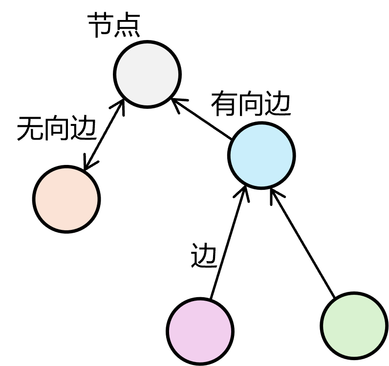
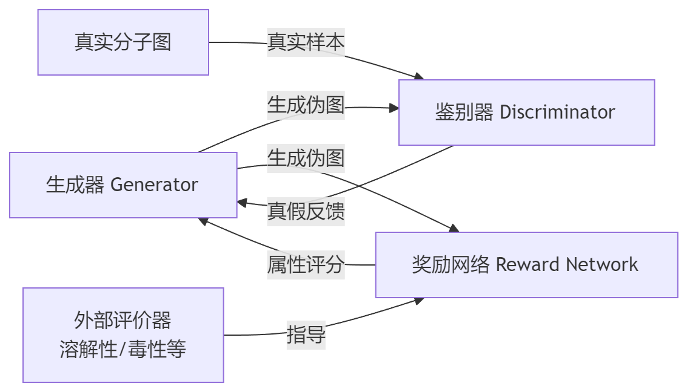

- [1.图是什么？](#1.图是什么？)
- [2.什么是图神经网络？](#2.什么是图神经网络？)
- [3.如何进行消息聚合？](#3.如何进行消息聚合？)
- [4.如何进行消息更新？](#4.如何进行消息更新？)
- [5.如何进行重复（获取远端邻居的信息）？](#5.如何进行重复（获取远端邻居的信息）？)
- [6.什么是图卷积网络？](#6.什么是图卷积网络？)
- [7.怎么基于空间构建图卷积神经网络？](#7.怎么基于空间构建图卷积神经网络？)
- [8.怎么基于谱构建图卷积神经网络？](#8.怎么基于谱构建图卷积神经网络？)
- [9.为什么基于空间的图卷积网络成为了主流？](#9.为什么基于空间的图卷积网络成为了主流？)
- [10.什么是图注意力网络？](#10.什么是图注意力网络？)
- [11.什么是图自动编码器？](#11.什么是图自动编码器？)
- [12.什么是图生成网络？](#12.什么是图生成网络？)
- [13.什么是图时空网络？](#13.什么是图时空网络？)
- [14.为什么要在图神经网络中引入度矩阵？](#14.为什么要在图神经网络中引入度矩阵？)
- [15.GAT和GATv2有什么差别？](#15.GAT和GATv2有什么差别？)
- [16.有没有其他提高图注意力层表达能力的方法？](#16.有没有其他提高图注意力层表达能力的方法？)

<h2 id='1.图是什么？'>1.图是什么？</h2>

#### 1. 图的定义

**图**是一种用于表示实体之间关系的数据结构，由两个基本元素组成：

- **节点**：表示实体，如用户、产品等

- **边**：表示节点之间的连接/关系，如关注，购买等关系



#### 2. 图的分类

图中两个节点之间既有可能是有向的，比如只能从节点$v_1$到$v_2$；也有可能是无向的，即$v_1$和$v_2$互通。

| 类型 | 特点 | 示例 |
|------|------|------|
| **无向图** | 边没有方向，连接是双向的 | 朋友关系（互为朋友） |
| **有向图** | 边有方向，可以是单向或双向 | 关注关系（A关注B，B不一定关注A） |

#### 3. 图的表示

图通常用$G=(V,E)$来表示，其中$V$表示节点的集合，$E$表示边的集合。

| 符号 | 含义 | 说明 |
|------|------|------|
| $V$ | 节点集合 | 表示图的规模 |
| $E$ | 边集合 | 描述节点间的连接关系 |

其中，每个节点$v_i$通常关联一个特征矩阵$x_{v_i}$，而每条边$e_i=(v_i,v_j)$也关联一个特征向量$x_{e_{ij}}$和邻接值$a_{ij}$。因此，一个图$G=(V,E)$通过节点特征矩阵$X_V$、边特征矩阵$X_E$和邻接矩阵$A$来完整描述节点属性、边属性及拓扑结构。

| 符号 | 维度 | 说明 |
|------|------|------|
| **节点特征矩阵$X_V$** | $R^{N×F}$ | $N$个节点，每个节点有$F$维特征（如用户属性、原子特征）|
| **边特征矩阵$X_E$** | $R^{M×D}$ | $M$条边，每条边有$D$维特征（如权重，关系类型） |
| **邻接矩阵$A$** | $R^{N×N}$ | 表示节点连接关系，$a_{ij}=1$表示两节点相连 |

#### 4.图的特征

- 非欧几里得结构：节点间无序，相邻点数量可变；

- 异构性：图的规模和密度，以及节点特征差异可以极大。

#### 5. 图的应用

a) **社交网络**：节点=用户，边=好友/关注关系
b) **电商推荐**：节点=用户/商品，边=购买/浏览行为
c) **生物信息学**：节点=蛋白质/基因，边=相互作用关系
d) **分子结构**：节点=原子，边=化学键
e) **知识图谱**：节点=实体，边=语义关系


<h2 id='2.什么是图神经网络？'>2.什么是图神经网络？</h2>

#### 1. 图神经网络的定义

**图神经网络（GNN）**是一类专门用于处理图结构数据的深度学习模型。它能够学习**节点**、**边**以及**整个图**的特征表示，从而完成各种预测任务。**图神经网络（GNN）**的核心是通过不断**问邻居节点要信息**，把每个节点变成一个既包含自身特征、又包含周围环境信息的向量，方便后续做预测。

#### 2. 图神经网络的必要性

传统的深度学习模型主要处理规则的网格数据（如图像）和序列数据（如文本、时间序列），但现实中很多数据是非欧几里得结构的图数据，节点数量不固定、邻居关系不规则。

#### 3. 图神经网络的核心机制 - 消息传递

**图神经网络（GNN）**实现**问邻居节点要信息**的核心机制是**邻居聚合**。该流程如下：

a) 聚合：收集邻居节点的信息；

b) 更新：结合自身特征和邻居信息，更新节点的表示；

c) 重复：经过多层传播，节点可以收到更远邻居的信息。

#### 4. 图神经网络的分类

根据聚合和更新方式，图神经网络通常分为以下几类

| 模型 | 全称 | 特点 |
|------|------|------|
| GCN | Graph Convolutional Network | 图卷积，对邻居特征加权平均 |
| GAT | Graph Attention Network | 引入注意力机制，自动学习邻居重要性 |
| GraphSAGE | Graph Sample and Aggregate | 采样邻居，支持归纳学习（新节点） |
| GIN | Graph Isomorphism Network | 理论表达能力强，可区分不同图结构 |
| MPNN | Message Passing Neural Network | 一的消息传递框架 |

#### 5. 图神经网络的主要任务

| 任务类型 | 描述 | 应用示例 |
|------|------|------|
| 节点分类 | 预测节点的类别 | 社交网络的用户分类 |
| 链接预测 | 预测两个节点之间是否存在边 | 推荐系统 |
| 图分类 | 预测整个图的类别 | 分子属性预测 |
| 图生成 | 生成新的图结构 | 场景图生成 |


<h2 id='3.如何进行消息聚合？'>3.如何进行消息聚合？</h2>

**消息聚合**：对于每个节点 $v$，收集其邻域节点 $N(v)$ 的特征信息，生成聚合消息 $m$。

- 通用的消息聚合方式包括**求和**，**均值**和**最大值**。

- **求和**保留邻域的完整信息量（领域大小敏感），适合需要区分不同大小邻域的任务，例如：分子中某原子连接的官能团数量；

- **均值**计算邻域特征的平均水平，适合节点分类任务，例如：社交网络中判断用户类型；

- **最大值**只提取邻域中最显著的特征，丢失大量信息，适合检测是否存在某种特定邻居，例如：缺陷检测。

#### 1. 求和（Sum）

$$
m_i = \sum_{v_j \in N(v_i)} \text{ReLU}(W \cdot x_{v_j} + b)
$$

#### 2. 均值（Mean）

$$
m_i = \frac{1}{|N(v_i)|} \sum_{v_j \in N(v_i)} x_{v_j}
$$

#### 3. 最大值（Max Pooling）

$$
m_i = \max_{v_j \in N(v_i)} \{x_{v_j}\}
$$

---

**符号说明：**

| 符号 | 含义 |
|------|------|
| $x_{v_j}$ | 邻域节点 $v_j$ 的隐藏状态 |
| $N(v_i)$ | 节点 $v_i$ 的邻居集合 |
| $W$ | 可学习的权重矩阵 |
| $b$ | 可学习的偏置向量 |


**注：不同的GNN模型使用不同的聚合函数，会在具体模型架构处讲解**


<h2 id='4.如何进行消息更新？'>4.如何进行消息更新？</h2>

利用聚合得到的消息 $m_i$ 和当前节点的旧状态 $h_i^{(l)}$，更新节点的隐藏状态：

$$
x_{v_i}^{(t+1)} = \sigma(x_{v_i}^{(t)} \oplus m_i)
$$

**符号说明：**

| 符号 | 含义 |
|------|------|
| $x_{v_i}^{(t)}$ | 节点 $i$ 在第 $t$ 层的隐藏状态 |
| $x_{v_i}^{(t+1)}$ | 节点 $i$ 在第 $t+1$ 层的更新后状态 |
| $m_i$ | 从邻域聚合得到的消息 |
| $\sigma$ | 激活函数（如 ReLU、Sigmoid） |
| $\oplus$ | 拼接（Concatenation）或线性变换操作 |


<h2 id='5.如何进行重复（获取远端邻居的信息）？'>5.如何进行重复（获取远端邻居的信息）？</h2>

每一层 GNN 只能聚合直接邻居的信息。通过堆叠多层，信息可以逐层传递，从而获取更远邻居的信息。

$$
x_{v_i}^{(t+1)} = \sigma\left(x_{v_i}^{(t)} \oplus \text{AGG}\left(\{x_{v_j}^{(t)} : v_j \in N(v_i)\}\right)\right)
$$

**符号说明：**

| 符号 | 含义 |
|------|------|
| AGG | 表示消息聚合操作 |

```
第 0 层（初始）：每个节点只有自己的特征
     A ← 只知道自己

第 1 层：A 聚合直接邻居（1-hop）
     A ← B, C, D（A 的直接邻居）

第 2 层：A 再次聚合邻居，但此时邻居 B, C, D 已经包含了它们各自邻居的信息
     A ← B(含E,F), C(含G), D(含H,I)相当于 A 间接获得了 2-hop 邻居（E, F, G, H, I）的信息
````


<h2 id='6.什么是图卷积网络？'>6.什么是图卷积网络？</h2>

#### 1. 图卷积网络（GCN）的定义

**图卷积网络**将**卷积运算**从传统数据（例如图像）推广到**图数据**。其核心思想是学习一个函数映射 $f$，通过该映射图中的节点 $v_i$ 可以聚合它自己的特征 $x_{v_i}$ 与它的邻居特征 $x_{v_j}$（$v_j \in N(v_i)$）来生成节点 $v_i$ 的新表示。

#### 2. 图卷积网络（GCN）与卷积网络（CNN）的联系

当图卷积网络的算法在节点层次运行时，图池化模块可以与图卷积层交错，将图粗化为高级子结构。

```
# GCN
原始图 → 图卷积层 → 图池化层 → 图卷积层 → 图池化层 → ... → 图级表示 → 分类结果(聚合邻居特征) (合并节点)  (聚合邻居特征) (合并节点)

# CNN
输入图像 → 卷积层 → 池化层 → 卷积层 → 池化层 → ... → 全连接层 → 分类结果
           (提取特征)  (缩小尺寸)  (提取特征)  (缩小尺寸)
```

#### 2. 图卷积网络（GCN）的分类

| 类别 | 核心思想 |
|------|----------|
| **基于谱（Spectral-based）** | 从图信号处理的角度引入滤波器来定义图卷积，图卷积操作被解释为从图信号中去除噪声 |
| **基于空间（Spatial-based）** | 将图卷积表示为从邻域聚合特征信息 |


<h2 id='7.怎么基于空间构建图卷积神经网络？'>7.怎么基于空间构建图卷积神经网络？</h2>

#### 1. 图像可以看作特殊的图


- **图像**（左）：每个像素是一个节点，像素与相邻像素连接，是一个规则的网络结构，拥有固定的邻居数量。

- **图**（右）：每个节点是一个实体，节点与邻居节点连接，具有不规则的拓扑结构，且邻居数量不固定。

#### 2. 基于空间的图卷积核心思想

采用基本的消息传递方式，即**邻居聚合**。

a) 聚合：收集邻居节点的信息；

b) 更新：结合自身特征和邻居信息，更新节点的表示；

c) 重复：经过多层传播，节点可以收到更远邻居的信息。   

PYTHON可以直接采用``` from torch_geometric.nn import GCNConv```调用。

#### 3.多图叠加原理

根据参数共享的机制，分为Composition和Recurrent-based。前者每层有独立参数（W1 → W2 → Wn），后者所有层共享参数（W → W → W）。


<h2 id='8.怎么基于谱构建图卷积神经网络？'>8.怎么基于谱构建图卷积神经网络？</h2>

#### 1.基本原理
图卷积 = 先用特征向量矩阵 U 把信号变换到谱域，在谱域做滤波（逐元素乘），再用 U 变换回来。核心公式：$Y = U g_\theta U^T X$

#### 2.实现流程

**a) 正则化拉普拉斯矩阵构造**

对于无向图，我们定义**正则化图拉普拉斯矩阵**：

$$L = I_n - D^{-\frac{1}{2}} A D^{-\frac{1}{2}}$$

其中：

| 符号 | 含义 |
|------|------|
| $I_n$ | $n \times n$ 单位矩阵 |
| $A$ | 邻接矩阵（谁和谁相连） |
| $D$ | 度矩阵，$D_{ii} = \sum_j A_{ij}$（每个节点连了几条边） |

- 正则化拉普拉斯矩阵是**实对称半正定**的。（特征值非负且正交）

**b) 特征分解**

$$L = U \Lambda U^T$$

其中：

| 符号 | 含义 | 维度 |
|:---:|:---|:---:|
| $U$ | 特征向量矩阵，列向量是 $L$ 的特征向量 | $n \times n$ |
| $\Lambda$ | 对角矩阵，对角线是特征值 $\lambda_0, \lambda_1, ..., \lambda_{n-1}$ | $n \times n$ |
| $U^T$ | $U$ 的转置，由于正交性 $U^T = U^{-1}$ | $n \times n$ |

**c) 图傅里叶变换**

- 图傅里叶变换：$$\hat{X} = U^T X$$

- 图傅里叶反变换：$$X = U \hat{X}$$

| 操作 | 公式 | 含义 |
|:---:|:---:|:---|
| 傅里叶变换 | $\hat{X} = U^T X$ | 把图信号投影到特征向量构成的正交空间 |
| 傅里叶反变换 | $X = U \hat{X}$ | 从正交空间变回原始空间 |

**d) 图卷积**

$$X^{t+1} = U(U^T X^t \odot U^T g)$$

```
    步骤1: U^T X        → 把信号 X 变换到谱域
    步骤2: U^T g        → 把滤波器 g 变换到谱域  
    步骤3: (·) ⊙ (·)   → 在谱域做逐元素相乘（滤波）
    步骤4: U(·)         → 变换回原始域
```

#### 3.基于滤波器分类

根据滤波器的不同，GCN又分为不同的子类。
| 模型 | 滤波器 $g_\theta$ | 特点 |
|:---:|:---:|:---|
| Spectral CNN | $g_\theta = \text{diag}(\theta_1, ..., \theta_n)$ | 直接学习 n 个参数，计算量大 |
| ChebNet | $g_\theta = \sum_{k=0}^{K} \theta_k T_k(\tilde{\Lambda})$ | 用切比雪夫多项式近似，K 阶局部化 |
| GCN | $g_\theta = \theta(I + D^{-1/2} A D^{-1/2})$ | ChebNet 的一阶简化版 |
| AGCN | 自适应学习图结构 | 可以学习隐藏的图关系 |

#### 4.缺点

- **需要加载整个图**：导致算法的复杂度在$$O(n^3)$$。

| 操作 | 复杂度 | 问题 |
|:---:|:---:|:---|
| 计算 L 的特征分解 | $O(n^3)$ | n 大时极慢 |
| 存储 U 矩阵 | $O(n^2)$ | 内存爆炸 |
| 矩阵乘法 $U^T X$ | $O(n^2)$ | 每次前向传播都要算 |


<h2 id='9.为什么基于空间的图卷积网络成为了主流？'>9.为什么基于空间的图卷积网络成为了主流？</h2>

#### 1. 谱方法

- 优点：

	- 理论基础扎实 - 基于图信号处理理论，具有数学可解释性。例子：可以用傅里叶变换解释为什么卷积能提取图的局部特征，类似于信号处理中的频域分析。

- 缺点：

	- 效率低 - 需要计算特征向量分解（须同时处理整个图），计算成本随图规模急剧增加，难以应用于大型图。例子：在100万节点的社交网络上，需要对100万×100万的拉普拉斯矩阵做特征分解，计算时间可能需要数小时甚至数天。

	- 通用性差：假设固定图结构，在节点级别无法灵活共享权重，添加新节点困难，难以跨图迁移。例子：在引文网络Cora（2708个节点）上训练的模型，无法直接应用到引文网络Citeseer（3327个节点），也无法处理新发表的论文节点。
	
	- 灵活性受限：有向图的拉普拉斯矩阵没有明确定义，只能处理无向图，需要将有向图转换为无向图。例子：Twitter关注网络中，A关注B但B不关注A（有向边），谱方法必须将其转换为A和B互相关注（无向边），丢失了方向信息。

#### 2. 空间方法

- 优点：

	- 效率高 - 直接在图域聚合邻居节点，支持批量计算和采样技术，可扩展到大规模图。例子：在Facebook好友网络（数十亿节点）上，可以只对每个节点采样20个邻居进行聚合，而不需要处理整个图。
	
	- 通用性强 - 局部卷积操作，易于在不同位置和结构间共享权重，支持动态添加节点，可跨图应用。例子：在Cora数据集上训练的GCN模型，可以直接应用到Citeseer上；电商平台新上架商品时，可以立即根据其属性和关联预测类别，无需重新训练。

	- 灵活性好：聚合函数可灵活设计，不依赖于图的谱特性，支持有向图和多源输入。例子：在知识图谱中，可以区分处理"导演→电影"和"演员→电影"两种不同类型的有向边，使用不同的聚合权重；在推荐系统中，可以同时聚合用户的购买历史、浏览记录、社交关系等多源信息。

#### 3. 空间方法成为主流

- 在效率、通用性、灵活性三方面全面优于谱方法。例子：GraphSAGE、GAT、GIN等主流GNN模型都采用空间方法；工业界应用（如Pinterest的推荐系统、阿里巴巴的商品图网络）几乎全部使用空间方法。


<h2 id='10.什么是图注意力网络？'>10.什么是图注意力网络？</h2>

#### 1. 核心思想

- **引入注意力机制到图神经网络** ： 在聚合邻居信息时，自适应地为不同邻居分配不同的重要性权重，而非平等对待所有邻居。

#### 2. GAT（Graph attention network）

- 使用注意力函数 $α(·)$ 自适应控制邻居节点的贡献权重，并支持多头注意力在不同子空间学习权重。

$$h_i^t = σ(Σ α(h_i^{t-1}, h_j^{t-1}) W^{t-1} h_j^{t-1}) $$ # 单头

$$h_i^t = ||_k σ(Σ α_k(h_i^{t-1}, h_j^{t-1}) W_k^{t-1} h_j^{t-1})$$  # 多头

其中：

| 符号 | 含义 |
|------|:----:|
| $α(h_i^{t-1}, h_j^{t-1})$ | 注意力权重（标量，0-1之间） |
| $W^{t-1}$ | 权重矩阵（所有节点共享） |
| $σ$ | 激活函数 |

- 例子：

	- 论文引用网络中，被高引论文对当前论文的影响权重自动设置得更高
	
	- 社交网络中，密切好友的特征对用户表示的贡献更大

#### 2. GAAN（Gated Attention Network） 

- 在多头注意力基础上，引入门控机制；不同注意力头的权重不相等，通过自注意力自适应计算每个头的重要性。

$$h_i = Σ_k g_k · (Σ_j α_k(i,j) W_k h_j) $$ #  g_k 是第k个头的门控权重

- 例子：

	- 在知识图谱中，某些注意力头专注于"类别关系"，某些专注于"属性关系"，GAAN自动学习哪类关系对当前任务更重要。

	- 推荐系统中，不同头关注用户的不同兴趣维度（价格敏感、品牌偏好等），门控机制决定当前预测时哪个维度更关键。

#### 3. GAM（Graph Attention Model）

- 使用LSTM + 注意力机制，序列化访问重要节点，优先访问高优先级邻居并聚合信息。

$$h_t = LSTM(h_{t-1}, f_s(h_{t-1}, G))$$

其中：

| 符号 | 含义 |
|------|:----:|
|  $f_s$ | 选择函数 |
| $G$ | 整个图结构 |
| $LSTM(·)$ | 长短期记忆网络 |

- 例子：

	- 分子性质预测中，先访问分子的活性中心（如羟基、氨基），再逐步扩展到其他原子。

	- 社交网络社区检测中，从意见领袖开始，逐步访问有影响力的节点序列来判断社区类型。


<h2 id='11.什么是图自动编码器？'>11.什么是图自动编码器？</h2>

#### 1. 核心概念

- 将图结构数据映射到潜在空间；同时学习节点嵌入和图结构；基于图神经网络的编码器。

``` text
传统AutoEncoder:
图像 → 编码器 → 低维向量 → 解码器 → 重建图像

图AutoEncoder:
图 G → 编码器 → 节点嵌入 Z → 解码器 → 重建图结构
```

#### 2. 常见网络

|方法 | 编码器 | 解码器 | 重建目标 | 输入 | 特色 |
|:----:|:------:|:------:|:--------:|:----:|:----:|
| GAE | GCN | 内积 | 邻接矩阵A | A+X | 简单高效 |
| VGAE | GCN | 内积 | 邻接矩阵A | A+X | 变分推断，生成模型 |
| ARGA | GCN | 内积 | 邻接矩阵A | A+X | 对抗训练，规则嵌入 |
| DNGR | MLP | MLP | PPMI矩阵 | A | 解决稀疏性 |
| SDNE | MLP | MLP | 邻接矩阵A | A | 一阶+二阶近似 |
| NetRA | LSTM | LSTM | 随机游走序列 | A+X | 序列化图 |
| DRNE | LSTM | - | - | A+X | 递归聚合 |

#### 3. GAE实现代码

``` PYTHON
class GAE:
    def __init__(self, input_dim, hidden_dim, embedding_dim):
        # 两层GCN编码器
        self.gcn1 = GCNLayer(input_dim, hidden_dim)
        self.gcn2 = GCNLayer(hidden_dim, embedding_dim)
    
    def encode(self, A, X):
        # 第一层
        H = ReLU(self.gcn1(A, X))
        # 第二层（不用激活函数）
        Z = self.gcn2(A, H)
        return Z
    
    def decode(self, Z):
        # 内积解码器
        A_pred = sigmoid(Z @ Z.T)
        return A_pred
```

#### 4. 常见应用场景

| 方法 | 最适合的应用场景 |
|------|-----------------|
| GAE | 链接预测：Facebook好友推荐（预测用户A和用户B是否可能成为好友）<br>节点分类：论文分类（根据引用网络预测论文所属领域：AI、DB、CV等）|
| VGAE | 异常检测：信用卡欺诈检测（识别交易网络中的异常交易模式）<br>生成任务：分子生成（生成具有特定性质的新药物分子结构） |
| ARGA | 鲁棒推荐：电商商品推荐（在用户行为数据存在噪声时仍能准确推荐）<br>对抗性社区检测：识别社交网络中的真实社区（抵抗虚假账号干扰）|
| DNGR | 稀疏知识图谱：医疗知识图谱补全（疾病-症状-药物关系稀疏时的三元组预测）<br>冷启动推荐：新用户商品推荐（用户-商品交互数据极少的情况）|
| SDNE | 社交网络分析：微博10亿用户关系网络的社区发现<br>交通网络：全国高速公路网络的拥堵预测（保持邻近路段和远程连接） |
| NetRA | 时序推荐：视频App用户行为预测（根据用户观看历史序列推荐下一个视频）<br>动态社交网络：Twitter用户关注关系演化预测（预测未来关注趋势） |
| DRNE | 组织架构分析：公司组织结构中的职位推荐（基于层级关系）<br>生物分类树：物种分类预测（基于生物进化树的层次结构预测物种特性） |


<h2 id='12.什么是图生成网络？'>12.什么是图生成网络？</h2>

#### 1. 核心概念

- 图生成网络的目标是在给定一组观察到的图的情况下生成新的图。

#### 2. 常见网络

-  MolGAN（Molecular Generative Adversarial Networks）：将relational GCN、改进的GAN和强化学习（RL）集成在一起，生成具有所需属性的分子图。



| **组件** | **功能** | **目标** |
|:-----------------:|:----------------:|:-----------------:|
| 生成器 | 生成伪图及其特征矩阵 | 尽可能生成真实的分子图 |
| 鉴别器 | 区分真实图和生成图 | 识别伪造的分子结构 |
| 奖励网络 | 评估生成图的属性 | 鼓励生成具有特定属性的图 |

- DGMG（Deep Generative Models of Graphs）：利用空间图卷积网络递归生成节点和边。

	- 递归生成：每次添加一个节点。

	- 条件决策：基于当前图的表示决定下一步。

	- 动态更新：每次添加节点/边后更新图表示。


<h2 id='13.什么是图时空网络？'>13.什么是图时空网络？</h2>

#### 1. 核心概念

- 定义：图时空网络是同时捕捉空间相关性和时间相关性的深度学习模型，用于处理具有图结构且节点特征随时间动态变化的数据。

- 典型应用场景：
	- 交通预测：传感器网络监测道路交通速度
	- 人体动作识别：骨骼关节点的时空建模
	- 社交网络分析：用户行为的时空演化
	- 气象预测：气象站网络的时空数据
	
#### 2. 主要模型架构

- DCRNN (Diffusion Convolutional Recurrent Neural Network)：将扩散图卷积与GRU结合

``` text
    架构特点：
    ├── 空间建模：扩散卷积 (Diffusion Convolution)
    │   └── 模拟信息在图上的扩散过程
    ├── 时间建模：GRU (门控循环单元)
    │   └── 将扩散卷积嵌入GRU的矩阵运算中
    └── 编码器-解码器结构
        └── 用于序列到序列预测
```

- CNN-GCN：CNN处理时间 + GCN处理空间

``` text
    架构流程：
    时间维度 → 1D CNN (卷积提取时间特征)↓
    空间维度 → GCN (图卷积提取空间特征)
       ↓
    预测输出
```

- 其他架构：ST-GCN (Spatial Temporal Graph Convolutional Network)  ：统一的时空图卷积框架； Structural-RNN - 基于图结构的定制化RNN；Transformer for graphs等。


<h2 id='14.为什么要在图神经网络中引入度矩阵？'>14.为什么要在图神经网络中引入度矩阵？</h2>

#### 1. 基础图卷积公式

考虑到图卷积**消息传递**的基本思想，每个节点聚合邻居节点的特征，如公式：（$A$为邻接矩阵，$H$为节点特征矩阵。）

$$H^{(l+1)} = A H^{(l)} W^{(l)} $$

这种现象可能导致一个潜在问题：若图中存在特征显著的节点（如高度中心节点），与之相邻的节点在聚合信息时，可能会过度依赖于该中心节点的特征，而削弱来自其他邻居的影响，从而影响模型对不同结构信息的均衡学习，导致训练偏差或泛化能力下降。

因此，引入**度矩阵**来实现节点特征的**对称归一化**，如公式：($\tilde{D}$是度矩阵，)

$$
H^{(l+1)} = \tilde{D}^{-\frac{1}{2}} \tilde{A} \tilde{D}^{-\frac{1}{2}} H^{(l)} W^{(l)}
$$

####  2. 为什么是 $( D^{-\frac{1}{2}} A D^{-\frac{1}{2}} )$ ？

（1）图卷积在傅里叶域定义为用拉普拉斯特征向量基进行滤波。对称归一化拉普拉斯（如公式）的特征值范围在 [0,2] 之间。采用该算子的近似，有利于数值稳定。

$$
L_{\text{sym}} = I - D^{-\frac{1}{2}} A D^{-\frac{1}{2}}
$$

（2）$( D^{-\frac{1}{2}} A D^{-\frac{1}{2}} )$ 是对称矩阵，保留了图的对称性质，特征值为实数，便于分析。

（3）消息从节点 $(i) $发出时除以$(\sqrt{d_i})$（发送方度），传到节点$(j) $时再除以$(sqrt{d_j})$（接收方度），避免了某些高度节点过度主导传播过程。


<h2 id='15.GAT和GATv2有什么差别？'>15.GAT和GATv2有什么差别？</h2>

#### 1. from torch_geometric.nn import GATConv

GAT的注意力系数的计算公式如下：

$$e_{ij} = LeakyReLU( a^T * [ W * h_i || W * h_j ] )$$

- GAT先对节点特征 $h_i$和$h_j$进行线性变换并拼接，然后再用一个简单的线性层$a^T$加非线性激活来计算得分。一旦模型训练完成，对于固定的节点$j$来说，$a^TWh_j$是固定的，而$h_i$只能平移所有$e_ij$的值，而无法改变大小顺序，因此是静态注意力。 

#### 2. from torch_geometric.nn import GATv2Conv 

GATv2的注意力系数的计算公式如下：

$$e_{ij} = a^T * LeakyReLU( W * [ h_i || h_j ] )$$

- GATv2将查询节点和邻居节点的特征先拼接，然后一起进行线性变换和非线性激活，最后再与权重向量$a$作用。这使得$ h_i $能够与不同的$ h_j $进行复杂的、非线性的交互，从而动态地影响最终的注意力排序。

总结：GATv2通过将非线性激活函数插入到更早的计算阶段，将注意力机制从一个表达能力受限的线性模型，升级成了一个表达能力更强的非线性模型。


<h2 id='16.有没有其他提高图注意力层表达能力的方法？'>16.有没有其他提高图注意力层表达能力的方法？</h2>

#### 1.  非线性激活（原始做法）

采用LeakyReLU等非线性函数

$$e_{ij} = a^T * LeakyReLU( W * [ h_i || h_j ] )$$

#### 2. 多头注意力

$$
h_i^{(l+1)} = \Bigg\Vert_{k=1}^K \sigma\left( \sum_{j \in N(i)} \alpha_{ij}^k W_k h_j^{(l)} \right)
$$

#### 3. 更复杂的注意力函数

$$
e_{ij} = \frac{(W_Q h_i)^\top (W_K h_j)}{\sqrt{d}}
$$