# 目录

## 第一章 目标检测基础知识

### 【一】目标检测核心概念

* [1.目标检测中IOU的相关概念与计算](#1.目标检测中iou的相关概念与计算)

* [2.目标检测中NMS的相关概念与计算](#2.目标检测中nms的相关概念与计算)
* [3.One-stage目标检测与Two-stage目标检测的区别？](#3.one-stage目标检测与two-stage目标检测的区别？)
* [4.哪些方法可以提升小目标检测的效果？](#4.哪些方法可以提升小目标检测的效果？)
* [5.Focal Loss的作用？](#5.focal-loss的作用？)
* [6.什么是Soft-NMS，它与传统NMS的区别是什么?](#6.什么是Soft-NMS，它与传统NMS的区别是什么?)

* [7.什么是GIoU/DIoU/CIoU_Loss，它们为什么比IoU_Loss更好？](#7.什么是GIoU/DIoU/CIoU_Loss，它们为什么比IoU_Loss更好？)

* [8.请介绍下目标检测算法中基于Anchor based和Anchor free方法的区别？](#8.请介绍下目标检测算法中基于Anchor-based和Anchor-free方法的区别？)

* [9.YOLOv2中的anchor如何生成？](#9.yolov2中的anchor如何生成？)

* [10.什么是结构重参数化（Structural_Re-parameterization）？以RepVGG为例介绍一下。](#10.什么是结构重参数化（Structural_Re-parameterization）？以RepVGG为例介绍一下。)

* [11.介绍一下解耦头（Decoupled_Head）是什么？](#11.介绍一下解耦头（Decoupled_Head）是什么？)

* [12.什么是任务对齐学习（Task_Alignment_Learning,TAL）](#12.什么是任务对齐学习（Task_Alignment_Learning,TAL)

* [13.什么是动态头（Dynamic_Head,DyHead），它解决了什么问题？](#13.什么是动态头（Dynamic_Head,DyHead），它解决了什么问题？)

* [14.在目标检测训练中，"硬负样本挖掘（Hard_Negative_Mining）"为何关键？](#14.在目标检测训练中，"硬负样本挖掘（Hard_Negative_Mining）"为何关键？)

### 【二】目标检测评价指标

* [1.目标检测中AP，AP50，AP75，mAP等指标的含义](#1.目标检测中ap，ap50，ap75，map等指标的含义)
* [2.准确率(Precision)与召回率(Recall)的含义](#2.准确率(Precision)与召回率(Recall)的含义)

### 【三】目标检测优化策略

* [1.目标检测中的Test_Time_Augmentation(TTA)是什么？](#1.目标检测中的Test_Time_Augmentation(TTA)是什么？)

* [2.目标检测中常用的多尺度训练（Multi-scale_Training）策略是什么？](#2.目标检测中常用的多尺度训练（Multi-scale_Training）策略是什么？)

* [3.自适应训练样本分配（ATSS）是什么？](#3.自适应训练样本分配（ATSS）是什么？)
* [4.介绍一下SimOTA标签分配方法？](#4.介绍一下SimOTA标签分配方法？)

* [5.介绍一下DFL？](#5.介绍一下DFL？)

* [6.介绍一下WBF？](#6.介绍一下WBF？)
* [7.介绍一下TAL(Task_Alignment-Learning)？](#7.介绍一下TAL(Task_Alignment-Learning)？)

* [8.什么是PANet（Path_Aggregation_Network），它如何增强特征融合？](#8.什么是PANet（Path_Aggregation_Network），它如何增强特征融合？)

* [9.什么是Cascade_R-CNN，它解决了什么问题？](#9.什么是Cascade_R-CNN，它解决了什么问题？)

* [10.在目标检测中，“少样本／零样本检测（Few-Shot/Zero-Shot_Object_Detection）”是什么？](#10.在目标检测中，“少样本／零样本检测（Few-Shot/Zero-Shot_Object_Detection）”是什么？)

* [11.旋转目标检测（Oriented_BBox，OBB）为何重要？](#11.旋转目标检测（Oriented_BBox，OBB）为何重要？)

* [12.你知道哪些边缘端部署的方案？](#12.你知道哪些边缘端部署的方案？)

* [13.目标检测模型训练中，为何要使用Warmup策略，它解决了什么问题？](#13.目标检测模型训练中，为何要使用Warmup策略，它解决了什么问题？)

* [14.什么是SAHI（Slicing Aided Hyper Inference），它是如何解决高分辨率小目标检测难题的？](#14.什么是SAHI（Slicing Aided Hyper Inference），它是如何解决高分辨率小目标检测难题的？)

## 第二章 YOLO系列核心

### 【一】YOLO系列基础

* [1.YOLO系列的面试问题](#1.yolo系列的面试问题)
* [2.介绍下YOLOv5中的CSP结构？](#2.介绍下YOLOv5中的CSP结构？)
* [3.介绍下YOLOv5中的SPP结构?](#3.介绍下YOLOv5中的SPP结构?)
* [4.请介绍下YOLOv5中的Focus操作？](#4.请介绍下YOLOv5中的Focus操作？)
* [5.介绍一下RT-DETR及其与YOLO系列的区别？](#5.介绍一下RT-DETR及其与YOLO系列的区别？)
* [6.介绍一下RTMDet(Real-Time_Model_for_Object_Detection)？](#6.介绍一下RTMDet(Real-Time_Model_for_Object_Detection)？)
* [7.介绍一下YOLOv9的核心创新：可编程梯度信息（PGI）和GELAN？](# 7.介绍一下YOLOv9的核心创新：可编程梯度信息（PGI）和GELAN？)
* [8.YOLOv10是如何实现NMS-Free（无需非极大值抑制）的端到端检测的？](#8.YOLOv10是如何实现NMS-Free（无需非极大值抑制）的端到端检测的？)
* [9.介绍一下YOLOv11的核心改进点（相对于YOLOv8/v10）？](#9.介绍一下YOLOv11的核心改进点（相对于YOLOv8/v10）？)

### 【二】YOLO系列组件

* [1.FPN(Feature Pyramid Network)的相关知识](#1.fpnfeature-pyramid-network的相关知识)

* [2.SPP(Spatial Pyramid Pooling)的相关知识](#2.sppspatial-pyramid-pooling的相关知识)
* [3.FPN网络的主要作用是什么？](#3.FPN网络的主要作用是什么？)

## 第三章 DETR系列核心

### 【一】DETR系列基础

* [1.请介绍一下DETR？](#1.请介绍一下DETR？)

* [2.请介绍一下DINO？](#2.请介绍一下DINO？)
* [3.请介绍一下Deformable_DETR？](#3.请介绍一下Deformable_DETR？)
* [4.什么是DETR中的Hungarian_Matching(匈牙利匹配)?](#4.什么是DETR中的Hungarian_Matching(匈牙利匹配)?)
* [5.Transformer中的自注意力机制（Self-Attention）与目标检测中的全局特征融合有何关联？为什么说DETR能够实现End-to-End检测？](#5.Transformer中的自注意力机制（Self-Attention）与目标检测中的全局特征融合有何关联？为什么说DETR能够实现End-to-End检测？)
* [6.什么是Co-DETR，它是如何利用混合标签分配提升DETR性能的？](#6.什么是Co-DETR，它是如何利用混合标签分配提升DETR性能的？)

### 【二】目标检测扩展

* [1.介绍一下DiffusionDet？](#1.介绍一下DiffusionDet？)

* [2.什么是Sparse R-CNN？它作为连接Dense和Set Prediction的桥梁有何意义？](#2.什么是Sparse R-CNN？它作为连接Dense和Set Prediction的桥梁有何意义？)

## 第四章 其他经典模型和Backbone

## 【一】经典模型

* [1.有哪些经典的轻量型人脸检测模型？](#1.有哪些经典的轻量型人脸检测模型？)

* [2.LFFD人脸检测模型的结构和特点？](#2.lffd人脸检测模型的结构和特点？)

* [3.请介绍ROIPooling？](#3.请介绍ROIPooling？)

* [4.请介绍ROIAlign？](#4.请介绍ROIAlign？)
* [5.介绍一下CenterNet的原理，它与传统的目标检测有什么不同点？](#5.介绍一下CenterNet的原理，它与传统的目标检测有什么不同点？)

* [6.CenterNet中heatmap（热力图）如何生成？](#6.CenterNet中heatmap（热力图）如何生成？)

* [7.介绍一下SSD算法？](#7.介绍一下SSD算法？)

* [8.介绍一下FCOS及其核心思想？](#8.介绍一下FCOS及其核心思想？)

* [9.请简述RetinaNet的主要思想，它是如何有效结合One-stage速度和Two-stage精度优势的？](#9.请简述RetinaNet的主要思想，它是如何有效结合One-stage速度和Two-stage精度优势的？)

* [10.在 Faster R-CNN 中，Region Proposal Network (RPN) 的作用是什么？它如何实现端到端训练？](#10.在 Faster R-CNN 中，Region Proposal Network (RPN) 的作用是什么？它如何实现端到端训练？)

## 【二】Backbone

* [1.介绍一下介绍目标检测中常用的经典CNN_Backbone？](#1.介绍一下介绍目标检测中常用的经典CNN_Backbone？)

* [2.介绍一下目标检测中常用的轻量级Backbone？](#2.介绍一下目标检测中常用的轻量级Backbone？)
* [3.介绍一下目标检测中Transformer-based和新兴Backbone？以及如何选择](#3.介绍一下目标检测中Transformer-based和新兴Backbone？以及如何选择)
* [4.除了CNN和Transformer，目标检测领域还有哪些新兴的Backbone设计趋势？请简要介绍一个。](#4.除了CNN和Transformer，目标检测领域还有哪些新兴的Backbone设计趋势？请简要介绍一个。)
* [5.视觉Mamba（Vision Mamba/VMamba）相比传统CNN和Transformer在目标检测中有什么潜在优势？](#5.视觉Mamba（Vision Mamba/VMamba）相比传统CNN和Transformer在目标检测中有什么潜在优势？)
* [6.掩码图像建模（MIM，如MAE）预训练为何比分类预训练更适合目标检测？](#6.掩码图像建模（MIM，如MAE）预训练为何比分类预训练更适合目标检测？)

## 第五章 前沿检测技术

## 【一】开放词汇目标检测

[1.介绍一下GLIP（Grounded Language-Image Pre-training）及其如何将检测重构为短语定位问题？](#1.介绍一下GLIP（Grounded Language-Image Pre-training）及其如何将检测重构为短语定位问题？)

[2.介绍一下YOLO-World？](#2.介绍一下YOLO-World？)

[3.介绍一下Grounding DINO？](#3.介绍一下Grounding DINO？)

## 【二】开放世界目标检测

[1.开放词汇检测 (OVD) 与开放世界检测 (OWD) 有什么本质区别？](#1.开放词汇检测 (OVD) 与开放世界检测 (OWD) 有什么本质区别？)

[2.什么是 ORE？它旨在解决什么问题，核心机制是什么？](#2.什么是 ORE？它旨在解决什么问题，核心机制是什么？)

[3.开放世界检测（OWD）中，如何区分“未知目标（Unknown）”和“背景（Background）”？](#3.开放世界检测（OWD）中，如何区分“未知目标（Unknown）”和“背景（Background）”？)

[4.介绍一下OW-DETR？它相比于基于Faster_R-CNN的ORE有什么优势？](#4.介绍一下OW-DETR？它相比于基于Faster_R-CNN的ORE有什么优势？)

[5.在开放世界检测中，什么是“灾难性遗忘（Catastrophic_Forgetting）”，通常如何解决？](#5.在开放世界检测中，什么是“灾难性遗忘（Catastrophic_Forgetting）”，通常如何解决？)

## 【三】视觉提示与交互式检测

[1.什么是T-Rex模型？它是如何通过“视觉提示（Visual_Prompting）”实现通用物体检测的？](#1.什么是T-Rex模型？它是如何通过“视觉提示（Visual_Prompting）”实现通用物体检测的？)

[2.相比于文本提示（如GLIP），视觉提示（Visual_Prompting）在目标检测中有什么独特优势？](#2.相比于文本提示（如GLIP），视觉提示（Visual_Prompting）在目标检测中有什么独特优势？)

[3.介绍一下SEEM（Segment_Everything_Everywhere_All_at_Once）？它支持哪些类型的交互提示？](#3.介绍一下SEEM（Segment_Everything_Everywhere_All_at_Once）？它支持哪些类型的交互提示？)

# 第一章 目标检测基础知识

## 【一】目标检测核心概念


<h2 id="1.目标检测中iou的相关概念与计算">1.目标检测中IOU的相关概念与计算</h2>

IoU（Intersection over Union）即交并比，是目标检测任务中一个重要的模块，其是<font color=DeepSkyBlue>GT bbox与pred bbox交集的面积 / 二者并集的面积</font>。


下面我们用坐标（top，left，bottom，right），即左上角坐标，右下角坐标。从而可以在给定的两个矩形中计算IOU值。

```
def compute_iou(rect1,rect2):
  # (y0,x0,y1,x1) = (top,left,bottom,right)
  S_rect1 = (rect1[2] - rect1[0]) * (rect1[3] - rect1[1])
  S_rect2 = (rect2[2] - rect2[0]) * (rect2[3] - rect1[1])

  sum_all = S_rect1 + S_rect2
  left_line = max(rect1[1],rect2[1])
  right_line = min(rect1[3],rect2[3])
  top_line = max(rect1[0],rect2[0])
  bottom_line = min(rect1[2],rect2[2])

  if left_line >= right_line or top_line >= bottom_line:
    return 0
  else:
    intersect = (right_line - left_line) * (bottom_line - top_line)
    return (intersect / (sum_area - intersect)) * 1.0
```


<h2 id="2.目标检测中nms的相关概念与计算">2.目标检测中NMS的相关概念与计算</h2>

在目标检测中，我们可以利用非极大值抑制（NMS）对生成的大量候选框进行后处理，去除冗余的候选框，得到最具代表性的结果，以加快目标检测的效率。

如下图所示，消除多余的候选框，找到最佳的bbox：


<font color=DeepSkyBlue>非极大值抑制（NMS）流程：</font>

1. 首先我们需要设置两个值：一个Score的阈值，一个IOU的阈值。

2. 对于每类对象，遍历该类的所有候选框，过滤掉Score值低于Score阈值的候选框，并根据候选框的类别分类概率进行排序：$A < B < C < D < E < F$。

3. 先标记最大概率矩形框F是我们要保留下来的候选框。

4. 从最大概率矩形框F开始，分别判断A～E与F的交并比（IOU）是否大于IOU的阈值，假设B、D与F的重叠度超过IOU阈值，那么就去除B、D。

5. 从剩下的矩形框A、C、E中，选择概率最大的E，标记为要保留下来的候选框，然后判断E与A、C的重叠度，去除重叠度超过设定阈值的矩形框。

6. 就这样重复下去，直到剩下的矩形框没有了，并标记所有要保留下来的矩形框。

7. 每一类处理完毕后，返回步骤二重新处理下一类对象。

```
import numpy as np

def py_cpu_nms(dets, thresh):
  #x1、y1（左下角坐标）、x2、y2（右上角坐标）以及score的值
  x1 = dets[:, 0]
  y1 = dets[:, 1]
  x2 = dets[:, 2]
  y2 = dets[:, 3]
  scores = dets[:, 4]

  #每一个候选框的面积
  areas = (x2 - x1 + 1) * (y2 - y1 + 1)
  #按照score降序排序（保存的是索引）
  order = scores.argsort()[::-1]

  keep = []
  while order.size > 0:
    i = order[0]
    keep.append(i)
    #计算当前概率最大矩形框与其他矩形框的相交框的坐标，会用到numpy的broadcast机制，得到向量
    xx1 = np.maximum(x1[i], x1[order[1:]])
    yy1 = np.maximum(y1[i], y1[order[1:]])
    xx2 = np.minimum(x2[i], x2[order[1:]])
    yy2 = np.minimum(y2[i], y2[order[1:]])

    #计算相交框的面积，注意矩形框不相交时w或h算出来会是负数，用0代替
    w = np.maximum(0.0, xx2 - xx1 + 1)
    h = np.maximum(0.0, yy2 - yy1 + 1)
    inter = w * h
    #计算重叠度IOU：重叠面积 / （面积1 + 面积2 - 重叠面积）
    ovr = inter / (areas[i] + areas[order[1:]] - inter)

    #找到重叠度不高于阈值的矩形框索引
    inds = np.where(ovr < thresh)[0]
    # 将order序列更新，由于前面得到的矩形框索引要比矩形框在原order序列中的索引小1，所以要加1操作
    order = order[inds + 1]

  return keep
```


<h2 id="3.one-stage目标检测与two-stage目标检测的区别？">3.One-stage目标检测与Two-stage目标检测的区别？</h2>

<font color=DeepSkyBlue>Two-stage目标检测算法</font>：先进行区域生成（region proposal，RP）（一个有可能包含待检物体的预选框），再通过卷积神经网络进行样本分类。其精度较高，速度较慢。

主要逻辑：特征提取—>生成RP—>分类/定位回归。

常见的Two-stage目标检测算法有：Faster R-CNN系列和R-FCN等。

<font color=DeepSkyBlue>One-stage目标检测算法</font>：不用RP，直接在网络中提取特征来预测物体分类和位置。其速度较快，精度比起Two-stage算法稍低。

主要逻辑：特征提取—>分类/定位回归。

常见的One-stage目标检测算法有：YOLO系列、SSD和RetinaNet等。


<h2 id="4.哪些方法可以提升小目标检测的效果？">4.哪些方法可以提升小目标检测的效果？</h2>

1. 提高图像分辨率。小目标在边界框中可能只包含几个像素，那么能通过提高图像的分辨率以增加小目标的特征的丰富度。

2. 提高模型的输入分辨率。这是一个效果较好的通用方法，但是会带来模型inference速度变慢的问题。

3. 平铺图像。


4. 数据增强。小目标检测增强包括随机裁剪、随机旋转和镶嵌增强等。

5. 自动学习anchor。

6. 类别优化。


<h2 id="5.focal-loss的作用？">5.Focal Loss的作用？</h2>

<font color=DeepSkyBlue>Focal Loss是解决了分类问题中类别不均衡、分类难度差异的一个损失函数，使得模型在训练过程中更加聚焦在困难样本上。</font>

Focal Loss是从二分类问题出发，同样的思想可以迁移到多分类问题上。

我们知道二分类问题的标准loss是**交叉熵**：


对于二分类问题我们也几乎适用sigmoid激活函数$\hat{y} = \sigma(x)$，所以上面的式子可以转化成：


这里有$1 - \sigma(x) = \sigma(-x)$。

Focal Loss论文中给出的式子如下：


其中$y\in \{ 1,-1\}$是真实标签，$p\in[0,1]$是预测概率。

我们再定义$p_{t}:$


那么，上面的交叉熵的式子可以转换成：


有了上面的铺垫，最初Focal Loss论文中接着引入了**均衡交叉熵函数**：


针对类别不均衡问题，在Loss里加入一个控制权重，对于属于少数类别的样本，增大$\alpha_{t}$即可。<font color=DeepSkyBlue>但这样有一个问题，它仅仅解决了正负样本之间的平衡问题，并没有区分易分/难分样本</font>。

**为什么上述公式只解决正负样本不均衡问题呢？**

因为增加了一个系数$\alpha_{t}$，跟$p_{t}$的定义类似，当$label=1$的时候$\alpha_{t}=\alpha$ ;当$label=-1$的时候，$\alpha_{t}= 1 - \alpha$，$\alpha$的范围也是$[0,1]$。因此可以通过设定$\alpha$的值（如果$1$这个类别的样本数比$-1$这个类别的样本数少很多，那么$\alpha$可以取$0.5$到$1$来增加$1$这个类的样本的权重）来控制正负样本对整体Loss的贡献。

<h3 id="focal-loss">Focal Loss</h3>

为了可以区分难/易样本，Focal Loss雏形就出现了：


$(1 - p_{t})^{\gamma}$用于平衡难易样本的比例不均，$\gamma >0$起到了对$(1 - p_{t})$的放大作用。$\gamma >0$减少易分样本的损失，使模型更关注于困难易错分的样本。例如当$\gamma =2$时，模型对于某正样本预测置信度$p_{t}$为$0.9$，这时$(1 - 0.9)^{\gamma} = 0.01$，也就是FL值变得很小；而当模型对于某正样本预测置信度$p_{t}$为0.3时，$(1 - 0.3)^{\gamma} = 0.49$，此时它对Loss的贡献就变大了。当$\gamma = 0$时变成交叉熵损失。

为了应对正负样本不均衡的问题，在上面的式子中再加入平衡交叉熵的$\alpha_{t}$因子，用来平衡正负样本的比例不均，最终得到Focal Loss：


Focal Loss论文中给出的实验最佳取值为$a_{t}= 0.25$，$\gamma = 2$。


<h2 id="6.什么是Soft-NMS，它与传统NMS的区别是什么?">6.什么是Soft-NMS，它与传统NMS的区别是什么?</h2>

- 传统 **NMS（Non-Maximum Suppression）** 会删除所有与当前最高分候选框 IoU 超过阈值的其他框，这种硬性抑制容易在目标密集或重叠时漏检。

  而 **Soft‑NMS** 则不同：它不会直接丢弃重叠框，而是根据 IoU 大小 **连续衰减其置信度（score）**，即：
  $$
  \text{new\_score}(B) = \text{score}(B) \times \text{decay}(IoU(B, M))
  $$


  - **decay 函数**形式多样，常见的有：
    - 线性衰减：`score *= (1 − IoU)` （当 IoU > 阈值时）
    - 高斯衰减：`score *= exp(− IoU² / σ)`
  - Soft‑NMS 实现方式简单：通常只需在 NMS 代码中替换一行即可。

  **Soft-NMS 的优势：**

  - **精度提升**：在 PASCAL VOC 上平均提升约 1.7%，在 MS-COCO 上提升约 1.1–1.3%。
  - **效率保持不变**：与传统 NMS 的复杂度相同，易于集成到现有检测管线中。
  - **鲁棒性更强**：在目标密集或重叠场景中，保留更多正确框，减少漏检。


<h2 id="7.什么是GIoU/DIoU/CIoU_Loss，它们为什么比IoU_Loss更好？">7.什么是GIoU/DIoU/CIoU_Loss，它们为什么比IoU_Loss更好？</h2>

- **IoU Loss**：两个框无交集时梯度为零，无法优化。
- **GIoU**：加入最小外接矩形的面积约束，即使无交集也能产生梯度。
- **DIoU**：在 GIoU 基础上，增加中心点距离约束，加快收敛。
- **CIoU**：在 DIoU 基础上，增加宽高比一致性约束，提升定位精度。

<h2 id="8.请介绍下目标检测算法中基于Anchor based和Anchor free方法的区别？">8.请介绍下目标检测算法中基于Anchor-based和Anchor-free方法的区别？</h2>

**Anchor的定义：**
Anchor也被称为锚框，即预设的目标大概位置，通过k-means等方法从训练集中聚类得出，用于目标分类和边界框回归的调整。

**Anchor Based方法**需要预设的目标位置框；

**Anchor Free方法**通过关键点检测方法：通过目标物体的几个关键点限定搜索空间，预测中心到边界的距离形成检测框，如CornerNet/CornerNet-lite。

**两者之间的区别：**

- **是否使用预定义的候选框**：Anchor Based使用，而Anchor Free不使用。
- **正负样本选择方式**：Anchor Based通过IoU确定，Anchor Free通过特征图上的点是否落入GT框确定。
- **回归方式**：Anchor Based回归anchor box的偏移量，Anchor Free回归中心点到目标框四条边的距离。

<h2 id="9.yolov2中的anchor如何生成？">9.YOLOv2中的anchor如何生成？</h2>

YOLOv2中<font color=DeepSkyBlue>引入K-means算法进行anchor的生成</font>，可以自动找到更好的anchor宽高的值用于模型训练的初始化。

但如果使用经典K-means中的欧氏距离作为度量，意味着较大的Anchor会比较小的Anchor产生更大的误差，聚类结果可能会偏离。

由于目标检测中主要关心anchor与ground true box（gt box）的IOU，不关心两者的大小。因此，使用IOU作为度量更加合适，即提高IOU值。因此YOLOv2采用IOU值为评判标准：

$$d(gt box,anchor) = 1 - IOU(gt box,anchor)$$

具体anchor生成步骤与经典K-means大致相同，在下一个章节中会详细介绍。主要的不同是使用的度量是$d(gt box,anchor)$，并将anchor作为簇的中心。

<h2 id="10.什么是结构重参数化（Structural_Re-parameterization）？以RepVGG为例介绍一下。">10.什么是结构重参数化（Structural_Re-parameterization）？以RepVGG为例介绍一下。</h2>

**结构重参数化 (Structural Re-parameterization)** 是一种先进的神经网络架构设计思想。其核心理念是：**在训练和推理时使用不同的网络结构**，从而实现“鱼与熊掌兼得”——既利用复杂的多分支结构在**训练时**提升模型性能，又通过等效变换将其融合为简单的单路结构在**推理时**获得极高的速度。

这种思想旨在解决一个长期存在的矛盾：

- **复杂的多分支结构**（如 ResNet 的残差连接、Inception 的多路卷积）有助于梯度传播，能训练更深的网络，性能更强，但在推理时会因频繁的内存读写和计算分支切换而降低速度。
- **简单的单路“平原”结构**（如 VGG）没有分支，内存访问连续，计算密集，推理速度极快，但难以训练得很深，性能容易饱和。

**RepVGG** 是结构重参数化思想的经典代表作。

#### **RepVGG 的工作原理**

RepVGG 的目标是“让 VGG 风格的卷积网络重振雄风 (Making VGG-style ConvNets Great Again)”。


1. **训练时 (Training-time) 的复杂结构**：
   在训练阶段，RepVGG 的核心模块（RepVGG Block）由三个并行的分支构成：

   - 一个标准的 `3x3` 卷积分支。
   - 一个 `1x1` 卷积分支。
   - 一个恒等映射（Identity）分支（当输入输出维度相同时）。

   每个分支后面都跟着一个 Batch Normalization (BN) 层。最后，将这三个分支的输出结果**相加**，得到最终的输出。这种多分支的设计为模型提供了丰富的梯度路径，使其性能可以媲美 ResNet 等复杂网络。

2. **推理时 (Inference-time) 的等效融合**：
   在模型训练完毕、准备部署时，神奇的“重参数化”发生了。利用卷积和 BN 都是**线性运算**的特性，可以将训练时的多分支结构等效融合成一个**单一的 `3x3` 卷积**。

   融合过程分为两步：

   - **第一步：融合 BN 层**：对于任意一个 `Conv + BN` 组合，都可以将其参数（权重和偏置）融合进卷积层自身，从而在推理时去掉 BN 层，减少计算量。这是标准的部署优化技巧。
   - **第二步：融合多分支**：
     - 将 `1x1` 卷积核通过补零（padding）扩展成一个等效的 `3x3` 卷积核。
     - 将恒等映射分支等效为一个中心点为 1、其余为 0 的 `3x3` 卷积核。
     - 现在，三个分支都变成了等效的 `3x3` 卷积。由于 `Conv(x, K1) + Conv(x, K2) = Conv(x, K1 + K2)`，可以直接将这三个等效的 `3x3` 卷积核的权重**相加**，得到一个最终的 `3x3` 卷积核。

   经过这一系列变换，原本复杂的三分支 RepVGG Block 在推理时就变成了一个**单一的、不带 BN 的 `3x3` 卷积层**。

**优势总结**：

- **高性能**：通过训练时的多分支结构，获得了强大的学习能力和高精度。
- **极速推理**：通过重参数化，获得了 VGG 式的单路架构，内存占用小，计算密度高，推理速度极快，非常适合在 GPU 等设备上部署。
- **零额外开销**：结构转换是一次性的离线操作，推理时没有任何额外的计算负担。

结构重参数化思想极大地推动了高效网络架构的设计，后续的 **DAMO-YOLO**、**YOLOv6**、**YOLOv7** 等模型也大量借鉴了这一思想来设计其骨干网络，以实现速度和精度的最佳平衡。

<h2 id="11.介绍一下解耦头（Decoupled_Head）是什么？">11.介绍一下解耦头（Decoupled_Head）是什么？</h2>

多任务检测模型里，“分类”和“定位”往往共享头部结构，可能导致梯度冲突与任务干扰。解耦头将这两个任务分开，让分类分支和回归分支各司其职，更快收敛、更稳排序。

YOLOX 就采用了这种设计：相对早期 version 用“coupled”头影响性能，解耦后分类与位置独立学习，显著提升表现。解耦思路也体现在 IYOLO‑NL、人脸检测等工作中，如在 IYOLO‑NL 中，通过解耦头避免 misalignment，Small‑object 检测 AP 提升约 15%。

从更广的视角看，早有 Double‑Head R‑CNN 等工作提出不同分支更适合不同子任务；TOOD 的 Task-aligned Head（T‑Head）则更进一步，用任务对齐学习（TAL）显式对齐分类/定位最优 anchors，整体效果更佳。

<h2 id="12.什么是任务对齐学习（Task_Alignment_Learning,TAL）">12.什么是任务对齐学习（Task_Alignment_Learning,TAL）</h2>

在目标检测中，模型需要同时完成两个子任务：

1. **分类任务**：判断目标的类别（是猫、狗还是车？）
2. **定位任务**：预测目标的精确位置（边界框坐标）

传统检测器通常**独立优化**这两个任务，使用独立的损失函数和分支： 
$$
\mathcal{L}*{total} = \mathcal{L}*{cls} + \lambda \mathcal{L}_{reg}
$$
然而，这种独立优化方式存在**严重的不一致性问题**：

**问题 1：训练-推理不一致**

- **训练时**：使用分类损失和回归损失分别优化，通常基于 IoU 阈值分配正负样本
- **推理时**：使用分类置信度对检测框排序，通过 NMS 筛选最终结果
- **矛盾**：分类得分高的框不一定定位准确，导致高置信度但低 IoU 的框被保留

**问题 2：梯度冲突** 在反向传播时，分类和定位的梯度可能指向不同甚至相反的方向：

- 分类任务倾向于**增强语义特征**（如纹理、颜色、形状）
- 定位任务倾向于**增强边界特征**（如边缘、角点）
- 共享特征层的梯度更新产生**tug-of-war（拉锯战）**，互相干扰优化过程

**问题 3：评估指标不匹配**

- 检测性能通常用 **AP（Average Precision）** 评估，它同时考虑分类和定位
- 但训练时分类和回归是分离的，导致**优化目标与评估指标脱节**

**典型现象**：

- 分类置信度 0.95，但 IoU 只有 0.6（定位不准但很自信）
- 分类置信度 0.7，但 IoU 达到 0.9（定位准确但不自信）
- 这种不一致导致 NMS 后保留了错误的检测框，降低最终 AP

------

### TAL 的核心思想：任务对齐

**Task Alignment Learning（TAL）** 的核心理念是：<font color=DeepSkyBlue>**让模型学习"预测高分类置信度的框必须定位也准确"**</font>，从而实现分类与定位任务的方向一致性。

#### **1. 联合评分机制**

TAL 提出一种**任务对齐评分**（Task Alignment Score），将分类置信度和定位质量融合：

$$
\text{Alignment Score} = (\text{cls\_conf})^\alpha \times (\text{IoU})^\beta
$$
其中：

- $\text{cls\_conf}$：分类置信度（模型预测目标为某类别的概率）
- $\text{IoU}$：预测框与真实框的交并比（衡量定位精度）
- $\alpha, \beta$：平衡超参数，控制分类和定位的相对重要性（通常 $\alpha=1, \beta=6$）

**设计理念**：

- **高分类、高定位**：得分最高（理想情况）
- **高分类、低定位**：得分被 IoU 项拉低（惩罚过度自信但定位不准的预测）
- **低分类、高定位**：得分被分类项拉低（定位准但类别不确定也不是好预测）
- **低分类、低定位**：得分最低（正确惩罚）

这种设计强制模型学习：**只有同时做好分类和定位，才能获得高评分**。

#### **2. 动态样本分配**

TAL 使用对齐评分进行**动态正负样本分配**：

**传统方法**（如 ATSS、FCOS）：

- 基于 IoU 阈值或中心距离分配正负样本
- 分类和定位使用相同的样本分配策略

**TAL 方法**：

- 计算每个 anchor/位置的对齐评分
- 选择**对齐评分最高的 top-k 候选**作为正样本
- 正样本既要分类置信度高，也要定位质量好

**优势**：

- 避免"分类好但定位差"的样本被当作正样本
- 动态适应不同目标的难易程度
- 自动平衡简单样本和困难样本

#### **3. 任务对齐损失**

TAL 设计了专门的损失函数，直接优化对齐评分：

**分类损失**： $$\mathcal{L}\_{cls} = \text{BCE}(\text{pred\_cls}, \text{target\_align\_score})$$

**关键创新**：不是用 0/1 的硬标签，而是用**对齐评分作为软标签**：

- 对齐评分高（分类+定位都好）→ 目标接近 1
- 对齐评分低（分类或定位差）→ 目标降低

这使得分类分支不仅学习类别，还隐式学习定位质量。

**定位损失**： $$\mathcal{L}\_{reg} = \text{IoU Loss}(\text{pred\_box}, \text{gt\_box}) \times \text{align\_weight}$$

其中 $\text{align\_weight}$ 根据对齐评分动态调整，给高质量预测更大的优化权重。

**总损失**： $$\mathcal{L}*{TAL} = \mathcal{L}*{cls} + \lambda \mathcal{L}_{reg}$$

但与传统方法不同，这里的分类损失已经**隐含了定位信息**，定位损失也通过权重与分类关联。

------

### TAL 的实现细节

#### **前向过程**：

1. 模型输出分类预测 $p_{cls}$ 和框预测 $b_{pred}$
2. 计算预测框与 GT 的 IoU
3. 计算对齐评分：$s = p_{cls}^\alpha \times \text{IoU}^\beta$
4. 基于对齐评分进行样本分配（选择 top-k）

#### **反向优化**：

1. 分类损失使用对齐评分作为目标（软标签）
2. 定位损失使用对齐评分加权
3. 梯度同时鼓励：
   - 提高高 IoU 样本的分类置信度
   - 降低低 IoU 样本的分类置信度
   - 改善高置信度样本的定位精度

#### **推理过程**：

- 直接使用分类置信度排序（因为训练时已对齐）
- 或者显式计算 $\text{cls\_conf} \times \text{predicted\_IoU}$ 作为最终得分
- NMS 筛选重叠框

------

### TAL 的优势与效果

**1. 消除训练-推理不一致** 训练时优化的目标（对齐评分）与推理时的排序标准（综合质量）一致，避免了传统方法的脱节。

**2. 缓解梯度冲突** 通过对齐评分作为共同优化目标，分类和定位的梯度指向一致的方向：

- 两个任务协同提升对齐评分
- 减少特征层的梯度冲突
- 加速收敛，提高训练稳定性

**3. 自适应样本选择** 动态分配机制能够自动识别高质量样本：

- 对简单目标：选择定位最准的样本
- 对困难目标：平衡分类和定位的权衡
- 避免被低质量样本主导训练

**4. 显著提升 AP** 实验表明，TAL 在多个数据集上带来明显增益：

- **COCO 数据集**：mAP 提升 1-3 个百分点
- **小目标检测**：AP_small 提升更明显（小目标更依赖精确对齐）
- **高 IoU 阈值**：AP@0.75 和 AP@0.9 提升显著（说明定位更准确）

**5. 泛化性强** TAL 是一种通用策略，可以无缝集成到各种检测框架：

- Anchor-based：Faster R-CNN + TAL
- Anchor-free：FCOS + TAL
- 单阶段：YOLO + TAL
- 多阶段：Cascade R-CNN + TAL

------

### TAL 在现代检测器中的应用

TAL 已成为**新一代检测器的标配技术**：

**1. YOLOv8**

- 完全采用 TAL 进行样本分配和损失计算
- 取代了 YOLOv5 的 IoU-based 分配策略
- 结合 DFL（Distribution Focal Loss）进一步提升定位精度
- 显著提升了 COCO 上的 mAP，同时保持实时性

**2. TOOD（Task-aligned One-stage Object Detection）**

- 首次系统性提出任务对齐的概念
- 设计了 Task-Aligned Head（TAH），让分类和定位共享更多特征
- 引入 Task Alignment Learning 作为核心训练策略
- 在 COCO 上达到当时 SOTA 的单阶段检测性能

**3. RTMDet（Real-Time Models for Object Detection）**

- 旷视开源的高效检测器
- 深度整合 TAL + Dynamic Soft Label Assigner
- 在移动端和边缘设备上实现极致的速度-精度平衡
- 广泛应用于工业部署场景

**4. DINO（DETR with Improved deNoising anchOr boxes）**

- 将 TAL 思想扩展到 Transformer 检测器
- 通过对齐评分优化匈牙利匹配过程
- 提升 DETR 系列的收敛速度和检测精度

**5. PP-YOLOE / PP-YOLOE+**

- 百度飞桨的高性能检测器
- 结合 TAL + SimOTA（Simplified Optimal Transport Assignment）
- 在工业应用中表现出色

------

### TAL 的局限性

**当前局限**：

1. **超参数敏感**：$\alpha, \beta$ 的选择影响性能，需要针对数据集调优
2. **计算开销**：动态计算 IoU 和对齐评分增加训练时间（约 10-15%）
3. **极端情况**：对于遮挡严重或截断的目标，IoU 可能不是最佳定位度量

<h2 id="13.什么是动态头（Dynamic_Head,DyHead），它解决了什么问题？">13.什么是动态头（Dynamic_Head,DyHead），它解决了什么问题？</h2>

在传统的目标检测器中，检测头（Detection Head）通常采用**固定的卷积核**来处理所有输入特征，无论是分类任务、边界框回归任务，还是不同尺度、不同语义层级的特征，都使用相同的静态参数。这种设计存在以下局限性：

1. **特征表达受限**：固定的卷积核无法自适应地调整以应对不同的输入模式（如大目标 vs 小目标、简单背景 vs 复杂背景）
2. **任务耦合不足**：分类和回归任务虽然相关，但使用完全独立的分支，缺乏知识共享和协同优化
3. **多尺度融合低效**：FPN 等多尺度特征虽然在主干网络中融合，但在检测头阶段缺乏进一步的动态交互
4. **场景适应性差**：在目标密集、遮挡严重、背景复杂等困难场景下，静态检测头难以有效区分目标

### DyHead 的核心思想

**Dynamic Head（DyHead）** 提出了一种**统一且动态可调的检测头结构**，通过引入动态注意力机制，使检测头能够根据输入内容自适应地调整其行为。它将注意力机制从三个互补的维度应用于检测头：

#### 1. **尺度感知注意力（Scale-aware Attention）**

在 FPN 的多层特征金字塔（如 P3, P4, P5）之间建立动态连接：

- **动机**：不同尺度的特征包含不同粒度的语义信息，应该根据目标大小动态调整各层特征的权重
- **实现**：通过注意力机制学习每个尺度特征的重要性权重，实现跨尺度的自适应特征融合
- **效果**：提升多尺度目标检测的一致性，特别是对极大和极小目标的检测能力

$$
\text{Feature}_{scale} = \sigma(\mathcal{F}_{agg}(F_{P3}, F_{P4}, F_{P5})) \odot [F_{P3}, F_{P4}, F_{P5}]
$$

#### 2. **空间注意力（Spatial-aware Attention）**

在特征图的空间维度上动态分配注意力：

- **动机**：图像中不同位置的重要性差异巨大，应该聚焦于可能包含目标的关键区域
- **实现**：生成空间注意力图，突出显著区域，抑制背景干扰
- **效果**：显著提升**小目标识别能力**和密集场景下的检测精度，减少背景误检

$$
\text{Feature}_{spatial} = \sigma(\text{Conv}(F)) \odot F
$$

#### 3. **任务注意力（Task-aware Attention）**

在不同任务（分类、回归）之间建立动态连接：

- **动机**：分类和回归任务虽然目标不同，但共享底层视觉特征，应该实现知识共享但保持任务特定性
- **实现**：通过任务感知的动态卷积核，让两个任务既能共享有用信息，又能独立优化各自目标
- **效果**：提高分类和定位的一致性，减少"分类准确但定位不准"或"定位准确但分类错误"的情况

$$
\text{Feature}_{task} = \pi_c(\theta_c(F)) \text{ for classification}
$$

### DyHead 的架构设计

DyHead 采用**级联堆叠**的方式，将上述三种注意力机制串联组合：

```
Input Features (FPN) 
    ↓
[Scale-aware Attention] → 跨尺度特征融合
    ↓
[Spatial-aware Attention] → 空间区域聚焦
    ↓
[Task-aware Attention] → 任务特定增强
    ↓
Output Features → Classification & Regression
```

每个 DyHead 块可以看作是一个**动态特征变换器**，通过多次堆叠（通常 3-6 层）实现渐进式的特征精炼。

### 为什么 DyHead 有效？

1. **自适应性**：根据输入内容动态调整处理方式，而非"一刀切"的静态卷积
2. **统一框架**：将尺度、空间、任务三个维度的注意力统一到一个架构中，避免碎片化设计
3. **参数共享**：通过动态权重生成，在增加少量参数的情况下大幅提升表达能力
4. **即插即用**：可以无缝替换现有检测器（如 ATSS、RetinaNet）的检测头，兼容性强

<h2 id="14.在目标检测训练中，"硬负样本挖掘（Hard_Negative_Mining）"为何关键？">14.在目标检测训练中，"硬负样本挖掘（Hard_Negative_Mining）"为何关键？</h2>

### 为什么关键？

**1. 样本极度不平衡**

- 目标检测中，负样本（背景）远多于正样本（目标），比例常达 **1:1000 甚至 1:10000**
- 大量简单背景（如纯天空、墙面）会主导训练梯度，导致模型过于保守

**2. 简单样本无助提升**

- 简单负样本（明显的背景）模型已能正确分类，梯度接近零
- 浪费计算资源，无法推动模型进步

**3. 硬负样本才是关键**

- **硬负样本**：视觉上易与目标混淆的背景（如树枝误判为肢体、窗户误判为车辆）
- 它们位于**决策边界附近**，是误检（False Positive）的主要来源
- 训练这些样本能有效提升模型的**区分能力和鲁棒性**

------

### 怎么做？常见方法

#### **方法 1：OHEM（Online Hard Example Mining）**

**动态选择损失最大的样本**

```python
# 算法流程
1. 前向传播：计算所有候选框的损失
2. 损失排序：对负样本按损失降序排列
3. 选择难例：取 top-K 个损失最高的负样本
4. 反向传播：只对选中的样本更新梯度

# 示例
all_losses = compute_all_losses(rois)  # 计算所有 RoI 损失
hard_negatives = select_top_k(all_losses, k=128)  # 选最难的 128 个
backward(hard_negatives)  # 只对难例反向传播
```

**优势**：自适应、高效
 **挑战**：需要额外前向计算，可能不稳定

#### **方法 2：Focal Loss**

**自动降低简单样本权重**

$$\text{FL}(p_t) = -(1 - p_t)^\gamma \log(p_t)$$

- **简单样本**（$p_t$ 接近 1）：权重 $(1-p_t)^\gamma$ 接近 0，损失被抑制
- **难样本**（$p_t$ 较小）：权重保持，损失正常

**优势**：无需修改训练流程，端到端
 **应用**：RetinaNet、FCOS、YOLOv8 等

#### **方法 3：两阶段挖掘（Bootstrap Training）**

**离线收集误检样本重新训练**

```
1. 初步训练：在正常数据集上训练基准模型
2. 挖掘难例：在大量背景图像上运行检测器，收集所有误检
3. 联合训练：用原始数据 + 挖掘的硬负样本重新训练
4. 迭代优化：用新模型再次挖掘，多轮迭代
```

**应用**：人脸检测（挖掘易误检的窗户、树叶）、行人检测

#### **方法 4：置信度阈值筛选**

**监控负样本的预测置信度**

```python
# 识别"不确定"的负样本
neg_scores = model(neg_rois)
hard_mask = (neg_scores[:, 'background'] < 0.7)  # 背景得分低
hard_negatives = neg_rois[hard_mask]

# 增加这些样本的损失权重
loss = loss * weights  # 硬负样本权重 3-5 倍
```

------

### 不同检测器中的应用

| 检测器类型       | 策略                          |
| ---------------- | ----------------------------- |
| **Faster R-CNN** | OHEM + 固定正负比（1:3）      |
| **RetinaNet**    | Focal Loss（自动平衡）        |
| **YOLO 系列**    | Focal Loss + 忽略模糊样本     |
| **FCOS**         | Centerness 分支抑制低质量预测 |

## 【二】目标检测评价指标

<h2 id="1.目标检测中ap，ap50，ap75，map等指标的含义">1.目标检测中AP，AP50，AP75，mAP等指标的含义</h2>

AP：PR曲线下的面积。


AP50: 固定IoU为50%时的AP值。	

AP75:固定IoU为75%时的AP值。

AP@[0.5:0.95]:把IoU的值从50%到95%每隔5%进行了一次划分，并对这10组AP值取平均。

mAP：对所有的类别进行AP的计算，然后取均值。

mAP@[.5:.95]（即mAP@[.5,.95]）：表示在不同IoU阈值（从0.5到0.95，步长0.05）（0.5、0.55、0.6、0.65、0.7、0.75、0.8、0.85、0.9、0.95）上的平均mAP。

<h2 id="2.准确率(Precision)与召回率(Recall)的含义">2.准确率(Precision)与召回率(Recall)的含义</h2>

$\text{Precision}$ (准确率)：衡量模型找对的能力。在所有被模型预测为目标的框中，真正是目标的比例。

$$\text{Precision} = \frac{\text{True Positives (TP)}}{\text{TP} + \text{False Positives (FP)}}$$

$\text{Recall}$ (召回率)：衡量模型找全的能力。在所有真实的物体中，有多少被模型成功找到了。

$$\text{Recall} = \frac{\text{True Positives (TP)}}{\text{TP} + \text{False Negatives (FN)}}$$

**优化权衡：** 这取决于应用场景。

- 在**安防监控**或**医疗漏诊风险高**的场景（$\text{FN}$ 成本高），会优先保证**高 $\text{Recall}$**，宁可多报（$\text{FP}$）。
- 在**自动驾驶**或**需要极高置信度**的场景（$\text{FP}$ 成本高），则需要更关注**高 $\text{Precision}$**。

<h2 id="2.准确率(Precision)与召回率(Recall)的含义">2.准确率(Precision)与召回率(Recall)的含义</h2>	

## 【三】目标检测优化策略

<h2 id="1.目标检测中的Test_Time_Augmentation(TTA)是什么？">1.目标检测中的Test_Time_Augmentation(TTA)是什么？</h2>

**TTA** 指的是在模型推理阶段对输入图像进行多种预定义的增强变换（如翻转、旋转、缩放、多尺度等），并对每个增强后的样本分别进行预测，最后将多个预测结果融合成更稳定和精确的输出。与训练阶段的数据增强类似，但此处变换发生在测试时。

典型流程如下图所示：对原始图像进行多种变换，进入模型预测后再将结果“对齐”融合（例如将翻转后的检测框转换回原图对应位置），最后基于融合策略输出最终结果。


<h2 id="2.目标检测中常用的多尺度训练（Multi-scale_Training）策略是什么？">2.目标检测中常用的多尺度训练（Multi-scale_Training）策略是什么？</h2>

多尺度训练（Multi-scale Training）是目标检测中一种有效的数据增强策略。其核心是：**在训练过程中动态改变图像的输入分辨率**，通常在一个预设范围内（如 320–640 像素），随机选择训练输入尺寸，使模型学习如何处理不同尺度下的目标图像。这样可以显著提升模型面向不同大小目标的适应性，增强泛化能力。

如 YOLO 系列就是采用了这一策略：训练过程中周期性地将输入图像尺寸从 320×320 切换至 352×352 再切至 608×608，然后继续循环，从而让模型在多种分辨率下训练，提升对小目标的识别能力和整体鲁棒性。

### 多尺度训练的优点一览

- **提升对多尺度目标的适应能力**：模型在不同分辨率下进行训练，能够更好地检测小目标和大目标。
- **增强模型鲁棒性**：应对输入图像在实际应用中尺寸多变的情况。
- **简单高效**：不需改动网络结构，仅通过调整输入尺度即可实现，使用门槛低。


<h2 id="3.自适应训练样本分配（ATSS）是什么？">3.自适应训练样本分配（ATSS）是什么？</h2>

在目标检测中，“正负样本的定义”是 anchor‑based（如 RetinaNet）与 anchor‑free（如 FCOS）的一大本质差异。ATSS（Adaptive Training Sample Selection）提出：不是靠固定 IoU 阈值，而是“自适应”地根据每个 GT（ground truth）在多个尺度的预测框，统计 IoU 分布特征（如均值±方差），动态地选取正样本与负样本。这不仅调和了两类检测器间的差异，还显著提升了性能（提升到 COCO 上约 50.7% AP）。

### 算法要点（逐个 GT 执行）

1. **候选收集**：在每个 FPN 层，取与该 GT **中心距离最近的 k 个锚（默认 k=9）**，所有层合并成候选集（共 *k×L* 个）。
2. **统计阈值**：计算候选与 GT 的 IoU 集合的**均值 m**与**标准差 v**，设阈值 **t = m + v**。
3. **筛正样本**：保留 **IoU ≥ t** 且**锚中心落在 GT 框内**的候选；其余视为负样本（或忽略）。这一套几乎**无超参**（只有 k，且不敏感）。

ATSS 的核心优势在于它：

- 自动化、数据驱动：不需要人为设定阈值或 anchors 数量；
- 跨尺度统一样本质量标准，降低了 anchor 设计的依赖；
- 同时提升 anchor‑based 和 anchor‑free 检测器性能，真正“桥接”二者差距。

总结起来，ATSS 是目标检测样本分配机制的一次质变，让模型更加“懂得”哪些预测值得关注。其思想后来也被多种方法借鉴，如 TOOD 中的任务对齐样本策略（虽有所不同，但同样强调精细样本选择）。

<h2 id="4.介绍一下SimOTA标签分配方法？">4.介绍一下SimOTA标签分配方法？</h2>

核心思想：将“正样本分配”视作**全局最优分配**问题。

- **OTA**：以“分类损失 + 回归损失（如 IoU 或 GIoU）”构造代价矩阵，解（近似）最优传输得到每个 GT 的正样本集合。
- **SimOTA（YOLOX）**：用更高效的近似——中心先验筛候选 + 动态 k 策略，避免昂贵的 Sinkhorn/匈牙利求解。

流程摘要：
 1）以每个 GT 为中心，先筛一批候选点（feature points / anchors）。
 2）计算候选到该 GT 的总代价：C=Lcls+λ Liou\mathcal{C}=\mathcal{L}_{cls}+\lambda\,\mathcal{L}_{iou}。
 3）按代价升序选取前 kk 个作为正样本，kk 随 GT 难度/尺度**动态**确定（如与候选 IoU 的和相关）。
 4）若样本冲突（同一预测落入多个 GT），保留代价最低配对。

优点：鲁棒于拥挤场景与尺度变化，早期训练更稳。
 易错点：kk 过大→引噪；过小→召回掉点。实践中配合中心先验 & IoU 下限双重过滤。

<h2 id="5.介绍一下DFL？">5.介绍一下DFL？</h2>

**分布聚焦损失 (Distribution Focal Loss, DFL)** 是一种用于目标检测中边界框回归的先进策略。它颠覆了传统的直接回归坐标值（如 L1 Loss 或 GIoU Loss）的思路，而是将边框位置的预测问题**从“回归”转变为“分类”**。

具体来说，DFL 不再直接预测一个连续的坐标值，而是将其**量化 (Quantize)** 为一系列离散的“桶”（bins），然后预测这个坐标落在每个桶内的**概率分布**。最终的坐标值通过计算这个概率分布的**数学期望**得到。

这种方法的灵感来源于人类对位置的感知：我们通常不会说一个物体在精确的 10.57cm 处，而更可能描述它“大概在 10cm 到 11cm 之间，更靠近 11cm 一点”。DFL 正是模拟了这种对位置不确定性的建模。

#### **核心思想与流程**

1. **离散化 (Discretization)**：将一个连续的坐标范围（例如，从 0 到 15）划分为 N 个离散的 bins。每个 bin 代表一个具体的坐标值。

   > 例如，如果范围是 `[0, 15]`，N=16，那么 bins 就是 `c_0=0, c_1=1, ..., c_{15}=15`。

2. **概率分布预测**：模型（通常是一个全连接层后接 Softmax）对每个 bin 输出一个概率 `p_i`，代表真实坐标值等于 `c_i` 的可能性。所有概率 `p_0, p_1, ..., p_{N-1}` 构成一个概率分布。

3. **期望计算坐标**：最终的预测坐标 `x` 通过计算这些离散值的数学期望得出：
   x=i=0∑N−1pi⋅ci

   这个期望值是一个连续值，因此 DFL 能够实现亚像素级的精确定位。

4. **聚焦损失 (Focal Loss)**：DFL 的“聚焦”体现在其损失函数的设计上。它不像交叉熵那样对所有 N 个 bins 计算损失，而是**只要求模型重点学习真实坐标值 `y` 周围的两个 bin**。假设 `y` 落在 `c_i` 和 `c_{i+1}` 之间，DFL 会通过类似交叉熵的损失，促使模型提高对 `p_i` 和 `p_{i+1}` 的预测概率，而忽略其他远处的 bins。这使得梯度只集中在最关键的位置，让训练过程更稳定、高效，收敛更快。

<h2 id="6.介绍一下WBF？">6.介绍一下WBF？</h2>

**加权框融合（Weighted Boxes Fusion, WBF）** 是一种用于目标检测任务中的后处理算法，其核心思想是**融合**而非**抑制**重叠的预测框。与传统的非极大值抑制（NMS）及其变种（如 Soft-NMS）直接删除或降低得分的策略不同，WBF 会将指代同一物体的多个预测框，根据其置信度分数进行加权平均，从而生成一个更精确、更鲁棒的新预测框。

这种特性使得 WBF 在**多模型集成（ensemble）** 场景下表现尤为出色。当融合来自不同模型或不同数据增强策略（如测试时增强 TTA）的预测结果时，WBF 能够有效利用所有模型的预测信息，提升最终的检测精度，尤其在改善漏检和误检方面有一定作用。

对比 NMS/Soft-NMS：WBF 不“删框”，而是把高 IoU 的同类框**聚类成簇**并按置信度做**加权平均**得到新框；特别适合**多模型/多折**集成。

- 关键超参：`iou_thr`（如 0.55）、`skip_box_thr`、各模型 `weights`。
- 分数尺度差异需先**校准**（温度缩放等）或下调弱模型权重。

```python
# 极简 WBF 流程（同一类别内）
clusters = []
for b, s in sorted(boxes, key=lambda x: x.score, reverse=True):
    m = find_match_cluster(clusters, b, iou_thr)
    if m is None: clusters.append([(b, s)])
    else: clusters[m].append((b, s))

fused = []
for cluster in clusters:
    ws = np.array([s for _, s in cluster]); ws = ws / (ws.sum() + 1e-9)
    bb = np.stack([b.xyxy for b, _ in cluster]).astype(float)
    xyxy = (ws[:, None] * bb).sum(0)
    score = np.array([s for _, s in cluster]).max()   # 常见做法：取簇最大/加权
    fused.append((xyxy, score))
```

<h2 id="7.介绍一下TAL(Task_Alignment_Learning)？">7.介绍一下TAL(Task_Alignment-Learning)？</h2>

**任务对齐学习 (Task Alignment Learning, TAL)** 是在 **TOOD (Task-aligned One-stage Object Detection)** 论文中提出的一种先进的标签分配和损失函数设计框架。它深刻地指出了传统检测器中普遍存在的**任务不对齐 (Task Misalignment)** 问题，并提出了创新的解决方案。

#### **什么是任务不对齐？**

任务不对齐主要体现在两个方面：

1. **预测结果的不对齐**：分类得分最高的预测框，其定位（回归）结果不一定最准；反之，一个定位最准的预测框，其分类置信度可能并不高。这导致在非极大值抑制（NMS）后处理时，模型可能会“误选”——保留了一个分类置信度高但定位差的框，而抑制了定位更准的框。
2. **标签分配中的不对齐**：传统的标签分配策略（无论是静态还是动态）在挑选正样本时，往往独立地衡量分类和回归的质量，没有一个统一的、能同时反映两个任务综合表现的指标来指导分配。

#### **TAL 的核心贡献**

为了解决上述问题，TAL 提出了两大创新：

1. **任务对齐的标签分配策略 (Task-aligned Assigning)**:
   - 它设计了一个**新的对齐指标 (alignment metric)** 来衡量一个预测框与真值框的匹配程度。该指标是**分类得分**和**定位精度 (IoU)** 的加权乘积。计算公式如下：
     t=sα×uβ
     其中，`s` 是模型预测的分类得分，`u` 是预测框与真值框的 IoU，`α` 和 `β` 是用于控制两者重要性的超参数。
   - 在分配标签时，TAL 会为每个真值框选择 `t` 值最高的 `k` 个预测作为正样本。这意味着，只有那些**既被模型认为类别正确、又与真值框对齐得很好的预测**，才会被选为正样本，从源头上保证了正样本的“双重优质”。
2. **任务对齐的损失函数 (Task-aligned Loss)**:
   - TAL 对标准的 Focal Loss 和 GIoU Loss 进行了巧妙的修改，以实现训练过程中的任务对齐。
   - 对于**分类损失**，它会动态地用计算出的 **IoU 值来调制 (modulate) Focal Loss 中的交叉熵损失**。这使得定位越准的样本在分类损失中的权重越大，反之越小，迫使模型关注那些定位好的样本的分类。
   - 对于**回归损失**，它会用**归一化后的分类概率**来加权每个样本的 IoU/GIoU 损失。这使得分类置信度越高的样本在回归损失中的权重越大。
   - 通过这种双向的动态加权，TAL 在训练过程中强制模型将高分类得分与高定位精度对齐。

#### **效果与影响**

TAL 的设计非常优雅且有效，它不仅是一个更好的标签分配策略，更是一套完整的、旨在解决任务不对齐问题的框架。应用了 TAL 的 TOOD 检测器在当时取得了 SOTA (State-of-the-art) 的性能。后续许多先进的检测器，如 **RTMDet**，都借鉴或直接采用了 TAL 的思想和设计，使其成为现代高性能检测器的事实标准之一。

<h2 id="8.什么是PANet（Path_Aggregation_Network），它如何增强特征融合？">8.什么是PANet（Path_Aggregation_Network），它如何增强特征融合？</h2>

### PANet (Path Aggregation Network) 核心解析

#### 主要创新

##### **1. 自底向上路径增强**

- 在FPN基础上增加P2→P3→P4→P5的增强路径
- 解决浅层特征向深层传递路径过长的问题
- 使用3×3卷积+stride=2实现向上传递

##### **2. 自适应特征池化 (Adaptive Feature Pooling)**

- 每个ROI从多个特征层级提取特征
- 通过element-wise max融合不同层级信息
- 充分利用多尺度特征

### 核心优势

**特征融合增强：**

- **双向信息流**：自顶向下+自底向上
- **短路径连接**：减少信息传递损失
- **多层级融合**：结合浅层定位信息和深层语义信息

**小目标检测友好：**

- 保留浅层细粒度特征
- 避免小目标信息在深层网络中丢失
- 提升小目标召回率和定位精度

### 与FPN对比

- **FPN**：单向特征金字塔，单层特征使用
- **PANet**：双向特征金字塔，多层特征融合，性能显著提升

PANet通过这两个核心机制，在目标检测和实例分割任务中实现了更好的特征利用和性能表现。


<h2 id="9.什么是Cascade_R-CNN，它解决了什么问题？">9.什么是Cascade_R-CNN，它解决了什么问题？</h2>

传统 R-CNN 使用固定 IoU 阈值（如 0.5）训练，导致高 IoU 检测不准。 **Cascade R-CNN** 通过 **多阶段检测**，逐级提高 IoU 阈值（如 0.5 → 0.6 → 0.7），实现更精确的边界框回归和分类。

普通的 R‑CNN 模型通常采用单一 IoU 阈值（如 0.5）决定正负样本，但这存在两项关键问题：

1. *当使用较高 IoU 阈值时，正样本数量剧减，易导致过拟合*；
2. *训练时使用的 IoU 与推理时目标匹配质量不一致*，存在 “质量错配” 问题。

**Cascade R-CNN** 提出了解法：通过 **级联结构**，训练多个阶段的检测器，每一阶段都使用逐渐提升的 IoU 阈值（如 0.5 → 0.6 → 0.7）。训练阶段，后置阶段以前一阶段的输出为训练样本，实现逐级优化；推理阶段，依次处理输入，输出更准确的高质量检测结果。


这种设计带来的效果：

- **减少过拟合风险**：每阶段都能维持足量正样本，训练更稳定。
- **检测精度显著提升**：尤其在高 IoU（高质量定位）上表现优异，在 COCO、VOC、KITTI、WiderFace 等数据集上都取得领先成绩。
- **广泛适用性**：多种检测器架构均可集成 Cascade 结构提升性能

<h2 id="10.在目标检测中，“少样本／零样本检测（Few-Shot/Zero-Shot_Object_Detection）”是什么？">10.在目标检测中，“少样本／零样本检测（Few-Shot/Zero-Shot_Object_Detection）”是什么？</h2>

少样本／零样本检测指当某些目标类别训练样本非常少（甚至为零）时，检测器如何仍然识别这些类别。

关键点包括：

- 与分类任务不同，检测还包含 **定位**（bounding box 回归）。
- 通常借助类别的语义嵌入（如文字描述）或已有类别迁移。
- 常见应用：新产品识别、新种类异常检测、动态类别扩展场景。
  **实战提示**：如果你的检测任务中类别变化快／数据少，应考虑构建“共享特征 + 语义桥接”机制，为少/零样本类别预留扩展能力。

<h2 id="11.旋转目标检测（Oriented_BBox，OBB）为何重要？">11.旋转目标检测（Oriented_BBox，OBB）为何重要？</h2>

在许多实际应用场景中，目标往往以**任意角度和方向**出现，使用传统的水平边界框（Horizontal Bounding Box, HBB）会带来显著问题：

**1. 背景冗余严重** 当目标倾斜时，水平框会包含大量无关背景区域。例如：

- **遥感图像**中的飞机、船只、桥梁等通常呈任意朝向
- **文本检测**中的倾斜文本行，水平框会包含大量空白或相邻文本
- **仓储物流**中的货物、包裹可能以各种角度摆放

这些冗余背景不仅增加了特征提取的噪声，还容易导致相邻目标的边界框重叠，造成误检和漏检。

**2. IoU 计算不稳定** 对于细长型目标（如文本行、道路、船只），即使预测框与真实目标的角度只有轻微偏差，水平框的 IoU 也会急剧下降，导致：

- **训练不稳定**：梯度信号模糊，收敛困难
- **评估不准确**：水平框 IoU 无法真实反映检测质量
- **NMS 失效**：相邻目标的水平框可能高度重叠，导致错误抑制

**3. 定位精度受限** 水平框无法精确描述目标的真实姿态和边界，在需要精确定位的应用中（如机器人抓取、自动驾驶、精密测量）表现不佳。

------

### 旋转框的表示方式

#### **1. 五参数表示法：$(x, y, w, h, \theta)$**

这是最常用的表示方式：

- $(x, y)$：旋转框的中心点坐标
- $w, h$：宽度和高度（通常定义 $w \geq h$ 或 $w$ 为长边）
- $\theta$：旋转角度（相对于水平轴的旋转角度）

**关键挑战：边界情况处理**

- **角度周期性**：$\theta$ 和 $\theta + 180°$ 可能表示同一个框（取决于 $w, h$ 的定义）
- **长短边交换**：$(w, h, \theta)$ 和 $(h, w, \theta + 90°)$ 可能表示同一个框
- **角度突变**：接近边界时（如 $-90°$ 和 $+90°$），角度值突变导致回归不连续

**解决方案**：

- 限制角度范围（如 $\theta \in [-90°, 0°)$ 或 $[0°, 180°)$）
- 强制 $w > h$ 避免长短边歧义
- 使用**角度编码**（如 CSL、DCL）将角度离散化或用循环平滑标签

#### **2. 四点表示法：$(x_1, y_1, x_2, y_2, x_3, y_3, x_4, y_4)$**

直接回归旋转框的四个顶点坐标：

- **优点**：表示灵活，可扩展到任意四边形（适用于透视变换、不规则目标）
- **缺点**：参数多（8 个），训练难度更大，需要约束确保四点形成有效四边形

**变种**：也有使用**中心点 + 四个偏移向量**的表示方式（如 RepPoints）。

#### **3. 长短轴表示法：主轴 + 副轴向量**

通过两个正交向量描述旋转框的方向和尺度，几何意义更明确，但计算相对复杂。

------

### 旋转目标检测的常见方法

#### **方法族 1：基于旋转锚框（Rotated Anchor-based）**

扩展传统 anchor-based 检测器，预设不同角度的旋转锚框：

**代表方法**：

- **R-CNN 系列改进**：在 Faster R-CNN、FPN 基础上引入旋转 RPN（Region Proposal Network）
- **R³Det**：在 FPN 的每一层设置多角度锚框，通过特征精炼模块逐步优化预测
- **S²A-Net**：引入对齐模块（Alignment Module），解决旋转框特征不对齐问题

**核心思想**：

- 预设多个角度的锚框（如 0°, 30°, 60°, ..., 150°）
- RPN 生成旋转候选框
- RoI Align 或 RoI Transformer 提取对齐特征
- 回归精细的旋转参数

**挑战**：

- 锚框设计复杂，需要针对数据集调整
- 角度离散化可能遗漏特定朝向的目标

#### **方法族 2：旋转 RoI 特征对齐**

针对旋转框的特征提取不对齐问题：

**RoI Transformer**：

- 提出**旋转 RoI 池化**（Rotated RoI Pooling）
- 先用轻量级网络预测粗略旋转角度
- 根据角度旋转 RoI 区域，再进行特征提取
- 确保特征与目标朝向对齐，提升分类和回归精度

**ReDet（Rotation-equivariant Detector）**：

- 引入**旋转等变卷积**（Rotation-Equivariant Convolution）
- 网络本身具备旋转不变性，无需显式对齐
- 在主干网络层面解决旋转鲁棒性问题

#### **方法族 3：无锚框直接回归（Anchor-free）**

避免锚框设计，直接回归旋转参数：

**代表方法**：

- **FCOS-OBB**：在 FCOS 基础上，每个点直接回归 $(l, t, r, b, \theta)$
- **CenterNet-OBB**：检测中心点 + 回归宽高角度
- **Oriented RepPoints**：回归一组采样点，拟合旋转框

**优势**：

- 无需设计锚框，简化超参数调优
- 适应任意角度，避免角度离散化
- 通常更轻量，推理速度更快

**挑战**：

- 角度回归的周期性问题更突出
- 需要精心设计损失函数（如 Smooth L1 + 角度正则化）

#### **方法族 4：关键点检测 + 分组**

将旋转框检测转化为关键点检测问题：

**代表方法**：

- **CornerNet-OBB**：检测旋转框的四个角点 + 中心点
- **CFC**：检测中心点和四个角点，通过分组网络关联

**优势**：适用于极端长宽比或不规则形状的目标

------

### 旋转框的损失函数设计

旋转框回归的损失函数设计至关重要：

**1. IoU-based 损失**

- **Rotated IoU Loss**：计算旋转框之间的真实 IoU，直接优化检测指标
- **GWD（Gaussian Wasserstein Distance）**：将旋转框建模为高斯分布，计算分布距离，解决 IoU 不可导问题
- **KLD（Kullback-Leibler Divergence）**：类似 GWD，通过分布散度建模旋转框相似性

**2. 角度损失设计**

- **CSL（Circular Smooth Label）**：将角度转为分类问题，用圆形平滑标签编码
- **DCL（Densely Coded Labels）**：密集编码角度，缓解边界不连续
- **周期性 Smooth L1**：在回归时考虑角度周期性（如 -90° 和 +90° 接近）

------

### 典型数据集与评估基准

旋转目标检测有专门的数据集标注：

**1. DOTA（Dataset for Object Detection in Aerial Images）**

- **规模**：2806 张大尺寸遥感图像（约 4000×4000 像素）
- **类别**：15 类（飞机、船只、桥梁、车辆、港口等）
- **标注**：OBB 四点坐标 + 难度标签
- **版本**：DOTA-v1.0/v1.5/v2.0，逐步增加类别和难度

**2. HRSC2016（High Resolution Ship Collection）**

- **场景**：船只检测（港口、海面等）
- **标注**：$(x, y, w, h, \theta)$ 旋转框
- **挑战**：船只密集排列、尺度变化大、背景复杂

**3. ICDAR（文本检测）**

- **ICDAR 2015/2017/2019**：自然场景文本检测
- **标注**：倾斜/曲线文本的旋转或多边形标注
- **应用**：OCR 系统的前端检测模块

**4. UCAS-AOD（飞机与车辆）**

- 专注于遥感场景下的飞机和车辆检测
- 包含不同分辨率和视角的图像

<h2 id="12.你知道哪些边缘端部署的方案？">12.你知道哪些边缘端部署的方案？</h2>

目前大多数深度学习算法模型要落地对算力要求还是比较高的，如果在服务器上，可以使用GPU进行加速，但是在边缘端或者算力匮乏的开发板子上，不得不对模型进一步的压缩或者改进，也可以针对特定的场景使用市面上现有的推理优化加速框架进行推理。目前来说比较常见的几种部署方案为：

nvidia GPU：pytorch->onnx->[TensorRT](https://zhida.zhihu.com/search?content_id=243452648&content_type=Article&match_order=1&q=TensorRT&zhida_source=entity) 

intel CPU： pytorch->onnx->[openvino](https://zhida.zhihu.com/search?content_id=243452648&content_type=Article&match_order=1&q=openvino&zhida_source=entity) 

移动端（手机、开发板等）：pytorch->onnx->MNN、NCNN、TNN、TF-lite、Paddle-lite、RKNN等

<h2 id="13.目标检测模型训练中，为何要使用Warmup策略，它解决了什么问题？">13.目标检测模型训练中，为何要使用Warmup策略，它解决了什么问题？</h2>

模型刚开始训练时，参数是随机初始化的，如果直接使用较大的学习率，会导致模型在初始阶段**震荡严重**，**梯度爆炸**，甚至**NaN**。这会使模型收敛到较差的局部最优解。

**Warmup：** 在训练的最初几个epoch或step中，将学习率从一个很小的值**线性或指数式地逐渐增加**到预设的初始学习率。这使得模型在参数尚未稳定时，能以较低的学习率缓慢探索参数空间，稳定训练过程，提高最终的收敛精度。

<h2 id="14.什么是SAHI（Slicing Aided Hyper Inference），它是如何解决高分辨率小目标检测难题的？">14.什么是SAHI（Slicing Aided Hyper Inference），它是如何解决高分辨率小目标检测难题的？</h2>

**SAHI**（切片辅助超推理）并不是一个新的网络结构，而是一种通用的**推理（Inference）框架**。它专门用于解决**大图小目标**（如无人机航拍、遥感卫星图、4K监控画面）检测效果差的问题。

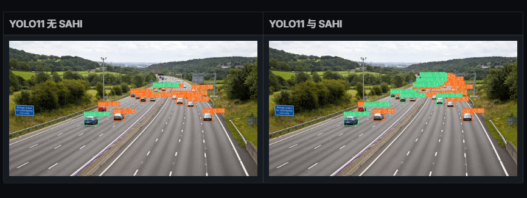

**核心痛点**：
 当一张 4000x3000 的大图被直接缩放（Resize）到 640x640 输入给 YOLO 时，原始图像中仅占几十个像素的小目标可能在特征图上只剩不到 1 个像素，导致特征彻底丢失，无法被检测。

**SAHI 的工作流程**：

1. **切片（Slicing）**：将原始高分辨率大图切割成多个有重叠的子图（例如 640x640 的切片）。
2. **独立推理**：将每个子图分别送入检测器（如 YOLOv8/v5）进行推理。由于子图未经过大幅缩小，小目标的像素特征得以保留。
3. **全图推理（可选）**：同时对缩小的全图进行一次推理，以捕获大尺度物体。
4. **结果合并**：将所有子图的检测结果映射回原图坐标，并使用 NMS（非极大值抑制）处理切片重叠区域的冗余框。

**优缺点**：

- **优点**：无需重新训练模型，即插即用，能大幅提升小目标召回率（AP-small）。
- **缺点**：推理耗时会随着切片数量线性增加（例如切成 9 张图，推理时间就增加约 9 倍），不适合对实时性要求极高的场景。

## 第二章 YOLO系列核心

## 【一】YOLO系列基础

<h2 id="1.yolo系列的面试问题">1.YOLO系列的面试问题</h2>

Rocky之前总结了YOLOv1-v7全系列的解析文章，帮助大家应对可能出现的与YOLO相关的面试问题，大家可按需取用：

[【Make YOLO Great Again】YOLOv1-v7全系列大解析（汇总篇）](https://mp.weixin.qq.com/s?__biz=Mzg4NDYwOTUwNA==&mid=2247486017&idx=1&sn=ff028fa235f384fe74576ef346849600&chksm=cfb4d2cef8c35bd8726cdd3bc9664f2bc5edd1eaf3876e6ff60e523277461b43a57389621bc8&token=1199271157&lang=zh_CN#rd)

<h2 id="2.介绍下YOLOv5中的CSP结构？">2.介绍下YOLOv5中的CSP结构？</h2>

CSP(Cross Stage Parial Network)结构是YOLOv5中Backbone网络中用来提高特征识别能力的技术。
它可以提供更高级别的特征，加快特征提取的速度，减少模型参数量，从而使YOLOv5能够更好地进行目标检测。

CSP结构的主要思想是将输入特征图分成两个分支，每个分支都包含一些卷积层和残差连接，然后通过一个跨阶段的连接将两个分支组合起来。

具体来说，CSP结构包含以下几个主要组成部分:

- **块内部残差连接(Residual Connection)**：每个块内部都包含一个残差连接，用于提高信息传递和反向梯度流的效果。
  具体来说，每个块内部的第一个卷积层输出的特征图会被直接添加到块的最后一个卷积层输出的特征图上。
- **跨阶段连接(Cross-Stage Connection)**：CSP结构通过一个跨阶段的连接将两个分支组合起来。具体来说，将输入特征图分成两个相等的部分， 
  其中一部分作为主干部分，另一部分作为侧分支。然后在侧分支上应用一些卷积层，将其输出与主干部分的输出串联起来，得到最终的特征图输出。
- **块内部的卷积层和批归一化(Convolution and Batch Normalization)**：每个块内部包含一些卷积层和批归一化层，用于提取特征和规范化特征图。
  具体来说，每个块内部的第一个卷积层通常是一个3x3的卷积层，其后跟一个批归一化层和ReLU激活函数。
  然后是一系列1x1的卷积层和3x3的卷积层，每个卷积层后都跟着批归一化层和ReLU激活函数.
- **块之间的下采样(Downsampling)**：CSP结构中的每个块之间都包含一个下采样步骤，用于将特征图分辨率减半。具体来说，下采
  样通常通过一个步长为2的卷积层实现，也可以通过池化层来实现。

>

源码分析:

```python
class BottleneckCSP(nn.Module):
    #CSP结构
    def __init__(self, c1, c2, n=1, shortcut=True, g=1, e=0.5):  # ch_in, ch_out, number, shortcut, groups, expansion
        super().__init__()
        c_ = int(c2 * e)  # hidden channels
        self.cv1 = Conv(c1, c_, 1, 1)#对应上面网络结构图的上面的分支的第一个CBL
        self.cv2 = nn.Conv2d(c1, c_, 1, 1, bias=False)#对应上面网络结构图的下面的分支的conv
        self.cv3 = nn.Conv2d(c_, c_, 1, 1, bias=False)#对应上面网络结构图的上面的分支的conv
        self.cv4 = Conv(2 * c_, c2, 1, 1)#对应最后的CBL
        self.bn = nn.BatchNorm2d(2 * c_)  # applied to cat(cv2, cv3)
        self.act = nn.SiLU()#对应Concat后的Leaky ReLU
        self.m = nn.Sequential(*(Bottleneck(c_, c_, shortcut, g, e=1.0) for _ in range(n)))
        #nn.Sequential--序贯模型是函数式模型的简略版，为最简单的线性、从头到尾的结构顺序，不分叉，是多个网络层的线性堆叠。
        #self.m对应X个Resunit or 2 * X个CBL（对应的切换是通过Bottleneck类中的True 或 False决定，True为X个Resunit，False为2 * X个CBL）
    def forward(self, x):
        y1 = self.cv3(self.m(self.cv1(x)))#对应上面网络结构图的上面的分支
        y2 = self.cv2(x)#对应上面网络结构图的下面的分支
        return self.cv4(self.act(self.bn(torch.cat((y1, y2), dim=1))))
        #torch.cat对应Concat
        #self.bn对应Concat后的BN
```

<h2 id="3.介绍下YOLOv5中的SPP结构?">3.介绍下YOLOv5中的SPP结构?</h2>

### SPP应用的背景：

在卷积神经网络中我们经常看到固定输入的设计，但是如果输入不能是固定尺寸的该怎么办呢？

通常来说，有以下几种方法：

（1）对输入进行resize操作，让他们统统变成你设计的层的输入规格那样。但是这样过于暴力直接，可能会丢失很多信息或者多出很多不该有的信息（图片变形等），影响最终的结果。

（2）替换网络中的全连接层，对最后的卷积层使用global average pooling，全局平均池化只和通道数有关，而与特征图大小没有关系

（3）最后一个当然是我们要讲的SPP结构啦~

### SPP结构分析

SPP结构又被称为空间金字塔池化，能将任意大小的特征图转换成固定大小的特征向量。

**处理流程：**

- 输入层：首先我们现在有一张任意大小的图片，其大小为w * h。

- 输出层：21个神经元 -- 即我们希望提取到21个特征。

分析如下图所示：分别对1 * 1分块，2 * 2分块和4 * 4子图里分别取每一个框内的max值（即取蓝框框内的最大值），
这一步就是作最大池化，这样最后提取出来的特征值（即取出来的最大值）一共有1 * 1 + 2 * 2 + 4 * 4 = 21个。得出的特征再concat在一起。

>

在YOLOv5中SPP的结构图如下图所示：

>


<h2 id="4.请介绍下YOLOv5中的Focus操作？">4.请介绍下YOLOv5中的Focus操作？</h2>

**Focus模块**是一种用于特征提取的CNN层，用于将输入特征图中的信息进行压缩和组合，从而提取出更高层次的特征表示，它被用作网络中的第一个卷积层，
用于对输入特征图进行下采样，以减少计算量和参数量。

Focus层在YOLOv5中是图片进入Backbone前，对图片进行切片操作，原理与Yolov2的passthrough层类似，采用切片操作把高分辨率的图片（特征图）
拆分成多个低分辨率的图片或特征图，即隔列采样+拼接。

<h2 id="5.介绍一下RT-DETR及其与YOLO系列的区别？">5.介绍一下RT-DETR及其与YOLO系列的区别？5.介绍一下 RT-DETR及其与YOLO系列的区别？</h2>

**RT-DETR (Real-Time DEtection TRansformer)** 是由百度在 2023 年提出的一款**基于 Transformer 架构的实时端到端目标检测器**。它的出现打破了 YOLO 系列在实时检测领域的长期主导地位，展示了 Transformer 结构在实时应用中的巨大潜力。

**核心思想**：将 DETR 家族的端到端、无需 NMS 的优点，通过创新的结构设计，与实时性要求相结合。

#### **RT-DETR 的核心设计**

1. **混合式编码器 (Hybrid Encoder)**：这是 RT-DETR 实现实时性能的关键。
   - 它没有像原始 DETR 那样对所有尺度的特征图都使用计算量巨大的 Transformer Encoder。
   - 取而代之的是，它首先使用一个高效的 **CNN 骨干网络**（如 ResNet 或 HGNetv2）来提取多尺度的特征图（P3, P4, P5）。
   - 然后，**仅在最后一个尺度 (P5) 的特征上应用 Transformer Encoder** 进行全局关系建模，再将得到的特征与 P3、P4 进行多尺度融合。这种设计极大地降低了计算复杂度。
2. **IoU 感知的查询选择 (IoU-aware Query Selection)**：
   - 传统 DETR 使用随机初始化或可学习的 Object Queries。RT-DETR 提出了一种更高效的方式。
   - 它首先在编码器输出的特征图上进行一次初步的预测，然后**从这些预测中选择 Top-K 个得分最高的作为 Object Queries**，送入后续的解码器。
   - 这相当于让模型预先“筛选”出最有可能包含物体的位置，使解码器可以更专注地对这些“准物体”进行精细化的定位和分类，加速了模型的收敛并提升了性能。
3. **高效的解码器 (Efficient Decoder)**：
   - 解码器结构与 DINO 类似，对选定的 Object Queries 进行多轮迭代式的优化。由于输入解码器的 Query 数量固定且不多（例如 300 个），其计算量是可控的，并且与输入图像的分辨率无关。

#### **与 YOLO 系列的主要区别**

| 特性         | RT-DETR                                                      | YOLO 系列 (以 YOLOv8 为例)                                   |
| ------------ | ------------------------------------------------------------ | ------------------------------------------------------------ |
| **基础架构** | **CNN + Transformer 混合架构**。核心在于 Transformer 的解码器。 | **纯 CNN 架构**。通过卷积和 CSP 等模块构建。                 |
| **后处理**   | **端到端 (End-to-End)，无需 NMS**。模型直接输出稀疏、唯一的预测框集合。 | **非端到端，强依赖 NMS**。模型会产生大量冗余的预测框，必须通过 NMS 进行筛选。 |
| **预测机制** | **基于查询 (Query-based)**。使用一小组 Object Queries 来“探查”图像中的物体。 | **基于网格/锚点 (Grid/Anchor-based)**。在特征图的每个位置上进行密集预测。 |
| **全局信息** | 通过 Transformer 模块，**天然具备全局感受野**，对物体间关系建模能力强。 | 感受野相对受限，需要通过 SPPF 等模块来弥补。                 |
| **训练收敛** | 早期 DETR 收敛很慢，但 RT-DETR 通过查询选择机制已**极大加速收敛**。 | 收敛速度快，训练相对简单直接。                               |
| **部署**     | Transformer 算子在某些边缘设备上的优化支持可能不如标准卷积。 | 纯 CNN 结构，对各种硬件平台的优化和部署非常成熟。            |

**总结**：RT-DETR 和 YOLO 代表了实时目标检测的**两条不同技术路线**。YOLO 系列是纯 CNN 架构不断优化的典范，速度快、部署成熟。而 RT-DETR 则是 Transformer 架构成功下沉到实时领域的代表，其**端到端、无需 NMS** 的优雅设计是其最大优势，避免了 NMS 带来的调参和性能瓶颈，代表了未来的一个重要发展方向。

<h2 id="6.介绍一下RTMDet(Real-Time_Model_for_Object_Detection)？">6.介绍一下RTMDet(Real-Time_Model_for_Object_Detection)？</h2>

**RTMDet (Real-Time Models for Object Detection)** 是由同济大学和商汤科技联合在 MMDet 框架下推出的一个系列化、高性能的实时目标检测器。它的设计目标是在保持极高推理速度的同时，实现与那些更大、更慢的模型相媲美的检测精度，做到了**速度与精度的极致平衡**。

RTMDet 的设计哲学是**模块化**和**可扩展性**，它不是一个单一的模型，而是一个包含了从微小模型 (tiny) 到超大模型 (extra-large) 的完整系列，可以适应从边缘设备到云端服务器的各种部署需求。


#### **核心设计与创新点**

RTMDet 的卓越性能主要归功于以下几个关键设计的协同作用：

1. **高效的骨干网络与 Neck (CSPNeXt)**:
   - **骨干网络**：RTMDet 的骨干网络是基于 **CSPNet** 思想设计的，但进行了一系列现代化改造，被称为 **CSPNeXt**。它将传统的 `3x3` 卷积替换为**大核深度可分离卷积 (Large Kernel Depth-wise Convolution)**，并优化了模块的宽度和深度配比。这使得网络在拥有更大感受野、更强特征提取能力的同时，保持了极高的计算效率（FLOPs 更低）。
   - **Neck 部分**：同样采用了 CSPNeXt 模块来构建，增强了不同层级特征的融合能力，同时保持了轻量化。
2. **任务对齐的标签分配与损失 (TAL)**:
   - RTMDet 直接采用了前述的 **TAL (Task Alignment Learning)** 作为其标签分配和损失函数设计的核心。这是其能够实现高精度的关键保障，有效解决了分类与定位的任务不对齐问题。
3. **优化的解耦头 (Decoupled Head)**:
   - RTMDet 采用了**解耦头**，即分类和回归任务由两个独立的分支来完成，这已成为现代高性能检测器的标配。
   - 特别地，它在分类分支的监督信号中引入了 **IoU 感知的信息**，并采用质量焦散损失（QFL），使得分类得分能更好地反映定位质量，从而在 NMS 阶段选出更优的检测框。
4. **丰富且高效的数据增强策略**:
   - RTMDet 在训练时采用了多种强大的数据增强方法，如 **Mosaic** 和 **MixUp**。为了进一步提升效率，它还设计了**缓存马赛克 (Cached Mosaic)** 和**自适应马赛克 (Adaptive Mosaic)** 等技术，在不降低性能的前提下，减少了训练时数据预处理的开销。

#### **性能与地位**

RTMDet 在多个主流 benchmark（如 COCO 数据集）上都取得了 SOTA 级别的性能。它的突出之处在于，**在同等推理速度下，其精度远超同期的 YOLO 系列（如 YOLOv5, YOLOX, YOLOv7）**；而在**同等精度下，其速度则更快**。

由于其卓越的性能、清晰的模块化设计以及在 MMDetection 框架下的易用性，RTMDet 已经成为实时目标检测领域一个新的、强有力的基线模型 (baseline)，并被广泛应用于学术研究和工业落地中。它与 YOLOv8 等模型共同代表了当前实时目标检测技术的最高水平。

<h2 id=" 7.介绍一下YOLOv9的核心创新：可编程梯度信息（PGI）和GELAN？"> 7.介绍一下YOLOv9的核心创新：可编程梯度信息（PGI）和GELAN？</h2>

**可编程梯度信息（PGI, Programmable Gradient Information）**：

- **问题**：传统的深度网络在反向传播时，深层的梯度很难准确更新到浅层，导致信息丢失。
- **解决**：PGI引入了一个辅助的**可逆分支（Reversible Branch）\**来生成可靠的梯度，辅助主分支（Main Branch）的学习。训练时，它通过多级辅助监督确保模型学习到完整的输入信息；推理时，辅助分支被移除，因此\**不增加推理成本**。
- PGI包含三个部分：主分支、辅助可逆分支、多级辅助信息。
- 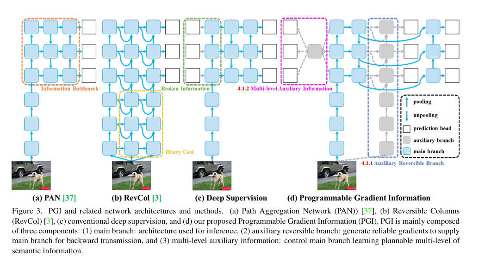

**广义高效层聚合网络（GELAN, Generalized Efficient Layer Aggregation Network）**：

- 结合了CSPNet（梯度路径优化）和ELAN（推理效率高）的优点。

- 它允许使用各种计算块（如ResBlock、DarkBlock甚至CSPBlock）作为基础单元，而不限制于特定的卷积层堆叠。GELAN在保持轻量级的同时，显著提高了参数利用率和推理速度。

  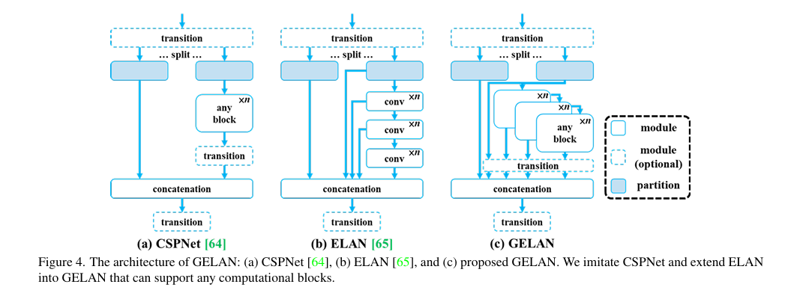

<h2 id=" 8.YOLOv10是如何实现NMS-Free（无需非极大值抑制）的端到端检测的？"> 8.YOLOv10是如何实现NMS-Free（无需非极大值抑制）的端到端检测的？</h2>

传统的YOLO系列（如v8）仍然依赖NMS进行后处理，这增加了推理延迟并对超参数敏感。**YOLOv10**（2024年由清华团队提出）通过**一致性双重分配（Consistent Dual Assignments）**策略解决了这个问题：

1. **双重标签分配（Dual Label Assignments）**：
   - **一对多（One-to-Many）分支**：保留传统YOLO的训练方式，一个GT（真值）匹配多个正样本Anchor。这提供了丰富的监督信号，利于模型收敛和特征学习。
   - **一对一（One-to-One）分支**：引入类似DETR的匹配方式，一个GT只匹配一个最佳预测框。这确保了推理时每个目标只有一个高置信度框，从而**无需NMS**。
2. **一致性匹配度量**：
   - 为了让两个分支协同工作，YOLOv10设计了一致性匹配损失，迫使一对一分支和一对多分支的排序结果保持一致。

**结果**：推理时仅使用一对一分支的预测结果，彻底移除了NMS，在保持高精度的同时显著降低了端到端延迟。

<h2 id="9.介绍一下YOLOv11的核心改进点（相对于YOLOv8/v10）？">9.介绍一下YOLOv11的核心改进点（相对于YOLOv8/v10）？</h2>

**YOLOv11**（2024年Ultralytics发布）在架构上进行了进一步的微调，旨在在保持实时性的同时提升特征提取的效率和参数利用率。其核心改进主要体现在以下组件的替换：

1. **C3k2 模块**：YOLOv11 引入了 `C3k` 和 `C3k2` 模块来替代 YOLOv8 中的 `C2f` 模块。`C3k2` 是一种更灵活的跨阶段部分网络（CSP）实现，通过可配置的卷积核大小（kernel size）来适应不同的感受野需求，在特征融合时能更好地平衡计算量与精度。
2. **C2PSA (Cross-Stage Partial with Spatial Attention)**：在特征提取的深层，YOLOv11 引入了 `C2PSA` 模块。它在传统的 CSP 结构中嵌入了**空间注意力机制（Spatial Attention）**，增强了模型对关键区域的聚焦能力，同时计算成本比全 Self-Attention 低得多，有效提升了复杂背景下的检测能力。
3. **深度/宽度缩放策略优化**：v11 调整了不同尺度模型的深度和宽度乘数，使得 Nano/Small 版本更轻量，而 Large/X-Large 版本上限更高。

## 【二】YOLO系列组件

<h2 id="1.fpnfeature-pyramid-network的相关知识">1.FPN(Feature Pyramid Network)的相关知识</h2>

<h3 id="fpn的创新点">FPN的创新点</h3>

1. 设计特征金字塔的结构
2. 提取多层特征（bottom-up，top-down）
3. 多层特征融合（lateral connection）

设计特征金字塔的结构，用于解决目标检测中的多尺度问题，在基本不增加原有模型计算量的情况下，大幅度提升小物体（small object）的检测性能。

原来很多目标检测算法都是只采用高层特征进行预测，高层的特征语义信息比较丰富，但是分辨率较低，目标位置比较粗略。<font color=DeepSkyBlue>假设在深层网络中，最后的高层特征图中一个像素可能对应着输出图像$20 \times 20$的像素区域，那么小于$20 \times 20$像素的小物体的特征大概率已经丢失</font>。与此同时，低层的特征语义信息比较少，但是目标位置准确,这是对小目标检测有帮助的。<font color=DeepSkyBlue>FPN将高层特征与底层特征进行融合，从而同时利用低层特征的高分辨率和高层特征的丰富语义信息，并进行了多尺度特征的独立预测</font>，对小物体的检测效果有明显的提升。


传统解决这个问题的思路包括:

1. 图像金字塔（image pyramid），即多尺度训练和测试。但该方法计算量大，耗时较久。
2. 特征分层，即每层分别输出对应的scale分辨率的检测结果，如SSD算法。但实际上不同深度对应不同层次的语义特征，浅层网络分辨率高，学到更多是细节特征，深层网络分辨率低，学到更多是语义特征，单单只有不同的特征是不够的。


<h3 id="fpn的主要模块">FPN的主要模块</h3>

1. Bottom-up pathway（自底向上线路）
2. Top-down path（自顶向下线路）
3. Lareral connections（横向链路）


**Bottom-up pathway（自底向上线路）**

自底向上线路是卷积网络的前向传播过程。在前向传播过程中，feature map的大小可以在某些层发生改变。

**Top-down path（自顶向下线路）和Lareral connections（横向链路）**

自顶向下线路是上采样的过程，而横向链路是将自顶向下线路的结果和自底向上线路的结构进行融合。

上采样的feature map与相同大小的下采样的feature map进行逐像素相加融合（element-wise addition），其中自底向上的feature先要经过$1\times 1$卷积层，目的是为了减少通道维度。

<h3 id="fpn应用">FPN应用</h3>

论文中FPN直接在Faster R-CNN上进行改进，其backbone是ResNet101，FPN主要应用在Faster R-CNN中的RPN和Fast R-CNN两个模块中。

**FPN+RPN：**

将FPN和RPN结合起来，那RPN的输入就会变成多尺度的feature map，并且在RPN的输出侧接多个RPN head层用于满足对anchors的分类和回归。

**FPN+Fast R-CNN：**

Fast R-CNN的整体结构逻辑不变，在backbone部分引入FPN思想进行改造。

<h2 id="2.sppspatial-pyramid-pooling的相关知识">2.SPP(Spatial Pyramid Pooling)的相关知识</h2>

在目标检测领域，很多检测算法最后使用了全连接层，导致输入尺寸固定。当遇到尺寸不匹配的图像输入时，就需要使用crop或者warp等操作进行图像尺寸和算法输入的匹配。这两种方式可能出现不同的问题：裁剪的区域可能没法包含物体的整体；变形操作造成目标无用的几何失真等。

<font color=DeepSkyBlue>而SPP的做法是在卷积层后增加一个SPP layer，将features map拉成固定长度的feature vector。然后将feature vector输入到全连接层中</font>。以此来解决上述的尴尬问题。


**SPP的优点：**

1. SPP可以忽略输入尺寸并且产生固定长度的输出。
2. SPP使用多种尺度的滑动核，而不是只用一个尺寸的滑动窗口进行pooling。
3. SPP在不同尺寸feature map上提取特征，增大了提取特征的丰富度。


在YOLOv4中，对SPP进行了创新使用，Rocky已在[【Make YOLO Great Again】YOLOv1-v7全系列大解析（Neck篇）](https://mp.weixin.qq.com/s?__biz=Mzg4NDYwOTUwNA==&mid=2247485146&idx=1&sn=f925d3509585c6cbe094e6a19cea35e2&chksm=cfb4de55f8c357439efb86d9930103614bea0c8e0adf41513cbd53d020e32972ea0a902c96c2&token=1308238350&lang=zh_CN#rd)中详细讲解，大家可按需取用～

<h2 id="3.FPN网络的主要作用是什么？">3.FPN网络的主要作用是什么？</h2>

**FPN（Feature Pyramid Network）**，即特征金字塔网络，是一种用于解决目标检测和语义分割中多尺度问题的深度学习网络结构。

FPN网络是在2017年的CVPR会议上提出的，主要目的是**通过特征融合的方式**，在不显著增加计算量的情况下，提升**多尺度目标的检测性能**，
尤其是对**小目标**的检测能力。 它通过构建多尺度特征金字塔，将**高层特征图的语义信息与低层特征图的空间信息**进行融合，生成具有丰富多尺度信息的特征表示。

## 第三章 DETR系列核心

## 【一】DETR系列基础

<h2 id="1.请介绍一下DETR？">1.请介绍一下DETR？</h2>

在计算机视觉领域，目标检测任务一直以来都依赖于一套复杂的“祖传手艺”：密密麻麻的**锚点框（Anchor Boxes）**和繁琐的后处理步骤**非极大值抑制（NMS）**。

直到2020年，Facebook AI提出的DETR（DEtection TRansformer）横空出世，它用一种极其优雅的方式告诉我们：目标检测，本不必如此复杂。

#### 核心思想：不是“检测”，而是“直接预测集合”

传统检测器（如YOLO, Faster R-CNN）的工作模式可以理解为“筛选”：先生成成千上万个候选框，然后判断每个框里有没有物体，最后用NMS去掉多余的框。

DETR则完全不同，它的核心思想是**集合预测（Set Prediction）**。它将目标检测视为一个直接的“问答”问题：给定一张图，请直接告诉我图中所有物体的 `(类别, 边界框)` 集合。

#### DETR是如何做到的？三步走架构

DETR的简洁性源于其巧妙的架构，它完美地融合了CNN和Transformer。

1. **CNN特征提取**：首先，和所有检测器一样，DETR使用一个标准的CNN（如ResNet）从输入图像中提取丰富的视觉特征图。
2. **Transformer编码器-解码器**：这是魔法发生的地方。
   - **编码器（Encoder）**负责理解图像的全局内容，让模型知道图中哪些区域是重要的。
   - **对象查询（Object Queries）**是DETR的精髓。你可以把它们想象成N个（比如100个）“空插槽”或“提问者”。
   - **解码器（Decoder）**则让这N个“空插槽”去审视编码器处理过的图像特征，并各自“认领”一个物体。同时，这些“空插槽”之间会互相交流，确保它们不会去认领同一个物体。**正是这种内部交流机制，天然地避免了重复检测，从而彻底抛弃了NMS。**
3. **预测头（Prediction Heads）**：最后，每个被填充了信息的“空插槽”都会通过一个简单的前馈网络，直接输出一个物体的类别和一个边界框坐标。


#### 训练的秘诀：二分图匹配

问题：如果模型输出了100个预测，但图里只有3只猫，怎么计算损失呢？

DETR使用**二分图匹配（Bipartite Matching）**来解决这个问题。在训练的每一步，它会使用匈牙利算法为模型的预测和**真实的标签（Ground Truth）**找到一个“成本”最低的一对一最佳配对。

- 对于配对成功的预测，计算分类和边界框损失。
- 对于没有配对成功的预测，将其目标类别设为“无物体”。

这样一来，模型就被迫学会为每个真实物体只生成一个唯一的、准确的预测。

DETR的原始版本虽然存在训练收敛慢、对小物体检测不佳等问题，但它的思想是革命性的。它不仅将目标检测带入了“端到端”的极简时代，更启发了无数后续工作（如Deformable DETR, DINO等），这些工作已经将性能和效率推向了新的高度。

<h2 id="2.请介绍一下DINO？">2.请介绍一下DINO？</h2>

这里介绍的DINO是2022年提出的**目标检测模型**，请不要与2021年Meta AI提出的**自监督学习框架DINO**（self-**DI**stillation with **NO** labels）混淆。虽然名字相同，但它们是两个不同领域的杰出工作。

DINO的目标非常明确：让DETR类的模型**收敛更快、训练更稳、精度更高**。它通过三项核心创新，精准地解决了前面工作的痛点。

#### DINO的三大“杀手锏”

##### 1. 对比去噪训练 (Contrastive De-Noising Training, CDN)

这是DINO最核心、最巧妙的创新。

在DETR中，模型通过“二分图匹配”来学习，需要从100个随机的“对象查询”中，大海捞针般地找出与真实物体匹配的那几个。这个过程非常低效，导致训练初期收敛极慢。

DINO想：**与其让模型从零开始学，不如我们直接给他“划重点”？**

CDN的做法是：

- **制造“错题”**：在训练时，除了有真实标签（Ground Truth boxes）外，DINO还人为地给这些真实标签加上一些噪声，比如稍微移动一下位置、改变一下大小，生成一批“带噪的框”（Noisy boxes）。
- **布置“改错”任务**：DINO将这些“带噪的框”也作为一种查询输入给模型，并要求模型将它们恢复成原始的、准确的真实标签。

这就像教学生：不仅要让他从白纸开始解题，还要给他一些“错题本”，让他学会如何把错误的答案改正过来。这种“改错”任务是一个更明确、更简单的学习目标，极大地加速了模型对“什么是好的边界框”的理解，从而**显著加快了收敛速度**。


##### 2. 混合查询选择 (Mixed Query Selection)

DETR的“对象查询”是如何初始化的？这是一个头疼的问题。DINO采取了一种“集各家之长”的混合策略：

- 一部分查询，像DAB-DETR一样，是可学习的“锚点”（Anchor-like queries），它们提供一个稳定的初始位置猜测。
- 另一部分查询，则直接利用前一个解码器层输出的结果，进行渐进式的优化。

这种混合模式既保证了初始化的稳定性，又利用了动态更新的灵活性，让训练过程更加稳健。


##### 3. “多看一步”的盒子更新 (Look Forward Twice)

在DETR的解码器中，每一层都会对边界框进行一次优化。DINO在这里也做了一个小而美的改进。

当更新当前层的参数时，DINO不仅会参考当前层的信息，还会“偷看”一眼用下一层参数更新后的结果，再来反过来优化当前层的参数。这种“多看一步”的策略，使得参数的更新更有前瞻性，从而得到更精确的边界框预测。


<h2 id="3.请介绍一下Deformable_DETR？">3.请介绍一下Deformable_DETR？</h2>

如何让Transformer既有全局视野，又能聚焦于关键细节呢？**Deformable DETR**给出了一个堪称绝妙的答案。它通过引入**可变形注意力（Deformable Attention）**，让DETR学会了“指哪打哪”，而不是“全盘扫描”。

#### 核心革新：可变形注意力 (Deformable Attention)

想象一下，当你在寻找一本书时，你不会一字不差地阅读整个图书馆的所有书页（全局注意力），而是会快速扫视书架，只在看到可能是目标书的几个关键位置时，才停下来仔细查看。

Deformable Attention模仿的正是这种高效的视觉搜索机制。

它的核心思想是：**对于一个查询点（Query），不再计算它与特征图上所有其他点（Keys）的注意力，而是只关注一小部分（比如4个或8个）采样点。**

最关键的是，**这些采样点的位置不是固定的，而是由模型自己学习预测出来的！**

具体来说，对于特征图上的一个查询点，模型会额外预测出几个2D**偏移量（Offsets）**。这些偏移量告诉模型应该去哪里采样关键信息。这样一来，注意力模块就变得“可变形”或“可操纵”，能够根据图像内容，动态地将计算资源集中到最相关的区域。


这种设计的优势是巨大的：

- **计算效率飙升**：注意力计算量不再与特征图尺寸相关，而只与采样的点数（一个很小的常数）相关，大大降低了计算和内存开销。
- **性能提升，尤其对小物体**：模型可以学会将采样点精准地“打”在物体的关键部位（如边缘、中心），避免了背景信息的干扰，从而显著提升了对小物体的检测精度。

#### 不止于此：多尺度特征融合

原始DETR只使用了CNN骨干网络输出的最后一层特征图。这对于检测不同尺寸的物体是不利的，因为高层特征图分辨率低，适合检测大物体，但小物体信息可能已经丢失；而低层特征图分辨率高，保留了细节，但语义信息不足。

Deformable DETR借鉴了传统检测器（如FPN）的成功经验，引入了**多尺度特征（Multi-scale Features）**。它将CNN不同阶段输出的高、中、低分辨率特征图都送入Transformer。

更妙的是，可变形注意力机制可以**跨尺度**工作。也就是说，一个在高层特征图上的查询点，可以学会去低层高分辨率特征图上采样信息。这使得模型能够非常自然地融合不同尺度的信息，实现对大、中、小各类物体的稳健检测。


#### Deformable DETR的成就与意义

Deformable DETR是DETR家族演进中的一次重大飞跃，它的贡献主要体现在：

1. **解决了性能瓶颈**：它首次证明了基于Transformer的检测器可以在保持端到端简洁性的同时，实现**高精度**和**高效率**。
2. **显著加快收敛**：聚焦的注意力机制也让模型的学习目标更明确，相比原始DETR，其**收敛速度提升了约10倍**。
3. **小物体检测的突破**：它极大地改善了DETR对小物体的检测能力，使其在这一关键指标上追平甚至超越了许多成熟的传统检测器。
4. **奠定后续工作的基础**：Deformable Attention模块因为其高效和强大的性能，成为了后续许多先进模型（包括DINO）的标准配置。

<h2 id="4.什么是DETR中的Hungarian_Matching(匈牙利匹配)?">4.什么是DETR中的Hungarian_Matching(匈牙利匹配)?</h2>

DETR (DEtection TRansformer) 是一个革命性的目标检测框架,它**完全抛弃了传统检测器中的 anchor 机制和 NMS 后处理**。传统检测器(如 Faster R-CNN、YOLO)会生成大量冗余的候选框,然后通过 NMS 抑制重复检测,这种"多对一"的匹配方式存在固有的冗余性问题。

DETR 的核心创新在于:它直接预测一组**固定数量的候选框**(通常是 100 个),并通过 Transformer 的并行解码机制一次性输出所有预测。为了实现"**一对一匹配**"(每个真实目标只对应一个预测框),DETR 引入了**匈牙利匹配算法**(Hungarian Algorithm)来解决最优二分图匹配问题。

### 匈牙利匹配的工作原理

匈牙利匹配通过构建一个**代价矩阵**(Cost Matrix)来衡量每个预测框与每个真实目标之间的匹配成本,然后找到全局最优的一对一分配方案。代价函数由三部分组成:

$$L_{match} = \lambda_{cls} L_{cls} + \lambda_{bbox} L_{L1} + \lambda_{IoU} (1 - \text{IoU})$$

其中:

- **$L_{cls}$**: 分类损失,衡量预测类别与真实类别的匹配程度(通常使用负对数概率)
- **$L_{L1}$**: 边界框的 L1 距离,衡量预测框与真实框坐标的差异
- **$(1 - \text{IoU})$**: IoU 损失,衡量预测框与真实框的重叠程度
- **$\lambda_{cls}, \lambda_{bbox}, \lambda_{IoU}$**: 各项损失的权重系数,用于平衡不同损失的重要性

**匹配过程**:

1. 计算 N 个预测框与 M 个真实目标之间的 N×M 代价矩阵
2. 使用匈牙利算法找到使总代价最小的一对一匹配方案
3. 未匹配的预测框被视为"无目标"(∅类),在训练时施加背景类损失

### 为什么匈牙利匹配如此重要?

1. **消除冗余检测**: 从根本上解决了传统检测器中多个预测框竞争同一目标的问题,**无需 NMS 后处理**
2. **实现端到端训练**: 建立了预测与真实目标之间的清晰对应关系,使得整个网络可以通过标准的集合预测损失进行端到端优化,无需手工设计的匹配规则(如基于 IoU 阈值的 anchor 分配)
3. **全局最优分配**: 匈牙利算法保证找到全局最优的匹配方案,而不是贪心的局部匹配,这使得训练更加稳定
4. **统一的检测范式**: 为 Transformer 在目标检测领域的应用奠定了理论基础,后续的 Deformable DETR、DINO、DAB-DETR 等改进模型都继承了这一匹配策略
5. **简化检测流程**: 将复杂的检测问题简化为"集合预测问题"(Set Prediction),使得模型设计更加简洁优雅

<h2 id="5.Transformer中的自注意力机制（Self-Attention）与目标检测中的全局特征融合有何关联？为什么说DETR能够实现End-to-End检测？">5.Transformer中的自注意力机制（Self-Attention）与目标检测中的全局特征融合有何关联？为什么说DETR能够实现End-to-End检测？</h2>

**关联：** 自注意力机制允许序列中的**每个元素**（在DETR中是图像特征图上的**每个像素或Patch**）与**序列中的所有其他元素**进行交互。这使得Transformer能够捕获**全局依赖关系**，在DETR中实现了**全局特征融合**，而无需依赖FPN等额外的特征金字塔。

**End-to-End：** DETR之所以是端到端的，是因为它**去除了**所有**手工设计**的组件（如Anchor、NMS），将整个检测流程统一为：

 $\text{CNN Feature} \rightarrow \text{Transformer Encoder/Decoder} \rightarrow \text{Set Prediction}$。最终的**匈牙利匹配（Hungarian Matching）**直接将预测集与GT集进行一对一匹配，取代了传统的NMS。

<h2 id="6.什么是Co-DETR，它是如何利用混合标签分配提升DETR性能的？">6.什么是Co-DETR，它是如何利用混合标签分配提升DETR性能的？</h2>

**Co-DETR**（Collaborative Hybrid Assignments for End-to-End Object Detection）是为了解决DETR系列模型训练收敛慢、正样本过少的问题。它在COCO数据集上取得了极高的性能（SOTA级别）。

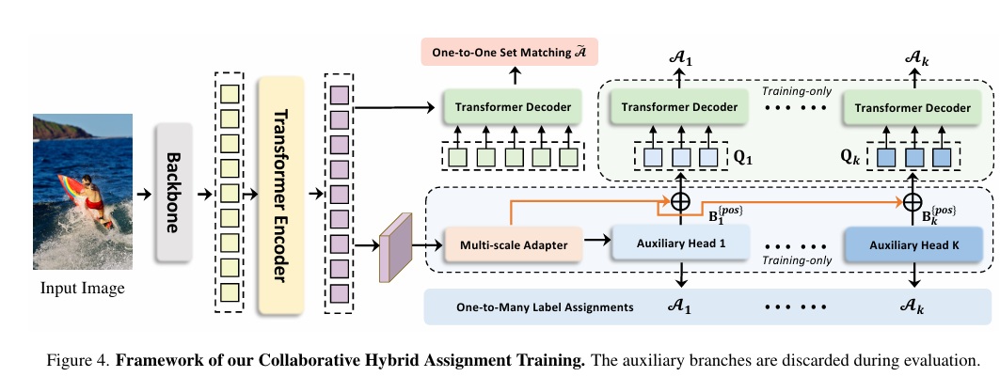

**核心思想**：利用**多样的标签分配方式**来辅助DETR的训练。

1. **协同混合分配（Collaborative Hybrid Assignments）**：
   - 原始DETR只使用一对一（One-to-One）的匈牙利匹配，正样本极少，特征学习效率低。
   - Co-DETR在训练阶段引入了**辅助头部（Auxiliary Heads）**，这些头部使用传统的**一对多（One-to-Many）**分配策略（如ATSS、Faster R-CNN的分配方式）。
   - 这些辅助头部迫使编码器（Encoder）学习更强的判别性特征。
2. **定制化的正样本查询生成**：
   - 利用辅助头部的预测结果来初始化DETR的Decoder Queries，进一步加速收敛。

**注意**：这些辅助头部仅在训练时使用，推理时被丢弃，因此不影响DETR原本的推理速度。

## 【二】目标检测扩展

<h2 id="1.介绍一下DiffusionDet？">1.介绍一下DiffusionDet？</h2>

 DiffusionDet 是一种创新的目标检测方法,它将扩散模型(Diffusion Model)的思想应用到目标检测任务中。


**核心思路:**

- **训练阶段**: 从真实的检测框(ground truth boxes)逐步添加噪声,直到变成随机噪声框
- **推理阶段**: 从随机噪声框出发,通过迭代去噪的过程,逐步精炼得到最终的检测结果

**主要特点:**

1. **迭代精炼**: 不像传统检测器一次性预测,而是通过多步迭代逐渐优化检测框
2. **灵活的检测范式**: 将目标检测重新定义为从噪声到检测框的生成过程
3. **性能优秀**: 在保持较好精度的同时,提供了一种全新的检测视角

**优势:**

- 可以处理不同数量的目标检测
- 迭代过程允许检测结果逐步优化
- 为目标检测提供了新的设计空间

简单来说,DiffusionDet 就是把"去噪"的思想用在了目标检测上,让检测框像图像生成一样,从随机噪声中一步步"生成"出来。

<h2 id="2.什么是Sparse R-CNN？它作为连接Dense和Set Prediction的桥梁有何意义？">2.什么是Sparse R-CNN？它作为连接Dense和Set Prediction的桥梁有何意义？</h2>

**Sparse R-CNN** 是一个彻底摒弃了 Anchor 和 RPN 的检测器，它在 DETR 和 Faster R-CNN 之间架起了一座桥梁。

- **核心思想**：它不使用 RPN 生成成千上万个候选框（Dense），也不像 DETR 那样使用无位置信息的 Object Query。相反，它使用**一组固定数量（如100个）的可学习提议框（Learnable Proposal Boxes）和对应的可学习提议特征（Learnable Proposal Features）**。
- **工作流程**：这100个可学习的框作为初始猜测，直接提取 RoI 特征。然后，这些特征通过名为 **Dynamic Instance Interactive Head** 的模块进行迭代细化。
- **面试意义**：面试官常问它是因为它证明了**稀疏（Sparse）检测**的可行性。它告诉我们，只要初始化的 Proposal 足够好（通过学习得到统计上的高频位置），我们不需要遍历整张图的所有像素（Dense），也能实现高性能检测。

## 第四章 其他经典模型和Backbone

## 【一】经典模型

<h2 id="1.有哪些经典的轻量型人脸检测模型？">1.有哪些经典的轻量型人脸检测模型？</h2>

人脸检测相对于通用目标检测来说，算是一个子任务。比起通用目标检测任务动辄检测1000个类别，人脸检测任务主要聚焦于人脸的单类目标检测，<font color=DeepSkyBlue>使用通用目标检测模型太过奢侈，有点“杀鸡用牛刀”的感觉，并且大量的参数冗余，会影响部署侧的实用性</font>，故针对人脸检测任务，学术界提出了很多轻量型的人脸检测模型，Rocky在这里给大家介绍一些比较有代表性的：

1. libfacedetection
2. Ultra-Light-Fast-Generic-Face-Detector-1MB
3. A-Light-and-Fast-Face-Detector-for-Edge-Devices
4. CenterFace
5. DBFace
6. RetinaFace
7. MTCNN

<h2 id="2.lffd人脸检测模型的结构和特点？">2.LFFD人脸检测模型的结构和特点？</h2>

<font color=DeepSkyBlue>Rocky在实习/校招面试中被多次问到LFFD模型以及面试官想套取LFFD相关算法方案的情况，说明LFFD模型在工业界还是比较有价值的</font>，下面Rocky就带着大家学习一下LFFD模型的知识：

LFFD（A-Light-and-Fast-Face-Detector-for-Edge-Devices）适用于人脸、行人、车辆等单目标检测任务，具有速度快，模型小，效果好的特点。<font color=DeepSkyBlue>LFFD是Anchor-free的方法，使用感受野替代Anchors，并在主干结构上抽取8路特征图对从小到大的人脸进行检测，检测模块分为类别二分类与边界框回归</font>。

**LFFD模型结构**


我们可以看到，LFFD模型主要由四部分组成：tiny part、small part、medium part、large part。

模型中并没有采用BN层，因为BN层会减慢17%的推理速度。其主要采用尽可能快的下采样来保持100%的人脸覆盖。

**LFFD主要特点：**

1. 结构简单直接，易于在主流AI端侧设备中进行部署。

2. 检测小目标能力突出，在极高分辨率（比如8K或更大）画面，可以检测其间10个像素大小的目标；

**LFFD损失函数**

LFFD损失函数是由regression loss和classification loss的加权和。

分类损失使用了交叉熵损失。

回归损失使用了L2损失函数。

LFFD论文地址：[LFFD: A Light and Fast Face Detector for Edge Devices论文地址](https://arxiv.org/pdf/1904.10633.pdf)

<h2 id="3.请介绍ROIPooling？">3.请介绍ROIPooling？</h2>

在计算机视觉的目标检测任务中，ROI Pooling（Region of Interest Pooling）是一种经典的操作，用于从特征图中提取感兴趣区域（ROI）的固定尺寸特征。它最早在 Faster R-CNN 模型中被提出，帮助将不同大小的候选框转换为统一的特征向量，便于后续分类和回归。

### ROI Pooling 的原理

ROI Pooling 的核心是将任意大小的 ROI 映射到固定尺寸的输出特征图（如 7x7），以适应全连接层的输入。它通过池化操作来实现特征的降采样和聚合。具体来说，它假设输入是一个特征图（从骨干网络如 VGG 或 ResNet 提取），以及一组 ROI 框（通常来自 RPN 网络）。

#### 操作步骤

1. **坐标量化**：首先，将 ROI 的浮点坐标映射到特征图的尺度上，并通过取整（floor 或 round）量化成整数坐标。这一步是为了适应离散的像素网格。
2. **网格划分**：将量化后的 ROI 均匀分成固定大小的网格 bin（如 7x7），每个 bin 的边界也通过量化（取整）确定。
3. **池化操作**：在每个 bin 内，对覆盖的特征值进行最大池化（Max Pooling）或平均池化（Average Pooling）。如果 bin 内没有整数像素点，则可能为空或使用最近点。
4. **输出特征**：最终得到一个固定尺寸的特征图，用于下游任务。

### 局限性与缺点

尽管有效，ROI Pooling 存在明显的量化误差：

- **对齐偏差（Misalignment）**：两次量化操作（ROI 坐标和 bin 划分）会导致特征图与原 ROI 不精确对齐，尤其在小目标或边界处，误差会放大。
- **精度损失**：在实例分割或精确边界框回归任务中，这种粗糙处理会降低模型的 mAP（mean Average Precision），特别是在 COCO 等数据集上表现明显。

<h2 id="4.请介绍ROIAlign？">4.请介绍ROIAlign？</h2>

在计算机视觉领域，特别是目标检测任务中，ROI (Region of Interest) 的特征提取是关键步骤。传统的 ROI Pooling 虽然高效，但存在量化误差，导致特征图与原图像对齐不准。

### ROI Pooling 的痛点

ROI Pooling 是 Faster R-CNN 中的核心操作，它将不同大小的 ROI 映射到固定尺寸的特征图上。但问题在于：它通过整数量化（如取整）来划分网格，这会导致边界对齐偏差，尤其在小目标或精确分割任务中，误差会累积放大。

### ROI Align 的原理

ROI Align 巧妙解决了这个问题。它避免了任何形式的量化操作，而是保留浮点坐标，通过双线性插值（Bilinear Interpolation）来采样特征值。具体步骤如下：

1. **划分网格**：将 ROI 均匀分成固定大小的网格（如 2x2 或 7x7），但网格边界保持浮点数。
2. **采样点计算**：在每个网格 bin 内均匀选取采样点（通常 4 个），这些点也是浮点坐标。
3. **双线性插值**：对于每个采样点，使用周围 4 个最近的整数像素点进行插值计算值。
4. **池化**：对 bin 内的采样点值进行平均或最大池化，得到最终特征。

这种方法确保了特征提取的连续性和精确性，避免了 misalignment。

<h2 id="5.介绍一下CenterNet的原理，它与传统的目标检测有什么不同点？">5.介绍一下CenterNet的原理，它与传统的目标检测有什么不同点？</h2>

CenterNet（“Objects as Points”）是一种 anchor‑free 的目标检测方法，它将每个目标视为边界框的中心点，通过网络预测中心热图、框宽和高，以及中心的局部偏移，从而一次性恢复目标检测结果。该方法摒弃了传统检测中对 anchor 的依赖，也不需要 NMS 后处理，因为热图上的局部极大值天然起到了去重作用，这使得 CenterNet 的模型结构更为简洁、推理过程更高效、训练更稳健，同时具备良好的实时性与扩展能力，特别适合一阶段检测和多任务扩展场景

<h2 id="6.CenterNet中heatmap（热力图）如何生成？">6.CenterNet中heatmap（热力图）如何生成？</h2>

在 CenterNet 里，监督信号的核心是一张**按类别分通道的中心点热力图**（shape 约为 `C × H/s × W/s`，`s` 为输出步长）。对每个目标，先把其标注框中心从原图坐标映射到输出特征图坐标（除以步长并取连续值），随后在对应类别通道上“绘制”一个以该中心为峰值的二维高斯凸起；这样生成的热力图峰值代表物体中心，周围像素值随距离衰减。论文明确使用“**渲染的高斯**”作为中心点的 GT 热力图，而不是单个 one-hot 点；这种连续监督能让网络更稳健地学习中心位置。

高斯的**扩散范围（半径 r）\**不是常数，而是由目标在输出平面上的尺寸自适应决定。实现上沿用 CornerNet/CenterNet 的 `gaussian_radius(det_size, min_overlap)` 公式：给定框高宽 `(h, w)` 与最小重叠阈值（常用 `min_overlap=0.7`），解三种几何约束对应的二次方程，取三者中\**最小**的半径作为最终 r（直觉上，大目标半径更大，小目标更小），从而保证如果预测中心落在该半径范围内，预测框与真值有足够重叠。MMDetection 文档与官方 issues 都给出了相同的推导与代码片段，可直接复现。

得到半径后，利用官方实现的 `draw_umich_gaussian` 在热力图上“盖”一个二维高斯核（实现常用 **sigma = diameter/6 ≈ r/3** 的近似），并与原值取逐点最大值以处理同类目标的重叠；多个实例在同一通道内自然“融合”成多个峰。对应代码与等价实现广泛存在于开源库中（含边界裁切、避免越界的细节），直接可用。注意热力图中心像素被设为 1，向外径向衰减到 0；网络训练时再配合 CenterNet 的变体 Focal Loss，把峰值区域作为正样本、非峰值作为负样本，从而学习到清晰的中心响应。

<h2 id="7.介绍一下SSD算法？">7.介绍一下SSD算法？</h2>

**SSD** 是一种单阶段（one-stage）的目标检测方法，它通过一张深度卷积神经网络，在一次前向传递中直接同时完成多个尺度的物体定位和分类。整个网络由一个预训练的骨干网络（如 VGG16）用于提取基本特征，然后再接多个“额外卷积层”（extra convolutional layers），这些层的特征图尺寸逐渐缩小，能够负责检测从小到大的目标，使 SSD 在多尺度上都具备识别能力。每个输出特征图位置会预定义若干个 **默认框（default boxes，也就是 anchor）**，具有不同尺度和长宽比。网络为每个默认框预测类别置信度和调整偏移量，最终通过 NMS（非极大值抑制）去除冗余检测框，得到最终的检测结果。与传统诸如 Faster R-CNN 的两阶段检测相比，SSD 不需要先生成 Region Proposals，再进行分类和回归，因此速度更快，结构更简单；而与 YOLO 等单阶段方法相比，则采用了多尺度特征图与多个形状预定义框的策略，提升了对尺寸和形状差异目标的检测能力。早期实验证明，在 PASCAL VOC 和 COCO 数据集上，300×300 输入条件下 SSD 已能达到 ~72.1% mAP，500×500 条件下甚至达到 ~75.1% mAP，同时维持每秒几十帧的速度，兼顾了速度与精度。


<h2 id="8.介绍一下FCOS及其核心思想？">8.介绍一下FCOS及其核心思想？</h2>

**FCOS (Fully Convolutional One-Stage Object Detection)** 是一种开创性的、高性能的**全卷积单阶段目标检测器**。它最大的特点是实现了彻底的 **Anchor-Free (无锚框)** 和 **Proposal-Free (无提议)** 设计，将目标检测任务以一种更简洁、更类似语义分割的方式来解决。


**核心思想**：FCOS 摒弃了复杂的锚框机制，直接将特征图上的每一个位置（pixel）视为一个训练样本。如果一个位置落在了某个真实物体的边界框内部，它就负责直接预测这个物体。具体来说，它预测两样东西：

1. **类别**：预测该位置对应的物体类别。
2. **边界框**：预测一个 4D 向量 `(l, t, r, b)`，分别代表该位置到真实边界框**左、上、右、下**四条边的距离。

有了特征图上某点的坐标 `(x, y)` 和预测的 `(l, t, r, b)`，就可以唯一地确定一个边界框：

- `x_min = x - l`
- `y_min = y - t`
- `x_max = x + r`
- `y_max = y + b`

#### **FCOS 如何解决 Anchor-Free 带来的新问题？**

Anchor-Free 设计虽然简洁，但也带来了两个主要挑战，FCOS 提出了巧妙的解决方案：

1. **问题一：多目标重叠导致的标签模糊**
   如果一个位置同时落在多个真实物体的边界框内，它应该去预测哪一个？
   - **解决方案：FPN 多层级预测**。FCOS 采用了 FPN 结构，将不同尺寸的物体分配到不同的特征层级去预测。具体来说，它会根据一个真实边界框的尺寸 `max(l, t, r, b)`，将其硬性地分配给 FPN 的某一个特定层级。例如，小物体由高分辨率的浅层特征图负责，大物体由低分辨率的深层特征图负责。通过这种方式，大多数重叠的模糊情况（通常发生在尺寸差异大的物体间）被自然地解决了。对于少数在同一层级仍然模糊的情况，FCOS 简单地选择面积最小的那个物体作为回归目标。
2. **问题二：远离物体中心的低质量预测框**
   一个物体的边界框内，所有位置都被视为正样本。但那些靠近物体边缘的位置，显然不适合预测一个高质量的边界框，它们很可能会产生严重的偏差。
   - **解决方案：引入“中心度”（Center-ness）分支**。这是 FCOS 的另一个关键创新。它在分类和回归头之外，并行地增加了一个**单通道的“中心度”头**。这个头负责预测当前位置距离其回归目标的中心的归一化距离。一个位置越靠近物体中心，其“中心度”得分就越接近 1；越靠近边缘，得分越接近 0。
   - 在**推理阶段**，最终的置信度得分由**原始的分类得分与预测的中心度得分相乘**得到。这样一来，那些由物体边缘位置产生的、定位质量差的预测框，其最终得分会被大大降低，从而在 NMS 过程中被轻易地过滤掉。

**总结**：FCOS 以其优雅的 Anchor-Free 设计，证明了无需复杂的锚框超参（尺寸、长宽比、IoU 阈值等）也能达到甚至超越当时主流 Anchor-based 方法的性能。它提出的“中心度”概念影响深远，为后续许多 Anchor-Free 检测器提供了解决预测质量问题的标准范式。

<h2 id="9.请简述RetinaNet的主要思想，它是如何有效结合One-stage速度和Two-stage精度优势的？">9.请简述RetinaNet的主要思想，它是如何有效结合One-stage速度和Two-stage精度优势的？</h2>

RetinaNet 旨在解决 One-stage 检测器（如 SSD, YOLOv2）在精度上不及 Two-stage 检测器（如 Faster R-CNN）的核心瓶颈：**训练过程中极端的类别不平衡（Class Imbalance）**，尤其是**易分负样本过多**。

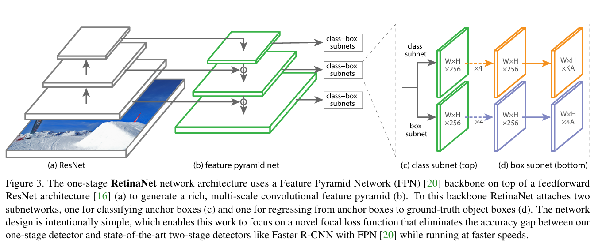

**RetinaNet 的主要组成部分：**

1. **FPN (Feature Pyramid Network)：** 作为 Neck，提供多尺度、强语义的特征图，解决了尺度变化问题。
2. **密集 Anchor 采样：** 沿用 One-stage 方式，在每个 FPN 层的每个空间位置密集布置 Anchor Box（通常是 9 个）。
3. **Focal Loss (核心创新)：** 通过修改标准交叉熵损失 $CE(p, y)$，引入**调节因子** $\alpha_t (1-p_t)^\gamma$：

$$\text{FL}(p_t) = -\alpha_t (1-p_t)^\gamma \log(p_t)$$

 $\cdot$ **作用：** $\gamma$ 是超参数（通常为 $2$）。对于**易分样本**（$p_t$ 接近 $1$，即分类置信度高），$(1-p_t)^\gamma$ 会非常小，从而大幅**降低其损失贡献**。对于**难分样本**或**误分类样本**（$p_t$ 较小），该因子接近 $1$，损失基本不变。

**结合优势：** 

 $\cdot$ **速度 (One-stage 特性)：** 保持了**无 RPN** 和**单次预测**的简洁网络结构，确保了高效的推理速度。

 $\cdot$ **精度 (接近 Two-stage 特性)：** Focal Loss 有效地**抑制了背景 Anchor（易分负样本）对总损失的贡献，迫使网络将训练精力集中在少数难分正样本**和**难分负样本**（例如边界上的 Ambiguous Anchors）上。这使得 One-stage 检测器在不牺牲速度的情况下，获得了 Two-stage 检测器通过 RPN 和 RoI 筛选机制才能达到的高精度水平。

<h2 id="10.在 Faster R-CNN 中，Region Proposal Network (RPN) 的作用是什么？它如何实现端到端训练？">10.在 Faster R-CNN 中，Region Proposal Network (RPN) 的作用是什么？它如何实现端到端训练？</h2>

**RPN 的核心作用：** 

RPN 是一种**全卷积网络（FCN）**，它以 Backbone 提取的特征图为输入，输出一系列**高质量、类别无关的**候选目标区域（Region Proposals）。它取代了传统 Two-stage 模型中耗时的外部候选区域生成方法（如 Selective Search 或 EdgeBoxes）。

**RPN 的工作流程：**

1. RPN 在特征图上滑动一个 $3 \times 3$ 的卷积核，为每个滑动窗口位置生成 $k$ 个**Anchor Boxes**（基于预设的 3 种尺度和 3 种比例）。
2. RPN 有两个并行输出分支：

​    $\cdot$ **Cls Head：** 预测 $2k$ 个分数（$k$ 个 Anchor，每个预测是**前景（目标）还是背景**的概率）。

​    $\cdot$ **Reg Head：** 预测 $4k$ 个坐标偏移量，用于将 $k$ 个 Anchor **回归**成更精确的 Proposal 框。

3. RPN 输出的 Proposals 经过 **NMS 筛选**后，作为 RoI（Region of Interest）输入到 Fast R-CNN Head。

**实现端到端训练：** Faster R-CNN 采用一种**多任务交替优化（Alternating Training）**的策略，将 RPN 和 Fast R-CNN 检测网络整合为一个统一的系统，实现了端到端训练：

1. **预训练/微调 RPN：** 单独训练 RPN，学习生成高质量 Proposal。
2. **独立训练 Fast R-CNN：** 使用上一步 RPN 生成的 Proposal 训练 Fast R-CNN Head。
3. **统一网络，微调 RPN：** 重新初始化 RPN，但保持 Backbone 和 Fast R-CNN Head 共享的卷积层不动，只微调 RPN 的特定层。
4. **统一网络，微调 Fast R-CNN Head：** 保持 RPN 共享层不动，微调 Fast R-CNN Head 的特定层。

通过共享卷积特征（特征共享）和损失函数的联合优化，使得 RPN 的 Proposal 质量能不断根据下游检测任务的需求进行优化，从而实现了高效且高性能的端到端学习。

## 【二】Backbone

<h2 id="1.介绍一下介绍目标检测中常用的经典CNN_Backbone？">1.介绍一下介绍目标检测中常用的经典CNN_Backbone？</h2>

- **VGGNet**: 3×3小卷积堆叠，结构简单但参数多，用于早期SSD、Faster R-CNN
- **ResNet**: 残差连接解决深层网络退化，ResNet-50/101最常用，是Mask R-CNN、RetinaNet等主流检测器的标配
- **ResNeXt**: 分组卷积增加cardinality，精度更高
- **DenseNet**: 密集连接特征复用好，但显存占用大
- **应用场景**: 这些backbone特征提取能力强，适合高精度检测任务

<h2 id="2.介绍一下目标检测中常用的轻量级Backbone？">2.介绍一下目标检测中常用的轻量级Backbone？</h2>

- **MobileNet系列**:
  - V1使用深度可分离卷积
  - V2引入倒残差结构
  - V3结合NAS和SE注意力
- **ShuffleNet系列**:
  - V1使用通道混洗+分组卷积
  - V2优化内存访问效率
- **EfficientNet**: 复合缩放策略，同时缩放深度/宽度/分辨率，精度效率俱佳
- **GhostNet**: Ghost模块生成冗余特征减少计算
- **CSPNet/CSPDarknet**: YOLOv4/v5的核心，速度精度平衡好
- **应用场景**: 移动端检测、边缘设备、实时检测场景

<h2 id="3.介绍一下目标检测中Transformer-based和新兴Backbone？以及如何选择">3.介绍一下目标检测中Transformer-based和新兴Backbone？以及如何选择</h2>

- **Transformer-based Backbone**:
  - **Swin Transformer**: 层级结构+滑动窗口注意力，多尺度特征好
  - **ViT**: 纯Transformer，全局建模能力强但需大量数据
  - **PVT**: 金字塔结构适合密集预测
- **新兴Backbone**:
  - **RepVGG**: 结构重参数化，训练多分支推理单路，速度极快
  - **MobileOne**: 移动端重参数化网络
  - **ConvNeXt**: 纯卷积模拟Transformer，兼具两者优势
  - **ELAN (YOLOv7)**: 高效层聚合网络
- **选择策略**:
  - 高精度: ResNet-101/Swin-L
  - 实时检测: CSPDarknet53/EfficientNet
  - 移动端: MobileNetV3/ShuffleNetV2
  - 工业部署: RepVGG/MobileOne
  - 小目标: Swin Transformer/HRNet

**发展趋势**: CNN→Transformer融合、结构重参数化、NAS自动搜索、轻量化与高效化

<h2 id="4.除了CNN和Transformer，目标检测领域还有哪些新兴的Backbone设计趋势？请简要介绍一个。">4.除了CNN和Transformer，目标检测领域还有哪些新兴的Backbone设计趋势？请简要介绍一个。</h2>

**趋势：** 1. **Mamba/State Space Models (SSM):** 尝试用更高效、能捕获长距离依赖的模型取代Attention。2. **GNNs (Graph Neural Networks):** 用于建模目标间的关系。

**以 Mamba 为例 (Vision Mamba, VIM):** VIM将Mamba结构应用于视觉任务。Mamba的核心是**选择性状态空间模型 (Selective SSM)**，它通过**数据依赖**的方式控制信息流向，能高效地捕获全局信息，且其**计算复杂度与序列长度是线性关系**，这在处理高分辨率图像时比Transformer的二次复杂度 $(O(N^2))$ 更有优势，有望成为CNN和Transformer后的下一个高效Backbone方向。

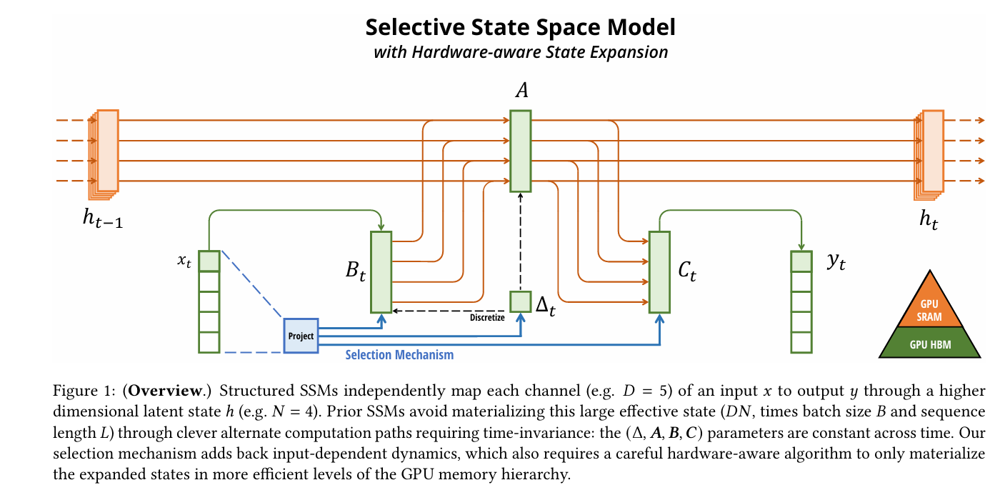

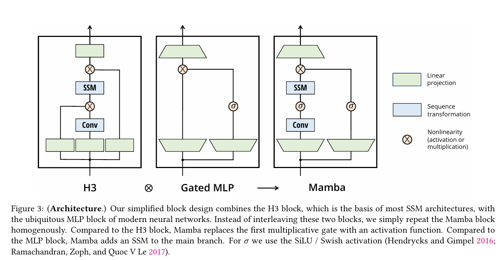

<h2 id="5.视觉Mamba（Vision Mamba/VMamba）相比传统CNN和Transformer在目标检测中有什么潜在优势？">5.视觉Mamba（Vision Mamba/VMamba）相比传统CNN和Transformer在目标检测中有什么潜在优势？</h2>

在检测任务中，其优势具体体现在**处理高分辨率图像的效率**上。

1. **线性计算复杂度**：
   - Transformer的自注意力机制（Self-Attention）计算复杂度是输入分辨率的平方级 O(N2)O(N^2)O(N2)，对于大尺寸图像（如遥感、工业检测中的 1024x1024 或更大），显存和计算开销巨大。
   - Mamba基于状态空间模型（SSM），具有**线性复杂度 O(N)O(N)O(N)**。这意味着在目标检测中，它可以更高效地处理高分辨率特征图。
2. **全局感受野与上下文建模**：
   - CNN受限于局部卷积核，需要堆叠多层才能获得全局感受野。
   - Mamba通过扫描机制（Scanning Mechanism，如2D-Selective-Scan）能够像RNN一样记住长距离信息，同时具备CNN的并行训练能力。这对于检测**大尺度目标**或**依赖上下文关系**的目标非常有利。

<h2 id="6.掩码图像建模（MIM，如MAE）预训练为何比分类预训练更适合目标检测？">6.掩码图像建模（MIM，如MAE）预训练为何比分类预训练更适合目标检测？</h2>

在目标检测的Backbone初始化中，传统的做法是使用在ImageNet上进行**有监督分类训练**的模型。但近年来，基于**掩码图像建模（Masked Image Modeling, MIM）**（如MAE, Masked Autoencoders）的自监督预训练表现出了更好的迁移性能。

**原因分析**：

1. **关注点差异**：
   - **分类预训练**倾向于学习最具判别力的特征（如猫的脸），而忽略背景或物体的整体结构。
   - **MIM预训练**要求模型重建被遮挡的像素，迫使模型理解图像的**底层几何结构、空间关系和纹理细节**。
2. **定位任务的契合度**：
   - 目标检测不仅需要分类，更需要精确的**定位（Localization）**。MIM学到的细粒度空间特征与检测任务对边界、形状的敏感性更加契合。
   - 实验表明，使用MAE预训练的ViT作为Backbone，在微调目标检测任务时，通常比有监督预训练收敛更快、精度更高。

## 第五章 前沿检测技术

## 【一】开放词汇目标检测

<h2 id="1.介绍一下GLIP（Grounded Language-Image Pre-training）及其如何将检测重构为短语定位问题？">1.介绍一下GLIP（Grounded Language-Image Pre-training）及其如何将检测重构为短语定位问题？</h2>

**GLIP** 是开放词汇目标检测（Open-Vocabulary Object Detection）的里程碑工作。

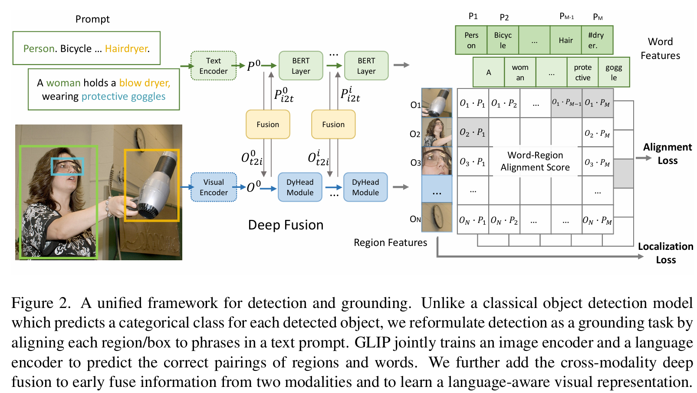

- **核心范式转变**：传统检测是预测 $N$ 个固定的类别 ID（分类任务）。GLIP 将目标检测重新定义为**短语定位（Phrase Grounding）**任务。即给定图像和一段文本（如 "person, car, dog..."），模型的任务是找到图像中与文本短语匹配的区域。
- **统一的注意力机制**：GLIP 使用深度的**跨模态融合**（Deep Fusion）。在 Backbone 阶段，视觉特征和文本特征就通过 Cross-Attention 进行交互。
- **零样本能力**：由于在训练时使用了海量的图文对数据（不仅是检测数据，还有定位数据），GLIP 学到了丰富的语义概念。推理时，只需要将没见过的类别名称放入 Text Prompt 中，模型就能根据语义相似度检测出物体，实现了强大的 Zero-Shot 能力。

<h2 id="2.介绍一下YOLO-World？">2.介绍一下YOLO-World？</h2>

YOLO-World 是一种开放词汇(Open-Vocabulary)目标检测模型,它将传统YOLO的实时检测能力扩展到了零样本检测场景。


**核心特点:**

1. **零样本检测能力**
   - 无需针对新类别进行训练,就能检测从未见过的物体
   - 只需用自然语言描述想要检测的物体,模型就能找到它
2. **开放词汇检测**
   - 打破了传统检测器只能识别固定类别的限制
   - 可以检测任意用户定义的物体类别
   - 通过视觉-语言预训练实现类别泛化
3. **实时性能**
   - 保持了YOLO系列的高效推理速度
   - 在开放词汇场景下仍能实现实时检测

**工作原理:**

- 结合视觉编码器和语言编码器
- 通过对比学习建立视觉特征与文本描述之间的联系
- 推理时,输入文本提示词(如"红色汽车"、"戴帽子的人"),模型就能定位相应物体

**应用场景:**

- 需要检测长尾类别或罕见物体
- 动态变化的检测需求(不同场景需要检测不同类别)
- 无标注数据的新领域快速部署

**意义:** YOLO-World 代表了目标检测从"封闭集"向"开放世界"的重要转变,让检测器具备了更强的泛化能力和灵活性。​

<h2 id="3.介绍一下Grounding DINO？">3.介绍一下Grounding DINO？</h2>

Grounding DINO 是一种开放集(Open-Set)目标检测模型,它能够通过自然语言文本来检测和定位图像中的任意物体,无需事先训练特定类别。


### 核心创新

**1. 语言引导的检测**

- 用户可以用自然语言描述想要检测的物体
- 例如输入"穿红色衣服的人"或"桌子上的咖啡杯",模型就能精确定位
- 支持复杂的语言描述和属性组合

**2. 架构设计**

- 结合了基于Transformer的DINO检测器和grounded预训练技术 [Top Object Detection Models](https://roboflow.com/model-task-type/object-detection)
- 融合视觉特征和语言特征,实现跨模态理解
- 采用encoder-decoder结构处理图像和文本

**3. 零样本能力**

- 可以检测训练时从未见过的物体类别
- 不需要为新类别准备标注数据
- 真正实现"开放世界"检测

### 主要特点

**优势:**

- **灵活性**: 不受固定类别限制,支持任意文本查询
- **精确定位**: 不仅能识别物体,还能准确给出边界框
- **语义理解**: 能理解复杂的语言描述和上下文关系
- **零样本泛化**: 强大的跨类别泛化能力

**典型应用:**

- 图像搜索和检索(用文本查找图中特定物体)
- 视觉问答系统
- 机器人视觉导航
- 自动标注工具

### 技术亮点

- **Grounded预训练**: 通过大规模图像-文本对进行预训练,学习视觉与语言的对齐
- **跨模态融合**: 在多个层级融合视觉和语言信息
- **端到端训练**: 检测和grounding在统一框架中联合优化

### 与传统检测器的区别

```
特性传统检测器Grounding DINO
类别固定类别(如80类)开放类别(无限)
输入仅图像图像 + 文本
泛化需要重新训练零样本检测
```

**意义:** Grounding DINO 代表了目标检测向"视觉-语言多模态"方向的重要进展,为实现真正理解人类意图的智能视觉系统奠定了基础。

## 【二】开放世界目标检测

<h2 id="1.开放词汇检测 (OVD) 与开放世界检测 (OWD) 有什么本质区别？">1.开放词汇检测 (OVD) 与开放世界检测 (OWD) 有什么本质区别？</h2>

这是面试中最容易混淆的概念，必须清晰区分：

- **开放词汇检测 (OVD)**：
  - **核心逻辑**：**“我知道它叫什么，但我没见过它的样子。”**
  - **侧重点**：侧重于**知识迁移**。利用预训练的视觉-语言模型（如CLIP），将图像特征映射到文本特征空间。
  - **场景**：在推理时，用户输入任何文本（如“皮卡丘”），即使训练集中没有皮卡丘的图片，只要模型理解文本语义与视觉特征的对应关系，就能检测出来。
  - **关键技术**：Zero-shot Learning, Vision-Language Alignment (CLIP, ALIGN).
- **开放世界检测 (OWD)**：
  - **核心逻辑**：**“我看到这里有个东西，但我不知道它是什么，但我知道它不是背景。”**
  - **侧重点**：侧重于**未知发现**和**增量学习**。模型需要具备“拒识”能力（Rejecting Known Classes），将未见过的物体标记为“Unknown”，并在随后通过人工标记将其转化为“Known”类别进行学习。
  - **场景**：自动驾驶车遇到了一个新型的路障（训练集里没见过），OWD模型应当把它框出来标记为“未知障碍物”，而不是忽略它。
  - **关键技术**：Open-set Learning, Incremental Learning, Energy-based Models.

<h2 id="2.什么是 ORE？它旨在解决什么问题，核心机制是什么？">2.什么是 ORE？它旨在解决什么问题，核心机制是什么？</h2>

**ORE**（Open World Object Detector）是发表于 CVPR 2021 的一篇开创性论文，它首次正式定义并提出了**开放世界目标检测（Open World Object Detection, OWOD）**任务，并给出了一个基于 Faster R-CNN 的基准模型。

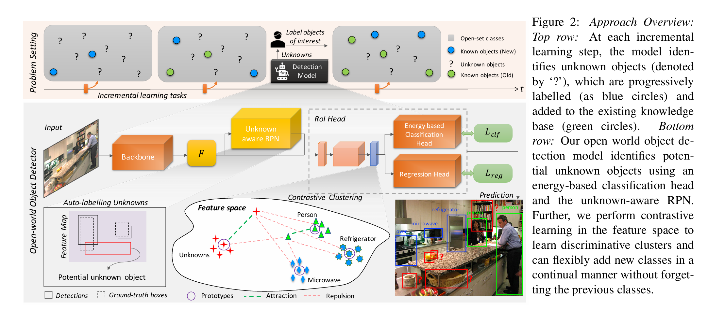

它旨在解决传统目标检测器在“封闭世界”假设下的局限性（即只能检测训练集中见过的类别，将未知物体视为背景）。OWOD 任务要求模型具备以下能力：

1. 准确检测所有“已知”类别。
2. 能够将“未知”类别的物体定位并标记为“Unknown”（而不是忽略或错误分类）。
3. 当提供未知类别的标签后，能够进行**增量学习（Incremental Learning）**以掌握新类别，同时不遗忘旧类别。

### ORE 的核心机制

ORE 的模型架构主要基于 Faster R-CNN，但引入了以下关键模块来实现上述目标：

#### 1. 对比聚类（Contrastive Clustering）

为了更好地区分已知类和未知类，ORE 在特征空间中引入了对比聚类损失。这使得属于同一已知类别的特征在潜在空间中更加紧凑，而不同类别的特征相互远离。
 其核心思想是，如果特征空间中的已知类簇足够紧凑，那么落在这些簇之外的特征就更有可能是“未知”物体。

#### 2. 基于能量的未知标识符（Energy-Based Unknown Identifier）

这是 ORE 区分“已知”与“未知”的核心。模型利用基于能量的模型（Energy-Based Model, EBM）来计算特征的能量值。
 对于一个输入特征 $\mathbf{f}$，其能量函数 $E(\mathbf{f})$ 定义如下：

$E(\mathbf{f}) = -T \log \sum_{k=1}^{K} \exp\left(\frac{g_k(\mathbf{f})}{T}\right)$

其中，$g_k(\mathbf{f})$ 是分类头针对第 $k$ 个类别的逻辑值（logits），$T$ 是温度参数。

- **已知类**通常具有较高的置信度（logits），因此计算出的能量值较**低**。
- **未知类**与现有类别的匹配度低，logits 较小，因此计算出的能量值较**高**。

通过设定一个能量阈值，模型可以将高能量的检测框判定为“Unknown”。

#### 3. 缓解灾难性遗忘（Alleviating Catastrophic Forgetting）

为了实现增量学习（即在步骤 3 中学习新发现的类别），ORE 使用了一个**重放缓冲区（Replay Buffer）**。

- 它保存了一组平衡的旧类别样本（Exemplars）。
- 在微调模型以学习新类别时，这些旧样本会通过重放机制参与训练，从而防止模型在优化新类别参数时“遗忘”之前学到的已知类别。

<h2 id="3.开放世界检测（OWD）中，如何区分“未知目标（Unknown）”和“背景（Background）”？">3.开放世界检测（OWD）中，如何区分“未知目标（Unknown）”和“背景（Background）”？</h2>

**难点：** 在开放世界检测（OWD/OWOD）中，训练数据只标注已知类（Known），图像里未标注的未知类实例会被检测器当作“背景负例”去学习，导致 **Unknown 与 Background 的监督信号天然纠缠**：未知物体既可能被压成背景，也可能被误分到某个已知类。turn9view0turn8view1

### 1) Objectness（物体性）用于“前景门控”，先把纯背景筛掉

现代 OWOD 更倾向把“是不是一个独立物体（foregroundness）”与“属于哪个已知类别（class）”解耦：
对候选区域先预测一个 **class-agnostic 的 objectness / foreground 概率**，用它作为门控：objectness 低的候选直接视为 **Background**；objectness 高的候选才进入下一步做 Known/Unknown 判别。OW-DETR 明确引入 objectness 分支来学习“前景（known + pseudo-unknown）vs 背景”的分离。

进一步地，PROB 提出用**概率/生成式**方式学习“通用 objectness”，强调该头不依赖“未知作为负例”的训练方式，从而缓解 background–unknown 混淆。
（OWOBJ/OWOBJ-like 思路则更进一步：显式建模 objectness，并指出未标注实例很容易被学成背景，因此需要更“开放”的 objectness 建模来减少偏置。）

### 2) Energy / EBM 用于“已知性（knownness）”，在“疑似物体”里区分 Known vs Unknown

在通过 objectness 门控后的候选上，再用能量/不确定性来判断它“像不像已知类分布”。ORE 的能量识别使用基于 logits 的 Helmholtz free energy（常见写法如下），并拟合已知与未知的能量分布做阈值判别：

$$
E(x)=-T\cdot \log\sum_i \exp\left(\frac{f_i(x)}{T}\right)
$$

**关键更新点（请用这句替换你原来的“unknown 在 known 与 background 之间的能量带”）：**
能量更稳健地反映的是 **“Known vs 非Known（Unknown + hard background）”** 的差异：Known 往往低能量；Unknown 与“像物体的困难背景/噪声候选”都可能高能量并发生重叠。因此，能量通常应当**在 objectness 较高的候选集合内**使用，以避免把大量纯背景直接当成 Unknown。

最近的工作也在延续“能量分离”的方向，但强调仅在已知空间看能量可能不够，例如 DEUS 提出用 ETF 子空间把已知/未知表示分到更正交的空间，并结合两边能量来做更干净的未知分离。

### 3) 一个更稳健的推理判决规则（两轴而不是一维能量）

给定候选框 $b$：

- 若 $s_{\text{obj}}(b) < \tau_{\text{obj}}$ ⇒ **Background**
- 否则（高物体性），再看“已知性”：
  - 若 $E(b) > \tau_E$（或已知类最大置信度很低/熵很高等）⇒ **Unknown**
  - 否则 ⇒ **Known**

> 直观总结：**objectness 负责“是不是物体”，energy/novelty 负责“像不像已知类”。**

---

<h2 id="4.介绍一下OW-DETR？它相比于基于Faster_R-CNN的ORE有什么优势？">4.介绍一下OW-DETR？它相比于基于Faster_R-CNN的ORE有什么优势？</h2>

**OW-DETR** 是将 Transformer 架构（具体为 Deformable DETR）应用于开放世界检测的代表性工作。在此之前，以 ORE 为代表的方法主要基于 Two-stage 的 Faster R-CNN。

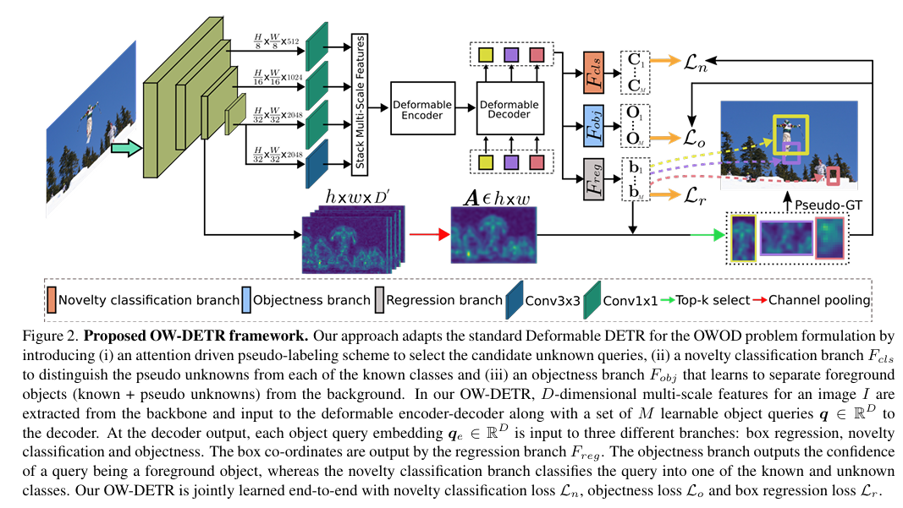

**OW-DETR 的核心优势：**

1. **端到端的注意力机制**：
   - ORE 依赖 RPN（区域建议网络）来生成候选框，RPN 对未知物体的泛化能力有限。
   - OW-DETR 利用 Transformer 的**注意力图（Attention Maps）**。研究发现，即使是未见过的物体，Transformer 的注意力机制也能很好地聚焦在其前景区域。这使得 OW-DETR 在发现“未知目标”方面具有天然优势。
2. **多尺度上下文感知**：
   - OW-DETR 设计了**注意力驱动的伪标签（Attention-driven Pseudo-labeling）**机制。它利用注意力热图的高响应区域来筛选潜在的未知目标，并将其作为伪标签进行训练，从而比 ORE 基于能量的方法更精准地定位未知物体。
3. **减少对 RPN 的依赖**：
   - 消除了锚框（Anchor）和 NMS 的限制，使得模型在处理非典型形状的未知物体时更加灵活。

<h2 id="5.在开放世界检测中，什么是“灾难性遗忘（Catastrophic_Forgetting）”，通常如何解决？">5.在开放世界检测中，什么是“灾难性遗忘（Catastrophic_Forgetting）”，通常如何解决？</h2>

开放世界检测是一个**增量学习（Incremental Learning）**的过程：模型先学习任务 A（如检测猫、狗），一段时间后需要学习任务 B（如检测无人机、机器人）。

**灾难性遗忘**指的是：当模型使用新数据训练以掌握新类别（任务 B）时，其在旧类别（任务 A）上的性能会急剧下降，仿佛“忘记”了之前学到的知识。这是因为神经网络的权重被更新以适应新分布，覆盖了旧的特征表示。

**主流解决方案：重放缓冲区（Replay Buffer / Experience Replay）**

- **机制**：在学习新任务时，不仅仅使用新数据，而是从一个**有限容量的缓存区**中采样一部分旧类别的代表性样本（Exemplars），与新数据混合在一起进行训练。
- **作用**：通过不断“复习”少量的旧数据，约束模型的参数更新方向，使其既能优化新类别的损失，又不会在旧类别的损失面上偏离太远。
- **优化**：现在的研究还包括**特征蒸馏（Distillation）**，即强制新模型的特征提取结果与旧模型保持一致，进一步减轻遗忘

## 【三】视觉提示与交互式检测

<h2 id="1.什么是T-Rex模型？它是如何通过“视觉提示（Visual_Prompting）”实现通用物体检测的？">1.什么是T-Rex模型？它是如何通过“视觉提示（Visual_Prompting）”实现通用物体检测的？</h2>

**T-Rex** 是一种创新的通用物体检测模型，它引入了**视觉提示（Visual Prompting）\**的交互范式。与传统的依赖预定义类别或 GLIP 等依赖文本描述的模型不同，T-Rex 允许用户通过\**在参考图像上画框或点**来指定想要检测的目标。

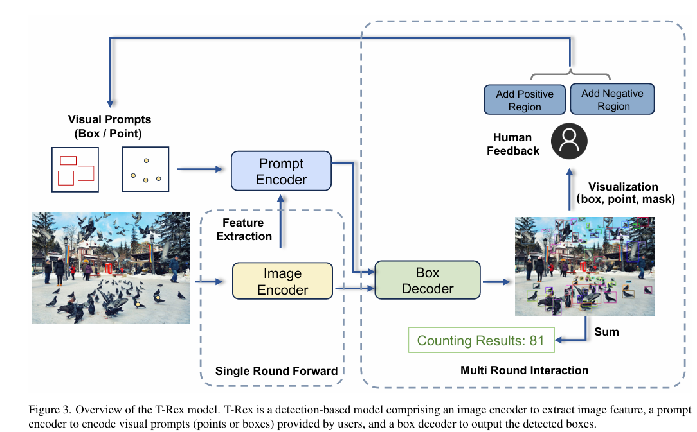

**核心工作机制：**

1. **视觉提示编码器**：用户提供一张包含特定物体的图像，并在该物体上标记一个点或框（即 Visual Prompt）。模型会通过编码器提取该区域的视觉特征。
2. **视觉匹配与推理**：模型将提取到的视觉特征作为 Query（查询），在目标图像中进行全局搜索，定位所有具有相似视觉特征的物体。
3. **交互式反馈**：用户可以通过增加正样本提示或负样本提示，实时修正模型的检测结果，从而不断提升精度。

**解决了什么痛点？**

- **难以描述的物体**：许多工业零件、特定纹理的布料或抽象图案很难用自然语言准确描述，但给出一个视觉样例（参考图）却非常直观。
- **密集物体计数**：在清点钢管、细胞或农作物时，用户只需在一个目标上点一下，T-Rex 就能检测出图中所有相似的物体，极大简化了计数任务。
- **少样本/零样本适应**：无需重新训练模型，仅需提供几个视觉示例（Few-shot visual prompts），模型就能快速适应全新的业务场景。

<h2 id="2.相比于文本提示（如GLIP），视觉提示（Visual_Prompting）在目标检测中有什么独特优势？">2.相比于文本提示（如GLIP），视觉提示（Visual_Prompting）在目标检测中有什么独特优势？</h2>

虽然 GLIP 和 Grounding DINO 等基于文本的模型很强大，但视觉提示（Visual Prompting）在以下场景具有不可替代的优势：

1. **消除歧义（Disambiguation）**：
   - *文本*：“红色的车”。（图中可能有法拉利，也有红色的卡车，文字很难区分）。
   - *视觉*：直接框选那辆具体的法拉利。模型会匹配其具体的形态特征，排除红色卡车。
2. **处理罕见/细粒度类别**：
   - 对于从未见过的生物物种、特定型号的螺丝或抽象符号，模型可能没有对应的文本词汇知识（Out-of-Vocabulary）。但通过视觉特征匹配，模型只需“看图找图”，无需理解其名称。
3. **跨语言障碍**：
   - 视觉提示是通用的，不需要用户知道目标的具体名称（如医学术语或外语名称）即可进行检测。

<h2 id="3.介绍一下SEEM（Segment_Everything_Everywhere_All_at_Once）？它支持哪些类型的交互提示？">3.介绍一下SEEM（Segment_Everything_Everywhere_All_at_Once）？它支持哪些类型的交互提示？</h2>

**SEEM** 是一个功能强大的通用分割与检测接口，它的核心创新在于**多模态提示的统一接口**。它试图将所有类型的交互方式映射到同一个语义空间中。

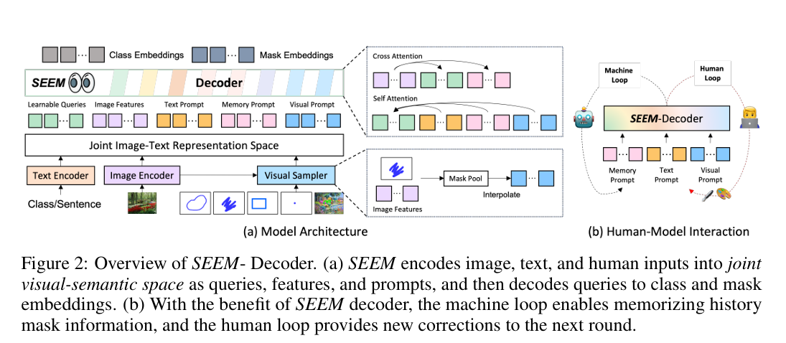

**支持的提示类型（Prompts）：**

1. **视觉提示（Visual Prompts）**：点（Points）、框（Boxes）、涂鸦（Scribes）以及参考图像区域。
2. **文本提示（Text Prompts）**：自然语言描述。
3. **音频提示（Audio Prompts）**：这在检测模型中非常少见，用户可以通过说话（结合 Whisper 模型转文字或直接音频特征）来指示目标。

**核心机制**：
SEEM 引入了一个**联合视觉-语言-音频空间**。无论用户是画了一个框，还是说了一句话，这些输入都会被编码成统一的 Prompt Embeddings，然后指导解码器在图像中生成对应的掩码（Mask）或边界框。

## 【四】视觉基础模型与多模态检测

<h2 id="1.介绍一下Florence-2？它是如何统一目标检测、分割和图像描述任务的？">1.介绍一下Florence-2？它是如何统一目标检测、分割和图像描述任务的？</h2>

**Florence-2** 是微软在 2024 年提出的一个高效的**统一视觉基础模型**。它打破了计算机视觉中“一个模型做一个任务”（如专门的检测器、专门的分割器）的碎片化范式，将目标检测、实例分割、图像描述（Captioning）、视觉定位（Grounding）等任务全部统一为一个**序列生成（Sequence-to-Sequence）**问题。

**核心机制：**

1. **Prompt 驱动的任务定义**：

   - Florence-2 接受“图像 + 文本提示”作为输入。用户不需要修改模型结构，只需输入特定的 **Task Prompt** 字符串来定义任务。
   - 例如：输入 <OD> 代表请求目标检测（Object Detection）；输入 <CAPTION> 代表请求图像描述；输入 <REFERRING_EXPRESSION_SEGMENTATION> 代表指代分割。

2. **坐标文本化（Textualized Coordinates）**：

   - 对于检测任务，模型并不输出回归数值，而是将边界框坐标 

     ```
     (x1,y1,x2,y2)(x1,y1,x2,y2)
     ```

      量化为离散的文本 Token（例如 <loc_100><loc_200>...）。

     模型直接输出包含类别标签和坐标 Token 的混合文本序列。

**优势：**
这种设计使得一个模型可以无缝处理多种粒度的视觉任务（从全图描述到物体检测，再到像素级分割），并且由于在海量多任务数据（FLD-5B）上进行训练，它具有极强的 Zero-shot 和迁移能力，且推理速度远快于同等规模的多模态大模型。
