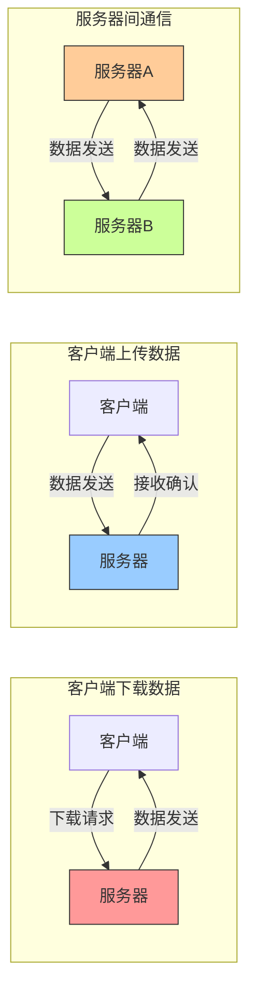
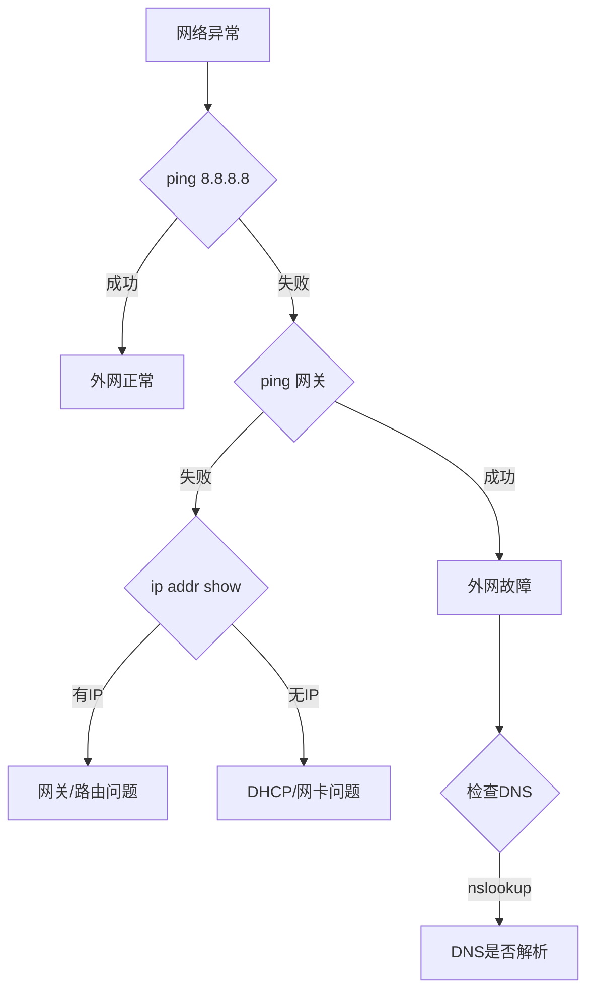

# 目录


- [1.TCP/IP四层模型的相关概念](#user-content-1.tcpip四层模型的相关概念)
- [2.OSI七层模型的相关概念](#user-content-2.osi七层模型的相关概念)
- [3.TCP和UDP的区别？](#user-content-3.tcp和udp的区别？)
- [4.如何让两台服务器之间ssh免密通信？](#user-content-4.如何让两台服务器之间ssh免密通信？)
- [5.两个Linux服务器之间数据传输的命令有哪些？](#user-content-5.两个Linux服务器之间数据传输的命令有哪些？)
- [6.在AI项目中，从云端读取传输信息失败，显示网络不可用，一般可以怎么解决呢？](#6.在AI项目中，从云端读取传输信息失败，显示网络不可用，一般可以怎么解决呢？)
- [7.在AI行业中两个服务器之间的通信有哪些注意事项？](#7.在AI行业中两个服务器之间的通信有哪些注意事项？)
- [8.介绍一下计算机中“0.0.0.0”ip地址的意义](#8.介绍一下计算机中“0.0.0.0”ip地址的意义)
- [9.什么是计算机中的端口号？](#9.什么是计算机中的端口号？)
- [10.介绍一下AI行业中API的原理与作用](#10.介绍一下AI行业中API的原理与作用)
- [11.计算机中http协议与ssh协议有哪些异同？](#11.计算机中http协议与ssh协议有哪些异同？)
- [12.介绍一下计算机中DNS（Domain Name System）的概念](#12.介绍一下计算机中DNS（Domain-Name-System）的概念)
- [13.介绍一下计算机中带宽的概念](#13.介绍一下计算机中带宽的概念)
- [14.计算机中数据传输速度和哪些因素有关？](#14.计算机中数据传输速度和哪些因素有关？)
- [15.http协议和grpc协议有哪些异同？](#15.http网络协议和grpc协议有哪些异同？)
- [16.介绍一下计算机中DOS攻击的概念](#16.介绍一下计算机中DOS攻击的概念)
- [17.计算机服务器的上行带宽与下行带宽对数据传输速度的影响？](#17.计算机服务器的上行带宽与下行带宽对数据传输速度的影响？)
- [18.计算机服务器如何检查网络是否正常？](#18.计算机服务器如何检查网络是否正常？)
- [19.Linux系统中如何优雅的进行端口管理？](#19.Linux系统中如何优雅的进行端口管理？)


<h2 id="1.tcpip四层模型的相关概念">1.TCP/IP四层模型的相关概念</h2>

<font color=DeepSkyBlue>TCP/IP四层模型</font>：

1. 应用层：负责各种不同应用之间的协议，如文件传输协议（FTP），远程登陆协议（Telnet），电子邮件协议（SMTP），网络文件服务协议（NFS），网络管理协议（SNMP）等。

2. 传输层：负责可靠传输的TCP协议、高效传输的UDP协议。

3. 网络层：负责寻址（准确找到对方设备）的IP，ICMP，ARP，RARP等协议。

4. 数据链路层：负责将数字信号在物理通道（网线）中准确传输。

<font color=DeepSkyBlue>四层模型逻辑</font>：

发送端是由上至下，把上层来的数据在头部加上各层协议的数据（部首）再下发给下层。

接受端则由下而上，把从下层接收到的数据进行解密和去掉头部的部首后再发送给上层。

层层加密和解密后，应用层最终拿到了需要的数据。

<h2 id="2.osi七层模型的相关概念">2.OSI七层模型的相关概念</h2>


<h2 id="3.tcp和udp的区别？">3.TCP和UDP的区别？</h2>

1. TCP面向连接，UDP是无连接的；
2. TCP提供可靠的服务，也就是说，通过TCP连接传送的数据，无差错，不丢失，不重复，且按序到达；UDP尽最大努力交付，即不保证可靠交付；
3. TCP的逻辑通信信道是全双工的可靠信道；UDP则是不可靠信道；
4. 每一条TCP连接只能是点到点的；UDP支持一对一，一对多，多对一和多对多的交互通信；
5. TCP面向字节流（可能出现黏包问题），本质上是TCP把数据看成一连串无结构的字节流；UDP是面向报文的（不会出现黏包问题）；
6. UDP没有拥塞控制，因此网络出现拥塞不会使源主机的发送速率降低（对实时应用很有用，如IP电话，实时视频会议等）；
7. TCP首部开销20字节；UDP的首部开销小，只需8个字节。


<h2 id="4.如何让两台服务器之间ssh免密通信？">4.如何让两台服务器之间ssh免密通信？</h2>

在Ubuntu系统中设置基于SSH密钥的认证，可以在两台服务器之间进行无密码连接。这对于自动化任务（如文件传输、备份和远程命令执行）特别有用。以下是设置SSH密钥认证的步骤：

1. 创建.ssh目录

假定有2台Linux服务器主机，分别为A，B。

我们先在所有服务器主机上创建ssh目录并赋予权限:
```bash
mkdir /root/.ssh 
chmod 700 /root/.ssh
```

2. 生成公钥与私钥

我们接着需要生成所有服务器主机的公钥与私钥，执行以下命令：

```bash
$ cd ~  # 进⼊入用户目录
$ ssh-keygen -t rsa -P ""  # 生成ssh密码，-t 参数表示生成算法，可以选择rsa和dsa；-P表示使用的密码，""表示无密码。
```

3. 将公钥追加authorized_keys文件中

将第一台服务器主机A上生成公钥追加到authorized_keys文件中:
```bash
$ cd ~/.ssh  # 进入.ssh目录
$ cat id_rsa.pub >> authorized_keys   # 将id_rsa.pub的内容追加到authorized_keys文件中
```

接下来我们使用同样的命令在服务器主机B上生成id_rsa.pub并写入到服务器主机A的authorized_keys文件中，再将服务器主机A的authorized_keys文件复制到服务器主机B的对应路径下即可：/root/.ssh/


<h2 id="5.两个Linux服务器之间数据传输的命令有哪些？">5.两个Linux服务器之间数据传输的命令有哪些？</h2>

在Linux系统中，有几种常用的命令可以用来在两台服务器之间传输数据。这些命令各有特点，适用于不同的场景和需求，Rocky下面为大家进行详细的总结与梳理：

1. **`scp` (Secure Copy Protocol)**
   - `scp` 命令是基于 SSH (Secure Shell) 协议的一种文件传输工具，它可以在两台服务器之间安全地复制文件或目录。由于`scp`使用SSH进行数据传输，所以它在传输过程中提供了通信加密，保证了数据的安全性和完整性。
   - 基本语法:
     ```bash
     scp [选项] 源文件 用户名@目标主机:目标路径
     scp [选项] 用户名@源主机:源文件路径 目标路径
     ```
   - 常用选项
     - `-P port`：指定SSH连接使用的端口。
     - `-p`：保留原文件的修改时间、访问时间和访问权限。
     - `-r`：递归复制整个目录。
     - `-q`：静默模式，不显示传输进度条和消息。
     - `-C`：开启压缩选项，传输时自动压缩数据。
   - 例子：
     - 将本地文件 `file.txt` 复制到远程服务器：
       ```bash
       scp file.txt username@remotehost:/path/to/destination/
       ```
     - 从远程服务器复制文件到本地：
       ```bash
       scp username@remotehost:/path/to/file.txt /local/destination/
       ```
     - 递归复制目录到远程服务器：
       ```bash
       scp -r /local/dir username@remotehost:/remote/dir
       ```
     - 指定SSH端口：
       ```bash
       scp -P 2222 file.txt username@remotehost:/path/
       ```
   - `scp` 支持递归复制目录（使用 `-r` 选项），指定端口（使用 `-P` 选项），以及更多功能。

   - 安全考虑

      由于`scp`依赖于SSH，它继承了SSH的所有安全特性，包括数据加密和用户身份验证。尽管如此，用户在使用`scp`时仍应注意：

      - 避免使用明文密码认证，应使用基于密钥的认证。
      - 确保SSH服务配置得当，如禁用root直接登录，使用强密码或密钥对等。
      - 注意检查目标主机的身份，以防止中间人攻击。

      `scp`虽然功能强大且安全，但由于其不支持同步更新（只能盲目复制），在需要高效同步文件或目录时，可能需要考虑使用`rsync`等工具。
  
2. **`rsync` (Remote Synchronization)**
   - `rsync` 是一个更为强大的数据同步工具，用于高效地同步文件和目录到不同的主机或本地文件系统。与 `scp` 相比，**`rsync` 最大的优势在于它能够进行增量备份，只复制变化的部分，大大提高了传输效率**。此外，`rsync` 还支持错误校正、无需开启远程 shell 用户的文件同步等功能。
   - 基本语法：
     ```bash
     rsync [选项] 源路径 目标用户@目标主机:目标路径
     rsync [选项] 目标用户@源主机:源路径 目标路径
     ```
   - 常用选项
      - `-a`（archive）: 归档模式，等同于 `-rlptgoD`，它包含了递归、保留符号链接、保留权限、保留时间戳、保留属主、保留组和保留设备文件（如果有必要）。
      - `-v`（verbose）: 输出详细信息，可以帮助调试。
      - `-u, --update`: 在复制文件时跳过那些在目标目录中已经存在且文件修改时间更新的文件。
      - `-z`（compress）: 数据传输过程中启用压缩。
      - `-h`（human-readable）: 输出易于阅读的格式。
      - `-n`（dry run）: 模拟运行，不进行实际的文件传输，常用于测试。
      - `--delete`: 删除目标目录中源目录不存在的文件，常用于镜像。
      - `-e`（executor）: 指定使用的远程 shell，通常是 `ssh`。
      - `--progress`: 显示进度条。
   - 例子：
     - 同步本地目录到远程服务器目录：
       ```bash
       rsync -avz /local/dir username@remotehost:/remote/dir
       ```
     - 从远程服务器同步目录到本地：
       ```bash
       rsync -avz username@remotehost:/remote/dir /local/dir
       ```
     - 使用非标准 SSH 端口：
       ```bash
       rsync -avz -e "ssh -p 2222" /local/dir/ username@remotehost:/remote/dir/
       ```
   - `rsync` 的 `-a` 选项代表归档模式，可保持所有权限等属性，`-v` 选项表示详细模式，`-z` 选项表示传输过程中进行压缩。

   - 安全考虑
      - 使用 `rsync` 时，最好通过 SSH 进行数据传输，这样可以保证数据在传输过程中的安全性。
      - 配置文件和权限应当谨慎设置，特别是在使用 `--delete` 选项时，因为这可能导致目标路径中的数据被删除。

  `rsync` 由于其灵活性和效率，是进行大规模文件同步和备份的首选工具。它的增量备份能力特别适合定期备份大数据量的场景。

3. **`sftp` (SSH File Transfer Protocol)**
   - `sftp` 是另一个基于 SSH 的文件传输协议，提供交互式的文件传输会话。
   - 基本使用：
     - 进入 `sftp` 会话：
       ```bash
       sftp username@remotehost
       ```
     - 在会话中，可以使用类似 `ftp` 的命令来上传或下载文件，如 `put`, `get`, `ls`, `cd` 等。

这些命令各有优势，选择哪个取决于我们的具体需求，如是否需要加密（`scp` 和 `rsync` 通过 SSH 提供加密），是否需要同步目录或仅传输单个文件，以及是否需要压缩等。在实际应用中，我们可以根据具体场景和需求灵活选择使用。


<h1 id='6.在AI项目中，从云端读取传输信息失败，显示网络不可用，一般可以怎么解决呢？'>6.在AI项目中，从云端读取传输信息失败，显示网络不可用，一般可以怎么解决呢？</h1>

当在AI项目中从云端读取或传输信息失败，并显示网络不可用时，可能有多种原因。**作为算法工程师，我们不需要知根知底关于网络方面的所有知识，但是我们需要知道常见的问题可能性，这样能够与网络部门的同事更好的沟通，同时知道网络端问题排查优化的相应成本，有利于整体AI项目的成本管理**。

以下是一些常见的网络不可用原因和相应的解决方案：

### 1. 检查网络连接

确保服务器或本地机器的网络连接正常。这是最基本的步骤，我们可以通过以下方式检查：

- **ping 命令**：检查与目标服务器的连接。
  ```bash
  ping www.WeThinkIn.com
  ```
- **curl 命令**：尝试从目标 URL 下载文件。
  ```bash
  curl -I https://www.WeThinkIn.com/path/to/image.jpg
  ```

### 2. 检查防火墙和安全组设置

如果我们使用的是云服务器（如 AWS、GCP、Azure），确保防火墙或安全组设置允许出站 HTTP/HTTPS 请求。

- **AWS 安全组**：在AWS管理控制台中，检查安全组的出站规则，确保允许端口 80（HTTP）和 443（HTTPS）。
- **本地防火墙**：检查本地机器的防火墙设置，确保允许 HTTP/HTTPS 流量。

### 3. 检查代理设置

有时项目组的网络或服务器环境可能需要通过代理访问。检查是否需要设置代理：

- **配置环境变量**：
  ```bash
  export http_proxy=http://proxy.WeThinkIn.com:port
  export https_proxy=https://proxy.WeThinkIn.com:port
  ```

### 4. 检查URL和权限

我们需要确保提供的URL正确，并且有权限访问该URL：

- **URL是否正确**：检查URL是否拼写正确。
- **权限问题**：如果URL需要身份验证，确保我们提供了正确的认证信息。

### 5. 重试机制

网络请求有时会因为临时问题失败，我们可以通过添加重试机制可以提高成功率。可以使用 `requests` 库的 `Retry` 机制：

```python
import requests
from requests.adapters import HTTPAdapter
from requests.packages.urllib3.util.retry import Retry

url = 'https://www.WeThinkIn.com/path/to/image.jpg'

# 创建一个 session
session = requests.Session()

# 定义重试策略
retries = Retry(total=5, backoff_factor=1, status_forcelist=[500, 502, 503, 504])

# 将重试策略应用到 HTTPAdapter
session.mount('http://', HTTPAdapter(max_retries=retries))
session.mount('https://', HTTPAdapter(max_retries=retries))

try:
    response = session.get(url, timeout=10)
    response.raise_for_status()  # 如果请求失败，抛出 HTTPError
    with open('image.jpg', 'wb') as f:
        f.write(response.content)
    print('Image downloaded successfully')
except requests.exceptions.RequestException as e:
    print(f'Error downloading image: {e}')
```

### 6. 检查云端服务状态

有时云端服务可能会有临时故障或维护，可以及时联系云服务提供商进行问题排查和解决。

### 7. 日志记录和错误处理

我们可以记录详细的错误日志，有助于诊断问题。确保捕获和记录所有可能的异常：

```python
import logging

logging.basicConfig(filename='download.log', level=logging.ERROR)

try:
    response = session.get(url, timeout=10)
    response.raise_for_status()
    with open('image.jpg', 'wb') as f:
        f.write(response.content)
    print('Image downloaded successfully')
except requests.exceptions.RequestException as e:
    logging.error(f'Error downloading image: {e}')
    print(f'Error downloading image: {e}')
```


<h1 id='7.在AI行业中两个服务器之间的通信有哪些注意事项？'>7.在AI行业中两个服务器之间的通信有哪些注意事项？</h1>

在AI行业中，两个服务器之间的通信涉及到大量的数据传输和计算，这对通信的效率、可靠性和安全性提出了更高的要求。我们需要确保AI系统中服务器间通信的高效、安全和可靠，从而支持复杂的AI应用场景，如分布式训练、模型部署和大数据处理等。以下是两个服务器之间通信时需要特别注意的事项，结合AI应用的具体场景进行了详细解释：

### 1. **数据传输效率**
   - **大数据传输**：AI应用通常需要处理大量的数据集，如训练数据、模型权重等。为了提高传输效率，可以采用以下措施：
     - **压缩数据**：使用压缩算法（如gzip、lz4）在传输前对数据进行压缩，减少带宽占用。
     - **增量传输**：对于模型更新，采用差分更新的方式，仅传输变化部分（如参数更新、权重差异），而不是每次传输整个模型。
     - **分片传输**：将大数据集分割成较小的数据块，以并行方式进行传输，可以显著提高传输速度。
     - **异步传输**：使用异步通信机制，避免服务器等待数据传输完成后再执行其他任务，从而提高整体效率。

   - **带宽利用**：在两个服务器之间的数据传输中，带宽是一个关键因素。为了最大化带宽利用率，可以：
     - **多线程传输**：使用多线程或多通道技术同时传输多个数据块，提升带宽利用率。
     - **流量控制**：在传输大量数据时，使用流量控制技术防止网络拥塞，并确保传输的稳定性。

### 2. **数据安全性**
   - **加密传输**：AI模型、训练数据等通常包含敏感信息，因此需要使用强加密机制（如TLS/SSL）进行数据传输，防止数据在传输过程中被截获或篡改。
     - **端到端加密**：确保从源服务器到目标服务器的整个传输路径都是加密的，不仅是在传输通道中加密，还要保护存储在服务器上的数据。
   - **身份验证**：确保通信双方是经过验证的服务器，防止中间人攻击或伪装服务器接入网络。
     - **双向认证**：在AI模型和数据传输过程中，采用双向认证机制（如X.509证书）以确保通信双方的合法性。

### 3. **容错性和可靠性**
   - **断点续传**：AI行业中的数据传输任务可能非常庞大且耗时较长，通信中断可能导致数据传输失败。使用断点续传技术，在通信中断后重新建立连接时，从中断的地方继续传输数据。
   - **冗余传输**：为了防止数据丢失，可以在关键数据传输时采用冗余传输，即在传输过程中增加校验机制或在多个路径上同时传输数据，以确保数据传输的完整性和可靠性。
   - **备份机制**：在传输前后，定期对重要数据进行备份，确保在通信失败或数据损坏时能够快速恢复。

### 4. **同步与一致性**
   - **模型和数据的一致性**：在AI系统中，多个服务器可能需要共享同一组模型或数据，确保各服务器之间的数据和模型一致性至关重要。可以使用分布式版本控制系统或一致性协议（如Paxos、Raft）来管理。
   - **分布式锁**：在多台服务器之间共享模型或数据时，使用分布式锁（如Zookeeper、Etcd）来防止并发写操作导致的数据冲突或不一致性。

### 5. **通信协议与API设计**
   - **协议选择**：选择合适的通信协议对于保证数据传输的性能和可靠性至关重要，如TCP、UDP、HTTP/HTTPS、WebSocket等。
     - **gRPC**：一种高性能、开源的远程过程调用（RPC）框架，支持多语言，是AI行业中常用的跨服务器通信协议。
     - **RESTful API**：基于HTTP的API设计，简单易用，适用于传输频率不高的AI服务通信。
     - **消息队列**：在需要异步通信或解耦服务器之间的依赖时，使用Kafka、RabbitMQ等消息队列来缓冲数据并确保数据传输的可靠性。

   - **API设计**：良好的API设计可以提升服务器间通信的效率和易用性。
     - **幂等性**：确保API在多次调用时具有幂等性，即多次调用产生相同的结果，防止重复操作引发的错误。
     - **版本控制**：随着AI模型的更新，API接口可能会发生变化，采用版本控制机制确保新旧接口能够兼容。

### 6. **性能监控与优化**
   - **实时监控**：部署实时监控系统（如Prometheus、Grafana）监控服务器之间的通信状态，包括带宽使用率、数据包丢失率、传输延迟等，及时发现并解决问题。
   - **负载均衡**：对于多服务器通信，使用负载均衡器（如Nginx、HAProxy）分配通信流量，防止单一服务器负载过重，并提高整体通信效率。
   - **缓存**：在AI系统中，某些计算结果或中间数据可以在服务器之间缓存，减少重复计算和数据传输，提升效率。

### 7. **跨地域通信**
   - **地理分布的延迟**：AI服务器可能分布在全球各地，通信延迟和带宽差异是不可避免的。可以使用CDN（内容分发网络）或边缘计算节点来减少延迟，并提高跨地域通信的效率。
   - **数据合规性**：跨国通信时，需遵循各国的数据隐私法律（如GDPR），确保数据传输过程中的合规性和安全性。

### 8. **边缘计算与云端通信**
   - **边缘计算节点**：在AI应用中，边缘计算用于处理靠近数据源的计算任务，减少通信延迟和带宽消耗。确保边缘设备与云端服务器之间的通信可靠且高效。
   - **混合云架构**：在混合云架构中，通信可能在本地服务器和云端服务器之间进行，确保云端和本地的数据同步和一致性至关重要。

### 9. **数据格式与序列化**
   - **高效数据格式**：选择适当的数据格式传输AI模型和数据，如使用Protocol Buffers、MessagePack等高效的二进制序列化格式，减少数据体积并提高传输速度。
   - **版本兼容性**：在传输模型和数据时，确保不同版本的模型和数据格式兼容，以避免在反序列化时出现错误。

### 10. **合法性与合规性**
   - **数据隐私和安全性**：在AI系统中，数据隐私和安全性是重中之重。确保在通信中遵循行业标准和法规（如GDPR），对敏感数据进行适当的加密和匿名化处理。
   - **审计和合规**：记录通信日志，并定期审计，以确保通信过程符合企业和行业的合规要求。


<h1 id='8.介绍一下计算机中“0.0.0.0”ip地址的意义'>8.介绍一下计算机中“0.0.0.0”ip地址的意义</h1>

在计算机网络中，**`0.0.0.0`** 是一个特殊的 IP 地址，具有多种用途，取决于具体使用场景。它并不指向任何特定的设备，而是用来表示 "所有 IP 地址" 或 "没有指定的地址"。下面是 `0.0.0.0` 在不同情况下的含义和用途：

### 1. **表示所有可用的 IPv4 地址**

当 `0.0.0.0` 被用在服务器或服务监听时，它表示该服务会监听设备上**所有可用的网络接口**。这是最常见的用途。

#### 使用场景：
- **服务监听**：例如，在 Web 服务器中，如果服务器绑定到 `0.0.0.0`，那么该服务将监听所有可用的网络接口。这意味着无论你通过哪一个网络接口的 IP 地址访问（例如 `localhost`、局域网 IP 或公网 IP），服务器都会接受连接。
  
  **示例**：
  - `http://0.0.0.0:8080` 表示服务器在端口 8080 上监听所有接口。你可以通过 `localhost:8080` 或设备的局域网 IP 访问它。

#### 解释：
- 在网络接口上，有多个可能的地址，例如本地回环地址 `127.0.0.1`，或设备的实际 IP 地址（例如 `192.168.1.100`）。`0.0.0.0` 作为绑定地址时，意味着服务会监听这些所有的地址，不管请求是从哪一个网络接口进入的。

### 2. **表示一个未指定的地址**

当一个设备或网络配置为 `0.0.0.0` 时，意味着该设备或网络接口目前**没有被分配具体的 IP 地址**，或者还没有获得一个有效的 IP 地址。

#### 使用场景：
- **DHCP 客户端请求**：当一个设备通过 DHCP（动态主机配置协议）请求 IP 地址时，它会使用 `0.0.0.0` 作为自己的源地址，因为在这个阶段，它还没有被分配一个实际的 IP 地址。

#### 解释：
- 在 DHCP 请求阶段，设备还没有获取到合法的 IP 地址，因此会暂时使用 `0.0.0.0` 来表示自己。

### 3. **默认路由**

在路由表中，`0.0.0.0/0` 通常表示**默认路由**。它告诉操作系统，当无法通过更具体的路由找到目的地时，将流量发往默认网关。

#### 使用场景：
- **网络路由表**：例如，在路由器或计算机的网络路由表中，`0.0.0.0/0` 表示匹配所有未明确路由的流量。默认路由通常会指向外部网关（如互联网的路由器），从而将流量引向更大的网络（例如互联网）。

#### 解释：
- 如果一个数据包的目标地址没有匹配到任何其他更具体的路由条目，则 `0.0.0.0` 默认路由会将它发送到预定义的网关进行进一步的路由。

### 4. **表示无效或未知的源地址**

在某些情况下，`0.0.0.0` 也可以表示一个**无效的源地址**，即设备在某种状态下不清楚自己的 IP 地址，或故意不设置源地址（例如测试或调试的目的）。


<h1 id='9.什么是计算机中的端口号？'>9.什么是计算机中的端口号？</h1>

**端口号**在计算机网络中起着至关重要的作用，它用于区分同一主机上的多个网络服务。每当我们通过网络进行通信时，除了 IP 地址来标识主机之外，还需要使用端口号来标识特定的应用程序或服务。这可以帮助计算机在处理多个网络连接时，将数据发送到正确的进程。

### 1. **端口号的定义**

端口号是一个 16 位的整数，范围是从 **0** 到 **65535**。每个端口号都可以用来标识一个特定的进程或网络服务。

- **IP 地址** 用于定位网络中的主机或设备。
- **端口号** 用于定位主机上的具体服务或应用程序。

### 2. **端口号的分类**

端口号根据其范围通常被划分为三类：

1. **知名端口（Well-known Ports）**：0 - 1023
   - 这些端口号通常被分配给一些常见的、标准的服务和协议。例如：
     - **80**：HTTP（网页浏览）
     - **443**：HTTPS（安全网页浏览）
     - **22**：SSH（安全外壳协议，用于远程登录）
     - **25**：SMTP（简单邮件传输协议，用于发送邮件）
   - 这些端口号由互联网号码分配局（IANA）正式分配和管理。

2. **注册端口（Registered Ports）**：1024 - 49151
   - 这些端口号用于为特定的用户应用程序和服务注册。通常用于不需要系统权限的应用程序。例如：
     - **3306**：MySQL 数据库
     - **5432**：PostgreSQL 数据库
     - **8080**：HTTP 的替代端口，常用于开发和测试环境

3. **动态或私有端口（Dynamic/Private Ports）**：49152 - 65535
   - 这些端口号没有固定的分配，通常用于客户端应用程序与服务器建立短暂的通信。在通信结束后，端口号会被释放。例如：
     - 当你通过浏览器访问网页时，浏览器会临时分配一个动态端口（例如 **52345**），用于与网页服务器通信。

### 3. **端口的工作原理**

在计算机网络通信中，**传输层协议（TCP 和 UDP）**会利用端口号来标识发送方和接收方的具体应用程序或服务。

- **TCP（传输控制协议）端口**：面向连接，提供可靠的数据传输。常用于需要高可靠性的服务，如 HTTP、HTTPS、FTP 等。
- **UDP（用户数据报协议）端口**：面向无连接，不提供数据重传。适合实时通信或容忍少量数据丢失的应用程序，如视频流、在线游戏等。

当数据通过网络传输时，报文会携带两个端口号：
1. **源端口号**：表示发起通信的应用程序的端口号。
2. **目标端口号**：表示接收方应用程序监听的端口号。

例如：
- 当我们使用浏览器访问网页时，浏览器会使用一个动态源端口号（如 **52345**）与网页服务器的目标端口号（如 **80**，用于 HTTP）通信。

### 4. **常见端口号列表**

以下是一些常见服务的端口号：
| 协议/服务 | 默认端口号 |
| --------- | ---------- |
| HTTP      | 80         |
| HTTPS     | 443        |
| FTP       | 21         |
| SSH       | 22         |
| SMTP      | 25         |
| DNS       | 53         |
| MySQL     | 3306       |
| PostgreSQL| 5432       |


<h1 id='10.介绍一下AI行业中API的原理与作用'>10.介绍一下AI行业中API的原理与作用</h1>

### **AI服务中的API概念详解**

在AI行业中，**API（Application Programming Interface，应用程序接口）** 是一种用于连接不同系统或服务的标准化接口。它允许开发者通过简单的请求与复杂的AI服务进行交互，而不需要深入了解服务的底层实现。API 是 AI 服务中的关键桥梁，使得复杂的 AI 模型可以以一种简单、可复用的方式被开发者调用，并将人工智能融入到各种项目中。

### **1. 什么是API？**
- **定义**：
  API 是一种定义好的通信协议，允许一个软件程序与另一个软件程序进行交互。
  在 AI 服务中，API 通常用来提供对 AI 模型或服务的访问接口。

- **作用**：
  - 将复杂的 AI 功能封装起来，通过简单的接口提供给开发者。
  - 提供标准化的调用方式，使得开发者可以方便地集成到自己的应用中。

### **2. API在AI服务中的作用**

#### **2.1 模型调用**
- AI 服务提供商（如 OpenAI、Google Cloud AI、AWS）通过 API 暴露模型功能。
- 用户可以通过 API 调用模型执行特定任务，例如文本生成、图片识别或语音合成。

#### **2.2 数据传输**
- API 用于在客户端（调用者）和服务端（AI 模型）之间传递输入数据和返回输出结果。
  - **输入数据**：如图片、文本、语音文件。
  - **输出结果**：如分类标签、生成的内容、分析报告。

#### **2.3 抽象复杂性**
- AI 模型的训练和运行可能涉及复杂的算法和硬件部署。
- API 将这些复杂性屏蔽，对外提供简单的调用接口，开发者无需关心底层实现。

#### **2.4 易用性和集成**
- API 提供标准化的调用方式（如 HTTP 请求），可以方便地集成到各种编程语言和框架中。

### **3. 常见的AI服务API类型**

#### **3.1 基础类型API**
- **AIGC**：
  - 提供图像生成、视频生成、文本对话等功能。
  - 示例：Stable Diffusion API、ChatGPT API、Sora API等。
- **计算机视觉**：
  - 提供图像分类、目标检测、OCR（光学字符识别）等功能。
  - 示例：Google Vision API、AWS Rekognition。
- **自然语言处理（NLP）**：
  - 提供语言生成、情感分析、翻译等功能。
  - 示例：OpenAI GPT API、Azure Cognitive Services Text Analytics。
- **语音处理**：
  - 提供语音识别（ASR）、语音合成（TTS）等功能。
  - 示例：Google Speech-to-Text API、Amazon Polly。

#### **3.2 多模态API**
- 处理多模态数据（如图像和文本的组合）：
  - 示例：Stable Diffusion API（根据文本生成图片）、OpenAI DALL·E API。

#### **3.3 定制模型API**
- 提供用户上传数据的能力，用于定制模型或微调预训练模型。
  - 示例：Hugging Face Hub API、Azure Custom Vision。

### **4. API的工作原理**

#### **4.1 请求-响应模式**
- 客户端向服务端发送一个请求（Request），服务端处理后返回响应（Response）。
- 常用协议：**HTTP/HTTPS**。

#### **4.2 RESTful API**
- REST（Representational State Transfer）是最常用的 API 架构风格。
- 特点：
  - 使用标准的 HTTP 方法（如 GET、POST、PUT、DELETE）。
  - 数据格式通常是 JSON 或 XML。
  - URL 用于标识资源，参数携带操作指令。

#### **4.3 API结构**
- **Endpoint（端点）**：
  - 每个服务提供的功能对应一个唯一的 URL。例如：
    - 图像分类 API 的端点：`https://api.example.com/v1/image-classify`
    - 文本生成 API 的端点：`https://api.example.com/v1/text-generate`
- **请求头（Headers）**：
  - 包含认证信息（如 API 密钥）。
- **请求体（Body）**：
  - 提供输入数据，如文本、图片或音频文件。
- **响应体（Response Body）**：
  - 服务返回的结果数据。

#### **4.4 示例请求**
以下是一个常见的 RESTful API 调用示例：
```python
import requests

url = "https://api.example.com/v1/text-generate"
headers = {
    "Authorization": "Bearer YOUR_API_KEY",
    "Content-Type": "application/json"
}
data = {
    "prompt": "Write a story about AI",
    "max_tokens": 100
}

response = requests.post(url, headers=headers, json=data)
print(response.json())
```

### **5. API的关键特性**

#### **5.1 可扩展性**
- AI 服务提供的 API 通常支持多种输入大小、批量处理能力等，便于扩展应用。

#### **5.2 异步支持**
- 部分 API 支持异步调用，适合长时间运行的任务（如视频分析）。

#### **5.3 认证和授权**
- 使用 API 通常需要身份认证，常见方式包括：
  - **API Key**：最常见，开发者通过密钥调用服务。
  - **OAuth**：更安全的授权方式，允许第三方应用安全访问用户资源。

#### **5.4 速率限制（Rate Limiting）**
- 为防止滥用，API 通常限制每分钟或每小时的调用次数。例如：
  - 每分钟最多调用 60 次。

#### **5.5 数据安全性**
- API 通信通常使用 HTTPS，确保数据在传输中加密。
- AI 服务提供商对上传数据和结果数据的隐私保护至关重要。

### **6. API的优点**

- **快速集成**：开发者无需训练模型，只需调用 API 即可实现功能。
- **降低门槛**：非 AI 专业开发者也能利用复杂的 AI 技术。
- **灵活性**：支持多种编程语言和框架，适用于各种项目需求。
- **成本优化**：通过云端服务节省硬件和运维成本。


<h1 id='11.计算机中http协议与ssh协议有哪些异同？'>11.计算机中http协议与ssh协议有哪些异同？</h1>

HTTP 和 SSH 协议是计算机网络中两种常见的协议，虽然它们有不同的应用场景，但在某些方面也有相似之处。HTTP 更专注于数据传输和信息展示，而 SSH 则强调安全性和远程控制。在实际应用中，选择使用哪种协议需要根据具体AI需求而定。如果追求快速、高效的数据传输，HTTP 是首选；如果需要安全的远程通信或文件传输，SSH 是不二之选。

### 一、HTTP 协议
#### 定义
HTTP（HyperText Transfer Protocol，超文本传输协议）是一个无状态的、基于请求-响应模式的应用层协议，主要用于客户端和服务器之间传输超文本数据（如 HTML 文件、图片等）。

#### 应用场景
- 浏览网页（通过浏览器与服务器交互）
- 数据传输（如 RESTful API 的数据请求）
- 前后端通信

#### 技术特点
- **协议层**：HTTP 是基于 TCP/IP 的应用层协议。
- **端口号**：默认使用 80 端口（HTTPS 使用 443 端口）。
- **无状态**：HTTP 本身不记录会话状态，依赖于 Cookies 或 Session 等机制实现会话管理。
- **通信模式**：采用明文通信，数据安全性较低（除非通过 HTTPS 加密）。
- **扩展性**：支持通过 HTTP/2 和 HTTP/3 协议进行优化，提升速度和性能。

### 二、SSH 协议
#### 定义
SSH（Secure Shell Protocol，安全外壳协议）是一种为网络服务提供加密通信的协议，主要用于远程登录和其他安全网络服务。

#### 应用场景
- 远程服务器登录和管理
- 传输文件（通过 SCP 或 SFTP）
- 执行远程命令
- 隧道代理和端口转发

#### 技术特点
- **协议层**：SSH 是一个基于 TCP/IP 的应用层协议。
- **端口号**：默认使用 22 端口。
- **安全性**：通过对数据进行加密（对称加密、非对称加密、散列算法），确保数据传输的保密性和完整性。
- **状态保持**：SSH 是一个基于会话的协议，会在会话期间保持状态。
- **认证机制**：支持基于密码和基于公钥的双重认证机制。

### 三、HTTP 和 SSH 的相同点
1. **基于 TCP/IP 协议**：
   - 两者都工作在 TCP/IP 协议栈的应用层，依赖于 TCP 进行可靠的数据传输。

2. **跨平台**：
   - HTTP 和 SSH 协议都可以在多种操作系统上使用，并且都是应用广泛的标准协议。

3. **客户端-服务器架构**：
   - 两者都采用客户端与服务器的交互模式，例如：
     - HTTP：浏览器作为客户端向 Web 服务器发送请求。
     - SSH：本地计算机作为客户端远程连接到 SSH 服务器。

4. **扩展性**：
   - 两者都支持功能扩展。例如：
     - HTTP 支持通过 HTTP/2、HTTP/3 和扩展头实现功能增强。
     - SSH 支持多种附加功能，如文件传输（SCP/SFTP）和端口转发。

### 四、HTTP 和 SSH 的不同点

| **特性**          | **HTTP 协议**                                      | **SSH 协议**                                      |
|------------------|--------------------------------------------------|--------------------------------------------------|
| **主要用途**       | 传输超文本数据，主要用于网页浏览和前后端通信                     | 安全远程登录和管理服务器，提供安全的命令执行和数据传输        |
| **安全性**        | HTTP 是明文传输（除非通过 HTTPS 加密）                     | SSH 默认启用加密，确保数据传输的保密性和完整性              |
| **默认端口**       | 80（HTTP）或 443（HTTPS）                       | 22                                              |
| **状态管理**       | 无状态协议，通过外部机制（如 Cookie/Session）实现状态管理  | 基于会话的协议，会在整个会话期间保持连接状态                 |
| **认证机制**       | 一般无需身份认证，依赖于服务器开放的资源访问                    | 需要身份验证（基于密码或公钥的认证机制）                     |
| **通信方式**       | 请求-响应模式，客户端发起请求，服务器返回响应                    | 持续会话模式，客户端和服务器可以双向通信                   |
| **数据内容**       | 主要用于传输网页内容、文本数据和媒体文件                        | 主要用于命令交互、远程文件传输和加密隧道通信                |
| **典型工具**       | 浏览器（如 Chrome、Firefox）                        | SSH 客户端（如 OpenSSH、PuTTY）                   |
| **传输效率**       | 明文传输效率高，HTTPS 的加密可能稍慢，但对静态资源非常高效         | 数据加密增加了开销，但适合需要高安全性的通信场景              |

### 五、应用场景对比

1. **HTTP 应用场景**：
   - 访问网页内容：如浏览器请求网页、获取图片、播放视频等。
   - API 调用：前端与后端的数据通信。
   - 传输静态资源：如 HTML、CSS 和 JavaScript 文件。

2. **SSH 应用场景**：
   - 管理服务器：远程登录到服务器执行管理任务。
   - 传输文件：使用 SCP 或 SFTP 协议上传或下载文件。
   - 构建安全隧道：通过 SSH 隧道代理访问内部网络或加密不安全的通信。

### 六、适用场景中的融合
尽管 HTTP 和 SSH 的用途不同，但在某些场景中可以结合使用。例如：
- **通过 SSH 加密 HTTP 流量**：可以使用 SSH 隧道将 HTTP 请求加密后传输，提升数据的安全性。
- **远程管理 HTTP 服务**：使用 SSH 连接远程服务器，部署和维护运行 HTTP 服务的 Web 服务器。


<h1 id='12.介绍一下计算机中DNS（Domain-Name-System）的概念'>12.介绍一下计算机中DNS（Domain Name System）的概念</h1>

DNS（Domain Name System，域名系统）是互联网中的一项基础技术，其作用是将易读的域名（如 `www.WeThinkIn.com`）转换为计算机可以识别的 IP 地址（如 `192.168.1.1` 或 `2606:2800:220:1:248:1893:25c8:1946`），以便用户能够进行网站访问、邮件服务和其他网络通信等功能。它具有分布式设计、缓存机制和容错性，同时也面临安全和隐私挑战。通过合理配置和使用 DNS 技术，在AIGC、传统深度学习以及自动驾驶领域都非常重要，可以提高AI网络服务的可靠性和性能。

### **1. DNS 的作用**
在计算机网络中，主机之间通过 IP 地址通信。然而，IP 地址（尤其是 IPv6 地址）不易记忆，因此 DNS 提供了以下功能：
1. **域名到 IP 地址的映射**：解析用户输入的域名为对应的 IP 地址。
2. **IP 地址到域名的映射**：支持反向解析，将 IP 地址解析为域名。
3. **分布式的名称管理**：通过层次化的系统分布管理域名，提供高效、可靠的域名解析服务。

例如：
- 用户访问 `https://www.WeThinkIn.com`，DNS 将其解析为 `142.250.72.36`。
- 浏览器使用这个 IP 地址建立连接，并加载网页内容。

### **2. DNS 的层次结构**
DNS 采用分层的树状结构，由多个域组成，每个域由点号（`.`）分隔：
1. **根域（Root Domain）**：
   - 是 DNS 层次结构的顶层，表示为一个隐式的点号（`.`）。
   - 例如：`www.WeThinkIn.com.` 实际包含根域的点号。
   - 根域由 13 组根服务器（Root Servers）管理，负责引导域名解析。

2. **顶级域（Top-Level Domain, TLD）**：
   - 位于根域下方，例如：
     - 通用顶级域：`.com`, `.org`, `.net`, `.edu`
     - 国家/地区代码顶级域：`.cn`, `.uk`, `.us`
   - TLD 由 ICANN（互联网名称与数字地址分配机构）授权的机构管理。

3. **二级域（Second-Level Domain, SLD）**：
   - TLD 之下的域名，例如 `WeThinkIn.com` 中的 `WeThinkIn` 是二级域。
   - 这些域名通常由企业或个人注册。

4. **子域（Subdomain）**：
   - 二级域名下可以划分子域，例如 `www.WeThinkIn.com` 中的 `www` 是子域。
   - 子域可以有多层级，例如 `mail.server.WeThinkIn.com`。

### **3. DNS 的工作原理**

#### **3.1 域名解析过程**
当用户在浏览器中输入域名（如 `www.WeThinkIn.com`），系统通过 DNS 将其解析为 IP 地址，具体步骤如下：

1. **本地缓存查询**：
   - 系统先查询本地 DNS 缓存，看是否已经解析过该域名。如果缓存命中，直接返回结果。
   - 否则，进入下一步。

2. **本地 DNS 服务器查询**：
   - 本地 DNS 服务器（通常由 ISP 提供）接收到解析请求。如果有结果，会返回。
   - 如果本地 DNS 服务器未命中，则向更高层的 DNS 服务器发起查询。

3. **递归查询**：
   - 本地 DNS 服务器向根域服务器发起请求，根域服务器返回对应顶级域（如 `.com`）的权威服务器地址。
   - 本地 DNS 服务器继续向顶级域权威服务器发起请求，获取二级域的权威服务器地址。
   - 依次类推，直到返回目标域名的 IP 地址。

4. **返回结果**：
   - 本地 DNS 服务器将最终结果返回给用户设备，并缓存结果以便后续快速查询。

#### **3.2 查询方式**
DNS 查询有两种主要方式：
1. **递归查询**：
   - 查询由本地 DNS 服务器完成，用户只需等待最终结果。
   - 本地 DNS 服务器依次查询根服务器、TLD 服务器等，直到获取目标 IP。

2. **迭代查询**：
   - 用户设备接收到中间服务器的地址后，自行向这些服务器发起进一步查询。
   - 这种方式较少使用，大多数情况下由本地 DNS 服务器负责递归查询。

### **4. DNS 的记录类型**
DNS 系统中，每个域名包含多个记录类型，不同类型提供不同的信息：

| **记录类型** | **描述**                                                   |
|--------------|-----------------------------------------------------------|
| **A 记录**   | 将域名映射到 IPv4 地址。                                   |
| **AAAA 记录**| 将域名映射到 IPv6 地址。                                   |
| **CNAME 记录**| 将一个域名映射到另一个域名，常用于别名解析。                |
| **MX 记录**  | 定义邮件服务器地址，用于电子邮件系统。                       |
| **NS 记录**  | 定义域名服务器的地址，指向该域名的权威 DNS 服务器。          |
| **PTR 记录** | 用于反向解析，将 IP 地址映射回域名。                        |
| **TXT 记录** | 存储任意文本信息，常用于身份验证（如 SPF、DKIM）。           |
| **SRV 记录** | 服务定位记录，用于指定特定服务的地址（如 SIP、XMPP）。        |

### **5. DNS 的技术特点**

#### **5.1 分布式设计**
- DNS 采用分布式架构，整个系统由多个域名服务器组成，避免了单点故障。
- 每个域名服务器只负责管理其所属域的记录。

#### **5.2 缓存机制**
- DNS 服务器和客户端都会缓存解析结果，以减少重复查询，提高解析效率。
- 缓存的生存时间由记录中的 TTL（Time To Live）值决定。

#### **5.3 容错和冗余**
- 域名可以配置多个 DNS 服务器（主/备服务器），提高系统的可靠性。
- 根服务器有 13 组，每组使用 Anycast 技术，分布在全球多个节点，确保高可用性。

### **6. 常见 DNS 工具和命令**

1. **`nslookup`**：查询 DNS 记录。
   ```bash
   nslookup www.WeThinkIn.com
   ```

2. **`dig`**：详细查询 DNS 信息。
   ```bash
   dig www.WeThinkIn.com
   ```

3. **`ping`**：验证域名解析是否正常。
   ```bash
   ping www.WeThinkIn.com
   ```

4. **`host`**：快速查询 DNS 记录。
   ```bash
   host www.WeThinkIn.com
   ```

### **7. DNS 的应用场景**

1. **互联网访问**：为用户提供人类可读的域名，方便访问网站。
2. **负载均衡**：通过多 A 记录或 CNAME 指向不同的服务器，分散流量。
3. **邮件服务**：通过 MX 记录指定邮件服务器地址。
4. **内容分发网络（CDN）**：结合地理位置优化用户请求的分配。

### **8. DNS 的挑战与解决方案**

1. **DNS 缓存中毒**：
   - 攻击者伪造 DNS 响应，将用户引导到恶意网站。
   - 解决：启用 DNSSEC（DNS Security Extensions），验证响应的真实性。

2. **隐私问题**：
   - DNS 查询通常是明文传输，可能泄露用户访问记录。
   - 解决：使用 DoH（DNS over HTTPS）或 DoT（DNS over TLS）加密查询。

3. **高延迟**：
   - 多次查询可能导致解析延迟。
   - 解决：使用 DNS 缓存和本地 DNS 服务优化性能。


<h1 id='13.介绍一下计算机中带宽的概念'>13.介绍一下计算机中带宽的概念</h1>

### 一、技术定义与物理本质
**带宽（Bandwidth）**本质上是数据通道的**瞬时吞吐能力**，其技术内涵包含三个维度：
1. **物理层定义**：单位时间内可通过介质的最大比特数（单位：bps）
2. **系统层定义**：各子系统间数据传输的峰值速率（如GPU显存带宽900GB/s）
3. **工程实践定义**：有效载荷传输速率的95%置信区间值（排除协议开销）

**物理公式**： 

$$ \text{有效带宽} = \frac{\text{数据块大小}}{\text{传输总时间} - \text{协议延迟}} $$  

该公式在NVLink、PCIe等高速接口设计中至关重要

### 二、通俗案例：4K视频实时渲染流水线
假设某视频工作室需要实时处理8路4K视频流（单路数据量：3840×2160×24bit×60fps=11.2Gbps）

**带宽瓶颈场景**：
1. 采集卡到内存：需89.6Gbps带宽（8×11.2G）
2. 内存到GPU显存：PCIe 4.0×16理论带宽31.5GB/s（约252Gbps）
3. 显存内部处理：RTX 4090显存带宽1008GB/s

**关键决策点**：
- 采集卡选择：必须支持PCIe 4.0×8以上接口
- 内存配置：需四通道DDR5-6400（理论带宽204.8GB/s）
- 存储阵列：NVMe SSD组RAID0达到14GB/s读取速度

此案例展示带宽如何决定系统架构设计，失配将导致帧率下降或画质损失

### 三、三大领域应用解析

#### 1. AIGC领域：扩散模型推理加速
**典型场景**：Stable Diffusion生成1024×1024图像
- **带宽敏感点**：
  - 模型权重加载：FP16精度下UNet约3.4GB
  - 注意力矩阵计算：每层产生(64×64)×(head_dim)中间张量
  - 多GPU并行：梯度同步需要AllReduce通信

**优化案例**：
使用HBM3显存（带宽>1TB/s）可将单图生成耗时从15s降至3.2s。若改用GDDR6（带宽768GB/s），性能下降37%

#### 2. 传统深度学习：分布式训练
**ResNet-50分布式训练瓶颈分析**：
```python
# 典型带宽计算（假设参数服务器架构）
梯度同步量 = 25.5M参数 × 32bit = 97.7MB
每迭代耗时 = max(计算时间, 通信时间)
通信时间 = 梯度量 / 网络带宽
```
当使用100Gbps RDMA网络时，通信耗时约7.8ms；若降级到10Gbps网络，通信耗时占比从12%升至58%

#### 3. 自动驾驶：传感器融合
**某L4级自动驾驶系统数据流**：
| 传感器       | 数据速率       | 传输接口        |
|-------------|---------------|----------------|
| 激光雷达     | 80Mbps/通道   | 车载以太网100BASE-T1|
| 毫米波雷达   | 15Mbps        | CAN FD         |
| 摄像头       | 2400Mbps（8MP@30fps）| FPD-Link III   |

**带宽挑战**：  
需在100ms内完成多传感器数据对齐，总带宽需求：  

$$ \frac{(80×5)+(15×6)+2400}{1000} = 3.07Gbps $$  

这要求车载网络交换机背板带宽至少4Gbps，否则会导致时序错位

### 四、带宽优化核心技术
1. **数据压缩**：
   - NVIDIA DLSS：通过AI超分降低4倍显存带宽需求
   - 梯度量化：在Horovod中使用FP16通信，减少50%网络带宽占用

2. **缓存策略**：
   - GPU共享内存：利用L2 Cache实现矩阵分块计算
   - 自动驾驶数据分级存储：热数据存SRAM（>500GB/s），冷数据存LPDDR5（102GB/s）

3. **协议优化**：
   - RDMA网络：消除TCP/IP协议栈开销，提升有效带宽利用率至98%
   - PCIe P2P传输：GPU间直连带宽可达200GB/s

### 五、领域对比与趋势预测
| 维度          | AIGC                 | 传统深度学习        | 自动驾驶          |
|---------------|----------------------|---------------------|-------------------|
| 关键带宽类型  | 显存带宽（HBM3）     | 网络带宽（InfiniBand）| 车载总线带宽      |
| 典型瓶颈      | 注意力机制内存墙      | 参数同步延迟        | 传感器数据同步    |
| 2025趋势      | 3D堆叠HBM（2TB/s）   | 800G以太网普及      | Multi-Gig以太网   |


<h1 id='14.计算机中数据传输速度和哪些因素有关？'>14.计算机中数据传输速度和哪些因素有关？</h1>

在计算机系统中，数据传输速度是决定系统性能的关键指标，其影响因素可分为**硬件、协议和软件**三个层面。下面Rocky从技术原理、实际案例及行业应用三个维度进行系统解析：

### 一、核心技术影响因素
#### 1. 硬件层面：
- 总线带宽（Bus Bandwidth）：PCIe 4.0 x16通道可达31.5GB/s，比PCIe 3.0提升97%
- 存储介质性能：NVMe SSD顺序读取可达7GB/s，比SATA SSD快12倍
- 内存带宽：GDDR6X显存带宽达1TB/s，DDR5内存带宽51.2GB/s
- 网络接口：100GbE网络理论传输速率12.5GB/s

#### 2. 协议层面：
- 传输协议开销：RDMA协议延迟<1μs，比TCP/IP降低90%
- 数据封装效率：NVMe协议比AHCI减少50%指令延迟
- 错误校验机制：前向纠错(FEC)可减少20%重传量

#### 3. 软件层面：
- 零拷贝技术：可提升30%数据传输效率
- 内存对齐：4K对齐访问比非对齐快3倍
- 并行流水线：CUDA流并行可提升40%GPU利用率

### 二、典型应用案例
视频处理工作站中，8K RAW视频编辑（码率6Gbps）场景：
1. 存储瓶颈：RAID 0阵列的4块NVMe SSD提供28GB/s读取速度
2. 内存缓冲：256GB DDR5内存作为帧缓存区
3. GPU传输：通过PCIe 4.0 x16将数据传送至RTX 6000 Ada GPU
4. 软件优化：DaVinci Resolve使用DirectStorage API绕过CPU直传数据

### 三、行业应用解析
#### 1. AIGC生成领域：
- 典型场景：Stable Diffusion生成4K图像
- 关键技术：
  a) 模型参数加载：1750亿参数的GPT-4需800GB显存，通过HBM3e实现2TB/s带宽
  b) 多GPU通信：NVIDIA NVLink 4.0提供900GB/s互联带宽
  c) 分布式训练：InfiniBand HDR 200G网络实现μs级延迟

#### 2. 传统深度学习：
- ImageNet训练优化：
  a) TFRecord格式将JPEG转换为protobuf，减少30%IO开销
  b) 使用Apache Arrow内存格式提升50%数据加载速度
  c) DALI数据加载库实现GPU直通预处理

#### 3. 自动驾驶系统：
- 特斯拉FSD硬件架构：
  a) 传感器融合：8摄像头以1.2Gbps输入，激光雷达点云每秒200万点
  b) 片上网络：Dojo D1芯片4TB/s片内带宽
  c) 实时决策：通过PCIe Switch实现200μs级跨处理器通信

<h1 id='15.http网络协议和grpc协议有哪些异同？'>15.http网络协议和grpc协议有哪些异同？</h1>

### HTTP（Hypertext Transfer Protocol）
特点：
1.简单易用：HTTP 使用简单的请求方法和状态码来进行通信，如 GET、POST、200 OK、404 Not Found 等。它易于理解和使用，适合 Web 应用程序的开发。
2.无状态：HTTP 是无状态协议，服务器不会保留与客户端之间的会话状态。每个请求都是独立的，服务器无法识别多个请求是否来自同一客户端。
3.明文传输：HTTP 在传输数据时不对数据进行加密，因此数据在传输过程中可能会被窃听或篡改。为了加强安全性，可以使用 HTTPS（HTTP over TLS）进行加密传输。
4.基于文本：HTTP 使用可读的文本格式进行通信，如使用 JSON、XML 或 HTML 格式进行数据的传输和呈现。这使得数据在传输过程中易于调试和查看。

适用场景：
1.Web 应用程序开发，特别是浏览器和服务器之间的通信。
2.RESTful API 的设计和开发，通过 HTTP 方法和 URL 来实现资源的操作。
3.数据传输不要求低延迟或高吞吐量的场景。

### gRPC（Google Remote Procedure Call）
特点：
1.高性能：gRPC 使用基于二进制的协议，并采用 Protocol Buffers 进行高效的消息序列化和反序列化。它使用 HTTP/2 作为底层传输协议，支持多路复用、头部压缩和流等特性，提供了更低的延迟和更高的吞吐量。
2.跨语言支持：gRPC 提供了多种编程语言的支持，如 C++, Java, Python, Go 等。通过使用 Protocol Buffers 的接口描述语言，可以自动生成客户端和服务端的代码，提供了更好的类型安全性和编译时检查。
3.支持多种消息传输方式：gRPC 不仅支持基于 HTTP/2 的传输方式，还支持原生的 TCP 或 UDP 传输，以及使用 WebSocket 进行双向通信。这使得 gRPC 可以适应不同的应用场景和网络环境。
4.提供多种消息序列化格式：gRPC 默认使用 Protocol Buffers 进行消息的序列化和反序列化，但也支持其他格式，如 JSON。这样可以在不同的数据传输需求之间进行灵活选择。5.支持服务治理：gRPC 提供了丰富的服务治理功能，如负载均衡、服务发现和故障恢复等。它与现代的容器和服务编排平台（如 Kubernetes）集成良好，使得构建和管理大规模分布式系统变得更加容易。

适用场景：
1.分布式系统和微服务架构的开发，特别是需要高性能和跨语言支持的场景。
2.需要低延迟和高吞吐量的数据传输场景。
3.需要复杂的服务治理和负载均衡功能的场景。


<h1 id='16.介绍一下计算机中DOS攻击的概念'>16.介绍一下计算机中DOS攻击的概念</h1>

### **1. DOS攻击（拒绝服务攻击）基本概念**
**DOS（Denial of Service）攻击**是一种通过耗尽目标系统的资源（如带宽、内存、CPU等）或利用系统漏洞，使其无法正常提供服务的网络攻击行为。攻击者通过发送大量无效或恶意请求，导致合法用户无法访问目标服务，从而实现“拒绝服务”的目的。

### **2. DOS与DDOS的区别**
- **DOS**：攻击源为单一主机或少量主机，攻击流量集中，容易被识别和阻断。
- **DDOS（分布式拒绝服务攻击）**：攻击源为分布在多个地理位置的僵尸网络（Botnet），攻击流量分散且规模更大，防御难度显著增加。

### **3. 攻击原理与常见类型**
#### **（1）资源耗尽型攻击**
- **SYN洪水攻击（SYN Flood）**  
  - **原理**：利用TCP三次握手的漏洞。攻击者发送大量伪造源IP的SYN请求，服务器响应后等待客户端的ACK确认包。由于攻击者不完成握手，服务器资源被未完成的半连接耗尽。  
  - **影响**：服务器无法处理新的合法连接。

- **UDP洪水攻击（UDP Flood）**  
  - **原理**：向目标服务器发送大量UDP数据包，占用网络带宽或消耗服务器处理能力。  
  - **典型工具**：LOIC（Low Orbit Ion Cannon）。

- **HTTP洪水攻击（HTTP Flood）**  
  - **原理**：模拟合法用户发送大量HTTP请求（如GET/POST），耗尽服务器资源。  
  - **特点**：请求内容可能合法，难以与正常流量区分。

#### **（2）漏洞利用型攻击**
- **Ping of Death**  
  - **原理**：发送超大的ICMP数据包（超过IP协议规定的最大长度），导致目标系统崩溃或重启。  
  - **现代防御**：现代操作系统已修复此漏洞。

- **Slowloris攻击**  
  - **原理**：通过缓慢发送不完整的HTTP请求头，保持与服务器的连接长时间开放，耗尽并发连接数。  
  - **特点**：攻击流量小但效率高。

### **4. 防御措施**
#### **（1）流量过滤与限速**
- **防火墙与IPS/IDS**：识别异常流量并阻断恶意IP。  
- **速率限制（Rate Limiting）**：限制单个IP的请求频率。  

#### **（2）资源优化**
- **负载均衡**：将流量分散到多台服务器，避免单点过载。  
- **CDN（内容分发网络）**：缓存静态内容，分担源站压力。  

#### **（3）协议加固**
- **SYN Cookie**：防御SYN洪水攻击，无需在服务器保存半连接状态。  
- **TCP/IP协议栈调优**：调整半连接队列长度、超时时间等参数。  

#### **（4）云服务防护**
- **云清洗服务**：由云服务商自动过滤恶意流量，仅转发合法请求。  
- **弹性带宽**：动态扩展带宽以应对突发流量。  

### **5. 总结**
- **DOS攻击本质**：通过资源耗尽或漏洞利用，使目标系统丧失服务能力。  
- **防御核心**：结合流量分析、协议优化和分布式架构，提升系统抗压能力。  
- **技术趋势**：随着AI和机器学习的发展，攻击检测与防御将更加智能化。  


<h1 id='17.计算机服务器的上行带宽与下行带宽对数据传输速度的影响？'>17.计算机服务器的上行带宽与下行带宽对数据传输速度的影响？</h1>

在AI领域中，计算机服务器的上行带宽和下行带宽对数据传输速度的影响取决于**数据传输的方向**。这个认知不管是AIGC、传统深度学习还是自动驾驶方向，都非常有价值。

### 一、核心概念解析

| 带宽类型 | 定义 | 影响的数据传输方向 |
|---------|------|------------------|
| **上行带宽** | 服务器向外部发送数据的能力 | **服务器 → 客户端/其他服务器** |
| **下行带宽** | 服务器从外部接收数据的能力 | **客户端/其他服务器 → 服务器** |

### 二、哪个带宽影响传输速度？取决于场景

#### 1. 当客户端**从服务器下载数据**时：
- **关键带宽**：服务器的**上行带宽**
- **影响机制**：
  - 服务器作为数据提供方，需要将数据发送给客户端
  - 服务器上行带宽不足 → 成为传输瓶颈
- **典型场景**：
  - 用户访问网站（HTML/CSS/JS文件）
  - 下载APP或软件更新
  - 观看在线视频（如YouTube/Netflix）
  - 云盘文件下载

> 📊 **示例**：当100个用户同时从服务器下载1GB文件时，服务器需要100×1GB=100GB的上行流量。若服务器上行带宽仅1Gbps，理论最大传输速度为125MB/s，所有用户共享此带宽。

#### 2. 当客户端**向服务器上传数据**时：
- **关键带宽**：服务器的**下行带宽**
- **影响机制**：
  - 服务器作为数据接收方，需要接收来自客户端的数据
  - 服务器下行带宽不足 → 成为传输瓶颈
- **典型场景**：
  - 用户提交表单/上传文件
  - 备份数据到云存储
  - 视频监控录像上传
  - 物联网设备数据上报

> 📊 **示例**：安全摄像头以5Mbps速率上传监控视频到服务器。若服务器下行带宽仅100Mbps，最多只能支持20个摄像头（100Mbps÷5Mbps=20）同时上传。

#### 3. 服务器间数据传输：
- **双向影响**：
  - A服务器 → B服务器：A的上行带宽 + B的下行带宽
  - 速度受二者中**较小带宽**的限制
- **典型场景**：
  - 数据库主从同步
  - CDN节点内容分发
  - 跨数据中心备份

### 三、实际场景对比分析

| 场景 | 主要带宽瓶颈 | 现象表现 |
|------|-------------|----------|
| **网站访问慢** | 服务器上行带宽不足 | 页面加载时间长，图片视频卡顿 |
| **文件上传失败** | 服务器下行带宽不足 | 上传进度条停滞，频繁超时 |
| **视频会议卡顿** | 双向都可能受限 | 上行不足：对方看你卡顿<br>下行不足：你看对方卡顿 |
| **游戏延迟高** | 通常上行更关键 | 玩家操作指令需实时上传服务器 |

### 四、技术原理图解



- 🔴 **红色服务器**：上行带宽受限（发送瓶颈）
- 🔵 **蓝色服务器**：下行带宽受限（接收瓶颈）
- 🟠🟢 **双色服务器**：双向带宽均影响传输

在实际运维中，**上行带宽更容易成为瓶颈**，因为大多数互联网服务本质是内容分发（服务器→客户端）。根据IDC数据，70%的Web性能问题与服务器上行带宽不足相关。企业应根据业务特性，通过监控工具（如Smokeping、PRTG）实时分析流量模式，针对性优化带宽配置。


<h1 id='18.计算机服务器如何检查网络是否正常？'>18.计算机服务器如何检查网络是否正常？</h1>

不管是在AIGC、传统深度学习还是自动驾驶领域，获悉计算机服务器系统的网络情况都是一个必要的通识，我们可以通过以下多种方式检查网络是否正常：

### 1. 检查网络连接状态（基础命令）
```bash
ping -c 4 8.8.8.8
```
- `-c 4` 表示发送4个测试包
- `8.8.8.8` 是 Google 的公共 DNS 服务器地址
- **结果分析**：
  - 收到回复（64 bytes from...）：网络连接正常
  - "Network is unreachable"：网络未连接
  - "Request timeout"：网络连接但无法访问外网

### 2. 检查域名解析（DNS 测试）
```bash
nslookup google.com
```
或
```bash
dig google.com
```
- **结果分析**：
  - 返回 IP 地址：DNS 解析正常
  - "Server can't find..."：DNS 配置错误

### 3. 检查网络接口状态
```bash
ip addr show
```
或
```bash
ifconfig -a
```
- **关键检查点**：
  - 接口是否启用（UP 状态）
  - 是否分配了有效 IP 地址（inet 字段）
  - 对于无线网络：`iwconfig` 检查无线连接状态

### 4. 检查网关连接
```bash
ip route show default
```
- 查看默认网关后测试：
```bash
ping -c 4 $(ip route show default | awk '/default/ {print $3}')
```

### 5. 检查网络服务状态
```bash
systemctl status NetworkManager.service
```
或（传统网络服务）
```bash
systemctl status networking.service
```

### 6. 检查端口连通性
```bash
nc -zv google.com 80
```
- 测试 Google 的 80 端口（HTTP）
- **结果分析**：
  - "succeeded!"：端口可访问
  - "Connection timed out"：网络阻塞或防火墙限制

### 7. 完整网络诊断工具
```bash
mtr -rw google.com
```
- 结合 ping 和 traceroute 功能
- 显示数据包传输路径和丢包率

### 8. 检查防火墙状态
```bash
sudo ufw status
```
- 查看防火墙是否阻止网络连接

### 9. 查看网络统计信息
```bash
nload
```
或
```bash
iftop
```
- 实时监控网络流量
- 确认是否有数据传输

### 故障排查流程图


通过上述这些方法和工具，我们可以全面诊断计算机服务器系统的网络状态，快速定位并解决网络连接问题。


<h1 id='19.Linux系统中如何优雅的进行端口管理？'>19.Linux系统中如何优雅的进行端口管理？</h1>

在 Linux 中，“优雅地”管理端口意味着**系统化、清晰、安全且自动化地进行操作**。

### 🎯 端口管理核心：监控、控制与自动化

一个优雅的端口管理体系通常包含以下层次：

| 管理层次 | 核心目标 | 关键工具/命令 |
| :--- | :--- | :--- |
| **1. 实时监控** | 清晰掌握端口开放、连接及进程 | `ss`, `netstat`, `lsof`, `nmap` |
| **2. 精准控制** | 安全、灵活地开放或限制端口访问 | `firewalld` (推荐), `iptables`/`nftables` |
| **3. 服务集成** | 将端口作为服务的一部分来管理 | `systemd` socket 激活 |
| **4. 安全审计** | 定期检查，消除隐患 | `netstat` + `cron`, 自动化脚本 |

### 🔍 第一层：深度监控与探查

清晰地“看”是管理的第一步。

1.  **查看监听端口（LISTEN）**
    ```bash
    # 推荐：使用现代工具 ss (socket statistics)，更快速
    sudo ss -tulnp
    # 或使用经典工具 netstat
    sudo netstat -tulnp
    ```
    **关键参数解读**：`-t`(TCP), `-u`(UDP), `-l`(仅监听), `-n`(数字形式), `-p`(显示进程)。

2.  **查看活跃连接（ESTABLISHED）**
    ```bash
    # 查看所有活跃的TCP连接
    sudo ss -tan
    # 按状态（如ESTAB、TIME-WAIT）统计连接数
    sudo ss -tan | awk '{print $1}' | sort | uniq -c
    ```

3.  **精准定位端口对应进程**
    ```bash
    # 查找占用特定端口（如80）的进程
    sudo lsof -i :80
    # 或使用 ss
    sudo ss -ltnp 'sport = :80'
    ```

### 🛡️ 第二层：精准控制访问（防火墙）

使用防火墙是管理端口访问的核心。**`firewalld`** 因其动态管理能力成为多数现代发行版（如RHEL/CentOS/Fedora）的推荐工具。

1.  **`firewalld` 基础操作**
    ```bash
    # 查看默认区域和活动规则
    sudo firewall-cmd --list-all
    # 永久开放端口（如TCP 8080），--permanent 表示持久化
    sudo firewall-cmd --zone=public --add-port=8080/tcp --permanent
    # 永久关闭端口
    sudo firewall-cmd --zone=public --remove-port=8080/tcp --permanent
    # 重载配置使生效
    sudo firewall-cmd --reload
    # 更优雅的方式：添加富规则，限制特定IP访问端口
    sudo firewall-cmd --zone=public --add-rich-rule='rule family="ipv4" source address="192.168.1.100/32" port protocol="tcp" port="8080" accept' --permanent
    ```

2.  **`iptables`/`nftables` （传统/底层控制）**
    如果使用 `iptables`（或新一代的 `nftables`），规则更直接，但需注意顺序。
    ```bash
    # 允许访问TCP 22端口 (SSH)
    sudo iptables -A INPUT -p tcp --dport 22 -j ACCEPT
    # 拒绝所有其他入站连接（通常是最后一条规则）
    sudo iptables -A INPUT -j DROP
    # 保存规则（非常重要，否则重启失效）
    sudo iptables-save > /etc/iptables/rules.v4 # 具体路径因发行版而异
    ```

### ⚙️ 第三层：服务化与自动化集成

将端口管理融入服务配置，实现更高层次的优雅。

1.  **使用 `systemd` Socket 激活**
    这是非常“优雅”的模式：**仅在第一个连接到达时，才启动服务**，节省资源。
    ```ini
    <!-- 文件：/etc/systemd/system/my-service.socket -->
    [Socket]
    ListenStream=8080
    Accept=yes

    [Install]
    WantedBy=sockets.target
    ```
    然后创建对应的 `.service` 文件。系统会管理端口监听，实现按需启动。

2.  **端口变更时，通过服务管理同步**
    修改服务端口后，务必重启服务使配置生效。
    ```bash
    # 例如修改了SSH端口，需重启sshd
    sudo systemctl restart sshd
    # 并确保防火墙允许了新端口
    sudo firewall-cmd --add-port=新端口/tcp --permanent
    sudo firewall-cmd --reload
    ```

### 🔐 第四层：安全审计与自动化脚本

定期审计是安全管理的必要环节。

1.  **一键安全审计脚本**
    创建一个脚本（如 `port_audit.sh`），定期运行或加入 `cron` 计划任务。
    ```bash
    #!/bin/bash
    echo "=== 监听端口与进程 ==="
    sudo ss -tulnp
    echo -e "\n=== 异常高端口检查 (>10000) ==="
    sudo ss -tulnp | grep -E ':[0-9]{4,}' | grep -vE ':(102[5-9]|10[3-9]|1[1-9][0-9]|[2-9][0-9]{2,4})' # 过滤已知服务端口
    echo -e "\n=== 防火墙开放端口列表 ==="
    sudo firewall-cmd --list-ports
    # 或 sudo iptables -L INPUT -n --line-numbers
    ```
    `chmod +x port_audit.sh` 后即可执行。

2.  **使用 `nmap` 进行自我扫描**
    ```bash
    # 扫描本机开放端口（从外部视角）
    nmap -sT -p- localhost
    # 快速扫描常用端口
    nmap -sT -F localhost
    ```

### 🚨 常见陷阱与技巧

- **“Address already in use”**：端口被占用，用 `ss -tulnp | grep :端口号` 找出元凶。
- **防火墙规则顺序**：在 `iptables` 中，规则是从上到下匹配的。确保你的 `ACCEPT` 规则在通用的 `DROP` 规则**之前**。
- **服务重启**：修改了绑定端口的服务配置（如Nginx, SSH），**必须重启服务**。
- **临时 vs 永久**：`firewall-cmd` 不加 `--permanent` 是临时生效，重启后丢失。测试时可以先不加，确认无误再持久化。
