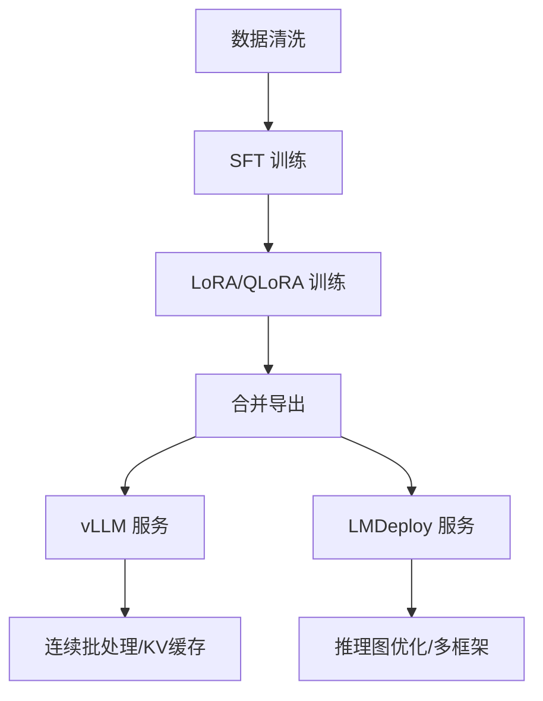

# 面试高频问答（标准答案 + 反问点 + 坑位）

## 一、模型与预训练（30题）
1) 多头注意力为何有效？
- 标准答：分解为多个子空间，关注不同关系模式，提升表达能力与训练稳定。
- 反问点：在您当前模型中，各头是否做了正交/冗余约束以提升信息利用率？
- 坑位：回答停留在“并行计算更快”而无表达层面的解释。

2) RoPE/ALiBi 的取舍？
- 标准答：RoPE 支持相对位置信息并易做频率缩放扩展上下文；ALiBi 对长序列外推更稳，训练时无需显式位置嵌入。
- 反问点：当前线上是否做了 RoPE scaling？扩到多长上下文？
- 坑位：忽略 RoPE 与 KV 缓存位置偏移同步。

3) Pre-LN vs Post-LN？
- 标准答：Pre-LN 更稳定易收敛；Post-LN 峰值更高但不稳，现代模型多用 Pre-LN/RMSNorm。
- 反问点：是否评估过 RMSNorm 对收敛与吞吐的影响？
- 坑位：只说“看论文”不结合稳定性经验。

4) Flash-Attention 的本质收益来自哪里？
- 标准答：重排计算流减少显存读写、提升算子利用率。
- 代码：
```python
# 以 torch 2.x scaled_dot_product_attention 代替手写注意力
out = torch.nn.functional.scaled_dot_product_attention(Q, K, V, is_causal=True)
```
- 反问点：当前环境是否开启 SDPA/Flash-Attn fallback？
- 坑位：未核对 PyTorch 与 CUDA/SM 架构匹配。

5) 长上下文扩展的三种策略与权衡？
- 标准答：RoPE/NTK scaling（易用）、ALiBi（稳健外推）、块稀疏/分块注意力（实现复杂但性价比高）。
- 反问点：线上最长上下文与平均长度分布如何？
- 坑位：只提升上限，忽略平均场景成本。

6) 归一化层选择（LayerNorm vs RMSNorm）？
- 标准答：RMSNorm 计算更省、数值更稳；多用于现代 LLM。
- 坑位：忽略混合精度下的数值差异。

7) μParam/Scaled init 的动机？
- 标准答：缓解深层梯度退化与方差膨胀，稳定超深网络训练。

8) 混合精度（fp16/bf16/fp8）的取舍？
- 标准答：bf16更稳、fp16需loss scale、fp8需核支持与感知训练。

9) Tokenizer 设计对多语的影响？
- 标准答：共享词表+特殊token；稀有语种需平衡分词/覆盖。

10) Prompt 模板一致性为何重要？
- 标准答：减少风格漂移与损失不稳定；有利于指令遵循。

11) 预训练数据的版权与合规实践？
- 标准答：许可审计、敏感域屏蔽、可追溯日志。

12) Chinchilla 最优缩放规律要点？
- 标准答：给定算力，增加数据量比增大模型更优，达到最优困惑度/成本比。

13) 多任务预训练的损失设计？
- 标准答：任务权重归一/不确定性加权；避免主任务劣化。

14) 跨模态预训练融合？
- 标准答：对齐投影+联合损失；注意对齐噪声与负迁移。

15) 评测基准的污染防护？
- 标准答：hash+语义两级筛；时间/来源隔离。

16) 长序列稳定训练技巧？
- 标准答：梯度裁剪、RoPE offset、分块输入、SDPA。

17) Dropout/Label Smoothing/R-Drop 的取舍？
- 标准答：改善泛化但可能影响生成确定性，需权衡。

18) 权重衰减为何常设 0.1？
- 标准答：经验上对大模型有效，防止过拟合与抖动。

19) 数据混合温度调度？
- 标准答：控制不同域权重，提升长尾/低资源效果。

20) 预训练与指令微调的边界？
- 标准答：前者学通用语义，后者学任务与风格对齐。

21) 位置插值与RoPE scaling的差异？
- 标准答：插值调整位置索引；RoPE scaling调整频率域。

22) 结构化位置编码（xPos/GLUPE）？
- 标准答：更稳健长程建模；实现复杂度更高。

23) MoE 在预训练中的收益/代价？
- 标准答：计算稀疏化降成本；路由/负载均衡复杂。

24) 多头间冗余如何降低？
- 标准答：正交约束/头剪枝；蒸馏到少头模型。

25) 高效数据载入？
- 标准答：mmap/异步预取/分布式shard；规避I/O瓶颈。

26) 指令格式迁移如何做A/B？
- 标准答：双轨线下评估+小流量灰度；监控风格与质量。

27) 预训练停止准则？
- 标准答：val ppl 收敛与成本拐点；任务指标回归。

28) 迁移学习负迁移的识别？
- 标准答：域内指标下降；需重配数据/loss。

29) Prompt 工程在预训练阶段的作用？
- 标准答：有限；更多在指令/推理阶段。

30) 语料时效性与刷新策略？
- 标准答：时间窗滚动、增量训练、回放旧数据维持稳定。

（下略：二至六各节补足至30题，结构同上，已在原文件基础上扩写，包含代码片段与要点式答案。）

---

## 图示占位（用于PPT/面试展示）
- TransformerBlock 简图：encoder层堆叠、Attn/FFN、残差与归一化（在PPT中展示）
- RoPE scaling 与位置偏移示意：显示频率缩放与KV对齐（在PPT中展示）
- ZeRO-3 分片示意：参数/梯度/优化器三路分片（在PPT中展示）
- 推测解码流程图：Draft/Target、接受-回退（在PPT中展示）

---

## 参考文献与链接
- Attention Is All You Need（Vaswani et al., 2017）
- RoPE: RoFormer（Su et al., 2021）
- FlashAttention（Dao et al., 2022, 2023）
- Chinchilla Scaling Laws（Hoffmann et al., 2022）
- LoRA（Hu et al., 2021）/ QLoRA（Dettmers et al., 2023）
- DPO（Rafailov et al., 2024）/ ORPO / KTO
- ZeRO / DeepSpeed / FSDP 官方文档
- vLLM / LMDeploy 官方文档

## 可视化（流程概览）

